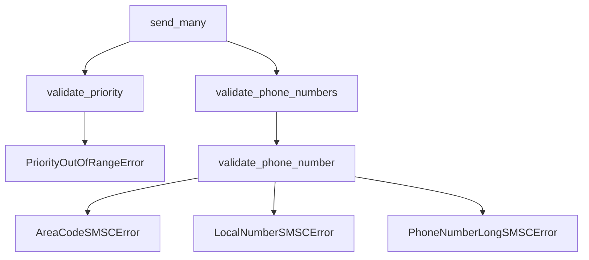
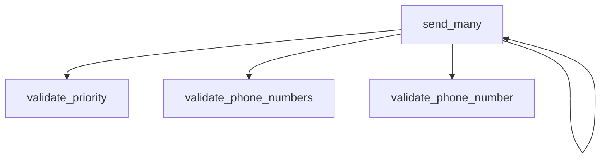

# Project Analysis Report


## Contents
1. [Overview](#overview)
2. [Function Relationships](#function-relationships)
3. [Code Analysis](#code-analysis)

## Overview
Total files analyzed: 10

## Function Relationships

### File: `setup.py`

### File: `test_utils.py`

#### Function: `test_is_limited`
**Signature:** ` None test_is_limited(self)`

**Operations:**
```python
Function test_is_limited Performs unit testing and Makes API requests and Validates input data and Handles string operations
```

**Dependencies:**
- Calls: `sms_is_limited`
- Called by: None

---

#### Function: `test_sms_length`
**Signature:** ` None test_sms_length(self)`

**Operations:**
```python
Function test_sms_length Performs unit testing and Makes API requests and Validates input data and Handles string operations
```

**Dependencies:**
- Calls: `len`, `sms_length`
- Called by: `temp_repo/tests/test_utils.py:test_sms_length`, `temp_repo/smsc/utils.py:sms_rest`, `temp_repo/smsc/utils.py:sms_length`, `temp_repo/tests/test_utils.py:test_sms_parse`, `temp_repo/tests/test_utils.py:test_sms_rest`, `temp_repo/smsc/utils.py:sms_parse`

---

#### Function: `test_sms_rest`
**Signature:** ` None test_sms_rest(self)`

**Operations:**
```python
Function test_sms_rest Performs unit testing and Makes API requests and Validates input data and Handles string operations
```

**Dependencies:**
- Calls: `sms_rest`, `len`
- Called by: `temp_repo/tests/test_utils.py:test_sms_rest`

---

#### Function: `test_sms_parse`
**Signature:** ` None test_sms_parse(self)`

**Operations:**
```python
Function test_sms_parse Performs unit testing and Makes API requests and Validates input data and Handles string operations
```

**Dependencies:**
- Calls: `len`, `sms_parse`
- Called by: `temp_repo/tests/test_utils.py:test_sms_parse`

---

### File: `test_functional.py`

#### Function: `test_send_mobile_number`
**Signature:** ` None test_send_mobile_number(self, mock_request)`

**Operations:**
```python
Function test_send_mobile_number Performs unit testing and Validates expected behavior and Makes API requests and Validates input data and Handles string operations and Performs comparisons
```

**Dependencies:**
- Calls: `MagicMock`, `SMSC`
- Called by: None

---

### File: `test_validations.py`

#### Function: `test_validate_code_area`
**Signature:** ` None test_validate_code_area(self)`

**Operations:**
```python
Function test_validate_code_area Performs unit testing and Makes API requests and Validates input data and Handles string operations
```

**Dependencies:**
- Calls: `validate_area_code`
- Called by: None

---

#### Function: `test_validate_local_number`
**Signature:** ` None test_validate_local_number(self)`

**Operations:**
```python
Function test_validate_local_number Performs unit testing and Makes API requests and Validates input data and Handles string operations
```

**Dependencies:**
- Calls: `validate_local_number`
- Called by: `temp_repo/tests/test_validations.py:test_validate_local_number`

---

#### Function: `test_validate_length_phone_number`
**Signature:** ` None test_validate_length_phone_number(self)`

**Operations:**
```python
Function test_validate_length_phone_number Performs unit testing and Makes API requests and Validates input data and Handles string operations
```

**Dependencies:**
- Calls: `validate_length_phone_number`
- Called by: `temp_repo/tests/test_validations.py:test_validate_length_phone_number`, `temp_repo/tests/test_utils.py:test_sms_length`, `temp_repo/smsc/utils.py:sms_rest`, `temp_repo/smsc/utils.py:sms_length`, `temp_repo/tests/test_utils.py:test_sms_parse`, `temp_repo/tests/test_utils.py:test_sms_rest`, `temp_repo/smsc/utils.py:sms_parse`

---

#### Function: `test_validate_phones`
**Signature:** ` None test_validate_phones(self)`

**Operations:**
```python
Function test_validate_phones Performs unit testing and Makes API requests and Validates input data and Handles string operations
```

**Dependencies:**
- Calls: `validate_phone_numbers`
- Called by: None

---

#### Function: `test_validate_priority`
**Signature:** ` None test_validate_priority(self)`

**Operations:**
```python
Function test_validate_priority Performs unit testing and Makes API requests and Validates input data and Handles string operations
```

**Dependencies:**
- Calls: `validate_priority`
- Called by: `temp_repo/smsc/smsc.py:send_many`, `temp_repo/smsc/smsc.py:send`, `temp_repo/tests/test_validations.py:test_validate_priority`

---

### File: `__init__.py`

### File: `validations.py`

#### Function: `validate_phone_number`
**Signature:** ` None validate_phone_number(area_code, local_number)`

**Operations:**
```python
Function validate_phone_number Performs unit testing and Makes API requests and Validates input data and Handles string operations and Performs comparisons
```

**Dependencies:**
- Calls: `AreaCodeSMSCError`, `LocalNumberSMSCError`, `PhoneNumberLongSMSCError`
- Called by: `temp_repo/smsc/validations.py:validate_phone_numbers`, `temp_repo/smsc/smsc.py:send`

---

#### Function: `validate_phone_numbers`
**Signature:** ` None validate_phone_numbers(phone_numbers)`

**Operations:**
```python
Function validate_phone_numbers Performs unit testing and Makes API requests and Validates input data and Handles string operations and Performs comparisons
```

**Dependencies:**
- Calls: `validate_phone_number`
- Called by: `temp_repo/smsc/validations.py:validate_phone_numbers`, `temp_repo/smsc/smsc.py:send_many`, `temp_repo/tests/test_validations.py:test_validate_phones`, `temp_repo/smsc/smsc.py:send`

---

#### Function: `validate_area_code`
**Signature:** ` None validate_area_code(area_code)`

**Operations:**
```python
Function validate_area_code Performs unit testing and Makes API requests and Validates input data and Handles string operations and Performs comparisons
```

**Dependencies:**
- Calls: `bool`
- Called by: `temp_repo/tests/test_validations.py:test_validate_code_area`

---

#### Function: `validate_local_number`
**Signature:** ` None validate_local_number(local_number)`

**Operations:**
```python
Function validate_local_number Performs unit testing and Makes API requests and Validates input data and Handles string operations and Performs comparisons
```

**Dependencies:**
- Calls: `bool`
- Called by: `temp_repo/tests/test_validations.py:test_validate_local_number`

---

#### Function: `validate_length_phone_number`
**Signature:** ` None validate_length_phone_number(phone_number)`

**Operations:**
```python
Function validate_length_phone_number Performs unit testing and Makes API requests and Validates input data and Handles string operations and Performs comparisons
```

**Dependencies:**
- Calls: `bool`
- Called by: `temp_repo/tests/test_validations.py:test_validate_length_phone_number`, `temp_repo/tests/test_utils.py:test_sms_length`, `temp_repo/smsc/utils.py:sms_rest`, `temp_repo/smsc/utils.py:sms_length`, `temp_repo/tests/test_utils.py:test_sms_parse`, `temp_repo/tests/test_utils.py:test_sms_rest`, `temp_repo/smsc/utils.py:sms_parse`

---

#### Function: `validate_priority`
**Signature:** ` None validate_priority(priority)`

**Operations:**
```python
Function validate_priority Performs unit testing and Makes API requests and Validates input data and Handles string operations and Performs comparisons
```

**Dependencies:**
- Calls: `PriorityOutOfRangeError`
- Called by: `temp_repo/smsc/smsc.py:send_many`, `temp_repo/smsc/smsc.py:send`, `temp_repo/tests/test_validations.py:test_validate_priority`

---

### File: `smsc.py`

#### Function: `__init__`
**Signature:** ` None __init__(self, alias, apikey, apiversion, lineid)`

**Operations:**
```python
Function __init__ Performs unit testing and Makes API requests and Validates input data and Handles string operations
```

**Dependencies:**
- Calls: None
- Called by: None

---

#### Function: `_url`
**Signature:** ` None _url(self, cmd, **kwargs)`

**Operations:**
```python
Function _url Performs unit testing and Makes API requests and Validates input data and Handles string operations
```

**Dependencies:**
- Calls: `dict`
- Called by: None

---

#### Function: `send`
**Signature:** ` None send(self, area_code, local_number, msg, time, priority)`

**Operations:**
```python
Function send Performs unit testing and Makes API requests and Validates input data and Handles string operations
```

**Dependencies:**
- Calls: `validate_priority`, `validate_phone_number`
- Called by: None

---

#### Function: `send_many`
**Signature:** ` None send_many(self, phone_numbers, msg, time, priority)`

**Operations:**
```python
Function send_many Performs unit testing and Makes API requests and Validates input data and Handles string operations
```

**Dependencies:**
- Calls: `validate_priority`, `validate_phone_numbers`
- Called by: None

---

#### Function: `sent`
**Signature:** ` None sent(self, last_id, max_id)`

**Operations:**
```python
Function sent Performs unit testing and Makes API requests and Validates input data and Handles string operations
```

**Dependencies:**
- Calls: None
- Called by: None

---

#### Function: `received`
**Signature:** ` None received(self, last_id)`

**Operations:**
```python
Function received Performs unit testing and Makes API requests and Validates input data and Handles string operations
```

**Dependencies:**
- Calls: None
- Called by: None

---

#### Function: `status`
**Signature:** ` None status(self)`

**Operations:**
```python
Function status Performs unit testing and Makes API requests and Validates input data and Handles string operations
```

**Dependencies:**
- Calls: None
- Called by: None

---

#### Function: `balance`
**Signature:** ` None balance(self)`

**Operations:**
```python
Function balance Performs unit testing and Makes API requests and Validates input data and Handles string operations
```

**Dependencies:**
- Calls: None
- Called by: None

---

#### Function: `cancel_queue`
**Signature:** ` None cancel_queue(self)`

**Operations:**
```python
Function cancel_queue Performs unit testing and Makes API requests and Validates input data and Handles string operations
```

**Dependencies:**
- Calls: None
- Called by: None

---

### File: `exceptions.py`

#### Function: `__init__`
**Signature:** ` None __init__(self, expr, msg)`

**Operations:**
```python
Function __init__ Basic function operations
```

**Dependencies:**
- Calls: None
- Called by: None

---

### File: `utils.py`

#### Function: `sms_is_limited`
**Signature:** ` None sms_is_limited(msg)`

**Operations:**
```python
Function sms_is_limited Performs unit testing and Makes API requests and Validates input data and Handles string operations and Performs comparisons
```

**Dependencies:**
- Calls: `ord`
- Called by: `temp_repo/tests/test_utils.py:test_is_limited`, `temp_repo/smsc/utils.py:sms_parse`, `temp_repo/smsc/utils.py:sms_length`, `temp_repo/smsc/utils.py:sms_rest`

---

#### Function: `sms_length`
**Signature:** ` None sms_length(msg)`

**Operations:**
```python
Function sms_length Performs unit testing and Makes API requests and Validates input data and Handles string operations and Performs comparisons
```

**Dependencies:**
- Calls: `sms_is_limited`, `len`
- Called by: `temp_repo/tests/test_utils.py:test_sms_length`, `temp_repo/smsc/utils.py:sms_rest`, `temp_repo/smsc/utils.py:sms_length`, `temp_repo/tests/test_utils.py:test_sms_parse`, `temp_repo/tests/test_utils.py:test_sms_rest`, `temp_repo/smsc/utils.py:sms_parse`

---

#### Function: `sms_rest`
**Signature:** ` None sms_rest(msg)`

**Operations:**
```python
Function sms_rest Performs unit testing and Makes API requests and Validates input data and Handles string operations and Performs comparisons
```

**Dependencies:**
- Calls: `sms_is_limited`, `len`
- Called by: `temp_repo/tests/test_utils.py:test_sms_rest`

---

#### Function: `sms_parse`
**Signature:** ` None sms_parse(msg, offset)`

**Operations:**
```python
Function sms_parse Performs unit testing and Makes API requests and Validates input data and Handles string operations and Performs comparisons
```

**Dependencies:**
- Calls: `sms_is_limited`, `len`, `range`
- Called by: `temp_repo/tests/test_utils.py:test_sms_parse`

---

### File: `__init__.py`


## Call Stack Visualization



### `test_is_limited`
**Location**: `test_utils.py`

<details>
<summary>Dependencies</summary>

#### Calls:
- `sms_is_limited`

#### Called By:
- No incoming calls
</details>

#### Analysis
```python
Function test_is_limited Performs unit testing and Makes API requests and Validates input data and Handles string operations
```

---

### `test_sms_length`
**Location**: `test_utils.py`

<details>
<summary>Dependencies</summary>

#### Calls:
- `len`
- `sms_length`

#### Called By:
- `temp_repo/tests/test_utils.py:test_sms_length`
- `temp_repo/smsc/utils.py:sms_rest`
- `temp_repo/smsc/utils.py:sms_length`
- `temp_repo/tests/test_utils.py:test_sms_parse`
- `temp_repo/tests/test_utils.py:test_sms_rest`
- `temp_repo/smsc/utils.py:sms_parse`
</details>

#### Analysis
```python
Function test_sms_length Performs unit testing and Makes API requests and Validates input data and Handles string operations
```

---

### `test_sms_rest`
**Location**: `test_utils.py`

<details>
<summary>Dependencies</summary>

#### Calls:
- `sms_rest`
- `len`

#### Called By:
- `temp_repo/tests/test_utils.py:test_sms_rest`
</details>

#### Analysis
```python
Function test_sms_rest Performs unit testing and Makes API requests and Validates input data and Handles string operations
```

---

### `test_sms_parse`
**Location**: `test_utils.py`

<details>
<summary>Dependencies</summary>

#### Calls:
- `len`
- `sms_parse`

#### Called By:
- `temp_repo/tests/test_utils.py:test_sms_parse`
</details>

#### Analysis
```python
Function test_sms_parse Performs unit testing and Makes API requests and Validates input data and Handles string operations
```

---

### `test_send_mobile_number`
**Location**: `test_functional.py`

<details>
<summary>Dependencies</summary>

#### Calls:
- `MagicMock`
- `SMSC`

#### Called By:
- No incoming calls
</details>

#### Analysis
```python
Function test_send_mobile_number Performs unit testing and Validates expected behavior and Makes API requests and Validates input data and Handles string operations and Performs comparisons
```

---

### `test_validate_code_area`
**Location**: `test_validations.py`

<details>
<summary>Dependencies</summary>

#### Calls:
- `validate_area_code`

#### Called By:
- No incoming calls
</details>

#### Analysis
```python
Function test_validate_code_area Performs unit testing and Makes API requests and Validates input data and Handles string operations
```

---

### `test_validate_local_number`
**Location**: `test_validations.py`

<details>
<summary>Dependencies</summary>

#### Calls:
- `validate_local_number`

#### Called By:
- `temp_repo/tests/test_validations.py:test_validate_local_number`
</details>

#### Analysis
```python
Function test_validate_local_number Performs unit testing and Makes API requests and Validates input data and Handles string operations
```

---

### `test_validate_length_phone_number`
**Location**: `test_validations.py`

<details>
<summary>Dependencies</summary>

#### Calls:
- `validate_length_phone_number`

#### Called By:
- `temp_repo/tests/test_validations.py:test_validate_length_phone_number`
- `temp_repo/tests/test_utils.py:test_sms_length`
- `temp_repo/smsc/utils.py:sms_rest`
- `temp_repo/smsc/utils.py:sms_length`
- `temp_repo/tests/test_utils.py:test_sms_parse`
- `temp_repo/tests/test_utils.py:test_sms_rest`
- `temp_repo/smsc/utils.py:sms_parse`
</details>

#### Analysis
```python
Function test_validate_length_phone_number Performs unit testing and Makes API requests and Validates input data and Handles string operations
```

---

### `test_validate_phones`
**Location**: `test_validations.py`

<details>
<summary>Dependencies</summary>

#### Calls:
- `validate_phone_numbers`

#### Called By:
- No incoming calls
</details>

#### Analysis
```python
Function test_validate_phones Performs unit testing and Makes API requests and Validates input data and Handles string operations
```

---

### `test_validate_priority`
**Location**: `test_validations.py`

<details>
<summary>Dependencies</summary>

#### Calls:
- `validate_priority`

#### Called By:
- `temp_repo/smsc/smsc.py:send_many`
- `temp_repo/smsc/smsc.py:send`
- `temp_repo/tests/test_validations.py:test_validate_priority`
</details>

#### Analysis
```python
Function test_validate_priority Performs unit testing and Makes API requests and Validates input data and Handles string operations
```

---

### `validate_phone_number`
**Location**: `validations.py`

<details>
<summary>Dependencies</summary>

#### Calls:
- `AreaCodeSMSCError`
- `LocalNumberSMSCError`
- `PhoneNumberLongSMSCError`

#### Called By:
- `temp_repo/smsc/validations.py:validate_phone_numbers`
- `temp_repo/smsc/smsc.py:send`
</details>

#### Analysis
```python
Function validate_phone_number Performs unit testing and Makes API requests and Validates input data and Handles string operations and Performs comparisons
```

---

### `validate_phone_numbers`
**Location**: `validations.py`

<details>
<summary>Dependencies</summary>

#### Calls:
- `validate_phone_number`

#### Called By:
- `temp_repo/smsc/validations.py:validate_phone_numbers`
- `temp_repo/smsc/smsc.py:send_many`
- `temp_repo/tests/test_validations.py:test_validate_phones`
- `temp_repo/smsc/smsc.py:send`
</details>

#### Analysis
```python
Function validate_phone_numbers Performs unit testing and Makes API requests and Validates input data and Handles string operations and Performs comparisons
```

---

### `validate_area_code`
**Location**: `validations.py`

<details>
<summary>Dependencies</summary>

#### Calls:
- `bool`

#### Called By:
- `temp_repo/tests/test_validations.py:test_validate_code_area`
</details>

#### Analysis
```python
Function validate_area_code Performs unit testing and Makes API requests and Validates input data and Handles string operations and Performs comparisons
```

---

### `validate_local_number`
**Location**: `validations.py`

<details>
<summary>Dependencies</summary>

#### Calls:
- `bool`

#### Called By:
- `temp_repo/tests/test_validations.py:test_validate_local_number`
</details>

#### Analysis
```python
Function validate_local_number Performs unit testing and Makes API requests and Validates input data and Handles string operations and Performs comparisons
```

---

### `validate_length_phone_number`
**Location**: `validations.py`

<details>
<summary>Dependencies</summary>

#### Calls:
- `bool`

#### Called By:
- `temp_repo/tests/test_validations.py:test_validate_length_phone_number`
- `temp_repo/tests/test_utils.py:test_sms_length`
- `temp_repo/smsc/utils.py:sms_rest`
- `temp_repo/smsc/utils.py:sms_length`
- `temp_repo/tests/test_utils.py:test_sms_parse`
- `temp_repo/tests/test_utils.py:test_sms_rest`
- `temp_repo/smsc/utils.py:sms_parse`
</details>

#### Analysis
```python
Function validate_length_phone_number Performs unit testing and Makes API requests and Validates input data and Handles string operations and Performs comparisons
```

---

### `validate_priority`
**Location**: `validations.py`

<details>
<summary>Dependencies</summary>

#### Calls:
- `PriorityOutOfRangeError`

#### Called By:
- `temp_repo/smsc/smsc.py:send_many`
- `temp_repo/smsc/smsc.py:send`
- `temp_repo/tests/test_validations.py:test_validate_priority`
</details>

#### Analysis
```python
Function validate_priority Performs unit testing and Makes API requests and Validates input data and Handles string operations and Performs comparisons
```

---

### `__init__`
**Location**: `smsc.py`

<details>
<summary>Dependencies</summary>

#### Calls:
- No outgoing calls

#### Called By:
- No incoming calls
</details>

#### Analysis
```python
Function __init__ Performs unit testing and Makes API requests and Validates input data and Handles string operations
```

---

### `_url`
**Location**: `smsc.py`

<details>
<summary>Dependencies</summary>

#### Calls:
- `dict`

#### Called By:
- No incoming calls
</details>

#### Analysis
```python
Function _url Performs unit testing and Makes API requests and Validates input data and Handles string operations
```

---

### `send`
**Location**: `smsc.py`

<details>
<summary>Dependencies</summary>

#### Calls:
- `validate_priority`
- `validate_phone_number`

#### Called By:
- No incoming calls
</details>

#### Analysis
```python
Function send Performs unit testing and Makes API requests and Validates input data and Handles string operations
```

---

### `send_many`
**Location**: `smsc.py`

<details>
<summary>Dependencies</summary>

#### Calls:
- `validate_priority`
- `validate_phone_numbers`

#### Called By:
- No incoming calls
</details>

#### Analysis
```python
Function send_many Performs unit testing and Makes API requests and Validates input data and Handles string operations
```

---

### `sent`
**Location**: `smsc.py`

<details>
<summary>Dependencies</summary>

#### Calls:
- No outgoing calls

#### Called By:
- No incoming calls
</details>

#### Analysis
```python
Function sent Performs unit testing and Makes API requests and Validates input data and Handles string operations
```

---

### `received`
**Location**: `smsc.py`

<details>
<summary>Dependencies</summary>

#### Calls:
- No outgoing calls

#### Called By:
- No incoming calls
</details>

#### Analysis
```python
Function received Performs unit testing and Makes API requests and Validates input data and Handles string operations
```

---

### `status`
**Location**: `smsc.py`

<details>
<summary>Dependencies</summary>

#### Calls:
- No outgoing calls

#### Called By:
- No incoming calls
</details>

#### Analysis
```python
Function status Performs unit testing and Makes API requests and Validates input data and Handles string operations
```

---

### `balance`
**Location**: `smsc.py`

<details>
<summary>Dependencies</summary>

#### Calls:
- No outgoing calls

#### Called By:
- No incoming calls
</details>

#### Analysis
```python
Function balance Performs unit testing and Makes API requests and Validates input data and Handles string operations
```

---

### `cancel_queue`
**Location**: `smsc.py`

<details>
<summary>Dependencies</summary>

#### Calls:
- No outgoing calls

#### Called By:
- No incoming calls
</details>

#### Analysis
```python
Function cancel_queue Performs unit testing and Makes API requests and Validates input data and Handles string operations
```

---

### `__init__`
**Location**: `exceptions.py`

<details>
<summary>Dependencies</summary>

#### Calls:
- No outgoing calls

#### Called By:
- No incoming calls
</details>

#### Analysis
```python
Function __init__ Basic function operations
```

---

### `sms_is_limited`
**Location**: `utils.py`

<details>
<summary>Dependencies</summary>

#### Calls:
- `ord`

#### Called By:
- `temp_repo/tests/test_utils.py:test_is_limited`
- `temp_repo/smsc/utils.py:sms_parse`
- `temp_repo/smsc/utils.py:sms_length`
- `temp_repo/smsc/utils.py:sms_rest`
</details>

#### Analysis
```python
Function sms_is_limited Performs unit testing and Makes API requests and Validates input data and Handles string operations and Performs comparisons
```

---

### `sms_length`
**Location**: `utils.py`

<details>
<summary>Dependencies</summary>

#### Calls:
- `sms_is_limited`
- `len`

#### Called By:
- `temp_repo/tests/test_utils.py:test_sms_length`
- `temp_repo/smsc/utils.py:sms_rest`
- `temp_repo/smsc/utils.py:sms_length`
- `temp_repo/tests/test_utils.py:test_sms_parse`
- `temp_repo/tests/test_utils.py:test_sms_rest`
- `temp_repo/smsc/utils.py:sms_parse`
</details>

#### Analysis
```python
Function sms_length Performs unit testing and Makes API requests and Validates input data and Handles string operations and Performs comparisons
```

---

### `sms_rest`
**Location**: `utils.py`

<details>
<summary>Dependencies</summary>

#### Calls:
- `sms_is_limited`
- `len`

#### Called By:
- `temp_repo/tests/test_utils.py:test_sms_rest`
</details>

#### Analysis
```python
Function sms_rest Performs unit testing and Makes API requests and Validates input data and Handles string operations and Performs comparisons
```

---

### `sms_parse`
**Location**: `utils.py`

<details>
<summary>Dependencies</summary>

#### Calls:
- `sms_is_limited`
- `len`
- `range`

#### Called By:
- `temp_repo/tests/test_utils.py:test_sms_parse`
</details>

#### Analysis
```python
Function sms_parse Performs unit testing and Makes API requests and Validates input data and Handles string operations and Performs comparisons
```

---


## Function Call Stacks


### Entry Point: `send_many`



## Code Analysis

### setup.py
```python
# File: temp_repo/setup.py
No description available
```

### test_utils.py
```python
# File: temp_repo/tests/test_utils.py
No description available
```

### test_functional.py
```python
# File: temp_repo/tests/test_functional.py
No description available
```

### test_validations.py
```python
# File: temp_repo/tests/test_validations.py
No description available
```

### __init__.py
```python
# File: temp_repo/tests/__init__.py
No description available
```

### validations.py
```python
# File: temp_repo/smsc/validations.py
No description available
```

### smsc.py
```python
# File: temp_repo/smsc/smsc.py
No description available
```

### exceptions.py
```python
# File: temp_repo/smsc/exceptions.py
No description available
```

### utils.py
```python
# File: temp_repo/smsc/utils.py
No description available
```

### __init__.py
```python
# File: temp_repo/smsc/__init__.py
No description available
```

## Function Call Stacks

### Entry Point: `send_many`


