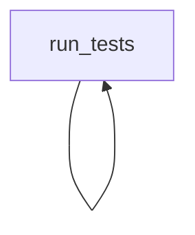

# Project Analysis Report


## Contents
1. [Overview](#overview)
2. [Function Relationships](#function-relationships)
3. [Code Analysis](#code-analysis)

## Overview
Total files analyzed: 9

## Function Relationships

### File: `setup.py`

#### Function: `get_file_content`
**Signature:** ` None get_file_content(file_name)`

**Operations:**
```python
Function get_file_content Performs unit testing and Makes API requests and Validates input data and Handles string operations and Performs comparisons
```

**Dependencies:**
- Calls: `open`
- Called by: None

---

#### Function: `initialize_options`
**Signature:** ` None initialize_options(self)`

**Operations:**
```python
Function initialize_options Makes API requests
```

**Dependencies:**
- Calls: None
- Called by: None

---

#### Function: `finalize_options`
**Signature:** ` None finalize_options(self)`

**Operations:**
```python
Function finalize_options Makes API requests
```

**Dependencies:**
- Calls: None
- Called by: None

---

#### Function: `run_tests`
**Signature:** ` None run_tests(self)`

**Operations:**
```python
Function run_tests Makes API requests
```

**Dependencies:**
- Calls: None
- Called by: None

---

### File: `conf.py`

### File: `test_smsc.py`

#### Function: `client`
**Signature:** ` None client()`

**Operations:**
```python
Function client Performs unit testing and Validates input data and Handles string operations
```

**Dependencies:**
- Calls: `SMSC`
- Called by: None

---

#### Function: `params`
**Signature:** ` None params()`

**Operations:**
```python
Function params Handles string operations
```

**Dependencies:**
- Calls: None
- Called by: None

---

#### Function: `test_client`
**Signature:** ` None test_client()`

**Operations:**
```python
Function test_client Performs unit testing and Validates expected behavior and Makes API requests and Validates input data and Handles string operations and Performs comparisons
```

**Dependencies:**
- Calls: `SMSC`, `str`
- Called by: None

---

#### Function: `test_message_sms`
**Signature:** ` None test_message_sms()`

**Operations:**
```python
Function test_message_sms Performs unit testing and Validates expected behavior and Makes API requests and Validates input data and Handles string operations and Performs comparisons
```

**Dependencies:**
- Calls: `len`, `str`, `isinstance`, `SMSMessage`
- Called by: None

---

#### Function: `test_sms_simple`
**Signature:** ` None test_sms_simple()`

**Operations:**
```python
Function test_sms_simple Performs unit testing and Validates expected behavior and Makes API requests and Validates input data and Handles string operations and Performs comparisons
```

**Dependencies:**
- Calls: `furl`, `str`, `isinstance`, `SMSMessage`
- Called by: None

---

#### Function: `test_sms_simple_fail`
**Signature:** ` None test_sms_simple_fail()`

**Operations:**
```python
Function test_sms_simple_fail Performs unit testing and Validates expected behavior and Makes API requests and Validates input data and Handles string operations and Performs comparisons
```

**Dependencies:**
- Calls: `furl`, `SMSMessage`
- Called by: None

---

#### Function: `test_sms_cost`
**Signature:** ` None test_sms_cost()`

**Operations:**
```python
Function test_sms_cost Performs unit testing and Validates expected behavior and Makes API requests and Validates input data and Handles string operations and Performs comparisons
```

**Dependencies:**
- Calls: `furl`, `str`, `isinstance`, `SMSMessage`
- Called by: None

---

#### Function: `test_sms_cost_fail`
**Signature:** ` None test_sms_cost_fail()`

**Operations:**
```python
Function test_sms_cost_fail Performs unit testing and Validates expected behavior and Makes API requests and Validates input data and Handles string operations and Performs comparisons
```

**Dependencies:**
- Calls: `furl`, `SMSMessage`
- Called by: None

---

#### Function: `test_sms_status`
**Signature:** ` None test_sms_status()`

**Operations:**
```python
Function test_sms_status Performs unit testing and Validates expected behavior and Makes API requests and Validates input data and Handles string operations and Performs comparisons
```

**Dependencies:**
- Calls: `furl`, `str`, `isinstance`, `len`
- Called by: None

---

#### Function: `test_sms_status_fail`
**Signature:** ` None test_sms_status_fail()`

**Operations:**
```python
Function test_sms_status_fail Performs unit testing and Validates expected behavior and Makes API requests and Validates input data and Handles string operations and Performs comparisons
```

**Dependencies:**
- Calls: `furl`
- Called by: None

---

#### Function: `test_get_balance`
**Signature:** ` None test_get_balance()`

**Operations:**
```python
Function test_get_balance Performs unit testing and Validates expected behavior and Makes API requests and Validates input data and Handles string operations and Performs comparisons
```

**Dependencies:**
- Calls: `furl`, `str`, `isinstance`
- Called by: None

---

#### Function: `test_get_balance_fail`
**Signature:** ` None test_get_balance_fail()`

**Operations:**
```python
Function test_get_balance_fail Performs unit testing and Validates expected behavior and Makes API requests and Validates input data and Handles string operations and Performs comparisons
```

**Dependencies:**
- Calls: `furl`
- Called by: None

---

#### Function: `test_viber`
**Signature:** ` None test_viber()`

**Operations:**
```python
Function test_viber Performs unit testing and Validates expected behavior and Makes API requests and Validates input data and Handles string operations and Performs comparisons
```

**Dependencies:**
- Calls: `ViberMessage`, `furl`, `str`, `isinstance`
- Called by: None

---

#### Function: `test_flash`
**Signature:** ` None test_flash()`

**Operations:**
```python
Function test_flash Performs unit testing and Validates expected behavior and Makes API requests and Validates input data and Handles string operations and Performs comparisons
```

**Dependencies:**
- Calls: `furl`, `str`, `isinstance`, `FlashMessage`
- Called by: None

---

#### Function: `test_sms_options`
**Signature:** ` None test_sms_options()`

**Operations:**
```python
Function test_sms_options Performs unit testing and Validates expected behavior and Makes API requests and Validates input data and Handles string operations and Performs comparisons
```

**Dependencies:**
- Calls: `furl`, `str`, `isinstance`, `SMSMessage`
- Called by: None

---

### File: `__version__.py`

### File: `exceptions.py`

### File: `api.py`

#### Function: `__init__`
**Signature:** ` None __init__(self)`

**Operations:**
```python
Function __init__ Performs unit testing and Makes API requests and Validates input data and Handles string operations and Performs comparisons
```

**Dependencies:**
- Calls: None
- Called by: None

---

#### Function: `__str__`
**Signature:** ` None __str__(self)`

**Operations:**
```python
Function __str__ Performs unit testing and Makes API requests and Validates input data and Handles string operations and Performs comparisons
```

**Dependencies:**
- Calls: None
- Called by: `temp_repo/tests/test_smsc.py:test_sms_simple`, `temp_repo/smsc/api.py:__repr__`, `temp_repo/tests/test_smsc.py:test_get_balance`, `temp_repo/smsc/api.py:send`, `temp_repo/smsc/responses.py:__init__`, `temp_repo/tests/test_smsc.py:test_flash`, `temp_repo/tests/test_smsc.py:test_sms_cost`, `temp_repo/smsc/api.py:get_balance`, `temp_repo/tests/test_smsc.py:test_message_sms`, `temp_repo/smsc/messages.py:__repr__`, `temp_repo/tests/test_smsc.py:test_sms_options`, `temp_repo/smsc/api.py:get_status`, `temp_repo/smsc/api.py:get_cost`, `temp_repo/tests/test_smsc.py:test_sms_status`, `temp_repo/smsc/responses.py:__repr__`, `temp_repo/tests/test_smsc.py:test_client`, `temp_repo/tests/test_smsc.py:test_viber`

---

#### Function: `__repr__`
**Signature:** ` None __repr__(self)`

**Operations:**
```python
Function __repr__ Performs unit testing and Makes API requests and Validates input data and Handles string operations and Performs comparisons
```

**Dependencies:**
- Calls: `str`
- Called by: None

---

#### Function: `__auth`
**Signature:** ` Dict[str, Any] __auth(self)`

**Operations:**
```python
Function __auth Handles string operations
```

**Dependencies:**
- Calls: None
- Called by: None

---

#### Function: `send`
**Signature:** ` SendResponse send(self)`

**Operations:**
```python
Function send Performs unit testing and Makes API requests and Validates input data and Handles string operations and Performs comparisons
```

**Dependencies:**
- Calls: `furl`, `SendResponse`, `str`, `isinstance`, `SendError`
- Called by: None

---

#### Function: `get_cost`
**Signature:** ` CostResponse get_cost(self)`

**Operations:**
```python
Function get_cost Performs unit testing and Makes API requests and Validates input data and Handles string operations and Performs comparisons
```

**Dependencies:**
- Calls: `furl`, `CostResponse`, `str`, `isinstance`, `GetCostError`
- Called by: None

---

#### Function: `get_status`
**Signature:** ` List[StatusResponse] get_status(self)`

**Operations:**
```python
Function get_status Performs unit testing and Makes API requests and Validates input data and Handles string operations and Performs comparisons
```

**Dependencies:**
- Calls: `GetStatusError`, `furl`, `StatusResponse`, `str`, `isinstance`
- Called by: None

---

#### Function: `get_balance`
**Signature:** ` BalanceResponse get_balance(self)`

**Operations:**
```python
Function get_balance Performs unit testing and Makes API requests and Validates input data and Handles string operations and Performs comparisons
```

**Dependencies:**
- Calls: `furl`, `str`, `BalanceResponse`, `GetBalanceError`
- Called by: None

---

### File: `__init__.py`

#### Function: `emit`
**Signature:** ` None emit(self, record)`

**Operations:**
```python
Function emit Handles string operations
```

**Dependencies:**
- Calls: None
- Called by: None

---

### File: `messages.py`

#### Function: `__init__`
**Signature:** ` None __init__(self)`

**Operations:**
```python
Function __init__ Performs unit testing and Makes API requests and Validates input data and Handles string operations and Performs comparisons
```

**Dependencies:**
- Calls: `super`, `len`
- Called by: None

---

#### Function: `format`
**Signature:** ` str format(self)`

**Operations:**
```python
Function format Handles string operations
```

**Dependencies:**
- Calls: None
- Called by: None

---

#### Function: `text`
**Signature:** ` str text(self)`

**Operations:**
```python
Function text Handles string operations
```

**Dependencies:**
- Calls: None
- Called by: None

---

#### Function: `encode`
**Signature:** ` Dict[str, Any] encode(self)`

**Operations:**
```python
Function encode Performs unit testing and Makes API requests and Validates input data and Handles string operations and Performs comparisons
```

**Dependencies:**
- Calls: None
- Called by: None

---

#### Function: `__str__`
**Signature:** ` str __str__(self)`

**Operations:**
```python
Function __str__ Performs unit testing and Makes API requests and Validates input data and Handles string operations and Performs comparisons
```

**Dependencies:**
- Calls: None
- Called by: `temp_repo/tests/test_smsc.py:test_sms_simple`, `temp_repo/smsc/api.py:__repr__`, `temp_repo/tests/test_smsc.py:test_get_balance`, `temp_repo/smsc/api.py:send`, `temp_repo/smsc/responses.py:__init__`, `temp_repo/tests/test_smsc.py:test_flash`, `temp_repo/tests/test_smsc.py:test_sms_cost`, `temp_repo/smsc/api.py:get_balance`, `temp_repo/tests/test_smsc.py:test_message_sms`, `temp_repo/smsc/messages.py:__repr__`, `temp_repo/tests/test_smsc.py:test_sms_options`, `temp_repo/smsc/api.py:get_status`, `temp_repo/smsc/api.py:get_cost`, `temp_repo/tests/test_smsc.py:test_sms_status`, `temp_repo/smsc/responses.py:__repr__`, `temp_repo/tests/test_smsc.py:test_client`, `temp_repo/tests/test_smsc.py:test_viber`

---

#### Function: `__repr__`
**Signature:** ` str __repr__(self)`

**Operations:**
```python
Function __repr__ Performs unit testing and Makes API requests and Validates input data and Handles string operations and Performs comparisons
```

**Dependencies:**
- Calls: `str`
- Called by: None

---

#### Function: `__init__`
**Signature:** ` None __init__(self)`

**Operations:**
```python
Function __init__ Performs unit testing and Validates expected behavior and Validates input data and Handles string operations and Performs comparisons
```

**Dependencies:**
- Calls: `super`, `len`
- Called by: None

---

#### Function: `__init__`
**Signature:** ` None __init__(self)`

**Operations:**
```python
Function __init__ Performs unit testing and Validates expected behavior and Validates input data and Handles string operations and Performs comparisons
```

**Dependencies:**
- Calls: `super`, `len`
- Called by: None

---

#### Function: `__init__`
**Signature:** ` None __init__(self)`

**Operations:**
```python
Function __init__ Performs unit testing and Validates expected behavior and Validates input data and Handles string operations and Performs comparisons
```

**Dependencies:**
- Calls: `super`, `len`
- Called by: None

---

### File: `responses.py`

#### Function: `__init__`
**Signature:** ` None __init__(self)`

**Operations:**
```python
Function __init__ Performs unit testing and Makes API requests and Validates input data and Handles string operations
```

**Dependencies:**
- Calls: `str`, `super`, `float`
- Called by: None

---

#### Function: `__str__`
**Signature:** ` str __str__(self)`

**Operations:**
```python
Function __str__ Performs unit testing and Makes API requests and Validates input data and Handles string operations
```

**Dependencies:**
- Calls: None
- Called by: `temp_repo/tests/test_smsc.py:test_sms_simple`, `temp_repo/smsc/api.py:__repr__`, `temp_repo/tests/test_smsc.py:test_get_balance`, `temp_repo/smsc/api.py:send`, `temp_repo/smsc/responses.py:__init__`, `temp_repo/tests/test_smsc.py:test_flash`, `temp_repo/tests/test_smsc.py:test_sms_cost`, `temp_repo/smsc/api.py:get_balance`, `temp_repo/tests/test_smsc.py:test_message_sms`, `temp_repo/smsc/messages.py:__repr__`, `temp_repo/tests/test_smsc.py:test_sms_options`, `temp_repo/smsc/api.py:get_status`, `temp_repo/smsc/api.py:get_cost`, `temp_repo/tests/test_smsc.py:test_sms_status`, `temp_repo/smsc/responses.py:__repr__`, `temp_repo/tests/test_smsc.py:test_client`, `temp_repo/tests/test_smsc.py:test_viber`

---

#### Function: `__repr__`
**Signature:** ` str __repr__(self)`

**Operations:**
```python
Function __repr__ Performs unit testing and Makes API requests and Validates input data and Handles string operations
```

**Dependencies:**
- Calls: `str`
- Called by: None

---

#### Function: `status_id`
**Signature:** ` int status_id(self)`

**Operations:**
```python
Function status_id Handles string operations
```

**Dependencies:**
- Calls: None
- Called by: None

---

#### Function: `name`
**Signature:** ` str name(self)`

**Operations:**
```python
Function name Handles string operations
```

**Dependencies:**
- Calls: None
- Called by: None

---

#### Function: `__init__`
**Signature:** ` None __init__(self)`

**Operations:**
```python
Function __init__ Performs unit testing and Makes API requests and Validates input data and Handles string operations
```

**Dependencies:**
- Calls: `str`, `super`, `float`
- Called by: None

---

#### Function: `error`
**Signature:** ` Optional[SMSCError] error(self)`

**Operations:**
```python
Function error Performs unit testing and Validates input data and Handles string operations
```

**Dependencies:**
- Calls: `SMSCError`
- Called by: None

---

#### Function: `__init__`
**Signature:** ` None __init__(self)`

**Operations:**
```python
Function __init__ Performs unit testing and Makes API requests and Validates input data and Handles string operations
```

**Dependencies:**
- Calls: `str`, `super`, `float`
- Called by: None

---

#### Function: `__str__`
**Signature:** ` str __str__(self)`

**Operations:**
```python
Function __str__ Performs unit testing and Makes API requests and Validates input data and Handles string operations
```

**Dependencies:**
- Calls: None
- Called by: `temp_repo/tests/test_smsc.py:test_sms_simple`, `temp_repo/smsc/api.py:__repr__`, `temp_repo/tests/test_smsc.py:test_get_balance`, `temp_repo/smsc/api.py:send`, `temp_repo/smsc/responses.py:__init__`, `temp_repo/tests/test_smsc.py:test_flash`, `temp_repo/tests/test_smsc.py:test_sms_cost`, `temp_repo/smsc/api.py:get_balance`, `temp_repo/tests/test_smsc.py:test_message_sms`, `temp_repo/smsc/messages.py:__repr__`, `temp_repo/tests/test_smsc.py:test_sms_options`, `temp_repo/smsc/api.py:get_status`, `temp_repo/smsc/api.py:get_cost`, `temp_repo/tests/test_smsc.py:test_sms_status`, `temp_repo/smsc/responses.py:__repr__`, `temp_repo/tests/test_smsc.py:test_client`, `temp_repo/tests/test_smsc.py:test_viber`

---

#### Function: `__repr__`
**Signature:** ` str __repr__(self)`

**Operations:**
```python
Function __repr__ Performs unit testing and Makes API requests and Validates input data and Handles string operations
```

**Dependencies:**
- Calls: `str`
- Called by: None

---

#### Function: `message_id`
**Signature:** ` str message_id(self)`

**Operations:**
```python
Function message_id Handles string operations
```

**Dependencies:**
- Calls: None
- Called by: None

---

#### Function: `count`
**Signature:** ` int count(self)`

**Operations:**
```python
Function count Handles string operations
```

**Dependencies:**
- Calls: None
- Called by: None

---

#### Function: `cost`
**Signature:** ` float cost(self)`

**Operations:**
```python
Function cost Handles string operations
```

**Dependencies:**
- Calls: None
- Called by: None

---

#### Function: `__init__`
**Signature:** ` None __init__(self)`

**Operations:**
```python
Function __init__ Performs unit testing and Makes API requests and Validates input data and Handles string operations
```

**Dependencies:**
- Calls: `str`, `super`, `float`
- Called by: None

---

#### Function: `__str__`
**Signature:** ` None __str__(self)`

**Operations:**
```python
Function __str__ Performs unit testing and Makes API requests and Validates input data and Handles string operations
```

**Dependencies:**
- Calls: None
- Called by: `temp_repo/tests/test_smsc.py:test_sms_simple`, `temp_repo/smsc/api.py:__repr__`, `temp_repo/tests/test_smsc.py:test_get_balance`, `temp_repo/smsc/api.py:send`, `temp_repo/smsc/responses.py:__init__`, `temp_repo/tests/test_smsc.py:test_flash`, `temp_repo/tests/test_smsc.py:test_sms_cost`, `temp_repo/smsc/api.py:get_balance`, `temp_repo/tests/test_smsc.py:test_message_sms`, `temp_repo/smsc/messages.py:__repr__`, `temp_repo/tests/test_smsc.py:test_sms_options`, `temp_repo/smsc/api.py:get_status`, `temp_repo/smsc/api.py:get_cost`, `temp_repo/tests/test_smsc.py:test_sms_status`, `temp_repo/smsc/responses.py:__repr__`, `temp_repo/tests/test_smsc.py:test_client`, `temp_repo/tests/test_smsc.py:test_viber`

---

#### Function: `__repr__`
**Signature:** ` str __repr__(self)`

**Operations:**
```python
Function __repr__ Performs unit testing and Makes API requests and Validates input data and Handles string operations
```

**Dependencies:**
- Calls: `str`
- Called by: None

---

#### Function: `count`
**Signature:** ` int count(self)`

**Operations:**
```python
Function count Handles string operations
```

**Dependencies:**
- Calls: None
- Called by: None

---

#### Function: `cost`
**Signature:** ` float cost(self)`

**Operations:**
```python
Function cost Handles string operations
```

**Dependencies:**
- Calls: None
- Called by: None

---

#### Function: `__init__`
**Signature:** ` None __init__(self)`

**Operations:**
```python
Function __init__ Performs unit testing and Makes API requests and Validates input data and Handles string operations and Performs comparisons
```

**Dependencies:**
- Calls: `str`, `super`, `float`
- Called by: None

---

#### Function: `__str__`
**Signature:** ` str __str__(self)`

**Operations:**
```python
Function __str__ Performs unit testing and Makes API requests and Validates input data and Handles string operations and Performs comparisons
```

**Dependencies:**
- Calls: None
- Called by: `temp_repo/tests/test_smsc.py:test_sms_simple`, `temp_repo/smsc/api.py:__repr__`, `temp_repo/tests/test_smsc.py:test_get_balance`, `temp_repo/smsc/api.py:send`, `temp_repo/smsc/responses.py:__init__`, `temp_repo/tests/test_smsc.py:test_flash`, `temp_repo/tests/test_smsc.py:test_sms_cost`, `temp_repo/smsc/api.py:get_balance`, `temp_repo/tests/test_smsc.py:test_message_sms`, `temp_repo/smsc/messages.py:__repr__`, `temp_repo/tests/test_smsc.py:test_sms_options`, `temp_repo/smsc/api.py:get_status`, `temp_repo/smsc/api.py:get_cost`, `temp_repo/tests/test_smsc.py:test_sms_status`, `temp_repo/smsc/responses.py:__repr__`, `temp_repo/tests/test_smsc.py:test_client`, `temp_repo/tests/test_smsc.py:test_viber`

---

#### Function: `__repr__`
**Signature:** ` str __repr__(self)`

**Operations:**
```python
Function __repr__ Performs unit testing and Makes API requests and Validates input data and Handles string operations and Performs comparisons
```

**Dependencies:**
- Calls: `str`
- Called by: None

---

#### Function: `status`
**Signature:** ` Status status(self)`

**Operations:**
```python
Function status Handles string operations
```

**Dependencies:**
- Calls: None
- Called by: None

---

#### Function: `data`
**Signature:** ` Dict[str, Any] data(self)`

**Operations:**
```python
Function data Handles string operations
```

**Dependencies:**
- Calls: None
- Called by: None

---

#### Function: `__init__`
**Signature:** ` None __init__(self)`

**Operations:**
```python
Function __init__ Performs unit testing and Makes API requests and Validates input data and Handles string operations
```

**Dependencies:**
- Calls: `str`, `super`, `float`
- Called by: None

---

#### Function: `__str__`
**Signature:** ` str __str__(self)`

**Operations:**
```python
Function __str__ Performs unit testing and Makes API requests and Validates input data and Handles string operations
```

**Dependencies:**
- Calls: None
- Called by: `temp_repo/tests/test_smsc.py:test_sms_simple`, `temp_repo/smsc/api.py:__repr__`, `temp_repo/tests/test_smsc.py:test_get_balance`, `temp_repo/smsc/api.py:send`, `temp_repo/smsc/responses.py:__init__`, `temp_repo/tests/test_smsc.py:test_flash`, `temp_repo/tests/test_smsc.py:test_sms_cost`, `temp_repo/smsc/api.py:get_balance`, `temp_repo/tests/test_smsc.py:test_message_sms`, `temp_repo/smsc/messages.py:__repr__`, `temp_repo/tests/test_smsc.py:test_sms_options`, `temp_repo/smsc/api.py:get_status`, `temp_repo/smsc/api.py:get_cost`, `temp_repo/tests/test_smsc.py:test_sms_status`, `temp_repo/smsc/responses.py:__repr__`, `temp_repo/tests/test_smsc.py:test_client`, `temp_repo/tests/test_smsc.py:test_viber`

---

#### Function: `__repr__`
**Signature:** ` str __repr__(self)`

**Operations:**
```python
Function __repr__ Performs unit testing and Makes API requests and Validates input data and Handles string operations
```

**Dependencies:**
- Calls: `str`
- Called by: None

---

#### Function: `balance`
**Signature:** ` float balance(self)`

**Operations:**
```python
Function balance Handles string operations
```

**Dependencies:**
- Calls: None
- Called by: None

---

#### Function: `credit`
**Signature:** ` float credit(self)`

**Operations:**
```python
Function credit Handles string operations
```

**Dependencies:**
- Calls: None
- Called by: None

---

#### Function: `currency`
**Signature:** ` str currency(self)`

**Operations:**
```python
Function currency Handles string operations
```

**Dependencies:**
- Calls: None
- Called by: None

---


## Call Stack Visualization

```mermaid
flowchart TD
```

### `get_file_content`
**Location**: `setup.py`

<details>
<summary>Dependencies</summary>

#### Calls:
- `open`

#### Called By:
- No incoming calls
</details>

#### Analysis
```python
Function get_file_content Performs unit testing and Makes API requests and Validates input data and Handles string operations and Performs comparisons
```

---

### `initialize_options`
**Location**: `setup.py`

<details>
<summary>Dependencies</summary>

#### Calls:
- No outgoing calls

#### Called By:
- No incoming calls
</details>

#### Analysis
```python
Function initialize_options Makes API requests
```

---

### `finalize_options`
**Location**: `setup.py`

<details>
<summary>Dependencies</summary>

#### Calls:
- No outgoing calls

#### Called By:
- No incoming calls
</details>

#### Analysis
```python
Function finalize_options Makes API requests
```

---

### `run_tests`
**Location**: `setup.py`

<details>
<summary>Dependencies</summary>

#### Calls:
- No outgoing calls

#### Called By:
- No incoming calls
</details>

#### Analysis
```python
Function run_tests Makes API requests
```

---

### `client`
**Location**: `test_smsc.py`

<details>
<summary>Dependencies</summary>

#### Calls:
- `SMSC`

#### Called By:
- No incoming calls
</details>

#### Analysis
```python
Function client Performs unit testing and Validates input data and Handles string operations
```

---

### `params`
**Location**: `test_smsc.py`

<details>
<summary>Dependencies</summary>

#### Calls:
- No outgoing calls

#### Called By:
- No incoming calls
</details>

#### Analysis
```python
Function params Handles string operations
```

---

### `test_client`
**Location**: `test_smsc.py`

<details>
<summary>Dependencies</summary>

#### Calls:
- `SMSC`
- `str`

#### Called By:
- No incoming calls
</details>

#### Analysis
```python
Function test_client Performs unit testing and Validates expected behavior and Makes API requests and Validates input data and Handles string operations and Performs comparisons
```

---

### `test_message_sms`
**Location**: `test_smsc.py`

<details>
<summary>Dependencies</summary>

#### Calls:
- `len`
- `str`
- `isinstance`
- `SMSMessage`

#### Called By:
- No incoming calls
</details>

#### Analysis
```python
Function test_message_sms Performs unit testing and Validates expected behavior and Makes API requests and Validates input data and Handles string operations and Performs comparisons
```

---

### `test_sms_simple`
**Location**: `test_smsc.py`

<details>
<summary>Dependencies</summary>

#### Calls:
- `furl`
- `str`
- `isinstance`
- `SMSMessage`

#### Called By:
- No incoming calls
</details>

#### Analysis
```python
Function test_sms_simple Performs unit testing and Validates expected behavior and Makes API requests and Validates input data and Handles string operations and Performs comparisons
```

---

### `test_sms_simple_fail`
**Location**: `test_smsc.py`

<details>
<summary>Dependencies</summary>

#### Calls:
- `furl`
- `SMSMessage`

#### Called By:
- No incoming calls
</details>

#### Analysis
```python
Function test_sms_simple_fail Performs unit testing and Validates expected behavior and Makes API requests and Validates input data and Handles string operations and Performs comparisons
```

---

### `test_sms_cost`
**Location**: `test_smsc.py`

<details>
<summary>Dependencies</summary>

#### Calls:
- `furl`
- `str`
- `isinstance`
- `SMSMessage`

#### Called By:
- No incoming calls
</details>

#### Analysis
```python
Function test_sms_cost Performs unit testing and Validates expected behavior and Makes API requests and Validates input data and Handles string operations and Performs comparisons
```

---

### `test_sms_cost_fail`
**Location**: `test_smsc.py`

<details>
<summary>Dependencies</summary>

#### Calls:
- `furl`
- `SMSMessage`

#### Called By:
- No incoming calls
</details>

#### Analysis
```python
Function test_sms_cost_fail Performs unit testing and Validates expected behavior and Makes API requests and Validates input data and Handles string operations and Performs comparisons
```

---

### `test_sms_status`
**Location**: `test_smsc.py`

<details>
<summary>Dependencies</summary>

#### Calls:
- `furl`
- `str`
- `isinstance`
- `len`

#### Called By:
- No incoming calls
</details>

#### Analysis
```python
Function test_sms_status Performs unit testing and Validates expected behavior and Makes API requests and Validates input data and Handles string operations and Performs comparisons
```

---

### `test_sms_status_fail`
**Location**: `test_smsc.py`

<details>
<summary>Dependencies</summary>

#### Calls:
- `furl`

#### Called By:
- No incoming calls
</details>

#### Analysis
```python
Function test_sms_status_fail Performs unit testing and Validates expected behavior and Makes API requests and Validates input data and Handles string operations and Performs comparisons
```

---

### `test_get_balance`
**Location**: `test_smsc.py`

<details>
<summary>Dependencies</summary>

#### Calls:
- `furl`
- `str`
- `isinstance`

#### Called By:
- No incoming calls
</details>

#### Analysis
```python
Function test_get_balance Performs unit testing and Validates expected behavior and Makes API requests and Validates input data and Handles string operations and Performs comparisons
```

---

### `test_get_balance_fail`
**Location**: `test_smsc.py`

<details>
<summary>Dependencies</summary>

#### Calls:
- `furl`

#### Called By:
- No incoming calls
</details>

#### Analysis
```python
Function test_get_balance_fail Performs unit testing and Validates expected behavior and Makes API requests and Validates input data and Handles string operations and Performs comparisons
```

---

### `test_viber`
**Location**: `test_smsc.py`

<details>
<summary>Dependencies</summary>

#### Calls:
- `ViberMessage`
- `furl`
- `str`
- `isinstance`

#### Called By:
- No incoming calls
</details>

#### Analysis
```python
Function test_viber Performs unit testing and Validates expected behavior and Makes API requests and Validates input data and Handles string operations and Performs comparisons
```

---

### `test_flash`
**Location**: `test_smsc.py`

<details>
<summary>Dependencies</summary>

#### Calls:
- `furl`
- `str`
- `isinstance`
- `FlashMessage`

#### Called By:
- No incoming calls
</details>

#### Analysis
```python
Function test_flash Performs unit testing and Validates expected behavior and Makes API requests and Validates input data and Handles string operations and Performs comparisons
```

---

### `test_sms_options`
**Location**: `test_smsc.py`

<details>
<summary>Dependencies</summary>

#### Calls:
- `furl`
- `str`
- `isinstance`
- `SMSMessage`

#### Called By:
- No incoming calls
</details>

#### Analysis
```python
Function test_sms_options Performs unit testing and Validates expected behavior and Makes API requests and Validates input data and Handles string operations and Performs comparisons
```

---

### `__init__`
**Location**: `api.py`

<details>
<summary>Dependencies</summary>

#### Calls:
- No outgoing calls

#### Called By:
- No incoming calls
</details>

#### Analysis
```python
Function __init__ Performs unit testing and Makes API requests and Validates input data and Handles string operations and Performs comparisons
```

---

### `__str__`
**Location**: `api.py`

<details>
<summary>Dependencies</summary>

#### Calls:
- No outgoing calls

#### Called By:
- `temp_repo/tests/test_smsc.py:test_sms_simple`
- `temp_repo/smsc/api.py:__repr__`
- `temp_repo/tests/test_smsc.py:test_get_balance`
- `temp_repo/smsc/api.py:send`
- `temp_repo/smsc/responses.py:__init__`
- `temp_repo/tests/test_smsc.py:test_flash`
- `temp_repo/tests/test_smsc.py:test_sms_cost`
- `temp_repo/smsc/api.py:get_balance`
- `temp_repo/tests/test_smsc.py:test_message_sms`
- `temp_repo/smsc/messages.py:__repr__`
- `temp_repo/tests/test_smsc.py:test_sms_options`
- `temp_repo/smsc/api.py:get_status`
- `temp_repo/smsc/api.py:get_cost`
- `temp_repo/tests/test_smsc.py:test_sms_status`
- `temp_repo/smsc/responses.py:__repr__`
- `temp_repo/tests/test_smsc.py:test_client`
- `temp_repo/tests/test_smsc.py:test_viber`
</details>

#### Analysis
```python
Function __str__ Performs unit testing and Makes API requests and Validates input data and Handles string operations and Performs comparisons
```

---

### `__repr__`
**Location**: `api.py`

<details>
<summary>Dependencies</summary>

#### Calls:
- `str`

#### Called By:
- No incoming calls
</details>

#### Analysis
```python
Function __repr__ Performs unit testing and Makes API requests and Validates input data and Handles string operations and Performs comparisons
```

---

### `__auth`
**Location**: `api.py`

<details>
<summary>Dependencies</summary>

#### Calls:
- No outgoing calls

#### Called By:
- No incoming calls
</details>

#### Analysis
```python
Function __auth Handles string operations
```

---

### `send`
**Location**: `api.py`

<details>
<summary>Dependencies</summary>

#### Calls:
- `furl`
- `SendResponse`
- `str`
- `isinstance`
- `SendError`

#### Called By:
- No incoming calls
</details>

#### Analysis
```python
Function send Performs unit testing and Makes API requests and Validates input data and Handles string operations and Performs comparisons
```

---

### `get_cost`
**Location**: `api.py`

<details>
<summary>Dependencies</summary>

#### Calls:
- `furl`
- `CostResponse`
- `str`
- `isinstance`
- `GetCostError`

#### Called By:
- No incoming calls
</details>

#### Analysis
```python
Function get_cost Performs unit testing and Makes API requests and Validates input data and Handles string operations and Performs comparisons
```

---

### `get_status`
**Location**: `api.py`

<details>
<summary>Dependencies</summary>

#### Calls:
- `GetStatusError`
- `furl`
- `StatusResponse`
- `str`
- `isinstance`

#### Called By:
- No incoming calls
</details>

#### Analysis
```python
Function get_status Performs unit testing and Makes API requests and Validates input data and Handles string operations and Performs comparisons
```

---

### `get_balance`
**Location**: `api.py`

<details>
<summary>Dependencies</summary>

#### Calls:
- `furl`
- `str`
- `BalanceResponse`
- `GetBalanceError`

#### Called By:
- No incoming calls
</details>

#### Analysis
```python
Function get_balance Performs unit testing and Makes API requests and Validates input data and Handles string operations and Performs comparisons
```

---

### `emit`
**Location**: `__init__.py`

<details>
<summary>Dependencies</summary>

#### Calls:
- No outgoing calls

#### Called By:
- No incoming calls
</details>

#### Analysis
```python
Function emit Handles string operations
```

---

### `__init__`
**Location**: `messages.py`

<details>
<summary>Dependencies</summary>

#### Calls:
- `super`
- `len`

#### Called By:
- No incoming calls
</details>

#### Analysis
```python
Function __init__ Performs unit testing and Makes API requests and Validates input data and Handles string operations and Performs comparisons
```

---

### `format`
**Location**: `messages.py`

<details>
<summary>Dependencies</summary>

#### Calls:
- No outgoing calls

#### Called By:
- No incoming calls
</details>

#### Analysis
```python
Function format Handles string operations
```

---

### `text`
**Location**: `messages.py`

<details>
<summary>Dependencies</summary>

#### Calls:
- No outgoing calls

#### Called By:
- No incoming calls
</details>

#### Analysis
```python
Function text Handles string operations
```

---

### `encode`
**Location**: `messages.py`

<details>
<summary>Dependencies</summary>

#### Calls:
- No outgoing calls

#### Called By:
- No incoming calls
</details>

#### Analysis
```python
Function encode Performs unit testing and Makes API requests and Validates input data and Handles string operations and Performs comparisons
```

---

### `__str__`
**Location**: `messages.py`

<details>
<summary>Dependencies</summary>

#### Calls:
- No outgoing calls

#### Called By:
- `temp_repo/tests/test_smsc.py:test_sms_simple`
- `temp_repo/smsc/api.py:__repr__`
- `temp_repo/tests/test_smsc.py:test_get_balance`
- `temp_repo/smsc/api.py:send`
- `temp_repo/smsc/responses.py:__init__`
- `temp_repo/tests/test_smsc.py:test_flash`
- `temp_repo/tests/test_smsc.py:test_sms_cost`
- `temp_repo/smsc/api.py:get_balance`
- `temp_repo/tests/test_smsc.py:test_message_sms`
- `temp_repo/smsc/messages.py:__repr__`
- `temp_repo/tests/test_smsc.py:test_sms_options`
- `temp_repo/smsc/api.py:get_status`
- `temp_repo/smsc/api.py:get_cost`
- `temp_repo/tests/test_smsc.py:test_sms_status`
- `temp_repo/smsc/responses.py:__repr__`
- `temp_repo/tests/test_smsc.py:test_client`
- `temp_repo/tests/test_smsc.py:test_viber`
</details>

#### Analysis
```python
Function __str__ Performs unit testing and Makes API requests and Validates input data and Handles string operations and Performs comparisons
```

---

### `__repr__`
**Location**: `messages.py`

<details>
<summary>Dependencies</summary>

#### Calls:
- `str`

#### Called By:
- No incoming calls
</details>

#### Analysis
```python
Function __repr__ Performs unit testing and Makes API requests and Validates input data and Handles string operations and Performs comparisons
```

---

### `__init__`
**Location**: `messages.py`

<details>
<summary>Dependencies</summary>

#### Calls:
- `super`
- `len`

#### Called By:
- No incoming calls
</details>

#### Analysis
```python
Function __init__ Performs unit testing and Validates expected behavior and Validates input data and Handles string operations and Performs comparisons
```

---

### `__init__`
**Location**: `messages.py`

<details>
<summary>Dependencies</summary>

#### Calls:
- `super`
- `len`

#### Called By:
- No incoming calls
</details>

#### Analysis
```python
Function __init__ Performs unit testing and Validates expected behavior and Validates input data and Handles string operations and Performs comparisons
```

---

### `__init__`
**Location**: `messages.py`

<details>
<summary>Dependencies</summary>

#### Calls:
- `super`
- `len`

#### Called By:
- No incoming calls
</details>

#### Analysis
```python
Function __init__ Performs unit testing and Validates expected behavior and Validates input data and Handles string operations and Performs comparisons
```

---

### `__init__`
**Location**: `responses.py`

<details>
<summary>Dependencies</summary>

#### Calls:
- `str`
- `super`
- `float`

#### Called By:
- No incoming calls
</details>

#### Analysis
```python
Function __init__ Performs unit testing and Makes API requests and Validates input data and Handles string operations
```

---

### `__str__`
**Location**: `responses.py`

<details>
<summary>Dependencies</summary>

#### Calls:
- No outgoing calls

#### Called By:
- `temp_repo/tests/test_smsc.py:test_sms_simple`
- `temp_repo/smsc/api.py:__repr__`
- `temp_repo/tests/test_smsc.py:test_get_balance`
- `temp_repo/smsc/api.py:send`
- `temp_repo/smsc/responses.py:__init__`
- `temp_repo/tests/test_smsc.py:test_flash`
- `temp_repo/tests/test_smsc.py:test_sms_cost`
- `temp_repo/smsc/api.py:get_balance`
- `temp_repo/tests/test_smsc.py:test_message_sms`
- `temp_repo/smsc/messages.py:__repr__`
- `temp_repo/tests/test_smsc.py:test_sms_options`
- `temp_repo/smsc/api.py:get_status`
- `temp_repo/smsc/api.py:get_cost`
- `temp_repo/tests/test_smsc.py:test_sms_status`
- `temp_repo/smsc/responses.py:__repr__`
- `temp_repo/tests/test_smsc.py:test_client`
- `temp_repo/tests/test_smsc.py:test_viber`
</details>

#### Analysis
```python
Function __str__ Performs unit testing and Makes API requests and Validates input data and Handles string operations
```

---

### `__repr__`
**Location**: `responses.py`

<details>
<summary>Dependencies</summary>

#### Calls:
- `str`

#### Called By:
- No incoming calls
</details>

#### Analysis
```python
Function __repr__ Performs unit testing and Makes API requests and Validates input data and Handles string operations
```

---

### `status_id`
**Location**: `responses.py`

<details>
<summary>Dependencies</summary>

#### Calls:
- No outgoing calls

#### Called By:
- No incoming calls
</details>

#### Analysis
```python
Function status_id Handles string operations
```

---

### `name`
**Location**: `responses.py`

<details>
<summary>Dependencies</summary>

#### Calls:
- No outgoing calls

#### Called By:
- No incoming calls
</details>

#### Analysis
```python
Function name Handles string operations
```

---

### `__init__`
**Location**: `responses.py`

<details>
<summary>Dependencies</summary>

#### Calls:
- `str`
- `super`
- `float`

#### Called By:
- No incoming calls
</details>

#### Analysis
```python
Function __init__ Performs unit testing and Makes API requests and Validates input data and Handles string operations
```

---

### `error`
**Location**: `responses.py`

<details>
<summary>Dependencies</summary>

#### Calls:
- `SMSCError`

#### Called By:
- No incoming calls
</details>

#### Analysis
```python
Function error Performs unit testing and Validates input data and Handles string operations
```

---

### `__init__`
**Location**: `responses.py`

<details>
<summary>Dependencies</summary>

#### Calls:
- `str`
- `super`
- `float`

#### Called By:
- No incoming calls
</details>

#### Analysis
```python
Function __init__ Performs unit testing and Makes API requests and Validates input data and Handles string operations
```

---

### `__str__`
**Location**: `responses.py`

<details>
<summary>Dependencies</summary>

#### Calls:
- No outgoing calls

#### Called By:
- `temp_repo/tests/test_smsc.py:test_sms_simple`
- `temp_repo/smsc/api.py:__repr__`
- `temp_repo/tests/test_smsc.py:test_get_balance`
- `temp_repo/smsc/api.py:send`
- `temp_repo/smsc/responses.py:__init__`
- `temp_repo/tests/test_smsc.py:test_flash`
- `temp_repo/tests/test_smsc.py:test_sms_cost`
- `temp_repo/smsc/api.py:get_balance`
- `temp_repo/tests/test_smsc.py:test_message_sms`
- `temp_repo/smsc/messages.py:__repr__`
- `temp_repo/tests/test_smsc.py:test_sms_options`
- `temp_repo/smsc/api.py:get_status`
- `temp_repo/smsc/api.py:get_cost`
- `temp_repo/tests/test_smsc.py:test_sms_status`
- `temp_repo/smsc/responses.py:__repr__`
- `temp_repo/tests/test_smsc.py:test_client`
- `temp_repo/tests/test_smsc.py:test_viber`
</details>

#### Analysis
```python
Function __str__ Performs unit testing and Makes API requests and Validates input data and Handles string operations
```

---

### `__repr__`
**Location**: `responses.py`

<details>
<summary>Dependencies</summary>

#### Calls:
- `str`

#### Called By:
- No incoming calls
</details>

#### Analysis
```python
Function __repr__ Performs unit testing and Makes API requests and Validates input data and Handles string operations
```

---

### `message_id`
**Location**: `responses.py`

<details>
<summary>Dependencies</summary>

#### Calls:
- No outgoing calls

#### Called By:
- No incoming calls
</details>

#### Analysis
```python
Function message_id Handles string operations
```

---

### `count`
**Location**: `responses.py`

<details>
<summary>Dependencies</summary>

#### Calls:
- No outgoing calls

#### Called By:
- No incoming calls
</details>

#### Analysis
```python
Function count Handles string operations
```

---

### `cost`
**Location**: `responses.py`

<details>
<summary>Dependencies</summary>

#### Calls:
- No outgoing calls

#### Called By:
- No incoming calls
</details>

#### Analysis
```python
Function cost Handles string operations
```

---

### `__init__`
**Location**: `responses.py`

<details>
<summary>Dependencies</summary>

#### Calls:
- `str`
- `super`
- `float`

#### Called By:
- No incoming calls
</details>

#### Analysis
```python
Function __init__ Performs unit testing and Makes API requests and Validates input data and Handles string operations
```

---

### `__str__`
**Location**: `responses.py`

<details>
<summary>Dependencies</summary>

#### Calls:
- No outgoing calls

#### Called By:
- `temp_repo/tests/test_smsc.py:test_sms_simple`
- `temp_repo/smsc/api.py:__repr__`
- `temp_repo/tests/test_smsc.py:test_get_balance`
- `temp_repo/smsc/api.py:send`
- `temp_repo/smsc/responses.py:__init__`
- `temp_repo/tests/test_smsc.py:test_flash`
- `temp_repo/tests/test_smsc.py:test_sms_cost`
- `temp_repo/smsc/api.py:get_balance`
- `temp_repo/tests/test_smsc.py:test_message_sms`
- `temp_repo/smsc/messages.py:__repr__`
- `temp_repo/tests/test_smsc.py:test_sms_options`
- `temp_repo/smsc/api.py:get_status`
- `temp_repo/smsc/api.py:get_cost`
- `temp_repo/tests/test_smsc.py:test_sms_status`
- `temp_repo/smsc/responses.py:__repr__`
- `temp_repo/tests/test_smsc.py:test_client`
- `temp_repo/tests/test_smsc.py:test_viber`
</details>

#### Analysis
```python
Function __str__ Performs unit testing and Makes API requests and Validates input data and Handles string operations
```

---

### `__repr__`
**Location**: `responses.py`

<details>
<summary>Dependencies</summary>

#### Calls:
- `str`

#### Called By:
- No incoming calls
</details>

#### Analysis
```python
Function __repr__ Performs unit testing and Makes API requests and Validates input data and Handles string operations
```

---

### `count`
**Location**: `responses.py`

<details>
<summary>Dependencies</summary>

#### Calls:
- No outgoing calls

#### Called By:
- No incoming calls
</details>

#### Analysis
```python
Function count Handles string operations
```

---

### `cost`
**Location**: `responses.py`

<details>
<summary>Dependencies</summary>

#### Calls:
- No outgoing calls

#### Called By:
- No incoming calls
</details>

#### Analysis
```python
Function cost Handles string operations
```

---

### `__init__`
**Location**: `responses.py`

<details>
<summary>Dependencies</summary>

#### Calls:
- `str`
- `super`
- `float`

#### Called By:
- No incoming calls
</details>

#### Analysis
```python
Function __init__ Performs unit testing and Makes API requests and Validates input data and Handles string operations and Performs comparisons
```

---

### `__str__`
**Location**: `responses.py`

<details>
<summary>Dependencies</summary>

#### Calls:
- No outgoing calls

#### Called By:
- `temp_repo/tests/test_smsc.py:test_sms_simple`
- `temp_repo/smsc/api.py:__repr__`
- `temp_repo/tests/test_smsc.py:test_get_balance`
- `temp_repo/smsc/api.py:send`
- `temp_repo/smsc/responses.py:__init__`
- `temp_repo/tests/test_smsc.py:test_flash`
- `temp_repo/tests/test_smsc.py:test_sms_cost`
- `temp_repo/smsc/api.py:get_balance`
- `temp_repo/tests/test_smsc.py:test_message_sms`
- `temp_repo/smsc/messages.py:__repr__`
- `temp_repo/tests/test_smsc.py:test_sms_options`
- `temp_repo/smsc/api.py:get_status`
- `temp_repo/smsc/api.py:get_cost`
- `temp_repo/tests/test_smsc.py:test_sms_status`
- `temp_repo/smsc/responses.py:__repr__`
- `temp_repo/tests/test_smsc.py:test_client`
- `temp_repo/tests/test_smsc.py:test_viber`
</details>

#### Analysis
```python
Function __str__ Performs unit testing and Makes API requests and Validates input data and Handles string operations and Performs comparisons
```

---

### `__repr__`
**Location**: `responses.py`

<details>
<summary>Dependencies</summary>

#### Calls:
- `str`

#### Called By:
- No incoming calls
</details>

#### Analysis
```python
Function __repr__ Performs unit testing and Makes API requests and Validates input data and Handles string operations and Performs comparisons
```

---

### `status`
**Location**: `responses.py`

<details>
<summary>Dependencies</summary>

#### Calls:
- No outgoing calls

#### Called By:
- No incoming calls
</details>

#### Analysis
```python
Function status Handles string operations
```

---

### `data`
**Location**: `responses.py`

<details>
<summary>Dependencies</summary>

#### Calls:
- No outgoing calls

#### Called By:
- No incoming calls
</details>

#### Analysis
```python
Function data Handles string operations
```

---

### `__init__`
**Location**: `responses.py`

<details>
<summary>Dependencies</summary>

#### Calls:
- `str`
- `super`
- `float`

#### Called By:
- No incoming calls
</details>

#### Analysis
```python
Function __init__ Performs unit testing and Makes API requests and Validates input data and Handles string operations
```

---

### `__str__`
**Location**: `responses.py`

<details>
<summary>Dependencies</summary>

#### Calls:
- No outgoing calls

#### Called By:
- `temp_repo/tests/test_smsc.py:test_sms_simple`
- `temp_repo/smsc/api.py:__repr__`
- `temp_repo/tests/test_smsc.py:test_get_balance`
- `temp_repo/smsc/api.py:send`
- `temp_repo/smsc/responses.py:__init__`
- `temp_repo/tests/test_smsc.py:test_flash`
- `temp_repo/tests/test_smsc.py:test_sms_cost`
- `temp_repo/smsc/api.py:get_balance`
- `temp_repo/tests/test_smsc.py:test_message_sms`
- `temp_repo/smsc/messages.py:__repr__`
- `temp_repo/tests/test_smsc.py:test_sms_options`
- `temp_repo/smsc/api.py:get_status`
- `temp_repo/smsc/api.py:get_cost`
- `temp_repo/tests/test_smsc.py:test_sms_status`
- `temp_repo/smsc/responses.py:__repr__`
- `temp_repo/tests/test_smsc.py:test_client`
- `temp_repo/tests/test_smsc.py:test_viber`
</details>

#### Analysis
```python
Function __str__ Performs unit testing and Makes API requests and Validates input data and Handles string operations
```

---

### `__repr__`
**Location**: `responses.py`

<details>
<summary>Dependencies</summary>

#### Calls:
- `str`

#### Called By:
- No incoming calls
</details>

#### Analysis
```python
Function __repr__ Performs unit testing and Makes API requests and Validates input data and Handles string operations
```

---

### `balance`
**Location**: `responses.py`

<details>
<summary>Dependencies</summary>

#### Calls:
- No outgoing calls

#### Called By:
- No incoming calls
</details>

#### Analysis
```python
Function balance Handles string operations
```

---

### `credit`
**Location**: `responses.py`

<details>
<summary>Dependencies</summary>

#### Calls:
- No outgoing calls

#### Called By:
- No incoming calls
</details>

#### Analysis
```python
Function credit Handles string operations
```

---

### `currency`
**Location**: `responses.py`

<details>
<summary>Dependencies</summary>

#### Calls:
- No outgoing calls

#### Called By:
- No incoming calls
</details>

#### Analysis
```python
Function currency Handles string operations
```

---


## Function Call Stacks


### Entry Point: `run_tests`



## Code Analysis

### setup.py
```python
# File: temp_repo/setup.py
No description available
```

### conf.py
```python
# File: temp_repo/docs/conf.py
No description available
```

### test_smsc.py
```python
# File: temp_repo/tests/test_smsc.py
No description available
```

### __version__.py
```python
# File: temp_repo/smsc/__version__.py
No description available
```

### exceptions.py
```python
# File: temp_repo/smsc/exceptions.py
No description available
```

### api.py
```python
# File: temp_repo/smsc/api.py
No description available
```

### __init__.py
```python
# File: temp_repo/smsc/__init__.py
No description available
```

### messages.py
```python
# File: temp_repo/smsc/messages.py
No description available
```

### responses.py
```python
# File: temp_repo/smsc/responses.py
No description available
```

## Function Call Stacks

### Entry Point: `run_tests`

```mermaid
flowchart TD
```

