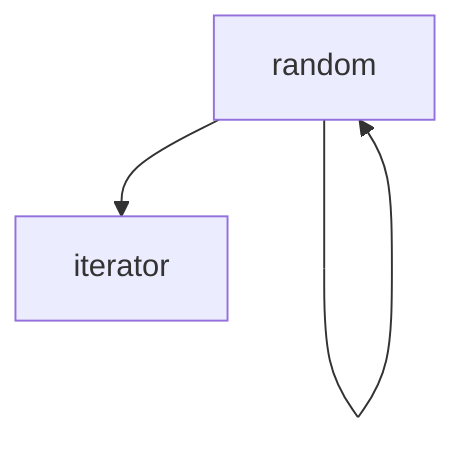
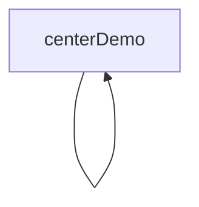
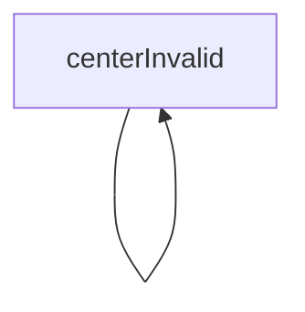
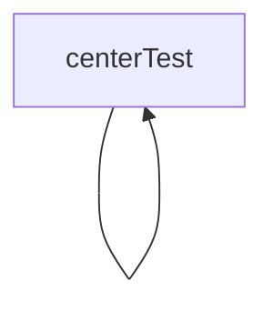
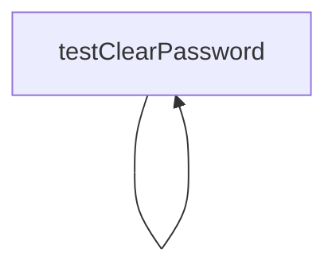
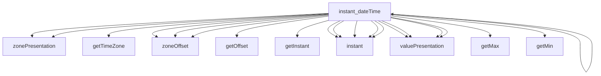
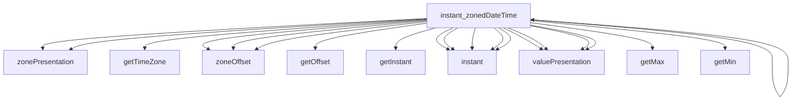
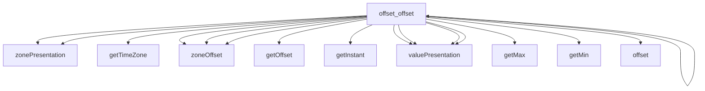
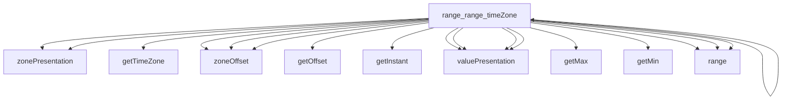

# Project Analysis Report


## Contents
1. [Overview](#overview)
2. [Function Relationships](#function-relationships)
3. [Code Analysis](#code-analysis)

## Overview
Total files analyzed: 65

## Function Relationships

### File: `TestUtils.java`

#### Function: `random`
**Signature:** `public static int random(int minInc, int maxInc)`

**Description:** This public static method 'random' returns int and It takes parameters: int minInc, int maxInc and It calls other methods: format, nextInt

**Operations:**
```java
Handles exceptions and Creates new objects
```

**Dependencies:**
- Calls: `next`, `random`, `size`, `iterator`
- Called by: `random`

---

#### Function: `random`
**Signature:** `public static T random(Collection<T> source)`

**Description:** This public static method 'random' returns T and It takes parameters: Collection<T> source and It calls other methods: next, random, size, iterator

**Operations:**
```java
Contains loops
```

**Dependencies:**
- Calls: `next`, `random`, `size`, `iterator`
- Called by: `random`

---

### File: `SmsCenterTest.java`

#### Function: `centerDemo`
**Signature:** `public static SmsCenter centerDemo()`

**Description:** This public static method 'centerDemo' returns SmsCenter and It calls other methods: toCharArray

**Operations:**
```java
Creates new objects
```

**Dependencies:**
- Calls: `toCharArray`
- Called by: `testBalance`

---

#### Function: `centerInvalid`
**Signature:** `public static SmsCenter centerInvalid()`

**Description:** This public static method 'centerInvalid' returns SmsCenter and It calls other methods: toCharArray

**Operations:**
```java
Creates new objects
```

**Dependencies:**
- Calls: `toCharArray`
- Called by: None

---

#### Function: `centerTest`
**Signature:** `public static SmsCenter centerTest()`

**Description:** This public static method 'centerTest' returns SmsCenter and It accesses class fields

**Operations:**
```java
Accesses class fields and Creates new objects
```

**Dependencies:**
- Calls: None
- Called by: None

---

#### Function: `testClearPassword`
**Signature:** ` void testClearPassword()`

**Description:** This @Test
	public method 'testClearPassword' returns void and It accesses class fields and It calls other methods: containsOnly, toCharArray, isNotNull, assertThat

**Operations:**
```java
Accesses class fields and Creates new objects and Uses annotations
```

**Dependencies:**
- Calls: `containsOnly`, `toCharArray`, `isNotNull`, `assertThat`
- Called by: None

---

#### Function: `testBalance`
**Signature:** ` void testBalance()`

**Description:** This @Test
	public method 'testBalance' returns void and It calls other methods: balance, getCurrency, isError, centerDemo, isPositive, isEqualTo, getBalance, isFalse, isNotNull, assertThat, getCredit, isNull

**Operations:**
```java
Uses annotations
```

**Dependencies:**
- Calls: `balance`, `getCurrency`, `isError`, `centerDemo`, `isPositive`, `isEqualTo`, `getBalance`, `isFalse`, `isNotNull`, `assertThat`, `getCredit`, `isNull`
- Called by: None

---

### File: `GroupManagerTest.java`

#### Function: `testCRUD`
**Signature:** ` void testCRUD()`

**Description:** This @Test
	public method 'testCRUD' returns void and It calls other methods: getNumber, withNumber, filter, isTrue, getCnt, equals, update, stream, isPresent, hasOnlyElementsOfType, isNotEmpty, isPositive, hasSize, containsAll, isEqualTo, assertThat, hasSameSizeAs, get, getId, getName, create, withName, centerDemo, size, groups, findFirst, delete, list, isNotNull

**Operations:**
```java
Creates new objects and Uses annotations
```

**Dependencies:**
- Calls: `getNumber`, `withNumber`, `filter`, `isTrue`, `getCnt`, `equals`, `update`, `stream`, `isPresent`, `hasOnlyElementsOfType`, `isNotEmpty`, `isPositive`, `hasSize`, `containsAll`, `isEqualTo`, `assertThat`, `hasSameSizeAs`, `get`, `getId`, `getName`, `create`, `withName`, `centerDemo`, `size`, `groups`, `findFirst`, `delete`, `list`, `isNotNull`
- Called by: None

---

### File: `PhoneManagerTest.java`

#### Function: `testCRUD`
**Signature:** ` void testCRUD()`

**Description:** This @Test
	public method 'testCRUD' returns void and It calls other methods: containsOnlyElementsOf, sleep, getPhoneOther, of, withNumber, collect, filter, getPhone, centerTest, getMiddleName, getLastName, withPhoneOther, isTrue, containsOnly, listByPhone, equals, getGroupIds, update, stream, isPresent, hasOnlyElementsOfType, isNotEmpty, getBirthday, withTags, isNotEqualTo, withMiddleName, isPositive, hasSize, containsAll, isEqualTo, withBirthday, listByFio, map, assertThat, toMap, withGroupIds, search, get, listByGroup, getId, getName, create, withLastName, getComments, phones, getFirstName, withName, size, getTags, withFirstName, toList, groups, replace, findFirst, getGroup, groupExclude, delete, withId, identity, groupMove, groupInclude, list, isNotNull, withComments, withPhone, isEmpty

**Operations:**
```java
Handles exceptions and Creates new objects and Uses annotations
```

**Dependencies:**
- Calls: `containsOnlyElementsOf`, `sleep`, `getPhoneOther`, `of`, `withNumber`, `collect`, `filter`, `getPhone`, `centerTest`, `getMiddleName`, `getLastName`, `withPhoneOther`, `isTrue`, `containsOnly`, `listByPhone`, `equals`, `getGroupIds`, `update`, `stream`, `isPresent`, `hasOnlyElementsOfType`, `isNotEmpty`, `getBirthday`, `withTags`, `isNotEqualTo`, `withMiddleName`, `isPositive`, `hasSize`, `containsAll`, `isEqualTo`, `withBirthday`, `listByFio`, `map`, `assertThat`, `toMap`, `withGroupIds`, `search`, `get`, `listByGroup`, `getId`, `getName`, `create`, `withLastName`, `getComments`, `phones`, `getFirstName`, `withName`, `size`, `getTags`, `withFirstName`, `toList`, `groups`, `replace`, `findFirst`, `getGroup`, `groupExclude`, `delete`, `withId`, `identity`, `groupMove`, `groupInclude`, `list`, `isNotNull`, `withComments`, `withPhone`, `isEmpty`
- Called by: None

---

### File: `DeliveryTimeTest.java`

#### Function: `instant_dateTime_timeZone`
**Signature:** ` void instant_dateTime_timeZone()`

**Description:** This @Test
	public method 'instant_dateTime_timeZone' returns void and It calls other methods: of, zonePresentation, instant, valuePresentation, isEqualTo, isNotNull, assertThat

**Operations:**
```java
Uses annotations
```

**Dependencies:**
- Calls: `of`, `zonePresentation`, `instant`, `valuePresentation`, `isEqualTo`, `isNotNull`, `assertThat`
- Called by: None

---

#### Function: `instant_dateTime`
**Signature:** ` void instant_dateTime()`

**Description:** This @Test
	public method 'instant_dateTime' returns void and It calls other methods: of, zonePresentation, instant, valuePresentation, isEqualTo, isNotNull, assertThat, isNull

**Operations:**
```java
Uses annotations
```

**Dependencies:**
- Calls: `of`, `zonePresentation`, `instant`, `valuePresentation`, `isEqualTo`, `isNotNull`, `assertThat`, `isNull`
- Called by: None

---

#### Function: `instant_unixEpoch_timeZone`
**Signature:** ` void instant_unixEpoch_timeZone()`

**Description:** This @Test
	public method 'instant_unixEpoch_timeZone' returns void and It calls other methods: zonePresentation, instant, valuePresentation, isEqualTo, isNotNull, assertThat

**Operations:**
```java
Uses annotations
```

**Dependencies:**
- Calls: `zonePresentation`, `instant`, `valuePresentation`, `isEqualTo`, `isNotNull`, `assertThat`
- Called by: None

---

#### Function: `instant_unixEpoch`
**Signature:** ` void instant_unixEpoch()`

**Description:** This @Test
	public method 'instant_unixEpoch' returns void and It calls other methods: zonePresentation, instant, valuePresentation, isEqualTo, isNotNull, assertThat, isNull

**Operations:**
```java
Uses annotations
```

**Dependencies:**
- Calls: `zonePresentation`, `instant`, `valuePresentation`, `isEqualTo`, `isNotNull`, `assertThat`, `isNull`
- Called by: None

---

#### Function: `instant_zonedDateTime`
**Signature:** ` void instant_zonedDateTime()`

**Description:** This @Test
	public method 'instant_zonedDateTime' returns void and It calls other methods: of, zonePresentation, instant, valuePresentation, isEqualTo, isNotNull, assertThat, toZoneId

**Operations:**
```java
Uses annotations
```

**Dependencies:**
- Calls: `of`, `zonePresentation`, `instant`, `valuePresentation`, `isEqualTo`, `isNotNull`, `assertThat`, `toZoneId`
- Called by: None

---

#### Function: `offset_offset`
**Signature:** ` void offset_offset()`

**Description:** This @Test
	public method 'offset_offset' returns void and It calls other methods: zonePresentation, valuePresentation, isEqualTo, offset, isNotNull, assertThat, isNull

**Operations:**
```java
Uses annotations
```

**Dependencies:**
- Calls: `zonePresentation`, `valuePresentation`, `isEqualTo`, `offset`, `isNotNull`, `assertThat`, `isNull`
- Called by: None

---

#### Function: `range_range_timeZone`
**Signature:** ` void range_range_timeZone()`

**Description:** This @Test
	public method 'range_range_timeZone' returns void and It calls other methods: zonePresentation, valuePresentation, range, isEqualTo, isNotNull, assertThat

**Operations:**
```java
Uses annotations
```

**Dependencies:**
- Calls: `zonePresentation`, `valuePresentation`, `range`, `isEqualTo`, `isNotNull`, `assertThat`
- Called by: None

---

#### Function: `range_range`
**Signature:** ` void range_range()`

**Description:** This @Test
	public method 'range_range' returns void and It calls other methods: zonePresentation, valuePresentation, range, isEqualTo, isNotNull, assertThat, isNull

**Operations:**
```java
Uses annotations
```

**Dependencies:**
- Calls: `zonePresentation`, `valuePresentation`, `range`, `isEqualTo`, `isNotNull`, `assertThat`, `isNull`
- Called by: None

---

### File: `TemplateManagerTest.java`

#### Function: `testListDemo`
**Signature:** ` void testListDemo()`

**Description:** This @Test
	public method 'testListDemo' returns void and It calls other methods: size, hasOnlyElementsOfType, isNotEmpty, centerDemo, templates, isPositive, list, isNotNull, assertThat

**Operations:**
```java
Uses annotations
```

**Dependencies:**
- Calls: `size`, `hasOnlyElementsOfType`, `isNotEmpty`, `centerDemo`, `templates`, `isPositive`, `list`, `isNotNull`, `assertThat`
- Called by: None

---

#### Function: `testListInvalid`
**Signature:** ` void testListInvalid()`

**Description:** This @Test(expected = InvalidCredentials.class)
	public method 'testListInvalid' returns void and It calls other methods: templates, centerInvalid, list, isNotNull, assertThat, isEmpty

**Operations:**
```java
Basic Java operations
```

**Dependencies:**
- Calls: `templates`, `centerInvalid`, `list`, `isNotNull`, `assertThat`, `isEmpty`
- Called by: None

---

#### Function: `testCRUDDemo`
**Signature:** ` void testCRUDDemo()`

**Description:** This @Test
	public method 'testCRUDDemo' returns void and It calls other methods: containsOnlyElementsOf, filter, isTrue, equals, update, stream, isPresent, templates, isPositive, containsAll, isEqualTo, assertThat, getSender, get, getId, getName, create, getMessage, withMessage, withFormat, withName, getFlag, centerDemo, size, findFirst, delete, getFormat, list, isNotNull

**Operations:**
```java
Creates new objects and Uses annotations
```

**Dependencies:**
- Calls: `containsOnlyElementsOf`, `filter`, `isTrue`, `equals`, `update`, `stream`, `isPresent`, `templates`, `isPositive`, `containsAll`, `isEqualTo`, `assertThat`, `getSender`, `get`, `getId`, `getName`, `create`, `getMessage`, `withMessage`, `withFormat`, `withName`, `getFlag`, `centerDemo`, `size`, `findFirst`, `delete`, `getFormat`, `list`, `isNotNull`
- Called by: None

---

#### Function: `testUpdateUnknownDemo`
**Signature:** ` void testUpdateUnknownDemo()`

**Description:** This @Test(expected = InvalidId.class)
	public method 'testUpdateUnknownDemo' returns void and It calls other methods: update, withMessage, withId, templates, withName, centerDemo

**Operations:**
```java
Creates new objects
```

**Dependencies:**
- Calls: `update`, `withMessage`, `withId`, `templates`, `withName`, `centerDemo`
- Called by: None

---

#### Function: `testDeleteUnknownDemo`
**Signature:** ` void testDeleteUnknownDemo()`

**Description:** This @Test(expected = InvalidId.class)
	public method 'testDeleteUnknownDemo' returns void and It calls other methods: withMessage, delete, withId, templates, withName, centerDemo

**Operations:**
```java
Creates new objects
```

**Dependencies:**
- Calls: `withMessage`, `delete`, `withId`, `templates`, `withName`, `centerDemo`
- Called by: None

---

### File: `ValidationTest.java`

#### Function: `v`
**Signature:** `private static Validation v()`

**Description:** This private static method 'v' returns Validation

**Operations:**
```java
Creates new objects
```

**Dependencies:**
- Calls: None
- Called by: `testFieldLengthMax_Nonnull`, `testValidate_BooleanString`, `testFieldIsNull_Value`, `testCheckIsNull_ValueString`, `testFieldNonNull_Value`, `testEmpty`, `testFieldMatches_Nonnull`, `testCheckNonNull_ValueString`, `testFieldLengthMax_Nullable`, `testFieldLength_Nonnull`, `testFieldLength_Nullable`, `testFieldLengthMin_Nullable`, `testFieldMatches_Nullable`, `testFieldLengthMin_Nonnull`

---

#### Function: `testEmpty`
**Signature:** ` void testEmpty()`

**Description:** This @Test
	public method 'testEmpty' returns void and It calls other methods: isTrue, nonValid, isValid, isFalse, isNotNull, assertThat, v, isEmpty

**Operations:**
```java
Uses annotations
```

**Dependencies:**
- Calls: `isTrue`, `nonValid`, `isValid`, `isFalse`, `isNotNull`, `assertThat`, `v`, `isEmpty`
- Called by: None

---

#### Function: `testValidate_BooleanString`
**Signature:** ` void testValidate_BooleanString()`

**Description:** This @Test
	public method 'testValidate_BooleanString' returns void and It calls other methods: validate, isNotEmpty, v, assertThat, isEmpty

**Operations:**
```java
Uses annotations
```

**Dependencies:**
- Calls: `validate`, `isNotEmpty`, `v`, `assertThat`, `isEmpty`
- Called by: None

---

#### Function: `testCheckIsNull_ValueString`
**Signature:** ` void testCheckIsNull_ValueString()`

**Description:** This @Test
	public method 'testCheckIsNull_ValueString' returns void and It calls other methods: checkIsNull, isNotEmpty, v, assertThat, isEmpty

**Operations:**
```java
Uses annotations
```

**Dependencies:**
- Calls: `checkIsNull`, `isNotEmpty`, `v`, `assertThat`, `isEmpty`
- Called by: None

---

#### Function: `testFieldIsNull_Value`
**Signature:** ` void testFieldIsNull_Value()`

**Description:** This @Test
	public method 'testFieldIsNull_Value' returns void and It calls other methods: containsOnly, isNotEmpty, fieldIsNull, v, assertThat, isEmpty

**Operations:**
```java
Uses annotations
```

**Dependencies:**
- Calls: `containsOnly`, `isNotEmpty`, `fieldIsNull`, `v`, `assertThat`, `isEmpty`
- Called by: None

---

#### Function: `testCheckNonNull_ValueString`
**Signature:** ` void testCheckNonNull_ValueString()`

**Description:** This @Test
	public method 'testCheckNonNull_ValueString' returns void and It calls other methods: isNotEmpty, checkNonNull, v, assertThat, isEmpty

**Operations:**
```java
Uses annotations
```

**Dependencies:**
- Calls: `isNotEmpty`, `checkNonNull`, `v`, `assertThat`, `isEmpty`
- Called by: None

---

#### Function: `testFieldNonNull_Value`
**Signature:** ` void testFieldNonNull_Value()`

**Description:** This @Test
	public method 'testFieldNonNull_Value' returns void and It calls other methods: containsOnly, isNotEmpty, v, assertThat, isEmpty, fieldNonNull

**Operations:**
```java
Uses annotations
```

**Dependencies:**
- Calls: `containsOnly`, `isNotEmpty`, `v`, `assertThat`, `isEmpty`, `fieldNonNull`
- Called by: None

---

#### Function: `testFieldMatches_Nullable`
**Signature:** ` void testFieldMatches_Nullable()`

**Description:** This @Test
	public method 'testFieldMatches_Nullable' returns void and It calls other methods: containsOnly, fieldMatches, isNotEmpty, v, assertThat, isEmpty

**Operations:**
```java
Uses annotations
```

**Dependencies:**
- Calls: `containsOnly`, `fieldMatches`, `isNotEmpty`, `v`, `assertThat`, `isEmpty`
- Called by: None

---

#### Function: `testFieldMatches_Nonnull`
**Signature:** ` void testFieldMatches_Nonnull()`

**Description:** This @Test
	public method 'testFieldMatches_Nonnull' returns void and It calls other methods: containsOnly, fieldMatches, isNotEmpty, v, assertThat, isEmpty

**Operations:**
```java
Uses annotations
```

**Dependencies:**
- Calls: `containsOnly`, `fieldMatches`, `isNotEmpty`, `v`, `assertThat`, `isEmpty`
- Called by: None

---

#### Function: `testFieldLengthMin_Nullable`
**Signature:** ` void testFieldLengthMin_Nullable()`

**Description:** This @Test
	public method 'testFieldLengthMin_Nullable' returns void and It calls other methods: containsOnly, fieldLengthMin, length, isNotEmpty, v, assertThat, isEmpty

**Operations:**
```java
Uses annotations
```

**Dependencies:**
- Calls: `containsOnly`, `fieldLengthMin`, `length`, `isNotEmpty`, `v`, `assertThat`, `isEmpty`
- Called by: None

---

#### Function: `testFieldLengthMin_Nonnull`
**Signature:** ` void testFieldLengthMin_Nonnull()`

**Description:** This @Test
	public method 'testFieldLengthMin_Nonnull' returns void and It calls other methods: fieldLengthMin, length, isNotEmpty, assertThat, v, containsOnly, isEmpty

**Operations:**
```java
Uses annotations
```

**Dependencies:**
- Calls: `fieldLengthMin`, `length`, `isNotEmpty`, `assertThat`, `v`, `containsOnly`, `isEmpty`
- Called by: None

---

#### Function: `testFieldLengthMax_Nullable`
**Signature:** ` void testFieldLengthMax_Nullable()`

**Description:** This @Test
	public method 'testFieldLengthMax_Nullable' returns void and It calls other methods: containsOnly, length, isNotEmpty, fieldLengthMax, v, assertThat, isEmpty

**Operations:**
```java
Uses annotations
```

**Dependencies:**
- Calls: `containsOnly`, `length`, `isNotEmpty`, `fieldLengthMax`, `v`, `assertThat`, `isEmpty`
- Called by: None

---

#### Function: `testFieldLengthMax_Nonnull`
**Signature:** ` void testFieldLengthMax_Nonnull()`

**Description:** This @Test
	public method 'testFieldLengthMax_Nonnull' returns void and It calls other methods: length, isNotEmpty, assertThat, fieldLengthMax, v, containsOnly, isEmpty

**Operations:**
```java
Uses annotations
```

**Dependencies:**
- Calls: `length`, `isNotEmpty`, `assertThat`, `fieldLengthMax`, `v`, `containsOnly`, `isEmpty`
- Called by: None

---

#### Function: `testFieldLength_Nullable`
**Signature:** ` void testFieldLength_Nullable()`

**Description:** This @Test
	public method 'testFieldLength_Nullable' returns void and It calls other methods: containsOnly, length, isNotEmpty, fieldLength, v, assertThat, isEmpty

**Operations:**
```java
Uses annotations
```

**Dependencies:**
- Calls: `containsOnly`, `length`, `isNotEmpty`, `fieldLength`, `v`, `assertThat`, `isEmpty`
- Called by: None

---

#### Function: `testFieldLength_Nonnull`
**Signature:** ` void testFieldLength_Nonnull()`

**Description:** This @Test
	public method 'testFieldLength_Nonnull' returns void and It calls other methods: containsOnly, length, isNotEmpty, fieldLength, v, assertThat, isEmpty

**Operations:**
```java
Uses annotations
```

**Dependencies:**
- Calls: `containsOnly`, `length`, `isNotEmpty`, `fieldLength`, `v`, `assertThat`, `isEmpty`
- Called by: None

---

### File: `CheckerTest.java`

#### Function: `testEncodingKnown`
**Signature:** ` void testEncodingKnown()`

**Description:** This @Test
	public method 'testEncodingKnown' returns void and It calls other methods: safeEncoding, getBytes

**Operations:**
```java
Uses annotations
```

**Dependencies:**
- Calls: `safeEncoding`, `getBytes`
- Called by: None

---

#### Function: `testEncodingUnknown`
**Signature:** ` void testEncodingUnknown()`

**Description:** This @Test(expected = IllegalStateException.class)
	public method 'testEncodingUnknown' returns void and It calls other methods: safeEncoding, getBytes

**Operations:**
```java
Basic Java operations
```

**Dependencies:**
- Calls: `safeEncoding`, `getBytes`
- Called by: None

---

### File: `MessageManagerTest.java`

#### Function: `checkCost`
**Signature:** `private static void checkCost(MessageCost cost, boolean testMode)`

**Description:** This private static method 'checkCost' returns void and It takes parameters: MessageCost cost, boolean testMode and It accesses class fields and It calls other methods: isNotBlank, filter, getPhone, getCnt, getMccmnc, getCost, stream, hasOnlyElementsOfType, isEqualByComparingTo, isPositive, hasSize, isEqualTo, map, assertThat, isNull, get, getPhones, isInstanceOf, reduce, isZero, isNotNull

**Operations:**
```java
Contains loops and Accesses class fields
```

**Dependencies:**
- Calls: `isNotBlank`, `filter`, `getPhone`, `getCnt`, `getMccmnc`, `getCost`, `stream`, `hasOnlyElementsOfType`, `isEqualByComparingTo`, `isPositive`, `hasSize`, `isEqualTo`, `map`, `assertThat`, `isNull`, `get`, `getPhones`, `isInstanceOf`, `reduce`, `isZero`, `isNotNull`
- Called by: `checkSend`, `testSampleWapPush2`, `testSms`, `testSampleSms`, `testSampleWapPush1`, `testSampleFlash`, `testSampleBinary`

---

#### Function: `checkSend`
**Signature:** ` void checkSend(MessageSend send, boolean testMode)`

**Description:** This @SuppressWarnings("SameParameterValue")
	private static method 'checkSend' returns void and It takes parameters: MessageSend send, boolean testMode and It calls other methods: isNotBlank, getId, checkCost, isPositive, getBalance, isNotNull, assertThat

**Operations:**
```java
Basic Java operations
```

**Dependencies:**
- Calls: `isNotBlank`, `getId`, `checkCost`, `isPositive`, `getBalance`, `isNotNull`, `assertThat`
- Called by: `testSms`

---

#### Function: `testSampleSms`
**Signature:** ` void testSampleSms()`

**Description:** This @Test
	public method 'testSampleSms' returns void and It calls other methods: withText, withContact, cost, checkCost, centerDemo, messages

**Operations:**
```java
Creates new objects and Uses annotations
```

**Dependencies:**
- Calls: `withText`, `withContact`, `cost`, `checkCost`, `centerDemo`, `messages`
- Called by: None

---

#### Function: `testSampleFlash`
**Signature:** ` void testSampleFlash()`

**Description:** This @Test
	public method 'testSampleFlash' returns void and It accesses class fields and It calls other methods: withDelivery, withCharset, withText, of, withSender, withContact, instant, cost, checkCost, withType, centerDemo, messages, withTransliterate

**Operations:**
```java
Accesses class fields and Creates new objects and Uses annotations
```

**Dependencies:**
- Calls: `withDelivery`, `withCharset`, `withText`, `of`, `withSender`, `withContact`, `instant`, `cost`, `checkCost`, `withType`, `centerDemo`, `messages`, `withTransliterate`
- Called by: None

---

#### Function: `testSampleBinary`
**Signature:** ` void testSampleBinary()`

**Description:** This @Test
	public method 'testSampleBinary' returns void and It accesses class fields and It calls other methods: withText, withContact, cost, checkCost, withType, centerDemo, messages

**Operations:**
```java
Accesses class fields and Creates new objects and Uses annotations
```

**Dependencies:**
- Calls: `withText`, `withContact`, `cost`, `checkCost`, `withType`, `centerDemo`, `messages`
- Called by: None

---

#### Function: `testSampleWapPush1`
**Signature:** ` void testSampleWapPush1()`

**Description:** This @Test
	public method 'testSampleWapPush1' returns void and It accesses class fields and It calls other methods: withText, withContact, cost, checkCost, withType, centerDemo, messages

**Operations:**
```java
Accesses class fields and Creates new objects and Uses annotations
```

**Dependencies:**
- Calls: `withText`, `withContact`, `cost`, `checkCost`, `withType`, `centerDemo`, `messages`
- Called by: None

---

#### Function: `testSampleWapPush2`
**Signature:** ` void testSampleWapPush2()`

**Description:** This @Test
	public method 'testSampleWapPush2' returns void and It accesses class fields and It calls other methods: withText, withContact, cost, checkCost, withType, centerDemo, messages

**Operations:**
```java
Accesses class fields and Creates new objects and Uses annotations
```

**Dependencies:**
- Calls: `withText`, `withContact`, `cost`, `checkCost`, `withType`, `centerDemo`, `messages`
- Called by: None

---

#### Function: `testSms`
**Signature:** ` void testSms()`

**Description:** This @Test
	public method 'testSms' returns void and It calls other methods: checkSend, withText, withContact, send, cost, centerTest, checkCost, messages

**Operations:**
```java
Creates new objects and Uses annotations
```

**Dependencies:**
- Calls: `checkSend`, `withText`, `withContact`, `send`, `cost`, `centerTest`, `checkCost`, `messages`
- Called by: None

---

### File: `SmsCenter.java`

#### Function: `messages`
**Signature:** ` MessageManager messages()`

**Description:** This  method 'messages' returns MessageManager

**Operations:**
```java
Basic Java operations
```

**Dependencies:**
- Calls: None
- Called by: None

---

#### Function: `templates`
**Signature:** ` TemplateManager templates()`

**Description:** This  method 'templates' returns TemplateManager

**Operations:**
```java
Basic Java operations
```

**Dependencies:**
- Calls: None
- Called by: None

---

#### Function: `bulk`
**Signature:** ` BulkManager bulk()`

**Description:** This  method 'bulk' returns BulkManager

**Operations:**
```java
Basic Java operations
```

**Dependencies:**
- Calls: None
- Called by: None

---

#### Function: `balance`
**Signature:** ` Balance balance()`

**Description:** This  method 'balance' returns Balance

**Operations:**
```java
Basic Java operations
```

**Dependencies:**
- Calls: None
- Called by: None

---

#### Function: `phones`
**Signature:** ` PhoneManager phones()`

**Description:** This  method 'phones' returns PhoneManager

**Operations:**
```java
Basic Java operations
```

**Dependencies:**
- Calls: None
- Called by: None

---

#### Function: `groups`
**Signature:** ` GroupManager groups()`

**Description:** This  method 'groups' returns GroupManager

**Operations:**
```java
Basic Java operations
```

**Dependencies:**
- Calls: None
- Called by: None

---

#### Function: `users`
**Signature:** ` UserManager users()`

**Description:** This  method 'users' returns UserManager

**Operations:**
```java
Basic Java operations
```

**Dependencies:**
- Calls: None
- Called by: None

---

#### Function: `list`
**Signature:** ` List<Phone> list()`

**Description:** This  method 'list' returns List<Phone>

**Operations:**
```java
Basic Java operations
```

**Dependencies:**
- Calls: None
- Called by: None

---

#### Function: `listByGroup`
**Signature:** ` List<Phone> listByGroup(Group group)`

**Description:** This  method 'listByGroup' returns List<Phone> and It takes parameters: Group group

**Operations:**
```java
Basic Java operations
```

**Dependencies:**
- Calls: None
- Called by: None

---

#### Function: `listByPhone`
**Signature:** ` List<Phone> listByPhone(String phone)`

**Description:** This  method 'listByPhone' returns List<Phone> and It takes parameters: String phone

**Operations:**
```java
Basic Java operations
```

**Dependencies:**
- Calls: None
- Called by: None

---

#### Function: `listByFio`
**Signature:** ` List<Phone> listByFio(String fio)`

**Description:** This  method 'listByFio' returns List<Phone> and It takes parameters: String fio

**Operations:**
```java
Basic Java operations
```

**Dependencies:**
- Calls: None
- Called by: None

---

#### Function: `search`
**Signature:** ` List<Phone> search(String search)`

**Description:** This  method 'search' returns List<Phone> and It takes parameters: String search

**Operations:**
```java
Basic Java operations
```

**Dependencies:**
- Calls: None
- Called by: None

---

#### Function: `create`
**Signature:** ` Long create(Phone phone)`

**Description:** This  method 'create' returns Long and It takes parameters: Phone phone

**Operations:**
```java
Basic Java operations
```

**Dependencies:**
- Calls: None
- Called by: None

---

#### Function: `update`
**Signature:** ` boolean update(Phone phone)`

**Description:** This  method 'update' returns boolean and It takes parameters: Phone phone

**Operations:**
```java
Basic Java operations
```

**Dependencies:**
- Calls: None
- Called by: None

---

#### Function: `update`
**Signature:** ` boolean update(Phone phone, String number)`

**Description:** This  method 'update' returns boolean and It takes parameters: Phone phone, String number

**Operations:**
```java
Basic Java operations
```

**Dependencies:**
- Calls: None
- Called by: None

---

#### Function: `groupInclude`
**Signature:** ` boolean groupInclude(Phone phone, Group group)`

**Description:** This  method 'groupInclude' returns boolean and It takes parameters: Phone phone, Group group

**Operations:**
```java
Basic Java operations
```

**Dependencies:**
- Calls: None
- Called by: None

---

#### Function: `groupMove`
**Signature:** ` boolean groupMove(Phone phone, Group group)`

**Description:** This  method 'groupMove' returns boolean and It takes parameters: Phone phone, Group group

**Operations:**
```java
Basic Java operations
```

**Dependencies:**
- Calls: None
- Called by: None

---

#### Function: `groupExclude`
**Signature:** ` boolean groupExclude(Phone phone, Group group)`

**Description:** This  method 'groupExclude' returns boolean and It takes parameters: Phone phone, Group group

**Operations:**
```java
Basic Java operations
```

**Dependencies:**
- Calls: None
- Called by: None

---

#### Function: `delete`
**Signature:** ` boolean delete(Phone phone)`

**Description:** This  method 'delete' returns boolean and It takes parameters: Phone phone

**Operations:**
```java
Basic Java operations
```

**Dependencies:**
- Calls: None
- Called by: None

---

#### Function: `blackInclude`
**Signature:** ` void blackInclude(Phone phone)`

**Description:** This  method 'blackInclude' returns void and It takes parameters: Phone phone

**Operations:**
```java
Basic Java operations
```

**Dependencies:**
- Calls: None
- Called by: None

---

#### Function: `blackExclude`
**Signature:** ` void blackExclude(Phone phone)`

**Description:** This  method 'blackExclude' returns void and It takes parameters: Phone phone

**Operations:**
```java
Basic Java operations
```

**Dependencies:**
- Calls: None
- Called by: None

---

#### Function: `list`
**Signature:** ` List<Group> list()`

**Description:** This  method 'list' returns List<Group>

**Operations:**
```java
Basic Java operations
```

**Dependencies:**
- Calls: None
- Called by: None

---

#### Function: `create`
**Signature:** ` Long create(Group group)`

**Description:** This  method 'create' returns Long and It takes parameters: Group group

**Operations:**
```java
Basic Java operations
```

**Dependencies:**
- Calls: None
- Called by: None

---

#### Function: `update`
**Signature:** ` boolean update(Group group)`

**Description:** This  method 'update' returns boolean and It takes parameters: Group group

**Operations:**
```java
Basic Java operations
```

**Dependencies:**
- Calls: None
- Called by: None

---

#### Function: `delete`
**Signature:** ` boolean delete(Group group)`

**Description:** This  method 'delete' returns boolean and It takes parameters: Group group

**Operations:**
```java
Basic Java operations
```

**Dependencies:**
- Calls: None
- Called by: None

---

#### Function: `list`
**Signature:** ` List<User> list()`

**Description:** This  method 'list' returns List<User>

**Operations:**
```java
Basic Java operations
```

**Dependencies:**
- Calls: None
- Called by: None

---

#### Function: `create`
**Signature:** ` void create(User user)`

**Description:** This  method 'create' returns void and It takes parameters: User user

**Operations:**
```java
Basic Java operations
```

**Dependencies:**
- Calls: None
- Called by: None

---

#### Function: `update`
**Signature:** ` void update(User user)`

**Description:** This  method 'update' returns void and It takes parameters: User user

**Operations:**
```java
Basic Java operations
```

**Dependencies:**
- Calls: None
- Called by: None

---

#### Function: `pay`
**Signature:** ` void pay(User user, BigDecimal amount)`

**Description:** This  method 'pay' returns void and It takes parameters: User user, BigDecimal amount

**Operations:**
```java
Basic Java operations
```

**Dependencies:**
- Calls: None
- Called by: None

---

#### Function: `stat`
**Signature:** ` void stat(User user)`

**Description:** This  method 'stat' returns void and It takes parameters: User user

**Operations:**
```java
Basic Java operations
```

**Dependencies:**
- Calls: None
- Called by: None

---

#### Function: `stat`
**Signature:** ` void stat()`

**Description:** This  method 'stat' returns void

**Operations:**
```java
Basic Java operations
```

**Dependencies:**
- Calls: None
- Called by: None

---

#### Function: `statResellers`
**Signature:** ` void statResellers(boolean full)`

**Description:** This  method 'statResellers' returns void and It takes parameters: boolean full

**Operations:**
```java
Basic Java operations
```

**Dependencies:**
- Calls: None
- Called by: None

---

### File: `Balance.java`

#### Function: `getBalance`
**Signature:** `public BigDecimal getBalance()`

**Description:** This public method 'getBalance' returns BigDecimal

**Operations:**
```java
Basic Java operations
```

**Dependencies:**
- Calls: None
- Called by: None

---

#### Function: `setBalance`
**Signature:** `public void setBalance(BigDecimal balance)`

**Description:** This public method 'setBalance' returns void and It takes parameters: BigDecimal balance and It accesses class fields

**Operations:**
```java
Accesses class fields
```

**Dependencies:**
- Calls: None
- Called by: None

---

#### Function: `getCredit`
**Signature:** `public BigDecimal getCredit()`

**Description:** This public method 'getCredit' returns BigDecimal

**Operations:**
```java
Basic Java operations
```

**Dependencies:**
- Calls: None
- Called by: None

---

#### Function: `setCredit`
**Signature:** `public void setCredit(BigDecimal credit)`

**Description:** This public method 'setCredit' returns void and It takes parameters: BigDecimal credit and It accesses class fields

**Operations:**
```java
Accesses class fields
```

**Dependencies:**
- Calls: None
- Called by: None

---

#### Function: `getCurrency`
**Signature:** `public String getCurrency()`

**Description:** This public method 'getCurrency' returns String

**Operations:**
```java
Basic Java operations
```

**Dependencies:**
- Calls: None
- Called by: None

---

#### Function: `setCurrency`
**Signature:** `public void setCurrency(String currency)`

**Description:** This public method 'setCurrency' returns void and It takes parameters: String currency and It accesses class fields

**Operations:**
```java
Accesses class fields
```

**Dependencies:**
- Calls: None
- Called by: None

---

### File: `SmsCenterImpl.java`

#### Function: `presentation`
**Signature:** ` String presentation()`

**Description:** This @Override
		public method 'presentation' returns String

**Operations:**
```java
Uses annotations
```

**Dependencies:**
- Calls: None
- Called by: None

---

#### Function: `call`
**Signature:** `private RequestExecutor call(String url)`

**Description:** This private method 'call' returns RequestExecutor and It takes parameters: String url and It accesses class fields and It calls other methods: with

**Operations:**
```java
Accesses class fields and Creates new objects
```

**Dependencies:**
- Calls: `with`
- Called by: `balance`, `groups`, `phones`, `templates`, `messages`

---

#### Function: `messages`
**Signature:** ` MessageManager messages()`

**Description:** This @Override
	public method 'messages' returns MessageManager and It calls other methods: call

**Operations:**
```java
Creates new objects and Uses annotations
```

**Dependencies:**
- Calls: `call`
- Called by: None

---

#### Function: `templates`
**Signature:** ` TemplateManager templates()`

**Description:** This @Override
	public method 'templates' returns TemplateManager and It calls other methods: call

**Operations:**
```java
Creates new objects and Uses annotations
```

**Dependencies:**
- Calls: `call`
- Called by: None

---

#### Function: `bulk`
**Signature:** ` BulkManager bulk()`

**Description:** This @Override
	public method 'bulk' returns BulkManager

**Operations:**
```java
Creates new objects and Uses annotations
```

**Dependencies:**
- Calls: None
- Called by: None

---

#### Function: `balance`
**Signature:** ` Balance balance()`

**Description:** This @Override
	public method 'balance' returns Balance and It calls other methods: call, with, single

**Operations:**
```java
Uses annotations
```

**Dependencies:**
- Calls: `call`, `with`, `single`
- Called by: None

---

#### Function: `phones`
**Signature:** ` PhoneManager phones()`

**Description:** This @Override
	public method 'phones' returns PhoneManager and It calls other methods: call

**Operations:**
```java
Creates new objects and Uses annotations
```

**Dependencies:**
- Calls: `call`
- Called by: None

---

#### Function: `groups`
**Signature:** ` GroupManager groups()`

**Description:** This @Override
	public method 'groups' returns GroupManager and It calls other methods: call

**Operations:**
```java
Creates new objects and Uses annotations
```

**Dependencies:**
- Calls: `call`
- Called by: None

---

#### Function: `users`
**Signature:** ` UserManager users()`

**Description:** This @Override
	public method 'users' returns UserManager

**Operations:**
```java
Creates new objects and Uses annotations
```

**Dependencies:**
- Calls: None
- Called by: None

---

### File: `RequestExecutor.java`

#### Function: `with`
**Signature:** `public RequestExecutor with(String name, String value)`

**Description:** This public method 'with' returns RequestExecutor and It takes parameters: String name, String value and It calls other methods: put, trim, isEmpty

**Operations:**
```java
Uses annotations
```

**Dependencies:**
- Calls: `with`
- Called by: `with`

---

#### Function: `with`
**Signature:** `public RequestExecutor with(String name, T value, Function<T, String> presenter)`

**Description:** This public method 'with' returns RequestExecutor and It takes parameters: String name, T value, Function<T, String> presenter and It calls other methods: with, apply

**Operations:**
```java
Uses annotations
```

**Dependencies:**
- Calls: `with`
- Called by: `with`

---

#### Function: `with`
**Signature:** `public RequestExecutor with(String name, Number value)`

**Description:** This public method 'with' returns RequestExecutor and It takes parameters: String name, Number value and It calls other methods: with

**Operations:**
```java
Uses annotations
```

**Dependencies:**
- Calls: `with`
- Called by: `with`

---

#### Function: `with`
**Signature:** `public RequestExecutor with(String name, Boolean value)`

**Description:** This public method 'with' returns RequestExecutor and It takes parameters: String name, Boolean value and It calls other methods: with

**Operations:**
```java
Uses annotations
```

**Dependencies:**
- Calls: `with`
- Called by: `with`

---

#### Function: `with`
**Signature:** `public RequestExecutor with(String name, ServerType value)`

**Description:** This public method 'with' returns RequestExecutor and It takes parameters: String name, ServerType value and It calls other methods: with

**Operations:**
```java
Uses annotations
```

**Dependencies:**
- Calls: `with`
- Called by: `with`

---

#### Function: `single`
**Signature:** `public T single(Class<T> targetClass)`

**Description:** This public method 'single' returns T and It takes parameters: Class<T> targetClass and It calls other methods: checkError, single, execute

**Operations:**
```java
Basic Java operations
```

**Dependencies:**
- Calls: `checkError`, `single`, `execute`
- Called by: `single`, `multi`

---

#### Function: `checkError`
**Signature:** `private void checkError(String raw)`

**Description:** This private method 'checkError' returns void and It takes parameters: String raw and It calls other methods: setError, checkError, setErrorCode, group, matcher, find, parseInt

**Operations:**
```java
Creates new objects
```

**Dependencies:**
- Calls: `getErrorCode`, `isError`, `getError`
- Called by: `single`, `multi`

---

#### Function: `checkError`
**Signature:** `private void checkError(ServerBaseResponse response)`

**Description:** This private method 'checkError' returns void and It takes parameters: ServerBaseResponse response and It calls other methods: getErrorCode, isError, getError

**Operations:**
```java
Creates new objects
```

**Dependencies:**
- Calls: `getErrorCode`, `isError`, `getError`
- Called by: `single`, `multi`

---

#### Function: `multi`
**Signature:** `public List<T> multi(Class<T> targetClass)`

**Description:** This public method 'multi' returns List<T> and It takes parameters: Class<T> targetClass and It calls other methods: checkError, matcher, single, multi, execute, find

**Operations:**
```java
Creates new objects
```

**Dependencies:**
- Calls: `checkError`, `matcher`, `single`, `multi`, `execute`, `find`
- Called by: `multi`

---

#### Function: `clone`
**Signature:** ` RequestExecutor clone()`

**Description:** This @Override
	@SuppressWarnings({"CloneDoesntDeclareCloneNotSupportedException", "MethodDoesntCallSuperMethod"})
	public method 'clone' returns RequestExecutor and It calls other methods: forEach

**Operations:**
```java
Creates new objects and Uses annotations
```

**Dependencies:**
- Calls: `forEach`
- Called by: None

---

### File: `GroupManagerImpl.java`

#### Function: `list`
**Signature:** ` List<Group> list()`

**Description:** This @Override
	public method 'list' returns List<Group> and It calls other methods: clone, with, emptyList, multi

**Operations:**
```java
Handles exceptions and Uses annotations
```

**Dependencies:**
- Calls: `clone`, `with`, `emptyList`, `multi`
- Called by: None

---

#### Function: `create`
**Signature:** ` Long create(Group group)`

**Description:** This @Override
	public method 'create' returns Long and It takes parameters: Group group and It calls other methods: getNumber, clone, getId, getName, single, with

**Operations:**
```java
Uses annotations
```

**Dependencies:**
- Calls: `getNumber`, `clone`, `getId`, `getName`, `single`, `with`
- Called by: None

---

#### Function: `update`
**Signature:** ` boolean update(Group group)`

**Description:** This @Override
	public method 'update' returns boolean and It takes parameters: Group group and It calls other methods: getNumber, equals, clone, getId, getName, single, getResult, with

**Operations:**
```java
Uses annotations
```

**Dependencies:**
- Calls: `getNumber`, `equals`, `clone`, `getId`, `getName`, `single`, `getResult`, `with`
- Called by: None

---

#### Function: `delete`
**Signature:** ` boolean delete(Group group)`

**Description:** This @Override
	public method 'delete' returns boolean and It takes parameters: Group group and It calls other methods: equals, clone, getId, single, getResult, with

**Operations:**
```java
Uses annotations
```

**Dependencies:**
- Calls: `equals`, `clone`, `getId`, `single`, `getResult`, `with`
- Called by: None

---

### File: `Group.java`

#### Function: `getId`
**Signature:** `public Long getId()`

**Description:** This public method 'getId' returns Long

**Operations:**
```java
Basic Java operations
```

**Dependencies:**
- Calls: None
- Called by: `presentation`, `equals`, `hashCode`

---

#### Function: `setId`
**Signature:** `public void setId(Long id)`

**Description:** This public method 'setId' returns void and It takes parameters: Long id and It accesses class fields

**Operations:**
```java
Accesses class fields
```

**Dependencies:**
- Calls: None
- Called by: `withId`

---

#### Function: `withId`
**Signature:** `public Group withId(Long id)`

**Description:** This public method 'withId' returns Group and It takes parameters: Long id and It calls other methods: setId

**Operations:**
```java
Basic Java operations
```

**Dependencies:**
- Calls: `setId`
- Called by: None

---

#### Function: `getName`
**Signature:** `public String getName()`

**Description:** This public method 'getName' returns String

**Operations:**
```java
Basic Java operations
```

**Dependencies:**
- Calls: None
- Called by: `equals`, `hashCode`

---

#### Function: `setName`
**Signature:** `public void setName(String name)`

**Description:** This public method 'setName' returns void and It takes parameters: String name and It accesses class fields

**Operations:**
```java
Accesses class fields
```

**Dependencies:**
- Calls: None
- Called by: `withName`

---

#### Function: `withName`
**Signature:** `public Group withName(String name)`

**Description:** This public method 'withName' returns Group and It takes parameters: String name and It calls other methods: setName

**Operations:**
```java
Basic Java operations
```

**Dependencies:**
- Calls: `setName`
- Called by: None

---

#### Function: `getNumber`
**Signature:** `public String getNumber()`

**Description:** This public method 'getNumber' returns String

**Operations:**
```java
Basic Java operations
```

**Dependencies:**
- Calls: None
- Called by: `equals`, `hashCode`

---

#### Function: `setNumber`
**Signature:** `public void setNumber(String number)`

**Description:** This public method 'setNumber' returns void and It takes parameters: String number and It accesses class fields

**Operations:**
```java
Accesses class fields
```

**Dependencies:**
- Calls: None
- Called by: `withNumber`

---

#### Function: `withNumber`
**Signature:** `public Group withNumber(String number)`

**Description:** This public method 'withNumber' returns Group and It takes parameters: String number and It calls other methods: setNumber

**Operations:**
```java
Basic Java operations
```

**Dependencies:**
- Calls: `setNumber`
- Called by: None

---

#### Function: `getCnt`
**Signature:** `public String getCnt()`

**Description:** This public method 'getCnt' returns String

**Operations:**
```java
Basic Java operations
```

**Dependencies:**
- Calls: None
- Called by: `equals`, `hashCode`

---

#### Function: `setCnt`
**Signature:** `public void setCnt(String cnt)`

**Description:** This public method 'setCnt' returns void and It takes parameters: String cnt and It accesses class fields

**Operations:**
```java
Accesses class fields
```

**Dependencies:**
- Calls: None
- Called by: `withCnt`

---

#### Function: `withCnt`
**Signature:** `public Group withCnt(String cnt)`

**Description:** This public method 'withCnt' returns Group and It takes parameters: String cnt and It calls other methods: setCnt

**Operations:**
```java
Basic Java operations
```

**Dependencies:**
- Calls: `setCnt`
- Called by: None

---

#### Function: `presentation`
**Signature:** ` String presentation()`

**Description:** This @Override
	public method 'presentation' returns String and It calls other methods: getId, requireNonNull

**Operations:**
```java
Uses annotations
```

**Dependencies:**
- Calls: `getId`, `requireNonNull`
- Called by: None

---

#### Function: `equals`
**Signature:** ` boolean equals(Object o)`

**Description:** This @Override
	public method 'equals' returns boolean and It takes parameters: Object o and It calls other methods: getCnt, getNumber, equals, getClass, getId, getName

**Operations:**
```java
Uses annotations
```

**Dependencies:**
- Calls: `getCnt`, `getNumber`, `equals`, `getClass`, `getId`, `getName`
- Called by: `equals`

---

#### Function: `hashCode`
**Signature:** ` int hashCode()`

**Description:** This @Override
	public method 'hashCode' returns int and It calls other methods: getCnt, getNumber, hash, getName, getId

**Operations:**
```java
Uses annotations
```

**Dependencies:**
- Calls: `getCnt`, `getNumber`, `hash`, `getName`, `getId`
- Called by: None

---

### File: `Contact.java`

#### Function: `phone`
**Signature:** `static Phone phone(String phone)`

**Description:** This static method 'phone' returns Phone and It takes parameters: String phone and It calls other methods: withPhone

**Operations:**
```java
Creates new objects
```

**Dependencies:**
- Calls: `withPhone`
- Called by: None

---

#### Function: `group`
**Signature:** `static Group group(Long id)`

**Description:** This static method 'group' returns Group and It takes parameters: Long id and It calls other methods: withId

**Operations:**
```java
Creates new objects
```

**Dependencies:**
- Calls: `withId`
- Called by: None

---

### File: `Phone.java`

#### Function: `getId`
**Signature:** `public Long getId()`

**Description:** This public method 'getId' returns Long

**Operations:**
```java
Basic Java operations
```

**Dependencies:**
- Calls: None
- Called by: `equals`, `hashCode`

---

#### Function: `setId`
**Signature:** `public void setId(Long id)`

**Description:** This public method 'setId' returns void and It takes parameters: Long id and It accesses class fields

**Operations:**
```java
Accesses class fields
```

**Dependencies:**
- Calls: None
- Called by: `withId`

---

#### Function: `withId`
**Signature:** `public Phone withId(Long id)`

**Description:** This public method 'withId' returns Phone and It takes parameters: Long id and It calls other methods: setId

**Operations:**
```java
Basic Java operations
```

**Dependencies:**
- Calls: `setId`
- Called by: None

---

#### Function: `getName`
**Signature:** `public String getName()`

**Description:** This public method 'getName' returns String

**Operations:**
```java
Basic Java operations
```

**Dependencies:**
- Calls: None
- Called by: `equals`, `hashCode`

---

#### Function: `setName`
**Signature:** `public void setName(String name)`

**Description:** This public method 'setName' returns void and It takes parameters: String name and It accesses class fields

**Operations:**
```java
Accesses class fields
```

**Dependencies:**
- Calls: None
- Called by: `withName`

---

#### Function: `withName`
**Signature:** `public Phone withName(String name)`

**Description:** This public method 'withName' returns Phone and It takes parameters: String name and It calls other methods: setName

**Operations:**
```java
Basic Java operations
```

**Dependencies:**
- Calls: `setName`
- Called by: None

---

#### Function: `getPhone`
**Signature:** `public String getPhone()`

**Description:** This public method 'getPhone' returns String

**Operations:**
```java
Basic Java operations
```

**Dependencies:**
- Calls: None
- Called by: `presentation`, `equals`, `hashCode`

---

#### Function: `setPhone`
**Signature:** `public void setPhone(String phone)`

**Description:** This public method 'setPhone' returns void and It takes parameters: String phone and It accesses class fields

**Operations:**
```java
Accesses class fields
```

**Dependencies:**
- Calls: None
- Called by: `withPhone`

---

#### Function: `withPhone`
**Signature:** `public Phone withPhone(String phone)`

**Description:** This public method 'withPhone' returns Phone and It takes parameters: String phone and It calls other methods: setPhone

**Operations:**
```java
Basic Java operations
```

**Dependencies:**
- Calls: `setPhone`
- Called by: None

---

#### Function: `getGroup`
**Signature:** `public String getGroup()`

**Description:** This public method 'getGroup' returns String

**Operations:**
```java
Basic Java operations
```

**Dependencies:**
- Calls: None
- Called by: `getGroupIds`, `equals`, `hashCode`

---

#### Function: `setGroup`
**Signature:** `public void setGroup(String group)`

**Description:** This public method 'setGroup' returns void and It takes parameters: String group and It accesses class fields

**Operations:**
```java
Accesses class fields
```

**Dependencies:**
- Calls: None
- Called by: `setGroupIds`, `withGroup`

---

#### Function: `withGroup`
**Signature:** `public Phone withGroup(String group)`

**Description:** This public method 'withGroup' returns Phone and It takes parameters: String group and It calls other methods: setGroup

**Operations:**
```java
Basic Java operations
```

**Dependencies:**
- Calls: `setGroup`
- Called by: None

---

#### Function: `getGroupIds`
**Signature:** `public List<Long> getGroupIds()`

**Description:** This public method 'getGroupIds' returns List<Long> and It calls other methods: emptyList, toList, collect, stream, getGroup, split, map

**Operations:**
```java
Basic Java operations
```

**Dependencies:**
- Calls: `emptyList`, `toList`, `collect`, `stream`, `getGroup`, `split`, `map`
- Called by: None

---

#### Function: `setGroupIds`
**Signature:** `public void setGroupIds(Iterable<Long> groupIds)`

**Description:** This public method 'setGroupIds' returns void and It takes parameters: Iterable<Long> groupIds and It calls other methods: collect, stream, setGroup, joining, spliterator, map, isEmpty

**Operations:**
```java
Basic Java operations
```

**Dependencies:**
- Calls: `collect`, `stream`, `setGroup`, `joining`, `spliterator`, `map`, `isEmpty`
- Called by: None

---

#### Function: `withGroupIds`
**Signature:** `public Phone withGroupIds(Iterable<Long> groupIds)`

**Description:** This public method 'withGroupIds' returns Phone and It takes parameters: Iterable<Long> groupIds and It calls other methods: setGroupIds

**Operations:**
```java
Basic Java operations
```

**Dependencies:**
- Calls: `asList`, `withGroupIds`
- Called by: `withGroupIds`

---

#### Function: `withGroupIds`
**Signature:** `public Phone withGroupIds()`

**Description:** This public method 'withGroupIds' returns Phone and It calls other methods: asList, withGroupIds

**Operations:**
```java
Basic Java operations
```

**Dependencies:**
- Calls: `asList`, `withGroupIds`
- Called by: `withGroupIds`

---

#### Function: `getFirstName`
**Signature:** `public String getFirstName()`

**Description:** This public method 'getFirstName' returns String

**Operations:**
```java
Basic Java operations
```

**Dependencies:**
- Calls: None
- Called by: `equals`, `hashCode`

---

#### Function: `setFirstName`
**Signature:** `public void setFirstName(String firstName)`

**Description:** This public method 'setFirstName' returns void and It takes parameters: String firstName and It accesses class fields

**Operations:**
```java
Accesses class fields
```

**Dependencies:**
- Calls: None
- Called by: `withFirstName`

---

#### Function: `withFirstName`
**Signature:** `public Phone withFirstName(String firstName)`

**Description:** This public method 'withFirstName' returns Phone and It takes parameters: String firstName and It calls other methods: setFirstName

**Operations:**
```java
Basic Java operations
```

**Dependencies:**
- Calls: `setFirstName`
- Called by: None

---

#### Function: `getLastName`
**Signature:** `public String getLastName()`

**Description:** This public method 'getLastName' returns String

**Operations:**
```java
Basic Java operations
```

**Dependencies:**
- Calls: None
- Called by: `equals`, `hashCode`

---

#### Function: `setLastName`
**Signature:** `public void setLastName(String lastName)`

**Description:** This public method 'setLastName' returns void and It takes parameters: String lastName and It accesses class fields

**Operations:**
```java
Accesses class fields
```

**Dependencies:**
- Calls: None
- Called by: `withLastName`

---

#### Function: `withLastName`
**Signature:** `public Phone withLastName(String lastName)`

**Description:** This public method 'withLastName' returns Phone and It takes parameters: String lastName and It calls other methods: setLastName

**Operations:**
```java
Basic Java operations
```

**Dependencies:**
- Calls: `setLastName`
- Called by: None

---

#### Function: `getMiddleName`
**Signature:** `public String getMiddleName()`

**Description:** This public method 'getMiddleName' returns String

**Operations:**
```java
Basic Java operations
```

**Dependencies:**
- Calls: None
- Called by: `equals`, `hashCode`

---

#### Function: `setMiddleName`
**Signature:** `public void setMiddleName(String middleName)`

**Description:** This public method 'setMiddleName' returns void and It takes parameters: String middleName and It accesses class fields

**Operations:**
```java
Accesses class fields
```

**Dependencies:**
- Calls: None
- Called by: `withMiddleName`

---

#### Function: `withMiddleName`
**Signature:** `public Phone withMiddleName(String middleName)`

**Description:** This public method 'withMiddleName' returns Phone and It takes parameters: String middleName and It calls other methods: setMiddleName

**Operations:**
```java
Basic Java operations
```

**Dependencies:**
- Calls: `setMiddleName`
- Called by: None

---

#### Function: `getBirthday`
**Signature:** `public String getBirthday()`

**Description:** This public method 'getBirthday' returns String

**Operations:**
```java
Basic Java operations
```

**Dependencies:**
- Calls: None
- Called by: `equals`, `hashCode`

---

#### Function: `setBirthday`
**Signature:** `public void setBirthday(String birthday)`

**Description:** This public method 'setBirthday' returns void and It takes parameters: String birthday and It accesses class fields

**Operations:**
```java
Accesses class fields
```

**Dependencies:**
- Calls: None
- Called by: `withBirthday`

---

#### Function: `withBirthday`
**Signature:** `public Phone withBirthday(String birthday)`

**Description:** This public method 'withBirthday' returns Phone and It takes parameters: String birthday and It calls other methods: setBirthday

**Operations:**
```java
Basic Java operations
```

**Dependencies:**
- Calls: `setBirthday`
- Called by: None

---

#### Function: `getComments`
**Signature:** `public String getComments()`

**Description:** This public method 'getComments' returns String

**Operations:**
```java
Basic Java operations
```

**Dependencies:**
- Calls: None
- Called by: `equals`, `hashCode`

---

#### Function: `setComments`
**Signature:** `public void setComments(String comments)`

**Description:** This public method 'setComments' returns void and It takes parameters: String comments and It accesses class fields

**Operations:**
```java
Accesses class fields
```

**Dependencies:**
- Calls: None
- Called by: `withComments`

---

#### Function: `withComments`
**Signature:** `public Phone withComments(String comments)`

**Description:** This public method 'withComments' returns Phone and It takes parameters: String comments and It calls other methods: setComments

**Operations:**
```java
Basic Java operations
```

**Dependencies:**
- Calls: `setComments`
- Called by: None

---

#### Function: `getTags`
**Signature:** `public String getTags()`

**Description:** This public method 'getTags' returns String

**Operations:**
```java
Basic Java operations
```

**Dependencies:**
- Calls: None
- Called by: `equals`, `hashCode`

---

#### Function: `setTags`
**Signature:** `public void setTags(String tags)`

**Description:** This public method 'setTags' returns void and It takes parameters: String tags and It accesses class fields

**Operations:**
```java
Accesses class fields
```

**Dependencies:**
- Calls: None
- Called by: `withTags`

---

#### Function: `withTags`
**Signature:** `public Phone withTags(String tags)`

**Description:** This public method 'withTags' returns Phone and It takes parameters: String tags and It calls other methods: setTags

**Operations:**
```java
Basic Java operations
```

**Dependencies:**
- Calls: `setTags`
- Called by: None

---

#### Function: `getPhoneOther`
**Signature:** `public String getPhoneOther()`

**Description:** This public method 'getPhoneOther' returns String

**Operations:**
```java
Basic Java operations
```

**Dependencies:**
- Calls: None
- Called by: `equals`, `hashCode`

---

#### Function: `setPhoneOther`
**Signature:** `public void setPhoneOther(String phoneOther)`

**Description:** This public method 'setPhoneOther' returns void and It takes parameters: String phoneOther and It accesses class fields

**Operations:**
```java
Accesses class fields
```

**Dependencies:**
- Calls: None
- Called by: `withPhoneOther`

---

#### Function: `withPhoneOther`
**Signature:** `public Phone withPhoneOther(String phoneOther)`

**Description:** This public method 'withPhoneOther' returns Phone and It takes parameters: String phoneOther and It calls other methods: setPhoneOther

**Operations:**
```java
Basic Java operations
```

**Dependencies:**
- Calls: `setPhoneOther`
- Called by: None

---

#### Function: `presentation`
**Signature:** ` String presentation()`

**Description:** This @Override
	public method 'presentation' returns String and It calls other methods: getPhone

**Operations:**
```java
Uses annotations
```

**Dependencies:**
- Calls: `getPhone`
- Called by: None

---

#### Function: `equals`
**Signature:** ` boolean equals(Object o)`

**Description:** This @Override
	public method 'equals' returns boolean and It takes parameters: Object o and It calls other methods: equals, getPhoneOther, getClass, getId, getName, getPhone, getGroup, getBirthday, getComments, getMiddleName, getFirstName, getLastName, getTags

**Operations:**
```java
Uses annotations
```

**Dependencies:**
- Calls: `equals`, `getPhoneOther`, `getClass`, `getId`, `getName`, `getPhone`, `getGroup`, `getBirthday`, `getComments`, `getMiddleName`, `getFirstName`, `getLastName`, `getTags`
- Called by: `equals`

---

#### Function: `hashCode`
**Signature:** ` int hashCode()`

**Description:** This @Override
	public method 'hashCode' returns int and It calls other methods: getPhoneOther, hash, getName, getGroup, getId, getPhone, getBirthday, getMiddleName, getComments, getFirstName, getLastName, getTags

**Operations:**
```java
Uses annotations
```

**Dependencies:**
- Calls: `getPhoneOther`, `hash`, `getName`, `getGroup`, `getId`, `getPhone`, `getBirthday`, `getMiddleName`, `getComments`, `getFirstName`, `getLastName`, `getTags`
- Called by: None

---

### File: `PhoneManagerImpl.java`

#### Function: `list`
**Signature:** ` List<Phone> list()`

**Description:** This @Override
	public method 'list' returns List<Phone> and It calls other methods: clone, with, emptyList, multi

**Operations:**
```java
Handles exceptions and Uses annotations
```

**Dependencies:**
- Calls: `clone`, `with`, `emptyList`, `multi`
- Called by: None

---

#### Function: `listByGroup`
**Signature:** ` List<Phone> listByGroup(Group group)`

**Description:** This @Override
	public method 'listByGroup' returns List<Phone> and It takes parameters: Group group and It calls other methods: emptyList, clone, getId, multi, with

**Operations:**
```java
Handles exceptions and Uses annotations
```

**Dependencies:**
- Calls: `emptyList`, `clone`, `getId`, `multi`, `with`
- Called by: None

---

#### Function: `listByPhone`
**Signature:** ` List<Phone> listByPhone(String phone)`

**Description:** This @Override
	public method 'listByPhone' returns List<Phone> and It takes parameters: String phone and It calls other methods: clone, with, emptyList, multi

**Operations:**
```java
Handles exceptions and Uses annotations
```

**Dependencies:**
- Calls: `clone`, `with`, `emptyList`, `multi`
- Called by: None

---

#### Function: `listByFio`
**Signature:** ` List<Phone> listByFio(String fio)`

**Description:** This @Override
	public method 'listByFio' returns List<Phone> and It takes parameters: String fio and It calls other methods: clone, with, emptyList, multi

**Operations:**
```java
Handles exceptions and Uses annotations
```

**Dependencies:**
- Calls: `clone`, `with`, `emptyList`, `multi`
- Called by: None

---

#### Function: `search`
**Signature:** ` List<Phone> search(String search)`

**Description:** This @Override
	public method 'search' returns List<Phone> and It takes parameters: String search and It calls other methods: clone, with, emptyList, multi

**Operations:**
```java
Handles exceptions and Uses annotations
```

**Dependencies:**
- Calls: `clone`, `with`, `emptyList`, `multi`
- Called by: None

---

#### Function: `create`
**Signature:** ` Long create(Phone phone)`

**Description:** This @Override
	public method 'create' returns Long and It takes parameters: Phone phone and It calls other methods: getPhoneOther, collect, clone, getPhone, getName, stream, getId, joining, getBirthday, getMiddleName, getComments, getFirstName, single, with, getLastName, getTags, map, getGroupIds

**Operations:**
```java
Uses annotations
```

**Dependencies:**
- Calls: `getPhoneOther`, `collect`, `clone`, `getPhone`, `getName`, `stream`, `getId`, `joining`, `getBirthday`, `getMiddleName`, `getComments`, `getFirstName`, `single`, `with`, `getLastName`, `getTags`, `map`, `getGroupIds`
- Called by: None

---

#### Function: `update`
**Signature:** ` boolean update(Phone phone)`

**Description:** This @Override
	public method 'update' returns boolean and It takes parameters: Phone phone and It calls other methods: getPhoneOther, collect, clone, getPhone, getMiddleName, getLastName, equals, stream, getBirthday, getResult, map, getId, getName, getComments, joining, getFirstName, getTags, single, with, getGroupIds

**Operations:**
```java
Uses annotations
```

**Dependencies:**
- Calls: `equals`, `clone`, `getPhone`, `single`, `getResult`, `with`
- Called by: None

---

#### Function: `update`
**Signature:** ` boolean update(Phone phone, String number)`

**Description:** This @Override
	public method 'update' returns boolean and It takes parameters: Phone phone, String number and It calls other methods: equals, clone, getPhone, single, getResult, with

**Operations:**
```java
Uses annotations
```

**Dependencies:**
- Calls: `equals`, `clone`, `getPhone`, `single`, `getResult`, `with`
- Called by: None

---

#### Function: `groupInclude`
**Signature:** ` boolean groupInclude(Phone phone, Group group)`

**Description:** This @Override
	public method 'groupInclude' returns boolean and It takes parameters: Phone phone, Group group and It calls other methods: equals, clone, getPhone, getId, single, getResult, with

**Operations:**
```java
Uses annotations
```

**Dependencies:**
- Calls: `equals`, `clone`, `getPhone`, `getId`, `single`, `getResult`, `with`
- Called by: None

---

#### Function: `groupMove`
**Signature:** ` boolean groupMove(Phone phone, Group group)`

**Description:** This @Override
	public method 'groupMove' returns boolean and It takes parameters: Phone phone, Group group and It calls other methods: equals, clone, getPhone, getId, single, getResult, with

**Operations:**
```java
Uses annotations
```

**Dependencies:**
- Calls: `equals`, `clone`, `getPhone`, `getId`, `single`, `getResult`, `with`
- Called by: None

---

#### Function: `groupExclude`
**Signature:** ` boolean groupExclude(Phone phone, Group group)`

**Description:** This @Override
	public method 'groupExclude' returns boolean and It takes parameters: Phone phone, Group group and It calls other methods: equals, clone, getPhone, getId, single, getResult, with

**Operations:**
```java
Uses annotations
```

**Dependencies:**
- Calls: `equals`, `clone`, `getPhone`, `getId`, `single`, `getResult`, `with`
- Called by: None

---

#### Function: `delete`
**Signature:** ` boolean delete(Phone phone)`

**Description:** This @Override
	public method 'delete' returns boolean and It takes parameters: Phone phone and It calls other methods: equals, clone, getPhone, single, getResult, with

**Operations:**
```java
Uses annotations
```

**Dependencies:**
- Calls: `equals`, `clone`, `getPhone`, `single`, `getResult`, `with`
- Called by: None

---

#### Function: `blackInclude`
**Signature:** ` void blackInclude(Phone phone)`

**Description:** This @Override
	public method 'blackInclude' returns void and It takes parameters: Phone phone

**Operations:**
```java
Creates new objects and Uses annotations
```

**Dependencies:**
- Calls: None
- Called by: None

---

#### Function: `blackExclude`
**Signature:** ` void blackExclude(Phone phone)`

**Description:** This @Override
	public method 'blackExclude' returns void and It takes parameters: Phone phone

**Operations:**
```java
Creates new objects and Uses annotations
```

**Dependencies:**
- Calls: None
- Called by: None

---

### File: `ServerType.java`

#### Function: `presentation`
**Signature:** ` String presentation()`

**Description:** This  method 'presentation' returns String

**Operations:**
```java
Basic Java operations
```

**Dependencies:**
- Calls: None
- Called by: None

---

### File: `ServerBaseResponse.java`

#### Function: `getError`
**Signature:** `public String getError()`

**Description:** This public method 'getError' returns String

**Operations:**
```java
Basic Java operations
```

**Dependencies:**
- Calls: None
- Called by: None

---

#### Function: `setError`
**Signature:** `public void setError(String error)`

**Description:** This public method 'setError' returns void and It takes parameters: String error and It accesses class fields

**Operations:**
```java
Accesses class fields
```

**Dependencies:**
- Calls: None
- Called by: None

---

#### Function: `getErrorCode`
**Signature:** `public Integer getErrorCode()`

**Description:** This public method 'getErrorCode' returns Integer

**Operations:**
```java
Basic Java operations
```

**Dependencies:**
- Calls: None
- Called by: None

---

#### Function: `setErrorCode`
**Signature:** `public void setErrorCode(Integer errorCode)`

**Description:** This public method 'setErrorCode' returns void and It takes parameters: Integer errorCode and It accesses class fields

**Operations:**
```java
Accesses class fields
```

**Dependencies:**
- Calls: None
- Called by: None

---

#### Function: `isError`
**Signature:** `public boolean isError()`

**Description:** This public method 'isError' returns boolean

**Operations:**
```java
Basic Java operations
```

**Dependencies:**
- Calls: None
- Called by: None

---

### File: `ServerCharset.java`

#### Function: `presentation`
**Signature:** ` String presentation()`

**Description:** This @Override
		public method 'presentation' returns String

**Operations:**
```java
Uses annotations
```

**Dependencies:**
- Calls: None
- Called by: None

---

### File: `ResultContainer.java`

#### Function: `getResult`
**Signature:** `public String getResult()`

**Description:** This public method 'getResult' returns String

**Operations:**
```java
Basic Java operations
```

**Dependencies:**
- Calls: None
- Called by: None

---

#### Function: `setResult`
**Signature:** `public void setResult(String result)`

**Description:** This public method 'setResult' returns void and It takes parameters: String result and It accesses class fields

**Operations:**
```java
Accesses class fields
```

**Dependencies:**
- Calls: None
- Called by: None

---

### File: `IdContainer.java`

#### Function: `getId`
**Signature:** `public Long getId()`

**Description:** This public method 'getId' returns Long

**Operations:**
```java
Basic Java operations
```

**Dependencies:**
- Calls: None
- Called by: None

---

#### Function: `setId`
**Signature:** `public void setId(Long id)`

**Description:** This public method 'setId' returns void and It takes parameters: Long id and It accesses class fields

**Operations:**
```java
Accesses class fields
```

**Dependencies:**
- Calls: None
- Called by: None

---

### File: `DeliveryTimeOffset.java`

#### Function: `getOffset`
**Signature:** `public int getOffset()`

**Description:** This public method 'getOffset' returns int

**Operations:**
```java
Basic Java operations
```

**Dependencies:**
- Calls: None
- Called by: `valuePresentation`

---

#### Function: `valuePresentation`
**Signature:** ` String valuePresentation()`

**Description:** This @Nonnull
	@Override
	public method 'valuePresentation' returns String and It calls other methods: getOffset

**Operations:**
```java
Uses annotations
```

**Dependencies:**
- Calls: `getOffset`
- Called by: None

---

### File: `DeliveryTime.java`

#### Function: `valuePresentation`
**Signature:** ` String valuePresentation()`

**Description:** This @Nonnull method 'valuePresentation' returns String

**Operations:**
```java
Uses annotations
```

**Dependencies:**
- Calls: None
- Called by: None

---

#### Function: `zonePresentation`
**Signature:** ` String zonePresentation()`

**Description:** This @Nullable method 'zonePresentation' returns String

**Operations:**
```java
Uses annotations
```

**Dependencies:**
- Calls: None
- Called by: None

---

#### Function: `instant`
**Signature:** `static DeliveryTimeInstant instant(LocalDateTime instant, TimeZone timeZone)`

**Description:** This static method 'instant' returns DeliveryTimeInstant and It takes parameters: LocalDateTime instant, TimeZone timeZone

**Operations:**
```java
Creates new objects and Uses annotations
```

**Dependencies:**
- Calls: `getTimeZone`, `getZone`, `toLocalDateTime`
- Called by: None

---

#### Function: `instant`
**Signature:** `static DeliveryTimeInstant instant(LocalDateTime instant)`

**Description:** This static method 'instant' returns DeliveryTimeInstant and It takes parameters: LocalDateTime instant

**Operations:**
```java
Creates new objects and Uses annotations
```

**Dependencies:**
- Calls: `getTimeZone`, `getZone`, `toLocalDateTime`
- Called by: None

---

#### Function: `instant`
**Signature:** `static DeliveryTimeInstant instant(long unixEpochMillis, TimeZone timeZone)`

**Description:** This static method 'instant' returns DeliveryTimeInstant and It takes parameters: long unixEpochMillis, TimeZone timeZone

**Operations:**
```java
Creates new objects and Uses annotations
```

**Dependencies:**
- Calls: `getTimeZone`, `getZone`, `toLocalDateTime`
- Called by: None

---

#### Function: `instant`
**Signature:** `static DeliveryTimeInstant instant(long unixEpochMillis)`

**Description:** This static method 'instant' returns DeliveryTimeInstant and It takes parameters: long unixEpochMillis

**Operations:**
```java
Creates new objects
```

**Dependencies:**
- Calls: `getTimeZone`, `getZone`, `toLocalDateTime`
- Called by: None

---

#### Function: `instant`
**Signature:** `static DeliveryTimeInstant instant(ZonedDateTime instant)`

**Description:** This static method 'instant' returns DeliveryTimeInstant and It takes parameters: ZonedDateTime instant and It calls other methods: getTimeZone, getZone, toLocalDateTime

**Operations:**
```java
Creates new objects
```

**Dependencies:**
- Calls: `getTimeZone`, `getZone`, `toLocalDateTime`
- Called by: None

---

#### Function: `offset`
**Signature:** `static DeliveryTimeOffset offset(int offset)`

**Description:** This static method 'offset' returns DeliveryTimeOffset and It takes parameters: int offset

**Operations:**
```java
Creates new objects
```

**Dependencies:**
- Calls: None
- Called by: None

---

#### Function: `range`
**Signature:** `static DeliveryTimeRange range(int min, int max, TimeZone timeZone)`

**Description:** This static method 'range' returns DeliveryTimeRange and It takes parameters: int min, int max, TimeZone timeZone

**Operations:**
```java
Creates new objects and Uses annotations
```

**Dependencies:**
- Calls: None
- Called by: None

---

#### Function: `range`
**Signature:** `static DeliveryTimeRange range(int min, int max)`

**Description:** This static method 'range' returns DeliveryTimeRange and It takes parameters: int min, int max

**Operations:**
```java
Creates new objects
```

**Dependencies:**
- Calls: None
- Called by: None

---

### File: `DeliveryTimeBase.java`

#### Function: `getTimeZone`
**Signature:** `public TimeZone getTimeZone()`

**Description:** This public method 'getTimeZone' returns TimeZone

**Operations:**
```java
Basic Java operations
```

**Dependencies:**
- Calls: None
- Called by: `zoneOffset`, `zonePresentation`

---

#### Function: `zonePresentation`
**Signature:** ` String zonePresentation()`

**Description:** This @Nullable
	@Override
	public method 'zonePresentation' returns String and It calls other methods: getTimeZone, valueOf, zoneOffset, intValue

**Operations:**
```java
Uses annotations
```

**Dependencies:**
- Calls: `getTimeZone`, `valueOf`, `zoneOffset`, `intValue`
- Called by: None

---

#### Function: `zoneOffset`
**Signature:** `protected Number zoneOffset()`

**Description:** This protected method 'zoneOffset' returns Number and It calls other methods: zoneOffset, now

**Operations:**
```java
Basic Java operations
```

**Dependencies:**
- Calls: `getRules`, `getTimeZone`, `getTotalSeconds`, `getOffset`, `toZoneId`
- Called by: `zonePresentation`

---

#### Function: `zoneOffset`
**Signature:** `protected Number zoneOffset(LocalDateTime atDateTime)`

**Description:** This protected method 'zoneOffset' returns Number and It takes parameters: LocalDateTime atDateTime and It calls other methods: getRules, getTimeZone, getTotalSeconds, getOffset, toZoneId

**Operations:**
```java
Basic Java operations
```

**Dependencies:**
- Calls: `getRules`, `getTimeZone`, `getTotalSeconds`, `getOffset`, `toZoneId`
- Called by: `zonePresentation`

---

### File: `DeliveryTimeRange.java`

#### Function: `getMin`
**Signature:** `public int getMin()`

**Description:** This public method 'getMin' returns int

**Operations:**
```java
Basic Java operations
```

**Dependencies:**
- Calls: None
- Called by: `valuePresentation`

---

#### Function: `getMax`
**Signature:** `public int getMax()`

**Description:** This public method 'getMax' returns int

**Operations:**
```java
Basic Java operations
```

**Dependencies:**
- Calls: None
- Called by: `valuePresentation`

---

#### Function: `valuePresentation`
**Signature:** ` String valuePresentation()`

**Description:** This @Nonnull
	@Override
	public method 'valuePresentation' returns String and It calls other methods: getMax, format, getMin

**Operations:**
```java
Uses annotations
```

**Dependencies:**
- Calls: `getMax`, `format`, `getMin`
- Called by: None

---

### File: `DeliveryTimeInstant.java`

#### Function: `getInstant`
**Signature:** `public LocalDateTime getInstant()`

**Description:** This public method 'getInstant' returns LocalDateTime

**Operations:**
```java
Basic Java operations
```

**Dependencies:**
- Calls: None
- Called by: `zoneOffset`, `valuePresentation`

---

#### Function: `zoneOffset`
**Signature:** ` Number zoneOffset()`

**Description:** This @Override
	protected method 'zoneOffset' returns Number and It calls other methods: getInstant, zoneOffset

**Operations:**
```java
Uses annotations
```

**Dependencies:**
- Calls: `getInstant`, `zoneOffset`
- Called by: `zoneOffset`

---

#### Function: `valuePresentation`
**Signature:** ` String valuePresentation()`

**Description:** This @Nonnull
	@Override
	public method 'valuePresentation' returns String and It calls other methods: getInstant, format

**Operations:**
```java
Uses annotations
```

**Dependencies:**
- Calls: `getInstant`, `format`
- Called by: None

---

### File: `TemplateManager.java`

#### Function: `list`
**Signature:** `public List<MessageTemplate> list()`

**Description:** This public method 'list' returns List<MessageTemplate> and It calls other methods: clone, with, multi

**Operations:**
```java
Basic Java operations
```

**Dependencies:**
- Calls: `clone`, `with`, `multi`
- Called by: None

---

#### Function: `create`
**Signature:** `public Long create(MessageTemplate template)`

**Description:** This public method 'create' returns Long and It takes parameters: MessageTemplate template and It calls other methods: clone, getId, getName, getMessage, single, with, getFormat, getSender

**Operations:**
```java
Basic Java operations
```

**Dependencies:**
- Calls: `clone`, `getId`, `getName`, `getMessage`, `single`, `with`, `getFormat`, `getSender`
- Called by: None

---

#### Function: `update`
**Signature:** `public boolean update(MessageTemplate template)`

**Description:** This public method 'update' returns boolean and It takes parameters: MessageTemplate template and It calls other methods: equals, clone, getId, getName, getMessage, single, getResult, with, getFormat, getSender

**Operations:**
```java
Basic Java operations
```

**Dependencies:**
- Calls: `equals`, `clone`, `getId`, `getName`, `getMessage`, `single`, `getResult`, `with`, `getFormat`, `getSender`
- Called by: None

---

#### Function: `delete`
**Signature:** `public boolean delete(MessageTemplate template)`

**Description:** This public method 'delete' returns boolean and It takes parameters: MessageTemplate template and It calls other methods: equals, clone, getId, single, getResult, with

**Operations:**
```java
Basic Java operations
```

**Dependencies:**
- Calls: `equals`, `clone`, `getId`, `single`, `getResult`, `with`
- Called by: None

---

### File: `InvalidId.java`

### File: `UnknownServerError.java`

### File: `InvalidCredentials.java`

### File: `LockedIp.java`

### File: `ServerError.java`

### File: `ToManyRequests.java`

### File: `PersistError.java`

### File: `InvalidParameters.java`

### File: `Hex.java`

#### Function: `encodeHex`
**Signature:** `private static char[] encodeHex(byte[] data, char[] toDigits)`

**Description:** This private static method 'encodeHex' returns char[] and It takes parameters: byte[] data, char[] toDigits and It accesses class fields

**Operations:**
```java
Contains loops and Accesses class fields
```

**Dependencies:**
- Calls: `encodeHex`
- Called by: `encodeHexString`, `encodeHex`

---

#### Function: `encodeHex`
**Signature:** `public static char[] encodeHex(byte[] source, boolean toLowerCase)`

**Description:** This public static method 'encodeHex' returns char[] and It takes parameters: byte[] source, boolean toLowerCase and It calls other methods: encodeHex

**Operations:**
```java
Basic Java operations
```

**Dependencies:**
- Calls: `encodeHex`
- Called by: `encodeHexString`, `encodeHex`

---

#### Function: `encodeHex`
**Signature:** `public static char[] encodeHex(byte[] source)`

**Description:** This public static method 'encodeHex' returns char[] and It takes parameters: byte[] source and It calls other methods: encodeHex

**Operations:**
```java
Basic Java operations
```

**Dependencies:**
- Calls: `encodeHex`
- Called by: `encodeHexString`, `encodeHex`

---

#### Function: `encodeHexString`
**Signature:** `public static String encodeHexString(byte[] source)`

**Description:** This public static method 'encodeHexString' returns String and It takes parameters: byte[] source and It calls other methods: encodeHex

**Operations:**
```java
Creates new objects
```

**Dependencies:**
- Calls: `encodeHex`
- Called by: None

---

### File: `Checker.java`

#### Function: `checkRange`
**Signature:** `public static int checkRange(int value, int minInclusive, int maxInclusive)`

**Description:** This public static method 'checkRange' returns int and It takes parameters: int value, int minInclusive, int maxInclusive and It calls other methods: format

**Operations:**
```java
Creates new objects
```

**Dependencies:**
- Calls: `format`
- Called by: None

---

#### Function: `checkRange`
**Signature:** `public static double checkRange(double value, double minInclusive, double maxInclusive)`

**Description:** This public static method 'checkRange' returns double and It takes parameters: double value, double minInclusive, double maxInclusive and It calls other methods: format

**Operations:**
```java
Creates new objects
```

**Dependencies:**
- Calls: `format`
- Called by: None

---

#### Function: `safeEncoding`
**Signature:** `public static T safeEncoding(UnsupportedEncodingExceptionCallable<T> callable)`

**Description:** This public static method 'safeEncoding' returns T and It takes parameters: UnsupportedEncodingExceptionCallable<T> callable and It calls other methods: call

**Operations:**
```java
Handles exceptions and Creates new objects
```

**Dependencies:**
- Calls: `call`
- Called by: None

---

#### Function: `call`
**Signature:** ` T call()`

**Description:** This  method 'call' returns T

**Operations:**
```java
Basic Java operations
```

**Dependencies:**
- Calls: None
- Called by: `safeEncoding`

---

### File: `Validation.java`

#### Function: `isValid`
**Signature:** `public boolean isValid()`

**Description:** This public method 'isValid' returns boolean and It calls other methods: isEmpty

**Operations:**
```java
Basic Java operations
```

**Dependencies:**
- Calls: `isEmpty`
- Called by: `nonValid`

---

#### Function: `nonValid`
**Signature:** `public boolean nonValid()`

**Description:** This public method 'nonValid' returns boolean and It calls other methods: isValid

**Operations:**
```java
Basic Java operations
```

**Dependencies:**
- Calls: `isValid`
- Called by: None

---

#### Function: `iterator`
**Signature:** ` Iterator<String> iterator()`

**Description:** This @Override
	@Nonnull
	public method 'iterator' returns Iterator<String> and It calls other methods: iterator

**Operations:**
```java
Uses annotations
```

**Dependencies:**
- Calls: `iterator`
- Called by: `iterator`

---

#### Function: `addError`
**Signature:** `public Validation addError(String error)`

**Description:** This public method 'addError' returns Validation and It takes parameters: String error and It calls other methods: add

**Operations:**
```java
Basic Java operations
```

**Dependencies:**
- Calls: `add`
- Called by: None

---

#### Function: `validate`
**Signature:** `public Validation validate(boolean valid, Supplier<String> message)`

**Description:** This public method 'validate' returns Validation and It takes parameters: boolean valid, Supplier<String> message and It calls other methods: addError, get

**Operations:**
```java
Basic Java operations
```

**Dependencies:**
- Calls: `test`, `apply`, `validate`
- Called by: `fieldLength`, `fieldMatches`, `validate`

---

#### Function: `validate`
**Signature:** `public Validation validate(boolean valid, String message)`

**Description:** This public method 'validate' returns Validation and It takes parameters: boolean valid, String message and It calls other methods: validate

**Operations:**
```java
Basic Java operations
```

**Dependencies:**
- Calls: `test`, `apply`, `validate`
- Called by: `fieldLength`, `fieldMatches`, `validate`

---

#### Function: `validate`
**Signature:** `public Validation validate(T value, Predicate<T> predicate, Function<T, String> message)`

**Description:** This public method 'validate' returns Validation and It takes parameters: T value, Predicate<T> predicate, Function<T, String> message and It calls other methods: test, apply, validate

**Operations:**
```java
Basic Java operations
```

**Dependencies:**
- Calls: `test`, `apply`, `validate`
- Called by: `fieldLength`, `fieldMatches`, `validate`

---

#### Function: `checkIsNull`
**Signature:** `public Validation checkIsNull(T value, Function<T, String> message)`

**Description:** This public method 'checkIsNull' returns Validation and It takes parameters: T value, Function<T, String> message and It calls other methods: validate

**Operations:**
```java
Basic Java operations
```

**Dependencies:**
- Calls: `checkIsNull`
- Called by: `checkIsNull`, `fieldIsNull`

---

#### Function: `checkIsNull`
**Signature:** `public Validation checkIsNull(T value, Supplier<String> message)`

**Description:** This public method 'checkIsNull' returns Validation and It takes parameters: T value, Supplier<String> message and It calls other methods: checkIsNull, get

**Operations:**
```java
Basic Java operations
```

**Dependencies:**
- Calls: `checkIsNull`
- Called by: `checkIsNull`, `fieldIsNull`

---

#### Function: `checkIsNull`
**Signature:** `public Validation checkIsNull(T value, String message)`

**Description:** This public method 'checkIsNull' returns Validation and It takes parameters: T value, String message and It calls other methods: checkIsNull

**Operations:**
```java
Basic Java operations
```

**Dependencies:**
- Calls: `checkIsNull`
- Called by: `checkIsNull`, `fieldIsNull`

---

#### Function: `fieldIsNull`
**Signature:** `public Validation fieldIsNull(T value, String field)`

**Description:** This public method 'fieldIsNull' returns Validation and It takes parameters: T value, String field and It calls other methods: checkIsNull, format

**Operations:**
```java
Basic Java operations
```

**Dependencies:**
- Calls: `checkIsNull`, `format`
- Called by: None

---

#### Function: `checkNonNull`
**Signature:** `public Validation checkNonNull(T value, Function<T, String> message)`

**Description:** This public method 'checkNonNull' returns Validation and It takes parameters: T value, Function<T, String> message and It calls other methods: validate

**Operations:**
```java
Basic Java operations
```

**Dependencies:**
- Calls: `checkNonNull`
- Called by: `checkNonNull`, `fieldNonNull`

---

#### Function: `checkNonNull`
**Signature:** `public Validation checkNonNull(T value, Supplier<String> message)`

**Description:** This public method 'checkNonNull' returns Validation and It takes parameters: T value, Supplier<String> message and It calls other methods: checkNonNull, get

**Operations:**
```java
Basic Java operations
```

**Dependencies:**
- Calls: `checkNonNull`
- Called by: `checkNonNull`, `fieldNonNull`

---

#### Function: `checkNonNull`
**Signature:** `public Validation checkNonNull(T value, String message)`

**Description:** This public method 'checkNonNull' returns Validation and It takes parameters: T value, String message and It calls other methods: checkNonNull

**Operations:**
```java
Basic Java operations
```

**Dependencies:**
- Calls: `checkNonNull`
- Called by: `checkNonNull`, `fieldNonNull`

---

#### Function: `fieldNonNull`
**Signature:** `public Validation fieldNonNull(T value, String field)`

**Description:** This public method 'fieldNonNull' returns Validation and It takes parameters: T value, String field and It calls other methods: checkNonNull, format

**Operations:**
```java
Basic Java operations
```

**Dependencies:**
- Calls: `checkNonNull`, `format`
- Called by: None

---

#### Function: `fieldMatches`
**Signature:** `public Validation fieldMatches(String value, String field, boolean canBeNull, Pattern pattern)`

**Description:** This public method 'fieldMatches' returns Validation and It takes parameters: String value, String field, boolean canBeNull, Pattern pattern and It calls other methods: matches, matcher, format, validate

**Operations:**
```java
Basic Java operations
```

**Dependencies:**
- Calls: `matches`, `matcher`, `format`, `validate`
- Called by: None

---

#### Function: `range`
**Signature:** `private static String range(Integer minInclusive, Integer maxInclusive)`

**Description:** This private static method 'range' returns String and It takes parameters: Integer minInclusive, Integer maxInclusive and It calls other methods: append, toString

**Operations:**
```java
Creates new objects
```

**Dependencies:**
- Calls: `append`, `toString`
- Called by: `fieldLength`

---

#### Function: `fieldLength`
**Signature:** `public Validation fieldLength(String value, String field, boolean canBeNull, Integer minInclusive, Integer maxInclusive)`

**Description:** This public method 'fieldLength' returns Validation and It takes parameters: String value, String field, boolean canBeNull, Integer minInclusive, Integer maxInclusive and It calls other methods: length, range, format, validate

**Operations:**
```java
Basic Java operations
```

**Dependencies:**
- Calls: `length`, `range`, `format`, `validate`
- Called by: `fieldLengthMax`, `fieldLengthMin`

---

#### Function: `fieldLengthMin`
**Signature:** `public Validation fieldLengthMin(String value, String field, boolean canBeNull, int minInclusive)`

**Description:** This public method 'fieldLengthMin' returns Validation and It takes parameters: String value, String field, boolean canBeNull, int minInclusive and It calls other methods: fieldLength

**Operations:**
```java
Basic Java operations
```

**Dependencies:**
- Calls: `fieldLength`
- Called by: None

---

#### Function: `fieldLengthMax`
**Signature:** `public Validation fieldLengthMax(String value, String field, boolean canBeNull, int maxInclusive)`

**Description:** This public method 'fieldLengthMax' returns Validation and It takes parameters: String value, String field, boolean canBeNull, int maxInclusive and It calls other methods: fieldLength

**Operations:**
```java
Basic Java operations
```

**Dependencies:**
- Calls: `fieldLength`
- Called by: None

---

### File: `Digests.java`

#### Function: `getDigest`
**Signature:** `private static MessageDigest getDigest(String algorithm)`

**Description:** This private static method 'getDigest' returns MessageDigest and It takes parameters: String algorithm and It calls other methods: getInstance

**Operations:**
```java
Handles exceptions and Creates new objects
```

**Dependencies:**
- Calls: `getInstance`
- Called by: `getMd5Digest`

---

#### Function: `getMd5Digest`
**Signature:** `private static MessageDigest getMd5Digest()`

**Description:** This private static method 'getMd5Digest' returns MessageDigest and It calls other methods: getDigest

**Operations:**
```java
Basic Java operations
```

**Dependencies:**
- Calls: `getDigest`
- Called by: `md5`

---

#### Function: `md5`
**Signature:** `public static byte[] md5(byte[] source)`

**Description:** This public static method 'md5' returns byte[] and It takes parameters: byte[] source and It calls other methods: getMd5Digest, digest

**Operations:**
```java
Basic Java operations
```

**Dependencies:**
- Calls: `getMd5Digest`, `digest`
- Called by: `md5Hex`

---

#### Function: `toBytes`
**Signature:** `public static byte[] toBytes(char[] chars)`

**Description:** This public static method 'toBytes' returns byte[] and It takes parameters: char[] chars and It calls other methods: wrap, forName, copyOfRange, array, limit, position, fill, encode

**Operations:**
```java
Basic Java operations
```

**Dependencies:**
- Calls: `wrap`, `forName`, `copyOfRange`, `array`, `limit`, `position`, `fill`, `encode`
- Called by: `md5Hex`

---

#### Function: `md5Hex`
**Signature:** `public static String md5Hex(char[] source)`

**Description:** This public static method 'md5Hex' returns String and It takes parameters: char[] source and It calls other methods: toBytes, encodeHexString, md5

**Operations:**
```java
Basic Java operations
```

**Dependencies:**
- Calls: `toBytes`, `encodeHexString`, `md5`
- Called by: None

---

### File: `User.java`

### File: `MessageSend.java`

#### Function: `getId`
**Signature:** `public String getId()`

**Description:** This public method 'getId' returns String

**Operations:**
```java
Basic Java operations
```

**Dependencies:**
- Calls: None
- Called by: None

---

#### Function: `setId`
**Signature:** `public void setId(String id)`

**Description:** This public method 'setId' returns void and It takes parameters: String id and It accesses class fields

**Operations:**
```java
Accesses class fields
```

**Dependencies:**
- Calls: None
- Called by: None

---

#### Function: `getBalance`
**Signature:** `public BigDecimal getBalance()`

**Description:** This public method 'getBalance' returns BigDecimal

**Operations:**
```java
Basic Java operations
```

**Dependencies:**
- Calls: None
- Called by: None

---

#### Function: `setBalance`
**Signature:** `public void setBalance(BigDecimal balance)`

**Description:** This public method 'setBalance' returns void and It takes parameters: BigDecimal balance and It accesses class fields

**Operations:**
```java
Accesses class fields
```

**Dependencies:**
- Calls: None
- Called by: None

---

### File: `Message.java`

#### Function: `getContacts`
**Signature:** `public List<Contact> getContacts()`

**Description:** This public method 'getContacts' returns List<Contact>

**Operations:**
```java
Basic Java operations
```

**Dependencies:**
- Calls: None
- Called by: None

---

#### Function: `setContacts`
**Signature:** `public void setContacts(List<Contact> contacts)`

**Description:** This public method 'setContacts' returns void and It takes parameters: List<Contact> contacts and It accesses class fields and It calls other methods: requireNonNull

**Operations:**
```java
Accesses class fields and Uses annotations
```

**Dependencies:**
- Calls: `requireNonNull`
- Called by: `withContacts`

---

#### Function: `withContacts`
**Signature:** `public Message withContacts(List<Contact> contacts)`

**Description:** This public method 'withContacts' returns Message and It takes parameters: List<Contact> contacts and It calls other methods: setContacts

**Operations:**
```java
Uses annotations
```

**Dependencies:**
- Calls: `setContacts`
- Called by: None

---

#### Function: `withContact`
**Signature:** `public Message withContact(Contact contact)`

**Description:** This public method 'withContact' returns Message and It takes parameters: Contact contact and It accesses class fields and It calls other methods: add

**Operations:**
```java
Accesses class fields
```

**Dependencies:**
- Calls: `add`
- Called by: None

---

#### Function: `getText`
**Signature:** `public String getText()`

**Description:** This public method 'getText' returns String

**Operations:**
```java
Basic Java operations
```

**Dependencies:**
- Calls: None
- Called by: None

---

#### Function: `setText`
**Signature:** `public void setText(String text)`

**Description:** This public method 'setText' returns void and It takes parameters: String text and It accesses class fields

**Operations:**
```java
Accesses class fields
```

**Dependencies:**
- Calls: None
- Called by: `withText`

---

#### Function: `withText`
**Signature:** `public Message withText(String text)`

**Description:** This public method 'withText' returns Message and It takes parameters: String text and It calls other methods: setText

**Operations:**
```java
Basic Java operations
```

**Dependencies:**
- Calls: `setText`
- Called by: None

---

#### Function: `getCharset`
**Signature:** `public ServerCharset getCharset()`

**Description:** This public method 'getCharset' returns ServerCharset

**Operations:**
```java
Basic Java operations
```

**Dependencies:**
- Calls: None
- Called by: None

---

#### Function: `setCharset`
**Signature:** `public void setCharset(ServerCharset charset)`

**Description:** This public method 'setCharset' returns void and It takes parameters: ServerCharset charset and It accesses class fields and It calls other methods: requireNonNull

**Operations:**
```java
Accesses class fields
```

**Dependencies:**
- Calls: `requireNonNull`
- Called by: `withCharset`

---

#### Function: `withCharset`
**Signature:** `public Message withCharset(ServerCharset charset)`

**Description:** This public method 'withCharset' returns Message and It takes parameters: ServerCharset charset and It calls other methods: setCharset

**Operations:**
```java
Basic Java operations
```

**Dependencies:**
- Calls: `setCharset`
- Called by: None

---

#### Function: `getType`
**Signature:** `public MessageType getType()`

**Description:** This public method 'getType' returns MessageType

**Operations:**
```java
Basic Java operations
```

**Dependencies:**
- Calls: None
- Called by: None

---

#### Function: `setType`
**Signature:** `public void setType(MessageType type)`

**Description:** This public method 'setType' returns void and It takes parameters: MessageType type and It accesses class fields and It calls other methods: requireNonNull

**Operations:**
```java
Accesses class fields and Uses annotations
```

**Dependencies:**
- Calls: `requireNonNull`
- Called by: `withType`

---

#### Function: `withType`
**Signature:** `public Message withType(MessageType type)`

**Description:** This public method 'withType' returns Message and It takes parameters: MessageType type and It calls other methods: setType

**Operations:**
```java
Uses annotations
```

**Dependencies:**
- Calls: `setType`
- Called by: `withCall`

---

#### Function: `getId`
**Signature:** `public String getId()`

**Description:** This public method 'getId' returns String

**Operations:**
```java
Basic Java operations
```

**Dependencies:**
- Calls: None
- Called by: None

---

#### Function: `setId`
**Signature:** `public void setId(String id)`

**Description:** This public method 'setId' returns void and It takes parameters: String id and It accesses class fields

**Operations:**
```java
Accesses class fields
```

**Dependencies:**
- Calls: None
- Called by: None

---

#### Function: `withId`
**Signature:** `public Message withId(String id)`

**Description:** This public method 'withId' returns Message and It takes parameters: String id and It calls other methods: setId

**Operations:**
```java
Basic Java operations
```

**Dependencies:**
- Calls: `withId`, `toString`
- Called by: `withId`

---

#### Function: `withId`
**Signature:** `public Message withId(Long id)`

**Description:** This public method 'withId' returns Message and It takes parameters: Long id and It calls other methods: withId, toString

**Operations:**
```java
Basic Java operations
```

**Dependencies:**
- Calls: `withId`, `toString`
- Called by: `withId`

---

#### Function: `getSender`
**Signature:** `public String getSender()`

**Description:** This public method 'getSender' returns String

**Operations:**
```java
Basic Java operations
```

**Dependencies:**
- Calls: None
- Called by: None

---

#### Function: `setSender`
**Signature:** `public void setSender(String sender)`

**Description:** This public method 'setSender' returns void and It takes parameters: String sender and It accesses class fields

**Operations:**
```java
Accesses class fields
```

**Dependencies:**
- Calls: None
- Called by: `withSender`

---

#### Function: `withSender`
**Signature:** `public Message withSender(String sender)`

**Description:** This public method 'withSender' returns Message and It takes parameters: String sender and It calls other methods: setSender

**Operations:**
```java
Basic Java operations
```

**Dependencies:**
- Calls: `setSender`
- Called by: None

---

#### Function: `getTransliterate`
**Signature:** `public Transliterate getTransliterate()`

**Description:** This public method 'getTransliterate' returns Transliterate

**Operations:**
```java
Basic Java operations
```

**Dependencies:**
- Calls: None
- Called by: None

---

#### Function: `setTransliterate`
**Signature:** `public void setTransliterate(Transliterate transliterate)`

**Description:** This public method 'setTransliterate' returns void and It takes parameters: Transliterate transliterate and It accesses class fields and It calls other methods: requireNonNull

**Operations:**
```java
Accesses class fields and Uses annotations
```

**Dependencies:**
- Calls: `requireNonNull`
- Called by: `withTransliterate`

---

#### Function: `withTransliterate`
**Signature:** `public Message withTransliterate(Transliterate transliterate)`

**Description:** This public method 'withTransliterate' returns Message and It takes parameters: Transliterate transliterate and It calls other methods: setTransliterate

**Operations:**
```java
Uses annotations
```

**Dependencies:**
- Calls: `setTransliterate`
- Called by: None

---

#### Function: `getTinyUrl`
**Signature:** `public Boolean getTinyUrl()`

**Description:** This public method 'getTinyUrl' returns Boolean

**Operations:**
```java
Basic Java operations
```

**Dependencies:**
- Calls: None
- Called by: None

---

#### Function: `setTinyUrl`
**Signature:** `public void setTinyUrl(Boolean tinyUrl)`

**Description:** This public method 'setTinyUrl' returns void and It takes parameters: Boolean tinyUrl and It accesses class fields

**Operations:**
```java
Accesses class fields
```

**Dependencies:**
- Calls: None
- Called by: `withTinyUrl`

---

#### Function: `withTinyUrl`
**Signature:** `public Message withTinyUrl(Boolean tinyUrl)`

**Description:** This public method 'withTinyUrl' returns Message and It takes parameters: Boolean tinyUrl and It calls other methods: setTinyUrl

**Operations:**
```java
Basic Java operations
```

**Dependencies:**
- Calls: `setTinyUrl`
- Called by: None

---

#### Function: `getDelivery`
**Signature:** `public DeliveryTime getDelivery()`

**Description:** This public method 'getDelivery' returns DeliveryTime

**Operations:**
```java
Basic Java operations
```

**Dependencies:**
- Calls: None
- Called by: None

---

#### Function: `setDelivery`
**Signature:** `public void setDelivery(DeliveryTime delivery)`

**Description:** This public method 'setDelivery' returns void and It takes parameters: DeliveryTime delivery and It accesses class fields

**Operations:**
```java
Accesses class fields
```

**Dependencies:**
- Calls: None
- Called by: `withDelivery`

---

#### Function: `withDelivery`
**Signature:** `public Message withDelivery(DeliveryTime delivery)`

**Description:** This public method 'withDelivery' returns Message and It takes parameters: DeliveryTime delivery and It calls other methods: setDelivery

**Operations:**
```java
Basic Java operations
```

**Dependencies:**
- Calls: `setDelivery`
- Called by: None

---

#### Function: `getMulticast`
**Signature:** `public Multicast getMulticast()`

**Description:** This public method 'getMulticast' returns Multicast

**Operations:**
```java
Basic Java operations
```

**Dependencies:**
- Calls: None
- Called by: None

---

#### Function: `setMulticast`
**Signature:** `public void setMulticast(Multicast multicast)`

**Description:** This public method 'setMulticast' returns void and It takes parameters: Multicast multicast and It accesses class fields

**Operations:**
```java
Accesses class fields
```

**Dependencies:**
- Calls: None
- Called by: `withMulticast`

---

#### Function: `withMulticast`
**Signature:** `public Message withMulticast(Multicast multicast)`

**Description:** This public method 'withMulticast' returns Message and It takes parameters: Multicast multicast and It calls other methods: setMulticast

**Operations:**
```java
Basic Java operations
```

**Dependencies:**
- Calls: `setMulticast`
- Called by: None

---

#### Function: `getFileUrl`
**Signature:** `public String getFileUrl()`

**Description:** This public method 'getFileUrl' returns String

**Operations:**
```java
Basic Java operations
```

**Dependencies:**
- Calls: None
- Called by: None

---

#### Function: `setFileUrl`
**Signature:** `public void setFileUrl(String fileUrl)`

**Description:** This public method 'setFileUrl' returns void and It takes parameters: String fileUrl and It accesses class fields

**Operations:**
```java
Accesses class fields
```

**Dependencies:**
- Calls: None
- Called by: `withFileUrl`

---

#### Function: `withFileUrl`
**Signature:** `public Message withFileUrl(String fileUrl)`

**Description:** This public method 'withFileUrl' returns Message and It takes parameters: String fileUrl and It calls other methods: setFileUrl

**Operations:**
```java
Basic Java operations
```

**Dependencies:**
- Calls: `setFileUrl`
- Called by: None

---

#### Function: `withCall`
**Signature:** `public Message withCall(CallVoice voice, CallParam param)`

**Description:** This public method 'withCall' returns Message and It takes parameters: CallVoice voice, CallParam param and It accesses class fields and It calls other methods: withType, withCallVoice, withCallParam

**Operations:**
```java
Accesses class fields
```

**Dependencies:**
- Calls: `withType`, `withCallVoice`, `withCallParam`
- Called by: None

---

#### Function: `getCallVoice`
**Signature:** `public CallVoice getCallVoice()`

**Description:** This public method 'getCallVoice' returns CallVoice

**Operations:**
```java
Basic Java operations
```

**Dependencies:**
- Calls: None
- Called by: None

---

#### Function: `setCallVoice`
**Signature:** `public void setCallVoice(CallVoice callVoice)`

**Description:** This public method 'setCallVoice' returns void and It takes parameters: CallVoice callVoice and It accesses class fields

**Operations:**
```java
Accesses class fields
```

**Dependencies:**
- Calls: None
- Called by: `withCallVoice`

---

#### Function: `withCallVoice`
**Signature:** `public Message withCallVoice(CallVoice callVoice)`

**Description:** This public method 'withCallVoice' returns Message and It takes parameters: CallVoice callVoice and It calls other methods: setCallVoice

**Operations:**
```java
Basic Java operations
```

**Dependencies:**
- Calls: `setCallVoice`
- Called by: `withCall`

---

#### Function: `getCallParam`
**Signature:** `public CallParam getCallParam()`

**Description:** This public method 'getCallParam' returns CallParam

**Operations:**
```java
Basic Java operations
```

**Dependencies:**
- Calls: None
- Called by: None

---

#### Function: `setCallParam`
**Signature:** `public void setCallParam(CallParam callParam)`

**Description:** This public method 'setCallParam' returns void and It takes parameters: CallParam callParam and It accesses class fields

**Operations:**
```java
Accesses class fields
```

**Dependencies:**
- Calls: None
- Called by: `withCallParam`

---

#### Function: `withCallParam`
**Signature:** `public Message withCallParam(CallParam callParam)`

**Description:** This public method 'withCallParam' returns Message and It takes parameters: CallParam callParam and It calls other methods: setCallParam

**Operations:**
```java
Basic Java operations
```

**Dependencies:**
- Calls: `setCallParam`
- Called by: `withCall`

---

#### Function: `getSubject`
**Signature:** `public String getSubject()`

**Description:** This public method 'getSubject' returns String

**Operations:**
```java
Basic Java operations
```

**Dependencies:**
- Calls: None
- Called by: None

---

#### Function: `setSubject`
**Signature:** `public void setSubject(String subject)`

**Description:** This public method 'setSubject' returns void and It takes parameters: String subject and It accesses class fields

**Operations:**
```java
Accesses class fields
```

**Dependencies:**
- Calls: None
- Called by: `withSubject`

---

#### Function: `withSubject`
**Signature:** `public Message withSubject(String subject)`

**Description:** This public method 'withSubject' returns Message and It takes parameters: String subject and It calls other methods: setSubject

**Operations:**
```java
Basic Java operations
```

**Dependencies:**
- Calls: `setSubject`
- Called by: None

---

#### Function: `getValid`
**Signature:** `public Duration getValid()`

**Description:** This public method 'getValid' returns Duration

**Operations:**
```java
Basic Java operations
```

**Dependencies:**
- Calls: None
- Called by: None

---

#### Function: `setValid`
**Signature:** `public void setValid(Duration valid)`

**Description:** This public method 'setValid' returns void and It takes parameters: Duration valid and It accesses class fields

**Operations:**
```java
Accesses class fields
```

**Dependencies:**
- Calls: None
- Called by: `withValid`

---

#### Function: `withValid`
**Signature:** `public Message withValid(Duration valid)`

**Description:** This public method 'withValid' returns Message and It takes parameters: Duration valid and It calls other methods: setValid

**Operations:**
```java
Basic Java operations
```

**Dependencies:**
- Calls: `setValid`
- Called by: None

---

#### Function: `getSplitLimit`
**Signature:** `public Integer getSplitLimit()`

**Description:** This public method 'getSplitLimit' returns Integer

**Operations:**
```java
Basic Java operations
```

**Dependencies:**
- Calls: None
- Called by: None

---

#### Function: `setSplitLimit`
**Signature:** `public void setSplitLimit(Integer splitLimit)`

**Description:** This public method 'setSplitLimit' returns void and It takes parameters: Integer splitLimit and It accesses class fields

**Operations:**
```java
Accesses class fields
```

**Dependencies:**
- Calls: None
- Called by: `withSplitLimit`

---

#### Function: `withSplitLimit`
**Signature:** `public Message withSplitLimit(Integer splitLimit)`

**Description:** This public method 'withSplitLimit' returns Message and It takes parameters: Integer splitLimit and It calls other methods: setSplitLimit

**Operations:**
```java
Basic Java operations
```

**Dependencies:**
- Calls: `setSplitLimit`
- Called by: None

---

#### Function: `getFilterCode`
**Signature:** `public String getFilterCode()`

**Description:** This public method 'getFilterCode' returns String

**Operations:**
```java
Basic Java operations
```

**Dependencies:**
- Calls: None
- Called by: None

---

#### Function: `setFilterCode`
**Signature:** `public void setFilterCode(String filterCode)`

**Description:** This public method 'setFilterCode' returns void and It takes parameters: String filterCode and It accesses class fields

**Operations:**
```java
Accesses class fields
```

**Dependencies:**
- Calls: None
- Called by: `withFilterCode`

---

#### Function: `withFilterCode`
**Signature:** `public Message withFilterCode(String filterCode)`

**Description:** This public method 'withFilterCode' returns Message and It takes parameters: String filterCode and It calls other methods: setFilterCode

**Operations:**
```java
Basic Java operations
```

**Dependencies:**
- Calls: `setFilterCode`
- Called by: None

---

#### Function: `getFilterIP`
**Signature:** `public InetAddress getFilterIP()`

**Description:** This public method 'getFilterIP' returns InetAddress

**Operations:**
```java
Basic Java operations
```

**Dependencies:**
- Calls: None
- Called by: None

---

#### Function: `setFilterIP`
**Signature:** `public void setFilterIP(InetAddress filterIP)`

**Description:** This public method 'setFilterIP' returns void and It takes parameters: InetAddress filterIP and It accesses class fields

**Operations:**
```java
Accesses class fields
```

**Dependencies:**
- Calls: None
- Called by: `withFilterIP`

---

#### Function: `withFilterIP`
**Signature:** `public Message withFilterIP(InetAddress filterIP)`

**Description:** This public method 'withFilterIP' returns Message and It takes parameters: InetAddress filterIP and It calls other methods: setFilterIP

**Operations:**
```java
Basic Java operations
```

**Dependencies:**
- Calls: `setFilterIP`
- Called by: None

---

### File: `CallParam.java`

#### Function: `getWaitAnswer`
**Signature:** `public int getWaitAnswer()`

**Description:** This public method 'getWaitAnswer' returns int

**Operations:**
```java
Basic Java operations
```

**Dependencies:**
- Calls: None
- Called by: `presentation`

---

#### Function: `getRepeatInterval`
**Signature:** `public int getRepeatInterval()`

**Description:** This public method 'getRepeatInterval' returns int

**Operations:**
```java
Basic Java operations
```

**Dependencies:**
- Calls: None
- Called by: `presentation`

---

#### Function: `getRepeatCount`
**Signature:** `public int getRepeatCount()`

**Description:** This public method 'getRepeatCount' returns int

**Operations:**
```java
Basic Java operations
```

**Dependencies:**
- Calls: None
- Called by: `presentation`

---

#### Function: `presentation`
**Signature:** ` String presentation()`

**Description:** This @Override
	public method 'presentation' returns String and It calls other methods: getWaitAnswer, getRepeatCount, getRepeatInterval, format

**Operations:**
```java
Uses annotations
```

**Dependencies:**
- Calls: `getWaitAnswer`, `getRepeatCount`, `getRepeatInterval`, `format`
- Called by: None

---

### File: `MessageManager.java`

#### Function: `validate`
**Signature:** `private void validate(Message message)`

**Description:** This private method 'validate' returns void and It takes parameters: Message message and It accesses class fields and It calls other methods: fieldMatches, validate, getId, nonValid, fieldLengthMax, getContacts, getType, getText, getSender, isEmpty

**Operations:**
```java
Accesses class fields and Creates new objects
```

**Dependencies:**
- Calls: `fieldMatches`, `validate`, `getId`, `nonValid`, `fieldLengthMax`, `getContacts`, `getType`, `getText`, `getSender`, `isEmpty`
- Called by: `prepare`, `validate`

---

#### Function: `prepare`
**Signature:** `private RequestExecutor prepare(Message message)`

**Description:** This private method 'prepare' returns RequestExecutor and It takes parameters: Message message and It accesses class fields and It calls other methods: getMulticast, getCallParam, validate, clone, collect, getSubject, max, getSplitLimit, getTinyUrl, getFilterIP, getText, getTransliterate, stream, getCharset, getContacts, presentation, map, getSender, format, getValid, toHours, getId, joining, value, getFileUrl, getCallVoice, encode, getSeconds, getFilterCode, getDelivery, with, getType

**Operations:**
```java
Accesses class fields
```

**Dependencies:**
- Calls: `getMulticast`, `getCallParam`, `validate`, `clone`, `collect`, `getSubject`, `max`, `getSplitLimit`, `getTinyUrl`, `getFilterIP`, `getText`, `getTransliterate`, `stream`, `getCharset`, `getContacts`, `presentation`, `map`, `getSender`, `format`, `getValid`, `toHours`, `getId`, `joining`, `value`, `getFileUrl`, `getCallVoice`, `encode`, `getSeconds`, `getFilterCode`, `getDelivery`, `with`, `getType`
- Called by: `send`, `cost`

---

#### Function: `send`
**Signature:** `public MessageSend send(Message message)`

**Description:** This public method 'send' returns MessageSend and It takes parameters: Message message and It calls other methods: single, with, prepare

**Operations:**
```java
Basic Java operations
```

**Dependencies:**
- Calls: `single`, `with`, `prepare`
- Called by: None

---

#### Function: `cost`
**Signature:** `public MessageCost cost(Message message)`

**Description:** This public method 'cost' returns MessageCost and It takes parameters: Message message and It calls other methods: single, with, prepare

**Operations:**
```java
Basic Java operations
```

**Dependencies:**
- Calls: `single`, `with`, `prepare`
- Called by: None

---

#### Function: `status`
**Signature:** `public void status()`

**Description:** This public method 'status' returns void

**Operations:**
```java
Creates new objects
```

**Dependencies:**
- Calls: None
- Called by: None

---

#### Function: `delete`
**Signature:** `public void delete(Message message)`

**Description:** This public method 'delete' returns void and It takes parameters: Message message

**Operations:**
```java
Creates new objects
```

**Dependencies:**
- Calls: None
- Called by: None

---

### File: `MessagePhone.java`

#### Function: `getPhone`
**Signature:** `public String getPhone()`

**Description:** This public method 'getPhone' returns String

**Operations:**
```java
Basic Java operations
```

**Dependencies:**
- Calls: None
- Called by: None

---

#### Function: `setPhone`
**Signature:** `public void setPhone(String phone)`

**Description:** This public method 'setPhone' returns void and It takes parameters: String phone and It accesses class fields

**Operations:**
```java
Accesses class fields
```

**Dependencies:**
- Calls: None
- Called by: None

---

#### Function: `getMccmnc`
**Signature:** `public String getMccmnc()`

**Description:** This public method 'getMccmnc' returns String

**Operations:**
```java
Basic Java operations
```

**Dependencies:**
- Calls: None
- Called by: None

---

#### Function: `setMccmnc`
**Signature:** `public void setMccmnc(String mccmnc)`

**Description:** This public method 'setMccmnc' returns void and It takes parameters: String mccmnc and It accesses class fields

**Operations:**
```java
Accesses class fields
```

**Dependencies:**
- Calls: None
- Called by: None

---

#### Function: `getCost`
**Signature:** `public BigDecimal getCost()`

**Description:** This public method 'getCost' returns BigDecimal

**Operations:**
```java
Basic Java operations
```

**Dependencies:**
- Calls: None
- Called by: None

---

#### Function: `setCost`
**Signature:** `public void setCost(BigDecimal cost)`

**Description:** This public method 'setCost' returns void and It takes parameters: BigDecimal cost and It accesses class fields

**Operations:**
```java
Accesses class fields
```

**Dependencies:**
- Calls: None
- Called by: None

---

#### Function: `getStatus`
**Signature:** `public String getStatus()`

**Description:** This public method 'getStatus' returns String

**Operations:**
```java
Basic Java operations
```

**Dependencies:**
- Calls: None
- Called by: None

---

#### Function: `setStatus`
**Signature:** `public void setStatus(String status)`

**Description:** This public method 'setStatus' returns void and It takes parameters: String status and It accesses class fields

**Operations:**
```java
Accesses class fields
```

**Dependencies:**
- Calls: None
- Called by: None

---

#### Function: `getError`
**Signature:** `public String getError()`

**Description:** This public method 'getError' returns String

**Operations:**
```java
Basic Java operations
```

**Dependencies:**
- Calls: None
- Called by: None

---

#### Function: `setError`
**Signature:** `public void setError(String error)`

**Description:** This public method 'setError' returns void and It takes parameters: String error and It accesses class fields

**Operations:**
```java
Accesses class fields
```

**Dependencies:**
- Calls: None
- Called by: None

---

### File: `CallVoice.java`

#### Function: `presentation`
**Signature:** ` String presentation()`

**Description:** This @Override
		public method 'presentation' returns String

**Operations:**
```java
Uses annotations
```

**Dependencies:**
- Calls: None
- Called by: None

---

### File: `Transliterate.java`

#### Function: `encode`
**Signature:** ` String encode(String message)`

**Description:** This  method 'encode' returns String and It takes parameters: String message

**Operations:**
```java
Uses annotations
```

**Dependencies:**
- Calls: `apply`
- Called by: None

---

#### Function: `presentation`
**Signature:** ` String presentation()`

**Description:** This @Override
		public method 'presentation' returns String

**Operations:**
```java
Uses annotations
```

**Dependencies:**
- Calls: None
- Called by: None

---

#### Function: `encode`
**Signature:** ` String encode(String message)`

**Description:** This @Override
		public method 'encode' returns String and It takes parameters: String message and It calls other methods: apply

**Operations:**
```java
Uses annotations
```

**Dependencies:**
- Calls: `apply`
- Called by: None

---

### File: `MessageCost.java`

#### Function: `getCnt`
**Signature:** `public int getCnt()`

**Description:** This public method 'getCnt' returns int

**Operations:**
```java
Basic Java operations
```

**Dependencies:**
- Calls: None
- Called by: None

---

#### Function: `setCnt`
**Signature:** `public void setCnt(int cnt)`

**Description:** This public method 'setCnt' returns void and It takes parameters: int cnt and It accesses class fields

**Operations:**
```java
Accesses class fields
```

**Dependencies:**
- Calls: None
- Called by: None

---

#### Function: `getCost`
**Signature:** `public BigDecimal getCost()`

**Description:** This public method 'getCost' returns BigDecimal

**Operations:**
```java
Basic Java operations
```

**Dependencies:**
- Calls: None
- Called by: None

---

#### Function: `setCost`
**Signature:** `public void setCost(BigDecimal cost)`

**Description:** This public method 'setCost' returns void and It takes parameters: BigDecimal cost and It accesses class fields

**Operations:**
```java
Accesses class fields
```

**Dependencies:**
- Calls: None
- Called by: None

---

#### Function: `getPhones`
**Signature:** `public List<MessagePhone> getPhones()`

**Description:** This public method 'getPhones' returns List<MessagePhone>

**Operations:**
```java
Basic Java operations
```

**Dependencies:**
- Calls: None
- Called by: None

---

#### Function: `setPhones`
**Signature:** `public void setPhones(List<MessagePhone> phones)`

**Description:** This public method 'setPhones' returns void and It takes parameters: List<MessagePhone> phones and It accesses class fields

**Operations:**
```java
Accesses class fields
```

**Dependencies:**
- Calls: None
- Called by: None

---

### File: `MessageSendPhone.java`

### File: `Multicast.java`

#### Function: `getPeriod`
**Signature:** `public double getPeriod()`

**Description:** This public method 'getPeriod' returns double

**Operations:**
```java
Basic Java operations
```

**Dependencies:**
- Calls: None
- Called by: `presentationPeriod`

---

#### Function: `presentationPeriod`
**Signature:** `public String presentationPeriod()`

**Description:** This public method 'presentationPeriod' returns String and It calls other methods: getPeriod, format

**Operations:**
```java
Basic Java operations
```

**Dependencies:**
- Calls: `getPeriod`, `format`
- Called by: None

---

#### Function: `getFrequency`
**Signature:** `public int getFrequency()`

**Description:** This public method 'getFrequency' returns int

**Operations:**
```java
Basic Java operations
```

**Dependencies:**
- Calls: None
- Called by: `presentationFrequency`

---

#### Function: `presentationFrequency`
**Signature:** `public String presentationFrequency()`

**Description:** This public method 'presentationFrequency' returns String and It calls other methods: getFrequency, format

**Operations:**
```java
Basic Java operations
```

**Dependencies:**
- Calls: `getFrequency`, `format`
- Called by: None

---

### File: `MessageType.java`

#### Function: `value`
**Signature:** ` String value()`

**Description:** This  method 'value' returns String

**Operations:**
```java
Basic Java operations
```

**Dependencies:**
- Calls: None
- Called by: None

---

#### Function: `validate`
**Signature:** ` Validation validate(Message message)`

**Description:** This  method 'validate' returns Validation and It takes parameters: Message message

**Operations:**
```java
Basic Java operations
```

**Dependencies:**
- Calls: `apply`
- Called by: None

---

#### Function: `presentation`
**Signature:** ` String presentation()`

**Description:** This @Override
		public method 'presentation' returns String

**Operations:**
```java
Uses annotations
```

**Dependencies:**
- Calls: None
- Called by: None

---

#### Function: `value`
**Signature:** ` String value()`

**Description:** This @Override
		public method 'value' returns String

**Operations:**
```java
Uses annotations
```

**Dependencies:**
- Calls: None
- Called by: None

---

#### Function: `validate`
**Signature:** ` Validation validate(Message message)`

**Description:** This @Override
		public method 'validate' returns Validation and It takes parameters: Message message and It calls other methods: apply

**Operations:**
```java
Creates new objects and Uses annotations
```

**Dependencies:**
- Calls: `apply`
- Called by: None

---

### File: `MessageTemplate.java`

#### Function: `getId`
**Signature:** `public Long getId()`

**Description:** This public method 'getId' returns Long

**Operations:**
```java
Basic Java operations
```

**Dependencies:**
- Calls: None
- Called by: `equals`, `hashCode`

---

#### Function: `setId`
**Signature:** `public void setId(Long id)`

**Description:** This public method 'setId' returns void and It takes parameters: Long id and It accesses class fields

**Operations:**
```java
Accesses class fields
```

**Dependencies:**
- Calls: None
- Called by: `withId`

---

#### Function: `withId`
**Signature:** `public MessageTemplate withId(Long id)`

**Description:** This public method 'withId' returns MessageTemplate and It takes parameters: Long id and It calls other methods: setId

**Operations:**
```java
Basic Java operations
```

**Dependencies:**
- Calls: `setId`
- Called by: None

---

#### Function: `getFormat`
**Signature:** `public String getFormat()`

**Description:** This public method 'getFormat' returns String

**Operations:**
```java
Basic Java operations
```

**Dependencies:**
- Calls: None
- Called by: `equals`, `hashCode`

---

#### Function: `setFormat`
**Signature:** `public void setFormat(String format)`

**Description:** This public method 'setFormat' returns void and It takes parameters: String format and It accesses class fields

**Operations:**
```java
Accesses class fields
```

**Dependencies:**
- Calls: None
- Called by: `withFormat`

---

#### Function: `withFormat`
**Signature:** `public MessageTemplate withFormat(String format)`

**Description:** This public method 'withFormat' returns MessageTemplate and It takes parameters: String format and It calls other methods: setFormat

**Operations:**
```java
Basic Java operations
```

**Dependencies:**
- Calls: `setFormat`
- Called by: None

---

#### Function: `getMessage`
**Signature:** `public String getMessage()`

**Description:** This public method 'getMessage' returns String

**Operations:**
```java
Basic Java operations
```

**Dependencies:**
- Calls: None
- Called by: `equals`, `hashCode`

---

#### Function: `setMessage`
**Signature:** `public void setMessage(String message)`

**Description:** This public method 'setMessage' returns void and It takes parameters: String message and It accesses class fields

**Operations:**
```java
Accesses class fields
```

**Dependencies:**
- Calls: None
- Called by: `withMessage`

---

#### Function: `withMessage`
**Signature:** `public MessageTemplate withMessage(String message)`

**Description:** This public method 'withMessage' returns MessageTemplate and It takes parameters: String message and It calls other methods: setMessage

**Operations:**
```java
Basic Java operations
```

**Dependencies:**
- Calls: `setMessage`
- Called by: None

---

#### Function: `getName`
**Signature:** `public String getName()`

**Description:** This public method 'getName' returns String

**Operations:**
```java
Basic Java operations
```

**Dependencies:**
- Calls: None
- Called by: `equals`, `hashCode`

---

#### Function: `setName`
**Signature:** `public void setName(String name)`

**Description:** This public method 'setName' returns void and It takes parameters: String name and It accesses class fields

**Operations:**
```java
Accesses class fields
```

**Dependencies:**
- Calls: None
- Called by: `withName`

---

#### Function: `withName`
**Signature:** `public MessageTemplate withName(String name)`

**Description:** This public method 'withName' returns MessageTemplate and It takes parameters: String name and It calls other methods: setName

**Operations:**
```java
Basic Java operations
```

**Dependencies:**
- Calls: `setName`
- Called by: None

---

#### Function: `getSender`
**Signature:** `public String getSender()`

**Description:** This public method 'getSender' returns String

**Operations:**
```java
Basic Java operations
```

**Dependencies:**
- Calls: None
- Called by: `equals`, `hashCode`

---

#### Function: `setSender`
**Signature:** `public void setSender(String sender)`

**Description:** This public method 'setSender' returns void and It takes parameters: String sender and It accesses class fields

**Operations:**
```java
Accesses class fields
```

**Dependencies:**
- Calls: None
- Called by: `withSender`

---

#### Function: `withSender`
**Signature:** `public MessageTemplate withSender(String sender)`

**Description:** This public method 'withSender' returns MessageTemplate and It takes parameters: String sender and It calls other methods: setSender

**Operations:**
```java
Basic Java operations
```

**Dependencies:**
- Calls: `setSender`
- Called by: None

---

#### Function: `getFlag`
**Signature:** `public int getFlag()`

**Description:** This public method 'getFlag' returns int

**Operations:**
```java
Basic Java operations
```

**Dependencies:**
- Calls: None
- Called by: `equals`, `hashCode`

---

#### Function: `setFlag`
**Signature:** `public void setFlag(int flag)`

**Description:** This public method 'setFlag' returns void and It takes parameters: int flag and It accesses class fields

**Operations:**
```java
Accesses class fields
```

**Dependencies:**
- Calls: None
- Called by: `withFlag`

---

#### Function: `withFlag`
**Signature:** `public MessageTemplate withFlag(int flag)`

**Description:** This public method 'withFlag' returns MessageTemplate and It takes parameters: int flag and It calls other methods: setFlag

**Operations:**
```java
Basic Java operations
```

**Dependencies:**
- Calls: `setFlag`
- Called by: None

---

#### Function: `equals`
**Signature:** ` boolean equals(Object o)`

**Description:** This @Override
	public method 'equals' returns boolean and It takes parameters: Object o and It calls other methods: equals, getClass, getId, getName, getMessage, getFormat, getFlag, getSender

**Operations:**
```java
Uses annotations
```

**Dependencies:**
- Calls: `equals`, `getClass`, `getId`, `getName`, `getMessage`, `getFormat`, `getFlag`, `getSender`
- Called by: `equals`

---

#### Function: `hashCode`
**Signature:** ` int hashCode()`

**Description:** This @Override
	public method 'hashCode' returns int and It calls other methods: hash, getName, getId, getMessage, getFormat, getFlag, getSender

**Operations:**
```java
Uses annotations
```

**Dependencies:**
- Calls: `hash`, `getName`, `getId`, `getMessage`, `getFormat`, `getFlag`, `getSender`
- Called by: None

---

### File: `HttpClient.java`

#### Function: `execute`
**Signature:** ` String execute(String url, Map<String, String> params)`

**Description:** This  method 'execute' returns String and It takes parameters: String url, Map<String, String> params

**Operations:**
```java
Basic Java operations
```

**Dependencies:**
- Calls: None
- Called by: None

---

### File: `HttpClientOkHttp.java`

#### Function: `execute`
**Signature:** ` String execute(String url, Map<String, String> params)`

**Description:** This @Override
	public method 'execute' returns String and It takes parameters: String url, Map<String, String> params and It calls other methods: newCall, body, url, string, execute, post, forEach, build

**Operations:**
```java
Creates new objects and Uses annotations
```

**Dependencies:**
- Calls: `newCall`, `body`, `url`, `string`, `execute`, `post`, `forEach`, `build`
- Called by: `execute`

---

### File: `JsonMapper.java`

#### Function: `single`
**Signature:** ` T single(String json, Class<T> clazz)`

**Description:** This  method 'single' returns T and It takes parameters: String json, Class<T> clazz

**Operations:**
```java
Basic Java operations
```

**Dependencies:**
- Calls: None
- Called by: None

---

#### Function: `multi`
**Signature:** ` List<T> multi(String json, Class<T> clazz)`

**Description:** This  method 'multi' returns List<T> and It takes parameters: String json, Class<T> clazz

**Operations:**
```java
Basic Java operations
```

**Dependencies:**
- Calls: None
- Called by: None

---

### File: `JsonMapperJackson.java`

#### Function: `single`
**Signature:** ` T single(String json, Class<T> clazz)`

**Description:** This @Override
	public method 'single' returns T and It takes parameters: String json, Class<T> clazz and It calls other methods: readValue

**Operations:**
```java
Uses annotations
```

**Dependencies:**
- Calls: `readValue`
- Called by: None

---

#### Function: `multi`
**Signature:** ` List<T> multi(String json, Class<T> clazz)`

**Description:** This @Override
	public method 'multi' returns List<T> and It takes parameters: String json, Class<T> clazz and It calls other methods: readValue, constructCollectionType, getTypeFactory

**Operations:**
```java
Uses annotations
```

**Dependencies:**
- Calls: `readValue`, `constructCollectionType`, `getTypeFactory`
- Called by: None

---

### File: `SmsCenterMockTest.java`

#### Function: `setUp`
**Signature:** ` void setUp()`

**Description:** This @Before
	public method 'setUp' returns void and It calls other methods: toCharArray, start, url, toExternalForm

**Operations:**
```java
Creates new objects and Uses annotations
```

**Dependencies:**
- Calls: `toCharArray`, `start`, `url`, `toExternalForm`
- Called by: None

---

#### Function: `tearDown`
**Signature:** ` void tearDown()`

**Description:** This @After
	public method 'tearDown' returns void and It calls other methods: stop

**Operations:**
```java
Uses annotations
```

**Dependencies:**
- Calls: `stop`
- Called by: None

---

#### Function: `testGlobalRequiredParams`
**Signature:** ` void testGlobalRequiredParams()`

**Description:** This @Test(expected = InvalidParameters.class)
	public method 'testGlobalRequiredParams' returns void and It calls other methods: single, url, toExternalForm

**Operations:**
```java
Creates new objects
```

**Dependencies:**
- Calls: `single`, `url`, `toExternalForm`
- Called by: None

---

#### Function: `testAuthorization_empty`
**Signature:** ` void testAuthorization_empty()`

**Description:** This @Test
	public method 'testAuthorization_empty' returns void and It calls other methods: assertThat, isPositive, balance, getBalance

**Operations:**
```java
Uses annotations
```

**Dependencies:**
- Calls: `assertThat`, `isPositive`, `balance`, `getBalance`
- Called by: None

---

#### Function: `testAuthorization_known`
**Signature:** ` void testAuthorization_known()`

**Description:** This @Test
	public method 'testAuthorization_known' returns void and It calls other methods: withAccount, balance, isPositive, getBalance, assertThat

**Operations:**
```java
Uses annotations
```

**Dependencies:**
- Calls: `withAccount`, `balance`, `isPositive`, `getBalance`, `assertThat`
- Called by: None

---

#### Function: `testAuthorization_unknown`
**Signature:** ` void testAuthorization_unknown()`

**Description:** This @Test(expected = InvalidCredentials.class)
	public method 'testAuthorization_unknown' returns void and It calls other methods: withAccount, balance

**Operations:**
```java
Basic Java operations
```

**Dependencies:**
- Calls: `withAccount`, `balance`
- Called by: None

---

#### Function: `testMessageParams_contact_invalid`
**Signature:** ` void testMessageParams_contact_invalid()`

**Description:** This @Test(expected = InvalidParameters.class)
	public method 'testMessageParams_contact_invalid' returns void and It calls other methods: withText, phone, withContact, cost, messages

**Operations:**
```java
Creates new objects
```

**Dependencies:**
- Calls: `withText`, `phone`, `withContact`, `cost`, `messages`
- Called by: None

---

#### Function: `testMessageParams_contact_formatted`
**Signature:** ` void testMessageParams_contact_formatted()`

**Description:** This @Test
	public method 'testMessageParams_contact_formatted' returns void and It calls other methods: withText, phone, withContact, cost, isNotNull, assertThat, messages

**Operations:**
```java
Creates new objects and Uses annotations
```

**Dependencies:**
- Calls: `withText`, `phone`, `withContact`, `cost`, `isNotNull`, `assertThat`, `messages`
- Called by: None

---

#### Function: `testMessageCost1`
**Signature:** ` void testMessageCost1()`

**Description:** This @Test
	public method 'testMessageCost1' returns void and It calls other methods: getCnt, hasSameSizeAs, withText, size, phone, getCost, withContact, cost, isPositive, getContacts, isEqualTo, getPhones, isNotNull, assertThat, messages

**Operations:**
```java
Creates new objects and Uses annotations
```

**Dependencies:**
- Calls: `getCnt`, `hasSameSizeAs`, `withText`, `size`, `phone`, `getCost`, `withContact`, `cost`, `isPositive`, `getContacts`, `isEqualTo`, `getPhones`, `isNotNull`, `assertThat`, `messages`
- Called by: None

---

#### Function: `testMessageSend1`
**Signature:** ` void testMessageSend1()`

**Description:** This @Test
	public method 'testMessageSend1' returns void and It calls other methods: phone, withContact, send, subtract, getBalance, isLessThan, getCnt, balance, getCost, isEqualByComparingTo, isPositive, getContacts, isEqualTo, assertThat, hasSameSizeAs, withText, getPhones, size, messages, isNotNull

**Operations:**
```java
Creates new objects and Uses annotations
```

**Dependencies:**
- Calls: `phone`, `withContact`, `send`, `subtract`, `getBalance`, `isLessThan`, `getCnt`, `balance`, `getCost`, `isEqualByComparingTo`, `isPositive`, `getContacts`, `isEqualTo`, `assertThat`, `hasSameSizeAs`, `withText`, `getPhones`, `size`, `messages`, `isNotNull`
- Called by: None

---

### File: `Database.java`

#### Function: `random`
**Signature:** `private int random(int minInc, int maxInc)`

**Description:** This private method 'random' returns int and It takes parameters: int minInc, int maxInc and It calls other methods: nextInt

**Operations:**
```java
Basic Java operations
```

**Dependencies:**
- Calls: `nextDouble`
- Called by: `randomBig`

---

#### Function: `random`
**Signature:** `private double random(double minInc, double maxInc)`

**Description:** This private method 'random' returns double and It takes parameters: double minInc, double maxInc and It calls other methods: nextDouble

**Operations:**
```java
Basic Java operations
```

**Dependencies:**
- Calls: `nextDouble`
- Called by: `randomBig`

---

#### Function: `randomBig`
**Signature:** `private BigDecimal randomBig(double minInc, double maxInc)`

**Description:** This private method 'randomBig' returns BigDecimal and It takes parameters: double minInc, double maxInc and It accesses class fields and It calls other methods: random, format

**Operations:**
```java
Accesses class fields and Creates new objects
```

**Dependencies:**
- Calls: `random`, `format`
- Called by: `balance`, `price`

---

#### Function: `balance`
**Signature:** `public Balance balance(String username)`

**Description:** This public method 'balance' returns Balance and It takes parameters: String username and It calls other methods: computeIfAbsent, balance

**Operations:**
```java
Basic Java operations
```

**Dependencies:**
- Calls: `randomBig`, `setCurrency`, `setBalance`, `setCredit`
- Called by: None

---

#### Function: `balance`
**Signature:** `private Balance balance()`

**Description:** This private method 'balance' returns Balance and It accesses class fields and It calls other methods: randomBig, setCurrency, setBalance, setCredit

**Operations:**
```java
Accesses class fields and Creates new objects
```

**Dependencies:**
- Calls: `randomBig`, `setCurrency`, `setBalance`, `setCredit`
- Called by: None

---

#### Function: `price`
**Signature:** `public BigDecimal price(PhoneNumber number)`

**Description:** This public method 'price' returns BigDecimal and It takes parameters: PhoneNumber number and It calls other methods: valueOf, randomBig, substring, getNationalNumber, intern, computeIfAbsent

**Operations:**
```java
Basic Java operations
```

**Dependencies:**
- Calls: `valueOf`, `randomBig`, `substring`, `getNationalNumber`, `intern`, `computeIfAbsent`
- Called by: None

---

### File: `BaseController.java`

#### Function: `setDatabase`
**Signature:** ` void setDatabase(Database database)`

**Description:** This @Override
	public method 'setDatabase' returns void and It takes parameters: Database database and It accesses class fields

**Operations:**
```java
Accesses class fields and Uses annotations
```

**Dependencies:**
- Calls: None
- Called by: None

---

#### Function: `database`
**Signature:** `protected Database database()`

**Description:** This protected method 'database' returns Database

**Operations:**
```java
Basic Java operations
```

**Dependencies:**
- Calls: None
- Called by: None

---

#### Function: `handle`
**Signature:** ` Object handle(Request request, Response response)`

**Description:** This @Override
	public method 'handle' returns Object and It takes parameters: Request request, Response response and It calls other methods: setError, handle, setErrorCode, getMessage, extractParams

**Operations:**
```java
Handles exceptions and Creates new objects and Uses annotations
```

**Dependencies:**
- Calls: None
- Called by: None

---

#### Function: `extractParams`
**Signature:** `public static HashMap<String, String> extractParams(Request request)`

**Description:** This public static method 'extractParams' returns HashMap<String, String> and It takes parameters: Request request and It calls other methods: put, toLowerCase, equals, urlDecode, body, trim, split, requestMethod, params, putAll, isEmpty

**Operations:**
```java
Creates new objects
```

**Dependencies:**
- Calls: `put`, `toLowerCase`, `equals`, `urlDecode`, `body`, `trim`, `split`, `requestMethod`, `params`, `putAll`, `isEmpty`
- Called by: None

---

#### Function: `urlDecode`
**Signature:** `private static String urlDecode(String source)`

**Description:** This private static method 'urlDecode' returns String and It takes parameters: String source and It calls other methods: decode

**Operations:**
```java
Handles exceptions and Creates new objects
```

**Dependencies:**
- Calls: `decode`
- Called by: `extractParams`

---

#### Function: `handle`
**Signature:** `protected abstract R handle(HashMap<String, String> params, Request request, Response response)`

**Description:** This protected abstract method 'handle' returns R and It takes parameters: HashMap<String, String> params, Request request, Response response

**Operations:**
```java
Basic Java operations
```

**Dependencies:**
- Calls: None
- Called by: None

---

### File: `SmsController.java`

#### Function: `path`
**Signature:** ` String path()`

**Description:** This  method 'path' returns String

**Operations:**
```java
Basic Java operations
```

**Dependencies:**
- Calls: None
- Called by: None

---

#### Function: `setDatabase`
**Signature:** ` void setDatabase(Database database)`

**Description:** This  method 'setDatabase' returns void and It takes parameters: Database database

**Operations:**
```java
Basic Java operations
```

**Dependencies:**
- Calls: None
- Called by: None

---

#### Function: `controller`
**Signature:** `public SmsController controller()`

**Description:** This public method 'controller' returns SmsController

**Operations:**
```java
Basic Java operations
```

**Dependencies:**
- Calls: None
- Called by: None

---

### File: `SmsCenterMock.java`

#### Function: `authorization`
**Signature:** `private Filter authorization(Gson gson)`

**Description:** This private method 'authorization' returns Filter and It takes parameters: Gson gson and It accesses class fields and It calls other methods: setError, get, setErrorCode, toJson, emptySet, extractParams, getOrDefault, contains, isEmpty, halt

**Operations:**
```java
Accesses class fields and Creates new objects
```

**Dependencies:**
- Calls: `setError`, `get`, `setErrorCode`, `toJson`, `emptySet`, `extractParams`, `getOrDefault`, `contains`, `isEmpty`, `halt`
- Called by: None

---

#### Function: `checkRequiredParams`
**Signature:** `private Filter checkRequiredParams(Gson gson)`

**Description:** This private method 'checkRequiredParams' returns Filter and It takes parameters: Gson gson and It accesses class fields and It calls other methods: setError, keySet, toString, setErrorCode, toJson, extractParams, asList, removeAll, isEmpty, halt

**Operations:**
```java
Accesses class fields and Creates new objects
```

**Dependencies:**
- Calls: `setError`, `keySet`, `toString`, `setErrorCode`, `toJson`, `extractParams`, `asList`, `removeAll`, `isEmpty`, `halt`
- Called by: None

---

#### Function: `start`
**Signature:** `public void start()`

**Description:** This public method 'start' returns void and It calls other methods: awaitInitialization

**Operations:**
```java
Basic Java operations
```

**Dependencies:**
- Calls: `awaitInitialization`
- Called by: None

---

#### Function: `stop`
**Signature:** `public void stop()`

**Description:** This public method 'stop' returns void and It calls other methods: stop, awaitInitialization

**Operations:**
```java
Handles exceptions
```

**Dependencies:**
- Calls: `stop`, `awaitInitialization`
- Called by: `stop`

---

#### Function: `port`
**Signature:** `public int port()`

**Description:** This public method 'port' returns int and It calls other methods: port

**Operations:**
```java
Basic Java operations
```

**Dependencies:**
- Calls: `port`
- Called by: `url`, `port`

---

#### Function: `url`
**Signature:** `public URL url()`

**Description:** This public method 'url' returns URL and It calls other methods: getFile, port, getProtocol

**Operations:**
```java
Handles exceptions and Creates new objects
```

**Dependencies:**
- Calls: `getFile`, `port`, `getProtocol`
- Called by: None

---

#### Function: `withAccount`
**Signature:** `public SmsCenterMock withAccount(String username, String password)`

**Description:** This public method 'withAccount' returns SmsCenterMock and It takes parameters: String username, String password and It calls other methods: asList, put, md5Hex, toCharArray

**Operations:**
```java
Creates new objects
```

**Dependencies:**
- Calls: `asList`, `put`, `md5Hex`, `toCharArray`
- Called by: None

---

### File: `BalanceController.java`

#### Function: `path`
**Signature:** ` String path()`

**Description:** This @Override
	public method 'path' returns String

**Operations:**
```java
Uses annotations
```

**Dependencies:**
- Calls: None
- Called by: None

---

#### Function: `handle`
**Signature:** ` Balance handle(HashMap<String, String> params, Request request, Response response)`

**Description:** This @Override
	protected method 'handle' returns Balance and It takes parameters: HashMap<String, String> params, Request request, Response response and It calls other methods: database, balance, get

**Operations:**
```java
Uses annotations
```

**Dependencies:**
- Calls: `database`, `balance`, `get`
- Called by: None

---

### File: `MessageController.java`

#### Function: `path`
**Signature:** ` String path()`

**Description:** This @Override
	public method 'path' returns String

**Operations:**
```java
Uses annotations
```

**Dependencies:**
- Calls: None
- Called by: None

---

#### Function: `handle`
**Signature:** ` MessageCost handle(HashMap<String, String> params, Request request, Response response)`

**Description:** This @Override
	protected method 'handle' returns MessageCost and It takes parameters: HashMap<String, String> params, Request request, Response response and It accesses class fields and It calls other methods: of, collect, setBalance, subtract, setStatus, getBalance, contains, equals, balance, stream, split, setPhones, toMap, map, setPhone, format, setMccmnc, get, getKey, setCnt, size, setCost, database, values, reduce, toList, replace, getValue, getOrDefault, identity, entrySet

**Operations:**
```java
Accesses class fields and Creates new objects and Uses annotations
```

**Dependencies:**
- Calls: `of`, `collect`, `setBalance`, `subtract`, `setStatus`, `getBalance`, `contains`, `equals`, `balance`, `stream`, `split`, `setPhones`, `toMap`, `map`, `setPhone`, `format`, `setMccmnc`, `get`, `getKey`, `setCnt`, `size`, `setCost`, `database`, `values`, `reduce`, `toList`, `replace`, `getValue`, `getOrDefault`, `identity`, `entrySet`
- Called by: None

---

#### Function: `parse`
**Signature:** `private PhoneNumber parse(String phone)`

**Description:** This private method 'parse' returns PhoneNumber and It takes parameters: String phone and It calls other methods: isValidNumber, startsWith, parse

**Operations:**
```java
Handles exceptions
```

**Dependencies:**
- Calls: `isValidNumber`, `startsWith`, `parse`
- Called by: `parse`

---


## Call Stack Visualization

```mermaid
flowchart TD
    random[random] --> next[next]
    random[random] --> random[random]
    random[random] --> size[size]
    random[random] --> iterator[iterator]
    iterator[iterator] --> iterator[iterator]
    random[random] --> next[next]
    random[random] --> random[random]
    random[random] --> size[size]
    random[random] --> iterator[iterator]
    random[random] --> nextDouble[nextDouble]
    random[random] --> nextDouble[nextDouble]
    centerDemo[centerDemo] --> toCharArray[toCharArray]
    centerInvalid[centerInvalid] --> toCharArray[toCharArray]
    testClearPassword[testClearPassword] --> containsOnly[containsOnly]
    testClearPassword[testClearPassword] --> toCharArray[toCharArray]
    testClearPassword[testClearPassword] --> isNotNull[isNotNull]
    testClearPassword[testClearPassword] --> assertThat[assertThat]
    testBalance[testBalance] --> balance[balance]
    testBalance[testBalance] --> getCurrency[getCurrency]
    testBalance[testBalance] --> isError[isError]
    testBalance[testBalance] --> centerDemo[centerDemo]
    testBalance[testBalance] --> isPositive[isPositive]
    testBalance[testBalance] --> isEqualTo[isEqualTo]
    testBalance[testBalance] --> getBalance[getBalance]
    testBalance[testBalance] --> isFalse[isFalse]
    testBalance[testBalance] --> isNotNull[isNotNull]
    testBalance[testBalance] --> assertThat[assertThat]
    testBalance[testBalance] --> getCredit[getCredit]
    testBalance[testBalance] --> isNull[isNull]
    balance[balance] --> call[call]
    balance[balance] --> with[with]
    balance[balance] --> single[single]
    call[call] --> with[with]
    with[with] --> with[with]
    with[with] --> with[with]
    with[with] --> with[with]
    with[with] --> with[with]
    with[with] --> with[with]
    single[single] --> checkError[checkError]
    single[single] --> single[single]
    single[single] --> execute[execute]
    checkError[checkError] --> getErrorCode[getErrorCode]
    checkError[checkError] --> isError[isError]
    checkError[checkError] --> getError[getError]
    checkError[checkError] --> getErrorCode[getErrorCode]
    checkError[checkError] --> isError[isError]
    checkError[checkError] --> getError[getError]
    execute[execute] --> newCall[newCall]
    execute[execute] --> body[body]
    execute[execute] --> url[url]
    execute[execute] --> string[string]
    execute[execute] --> execute[execute]
    execute[execute] --> post[post]
    execute[execute] --> forEach[forEach]
    execute[execute] --> build[build]
    url[url] --> getFile[getFile]
    url[url] --> port[port]
    url[url] --> getProtocol[getProtocol]
    port[port] --> port[port]
    single[single] --> readValue[readValue]
    balance[balance] --> randomBig[randomBig]
    balance[balance] --> setCurrency[setCurrency]
    balance[balance] --> setBalance[setBalance]
    balance[balance] --> setCredit[setCredit]
    randomBig[randomBig] --> random[random]
    randomBig[randomBig] --> format[format]
    random[random] --> next[next]
    random[random] --> random[random]
    random[random] --> size[size]
    random[random] --> iterator[iterator]
    iterator[iterator] --> iterator[iterator]
    random[random] --> next[next]
    random[random] --> random[random]
    random[random] --> size[size]
    random[random] --> iterator[iterator]
    random[random] --> nextDouble[nextDouble]
    random[random] --> nextDouble[nextDouble]
    balance[balance] --> randomBig[randomBig]
    balance[balance] --> setCurrency[setCurrency]
    balance[balance] --> setBalance[setBalance]
    balance[balance] --> setCredit[setCredit]
    centerDemo[centerDemo] --> toCharArray[toCharArray]
    testCRUD[testCRUD] --> getNumber[getNumber]
    testCRUD[testCRUD] --> withNumber[withNumber]
    testCRUD[testCRUD] --> filter[filter]
    testCRUD[testCRUD] --> isTrue[isTrue]
    testCRUD[testCRUD] --> getCnt[getCnt]
    testCRUD[testCRUD] --> equals[equals]
    testCRUD[testCRUD] --> update[update]
    testCRUD[testCRUD] --> stream[stream]
    testCRUD[testCRUD] --> isPresent[isPresent]
    testCRUD[testCRUD] --> hasOnlyElementsOfType[hasOnlyElementsOfType]
    testCRUD[testCRUD] --> isNotEmpty[isNotEmpty]
    testCRUD[testCRUD] --> isPositive[isPositive]
    testCRUD[testCRUD] --> hasSize[hasSize]
    testCRUD[testCRUD] --> containsAll[containsAll]
    testCRUD[testCRUD] --> isEqualTo[isEqualTo]
    testCRUD[testCRUD] --> assertThat[assertThat]
    testCRUD[testCRUD] --> hasSameSizeAs[hasSameSizeAs]
    testCRUD[testCRUD] --> get[get]
    testCRUD[testCRUD] --> getId[getId]
    testCRUD[testCRUD] --> getName[getName]
    testCRUD[testCRUD] --> create[create]
    testCRUD[testCRUD] --> withName[withName]
    testCRUD[testCRUD] --> centerDemo[centerDemo]
    testCRUD[testCRUD] --> size[size]
    testCRUD[testCRUD] --> groups[groups]
    testCRUD[testCRUD] --> findFirst[findFirst]
    testCRUD[testCRUD] --> delete[delete]
    testCRUD[testCRUD] --> list[list]
    testCRUD[testCRUD] --> isNotNull[isNotNull]
    withNumber[withNumber] --> setNumber[setNumber]
    equals[equals] --> getCnt[getCnt]
    equals[equals] --> getNumber[getNumber]
    equals[equals] --> equals[equals]
    equals[equals] --> getClass[getClass]
    equals[equals] --> getId[getId]
    equals[equals] --> getName[getName]
    equals[equals] --> equals[equals]
    equals[equals] --> getPhoneOther[getPhoneOther]
    equals[equals] --> getClass[getClass]
    equals[equals] --> getId[getId]
    equals[equals] --> getName[getName]
    equals[equals] --> getPhone[getPhone]
    equals[equals] --> getGroup[getGroup]
    equals[equals] --> getBirthday[getBirthday]
    equals[equals] --> getComments[getComments]
    equals[equals] --> getMiddleName[getMiddleName]
    equals[equals] --> getFirstName[getFirstName]
    equals[equals] --> getLastName[getLastName]
    equals[equals] --> getTags[getTags]
    equals[equals] --> equals[equals]
    equals[equals] --> getClass[getClass]
    equals[equals] --> getId[getId]
    equals[equals] --> getName[getName]
    equals[equals] --> getMessage[getMessage]
    equals[equals] --> getFormat[getFormat]
    equals[equals] --> getFlag[getFlag]
    equals[equals] --> getSender[getSender]
    update[update] --> getNumber[getNumber]
    update[update] --> equals[equals]
    update[update] --> clone[clone]
    update[update] --> getId[getId]
    update[update] --> getName[getName]
    update[update] --> single[single]
    update[update] --> getResult[getResult]
    update[update] --> with[with]
    clone[clone] --> forEach[forEach]
    single[single] --> checkError[checkError]
    single[single] --> single[single]
    single[single] --> execute[execute]
    checkError[checkError] --> getErrorCode[getErrorCode]
    checkError[checkError] --> isError[isError]
    checkError[checkError] --> getError[getError]
    checkError[checkError] --> getErrorCode[getErrorCode]
    checkError[checkError] --> isError[isError]
    checkError[checkError] --> getError[getError]
    execute[execute] --> newCall[newCall]
    execute[execute] --> body[body]
    execute[execute] --> url[url]
    execute[execute] --> string[string]
    execute[execute] --> execute[execute]
    execute[execute] --> post[post]
    execute[execute] --> forEach[forEach]
    execute[execute] --> build[build]
    url[url] --> getFile[getFile]
    url[url] --> port[port]
    url[url] --> getProtocol[getProtocol]
    port[port] --> port[port]
    single[single] --> readValue[readValue]
    with[with] --> with[with]
    with[with] --> with[with]
    with[with] --> with[with]
    with[with] --> with[with]
    with[with] --> with[with]
    update[update] --> equals[equals]
    update[update] --> clone[clone]
    update[update] --> getPhone[getPhone]
    update[update] --> single[single]
    update[update] --> getResult[getResult]
    update[update] --> with[with]
    update[update] --> equals[equals]
    update[update] --> clone[clone]
    update[update] --> getPhone[getPhone]
    update[update] --> single[single]
    update[update] --> getResult[getResult]
    update[update] --> with[with]
    update[update] --> equals[equals]
    update[update] --> clone[clone]
    update[update] --> getId[getId]
    update[update] --> getName[getName]
    update[update] --> getMessage[getMessage]
    update[update] --> single[single]
    update[update] --> getResult[getResult]
    update[update] --> with[with]
    update[update] --> getFormat[getFormat]
    update[update] --> getSender[getSender]
    create[create] --> getNumber[getNumber]
    create[create] --> clone[clone]
    create[create] --> getId[getId]
    create[create] --> getName[getName]
    create[create] --> single[single]
    create[create] --> with[with]
    create[create] --> getPhoneOther[getPhoneOther]
    create[create] --> collect[collect]
    create[create] --> clone[clone]
    create[create] --> getPhone[getPhone]
    create[create] --> getName[getName]
    create[create] --> stream[stream]
    create[create] --> getId[getId]
    create[create] --> joining[joining]
    create[create] --> getBirthday[getBirthday]
    create[create] --> getMiddleName[getMiddleName]
    create[create] --> getComments[getComments]
    create[create] --> getFirstName[getFirstName]
    create[create] --> single[single]
    create[create] --> with[with]
    create[create] --> getLastName[getLastName]
    create[create] --> getTags[getTags]
    create[create] --> map[map]
    create[create] --> getGroupIds[getGroupIds]
    getGroupIds[getGroupIds] --> emptyList[emptyList]
    getGroupIds[getGroupIds] --> toList[toList]
    getGroupIds[getGroupIds] --> collect[collect]
    getGroupIds[getGroupIds] --> stream[stream]
    getGroupIds[getGroupIds] --> getGroup[getGroup]
    getGroupIds[getGroupIds] --> split[split]
    getGroupIds[getGroupIds] --> map[map]
    create[create] --> clone[clone]
    create[create] --> getId[getId]
    create[create] --> getName[getName]
    create[create] --> getMessage[getMessage]
    create[create] --> single[single]
    create[create] --> with[with]
    create[create] --> getFormat[getFormat]
    create[create] --> getSender[getSender]
    withName[withName] --> setName[setName]
    withName[withName] --> setName[setName]
    withName[withName] --> setName[setName]
    centerDemo[centerDemo] --> toCharArray[toCharArray]
    groups[groups] --> call[call]
    call[call] --> with[with]
    delete[delete] --> equals[equals]
    delete[delete] --> clone[clone]
    delete[delete] --> getId[getId]
    delete[delete] --> single[single]
    delete[delete] --> getResult[getResult]
    delete[delete] --> with[with]
    delete[delete] --> equals[equals]
    delete[delete] --> clone[clone]
    delete[delete] --> getPhone[getPhone]
    delete[delete] --> single[single]
    delete[delete] --> getResult[getResult]
    delete[delete] --> with[with]
    delete[delete] --> equals[equals]
    delete[delete] --> clone[clone]
    delete[delete] --> getId[getId]
    delete[delete] --> single[single]
    delete[delete] --> getResult[getResult]
    delete[delete] --> with[with]
    list[list] --> clone[clone]
    list[list] --> with[with]
    list[list] --> emptyList[emptyList]
    list[list] --> multi[multi]
    multi[multi] --> checkError[checkError]
    multi[multi] --> matcher[matcher]
    multi[multi] --> single[single]
    multi[multi] --> multi[multi]
    multi[multi] --> execute[execute]
    multi[multi] --> find[find]
    multi[multi] --> readValue[readValue]
    multi[multi] --> constructCollectionType[constructCollectionType]
    multi[multi] --> getTypeFactory[getTypeFactory]
    list[list] --> clone[clone]
    list[list] --> with[with]
    list[list] --> emptyList[emptyList]
    list[list] --> multi[multi]
    list[list] --> clone[clone]
    list[list] --> with[with]
    list[list] --> multi[multi]
    testCRUD[testCRUD] --> containsOnlyElementsOf[containsOnlyElementsOf]
    testCRUD[testCRUD] --> sleep[sleep]
    testCRUD[testCRUD] --> getPhoneOther[getPhoneOther]
    testCRUD[testCRUD] --> of[of]
    testCRUD[testCRUD] --> withNumber[withNumber]
    testCRUD[testCRUD] --> collect[collect]
    testCRUD[testCRUD] --> filter[filter]
    testCRUD[testCRUD] --> getPhone[getPhone]
    testCRUD[testCRUD] --> centerTest[centerTest]
    testCRUD[testCRUD] --> getMiddleName[getMiddleName]
    testCRUD[testCRUD] --> getLastName[getLastName]
    testCRUD[testCRUD] --> withPhoneOther[withPhoneOther]
    testCRUD[testCRUD] --> isTrue[isTrue]
    testCRUD[testCRUD] --> containsOnly[containsOnly]
    testCRUD[testCRUD] --> listByPhone[listByPhone]
    testCRUD[testCRUD] --> equals[equals]
    testCRUD[testCRUD] --> getGroupIds[getGroupIds]
    testCRUD[testCRUD] --> update[update]
    testCRUD[testCRUD] --> stream[stream]
    testCRUD[testCRUD] --> isPresent[isPresent]
    testCRUD[testCRUD] --> hasOnlyElementsOfType[hasOnlyElementsOfType]
    testCRUD[testCRUD] --> isNotEmpty[isNotEmpty]
    testCRUD[testCRUD] --> getBirthday[getBirthday]
    testCRUD[testCRUD] --> withTags[withTags]
    testCRUD[testCRUD] --> isNotEqualTo[isNotEqualTo]
    testCRUD[testCRUD] --> withMiddleName[withMiddleName]
    testCRUD[testCRUD] --> isPositive[isPositive]
    testCRUD[testCRUD] --> hasSize[hasSize]
    testCRUD[testCRUD] --> containsAll[containsAll]
    testCRUD[testCRUD] --> isEqualTo[isEqualTo]
    testCRUD[testCRUD] --> withBirthday[withBirthday]
    testCRUD[testCRUD] --> listByFio[listByFio]
    testCRUD[testCRUD] --> map[map]
    testCRUD[testCRUD] --> assertThat[assertThat]
    testCRUD[testCRUD] --> toMap[toMap]
    testCRUD[testCRUD] --> withGroupIds[withGroupIds]
    testCRUD[testCRUD] --> search[search]
    testCRUD[testCRUD] --> get[get]
    testCRUD[testCRUD] --> listByGroup[listByGroup]
    testCRUD[testCRUD] --> getId[getId]
    testCRUD[testCRUD] --> getName[getName]
    testCRUD[testCRUD] --> create[create]
    testCRUD[testCRUD] --> withLastName[withLastName]
    testCRUD[testCRUD] --> getComments[getComments]
    testCRUD[testCRUD] --> phones[phones]
    testCRUD[testCRUD] --> getFirstName[getFirstName]
    testCRUD[testCRUD] --> withName[withName]
    testCRUD[testCRUD] --> size[size]
    testCRUD[testCRUD] --> getTags[getTags]
    testCRUD[testCRUD] --> withFirstName[withFirstName]
    testCRUD[testCRUD] --> toList[toList]
    testCRUD[testCRUD] --> groups[groups]
    testCRUD[testCRUD] --> replace[replace]
    testCRUD[testCRUD] --> findFirst[findFirst]
    testCRUD[testCRUD] --> getGroup[getGroup]
    testCRUD[testCRUD] --> groupExclude[groupExclude]
    testCRUD[testCRUD] --> delete[delete]
    testCRUD[testCRUD] --> withId[withId]
    testCRUD[testCRUD] --> identity[identity]
    testCRUD[testCRUD] --> groupMove[groupMove]
    testCRUD[testCRUD] --> groupInclude[groupInclude]
    testCRUD[testCRUD] --> list[list]
    testCRUD[testCRUD] --> isNotNull[isNotNull]
    testCRUD[testCRUD] --> withComments[withComments]
    testCRUD[testCRUD] --> withPhone[withPhone]
    testCRUD[testCRUD] --> isEmpty[isEmpty]
    withPhoneOther[withPhoneOther] --> setPhoneOther[setPhoneOther]
    listByPhone[listByPhone] --> clone[clone]
    listByPhone[listByPhone] --> with[with]
    listByPhone[listByPhone] --> emptyList[emptyList]
    listByPhone[listByPhone] --> multi[multi]
    withTags[withTags] --> setTags[setTags]
    withMiddleName[withMiddleName] --> setMiddleName[setMiddleName]
    withBirthday[withBirthday] --> setBirthday[setBirthday]
    listByFio[listByFio] --> clone[clone]
    listByFio[listByFio] --> with[with]
    listByFio[listByFio] --> emptyList[emptyList]
    listByFio[listByFio] --> multi[multi]
    withGroupIds[withGroupIds] --> asList[asList]
    withGroupIds[withGroupIds] --> withGroupIds[withGroupIds]
    withGroupIds[withGroupIds] --> asList[asList]
    withGroupIds[withGroupIds] --> withGroupIds[withGroupIds]
    search[search] --> clone[clone]
    search[search] --> with[with]
    search[search] --> emptyList[emptyList]
    search[search] --> multi[multi]
    listByGroup[listByGroup] --> emptyList[emptyList]
    listByGroup[listByGroup] --> clone[clone]
    listByGroup[listByGroup] --> getId[getId]
    listByGroup[listByGroup] --> multi[multi]
    listByGroup[listByGroup] --> with[with]
    withLastName[withLastName] --> setLastName[setLastName]
    phones[phones] --> call[call]
    withFirstName[withFirstName] --> setFirstName[setFirstName]
    groupExclude[groupExclude] --> equals[equals]
    groupExclude[groupExclude] --> clone[clone]
    groupExclude[groupExclude] --> getPhone[getPhone]
    groupExclude[groupExclude] --> getId[getId]
    groupExclude[groupExclude] --> single[single]
    groupExclude[groupExclude] --> getResult[getResult]
    groupExclude[groupExclude] --> with[with]
    withId[withId] --> setId[setId]
    withId[withId] --> setId[setId]
    withId[withId] --> withId[withId]
    withId[withId] --> toString[toString]
    withId[withId] --> withId[withId]
    withId[withId] --> toString[toString]
    withId[withId] --> setId[setId]
    groupMove[groupMove] --> equals[equals]
    groupMove[groupMove] --> clone[clone]
    groupMove[groupMove] --> getPhone[getPhone]
    groupMove[groupMove] --> getId[getId]
    groupMove[groupMove] --> single[single]
    groupMove[groupMove] --> getResult[getResult]
    groupMove[groupMove] --> with[with]
    groupInclude[groupInclude] --> equals[equals]
    groupInclude[groupInclude] --> clone[clone]
    groupInclude[groupInclude] --> getPhone[getPhone]
    groupInclude[groupInclude] --> getId[getId]
    groupInclude[groupInclude] --> single[single]
    groupInclude[groupInclude] --> getResult[getResult]
    groupInclude[groupInclude] --> with[with]
    withComments[withComments] --> setComments[setComments]
    withPhone[withPhone] --> setPhone[setPhone]
    instant_dateTime_timeZone[instant_dateTime_timeZone] --> of[of]
    instant_dateTime_timeZone[instant_dateTime_timeZone] --> zonePresentation[zonePresentation]
    instant_dateTime_timeZone[instant_dateTime_timeZone] --> instant[instant]
    instant_dateTime_timeZone[instant_dateTime_timeZone] --> valuePresentation[valuePresentation]
    instant_dateTime_timeZone[instant_dateTime_timeZone] --> isEqualTo[isEqualTo]
    instant_dateTime_timeZone[instant_dateTime_timeZone] --> isNotNull[isNotNull]
    instant_dateTime_timeZone[instant_dateTime_timeZone] --> assertThat[assertThat]
    zonePresentation[zonePresentation] --> getTimeZone[getTimeZone]
    zonePresentation[zonePresentation] --> valueOf[valueOf]
    zonePresentation[zonePresentation] --> zoneOffset[zoneOffset]
    zonePresentation[zonePresentation] --> intValue[intValue]
    zoneOffset[zoneOffset] --> getRules[getRules]
    zoneOffset[zoneOffset] --> getTimeZone[getTimeZone]
    zoneOffset[zoneOffset] --> getTotalSeconds[getTotalSeconds]
    zoneOffset[zoneOffset] --> getOffset[getOffset]
    zoneOffset[zoneOffset] --> toZoneId[toZoneId]
    zoneOffset[zoneOffset] --> getRules[getRules]
    zoneOffset[zoneOffset] --> getTimeZone[getTimeZone]
    zoneOffset[zoneOffset] --> getTotalSeconds[getTotalSeconds]
    zoneOffset[zoneOffset] --> getOffset[getOffset]
    zoneOffset[zoneOffset] --> toZoneId[toZoneId]
    zoneOffset[zoneOffset] --> getInstant[getInstant]
    zoneOffset[zoneOffset] --> zoneOffset[zoneOffset]
    instant[instant] --> getTimeZone[getTimeZone]
    instant[instant] --> getZone[getZone]
    instant[instant] --> toLocalDateTime[toLocalDateTime]
    instant[instant] --> getTimeZone[getTimeZone]
    instant[instant] --> getZone[getZone]
    instant[instant] --> toLocalDateTime[toLocalDateTime]
    instant[instant] --> getTimeZone[getTimeZone]
    instant[instant] --> getZone[getZone]
    instant[instant] --> toLocalDateTime[toLocalDateTime]
    instant[instant] --> getTimeZone[getTimeZone]
    instant[instant] --> getZone[getZone]
    instant[instant] --> toLocalDateTime[toLocalDateTime]
    instant[instant] --> getTimeZone[getTimeZone]
    instant[instant] --> getZone[getZone]
    instant[instant] --> toLocalDateTime[toLocalDateTime]
    valuePresentation[valuePresentation] --> getOffset[getOffset]
    valuePresentation[valuePresentation] --> getMax[getMax]
    valuePresentation[valuePresentation] --> format[format]
    valuePresentation[valuePresentation] --> getMin[getMin]
    valuePresentation[valuePresentation] --> getInstant[getInstant]
    valuePresentation[valuePresentation] --> format[format]
    instant_dateTime[instant_dateTime] --> of[of]
    instant_dateTime[instant_dateTime] --> zonePresentation[zonePresentation]
    instant_dateTime[instant_dateTime] --> instant[instant]
    instant_dateTime[instant_dateTime] --> valuePresentation[valuePresentation]
    instant_dateTime[instant_dateTime] --> isEqualTo[isEqualTo]
    instant_dateTime[instant_dateTime] --> isNotNull[isNotNull]
    instant_dateTime[instant_dateTime] --> assertThat[assertThat]
    instant_dateTime[instant_dateTime] --> isNull[isNull]
    zonePresentation[zonePresentation] --> getTimeZone[getTimeZone]
    zonePresentation[zonePresentation] --> valueOf[valueOf]
    zonePresentation[zonePresentation] --> zoneOffset[zoneOffset]
    zonePresentation[zonePresentation] --> intValue[intValue]
    zoneOffset[zoneOffset] --> getRules[getRules]
    zoneOffset[zoneOffset] --> getTimeZone[getTimeZone]
    zoneOffset[zoneOffset] --> getTotalSeconds[getTotalSeconds]
    zoneOffset[zoneOffset] --> getOffset[getOffset]
    zoneOffset[zoneOffset] --> toZoneId[toZoneId]
    zoneOffset[zoneOffset] --> getRules[getRules]
    zoneOffset[zoneOffset] --> getTimeZone[getTimeZone]
    zoneOffset[zoneOffset] --> getTotalSeconds[getTotalSeconds]
    zoneOffset[zoneOffset] --> getOffset[getOffset]
    zoneOffset[zoneOffset] --> toZoneId[toZoneId]
    zoneOffset[zoneOffset] --> getInstant[getInstant]
    zoneOffset[zoneOffset] --> zoneOffset[zoneOffset]
    instant[instant] --> getTimeZone[getTimeZone]
    instant[instant] --> getZone[getZone]
    instant[instant] --> toLocalDateTime[toLocalDateTime]
    instant[instant] --> getTimeZone[getTimeZone]
    instant[instant] --> getZone[getZone]
    instant[instant] --> toLocalDateTime[toLocalDateTime]
    instant[instant] --> getTimeZone[getTimeZone]
    instant[instant] --> getZone[getZone]
    instant[instant] --> toLocalDateTime[toLocalDateTime]
    instant[instant] --> getTimeZone[getTimeZone]
    instant[instant] --> getZone[getZone]
    instant[instant] --> toLocalDateTime[toLocalDateTime]
    instant[instant] --> getTimeZone[getTimeZone]
    instant[instant] --> getZone[getZone]
    instant[instant] --> toLocalDateTime[toLocalDateTime]
    valuePresentation[valuePresentation] --> getOffset[getOffset]
    valuePresentation[valuePresentation] --> getMax[getMax]
    valuePresentation[valuePresentation] --> format[format]
    valuePresentation[valuePresentation] --> getMin[getMin]
    valuePresentation[valuePresentation] --> getInstant[getInstant]
    valuePresentation[valuePresentation] --> format[format]
    instant_unixEpoch_timeZone[instant_unixEpoch_timeZone] --> zonePresentation[zonePresentation]
    instant_unixEpoch_timeZone[instant_unixEpoch_timeZone] --> instant[instant]
    instant_unixEpoch_timeZone[instant_unixEpoch_timeZone] --> valuePresentation[valuePresentation]
    instant_unixEpoch_timeZone[instant_unixEpoch_timeZone] --> isEqualTo[isEqualTo]
    instant_unixEpoch_timeZone[instant_unixEpoch_timeZone] --> isNotNull[isNotNull]
    instant_unixEpoch_timeZone[instant_unixEpoch_timeZone] --> assertThat[assertThat]
    zonePresentation[zonePresentation] --> getTimeZone[getTimeZone]
    zonePresentation[zonePresentation] --> valueOf[valueOf]
    zonePresentation[zonePresentation] --> zoneOffset[zoneOffset]
    zonePresentation[zonePresentation] --> intValue[intValue]
    zoneOffset[zoneOffset] --> getRules[getRules]
    zoneOffset[zoneOffset] --> getTimeZone[getTimeZone]
    zoneOffset[zoneOffset] --> getTotalSeconds[getTotalSeconds]
    zoneOffset[zoneOffset] --> getOffset[getOffset]
    zoneOffset[zoneOffset] --> toZoneId[toZoneId]
    zoneOffset[zoneOffset] --> getRules[getRules]
    zoneOffset[zoneOffset] --> getTimeZone[getTimeZone]
    zoneOffset[zoneOffset] --> getTotalSeconds[getTotalSeconds]
    zoneOffset[zoneOffset] --> getOffset[getOffset]
    zoneOffset[zoneOffset] --> toZoneId[toZoneId]
    zoneOffset[zoneOffset] --> getInstant[getInstant]
    zoneOffset[zoneOffset] --> zoneOffset[zoneOffset]
    instant[instant] --> getTimeZone[getTimeZone]
    instant[instant] --> getZone[getZone]
    instant[instant] --> toLocalDateTime[toLocalDateTime]
    instant[instant] --> getTimeZone[getTimeZone]
    instant[instant] --> getZone[getZone]
    instant[instant] --> toLocalDateTime[toLocalDateTime]
    instant[instant] --> getTimeZone[getTimeZone]
    instant[instant] --> getZone[getZone]
    instant[instant] --> toLocalDateTime[toLocalDateTime]
    instant[instant] --> getTimeZone[getTimeZone]
    instant[instant] --> getZone[getZone]
    instant[instant] --> toLocalDateTime[toLocalDateTime]
    instant[instant] --> getTimeZone[getTimeZone]
    instant[instant] --> getZone[getZone]
    instant[instant] --> toLocalDateTime[toLocalDateTime]
    valuePresentation[valuePresentation] --> getOffset[getOffset]
    valuePresentation[valuePresentation] --> getMax[getMax]
    valuePresentation[valuePresentation] --> format[format]
    valuePresentation[valuePresentation] --> getMin[getMin]
    valuePresentation[valuePresentation] --> getInstant[getInstant]
    valuePresentation[valuePresentation] --> format[format]
    instant_unixEpoch[instant_unixEpoch] --> zonePresentation[zonePresentation]
    instant_unixEpoch[instant_unixEpoch] --> instant[instant]
    instant_unixEpoch[instant_unixEpoch] --> valuePresentation[valuePresentation]
    instant_unixEpoch[instant_unixEpoch] --> isEqualTo[isEqualTo]
    instant_unixEpoch[instant_unixEpoch] --> isNotNull[isNotNull]
    instant_unixEpoch[instant_unixEpoch] --> assertThat[assertThat]
    instant_unixEpoch[instant_unixEpoch] --> isNull[isNull]
    zonePresentation[zonePresentation] --> getTimeZone[getTimeZone]
    zonePresentation[zonePresentation] --> valueOf[valueOf]
    zonePresentation[zonePresentation] --> zoneOffset[zoneOffset]
    zonePresentation[zonePresentation] --> intValue[intValue]
    zoneOffset[zoneOffset] --> getRules[getRules]
    zoneOffset[zoneOffset] --> getTimeZone[getTimeZone]
    zoneOffset[zoneOffset] --> getTotalSeconds[getTotalSeconds]
    zoneOffset[zoneOffset] --> getOffset[getOffset]
    zoneOffset[zoneOffset] --> toZoneId[toZoneId]
    zoneOffset[zoneOffset] --> getRules[getRules]
    zoneOffset[zoneOffset] --> getTimeZone[getTimeZone]
    zoneOffset[zoneOffset] --> getTotalSeconds[getTotalSeconds]
    zoneOffset[zoneOffset] --> getOffset[getOffset]
    zoneOffset[zoneOffset] --> toZoneId[toZoneId]
    zoneOffset[zoneOffset] --> getInstant[getInstant]
    zoneOffset[zoneOffset] --> zoneOffset[zoneOffset]
    instant[instant] --> getTimeZone[getTimeZone]
    instant[instant] --> getZone[getZone]
    instant[instant] --> toLocalDateTime[toLocalDateTime]
    instant[instant] --> getTimeZone[getTimeZone]
    instant[instant] --> getZone[getZone]
    instant[instant] --> toLocalDateTime[toLocalDateTime]
    instant[instant] --> getTimeZone[getTimeZone]
    instant[instant] --> getZone[getZone]
    instant[instant] --> toLocalDateTime[toLocalDateTime]
    instant[instant] --> getTimeZone[getTimeZone]
    instant[instant] --> getZone[getZone]
    instant[instant] --> toLocalDateTime[toLocalDateTime]
    instant[instant] --> getTimeZone[getTimeZone]
    instant[instant] --> getZone[getZone]
    instant[instant] --> toLocalDateTime[toLocalDateTime]
    valuePresentation[valuePresentation] --> getOffset[getOffset]
    valuePresentation[valuePresentation] --> getMax[getMax]
    valuePresentation[valuePresentation] --> format[format]
    valuePresentation[valuePresentation] --> getMin[getMin]
    valuePresentation[valuePresentation] --> getInstant[getInstant]
    valuePresentation[valuePresentation] --> format[format]
    instant_zonedDateTime[instant_zonedDateTime] --> of[of]
    instant_zonedDateTime[instant_zonedDateTime] --> zonePresentation[zonePresentation]
    instant_zonedDateTime[instant_zonedDateTime] --> instant[instant]
    instant_zonedDateTime[instant_zonedDateTime] --> valuePresentation[valuePresentation]
    instant_zonedDateTime[instant_zonedDateTime] --> isEqualTo[isEqualTo]
    instant_zonedDateTime[instant_zonedDateTime] --> isNotNull[isNotNull]
    instant_zonedDateTime[instant_zonedDateTime] --> assertThat[assertThat]
    instant_zonedDateTime[instant_zonedDateTime] --> toZoneId[toZoneId]
    zonePresentation[zonePresentation] --> getTimeZone[getTimeZone]
    zonePresentation[zonePresentation] --> valueOf[valueOf]
    zonePresentation[zonePresentation] --> zoneOffset[zoneOffset]
    zonePresentation[zonePresentation] --> intValue[intValue]
    zoneOffset[zoneOffset] --> getRules[getRules]
    zoneOffset[zoneOffset] --> getTimeZone[getTimeZone]
    zoneOffset[zoneOffset] --> getTotalSeconds[getTotalSeconds]
    zoneOffset[zoneOffset] --> getOffset[getOffset]
    zoneOffset[zoneOffset] --> toZoneId[toZoneId]
    zoneOffset[zoneOffset] --> getRules[getRules]
    zoneOffset[zoneOffset] --> getTimeZone[getTimeZone]
    zoneOffset[zoneOffset] --> getTotalSeconds[getTotalSeconds]
    zoneOffset[zoneOffset] --> getOffset[getOffset]
    zoneOffset[zoneOffset] --> toZoneId[toZoneId]
    zoneOffset[zoneOffset] --> getInstant[getInstant]
    zoneOffset[zoneOffset] --> zoneOffset[zoneOffset]
    instant[instant] --> getTimeZone[getTimeZone]
    instant[instant] --> getZone[getZone]
    instant[instant] --> toLocalDateTime[toLocalDateTime]
    instant[instant] --> getTimeZone[getTimeZone]
    instant[instant] --> getZone[getZone]
    instant[instant] --> toLocalDateTime[toLocalDateTime]
    instant[instant] --> getTimeZone[getTimeZone]
    instant[instant] --> getZone[getZone]
    instant[instant] --> toLocalDateTime[toLocalDateTime]
    instant[instant] --> getTimeZone[getTimeZone]
    instant[instant] --> getZone[getZone]
    instant[instant] --> toLocalDateTime[toLocalDateTime]
    instant[instant] --> getTimeZone[getTimeZone]
    instant[instant] --> getZone[getZone]
    instant[instant] --> toLocalDateTime[toLocalDateTime]
    valuePresentation[valuePresentation] --> getOffset[getOffset]
    valuePresentation[valuePresentation] --> getMax[getMax]
    valuePresentation[valuePresentation] --> format[format]
    valuePresentation[valuePresentation] --> getMin[getMin]
    valuePresentation[valuePresentation] --> getInstant[getInstant]
    valuePresentation[valuePresentation] --> format[format]
    offset_offset[offset_offset] --> zonePresentation[zonePresentation]
    offset_offset[offset_offset] --> valuePresentation[valuePresentation]
    offset_offset[offset_offset] --> isEqualTo[isEqualTo]
    offset_offset[offset_offset] --> offset[offset]
    offset_offset[offset_offset] --> isNotNull[isNotNull]
    offset_offset[offset_offset] --> assertThat[assertThat]
    offset_offset[offset_offset] --> isNull[isNull]
    zonePresentation[zonePresentation] --> getTimeZone[getTimeZone]
    zonePresentation[zonePresentation] --> valueOf[valueOf]
    zonePresentation[zonePresentation] --> zoneOffset[zoneOffset]
    zonePresentation[zonePresentation] --> intValue[intValue]
    zoneOffset[zoneOffset] --> getRules[getRules]
    zoneOffset[zoneOffset] --> getTimeZone[getTimeZone]
    zoneOffset[zoneOffset] --> getTotalSeconds[getTotalSeconds]
    zoneOffset[zoneOffset] --> getOffset[getOffset]
    zoneOffset[zoneOffset] --> toZoneId[toZoneId]
    zoneOffset[zoneOffset] --> getRules[getRules]
    zoneOffset[zoneOffset] --> getTimeZone[getTimeZone]
    zoneOffset[zoneOffset] --> getTotalSeconds[getTotalSeconds]
    zoneOffset[zoneOffset] --> getOffset[getOffset]
    zoneOffset[zoneOffset] --> toZoneId[toZoneId]
    zoneOffset[zoneOffset] --> getInstant[getInstant]
    zoneOffset[zoneOffset] --> zoneOffset[zoneOffset]
    valuePresentation[valuePresentation] --> getOffset[getOffset]
    valuePresentation[valuePresentation] --> getMax[getMax]
    valuePresentation[valuePresentation] --> format[format]
    valuePresentation[valuePresentation] --> getMin[getMin]
    valuePresentation[valuePresentation] --> getInstant[getInstant]
    valuePresentation[valuePresentation] --> format[format]
    range_range_timeZone[range_range_timeZone] --> zonePresentation[zonePresentation]
    range_range_timeZone[range_range_timeZone] --> valuePresentation[valuePresentation]
    range_range_timeZone[range_range_timeZone] --> range[range]
    range_range_timeZone[range_range_timeZone] --> isEqualTo[isEqualTo]
    range_range_timeZone[range_range_timeZone] --> isNotNull[isNotNull]
    range_range_timeZone[range_range_timeZone] --> assertThat[assertThat]
    zonePresentation[zonePresentation] --> getTimeZone[getTimeZone]
    zonePresentation[zonePresentation] --> valueOf[valueOf]
    zonePresentation[zonePresentation] --> zoneOffset[zoneOffset]
    zonePresentation[zonePresentation] --> intValue[intValue]
    zoneOffset[zoneOffset] --> getRules[getRules]
    zoneOffset[zoneOffset] --> getTimeZone[getTimeZone]
    zoneOffset[zoneOffset] --> getTotalSeconds[getTotalSeconds]
    zoneOffset[zoneOffset] --> getOffset[getOffset]
    zoneOffset[zoneOffset] --> toZoneId[toZoneId]
    zoneOffset[zoneOffset] --> getRules[getRules]
    zoneOffset[zoneOffset] --> getTimeZone[getTimeZone]
    zoneOffset[zoneOffset] --> getTotalSeconds[getTotalSeconds]
    zoneOffset[zoneOffset] --> getOffset[getOffset]
    zoneOffset[zoneOffset] --> toZoneId[toZoneId]
    zoneOffset[zoneOffset] --> getInstant[getInstant]
    zoneOffset[zoneOffset] --> zoneOffset[zoneOffset]
    valuePresentation[valuePresentation] --> getOffset[getOffset]
    valuePresentation[valuePresentation] --> getMax[getMax]
    valuePresentation[valuePresentation] --> format[format]
    valuePresentation[valuePresentation] --> getMin[getMin]
    valuePresentation[valuePresentation] --> getInstant[getInstant]
    valuePresentation[valuePresentation] --> format[format]
    range[range] --> append[append]
    range[range] --> toString[toString]
    range_range[range_range] --> zonePresentation[zonePresentation]
    range_range[range_range] --> valuePresentation[valuePresentation]
    range_range[range_range] --> range[range]
    range_range[range_range] --> isEqualTo[isEqualTo]
    range_range[range_range] --> isNotNull[isNotNull]
    range_range[range_range] --> assertThat[assertThat]
    range_range[range_range] --> isNull[isNull]
    zonePresentation[zonePresentation] --> getTimeZone[getTimeZone]
    zonePresentation[zonePresentation] --> valueOf[valueOf]
    zonePresentation[zonePresentation] --> zoneOffset[zoneOffset]
    zonePresentation[zonePresentation] --> intValue[intValue]
    zoneOffset[zoneOffset] --> getRules[getRules]
    zoneOffset[zoneOffset] --> getTimeZone[getTimeZone]
    zoneOffset[zoneOffset] --> getTotalSeconds[getTotalSeconds]
    zoneOffset[zoneOffset] --> getOffset[getOffset]
    zoneOffset[zoneOffset] --> toZoneId[toZoneId]
    zoneOffset[zoneOffset] --> getRules[getRules]
    zoneOffset[zoneOffset] --> getTimeZone[getTimeZone]
    zoneOffset[zoneOffset] --> getTotalSeconds[getTotalSeconds]
    zoneOffset[zoneOffset] --> getOffset[getOffset]
    zoneOffset[zoneOffset] --> toZoneId[toZoneId]
    zoneOffset[zoneOffset] --> getInstant[getInstant]
    zoneOffset[zoneOffset] --> zoneOffset[zoneOffset]
    valuePresentation[valuePresentation] --> getOffset[getOffset]
    valuePresentation[valuePresentation] --> getMax[getMax]
    valuePresentation[valuePresentation] --> format[format]
    valuePresentation[valuePresentation] --> getMin[getMin]
    valuePresentation[valuePresentation] --> getInstant[getInstant]
    valuePresentation[valuePresentation] --> format[format]
    range[range] --> append[append]
    range[range] --> toString[toString]
    testListDemo[testListDemo] --> size[size]
    testListDemo[testListDemo] --> hasOnlyElementsOfType[hasOnlyElementsOfType]
    testListDemo[testListDemo] --> isNotEmpty[isNotEmpty]
    testListDemo[testListDemo] --> centerDemo[centerDemo]
    testListDemo[testListDemo] --> templates[templates]
    testListDemo[testListDemo] --> isPositive[isPositive]
    testListDemo[testListDemo] --> list[list]
    testListDemo[testListDemo] --> isNotNull[isNotNull]
    testListDemo[testListDemo] --> assertThat[assertThat]
    centerDemo[centerDemo] --> toCharArray[toCharArray]
    templates[templates] --> call[call]
    call[call] --> with[with]
    with[with] --> with[with]
    with[with] --> with[with]
    with[with] --> with[with]
    with[with] --> with[with]
    with[with] --> with[with]
    list[list] --> clone[clone]
    list[list] --> with[with]
    list[list] --> emptyList[emptyList]
    list[list] --> multi[multi]
    clone[clone] --> forEach[forEach]
    multi[multi] --> checkError[checkError]
    multi[multi] --> matcher[matcher]
    multi[multi] --> single[single]
    multi[multi] --> multi[multi]
    multi[multi] --> execute[execute]
    multi[multi] --> find[find]
    checkError[checkError] --> getErrorCode[getErrorCode]
    checkError[checkError] --> isError[isError]
    checkError[checkError] --> getError[getError]
    checkError[checkError] --> getErrorCode[getErrorCode]
    checkError[checkError] --> isError[isError]
    checkError[checkError] --> getError[getError]
    single[single] --> checkError[checkError]
    single[single] --> single[single]
    single[single] --> execute[execute]
    execute[execute] --> newCall[newCall]
    execute[execute] --> body[body]
    execute[execute] --> url[url]
    execute[execute] --> string[string]
    execute[execute] --> execute[execute]
    execute[execute] --> post[post]
    execute[execute] --> forEach[forEach]
    execute[execute] --> build[build]
    url[url] --> getFile[getFile]
    url[url] --> port[port]
    url[url] --> getProtocol[getProtocol]
    port[port] --> port[port]
    single[single] --> readValue[readValue]
    multi[multi] --> readValue[readValue]
    multi[multi] --> constructCollectionType[constructCollectionType]
    multi[multi] --> getTypeFactory[getTypeFactory]
    list[list] --> clone[clone]
    list[list] --> with[with]
    list[list] --> emptyList[emptyList]
    list[list] --> multi[multi]
    list[list] --> clone[clone]
    list[list] --> with[with]
    list[list] --> multi[multi]
    testListInvalid[testListInvalid] --> templates[templates]
    testListInvalid[testListInvalid] --> centerInvalid[centerInvalid]
    testListInvalid[testListInvalid] --> list[list]
    testListInvalid[testListInvalid] --> isNotNull[isNotNull]
    testListInvalid[testListInvalid] --> assertThat[assertThat]
    testListInvalid[testListInvalid] --> isEmpty[isEmpty]
    templates[templates] --> call[call]
    call[call] --> with[with]
    with[with] --> with[with]
    with[with] --> with[with]
    with[with] --> with[with]
    with[with] --> with[with]
    with[with] --> with[with]
    centerInvalid[centerInvalid] --> toCharArray[toCharArray]
    list[list] --> clone[clone]
    list[list] --> with[with]
    list[list] --> emptyList[emptyList]
    list[list] --> multi[multi]
    clone[clone] --> forEach[forEach]
    multi[multi] --> checkError[checkError]
    multi[multi] --> matcher[matcher]
    multi[multi] --> single[single]
    multi[multi] --> multi[multi]
    multi[multi] --> execute[execute]
    multi[multi] --> find[find]
    checkError[checkError] --> getErrorCode[getErrorCode]
    checkError[checkError] --> isError[isError]
    checkError[checkError] --> getError[getError]
    checkError[checkError] --> getErrorCode[getErrorCode]
    checkError[checkError] --> isError[isError]
    checkError[checkError] --> getError[getError]
    single[single] --> checkError[checkError]
    single[single] --> single[single]
    single[single] --> execute[execute]
    execute[execute] --> newCall[newCall]
    execute[execute] --> body[body]
    execute[execute] --> url[url]
    execute[execute] --> string[string]
    execute[execute] --> execute[execute]
    execute[execute] --> post[post]
    execute[execute] --> forEach[forEach]
    execute[execute] --> build[build]
    url[url] --> getFile[getFile]
    url[url] --> port[port]
    url[url] --> getProtocol[getProtocol]
    port[port] --> port[port]
    single[single] --> readValue[readValue]
    multi[multi] --> readValue[readValue]
    multi[multi] --> constructCollectionType[constructCollectionType]
    multi[multi] --> getTypeFactory[getTypeFactory]
    list[list] --> clone[clone]
    list[list] --> with[with]
    list[list] --> emptyList[emptyList]
    list[list] --> multi[multi]
    list[list] --> clone[clone]
    list[list] --> with[with]
    list[list] --> multi[multi]
    testCRUDDemo[testCRUDDemo] --> containsOnlyElementsOf[containsOnlyElementsOf]
    testCRUDDemo[testCRUDDemo] --> filter[filter]
    testCRUDDemo[testCRUDDemo] --> isTrue[isTrue]
    testCRUDDemo[testCRUDDemo] --> equals[equals]
    testCRUDDemo[testCRUDDemo] --> update[update]
    testCRUDDemo[testCRUDDemo] --> stream[stream]
    testCRUDDemo[testCRUDDemo] --> isPresent[isPresent]
    testCRUDDemo[testCRUDDemo] --> templates[templates]
    testCRUDDemo[testCRUDDemo] --> isPositive[isPositive]
    testCRUDDemo[testCRUDDemo] --> containsAll[containsAll]
    testCRUDDemo[testCRUDDemo] --> isEqualTo[isEqualTo]
    testCRUDDemo[testCRUDDemo] --> assertThat[assertThat]
    testCRUDDemo[testCRUDDemo] --> getSender[getSender]
    testCRUDDemo[testCRUDDemo] --> get[get]
    testCRUDDemo[testCRUDDemo] --> getId[getId]
    testCRUDDemo[testCRUDDemo] --> getName[getName]
    testCRUDDemo[testCRUDDemo] --> create[create]
    testCRUDDemo[testCRUDDemo] --> getMessage[getMessage]
    testCRUDDemo[testCRUDDemo] --> withMessage[withMessage]
    testCRUDDemo[testCRUDDemo] --> withFormat[withFormat]
    testCRUDDemo[testCRUDDemo] --> withName[withName]
    testCRUDDemo[testCRUDDemo] --> getFlag[getFlag]
    testCRUDDemo[testCRUDDemo] --> centerDemo[centerDemo]
    testCRUDDemo[testCRUDDemo] --> size[size]
    testCRUDDemo[testCRUDDemo] --> findFirst[findFirst]
    testCRUDDemo[testCRUDDemo] --> delete[delete]
    testCRUDDemo[testCRUDDemo] --> getFormat[getFormat]
    testCRUDDemo[testCRUDDemo] --> list[list]
    testCRUDDemo[testCRUDDemo] --> isNotNull[isNotNull]
    equals[equals] --> getCnt[getCnt]
    equals[equals] --> getNumber[getNumber]
    equals[equals] --> equals[equals]
    equals[equals] --> getClass[getClass]
    equals[equals] --> getId[getId]
    equals[equals] --> getName[getName]
    equals[equals] --> equals[equals]
    equals[equals] --> getPhoneOther[getPhoneOther]
    equals[equals] --> getClass[getClass]
    equals[equals] --> getId[getId]
    equals[equals] --> getName[getName]
    equals[equals] --> getPhone[getPhone]
    equals[equals] --> getGroup[getGroup]
    equals[equals] --> getBirthday[getBirthday]
    equals[equals] --> getComments[getComments]
    equals[equals] --> getMiddleName[getMiddleName]
    equals[equals] --> getFirstName[getFirstName]
    equals[equals] --> getLastName[getLastName]
    equals[equals] --> getTags[getTags]
    equals[equals] --> equals[equals]
    equals[equals] --> getClass[getClass]
    equals[equals] --> getId[getId]
    equals[equals] --> getName[getName]
    equals[equals] --> getMessage[getMessage]
    equals[equals] --> getFormat[getFormat]
    equals[equals] --> getFlag[getFlag]
    equals[equals] --> getSender[getSender]
    update[update] --> getNumber[getNumber]
    update[update] --> equals[equals]
    update[update] --> clone[clone]
    update[update] --> getId[getId]
    update[update] --> getName[getName]
    update[update] --> single[single]
    update[update] --> getResult[getResult]
    update[update] --> with[with]
    clone[clone] --> forEach[forEach]
    single[single] --> checkError[checkError]
    single[single] --> single[single]
    single[single] --> execute[execute]
    checkError[checkError] --> getErrorCode[getErrorCode]
    checkError[checkError] --> isError[isError]
    checkError[checkError] --> getError[getError]
    checkError[checkError] --> getErrorCode[getErrorCode]
    checkError[checkError] --> isError[isError]
    checkError[checkError] --> getError[getError]
    execute[execute] --> newCall[newCall]
    execute[execute] --> body[body]
    execute[execute] --> url[url]
    execute[execute] --> string[string]
    execute[execute] --> execute[execute]
    execute[execute] --> post[post]
    execute[execute] --> forEach[forEach]
    execute[execute] --> build[build]
    url[url] --> getFile[getFile]
    url[url] --> port[port]
    url[url] --> getProtocol[getProtocol]
    port[port] --> port[port]
    single[single] --> readValue[readValue]
    with[with] --> with[with]
    with[with] --> with[with]
    with[with] --> with[with]
    with[with] --> with[with]
    with[with] --> with[with]
    update[update] --> equals[equals]
    update[update] --> clone[clone]
    update[update] --> getPhone[getPhone]
    update[update] --> single[single]
    update[update] --> getResult[getResult]
    update[update] --> with[with]
    update[update] --> equals[equals]
    update[update] --> clone[clone]
    update[update] --> getPhone[getPhone]
    update[update] --> single[single]
    update[update] --> getResult[getResult]
    update[update] --> with[with]
    update[update] --> equals[equals]
    update[update] --> clone[clone]
    update[update] --> getId[getId]
    update[update] --> getName[getName]
    update[update] --> getMessage[getMessage]
    update[update] --> single[single]
    update[update] --> getResult[getResult]
    update[update] --> with[with]
    update[update] --> getFormat[getFormat]
    update[update] --> getSender[getSender]
    templates[templates] --> call[call]
    call[call] --> with[with]
    create[create] --> getNumber[getNumber]
    create[create] --> clone[clone]
    create[create] --> getId[getId]
    create[create] --> getName[getName]
    create[create] --> single[single]
    create[create] --> with[with]
    create[create] --> getPhoneOther[getPhoneOther]
    create[create] --> collect[collect]
    create[create] --> clone[clone]
    create[create] --> getPhone[getPhone]
    create[create] --> getName[getName]
    create[create] --> stream[stream]
    create[create] --> getId[getId]
    create[create] --> joining[joining]
    create[create] --> getBirthday[getBirthday]
    create[create] --> getMiddleName[getMiddleName]
    create[create] --> getComments[getComments]
    create[create] --> getFirstName[getFirstName]
    create[create] --> single[single]
    create[create] --> with[with]
    create[create] --> getLastName[getLastName]
    create[create] --> getTags[getTags]
    create[create] --> map[map]
    create[create] --> getGroupIds[getGroupIds]
    getGroupIds[getGroupIds] --> emptyList[emptyList]
    getGroupIds[getGroupIds] --> toList[toList]
    getGroupIds[getGroupIds] --> collect[collect]
    getGroupIds[getGroupIds] --> stream[stream]
    getGroupIds[getGroupIds] --> getGroup[getGroup]
    getGroupIds[getGroupIds] --> split[split]
    getGroupIds[getGroupIds] --> map[map]
    create[create] --> clone[clone]
    create[create] --> getId[getId]
    create[create] --> getName[getName]
    create[create] --> getMessage[getMessage]
    create[create] --> single[single]
    create[create] --> with[with]
    create[create] --> getFormat[getFormat]
    create[create] --> getSender[getSender]
    withMessage[withMessage] --> setMessage[setMessage]
    withFormat[withFormat] --> setFormat[setFormat]
    withName[withName] --> setName[setName]
    withName[withName] --> setName[setName]
    withName[withName] --> setName[setName]
    centerDemo[centerDemo] --> toCharArray[toCharArray]
    delete[delete] --> equals[equals]
    delete[delete] --> clone[clone]
    delete[delete] --> getId[getId]
    delete[delete] --> single[single]
    delete[delete] --> getResult[getResult]
    delete[delete] --> with[with]
    delete[delete] --> equals[equals]
    delete[delete] --> clone[clone]
    delete[delete] --> getPhone[getPhone]
    delete[delete] --> single[single]
    delete[delete] --> getResult[getResult]
    delete[delete] --> with[with]
    delete[delete] --> equals[equals]
    delete[delete] --> clone[clone]
    delete[delete] --> getId[getId]
    delete[delete] --> single[single]
    delete[delete] --> getResult[getResult]
    delete[delete] --> with[with]
    list[list] --> clone[clone]
    list[list] --> with[with]
    list[list] --> emptyList[emptyList]
    list[list] --> multi[multi]
    multi[multi] --> checkError[checkError]
    multi[multi] --> matcher[matcher]
    multi[multi] --> single[single]
    multi[multi] --> multi[multi]
    multi[multi] --> execute[execute]
    multi[multi] --> find[find]
    multi[multi] --> readValue[readValue]
    multi[multi] --> constructCollectionType[constructCollectionType]
    multi[multi] --> getTypeFactory[getTypeFactory]
    list[list] --> clone[clone]
    list[list] --> with[with]
    list[list] --> emptyList[emptyList]
    list[list] --> multi[multi]
    list[list] --> clone[clone]
    list[list] --> with[with]
    list[list] --> multi[multi]
    testUpdateUnknownDemo[testUpdateUnknownDemo] --> update[update]
    testUpdateUnknownDemo[testUpdateUnknownDemo] --> withMessage[withMessage]
    testUpdateUnknownDemo[testUpdateUnknownDemo] --> withId[withId]
    testUpdateUnknownDemo[testUpdateUnknownDemo] --> templates[templates]
    testUpdateUnknownDemo[testUpdateUnknownDemo] --> withName[withName]
    testUpdateUnknownDemo[testUpdateUnknownDemo] --> centerDemo[centerDemo]
    update[update] --> getNumber[getNumber]
    update[update] --> equals[equals]
    update[update] --> clone[clone]
    update[update] --> getId[getId]
    update[update] --> getName[getName]
    update[update] --> single[single]
    update[update] --> getResult[getResult]
    update[update] --> with[with]
    equals[equals] --> getCnt[getCnt]
    equals[equals] --> getNumber[getNumber]
    equals[equals] --> equals[equals]
    equals[equals] --> getClass[getClass]
    equals[equals] --> getId[getId]
    equals[equals] --> getName[getName]
    equals[equals] --> equals[equals]
    equals[equals] --> getPhoneOther[getPhoneOther]
    equals[equals] --> getClass[getClass]
    equals[equals] --> getId[getId]
    equals[equals] --> getName[getName]
    equals[equals] --> getPhone[getPhone]
    equals[equals] --> getGroup[getGroup]
    equals[equals] --> getBirthday[getBirthday]
    equals[equals] --> getComments[getComments]
    equals[equals] --> getMiddleName[getMiddleName]
    equals[equals] --> getFirstName[getFirstName]
    equals[equals] --> getLastName[getLastName]
    equals[equals] --> getTags[getTags]
    equals[equals] --> equals[equals]
    equals[equals] --> getClass[getClass]
    equals[equals] --> getId[getId]
    equals[equals] --> getName[getName]
    equals[equals] --> getMessage[getMessage]
    equals[equals] --> getFormat[getFormat]
    equals[equals] --> getFlag[getFlag]
    equals[equals] --> getSender[getSender]
    clone[clone] --> forEach[forEach]
    single[single] --> checkError[checkError]
    single[single] --> single[single]
    single[single] --> execute[execute]
    checkError[checkError] --> getErrorCode[getErrorCode]
    checkError[checkError] --> isError[isError]
    checkError[checkError] --> getError[getError]
    checkError[checkError] --> getErrorCode[getErrorCode]
    checkError[checkError] --> isError[isError]
    checkError[checkError] --> getError[getError]
    execute[execute] --> newCall[newCall]
    execute[execute] --> body[body]
    execute[execute] --> url[url]
    execute[execute] --> string[string]
    execute[execute] --> execute[execute]
    execute[execute] --> post[post]
    execute[execute] --> forEach[forEach]
    execute[execute] --> build[build]
    url[url] --> getFile[getFile]
    url[url] --> port[port]
    url[url] --> getProtocol[getProtocol]
    port[port] --> port[port]
    single[single] --> readValue[readValue]
    with[with] --> with[with]
    with[with] --> with[with]
    with[with] --> with[with]
    with[with] --> with[with]
    with[with] --> with[with]
    update[update] --> equals[equals]
    update[update] --> clone[clone]
    update[update] --> getPhone[getPhone]
    update[update] --> single[single]
    update[update] --> getResult[getResult]
    update[update] --> with[with]
    update[update] --> equals[equals]
    update[update] --> clone[clone]
    update[update] --> getPhone[getPhone]
    update[update] --> single[single]
    update[update] --> getResult[getResult]
    update[update] --> with[with]
    update[update] --> equals[equals]
    update[update] --> clone[clone]
    update[update] --> getId[getId]
    update[update] --> getName[getName]
    update[update] --> getMessage[getMessage]
    update[update] --> single[single]
    update[update] --> getResult[getResult]
    update[update] --> with[with]
    update[update] --> getFormat[getFormat]
    update[update] --> getSender[getSender]
    withMessage[withMessage] --> setMessage[setMessage]
    withId[withId] --> setId[setId]
    withId[withId] --> setId[setId]
    withId[withId] --> withId[withId]
    withId[withId] --> toString[toString]
    withId[withId] --> withId[withId]
    withId[withId] --> toString[toString]
    withId[withId] --> setId[setId]
    templates[templates] --> call[call]
    call[call] --> with[with]
    withName[withName] --> setName[setName]
    withName[withName] --> setName[setName]
    withName[withName] --> setName[setName]
    centerDemo[centerDemo] --> toCharArray[toCharArray]
    testDeleteUnknownDemo[testDeleteUnknownDemo] --> withMessage[withMessage]
    testDeleteUnknownDemo[testDeleteUnknownDemo] --> delete[delete]
    testDeleteUnknownDemo[testDeleteUnknownDemo] --> withId[withId]
    testDeleteUnknownDemo[testDeleteUnknownDemo] --> templates[templates]
    testDeleteUnknownDemo[testDeleteUnknownDemo] --> withName[withName]
    testDeleteUnknownDemo[testDeleteUnknownDemo] --> centerDemo[centerDemo]
    withMessage[withMessage] --> setMessage[setMessage]
    delete[delete] --> equals[equals]
    delete[delete] --> clone[clone]
    delete[delete] --> getId[getId]
    delete[delete] --> single[single]
    delete[delete] --> getResult[getResult]
    delete[delete] --> with[with]
    equals[equals] --> getCnt[getCnt]
    equals[equals] --> getNumber[getNumber]
    equals[equals] --> equals[equals]
    equals[equals] --> getClass[getClass]
    equals[equals] --> getId[getId]
    equals[equals] --> getName[getName]
    equals[equals] --> equals[equals]
    equals[equals] --> getPhoneOther[getPhoneOther]
    equals[equals] --> getClass[getClass]
    equals[equals] --> getId[getId]
    equals[equals] --> getName[getName]
    equals[equals] --> getPhone[getPhone]
    equals[equals] --> getGroup[getGroup]
    equals[equals] --> getBirthday[getBirthday]
    equals[equals] --> getComments[getComments]
    equals[equals] --> getMiddleName[getMiddleName]
    equals[equals] --> getFirstName[getFirstName]
    equals[equals] --> getLastName[getLastName]
    equals[equals] --> getTags[getTags]
    equals[equals] --> equals[equals]
    equals[equals] --> getClass[getClass]
    equals[equals] --> getId[getId]
    equals[equals] --> getName[getName]
    equals[equals] --> getMessage[getMessage]
    equals[equals] --> getFormat[getFormat]
    equals[equals] --> getFlag[getFlag]
    equals[equals] --> getSender[getSender]
    clone[clone] --> forEach[forEach]
    single[single] --> checkError[checkError]
    single[single] --> single[single]
    single[single] --> execute[execute]
    checkError[checkError] --> getErrorCode[getErrorCode]
    checkError[checkError] --> isError[isError]
    checkError[checkError] --> getError[getError]
    checkError[checkError] --> getErrorCode[getErrorCode]
    checkError[checkError] --> isError[isError]
    checkError[checkError] --> getError[getError]
    execute[execute] --> newCall[newCall]
    execute[execute] --> body[body]
    execute[execute] --> url[url]
    execute[execute] --> string[string]
    execute[execute] --> execute[execute]
    execute[execute] --> post[post]
    execute[execute] --> forEach[forEach]
    execute[execute] --> build[build]
    url[url] --> getFile[getFile]
    url[url] --> port[port]
    url[url] --> getProtocol[getProtocol]
    port[port] --> port[port]
    single[single] --> readValue[readValue]
    with[with] --> with[with]
    with[with] --> with[with]
    with[with] --> with[with]
    with[with] --> with[with]
    with[with] --> with[with]
    delete[delete] --> equals[equals]
    delete[delete] --> clone[clone]
    delete[delete] --> getPhone[getPhone]
    delete[delete] --> single[single]
    delete[delete] --> getResult[getResult]
    delete[delete] --> with[with]
    delete[delete] --> equals[equals]
    delete[delete] --> clone[clone]
    delete[delete] --> getId[getId]
    delete[delete] --> single[single]
    delete[delete] --> getResult[getResult]
    delete[delete] --> with[with]
    withId[withId] --> setId[setId]
    withId[withId] --> setId[setId]
    withId[withId] --> withId[withId]
    withId[withId] --> toString[toString]
    withId[withId] --> withId[withId]
    withId[withId] --> toString[toString]
    withId[withId] --> setId[setId]
    templates[templates] --> call[call]
    call[call] --> with[with]
    withName[withName] --> setName[setName]
    withName[withName] --> setName[setName]
    withName[withName] --> setName[setName]
    centerDemo[centerDemo] --> toCharArray[toCharArray]
    testEmpty[testEmpty] --> isTrue[isTrue]
    testEmpty[testEmpty] --> nonValid[nonValid]
    testEmpty[testEmpty] --> isValid[isValid]
    testEmpty[testEmpty] --> isFalse[isFalse]
    testEmpty[testEmpty] --> isNotNull[isNotNull]
    testEmpty[testEmpty] --> assertThat[assertThat]
    testEmpty[testEmpty] --> v[v]
    testEmpty[testEmpty] --> isEmpty[isEmpty]
    nonValid[nonValid] --> isValid[isValid]
    isValid[isValid] --> isEmpty[isEmpty]
    testValidate_BooleanString[testValidate_BooleanString] --> validate[validate]
    testValidate_BooleanString[testValidate_BooleanString] --> isNotEmpty[isNotEmpty]
    testValidate_BooleanString[testValidate_BooleanString] --> v[v]
    testValidate_BooleanString[testValidate_BooleanString] --> assertThat[assertThat]
    testValidate_BooleanString[testValidate_BooleanString] --> isEmpty[isEmpty]
    validate[validate] --> test[test]
    validate[validate] --> apply[apply]
    validate[validate] --> validate[validate]
    validate[validate] --> test[test]
    validate[validate] --> apply[apply]
    validate[validate] --> validate[validate]
    validate[validate] --> test[test]
    validate[validate] --> apply[apply]
    validate[validate] --> validate[validate]
    validate[validate] --> fieldMatches[fieldMatches]
    validate[validate] --> validate[validate]
    validate[validate] --> getId[getId]
    validate[validate] --> nonValid[nonValid]
    validate[validate] --> fieldLengthMax[fieldLengthMax]
    validate[validate] --> getContacts[getContacts]
    validate[validate] --> getType[getType]
    validate[validate] --> getText[getText]
    validate[validate] --> getSender[getSender]
    validate[validate] --> isEmpty[isEmpty]
    fieldMatches[fieldMatches] --> matches[matches]
    fieldMatches[fieldMatches] --> matcher[matcher]
    fieldMatches[fieldMatches] --> format[format]
    fieldMatches[fieldMatches] --> validate[validate]
    nonValid[nonValid] --> isValid[isValid]
    isValid[isValid] --> isEmpty[isEmpty]
    fieldLengthMax[fieldLengthMax] --> fieldLength[fieldLength]
    fieldLength[fieldLength] --> length[length]
    fieldLength[fieldLength] --> range[range]
    fieldLength[fieldLength] --> format[format]
    fieldLength[fieldLength] --> validate[validate]
    range[range] --> append[append]
    range[range] --> toString[toString]
    validate[validate] --> apply[apply]
    validate[validate] --> apply[apply]
    testCheckIsNull_ValueString[testCheckIsNull_ValueString] --> checkIsNull[checkIsNull]
    testCheckIsNull_ValueString[testCheckIsNull_ValueString] --> isNotEmpty[isNotEmpty]
    testCheckIsNull_ValueString[testCheckIsNull_ValueString] --> v[v]
    testCheckIsNull_ValueString[testCheckIsNull_ValueString] --> assertThat[assertThat]
    testCheckIsNull_ValueString[testCheckIsNull_ValueString] --> isEmpty[isEmpty]
    checkIsNull[checkIsNull] --> checkIsNull[checkIsNull]
    checkIsNull[checkIsNull] --> checkIsNull[checkIsNull]
    checkIsNull[checkIsNull] --> checkIsNull[checkIsNull]
    testFieldIsNull_Value[testFieldIsNull_Value] --> containsOnly[containsOnly]
    testFieldIsNull_Value[testFieldIsNull_Value] --> isNotEmpty[isNotEmpty]
    testFieldIsNull_Value[testFieldIsNull_Value] --> fieldIsNull[fieldIsNull]
    testFieldIsNull_Value[testFieldIsNull_Value] --> v[v]
    testFieldIsNull_Value[testFieldIsNull_Value] --> assertThat[assertThat]
    testFieldIsNull_Value[testFieldIsNull_Value] --> isEmpty[isEmpty]
    fieldIsNull[fieldIsNull] --> checkIsNull[checkIsNull]
    fieldIsNull[fieldIsNull] --> format[format]
    checkIsNull[checkIsNull] --> checkIsNull[checkIsNull]
    checkIsNull[checkIsNull] --> checkIsNull[checkIsNull]
    checkIsNull[checkIsNull] --> checkIsNull[checkIsNull]
    testCheckNonNull_ValueString[testCheckNonNull_ValueString] --> isNotEmpty[isNotEmpty]
    testCheckNonNull_ValueString[testCheckNonNull_ValueString] --> checkNonNull[checkNonNull]
    testCheckNonNull_ValueString[testCheckNonNull_ValueString] --> v[v]
    testCheckNonNull_ValueString[testCheckNonNull_ValueString] --> assertThat[assertThat]
    testCheckNonNull_ValueString[testCheckNonNull_ValueString] --> isEmpty[isEmpty]
    checkNonNull[checkNonNull] --> checkNonNull[checkNonNull]
    checkNonNull[checkNonNull] --> checkNonNull[checkNonNull]
    checkNonNull[checkNonNull] --> checkNonNull[checkNonNull]
    testFieldNonNull_Value[testFieldNonNull_Value] --> containsOnly[containsOnly]
    testFieldNonNull_Value[testFieldNonNull_Value] --> isNotEmpty[isNotEmpty]
    testFieldNonNull_Value[testFieldNonNull_Value] --> v[v]
    testFieldNonNull_Value[testFieldNonNull_Value] --> assertThat[assertThat]
    testFieldNonNull_Value[testFieldNonNull_Value] --> isEmpty[isEmpty]
    testFieldNonNull_Value[testFieldNonNull_Value] --> fieldNonNull[fieldNonNull]
    fieldNonNull[fieldNonNull] --> checkNonNull[checkNonNull]
    fieldNonNull[fieldNonNull] --> format[format]
    checkNonNull[checkNonNull] --> checkNonNull[checkNonNull]
    checkNonNull[checkNonNull] --> checkNonNull[checkNonNull]
    checkNonNull[checkNonNull] --> checkNonNull[checkNonNull]
    testFieldMatches_Nullable[testFieldMatches_Nullable] --> containsOnly[containsOnly]
    testFieldMatches_Nullable[testFieldMatches_Nullable] --> fieldMatches[fieldMatches]
    testFieldMatches_Nullable[testFieldMatches_Nullable] --> isNotEmpty[isNotEmpty]
    testFieldMatches_Nullable[testFieldMatches_Nullable] --> v[v]
    testFieldMatches_Nullable[testFieldMatches_Nullable] --> assertThat[assertThat]
    testFieldMatches_Nullable[testFieldMatches_Nullable] --> isEmpty[isEmpty]
    fieldMatches[fieldMatches] --> matches[matches]
    fieldMatches[fieldMatches] --> matcher[matcher]
    fieldMatches[fieldMatches] --> format[format]
    fieldMatches[fieldMatches] --> validate[validate]
    validate[validate] --> test[test]
    validate[validate] --> apply[apply]
    validate[validate] --> validate[validate]
    validate[validate] --> test[test]
    validate[validate] --> apply[apply]
    validate[validate] --> validate[validate]
    validate[validate] --> test[test]
    validate[validate] --> apply[apply]
    validate[validate] --> validate[validate]
    validate[validate] --> fieldMatches[fieldMatches]
    validate[validate] --> validate[validate]
    validate[validate] --> getId[getId]
    validate[validate] --> nonValid[nonValid]
    validate[validate] --> fieldLengthMax[fieldLengthMax]
    validate[validate] --> getContacts[getContacts]
    validate[validate] --> getType[getType]
    validate[validate] --> getText[getText]
    validate[validate] --> getSender[getSender]
    validate[validate] --> isEmpty[isEmpty]
    nonValid[nonValid] --> isValid[isValid]
    isValid[isValid] --> isEmpty[isEmpty]
    fieldLengthMax[fieldLengthMax] --> fieldLength[fieldLength]
    fieldLength[fieldLength] --> length[length]
    fieldLength[fieldLength] --> range[range]
    fieldLength[fieldLength] --> format[format]
    fieldLength[fieldLength] --> validate[validate]
    range[range] --> append[append]
    range[range] --> toString[toString]
    validate[validate] --> apply[apply]
    validate[validate] --> apply[apply]
    testFieldMatches_Nonnull[testFieldMatches_Nonnull] --> containsOnly[containsOnly]
    testFieldMatches_Nonnull[testFieldMatches_Nonnull] --> fieldMatches[fieldMatches]
    testFieldMatches_Nonnull[testFieldMatches_Nonnull] --> isNotEmpty[isNotEmpty]
    testFieldMatches_Nonnull[testFieldMatches_Nonnull] --> v[v]
    testFieldMatches_Nonnull[testFieldMatches_Nonnull] --> assertThat[assertThat]
    testFieldMatches_Nonnull[testFieldMatches_Nonnull] --> isEmpty[isEmpty]
    fieldMatches[fieldMatches] --> matches[matches]
    fieldMatches[fieldMatches] --> matcher[matcher]
    fieldMatches[fieldMatches] --> format[format]
    fieldMatches[fieldMatches] --> validate[validate]
    validate[validate] --> test[test]
    validate[validate] --> apply[apply]
    validate[validate] --> validate[validate]
    validate[validate] --> test[test]
    validate[validate] --> apply[apply]
    validate[validate] --> validate[validate]
    validate[validate] --> test[test]
    validate[validate] --> apply[apply]
    validate[validate] --> validate[validate]
    validate[validate] --> fieldMatches[fieldMatches]
    validate[validate] --> validate[validate]
    validate[validate] --> getId[getId]
    validate[validate] --> nonValid[nonValid]
    validate[validate] --> fieldLengthMax[fieldLengthMax]
    validate[validate] --> getContacts[getContacts]
    validate[validate] --> getType[getType]
    validate[validate] --> getText[getText]
    validate[validate] --> getSender[getSender]
    validate[validate] --> isEmpty[isEmpty]
    nonValid[nonValid] --> isValid[isValid]
    isValid[isValid] --> isEmpty[isEmpty]
    fieldLengthMax[fieldLengthMax] --> fieldLength[fieldLength]
    fieldLength[fieldLength] --> length[length]
    fieldLength[fieldLength] --> range[range]
    fieldLength[fieldLength] --> format[format]
    fieldLength[fieldLength] --> validate[validate]
    range[range] --> append[append]
    range[range] --> toString[toString]
    validate[validate] --> apply[apply]
    validate[validate] --> apply[apply]
    testFieldLengthMin_Nullable[testFieldLengthMin_Nullable] --> containsOnly[containsOnly]
    testFieldLengthMin_Nullable[testFieldLengthMin_Nullable] --> fieldLengthMin[fieldLengthMin]
    testFieldLengthMin_Nullable[testFieldLengthMin_Nullable] --> length[length]
    testFieldLengthMin_Nullable[testFieldLengthMin_Nullable] --> isNotEmpty[isNotEmpty]
    testFieldLengthMin_Nullable[testFieldLengthMin_Nullable] --> v[v]
    testFieldLengthMin_Nullable[testFieldLengthMin_Nullable] --> assertThat[assertThat]
    testFieldLengthMin_Nullable[testFieldLengthMin_Nullable] --> isEmpty[isEmpty]
    fieldLengthMin[fieldLengthMin] --> fieldLength[fieldLength]
    fieldLength[fieldLength] --> length[length]
    fieldLength[fieldLength] --> range[range]
    fieldLength[fieldLength] --> format[format]
    fieldLength[fieldLength] --> validate[validate]
    range[range] --> append[append]
    range[range] --> toString[toString]
    validate[validate] --> test[test]
    validate[validate] --> apply[apply]
    validate[validate] --> validate[validate]
    validate[validate] --> test[test]
    validate[validate] --> apply[apply]
    validate[validate] --> validate[validate]
    validate[validate] --> test[test]
    validate[validate] --> apply[apply]
    validate[validate] --> validate[validate]
    validate[validate] --> fieldMatches[fieldMatches]
    validate[validate] --> validate[validate]
    validate[validate] --> getId[getId]
    validate[validate] --> nonValid[nonValid]
    validate[validate] --> fieldLengthMax[fieldLengthMax]
    validate[validate] --> getContacts[getContacts]
    validate[validate] --> getType[getType]
    validate[validate] --> getText[getText]
    validate[validate] --> getSender[getSender]
    validate[validate] --> isEmpty[isEmpty]
    fieldMatches[fieldMatches] --> matches[matches]
    fieldMatches[fieldMatches] --> matcher[matcher]
    fieldMatches[fieldMatches] --> format[format]
    fieldMatches[fieldMatches] --> validate[validate]
    nonValid[nonValid] --> isValid[isValid]
    isValid[isValid] --> isEmpty[isEmpty]
    fieldLengthMax[fieldLengthMax] --> fieldLength[fieldLength]
    validate[validate] --> apply[apply]
    validate[validate] --> apply[apply]
    testFieldLengthMin_Nonnull[testFieldLengthMin_Nonnull] --> fieldLengthMin[fieldLengthMin]
    testFieldLengthMin_Nonnull[testFieldLengthMin_Nonnull] --> length[length]
    testFieldLengthMin_Nonnull[testFieldLengthMin_Nonnull] --> isNotEmpty[isNotEmpty]
    testFieldLengthMin_Nonnull[testFieldLengthMin_Nonnull] --> assertThat[assertThat]
    testFieldLengthMin_Nonnull[testFieldLengthMin_Nonnull] --> v[v]
    testFieldLengthMin_Nonnull[testFieldLengthMin_Nonnull] --> containsOnly[containsOnly]
    testFieldLengthMin_Nonnull[testFieldLengthMin_Nonnull] --> isEmpty[isEmpty]
    fieldLengthMin[fieldLengthMin] --> fieldLength[fieldLength]
    fieldLength[fieldLength] --> length[length]
    fieldLength[fieldLength] --> range[range]
    fieldLength[fieldLength] --> format[format]
    fieldLength[fieldLength] --> validate[validate]
    range[range] --> append[append]
    range[range] --> toString[toString]
    validate[validate] --> test[test]
    validate[validate] --> apply[apply]
    validate[validate] --> validate[validate]
    validate[validate] --> test[test]
    validate[validate] --> apply[apply]
    validate[validate] --> validate[validate]
    validate[validate] --> test[test]
    validate[validate] --> apply[apply]
    validate[validate] --> validate[validate]
    validate[validate] --> fieldMatches[fieldMatches]
    validate[validate] --> validate[validate]
    validate[validate] --> getId[getId]
    validate[validate] --> nonValid[nonValid]
    validate[validate] --> fieldLengthMax[fieldLengthMax]
    validate[validate] --> getContacts[getContacts]
    validate[validate] --> getType[getType]
    validate[validate] --> getText[getText]
    validate[validate] --> getSender[getSender]
    validate[validate] --> isEmpty[isEmpty]
    fieldMatches[fieldMatches] --> matches[matches]
    fieldMatches[fieldMatches] --> matcher[matcher]
    fieldMatches[fieldMatches] --> format[format]
    fieldMatches[fieldMatches] --> validate[validate]
    nonValid[nonValid] --> isValid[isValid]
    isValid[isValid] --> isEmpty[isEmpty]
    fieldLengthMax[fieldLengthMax] --> fieldLength[fieldLength]
    validate[validate] --> apply[apply]
    validate[validate] --> apply[apply]
    testFieldLengthMax_Nullable[testFieldLengthMax_Nullable] --> containsOnly[containsOnly]
    testFieldLengthMax_Nullable[testFieldLengthMax_Nullable] --> length[length]
    testFieldLengthMax_Nullable[testFieldLengthMax_Nullable] --> isNotEmpty[isNotEmpty]
    testFieldLengthMax_Nullable[testFieldLengthMax_Nullable] --> fieldLengthMax[fieldLengthMax]
    testFieldLengthMax_Nullable[testFieldLengthMax_Nullable] --> v[v]
    testFieldLengthMax_Nullable[testFieldLengthMax_Nullable] --> assertThat[assertThat]
    testFieldLengthMax_Nullable[testFieldLengthMax_Nullable] --> isEmpty[isEmpty]
    fieldLengthMax[fieldLengthMax] --> fieldLength[fieldLength]
    fieldLength[fieldLength] --> length[length]
    fieldLength[fieldLength] --> range[range]
    fieldLength[fieldLength] --> format[format]
    fieldLength[fieldLength] --> validate[validate]
    range[range] --> append[append]
    range[range] --> toString[toString]
    validate[validate] --> test[test]
    validate[validate] --> apply[apply]
    validate[validate] --> validate[validate]
    validate[validate] --> test[test]
    validate[validate] --> apply[apply]
    validate[validate] --> validate[validate]
    validate[validate] --> test[test]
    validate[validate] --> apply[apply]
    validate[validate] --> validate[validate]
    validate[validate] --> fieldMatches[fieldMatches]
    validate[validate] --> validate[validate]
    validate[validate] --> getId[getId]
    validate[validate] --> nonValid[nonValid]
    validate[validate] --> fieldLengthMax[fieldLengthMax]
    validate[validate] --> getContacts[getContacts]
    validate[validate] --> getType[getType]
    validate[validate] --> getText[getText]
    validate[validate] --> getSender[getSender]
    validate[validate] --> isEmpty[isEmpty]
    fieldMatches[fieldMatches] --> matches[matches]
    fieldMatches[fieldMatches] --> matcher[matcher]
    fieldMatches[fieldMatches] --> format[format]
    fieldMatches[fieldMatches] --> validate[validate]
    nonValid[nonValid] --> isValid[isValid]
    isValid[isValid] --> isEmpty[isEmpty]
    validate[validate] --> apply[apply]
    validate[validate] --> apply[apply]
    testFieldLengthMax_Nonnull[testFieldLengthMax_Nonnull] --> length[length]
    testFieldLengthMax_Nonnull[testFieldLengthMax_Nonnull] --> isNotEmpty[isNotEmpty]
    testFieldLengthMax_Nonnull[testFieldLengthMax_Nonnull] --> assertThat[assertThat]
    testFieldLengthMax_Nonnull[testFieldLengthMax_Nonnull] --> fieldLengthMax[fieldLengthMax]
    testFieldLengthMax_Nonnull[testFieldLengthMax_Nonnull] --> v[v]
    testFieldLengthMax_Nonnull[testFieldLengthMax_Nonnull] --> containsOnly[containsOnly]
    testFieldLengthMax_Nonnull[testFieldLengthMax_Nonnull] --> isEmpty[isEmpty]
    fieldLengthMax[fieldLengthMax] --> fieldLength[fieldLength]
    fieldLength[fieldLength] --> length[length]
    fieldLength[fieldLength] --> range[range]
    fieldLength[fieldLength] --> format[format]
    fieldLength[fieldLength] --> validate[validate]
    range[range] --> append[append]
    range[range] --> toString[toString]
    validate[validate] --> test[test]
    validate[validate] --> apply[apply]
    validate[validate] --> validate[validate]
    validate[validate] --> test[test]
    validate[validate] --> apply[apply]
    validate[validate] --> validate[validate]
    validate[validate] --> test[test]
    validate[validate] --> apply[apply]
    validate[validate] --> validate[validate]
    validate[validate] --> fieldMatches[fieldMatches]
    validate[validate] --> validate[validate]
    validate[validate] --> getId[getId]
    validate[validate] --> nonValid[nonValid]
    validate[validate] --> fieldLengthMax[fieldLengthMax]
    validate[validate] --> getContacts[getContacts]
    validate[validate] --> getType[getType]
    validate[validate] --> getText[getText]
    validate[validate] --> getSender[getSender]
    validate[validate] --> isEmpty[isEmpty]
    fieldMatches[fieldMatches] --> matches[matches]
    fieldMatches[fieldMatches] --> matcher[matcher]
    fieldMatches[fieldMatches] --> format[format]
    fieldMatches[fieldMatches] --> validate[validate]
    nonValid[nonValid] --> isValid[isValid]
    isValid[isValid] --> isEmpty[isEmpty]
    validate[validate] --> apply[apply]
    validate[validate] --> apply[apply]
    testFieldLength_Nullable[testFieldLength_Nullable] --> containsOnly[containsOnly]
    testFieldLength_Nullable[testFieldLength_Nullable] --> length[length]
    testFieldLength_Nullable[testFieldLength_Nullable] --> isNotEmpty[isNotEmpty]
    testFieldLength_Nullable[testFieldLength_Nullable] --> fieldLength[fieldLength]
    testFieldLength_Nullable[testFieldLength_Nullable] --> v[v]
    testFieldLength_Nullable[testFieldLength_Nullable] --> assertThat[assertThat]
    testFieldLength_Nullable[testFieldLength_Nullable] --> isEmpty[isEmpty]
    fieldLength[fieldLength] --> length[length]
    fieldLength[fieldLength] --> range[range]
    fieldLength[fieldLength] --> format[format]
    fieldLength[fieldLength] --> validate[validate]
    range[range] --> append[append]
    range[range] --> toString[toString]
    validate[validate] --> test[test]
    validate[validate] --> apply[apply]
    validate[validate] --> validate[validate]
    validate[validate] --> test[test]
    validate[validate] --> apply[apply]
    validate[validate] --> validate[validate]
    validate[validate] --> test[test]
    validate[validate] --> apply[apply]
    validate[validate] --> validate[validate]
    validate[validate] --> fieldMatches[fieldMatches]
    validate[validate] --> validate[validate]
    validate[validate] --> getId[getId]
    validate[validate] --> nonValid[nonValid]
    validate[validate] --> fieldLengthMax[fieldLengthMax]
    validate[validate] --> getContacts[getContacts]
    validate[validate] --> getType[getType]
    validate[validate] --> getText[getText]
    validate[validate] --> getSender[getSender]
    validate[validate] --> isEmpty[isEmpty]
    fieldMatches[fieldMatches] --> matches[matches]
    fieldMatches[fieldMatches] --> matcher[matcher]
    fieldMatches[fieldMatches] --> format[format]
    fieldMatches[fieldMatches] --> validate[validate]
    nonValid[nonValid] --> isValid[isValid]
    isValid[isValid] --> isEmpty[isEmpty]
    fieldLengthMax[fieldLengthMax] --> fieldLength[fieldLength]
    validate[validate] --> apply[apply]
    validate[validate] --> apply[apply]
    testFieldLength_Nonnull[testFieldLength_Nonnull] --> containsOnly[containsOnly]
    testFieldLength_Nonnull[testFieldLength_Nonnull] --> length[length]
    testFieldLength_Nonnull[testFieldLength_Nonnull] --> isNotEmpty[isNotEmpty]
    testFieldLength_Nonnull[testFieldLength_Nonnull] --> fieldLength[fieldLength]
    testFieldLength_Nonnull[testFieldLength_Nonnull] --> v[v]
    testFieldLength_Nonnull[testFieldLength_Nonnull] --> assertThat[assertThat]
    testFieldLength_Nonnull[testFieldLength_Nonnull] --> isEmpty[isEmpty]
    fieldLength[fieldLength] --> length[length]
    fieldLength[fieldLength] --> range[range]
    fieldLength[fieldLength] --> format[format]
    fieldLength[fieldLength] --> validate[validate]
    range[range] --> append[append]
    range[range] --> toString[toString]
    validate[validate] --> test[test]
    validate[validate] --> apply[apply]
    validate[validate] --> validate[validate]
    validate[validate] --> test[test]
    validate[validate] --> apply[apply]
    validate[validate] --> validate[validate]
    validate[validate] --> test[test]
    validate[validate] --> apply[apply]
    validate[validate] --> validate[validate]
    validate[validate] --> fieldMatches[fieldMatches]
    validate[validate] --> validate[validate]
    validate[validate] --> getId[getId]
    validate[validate] --> nonValid[nonValid]
    validate[validate] --> fieldLengthMax[fieldLengthMax]
    validate[validate] --> getContacts[getContacts]
    validate[validate] --> getType[getType]
    validate[validate] --> getText[getText]
    validate[validate] --> getSender[getSender]
    validate[validate] --> isEmpty[isEmpty]
    fieldMatches[fieldMatches] --> matches[matches]
    fieldMatches[fieldMatches] --> matcher[matcher]
    fieldMatches[fieldMatches] --> format[format]
    fieldMatches[fieldMatches] --> validate[validate]
    nonValid[nonValid] --> isValid[isValid]
    isValid[isValid] --> isEmpty[isEmpty]
    fieldLengthMax[fieldLengthMax] --> fieldLength[fieldLength]
    validate[validate] --> apply[apply]
    validate[validate] --> apply[apply]
    testEncodingKnown[testEncodingKnown] --> safeEncoding[safeEncoding]
    testEncodingKnown[testEncodingKnown] --> getBytes[getBytes]
    safeEncoding[safeEncoding] --> call[call]
    call[call] --> with[with]
    with[with] --> with[with]
    with[with] --> with[with]
    with[with] --> with[with]
    with[with] --> with[with]
    with[with] --> with[with]
    testEncodingUnknown[testEncodingUnknown] --> safeEncoding[safeEncoding]
    testEncodingUnknown[testEncodingUnknown] --> getBytes[getBytes]
    safeEncoding[safeEncoding] --> call[call]
    call[call] --> with[with]
    with[with] --> with[with]
    with[with] --> with[with]
    with[with] --> with[with]
    with[with] --> with[with]
    with[with] --> with[with]
    checkCost[checkCost] --> isNotBlank[isNotBlank]
    checkCost[checkCost] --> filter[filter]
    checkCost[checkCost] --> getPhone[getPhone]
    checkCost[checkCost] --> getCnt[getCnt]
    checkCost[checkCost] --> getMccmnc[getMccmnc]
    checkCost[checkCost] --> getCost[getCost]
    checkCost[checkCost] --> stream[stream]
    checkCost[checkCost] --> hasOnlyElementsOfType[hasOnlyElementsOfType]
    checkCost[checkCost] --> isEqualByComparingTo[isEqualByComparingTo]
    checkCost[checkCost] --> isPositive[isPositive]
    checkCost[checkCost] --> hasSize[hasSize]
    checkCost[checkCost] --> isEqualTo[isEqualTo]
    checkCost[checkCost] --> map[map]
    checkCost[checkCost] --> assertThat[assertThat]
    checkCost[checkCost] --> isNull[isNull]
    checkCost[checkCost] --> get[get]
    checkCost[checkCost] --> getPhones[getPhones]
    checkCost[checkCost] --> isInstanceOf[isInstanceOf]
    checkCost[checkCost] --> reduce[reduce]
    checkCost[checkCost] --> isZero[isZero]
    checkCost[checkCost] --> isNotNull[isNotNull]
    checkSend[checkSend] --> isNotBlank[isNotBlank]
    checkSend[checkSend] --> getId[getId]
    checkSend[checkSend] --> checkCost[checkCost]
    checkSend[checkSend] --> isPositive[isPositive]
    checkSend[checkSend] --> getBalance[getBalance]
    checkSend[checkSend] --> isNotNull[isNotNull]
    checkSend[checkSend] --> assertThat[assertThat]
    checkCost[checkCost] --> isNotBlank[isNotBlank]
    checkCost[checkCost] --> filter[filter]
    checkCost[checkCost] --> getPhone[getPhone]
    checkCost[checkCost] --> getCnt[getCnt]
    checkCost[checkCost] --> getMccmnc[getMccmnc]
    checkCost[checkCost] --> getCost[getCost]
    checkCost[checkCost] --> stream[stream]
    checkCost[checkCost] --> hasOnlyElementsOfType[hasOnlyElementsOfType]
    checkCost[checkCost] --> isEqualByComparingTo[isEqualByComparingTo]
    checkCost[checkCost] --> isPositive[isPositive]
    checkCost[checkCost] --> hasSize[hasSize]
    checkCost[checkCost] --> isEqualTo[isEqualTo]
    checkCost[checkCost] --> map[map]
    checkCost[checkCost] --> assertThat[assertThat]
    checkCost[checkCost] --> isNull[isNull]
    checkCost[checkCost] --> get[get]
    checkCost[checkCost] --> getPhones[getPhones]
    checkCost[checkCost] --> isInstanceOf[isInstanceOf]
    checkCost[checkCost] --> reduce[reduce]
    checkCost[checkCost] --> isZero[isZero]
    checkCost[checkCost] --> isNotNull[isNotNull]
    testSampleSms[testSampleSms] --> withText[withText]
    testSampleSms[testSampleSms] --> withContact[withContact]
    testSampleSms[testSampleSms] --> cost[cost]
    testSampleSms[testSampleSms] --> checkCost[checkCost]
    testSampleSms[testSampleSms] --> centerDemo[centerDemo]
    testSampleSms[testSampleSms] --> messages[messages]
    withText[withText] --> setText[setText]
    withContact[withContact] --> add[add]
    cost[cost] --> single[single]
    cost[cost] --> with[with]
    cost[cost] --> prepare[prepare]
    single[single] --> checkError[checkError]
    single[single] --> single[single]
    single[single] --> execute[execute]
    checkError[checkError] --> getErrorCode[getErrorCode]
    checkError[checkError] --> isError[isError]
    checkError[checkError] --> getError[getError]
    checkError[checkError] --> getErrorCode[getErrorCode]
    checkError[checkError] --> isError[isError]
    checkError[checkError] --> getError[getError]
    execute[execute] --> newCall[newCall]
    execute[execute] --> body[body]
    execute[execute] --> url[url]
    execute[execute] --> string[string]
    execute[execute] --> execute[execute]
    execute[execute] --> post[post]
    execute[execute] --> forEach[forEach]
    execute[execute] --> build[build]
    url[url] --> getFile[getFile]
    url[url] --> port[port]
    url[url] --> getProtocol[getProtocol]
    port[port] --> port[port]
    single[single] --> readValue[readValue]
    with[with] --> with[with]
    with[with] --> with[with]
    with[with] --> with[with]
    with[with] --> with[with]
    with[with] --> with[with]
    prepare[prepare] --> getMulticast[getMulticast]
    prepare[prepare] --> getCallParam[getCallParam]
    prepare[prepare] --> validate[validate]
    prepare[prepare] --> clone[clone]
    prepare[prepare] --> collect[collect]
    prepare[prepare] --> getSubject[getSubject]
    prepare[prepare] --> max[max]
    prepare[prepare] --> getSplitLimit[getSplitLimit]
    prepare[prepare] --> getTinyUrl[getTinyUrl]
    prepare[prepare] --> getFilterIP[getFilterIP]
    prepare[prepare] --> getText[getText]
    prepare[prepare] --> getTransliterate[getTransliterate]
    prepare[prepare] --> stream[stream]
    prepare[prepare] --> getCharset[getCharset]
    prepare[prepare] --> getContacts[getContacts]
    prepare[prepare] --> presentation[presentation]
    prepare[prepare] --> map[map]
    prepare[prepare] --> getSender[getSender]
    prepare[prepare] --> format[format]
    prepare[prepare] --> getValid[getValid]
    prepare[prepare] --> toHours[toHours]
    prepare[prepare] --> getId[getId]
    prepare[prepare] --> joining[joining]
    prepare[prepare] --> value[value]
    prepare[prepare] --> getFileUrl[getFileUrl]
    prepare[prepare] --> getCallVoice[getCallVoice]
    prepare[prepare] --> encode[encode]
    prepare[prepare] --> getSeconds[getSeconds]
    prepare[prepare] --> getFilterCode[getFilterCode]
    prepare[prepare] --> getDelivery[getDelivery]
    prepare[prepare] --> with[with]
    prepare[prepare] --> getType[getType]
    validate[validate] --> test[test]
    validate[validate] --> apply[apply]
    validate[validate] --> validate[validate]
    validate[validate] --> test[test]
    validate[validate] --> apply[apply]
    validate[validate] --> validate[validate]
    validate[validate] --> test[test]
    validate[validate] --> apply[apply]
    validate[validate] --> validate[validate]
    validate[validate] --> fieldMatches[fieldMatches]
    validate[validate] --> validate[validate]
    validate[validate] --> getId[getId]
    validate[validate] --> nonValid[nonValid]
    validate[validate] --> fieldLengthMax[fieldLengthMax]
    validate[validate] --> getContacts[getContacts]
    validate[validate] --> getType[getType]
    validate[validate] --> getText[getText]
    validate[validate] --> getSender[getSender]
    validate[validate] --> isEmpty[isEmpty]
    fieldMatches[fieldMatches] --> matches[matches]
    fieldMatches[fieldMatches] --> matcher[matcher]
    fieldMatches[fieldMatches] --> format[format]
    fieldMatches[fieldMatches] --> validate[validate]
    nonValid[nonValid] --> isValid[isValid]
    isValid[isValid] --> isEmpty[isEmpty]
    fieldLengthMax[fieldLengthMax] --> fieldLength[fieldLength]
    fieldLength[fieldLength] --> length[length]
    fieldLength[fieldLength] --> range[range]
    fieldLength[fieldLength] --> format[format]
    fieldLength[fieldLength] --> validate[validate]
    range[range] --> append[append]
    range[range] --> toString[toString]
    validate[validate] --> apply[apply]
    validate[validate] --> apply[apply]
    clone[clone] --> forEach[forEach]
    presentation[presentation] --> getId[getId]
    presentation[presentation] --> requireNonNull[requireNonNull]
    presentation[presentation] --> getPhone[getPhone]
    presentation[presentation] --> getWaitAnswer[getWaitAnswer]
    presentation[presentation] --> getRepeatCount[getRepeatCount]
    presentation[presentation] --> getRepeatInterval[getRepeatInterval]
    presentation[presentation] --> format[format]
    encode[encode] --> apply[apply]
    encode[encode] --> apply[apply]
    checkCost[checkCost] --> isNotBlank[isNotBlank]
    checkCost[checkCost] --> filter[filter]
    checkCost[checkCost] --> getPhone[getPhone]
    checkCost[checkCost] --> getCnt[getCnt]
    checkCost[checkCost] --> getMccmnc[getMccmnc]
    checkCost[checkCost] --> getCost[getCost]
    checkCost[checkCost] --> stream[stream]
    checkCost[checkCost] --> hasOnlyElementsOfType[hasOnlyElementsOfType]
    checkCost[checkCost] --> isEqualByComparingTo[isEqualByComparingTo]
    checkCost[checkCost] --> isPositive[isPositive]
    checkCost[checkCost] --> hasSize[hasSize]
    checkCost[checkCost] --> isEqualTo[isEqualTo]
    checkCost[checkCost] --> map[map]
    checkCost[checkCost] --> assertThat[assertThat]
    checkCost[checkCost] --> isNull[isNull]
    checkCost[checkCost] --> get[get]
    checkCost[checkCost] --> getPhones[getPhones]
    checkCost[checkCost] --> isInstanceOf[isInstanceOf]
    checkCost[checkCost] --> reduce[reduce]
    checkCost[checkCost] --> isZero[isZero]
    checkCost[checkCost] --> isNotNull[isNotNull]
    centerDemo[centerDemo] --> toCharArray[toCharArray]
    messages[messages] --> call[call]
    call[call] --> with[with]
    testSampleFlash[testSampleFlash] --> withDelivery[withDelivery]
    testSampleFlash[testSampleFlash] --> withCharset[withCharset]
    testSampleFlash[testSampleFlash] --> withText[withText]
    testSampleFlash[testSampleFlash] --> of[of]
    testSampleFlash[testSampleFlash] --> withSender[withSender]
    testSampleFlash[testSampleFlash] --> withContact[withContact]
    testSampleFlash[testSampleFlash] --> instant[instant]
    testSampleFlash[testSampleFlash] --> cost[cost]
    testSampleFlash[testSampleFlash] --> checkCost[checkCost]
    testSampleFlash[testSampleFlash] --> withType[withType]
    testSampleFlash[testSampleFlash] --> centerDemo[centerDemo]
    testSampleFlash[testSampleFlash] --> messages[messages]
    testSampleFlash[testSampleFlash] --> withTransliterate[withTransliterate]
    withDelivery[withDelivery] --> setDelivery[setDelivery]
    withCharset[withCharset] --> setCharset[setCharset]
    setCharset[setCharset] --> requireNonNull[requireNonNull]
    withText[withText] --> setText[setText]
    withSender[withSender] --> setSender[setSender]
    withSender[withSender] --> setSender[setSender]
    withContact[withContact] --> add[add]
    instant[instant] --> getTimeZone[getTimeZone]
    instant[instant] --> getZone[getZone]
    instant[instant] --> toLocalDateTime[toLocalDateTime]
    instant[instant] --> getTimeZone[getTimeZone]
    instant[instant] --> getZone[getZone]
    instant[instant] --> toLocalDateTime[toLocalDateTime]
    instant[instant] --> getTimeZone[getTimeZone]
    instant[instant] --> getZone[getZone]
    instant[instant] --> toLocalDateTime[toLocalDateTime]
    instant[instant] --> getTimeZone[getTimeZone]
    instant[instant] --> getZone[getZone]
    instant[instant] --> toLocalDateTime[toLocalDateTime]
    instant[instant] --> getTimeZone[getTimeZone]
    instant[instant] --> getZone[getZone]
    instant[instant] --> toLocalDateTime[toLocalDateTime]
    cost[cost] --> single[single]
    cost[cost] --> with[with]
    cost[cost] --> prepare[prepare]
    single[single] --> checkError[checkError]
    single[single] --> single[single]
    single[single] --> execute[execute]
    checkError[checkError] --> getErrorCode[getErrorCode]
    checkError[checkError] --> isError[isError]
    checkError[checkError] --> getError[getError]
    checkError[checkError] --> getErrorCode[getErrorCode]
    checkError[checkError] --> isError[isError]
    checkError[checkError] --> getError[getError]
    execute[execute] --> newCall[newCall]
    execute[execute] --> body[body]
    execute[execute] --> url[url]
    execute[execute] --> string[string]
    execute[execute] --> execute[execute]
    execute[execute] --> post[post]
    execute[execute] --> forEach[forEach]
    execute[execute] --> build[build]
    url[url] --> getFile[getFile]
    url[url] --> port[port]
    url[url] --> getProtocol[getProtocol]
    port[port] --> port[port]
    single[single] --> readValue[readValue]
    with[with] --> with[with]
    with[with] --> with[with]
    with[with] --> with[with]
    with[with] --> with[with]
    with[with] --> with[with]
    prepare[prepare] --> getMulticast[getMulticast]
    prepare[prepare] --> getCallParam[getCallParam]
    prepare[prepare] --> validate[validate]
    prepare[prepare] --> clone[clone]
    prepare[prepare] --> collect[collect]
    prepare[prepare] --> getSubject[getSubject]
    prepare[prepare] --> max[max]
    prepare[prepare] --> getSplitLimit[getSplitLimit]
    prepare[prepare] --> getTinyUrl[getTinyUrl]
    prepare[prepare] --> getFilterIP[getFilterIP]
    prepare[prepare] --> getText[getText]
    prepare[prepare] --> getTransliterate[getTransliterate]
    prepare[prepare] --> stream[stream]
    prepare[prepare] --> getCharset[getCharset]
    prepare[prepare] --> getContacts[getContacts]
    prepare[prepare] --> presentation[presentation]
    prepare[prepare] --> map[map]
    prepare[prepare] --> getSender[getSender]
    prepare[prepare] --> format[format]
    prepare[prepare] --> getValid[getValid]
    prepare[prepare] --> toHours[toHours]
    prepare[prepare] --> getId[getId]
    prepare[prepare] --> joining[joining]
    prepare[prepare] --> value[value]
    prepare[prepare] --> getFileUrl[getFileUrl]
    prepare[prepare] --> getCallVoice[getCallVoice]
    prepare[prepare] --> encode[encode]
    prepare[prepare] --> getSeconds[getSeconds]
    prepare[prepare] --> getFilterCode[getFilterCode]
    prepare[prepare] --> getDelivery[getDelivery]
    prepare[prepare] --> with[with]
    prepare[prepare] --> getType[getType]
    validate[validate] --> test[test]
    validate[validate] --> apply[apply]
    validate[validate] --> validate[validate]
    validate[validate] --> test[test]
    validate[validate] --> apply[apply]
    validate[validate] --> validate[validate]
    validate[validate] --> test[test]
    validate[validate] --> apply[apply]
    validate[validate] --> validate[validate]
    validate[validate] --> fieldMatches[fieldMatches]
    validate[validate] --> validate[validate]
    validate[validate] --> getId[getId]
    validate[validate] --> nonValid[nonValid]
    validate[validate] --> fieldLengthMax[fieldLengthMax]
    validate[validate] --> getContacts[getContacts]
    validate[validate] --> getType[getType]
    validate[validate] --> getText[getText]
    validate[validate] --> getSender[getSender]
    validate[validate] --> isEmpty[isEmpty]
    fieldMatches[fieldMatches] --> matches[matches]
    fieldMatches[fieldMatches] --> matcher[matcher]
    fieldMatches[fieldMatches] --> format[format]
    fieldMatches[fieldMatches] --> validate[validate]
    nonValid[nonValid] --> isValid[isValid]
    isValid[isValid] --> isEmpty[isEmpty]
    fieldLengthMax[fieldLengthMax] --> fieldLength[fieldLength]
    fieldLength[fieldLength] --> length[length]
    fieldLength[fieldLength] --> range[range]
    fieldLength[fieldLength] --> format[format]
    fieldLength[fieldLength] --> validate[validate]
    range[range] --> append[append]
    range[range] --> toString[toString]
    validate[validate] --> apply[apply]
    validate[validate] --> apply[apply]
    clone[clone] --> forEach[forEach]
    presentation[presentation] --> getId[getId]
    presentation[presentation] --> requireNonNull[requireNonNull]
    presentation[presentation] --> getPhone[getPhone]
    presentation[presentation] --> getWaitAnswer[getWaitAnswer]
    presentation[presentation] --> getRepeatCount[getRepeatCount]
    presentation[presentation] --> getRepeatInterval[getRepeatInterval]
    presentation[presentation] --> format[format]
    encode[encode] --> apply[apply]
    encode[encode] --> apply[apply]
    checkCost[checkCost] --> isNotBlank[isNotBlank]
    checkCost[checkCost] --> filter[filter]
    checkCost[checkCost] --> getPhone[getPhone]
    checkCost[checkCost] --> getCnt[getCnt]
    checkCost[checkCost] --> getMccmnc[getMccmnc]
    checkCost[checkCost] --> getCost[getCost]
    checkCost[checkCost] --> stream[stream]
    checkCost[checkCost] --> hasOnlyElementsOfType[hasOnlyElementsOfType]
    checkCost[checkCost] --> isEqualByComparingTo[isEqualByComparingTo]
    checkCost[checkCost] --> isPositive[isPositive]
    checkCost[checkCost] --> hasSize[hasSize]
    checkCost[checkCost] --> isEqualTo[isEqualTo]
    checkCost[checkCost] --> map[map]
    checkCost[checkCost] --> assertThat[assertThat]
    checkCost[checkCost] --> isNull[isNull]
    checkCost[checkCost] --> get[get]
    checkCost[checkCost] --> getPhones[getPhones]
    checkCost[checkCost] --> isInstanceOf[isInstanceOf]
    checkCost[checkCost] --> reduce[reduce]
    checkCost[checkCost] --> isZero[isZero]
    checkCost[checkCost] --> isNotNull[isNotNull]
    withType[withType] --> setType[setType]
    setType[setType] --> requireNonNull[requireNonNull]
    centerDemo[centerDemo] --> toCharArray[toCharArray]
    messages[messages] --> call[call]
    call[call] --> with[with]
    withTransliterate[withTransliterate] --> setTransliterate[setTransliterate]
    setTransliterate[setTransliterate] --> requireNonNull[requireNonNull]
    testSampleBinary[testSampleBinary] --> withText[withText]
    testSampleBinary[testSampleBinary] --> withContact[withContact]
    testSampleBinary[testSampleBinary] --> cost[cost]
    testSampleBinary[testSampleBinary] --> checkCost[checkCost]
    testSampleBinary[testSampleBinary] --> withType[withType]
    testSampleBinary[testSampleBinary] --> centerDemo[centerDemo]
    testSampleBinary[testSampleBinary] --> messages[messages]
    withText[withText] --> setText[setText]
    withContact[withContact] --> add[add]
    cost[cost] --> single[single]
    cost[cost] --> with[with]
    cost[cost] --> prepare[prepare]
    single[single] --> checkError[checkError]
    single[single] --> single[single]
    single[single] --> execute[execute]
    checkError[checkError] --> getErrorCode[getErrorCode]
    checkError[checkError] --> isError[isError]
    checkError[checkError] --> getError[getError]
    checkError[checkError] --> getErrorCode[getErrorCode]
    checkError[checkError] --> isError[isError]
    checkError[checkError] --> getError[getError]
    execute[execute] --> newCall[newCall]
    execute[execute] --> body[body]
    execute[execute] --> url[url]
    execute[execute] --> string[string]
    execute[execute] --> execute[execute]
    execute[execute] --> post[post]
    execute[execute] --> forEach[forEach]
    execute[execute] --> build[build]
    url[url] --> getFile[getFile]
    url[url] --> port[port]
    url[url] --> getProtocol[getProtocol]
    port[port] --> port[port]
    single[single] --> readValue[readValue]
    with[with] --> with[with]
    with[with] --> with[with]
    with[with] --> with[with]
    with[with] --> with[with]
    with[with] --> with[with]
    prepare[prepare] --> getMulticast[getMulticast]
    prepare[prepare] --> getCallParam[getCallParam]
    prepare[prepare] --> validate[validate]
    prepare[prepare] --> clone[clone]
    prepare[prepare] --> collect[collect]
    prepare[prepare] --> getSubject[getSubject]
    prepare[prepare] --> max[max]
    prepare[prepare] --> getSplitLimit[getSplitLimit]
    prepare[prepare] --> getTinyUrl[getTinyUrl]
    prepare[prepare] --> getFilterIP[getFilterIP]
    prepare[prepare] --> getText[getText]
    prepare[prepare] --> getTransliterate[getTransliterate]
    prepare[prepare] --> stream[stream]
    prepare[prepare] --> getCharset[getCharset]
    prepare[prepare] --> getContacts[getContacts]
    prepare[prepare] --> presentation[presentation]
    prepare[prepare] --> map[map]
    prepare[prepare] --> getSender[getSender]
    prepare[prepare] --> format[format]
    prepare[prepare] --> getValid[getValid]
    prepare[prepare] --> toHours[toHours]
    prepare[prepare] --> getId[getId]
    prepare[prepare] --> joining[joining]
    prepare[prepare] --> value[value]
    prepare[prepare] --> getFileUrl[getFileUrl]
    prepare[prepare] --> getCallVoice[getCallVoice]
    prepare[prepare] --> encode[encode]
    prepare[prepare] --> getSeconds[getSeconds]
    prepare[prepare] --> getFilterCode[getFilterCode]
    prepare[prepare] --> getDelivery[getDelivery]
    prepare[prepare] --> with[with]
    prepare[prepare] --> getType[getType]
    validate[validate] --> test[test]
    validate[validate] --> apply[apply]
    validate[validate] --> validate[validate]
    validate[validate] --> test[test]
    validate[validate] --> apply[apply]
    validate[validate] --> validate[validate]
    validate[validate] --> test[test]
    validate[validate] --> apply[apply]
    validate[validate] --> validate[validate]
    validate[validate] --> fieldMatches[fieldMatches]
    validate[validate] --> validate[validate]
    validate[validate] --> getId[getId]
    validate[validate] --> nonValid[nonValid]
    validate[validate] --> fieldLengthMax[fieldLengthMax]
    validate[validate] --> getContacts[getContacts]
    validate[validate] --> getType[getType]
    validate[validate] --> getText[getText]
    validate[validate] --> getSender[getSender]
    validate[validate] --> isEmpty[isEmpty]
    fieldMatches[fieldMatches] --> matches[matches]
    fieldMatches[fieldMatches] --> matcher[matcher]
    fieldMatches[fieldMatches] --> format[format]
    fieldMatches[fieldMatches] --> validate[validate]
    nonValid[nonValid] --> isValid[isValid]
    isValid[isValid] --> isEmpty[isEmpty]
    fieldLengthMax[fieldLengthMax] --> fieldLength[fieldLength]
    fieldLength[fieldLength] --> length[length]
    fieldLength[fieldLength] --> range[range]
    fieldLength[fieldLength] --> format[format]
    fieldLength[fieldLength] --> validate[validate]
    range[range] --> append[append]
    range[range] --> toString[toString]
    validate[validate] --> apply[apply]
    validate[validate] --> apply[apply]
    clone[clone] --> forEach[forEach]
    presentation[presentation] --> getId[getId]
    presentation[presentation] --> requireNonNull[requireNonNull]
    presentation[presentation] --> getPhone[getPhone]
    presentation[presentation] --> getWaitAnswer[getWaitAnswer]
    presentation[presentation] --> getRepeatCount[getRepeatCount]
    presentation[presentation] --> getRepeatInterval[getRepeatInterval]
    presentation[presentation] --> format[format]
    encode[encode] --> apply[apply]
    encode[encode] --> apply[apply]
    checkCost[checkCost] --> isNotBlank[isNotBlank]
    checkCost[checkCost] --> filter[filter]
    checkCost[checkCost] --> getPhone[getPhone]
    checkCost[checkCost] --> getCnt[getCnt]
    checkCost[checkCost] --> getMccmnc[getMccmnc]
    checkCost[checkCost] --> getCost[getCost]
    checkCost[checkCost] --> stream[stream]
    checkCost[checkCost] --> hasOnlyElementsOfType[hasOnlyElementsOfType]
    checkCost[checkCost] --> isEqualByComparingTo[isEqualByComparingTo]
    checkCost[checkCost] --> isPositive[isPositive]
    checkCost[checkCost] --> hasSize[hasSize]
    checkCost[checkCost] --> isEqualTo[isEqualTo]
    checkCost[checkCost] --> map[map]
    checkCost[checkCost] --> assertThat[assertThat]
    checkCost[checkCost] --> isNull[isNull]
    checkCost[checkCost] --> get[get]
    checkCost[checkCost] --> getPhones[getPhones]
    checkCost[checkCost] --> isInstanceOf[isInstanceOf]
    checkCost[checkCost] --> reduce[reduce]
    checkCost[checkCost] --> isZero[isZero]
    checkCost[checkCost] --> isNotNull[isNotNull]
    withType[withType] --> setType[setType]
    setType[setType] --> requireNonNull[requireNonNull]
    centerDemo[centerDemo] --> toCharArray[toCharArray]
    messages[messages] --> call[call]
    call[call] --> with[with]
    testSampleWapPush1[testSampleWapPush1] --> withText[withText]
    testSampleWapPush1[testSampleWapPush1] --> withContact[withContact]
    testSampleWapPush1[testSampleWapPush1] --> cost[cost]
    testSampleWapPush1[testSampleWapPush1] --> checkCost[checkCost]
    testSampleWapPush1[testSampleWapPush1] --> withType[withType]
    testSampleWapPush1[testSampleWapPush1] --> centerDemo[centerDemo]
    testSampleWapPush1[testSampleWapPush1] --> messages[messages]
    withText[withText] --> setText[setText]
    withContact[withContact] --> add[add]
    cost[cost] --> single[single]
    cost[cost] --> with[with]
    cost[cost] --> prepare[prepare]
    single[single] --> checkError[checkError]
    single[single] --> single[single]
    single[single] --> execute[execute]
    checkError[checkError] --> getErrorCode[getErrorCode]
    checkError[checkError] --> isError[isError]
    checkError[checkError] --> getError[getError]
    checkError[checkError] --> getErrorCode[getErrorCode]
    checkError[checkError] --> isError[isError]
    checkError[checkError] --> getError[getError]
    execute[execute] --> newCall[newCall]
    execute[execute] --> body[body]
    execute[execute] --> url[url]
    execute[execute] --> string[string]
    execute[execute] --> execute[execute]
    execute[execute] --> post[post]
    execute[execute] --> forEach[forEach]
    execute[execute] --> build[build]
    url[url] --> getFile[getFile]
    url[url] --> port[port]
    url[url] --> getProtocol[getProtocol]
    port[port] --> port[port]
    single[single] --> readValue[readValue]
    with[with] --> with[with]
    with[with] --> with[with]
    with[with] --> with[with]
    with[with] --> with[with]
    with[with] --> with[with]
    prepare[prepare] --> getMulticast[getMulticast]
    prepare[prepare] --> getCallParam[getCallParam]
    prepare[prepare] --> validate[validate]
    prepare[prepare] --> clone[clone]
    prepare[prepare] --> collect[collect]
    prepare[prepare] --> getSubject[getSubject]
    prepare[prepare] --> max[max]
    prepare[prepare] --> getSplitLimit[getSplitLimit]
    prepare[prepare] --> getTinyUrl[getTinyUrl]
    prepare[prepare] --> getFilterIP[getFilterIP]
    prepare[prepare] --> getText[getText]
    prepare[prepare] --> getTransliterate[getTransliterate]
    prepare[prepare] --> stream[stream]
    prepare[prepare] --> getCharset[getCharset]
    prepare[prepare] --> getContacts[getContacts]
    prepare[prepare] --> presentation[presentation]
    prepare[prepare] --> map[map]
    prepare[prepare] --> getSender[getSender]
    prepare[prepare] --> format[format]
    prepare[prepare] --> getValid[getValid]
    prepare[prepare] --> toHours[toHours]
    prepare[prepare] --> getId[getId]
    prepare[prepare] --> joining[joining]
    prepare[prepare] --> value[value]
    prepare[prepare] --> getFileUrl[getFileUrl]
    prepare[prepare] --> getCallVoice[getCallVoice]
    prepare[prepare] --> encode[encode]
    prepare[prepare] --> getSeconds[getSeconds]
    prepare[prepare] --> getFilterCode[getFilterCode]
    prepare[prepare] --> getDelivery[getDelivery]
    prepare[prepare] --> with[with]
    prepare[prepare] --> getType[getType]
    validate[validate] --> test[test]
    validate[validate] --> apply[apply]
    validate[validate] --> validate[validate]
    validate[validate] --> test[test]
    validate[validate] --> apply[apply]
    validate[validate] --> validate[validate]
    validate[validate] --> test[test]
    validate[validate] --> apply[apply]
    validate[validate] --> validate[validate]
    validate[validate] --> fieldMatches[fieldMatches]
    validate[validate] --> validate[validate]
    validate[validate] --> getId[getId]
    validate[validate] --> nonValid[nonValid]
    validate[validate] --> fieldLengthMax[fieldLengthMax]
    validate[validate] --> getContacts[getContacts]
    validate[validate] --> getType[getType]
    validate[validate] --> getText[getText]
    validate[validate] --> getSender[getSender]
    validate[validate] --> isEmpty[isEmpty]
    fieldMatches[fieldMatches] --> matches[matches]
    fieldMatches[fieldMatches] --> matcher[matcher]
    fieldMatches[fieldMatches] --> format[format]
    fieldMatches[fieldMatches] --> validate[validate]
    nonValid[nonValid] --> isValid[isValid]
    isValid[isValid] --> isEmpty[isEmpty]
    fieldLengthMax[fieldLengthMax] --> fieldLength[fieldLength]
    fieldLength[fieldLength] --> length[length]
    fieldLength[fieldLength] --> range[range]
    fieldLength[fieldLength] --> format[format]
    fieldLength[fieldLength] --> validate[validate]
    range[range] --> append[append]
    range[range] --> toString[toString]
    validate[validate] --> apply[apply]
    validate[validate] --> apply[apply]
    clone[clone] --> forEach[forEach]
    presentation[presentation] --> getId[getId]
    presentation[presentation] --> requireNonNull[requireNonNull]
    presentation[presentation] --> getPhone[getPhone]
    presentation[presentation] --> getWaitAnswer[getWaitAnswer]
    presentation[presentation] --> getRepeatCount[getRepeatCount]
    presentation[presentation] --> getRepeatInterval[getRepeatInterval]
    presentation[presentation] --> format[format]
    encode[encode] --> apply[apply]
    encode[encode] --> apply[apply]
    checkCost[checkCost] --> isNotBlank[isNotBlank]
    checkCost[checkCost] --> filter[filter]
    checkCost[checkCost] --> getPhone[getPhone]
    checkCost[checkCost] --> getCnt[getCnt]
    checkCost[checkCost] --> getMccmnc[getMccmnc]
    checkCost[checkCost] --> getCost[getCost]
    checkCost[checkCost] --> stream[stream]
    checkCost[checkCost] --> hasOnlyElementsOfType[hasOnlyElementsOfType]
    checkCost[checkCost] --> isEqualByComparingTo[isEqualByComparingTo]
    checkCost[checkCost] --> isPositive[isPositive]
    checkCost[checkCost] --> hasSize[hasSize]
    checkCost[checkCost] --> isEqualTo[isEqualTo]
    checkCost[checkCost] --> map[map]
    checkCost[checkCost] --> assertThat[assertThat]
    checkCost[checkCost] --> isNull[isNull]
    checkCost[checkCost] --> get[get]
    checkCost[checkCost] --> getPhones[getPhones]
    checkCost[checkCost] --> isInstanceOf[isInstanceOf]
    checkCost[checkCost] --> reduce[reduce]
    checkCost[checkCost] --> isZero[isZero]
    checkCost[checkCost] --> isNotNull[isNotNull]
    withType[withType] --> setType[setType]
    setType[setType] --> requireNonNull[requireNonNull]
    centerDemo[centerDemo] --> toCharArray[toCharArray]
    messages[messages] --> call[call]
    call[call] --> with[with]
    testSampleWapPush2[testSampleWapPush2] --> withText[withText]
    testSampleWapPush2[testSampleWapPush2] --> withContact[withContact]
    testSampleWapPush2[testSampleWapPush2] --> cost[cost]
    testSampleWapPush2[testSampleWapPush2] --> checkCost[checkCost]
    testSampleWapPush2[testSampleWapPush2] --> withType[withType]
    testSampleWapPush2[testSampleWapPush2] --> centerDemo[centerDemo]
    testSampleWapPush2[testSampleWapPush2] --> messages[messages]
    withText[withText] --> setText[setText]
    withContact[withContact] --> add[add]
    cost[cost] --> single[single]
    cost[cost] --> with[with]
    cost[cost] --> prepare[prepare]
    single[single] --> checkError[checkError]
    single[single] --> single[single]
    single[single] --> execute[execute]
    checkError[checkError] --> getErrorCode[getErrorCode]
    checkError[checkError] --> isError[isError]
    checkError[checkError] --> getError[getError]
    checkError[checkError] --> getErrorCode[getErrorCode]
    checkError[checkError] --> isError[isError]
    checkError[checkError] --> getError[getError]
    execute[execute] --> newCall[newCall]
    execute[execute] --> body[body]
    execute[execute] --> url[url]
    execute[execute] --> string[string]
    execute[execute] --> execute[execute]
    execute[execute] --> post[post]
    execute[execute] --> forEach[forEach]
    execute[execute] --> build[build]
    url[url] --> getFile[getFile]
    url[url] --> port[port]
    url[url] --> getProtocol[getProtocol]
    port[port] --> port[port]
    single[single] --> readValue[readValue]
    with[with] --> with[with]
    with[with] --> with[with]
    with[with] --> with[with]
    with[with] --> with[with]
    with[with] --> with[with]
    prepare[prepare] --> getMulticast[getMulticast]
    prepare[prepare] --> getCallParam[getCallParam]
    prepare[prepare] --> validate[validate]
    prepare[prepare] --> clone[clone]
    prepare[prepare] --> collect[collect]
    prepare[prepare] --> getSubject[getSubject]
    prepare[prepare] --> max[max]
    prepare[prepare] --> getSplitLimit[getSplitLimit]
    prepare[prepare] --> getTinyUrl[getTinyUrl]
    prepare[prepare] --> getFilterIP[getFilterIP]
    prepare[prepare] --> getText[getText]
    prepare[prepare] --> getTransliterate[getTransliterate]
    prepare[prepare] --> stream[stream]
    prepare[prepare] --> getCharset[getCharset]
    prepare[prepare] --> getContacts[getContacts]
    prepare[prepare] --> presentation[presentation]
    prepare[prepare] --> map[map]
    prepare[prepare] --> getSender[getSender]
    prepare[prepare] --> format[format]
    prepare[prepare] --> getValid[getValid]
    prepare[prepare] --> toHours[toHours]
    prepare[prepare] --> getId[getId]
    prepare[prepare] --> joining[joining]
    prepare[prepare] --> value[value]
    prepare[prepare] --> getFileUrl[getFileUrl]
    prepare[prepare] --> getCallVoice[getCallVoice]
    prepare[prepare] --> encode[encode]
    prepare[prepare] --> getSeconds[getSeconds]
    prepare[prepare] --> getFilterCode[getFilterCode]
    prepare[prepare] --> getDelivery[getDelivery]
    prepare[prepare] --> with[with]
    prepare[prepare] --> getType[getType]
    validate[validate] --> test[test]
    validate[validate] --> apply[apply]
    validate[validate] --> validate[validate]
    validate[validate] --> test[test]
    validate[validate] --> apply[apply]
    validate[validate] --> validate[validate]
    validate[validate] --> test[test]
    validate[validate] --> apply[apply]
    validate[validate] --> validate[validate]
    validate[validate] --> fieldMatches[fieldMatches]
    validate[validate] --> validate[validate]
    validate[validate] --> getId[getId]
    validate[validate] --> nonValid[nonValid]
    validate[validate] --> fieldLengthMax[fieldLengthMax]
    validate[validate] --> getContacts[getContacts]
    validate[validate] --> getType[getType]
    validate[validate] --> getText[getText]
    validate[validate] --> getSender[getSender]
    validate[validate] --> isEmpty[isEmpty]
    fieldMatches[fieldMatches] --> matches[matches]
    fieldMatches[fieldMatches] --> matcher[matcher]
    fieldMatches[fieldMatches] --> format[format]
    fieldMatches[fieldMatches] --> validate[validate]
    nonValid[nonValid] --> isValid[isValid]
    isValid[isValid] --> isEmpty[isEmpty]
    fieldLengthMax[fieldLengthMax] --> fieldLength[fieldLength]
    fieldLength[fieldLength] --> length[length]
    fieldLength[fieldLength] --> range[range]
    fieldLength[fieldLength] --> format[format]
    fieldLength[fieldLength] --> validate[validate]
    range[range] --> append[append]
    range[range] --> toString[toString]
    validate[validate] --> apply[apply]
    validate[validate] --> apply[apply]
    clone[clone] --> forEach[forEach]
    presentation[presentation] --> getId[getId]
    presentation[presentation] --> requireNonNull[requireNonNull]
    presentation[presentation] --> getPhone[getPhone]
    presentation[presentation] --> getWaitAnswer[getWaitAnswer]
    presentation[presentation] --> getRepeatCount[getRepeatCount]
    presentation[presentation] --> getRepeatInterval[getRepeatInterval]
    presentation[presentation] --> format[format]
    encode[encode] --> apply[apply]
    encode[encode] --> apply[apply]
    checkCost[checkCost] --> isNotBlank[isNotBlank]
    checkCost[checkCost] --> filter[filter]
    checkCost[checkCost] --> getPhone[getPhone]
    checkCost[checkCost] --> getCnt[getCnt]
    checkCost[checkCost] --> getMccmnc[getMccmnc]
    checkCost[checkCost] --> getCost[getCost]
    checkCost[checkCost] --> stream[stream]
    checkCost[checkCost] --> hasOnlyElementsOfType[hasOnlyElementsOfType]
    checkCost[checkCost] --> isEqualByComparingTo[isEqualByComparingTo]
    checkCost[checkCost] --> isPositive[isPositive]
    checkCost[checkCost] --> hasSize[hasSize]
    checkCost[checkCost] --> isEqualTo[isEqualTo]
    checkCost[checkCost] --> map[map]
    checkCost[checkCost] --> assertThat[assertThat]
    checkCost[checkCost] --> isNull[isNull]
    checkCost[checkCost] --> get[get]
    checkCost[checkCost] --> getPhones[getPhones]
    checkCost[checkCost] --> isInstanceOf[isInstanceOf]
    checkCost[checkCost] --> reduce[reduce]
    checkCost[checkCost] --> isZero[isZero]
    checkCost[checkCost] --> isNotNull[isNotNull]
    withType[withType] --> setType[setType]
    setType[setType] --> requireNonNull[requireNonNull]
    centerDemo[centerDemo] --> toCharArray[toCharArray]
    messages[messages] --> call[call]
    call[call] --> with[with]
    testSms[testSms] --> checkSend[checkSend]
    testSms[testSms] --> withText[withText]
    testSms[testSms] --> withContact[withContact]
    testSms[testSms] --> send[send]
    testSms[testSms] --> cost[cost]
    testSms[testSms] --> centerTest[centerTest]
    testSms[testSms] --> checkCost[checkCost]
    testSms[testSms] --> messages[messages]
    checkSend[checkSend] --> isNotBlank[isNotBlank]
    checkSend[checkSend] --> getId[getId]
    checkSend[checkSend] --> checkCost[checkCost]
    checkSend[checkSend] --> isPositive[isPositive]
    checkSend[checkSend] --> getBalance[getBalance]
    checkSend[checkSend] --> isNotNull[isNotNull]
    checkSend[checkSend] --> assertThat[assertThat]
    checkCost[checkCost] --> isNotBlank[isNotBlank]
    checkCost[checkCost] --> filter[filter]
    checkCost[checkCost] --> getPhone[getPhone]
    checkCost[checkCost] --> getCnt[getCnt]
    checkCost[checkCost] --> getMccmnc[getMccmnc]
    checkCost[checkCost] --> getCost[getCost]
    checkCost[checkCost] --> stream[stream]
    checkCost[checkCost] --> hasOnlyElementsOfType[hasOnlyElementsOfType]
    checkCost[checkCost] --> isEqualByComparingTo[isEqualByComparingTo]
    checkCost[checkCost] --> isPositive[isPositive]
    checkCost[checkCost] --> hasSize[hasSize]
    checkCost[checkCost] --> isEqualTo[isEqualTo]
    checkCost[checkCost] --> map[map]
    checkCost[checkCost] --> assertThat[assertThat]
    checkCost[checkCost] --> isNull[isNull]
    checkCost[checkCost] --> get[get]
    checkCost[checkCost] --> getPhones[getPhones]
    checkCost[checkCost] --> isInstanceOf[isInstanceOf]
    checkCost[checkCost] --> reduce[reduce]
    checkCost[checkCost] --> isZero[isZero]
    checkCost[checkCost] --> isNotNull[isNotNull]
    withText[withText] --> setText[setText]
    withContact[withContact] --> add[add]
    send[send] --> single[single]
    send[send] --> with[with]
    send[send] --> prepare[prepare]
    single[single] --> checkError[checkError]
    single[single] --> single[single]
    single[single] --> execute[execute]
    checkError[checkError] --> getErrorCode[getErrorCode]
    checkError[checkError] --> isError[isError]
    checkError[checkError] --> getError[getError]
    checkError[checkError] --> getErrorCode[getErrorCode]
    checkError[checkError] --> isError[isError]
    checkError[checkError] --> getError[getError]
    execute[execute] --> newCall[newCall]
    execute[execute] --> body[body]
    execute[execute] --> url[url]
    execute[execute] --> string[string]
    execute[execute] --> execute[execute]
    execute[execute] --> post[post]
    execute[execute] --> forEach[forEach]
    execute[execute] --> build[build]
    url[url] --> getFile[getFile]
    url[url] --> port[port]
    url[url] --> getProtocol[getProtocol]
    port[port] --> port[port]
    single[single] --> readValue[readValue]
    with[with] --> with[with]
    with[with] --> with[with]
    with[with] --> with[with]
    with[with] --> with[with]
    with[with] --> with[with]
    prepare[prepare] --> getMulticast[getMulticast]
    prepare[prepare] --> getCallParam[getCallParam]
    prepare[prepare] --> validate[validate]
    prepare[prepare] --> clone[clone]
    prepare[prepare] --> collect[collect]
    prepare[prepare] --> getSubject[getSubject]
    prepare[prepare] --> max[max]
    prepare[prepare] --> getSplitLimit[getSplitLimit]
    prepare[prepare] --> getTinyUrl[getTinyUrl]
    prepare[prepare] --> getFilterIP[getFilterIP]
    prepare[prepare] --> getText[getText]
    prepare[prepare] --> getTransliterate[getTransliterate]
    prepare[prepare] --> stream[stream]
    prepare[prepare] --> getCharset[getCharset]
    prepare[prepare] --> getContacts[getContacts]
    prepare[prepare] --> presentation[presentation]
    prepare[prepare] --> map[map]
    prepare[prepare] --> getSender[getSender]
    prepare[prepare] --> format[format]
    prepare[prepare] --> getValid[getValid]
    prepare[prepare] --> toHours[toHours]
    prepare[prepare] --> getId[getId]
    prepare[prepare] --> joining[joining]
    prepare[prepare] --> value[value]
    prepare[prepare] --> getFileUrl[getFileUrl]
    prepare[prepare] --> getCallVoice[getCallVoice]
    prepare[prepare] --> encode[encode]
    prepare[prepare] --> getSeconds[getSeconds]
    prepare[prepare] --> getFilterCode[getFilterCode]
    prepare[prepare] --> getDelivery[getDelivery]
    prepare[prepare] --> with[with]
    prepare[prepare] --> getType[getType]
    validate[validate] --> test[test]
    validate[validate] --> apply[apply]
    validate[validate] --> validate[validate]
    validate[validate] --> test[test]
    validate[validate] --> apply[apply]
    validate[validate] --> validate[validate]
    validate[validate] --> test[test]
    validate[validate] --> apply[apply]
    validate[validate] --> validate[validate]
    validate[validate] --> fieldMatches[fieldMatches]
    validate[validate] --> validate[validate]
    validate[validate] --> getId[getId]
    validate[validate] --> nonValid[nonValid]
    validate[validate] --> fieldLengthMax[fieldLengthMax]
    validate[validate] --> getContacts[getContacts]
    validate[validate] --> getType[getType]
    validate[validate] --> getText[getText]
    validate[validate] --> getSender[getSender]
    validate[validate] --> isEmpty[isEmpty]
    fieldMatches[fieldMatches] --> matches[matches]
    fieldMatches[fieldMatches] --> matcher[matcher]
    fieldMatches[fieldMatches] --> format[format]
    fieldMatches[fieldMatches] --> validate[validate]
    nonValid[nonValid] --> isValid[isValid]
    isValid[isValid] --> isEmpty[isEmpty]
    fieldLengthMax[fieldLengthMax] --> fieldLength[fieldLength]
    fieldLength[fieldLength] --> length[length]
    fieldLength[fieldLength] --> range[range]
    fieldLength[fieldLength] --> format[format]
    fieldLength[fieldLength] --> validate[validate]
    range[range] --> append[append]
    range[range] --> toString[toString]
    validate[validate] --> apply[apply]
    validate[validate] --> apply[apply]
    clone[clone] --> forEach[forEach]
    presentation[presentation] --> getId[getId]
    presentation[presentation] --> requireNonNull[requireNonNull]
    presentation[presentation] --> getPhone[getPhone]
    presentation[presentation] --> getWaitAnswer[getWaitAnswer]
    presentation[presentation] --> getRepeatCount[getRepeatCount]
    presentation[presentation] --> getRepeatInterval[getRepeatInterval]
    presentation[presentation] --> format[format]
    encode[encode] --> apply[apply]
    encode[encode] --> apply[apply]
    cost[cost] --> single[single]
    cost[cost] --> with[with]
    cost[cost] --> prepare[prepare]
    messages[messages] --> call[call]
    call[call] --> with[with]
    messages[messages] --> call[call]
    call[call] --> with[with]
    with[with] --> with[with]
    with[with] --> with[with]
    with[with] --> with[with]
    with[with] --> with[with]
    with[with] --> with[with]
    templates[templates] --> call[call]
    call[call] --> with[with]
    with[with] --> with[with]
    with[with] --> with[with]
    with[with] --> with[with]
    with[with] --> with[with]
    with[with] --> with[with]
    balance[balance] --> call[call]
    balance[balance] --> with[with]
    balance[balance] --> single[single]
    call[call] --> with[with]
    with[with] --> with[with]
    with[with] --> with[with]
    with[with] --> with[with]
    with[with] --> with[with]
    with[with] --> with[with]
    single[single] --> checkError[checkError]
    single[single] --> single[single]
    single[single] --> execute[execute]
    checkError[checkError] --> getErrorCode[getErrorCode]
    checkError[checkError] --> isError[isError]
    checkError[checkError] --> getError[getError]
    checkError[checkError] --> getErrorCode[getErrorCode]
    checkError[checkError] --> isError[isError]
    checkError[checkError] --> getError[getError]
    execute[execute] --> newCall[newCall]
    execute[execute] --> body[body]
    execute[execute] --> url[url]
    execute[execute] --> string[string]
    execute[execute] --> execute[execute]
    execute[execute] --> post[post]
    execute[execute] --> forEach[forEach]
    execute[execute] --> build[build]
    url[url] --> getFile[getFile]
    url[url] --> port[port]
    url[url] --> getProtocol[getProtocol]
    port[port] --> port[port]
    single[single] --> readValue[readValue]
    balance[balance] --> randomBig[randomBig]
    balance[balance] --> setCurrency[setCurrency]
    balance[balance] --> setBalance[setBalance]
    balance[balance] --> setCredit[setCredit]
    randomBig[randomBig] --> random[random]
    randomBig[randomBig] --> format[format]
    random[random] --> next[next]
    random[random] --> random[random]
    random[random] --> size[size]
    random[random] --> iterator[iterator]
    iterator[iterator] --> iterator[iterator]
    random[random] --> next[next]
    random[random] --> random[random]
    random[random] --> size[size]
    random[random] --> iterator[iterator]
    random[random] --> nextDouble[nextDouble]
    random[random] --> nextDouble[nextDouble]
    balance[balance] --> randomBig[randomBig]
    balance[balance] --> setCurrency[setCurrency]
    balance[balance] --> setBalance[setBalance]
    balance[balance] --> setCredit[setCredit]
    phones[phones] --> call[call]
    call[call] --> with[with]
    with[with] --> with[with]
    with[with] --> with[with]
    with[with] --> with[with]
    with[with] --> with[with]
    with[with] --> with[with]
    groups[groups] --> call[call]
    call[call] --> with[with]
    with[with] --> with[with]
    with[with] --> with[with]
    with[with] --> with[with]
    with[with] --> with[with]
    with[with] --> with[with]
    list[list] --> clone[clone]
    list[list] --> with[with]
    list[list] --> emptyList[emptyList]
    list[list] --> multi[multi]
    clone[clone] --> forEach[forEach]
    with[with] --> with[with]
    with[with] --> with[with]
    with[with] --> with[with]
    with[with] --> with[with]
    with[with] --> with[with]
    multi[multi] --> checkError[checkError]
    multi[multi] --> matcher[matcher]
    multi[multi] --> single[single]
    multi[multi] --> multi[multi]
    multi[multi] --> execute[execute]
    multi[multi] --> find[find]
    checkError[checkError] --> getErrorCode[getErrorCode]
    checkError[checkError] --> isError[isError]
    checkError[checkError] --> getError[getError]
    checkError[checkError] --> getErrorCode[getErrorCode]
    checkError[checkError] --> isError[isError]
    checkError[checkError] --> getError[getError]
    single[single] --> checkError[checkError]
    single[single] --> single[single]
    single[single] --> execute[execute]
    execute[execute] --> newCall[newCall]
    execute[execute] --> body[body]
    execute[execute] --> url[url]
    execute[execute] --> string[string]
    execute[execute] --> execute[execute]
    execute[execute] --> post[post]
    execute[execute] --> forEach[forEach]
    execute[execute] --> build[build]
    url[url] --> getFile[getFile]
    url[url] --> port[port]
    url[url] --> getProtocol[getProtocol]
    port[port] --> port[port]
    single[single] --> readValue[readValue]
    multi[multi] --> readValue[readValue]
    multi[multi] --> constructCollectionType[constructCollectionType]
    multi[multi] --> getTypeFactory[getTypeFactory]
    list[list] --> clone[clone]
    list[list] --> with[with]
    list[list] --> emptyList[emptyList]
    list[list] --> multi[multi]
    list[list] --> clone[clone]
    list[list] --> with[with]
    list[list] --> multi[multi]
    listByGroup[listByGroup] --> emptyList[emptyList]
    listByGroup[listByGroup] --> clone[clone]
    listByGroup[listByGroup] --> getId[getId]
    listByGroup[listByGroup] --> multi[multi]
    listByGroup[listByGroup] --> with[with]
    clone[clone] --> forEach[forEach]
    multi[multi] --> checkError[checkError]
    multi[multi] --> matcher[matcher]
    multi[multi] --> single[single]
    multi[multi] --> multi[multi]
    multi[multi] --> execute[execute]
    multi[multi] --> find[find]
    checkError[checkError] --> getErrorCode[getErrorCode]
    checkError[checkError] --> isError[isError]
    checkError[checkError] --> getError[getError]
    checkError[checkError] --> getErrorCode[getErrorCode]
    checkError[checkError] --> isError[isError]
    checkError[checkError] --> getError[getError]
    single[single] --> checkError[checkError]
    single[single] --> single[single]
    single[single] --> execute[execute]
    execute[execute] --> newCall[newCall]
    execute[execute] --> body[body]
    execute[execute] --> url[url]
    execute[execute] --> string[string]
    execute[execute] --> execute[execute]
    execute[execute] --> post[post]
    execute[execute] --> forEach[forEach]
    execute[execute] --> build[build]
    url[url] --> getFile[getFile]
    url[url] --> port[port]
    url[url] --> getProtocol[getProtocol]
    port[port] --> port[port]
    single[single] --> readValue[readValue]
    multi[multi] --> readValue[readValue]
    multi[multi] --> constructCollectionType[constructCollectionType]
    multi[multi] --> getTypeFactory[getTypeFactory]
    with[with] --> with[with]
    with[with] --> with[with]
    with[with] --> with[with]
    with[with] --> with[with]
    with[with] --> with[with]
    listByPhone[listByPhone] --> clone[clone]
    listByPhone[listByPhone] --> with[with]
    listByPhone[listByPhone] --> emptyList[emptyList]
    listByPhone[listByPhone] --> multi[multi]
    clone[clone] --> forEach[forEach]
    with[with] --> with[with]
    with[with] --> with[with]
    with[with] --> with[with]
    with[with] --> with[with]
    with[with] --> with[with]
    multi[multi] --> checkError[checkError]
    multi[multi] --> matcher[matcher]
    multi[multi] --> single[single]
    multi[multi] --> multi[multi]
    multi[multi] --> execute[execute]
    multi[multi] --> find[find]
    checkError[checkError] --> getErrorCode[getErrorCode]
    checkError[checkError] --> isError[isError]
    checkError[checkError] --> getError[getError]
    checkError[checkError] --> getErrorCode[getErrorCode]
    checkError[checkError] --> isError[isError]
    checkError[checkError] --> getError[getError]
    single[single] --> checkError[checkError]
    single[single] --> single[single]
    single[single] --> execute[execute]
    execute[execute] --> newCall[newCall]
    execute[execute] --> body[body]
    execute[execute] --> url[url]
    execute[execute] --> string[string]
    execute[execute] --> execute[execute]
    execute[execute] --> post[post]
    execute[execute] --> forEach[forEach]
    execute[execute] --> build[build]
    url[url] --> getFile[getFile]
    url[url] --> port[port]
    url[url] --> getProtocol[getProtocol]
    port[port] --> port[port]
    single[single] --> readValue[readValue]
    multi[multi] --> readValue[readValue]
    multi[multi] --> constructCollectionType[constructCollectionType]
    multi[multi] --> getTypeFactory[getTypeFactory]
    listByFio[listByFio] --> clone[clone]
    listByFio[listByFio] --> with[with]
    listByFio[listByFio] --> emptyList[emptyList]
    listByFio[listByFio] --> multi[multi]
    clone[clone] --> forEach[forEach]
    with[with] --> with[with]
    with[with] --> with[with]
    with[with] --> with[with]
    with[with] --> with[with]
    with[with] --> with[with]
    multi[multi] --> checkError[checkError]
    multi[multi] --> matcher[matcher]
    multi[multi] --> single[single]
    multi[multi] --> multi[multi]
    multi[multi] --> execute[execute]
    multi[multi] --> find[find]
    checkError[checkError] --> getErrorCode[getErrorCode]
    checkError[checkError] --> isError[isError]
    checkError[checkError] --> getError[getError]
    checkError[checkError] --> getErrorCode[getErrorCode]
    checkError[checkError] --> isError[isError]
    checkError[checkError] --> getError[getError]
    single[single] --> checkError[checkError]
    single[single] --> single[single]
    single[single] --> execute[execute]
    execute[execute] --> newCall[newCall]
    execute[execute] --> body[body]
    execute[execute] --> url[url]
    execute[execute] --> string[string]
    execute[execute] --> execute[execute]
    execute[execute] --> post[post]
    execute[execute] --> forEach[forEach]
    execute[execute] --> build[build]
    url[url] --> getFile[getFile]
    url[url] --> port[port]
    url[url] --> getProtocol[getProtocol]
    port[port] --> port[port]
    single[single] --> readValue[readValue]
    multi[multi] --> readValue[readValue]
    multi[multi] --> constructCollectionType[constructCollectionType]
    multi[multi] --> getTypeFactory[getTypeFactory]
    search[search] --> clone[clone]
    search[search] --> with[with]
    search[search] --> emptyList[emptyList]
    search[search] --> multi[multi]
    clone[clone] --> forEach[forEach]
    with[with] --> with[with]
    with[with] --> with[with]
    with[with] --> with[with]
    with[with] --> with[with]
    with[with] --> with[with]
    multi[multi] --> checkError[checkError]
    multi[multi] --> matcher[matcher]
    multi[multi] --> single[single]
    multi[multi] --> multi[multi]
    multi[multi] --> execute[execute]
    multi[multi] --> find[find]
    checkError[checkError] --> getErrorCode[getErrorCode]
    checkError[checkError] --> isError[isError]
    checkError[checkError] --> getError[getError]
    checkError[checkError] --> getErrorCode[getErrorCode]
    checkError[checkError] --> isError[isError]
    checkError[checkError] --> getError[getError]
    single[single] --> checkError[checkError]
    single[single] --> single[single]
    single[single] --> execute[execute]
    execute[execute] --> newCall[newCall]
    execute[execute] --> body[body]
    execute[execute] --> url[url]
    execute[execute] --> string[string]
    execute[execute] --> execute[execute]
    execute[execute] --> post[post]
    execute[execute] --> forEach[forEach]
    execute[execute] --> build[build]
    url[url] --> getFile[getFile]
    url[url] --> port[port]
    url[url] --> getProtocol[getProtocol]
    port[port] --> port[port]
    single[single] --> readValue[readValue]
    multi[multi] --> readValue[readValue]
    multi[multi] --> constructCollectionType[constructCollectionType]
    multi[multi] --> getTypeFactory[getTypeFactory]
    create[create] --> getNumber[getNumber]
    create[create] --> clone[clone]
    create[create] --> getId[getId]
    create[create] --> getName[getName]
    create[create] --> single[single]
    create[create] --> with[with]
    clone[clone] --> forEach[forEach]
    single[single] --> checkError[checkError]
    single[single] --> single[single]
    single[single] --> execute[execute]
    checkError[checkError] --> getErrorCode[getErrorCode]
    checkError[checkError] --> isError[isError]
    checkError[checkError] --> getError[getError]
    checkError[checkError] --> getErrorCode[getErrorCode]
    checkError[checkError] --> isError[isError]
    checkError[checkError] --> getError[getError]
    execute[execute] --> newCall[newCall]
    execute[execute] --> body[body]
    execute[execute] --> url[url]
    execute[execute] --> string[string]
    execute[execute] --> execute[execute]
    execute[execute] --> post[post]
    execute[execute] --> forEach[forEach]
    execute[execute] --> build[build]
    url[url] --> getFile[getFile]
    url[url] --> port[port]
    url[url] --> getProtocol[getProtocol]
    port[port] --> port[port]
    single[single] --> readValue[readValue]
    with[with] --> with[with]
    with[with] --> with[with]
    with[with] --> with[with]
    with[with] --> with[with]
    with[with] --> with[with]
    create[create] --> getPhoneOther[getPhoneOther]
    create[create] --> collect[collect]
    create[create] --> clone[clone]
    create[create] --> getPhone[getPhone]
    create[create] --> getName[getName]
    create[create] --> stream[stream]
    create[create] --> getId[getId]
    create[create] --> joining[joining]
    create[create] --> getBirthday[getBirthday]
    create[create] --> getMiddleName[getMiddleName]
    create[create] --> getComments[getComments]
    create[create] --> getFirstName[getFirstName]
    create[create] --> single[single]
    create[create] --> with[with]
    create[create] --> getLastName[getLastName]
    create[create] --> getTags[getTags]
    create[create] --> map[map]
    create[create] --> getGroupIds[getGroupIds]
    getGroupIds[getGroupIds] --> emptyList[emptyList]
    getGroupIds[getGroupIds] --> toList[toList]
    getGroupIds[getGroupIds] --> collect[collect]
    getGroupIds[getGroupIds] --> stream[stream]
    getGroupIds[getGroupIds] --> getGroup[getGroup]
    getGroupIds[getGroupIds] --> split[split]
    getGroupIds[getGroupIds] --> map[map]
    create[create] --> clone[clone]
    create[create] --> getId[getId]
    create[create] --> getName[getName]
    create[create] --> getMessage[getMessage]
    create[create] --> single[single]
    create[create] --> with[with]
    create[create] --> getFormat[getFormat]
    create[create] --> getSender[getSender]
    update[update] --> getNumber[getNumber]
    update[update] --> equals[equals]
    update[update] --> clone[clone]
    update[update] --> getId[getId]
    update[update] --> getName[getName]
    update[update] --> single[single]
    update[update] --> getResult[getResult]
    update[update] --> with[with]
    equals[equals] --> getCnt[getCnt]
    equals[equals] --> getNumber[getNumber]
    equals[equals] --> equals[equals]
    equals[equals] --> getClass[getClass]
    equals[equals] --> getId[getId]
    equals[equals] --> getName[getName]
    equals[equals] --> equals[equals]
    equals[equals] --> getPhoneOther[getPhoneOther]
    equals[equals] --> getClass[getClass]
    equals[equals] --> getId[getId]
    equals[equals] --> getName[getName]
    equals[equals] --> getPhone[getPhone]
    equals[equals] --> getGroup[getGroup]
    equals[equals] --> getBirthday[getBirthday]
    equals[equals] --> getComments[getComments]
    equals[equals] --> getMiddleName[getMiddleName]
    equals[equals] --> getFirstName[getFirstName]
    equals[equals] --> getLastName[getLastName]
    equals[equals] --> getTags[getTags]
    equals[equals] --> equals[equals]
    equals[equals] --> getClass[getClass]
    equals[equals] --> getId[getId]
    equals[equals] --> getName[getName]
    equals[equals] --> getMessage[getMessage]
    equals[equals] --> getFormat[getFormat]
    equals[equals] --> getFlag[getFlag]
    equals[equals] --> getSender[getSender]
    clone[clone] --> forEach[forEach]
    single[single] --> checkError[checkError]
    single[single] --> single[single]
    single[single] --> execute[execute]
    checkError[checkError] --> getErrorCode[getErrorCode]
    checkError[checkError] --> isError[isError]
    checkError[checkError] --> getError[getError]
    checkError[checkError] --> getErrorCode[getErrorCode]
    checkError[checkError] --> isError[isError]
    checkError[checkError] --> getError[getError]
    execute[execute] --> newCall[newCall]
    execute[execute] --> body[body]
    execute[execute] --> url[url]
    execute[execute] --> string[string]
    execute[execute] --> execute[execute]
    execute[execute] --> post[post]
    execute[execute] --> forEach[forEach]
    execute[execute] --> build[build]
    url[url] --> getFile[getFile]
    url[url] --> port[port]
    url[url] --> getProtocol[getProtocol]
    port[port] --> port[port]
    single[single] --> readValue[readValue]
    with[with] --> with[with]
    with[with] --> with[with]
    with[with] --> with[with]
    with[with] --> with[with]
    with[with] --> with[with]
    update[update] --> equals[equals]
    update[update] --> clone[clone]
    update[update] --> getPhone[getPhone]
    update[update] --> single[single]
    update[update] --> getResult[getResult]
    update[update] --> with[with]
    update[update] --> equals[equals]
    update[update] --> clone[clone]
    update[update] --> getPhone[getPhone]
    update[update] --> single[single]
    update[update] --> getResult[getResult]
    update[update] --> with[with]
    update[update] --> equals[equals]
    update[update] --> clone[clone]
    update[update] --> getId[getId]
    update[update] --> getName[getName]
    update[update] --> getMessage[getMessage]
    update[update] --> single[single]
    update[update] --> getResult[getResult]
    update[update] --> with[with]
    update[update] --> getFormat[getFormat]
    update[update] --> getSender[getSender]
    groupInclude[groupInclude] --> equals[equals]
    groupInclude[groupInclude] --> clone[clone]
    groupInclude[groupInclude] --> getPhone[getPhone]
    groupInclude[groupInclude] --> getId[getId]
    groupInclude[groupInclude] --> single[single]
    groupInclude[groupInclude] --> getResult[getResult]
    groupInclude[groupInclude] --> with[with]
    equals[equals] --> getCnt[getCnt]
    equals[equals] --> getNumber[getNumber]
    equals[equals] --> equals[equals]
    equals[equals] --> getClass[getClass]
    equals[equals] --> getId[getId]
    equals[equals] --> getName[getName]
    equals[equals] --> equals[equals]
    equals[equals] --> getPhoneOther[getPhoneOther]
    equals[equals] --> getClass[getClass]
    equals[equals] --> getId[getId]
    equals[equals] --> getName[getName]
    equals[equals] --> getPhone[getPhone]
    equals[equals] --> getGroup[getGroup]
    equals[equals] --> getBirthday[getBirthday]
    equals[equals] --> getComments[getComments]
    equals[equals] --> getMiddleName[getMiddleName]
    equals[equals] --> getFirstName[getFirstName]
    equals[equals] --> getLastName[getLastName]
    equals[equals] --> getTags[getTags]
    equals[equals] --> equals[equals]
    equals[equals] --> getClass[getClass]
    equals[equals] --> getId[getId]
    equals[equals] --> getName[getName]
    equals[equals] --> getMessage[getMessage]
    equals[equals] --> getFormat[getFormat]
    equals[equals] --> getFlag[getFlag]
    equals[equals] --> getSender[getSender]
    clone[clone] --> forEach[forEach]
    single[single] --> checkError[checkError]
    single[single] --> single[single]
    single[single] --> execute[execute]
    checkError[checkError] --> getErrorCode[getErrorCode]
    checkError[checkError] --> isError[isError]
    checkError[checkError] --> getError[getError]
    checkError[checkError] --> getErrorCode[getErrorCode]
    checkError[checkError] --> isError[isError]
    checkError[checkError] --> getError[getError]
    execute[execute] --> newCall[newCall]
    execute[execute] --> body[body]
    execute[execute] --> url[url]
    execute[execute] --> string[string]
    execute[execute] --> execute[execute]
    execute[execute] --> post[post]
    execute[execute] --> forEach[forEach]
    execute[execute] --> build[build]
    url[url] --> getFile[getFile]
    url[url] --> port[port]
    url[url] --> getProtocol[getProtocol]
    port[port] --> port[port]
    single[single] --> readValue[readValue]
    with[with] --> with[with]
    with[with] --> with[with]
    with[with] --> with[with]
    with[with] --> with[with]
    with[with] --> with[with]
    groupMove[groupMove] --> equals[equals]
    groupMove[groupMove] --> clone[clone]
    groupMove[groupMove] --> getPhone[getPhone]
    groupMove[groupMove] --> getId[getId]
    groupMove[groupMove] --> single[single]
    groupMove[groupMove] --> getResult[getResult]
    groupMove[groupMove] --> with[with]
    equals[equals] --> getCnt[getCnt]
    equals[equals] --> getNumber[getNumber]
    equals[equals] --> equals[equals]
    equals[equals] --> getClass[getClass]
    equals[equals] --> getId[getId]
    equals[equals] --> getName[getName]
    equals[equals] --> equals[equals]
    equals[equals] --> getPhoneOther[getPhoneOther]
    equals[equals] --> getClass[getClass]
    equals[equals] --> getId[getId]
    equals[equals] --> getName[getName]
    equals[equals] --> getPhone[getPhone]
    equals[equals] --> getGroup[getGroup]
    equals[equals] --> getBirthday[getBirthday]
    equals[equals] --> getComments[getComments]
    equals[equals] --> getMiddleName[getMiddleName]
    equals[equals] --> getFirstName[getFirstName]
    equals[equals] --> getLastName[getLastName]
    equals[equals] --> getTags[getTags]
    equals[equals] --> equals[equals]
    equals[equals] --> getClass[getClass]
    equals[equals] --> getId[getId]
    equals[equals] --> getName[getName]
    equals[equals] --> getMessage[getMessage]
    equals[equals] --> getFormat[getFormat]
    equals[equals] --> getFlag[getFlag]
    equals[equals] --> getSender[getSender]
    clone[clone] --> forEach[forEach]
    single[single] --> checkError[checkError]
    single[single] --> single[single]
    single[single] --> execute[execute]
    checkError[checkError] --> getErrorCode[getErrorCode]
    checkError[checkError] --> isError[isError]
    checkError[checkError] --> getError[getError]
    checkError[checkError] --> getErrorCode[getErrorCode]
    checkError[checkError] --> isError[isError]
    checkError[checkError] --> getError[getError]
    execute[execute] --> newCall[newCall]
    execute[execute] --> body[body]
    execute[execute] --> url[url]
    execute[execute] --> string[string]
    execute[execute] --> execute[execute]
    execute[execute] --> post[post]
    execute[execute] --> forEach[forEach]
    execute[execute] --> build[build]
    url[url] --> getFile[getFile]
    url[url] --> port[port]
    url[url] --> getProtocol[getProtocol]
    port[port] --> port[port]
    single[single] --> readValue[readValue]
    with[with] --> with[with]
    with[with] --> with[with]
    with[with] --> with[with]
    with[with] --> with[with]
    with[with] --> with[with]
    groupExclude[groupExclude] --> equals[equals]
    groupExclude[groupExclude] --> clone[clone]
    groupExclude[groupExclude] --> getPhone[getPhone]
    groupExclude[groupExclude] --> getId[getId]
    groupExclude[groupExclude] --> single[single]
    groupExclude[groupExclude] --> getResult[getResult]
    groupExclude[groupExclude] --> with[with]
    equals[equals] --> getCnt[getCnt]
    equals[equals] --> getNumber[getNumber]
    equals[equals] --> equals[equals]
    equals[equals] --> getClass[getClass]
    equals[equals] --> getId[getId]
    equals[equals] --> getName[getName]
    equals[equals] --> equals[equals]
    equals[equals] --> getPhoneOther[getPhoneOther]
    equals[equals] --> getClass[getClass]
    equals[equals] --> getId[getId]
    equals[equals] --> getName[getName]
    equals[equals] --> getPhone[getPhone]
    equals[equals] --> getGroup[getGroup]
    equals[equals] --> getBirthday[getBirthday]
    equals[equals] --> getComments[getComments]
    equals[equals] --> getMiddleName[getMiddleName]
    equals[equals] --> getFirstName[getFirstName]
    equals[equals] --> getLastName[getLastName]
    equals[equals] --> getTags[getTags]
    equals[equals] --> equals[equals]
    equals[equals] --> getClass[getClass]
    equals[equals] --> getId[getId]
    equals[equals] --> getName[getName]
    equals[equals] --> getMessage[getMessage]
    equals[equals] --> getFormat[getFormat]
    equals[equals] --> getFlag[getFlag]
    equals[equals] --> getSender[getSender]
    clone[clone] --> forEach[forEach]
    single[single] --> checkError[checkError]
    single[single] --> single[single]
    single[single] --> execute[execute]
    checkError[checkError] --> getErrorCode[getErrorCode]
    checkError[checkError] --> isError[isError]
    checkError[checkError] --> getError[getError]
    checkError[checkError] --> getErrorCode[getErrorCode]
    checkError[checkError] --> isError[isError]
    checkError[checkError] --> getError[getError]
    execute[execute] --> newCall[newCall]
    execute[execute] --> body[body]
    execute[execute] --> url[url]
    execute[execute] --> string[string]
    execute[execute] --> execute[execute]
    execute[execute] --> post[post]
    execute[execute] --> forEach[forEach]
    execute[execute] --> build[build]
    url[url] --> getFile[getFile]
    url[url] --> port[port]
    url[url] --> getProtocol[getProtocol]
    port[port] --> port[port]
    single[single] --> readValue[readValue]
    with[with] --> with[with]
    with[with] --> with[with]
    with[with] --> with[with]
    with[with] --> with[with]
    with[with] --> with[with]
    delete[delete] --> equals[equals]
    delete[delete] --> clone[clone]
    delete[delete] --> getId[getId]
    delete[delete] --> single[single]
    delete[delete] --> getResult[getResult]
    delete[delete] --> with[with]
    equals[equals] --> getCnt[getCnt]
    equals[equals] --> getNumber[getNumber]
    equals[equals] --> equals[equals]
    equals[equals] --> getClass[getClass]
    equals[equals] --> getId[getId]
    equals[equals] --> getName[getName]
    equals[equals] --> equals[equals]
    equals[equals] --> getPhoneOther[getPhoneOther]
    equals[equals] --> getClass[getClass]
    equals[equals] --> getId[getId]
    equals[equals] --> getName[getName]
    equals[equals] --> getPhone[getPhone]
    equals[equals] --> getGroup[getGroup]
    equals[equals] --> getBirthday[getBirthday]
    equals[equals] --> getComments[getComments]
    equals[equals] --> getMiddleName[getMiddleName]
    equals[equals] --> getFirstName[getFirstName]
    equals[equals] --> getLastName[getLastName]
    equals[equals] --> getTags[getTags]
    equals[equals] --> equals[equals]
    equals[equals] --> getClass[getClass]
    equals[equals] --> getId[getId]
    equals[equals] --> getName[getName]
    equals[equals] --> getMessage[getMessage]
    equals[equals] --> getFormat[getFormat]
    equals[equals] --> getFlag[getFlag]
    equals[equals] --> getSender[getSender]
    clone[clone] --> forEach[forEach]
    single[single] --> checkError[checkError]
    single[single] --> single[single]
    single[single] --> execute[execute]
    checkError[checkError] --> getErrorCode[getErrorCode]
    checkError[checkError] --> isError[isError]
    checkError[checkError] --> getError[getError]
    checkError[checkError] --> getErrorCode[getErrorCode]
    checkError[checkError] --> isError[isError]
    checkError[checkError] --> getError[getError]
    execute[execute] --> newCall[newCall]
    execute[execute] --> body[body]
    execute[execute] --> url[url]
    execute[execute] --> string[string]
    execute[execute] --> execute[execute]
    execute[execute] --> post[post]
    execute[execute] --> forEach[forEach]
    execute[execute] --> build[build]
    url[url] --> getFile[getFile]
    url[url] --> port[port]
    url[url] --> getProtocol[getProtocol]
    port[port] --> port[port]
    single[single] --> readValue[readValue]
    with[with] --> with[with]
    with[with] --> with[with]
    with[with] --> with[with]
    with[with] --> with[with]
    with[with] --> with[with]
    delete[delete] --> equals[equals]
    delete[delete] --> clone[clone]
    delete[delete] --> getPhone[getPhone]
    delete[delete] --> single[single]
    delete[delete] --> getResult[getResult]
    delete[delete] --> with[with]
    delete[delete] --> equals[equals]
    delete[delete] --> clone[clone]
    delete[delete] --> getId[getId]
    delete[delete] --> single[single]
    delete[delete] --> getResult[getResult]
    delete[delete] --> with[with]
    presentation[presentation] --> getId[getId]
    presentation[presentation] --> requireNonNull[requireNonNull]
    presentation[presentation] --> getPhone[getPhone]
    presentation[presentation] --> getWaitAnswer[getWaitAnswer]
    presentation[presentation] --> getRepeatCount[getRepeatCount]
    presentation[presentation] --> getRepeatInterval[getRepeatInterval]
    presentation[presentation] --> format[format]
    call[call] --> with[with]
    with[with] --> with[with]
    with[with] --> with[with]
    with[with] --> with[with]
    with[with] --> with[with]
    with[with] --> with[with]
    with[with] --> with[with]
    with[with] --> with[with]
    with[with] --> with[with]
    with[with] --> with[with]
    with[with] --> with[with]
    single[single] --> checkError[checkError]
    single[single] --> single[single]
    single[single] --> execute[execute]
    checkError[checkError] --> getErrorCode[getErrorCode]
    checkError[checkError] --> isError[isError]
    checkError[checkError] --> getError[getError]
    checkError[checkError] --> getErrorCode[getErrorCode]
    checkError[checkError] --> isError[isError]
    checkError[checkError] --> getError[getError]
    execute[execute] --> newCall[newCall]
    execute[execute] --> body[body]
    execute[execute] --> url[url]
    execute[execute] --> string[string]
    execute[execute] --> execute[execute]
    execute[execute] --> post[post]
    execute[execute] --> forEach[forEach]
    execute[execute] --> build[build]
    url[url] --> getFile[getFile]
    url[url] --> port[port]
    url[url] --> getProtocol[getProtocol]
    port[port] --> port[port]
    single[single] --> readValue[readValue]
    checkError[checkError] --> getErrorCode[getErrorCode]
    checkError[checkError] --> isError[isError]
    checkError[checkError] --> getError[getError]
    checkError[checkError] --> getErrorCode[getErrorCode]
    checkError[checkError] --> isError[isError]
    checkError[checkError] --> getError[getError]
    multi[multi] --> checkError[checkError]
    multi[multi] --> matcher[matcher]
    multi[multi] --> single[single]
    multi[multi] --> multi[multi]
    multi[multi] --> execute[execute]
    multi[multi] --> find[find]
    checkError[checkError] --> getErrorCode[getErrorCode]
    checkError[checkError] --> isError[isError]
    checkError[checkError] --> getError[getError]
    checkError[checkError] --> getErrorCode[getErrorCode]
    checkError[checkError] --> isError[isError]
    checkError[checkError] --> getError[getError]
    single[single] --> checkError[checkError]
    single[single] --> single[single]
    single[single] --> execute[execute]
    execute[execute] --> newCall[newCall]
    execute[execute] --> body[body]
    execute[execute] --> url[url]
    execute[execute] --> string[string]
    execute[execute] --> execute[execute]
    execute[execute] --> post[post]
    execute[execute] --> forEach[forEach]
    execute[execute] --> build[build]
    url[url] --> getFile[getFile]
    url[url] --> port[port]
    url[url] --> getProtocol[getProtocol]
    port[port] --> port[port]
    single[single] --> readValue[readValue]
    multi[multi] --> readValue[readValue]
    multi[multi] --> constructCollectionType[constructCollectionType]
    multi[multi] --> getTypeFactory[getTypeFactory]
    clone[clone] --> forEach[forEach]
    withId[withId] --> setId[setId]
    withId[withId] --> setId[setId]
    withId[withId] --> withId[withId]
    withId[withId] --> toString[toString]
    withId[withId] --> withId[withId]
    withId[withId] --> toString[toString]
    withId[withId] --> setId[setId]
    withName[withName] --> setName[setName]
    withName[withName] --> setName[setName]
    withName[withName] --> setName[setName]
    withNumber[withNumber] --> setNumber[setNumber]
    withCnt[withCnt] --> setCnt[setCnt]
    equals[equals] --> getCnt[getCnt]
    equals[equals] --> getNumber[getNumber]
    equals[equals] --> equals[equals]
    equals[equals] --> getClass[getClass]
    equals[equals] --> getId[getId]
    equals[equals] --> getName[getName]
    equals[equals] --> equals[equals]
    equals[equals] --> getPhoneOther[getPhoneOther]
    equals[equals] --> getClass[getClass]
    equals[equals] --> getId[getId]
    equals[equals] --> getName[getName]
    equals[equals] --> getPhone[getPhone]
    equals[equals] --> getGroup[getGroup]
    equals[equals] --> getBirthday[getBirthday]
    equals[equals] --> getComments[getComments]
    equals[equals] --> getMiddleName[getMiddleName]
    equals[equals] --> getFirstName[getFirstName]
    equals[equals] --> getLastName[getLastName]
    equals[equals] --> getTags[getTags]
    equals[equals] --> equals[equals]
    equals[equals] --> getClass[getClass]
    equals[equals] --> getId[getId]
    equals[equals] --> getName[getName]
    equals[equals] --> getMessage[getMessage]
    equals[equals] --> getFormat[getFormat]
    equals[equals] --> getFlag[getFlag]
    equals[equals] --> getSender[getSender]
    hashCode[hashCode] --> getCnt[getCnt]
    hashCode[hashCode] --> getNumber[getNumber]
    hashCode[hashCode] --> hash[hash]
    hashCode[hashCode] --> getName[getName]
    hashCode[hashCode] --> getId[getId]
    hashCode[hashCode] --> getPhoneOther[getPhoneOther]
    hashCode[hashCode] --> hash[hash]
    hashCode[hashCode] --> getName[getName]
    hashCode[hashCode] --> getGroup[getGroup]
    hashCode[hashCode] --> getId[getId]
    hashCode[hashCode] --> getPhone[getPhone]
    hashCode[hashCode] --> getBirthday[getBirthday]
    hashCode[hashCode] --> getMiddleName[getMiddleName]
    hashCode[hashCode] --> getComments[getComments]
    hashCode[hashCode] --> getFirstName[getFirstName]
    hashCode[hashCode] --> getLastName[getLastName]
    hashCode[hashCode] --> getTags[getTags]
    hashCode[hashCode] --> hash[hash]
    hashCode[hashCode] --> getName[getName]
    hashCode[hashCode] --> getId[getId]
    hashCode[hashCode] --> getMessage[getMessage]
    hashCode[hashCode] --> getFormat[getFormat]
    hashCode[hashCode] --> getFlag[getFlag]
    hashCode[hashCode] --> getSender[getSender]
    phone[phone] --> withPhone[withPhone]
    withPhone[withPhone] --> setPhone[setPhone]
    group[group] --> withId[withId]
    withId[withId] --> setId[setId]
    withId[withId] --> setId[setId]
    withId[withId] --> withId[withId]
    withId[withId] --> toString[toString]
    withId[withId] --> withId[withId]
    withId[withId] --> toString[toString]
    withId[withId] --> setId[setId]
    withPhone[withPhone] --> setPhone[setPhone]
    withGroup[withGroup] --> setGroup[setGroup]
    getGroupIds[getGroupIds] --> emptyList[emptyList]
    getGroupIds[getGroupIds] --> toList[toList]
    getGroupIds[getGroupIds] --> collect[collect]
    getGroupIds[getGroupIds] --> stream[stream]
    getGroupIds[getGroupIds] --> getGroup[getGroup]
    getGroupIds[getGroupIds] --> split[split]
    getGroupIds[getGroupIds] --> map[map]
    setGroupIds[setGroupIds] --> collect[collect]
    setGroupIds[setGroupIds] --> stream[stream]
    setGroupIds[setGroupIds] --> setGroup[setGroup]
    setGroupIds[setGroupIds] --> joining[joining]
    setGroupIds[setGroupIds] --> spliterator[spliterator]
    setGroupIds[setGroupIds] --> map[map]
    setGroupIds[setGroupIds] --> isEmpty[isEmpty]
    withGroupIds[withGroupIds] --> asList[asList]
    withGroupIds[withGroupIds] --> withGroupIds[withGroupIds]
    withGroupIds[withGroupIds] --> asList[asList]
    withGroupIds[withGroupIds] --> withGroupIds[withGroupIds]
    withFirstName[withFirstName] --> setFirstName[setFirstName]
    withLastName[withLastName] --> setLastName[setLastName]
    withMiddleName[withMiddleName] --> setMiddleName[setMiddleName]
    withBirthday[withBirthday] --> setBirthday[setBirthday]
    withComments[withComments] --> setComments[setComments]
    withTags[withTags] --> setTags[setTags]
    withPhoneOther[withPhoneOther] --> setPhoneOther[setPhoneOther]
    valuePresentation[valuePresentation] --> getOffset[getOffset]
    valuePresentation[valuePresentation] --> getMax[getMax]
    valuePresentation[valuePresentation] --> format[format]
    valuePresentation[valuePresentation] --> getMin[getMin]
    valuePresentation[valuePresentation] --> getInstant[getInstant]
    valuePresentation[valuePresentation] --> format[format]
    zonePresentation[zonePresentation] --> getTimeZone[getTimeZone]
    zonePresentation[zonePresentation] --> valueOf[valueOf]
    zonePresentation[zonePresentation] --> zoneOffset[zoneOffset]
    zonePresentation[zonePresentation] --> intValue[intValue]
    zoneOffset[zoneOffset] --> getRules[getRules]
    zoneOffset[zoneOffset] --> getTimeZone[getTimeZone]
    zoneOffset[zoneOffset] --> getTotalSeconds[getTotalSeconds]
    zoneOffset[zoneOffset] --> getOffset[getOffset]
    zoneOffset[zoneOffset] --> toZoneId[toZoneId]
    zoneOffset[zoneOffset] --> getRules[getRules]
    zoneOffset[zoneOffset] --> getTimeZone[getTimeZone]
    zoneOffset[zoneOffset] --> getTotalSeconds[getTotalSeconds]
    zoneOffset[zoneOffset] --> getOffset[getOffset]
    zoneOffset[zoneOffset] --> toZoneId[toZoneId]
    zoneOffset[zoneOffset] --> getInstant[getInstant]
    zoneOffset[zoneOffset] --> zoneOffset[zoneOffset]
    instant[instant] --> getTimeZone[getTimeZone]
    instant[instant] --> getZone[getZone]
    instant[instant] --> toLocalDateTime[toLocalDateTime]
    instant[instant] --> getTimeZone[getTimeZone]
    instant[instant] --> getZone[getZone]
    instant[instant] --> toLocalDateTime[toLocalDateTime]
    instant[instant] --> getTimeZone[getTimeZone]
    instant[instant] --> getZone[getZone]
    instant[instant] --> toLocalDateTime[toLocalDateTime]
    instant[instant] --> getTimeZone[getTimeZone]
    instant[instant] --> getZone[getZone]
    instant[instant] --> toLocalDateTime[toLocalDateTime]
    instant[instant] --> getTimeZone[getTimeZone]
    instant[instant] --> getZone[getZone]
    instant[instant] --> toLocalDateTime[toLocalDateTime]
    range[range] --> append[append]
    range[range] --> toString[toString]
    zoneOffset[zoneOffset] --> getRules[getRules]
    zoneOffset[zoneOffset] --> getTimeZone[getTimeZone]
    zoneOffset[zoneOffset] --> getTotalSeconds[getTotalSeconds]
    zoneOffset[zoneOffset] --> getOffset[getOffset]
    zoneOffset[zoneOffset] --> toZoneId[toZoneId]
    zoneOffset[zoneOffset] --> getRules[getRules]
    zoneOffset[zoneOffset] --> getTimeZone[getTimeZone]
    zoneOffset[zoneOffset] --> getTotalSeconds[getTotalSeconds]
    zoneOffset[zoneOffset] --> getOffset[getOffset]
    zoneOffset[zoneOffset] --> toZoneId[toZoneId]
    zoneOffset[zoneOffset] --> getInstant[getInstant]
    zoneOffset[zoneOffset] --> zoneOffset[zoneOffset]
    encodeHex[encodeHex] --> encodeHex[encodeHex]
    encodeHex[encodeHex] --> encodeHex[encodeHex]
    encodeHex[encodeHex] --> encodeHex[encodeHex]
    encodeHexString[encodeHexString] --> encodeHex[encodeHex]
    encodeHex[encodeHex] --> encodeHex[encodeHex]
    encodeHex[encodeHex] --> encodeHex[encodeHex]
    encodeHex[encodeHex] --> encodeHex[encodeHex]
    checkRange[checkRange] --> format[format]
    checkRange[checkRange] --> format[format]
    safeEncoding[safeEncoding] --> call[call]
    call[call] --> with[with]
    with[with] --> with[with]
    with[with] --> with[with]
    with[with] --> with[with]
    with[with] --> with[with]
    with[with] --> with[with]
    isValid[isValid] --> isEmpty[isEmpty]
    nonValid[nonValid] --> isValid[isValid]
    isValid[isValid] --> isEmpty[isEmpty]
    iterator[iterator] --> iterator[iterator]
    addError[addError] --> add[add]
    validate[validate] --> test[test]
    validate[validate] --> apply[apply]
    validate[validate] --> validate[validate]
    validate[validate] --> test[test]
    validate[validate] --> apply[apply]
    validate[validate] --> validate[validate]
    validate[validate] --> test[test]
    validate[validate] --> apply[apply]
    validate[validate] --> validate[validate]
    validate[validate] --> fieldMatches[fieldMatches]
    validate[validate] --> validate[validate]
    validate[validate] --> getId[getId]
    validate[validate] --> nonValid[nonValid]
    validate[validate] --> fieldLengthMax[fieldLengthMax]
    validate[validate] --> getContacts[getContacts]
    validate[validate] --> getType[getType]
    validate[validate] --> getText[getText]
    validate[validate] --> getSender[getSender]
    validate[validate] --> isEmpty[isEmpty]
    fieldMatches[fieldMatches] --> matches[matches]
    fieldMatches[fieldMatches] --> matcher[matcher]
    fieldMatches[fieldMatches] --> format[format]
    fieldMatches[fieldMatches] --> validate[validate]
    nonValid[nonValid] --> isValid[isValid]
    isValid[isValid] --> isEmpty[isEmpty]
    fieldLengthMax[fieldLengthMax] --> fieldLength[fieldLength]
    fieldLength[fieldLength] --> length[length]
    fieldLength[fieldLength] --> range[range]
    fieldLength[fieldLength] --> format[format]
    fieldLength[fieldLength] --> validate[validate]
    range[range] --> append[append]
    range[range] --> toString[toString]
    validate[validate] --> apply[apply]
    validate[validate] --> apply[apply]
    checkIsNull[checkIsNull] --> checkIsNull[checkIsNull]
    checkIsNull[checkIsNull] --> checkIsNull[checkIsNull]
    checkIsNull[checkIsNull] --> checkIsNull[checkIsNull]
    fieldIsNull[fieldIsNull] --> checkIsNull[checkIsNull]
    fieldIsNull[fieldIsNull] --> format[format]
    checkIsNull[checkIsNull] --> checkIsNull[checkIsNull]
    checkIsNull[checkIsNull] --> checkIsNull[checkIsNull]
    checkIsNull[checkIsNull] --> checkIsNull[checkIsNull]
    checkNonNull[checkNonNull] --> checkNonNull[checkNonNull]
    checkNonNull[checkNonNull] --> checkNonNull[checkNonNull]
    checkNonNull[checkNonNull] --> checkNonNull[checkNonNull]
    fieldNonNull[fieldNonNull] --> checkNonNull[checkNonNull]
    fieldNonNull[fieldNonNull] --> format[format]
    checkNonNull[checkNonNull] --> checkNonNull[checkNonNull]
    checkNonNull[checkNonNull] --> checkNonNull[checkNonNull]
    checkNonNull[checkNonNull] --> checkNonNull[checkNonNull]
    fieldMatches[fieldMatches] --> matches[matches]
    fieldMatches[fieldMatches] --> matcher[matcher]
    fieldMatches[fieldMatches] --> format[format]
    fieldMatches[fieldMatches] --> validate[validate]
    validate[validate] --> test[test]
    validate[validate] --> apply[apply]
    validate[validate] --> validate[validate]
    validate[validate] --> test[test]
    validate[validate] --> apply[apply]
    validate[validate] --> validate[validate]
    validate[validate] --> test[test]
    validate[validate] --> apply[apply]
    validate[validate] --> validate[validate]
    validate[validate] --> fieldMatches[fieldMatches]
    validate[validate] --> validate[validate]
    validate[validate] --> getId[getId]
    validate[validate] --> nonValid[nonValid]
    validate[validate] --> fieldLengthMax[fieldLengthMax]
    validate[validate] --> getContacts[getContacts]
    validate[validate] --> getType[getType]
    validate[validate] --> getText[getText]
    validate[validate] --> getSender[getSender]
    validate[validate] --> isEmpty[isEmpty]
    nonValid[nonValid] --> isValid[isValid]
    isValid[isValid] --> isEmpty[isEmpty]
    fieldLengthMax[fieldLengthMax] --> fieldLength[fieldLength]
    fieldLength[fieldLength] --> length[length]
    fieldLength[fieldLength] --> range[range]
    fieldLength[fieldLength] --> format[format]
    fieldLength[fieldLength] --> validate[validate]
    range[range] --> append[append]
    range[range] --> toString[toString]
    validate[validate] --> apply[apply]
    validate[validate] --> apply[apply]
    fieldLength[fieldLength] --> length[length]
    fieldLength[fieldLength] --> range[range]
    fieldLength[fieldLength] --> format[format]
    fieldLength[fieldLength] --> validate[validate]
    range[range] --> append[append]
    range[range] --> toString[toString]
    validate[validate] --> test[test]
    validate[validate] --> apply[apply]
    validate[validate] --> validate[validate]
    validate[validate] --> test[test]
    validate[validate] --> apply[apply]
    validate[validate] --> validate[validate]
    validate[validate] --> test[test]
    validate[validate] --> apply[apply]
    validate[validate] --> validate[validate]
    validate[validate] --> fieldMatches[fieldMatches]
    validate[validate] --> validate[validate]
    validate[validate] --> getId[getId]
    validate[validate] --> nonValid[nonValid]
    validate[validate] --> fieldLengthMax[fieldLengthMax]
    validate[validate] --> getContacts[getContacts]
    validate[validate] --> getType[getType]
    validate[validate] --> getText[getText]
    validate[validate] --> getSender[getSender]
    validate[validate] --> isEmpty[isEmpty]
    fieldMatches[fieldMatches] --> matches[matches]
    fieldMatches[fieldMatches] --> matcher[matcher]
    fieldMatches[fieldMatches] --> format[format]
    fieldMatches[fieldMatches] --> validate[validate]
    nonValid[nonValid] --> isValid[isValid]
    isValid[isValid] --> isEmpty[isEmpty]
    fieldLengthMax[fieldLengthMax] --> fieldLength[fieldLength]
    validate[validate] --> apply[apply]
    validate[validate] --> apply[apply]
    fieldLengthMin[fieldLengthMin] --> fieldLength[fieldLength]
    fieldLength[fieldLength] --> length[length]
    fieldLength[fieldLength] --> range[range]
    fieldLength[fieldLength] --> format[format]
    fieldLength[fieldLength] --> validate[validate]
    range[range] --> append[append]
    range[range] --> toString[toString]
    validate[validate] --> test[test]
    validate[validate] --> apply[apply]
    validate[validate] --> validate[validate]
    validate[validate] --> test[test]
    validate[validate] --> apply[apply]
    validate[validate] --> validate[validate]
    validate[validate] --> test[test]
    validate[validate] --> apply[apply]
    validate[validate] --> validate[validate]
    validate[validate] --> fieldMatches[fieldMatches]
    validate[validate] --> validate[validate]
    validate[validate] --> getId[getId]
    validate[validate] --> nonValid[nonValid]
    validate[validate] --> fieldLengthMax[fieldLengthMax]
    validate[validate] --> getContacts[getContacts]
    validate[validate] --> getType[getType]
    validate[validate] --> getText[getText]
    validate[validate] --> getSender[getSender]
    validate[validate] --> isEmpty[isEmpty]
    fieldMatches[fieldMatches] --> matches[matches]
    fieldMatches[fieldMatches] --> matcher[matcher]
    fieldMatches[fieldMatches] --> format[format]
    fieldMatches[fieldMatches] --> validate[validate]
    nonValid[nonValid] --> isValid[isValid]
    isValid[isValid] --> isEmpty[isEmpty]
    fieldLengthMax[fieldLengthMax] --> fieldLength[fieldLength]
    validate[validate] --> apply[apply]
    validate[validate] --> apply[apply]
    fieldLengthMax[fieldLengthMax] --> fieldLength[fieldLength]
    fieldLength[fieldLength] --> length[length]
    fieldLength[fieldLength] --> range[range]
    fieldLength[fieldLength] --> format[format]
    fieldLength[fieldLength] --> validate[validate]
    range[range] --> append[append]
    range[range] --> toString[toString]
    validate[validate] --> test[test]
    validate[validate] --> apply[apply]
    validate[validate] --> validate[validate]
    validate[validate] --> test[test]
    validate[validate] --> apply[apply]
    validate[validate] --> validate[validate]
    validate[validate] --> test[test]
    validate[validate] --> apply[apply]
    validate[validate] --> validate[validate]
    validate[validate] --> fieldMatches[fieldMatches]
    validate[validate] --> validate[validate]
    validate[validate] --> getId[getId]
    validate[validate] --> nonValid[nonValid]
    validate[validate] --> fieldLengthMax[fieldLengthMax]
    validate[validate] --> getContacts[getContacts]
    validate[validate] --> getType[getType]
    validate[validate] --> getText[getText]
    validate[validate] --> getSender[getSender]
    validate[validate] --> isEmpty[isEmpty]
    fieldMatches[fieldMatches] --> matches[matches]
    fieldMatches[fieldMatches] --> matcher[matcher]
    fieldMatches[fieldMatches] --> format[format]
    fieldMatches[fieldMatches] --> validate[validate]
    nonValid[nonValid] --> isValid[isValid]
    isValid[isValid] --> isEmpty[isEmpty]
    validate[validate] --> apply[apply]
    validate[validate] --> apply[apply]
    getDigest[getDigest] --> getInstance[getInstance]
    getMd5Digest[getMd5Digest] --> getDigest[getDigest]
    getDigest[getDigest] --> getInstance[getInstance]
    md5[md5] --> getMd5Digest[getMd5Digest]
    md5[md5] --> digest[digest]
    getMd5Digest[getMd5Digest] --> getDigest[getDigest]
    getDigest[getDigest] --> getInstance[getInstance]
    toBytes[toBytes] --> wrap[wrap]
    toBytes[toBytes] --> forName[forName]
    toBytes[toBytes] --> copyOfRange[copyOfRange]
    toBytes[toBytes] --> array[array]
    toBytes[toBytes] --> limit[limit]
    toBytes[toBytes] --> position[position]
    toBytes[toBytes] --> fill[fill]
    toBytes[toBytes] --> encode[encode]
    encode[encode] --> apply[apply]
    encode[encode] --> apply[apply]
    md5Hex[md5Hex] --> toBytes[toBytes]
    md5Hex[md5Hex] --> encodeHexString[encodeHexString]
    md5Hex[md5Hex] --> md5[md5]
    toBytes[toBytes] --> wrap[wrap]
    toBytes[toBytes] --> forName[forName]
    toBytes[toBytes] --> copyOfRange[copyOfRange]
    toBytes[toBytes] --> array[array]
    toBytes[toBytes] --> limit[limit]
    toBytes[toBytes] --> position[position]
    toBytes[toBytes] --> fill[fill]
    toBytes[toBytes] --> encode[encode]
    encode[encode] --> apply[apply]
    encode[encode] --> apply[apply]
    encodeHexString[encodeHexString] --> encodeHex[encodeHex]
    encodeHex[encodeHex] --> encodeHex[encodeHex]
    encodeHex[encodeHex] --> encodeHex[encodeHex]
    encodeHex[encodeHex] --> encodeHex[encodeHex]
    md5[md5] --> getMd5Digest[getMd5Digest]
    md5[md5] --> digest[digest]
    getMd5Digest[getMd5Digest] --> getDigest[getDigest]
    getDigest[getDigest] --> getInstance[getInstance]
    setContacts[setContacts] --> requireNonNull[requireNonNull]
    withContacts[withContacts] --> setContacts[setContacts]
    setContacts[setContacts] --> requireNonNull[requireNonNull]
    withContact[withContact] --> add[add]
    withText[withText] --> setText[setText]
    setCharset[setCharset] --> requireNonNull[requireNonNull]
    withCharset[withCharset] --> setCharset[setCharset]
    setCharset[setCharset] --> requireNonNull[requireNonNull]
    setType[setType] --> requireNonNull[requireNonNull]
    withType[withType] --> setType[setType]
    setType[setType] --> requireNonNull[requireNonNull]
    withSender[withSender] --> setSender[setSender]
    withSender[withSender] --> setSender[setSender]
    setTransliterate[setTransliterate] --> requireNonNull[requireNonNull]
    withTransliterate[withTransliterate] --> setTransliterate[setTransliterate]
    setTransliterate[setTransliterate] --> requireNonNull[requireNonNull]
    withTinyUrl[withTinyUrl] --> setTinyUrl[setTinyUrl]
    withDelivery[withDelivery] --> setDelivery[setDelivery]
    withMulticast[withMulticast] --> setMulticast[setMulticast]
    withFileUrl[withFileUrl] --> setFileUrl[setFileUrl]
    withCall[withCall] --> withType[withType]
    withCall[withCall] --> withCallVoice[withCallVoice]
    withCall[withCall] --> withCallParam[withCallParam]
    withType[withType] --> setType[setType]
    setType[setType] --> requireNonNull[requireNonNull]
    withCallVoice[withCallVoice] --> setCallVoice[setCallVoice]
    withCallParam[withCallParam] --> setCallParam[setCallParam]
    withCallVoice[withCallVoice] --> setCallVoice[setCallVoice]
    withCallParam[withCallParam] --> setCallParam[setCallParam]
    withSubject[withSubject] --> setSubject[setSubject]
    withValid[withValid] --> setValid[setValid]
    withSplitLimit[withSplitLimit] --> setSplitLimit[setSplitLimit]
    withFilterCode[withFilterCode] --> setFilterCode[setFilterCode]
    withFilterIP[withFilterIP] --> setFilterIP[setFilterIP]
    prepare[prepare] --> getMulticast[getMulticast]
    prepare[prepare] --> getCallParam[getCallParam]
    prepare[prepare] --> validate[validate]
    prepare[prepare] --> clone[clone]
    prepare[prepare] --> collect[collect]
    prepare[prepare] --> getSubject[getSubject]
    prepare[prepare] --> max[max]
    prepare[prepare] --> getSplitLimit[getSplitLimit]
    prepare[prepare] --> getTinyUrl[getTinyUrl]
    prepare[prepare] --> getFilterIP[getFilterIP]
    prepare[prepare] --> getText[getText]
    prepare[prepare] --> getTransliterate[getTransliterate]
    prepare[prepare] --> stream[stream]
    prepare[prepare] --> getCharset[getCharset]
    prepare[prepare] --> getContacts[getContacts]
    prepare[prepare] --> presentation[presentation]
    prepare[prepare] --> map[map]
    prepare[prepare] --> getSender[getSender]
    prepare[prepare] --> format[format]
    prepare[prepare] --> getValid[getValid]
    prepare[prepare] --> toHours[toHours]
    prepare[prepare] --> getId[getId]
    prepare[prepare] --> joining[joining]
    prepare[prepare] --> value[value]
    prepare[prepare] --> getFileUrl[getFileUrl]
    prepare[prepare] --> getCallVoice[getCallVoice]
    prepare[prepare] --> encode[encode]
    prepare[prepare] --> getSeconds[getSeconds]
    prepare[prepare] --> getFilterCode[getFilterCode]
    prepare[prepare] --> getDelivery[getDelivery]
    prepare[prepare] --> with[with]
    prepare[prepare] --> getType[getType]
    validate[validate] --> test[test]
    validate[validate] --> apply[apply]
    validate[validate] --> validate[validate]
    validate[validate] --> test[test]
    validate[validate] --> apply[apply]
    validate[validate] --> validate[validate]
    validate[validate] --> test[test]
    validate[validate] --> apply[apply]
    validate[validate] --> validate[validate]
    validate[validate] --> fieldMatches[fieldMatches]
    validate[validate] --> validate[validate]
    validate[validate] --> getId[getId]
    validate[validate] --> nonValid[nonValid]
    validate[validate] --> fieldLengthMax[fieldLengthMax]
    validate[validate] --> getContacts[getContacts]
    validate[validate] --> getType[getType]
    validate[validate] --> getText[getText]
    validate[validate] --> getSender[getSender]
    validate[validate] --> isEmpty[isEmpty]
    fieldMatches[fieldMatches] --> matches[matches]
    fieldMatches[fieldMatches] --> matcher[matcher]
    fieldMatches[fieldMatches] --> format[format]
    fieldMatches[fieldMatches] --> validate[validate]
    nonValid[nonValid] --> isValid[isValid]
    isValid[isValid] --> isEmpty[isEmpty]
    fieldLengthMax[fieldLengthMax] --> fieldLength[fieldLength]
    fieldLength[fieldLength] --> length[length]
    fieldLength[fieldLength] --> range[range]
    fieldLength[fieldLength] --> format[format]
    fieldLength[fieldLength] --> validate[validate]
    range[range] --> append[append]
    range[range] --> toString[toString]
    validate[validate] --> apply[apply]
    validate[validate] --> apply[apply]
    clone[clone] --> forEach[forEach]
    presentation[presentation] --> getId[getId]
    presentation[presentation] --> requireNonNull[requireNonNull]
    presentation[presentation] --> getPhone[getPhone]
    presentation[presentation] --> getWaitAnswer[getWaitAnswer]
    presentation[presentation] --> getRepeatCount[getRepeatCount]
    presentation[presentation] --> getRepeatInterval[getRepeatInterval]
    presentation[presentation] --> format[format]
    encode[encode] --> apply[apply]
    encode[encode] --> apply[apply]
    with[with] --> with[with]
    with[with] --> with[with]
    with[with] --> with[with]
    with[with] --> with[with]
    with[with] --> with[with]
    send[send] --> single[single]
    send[send] --> with[with]
    send[send] --> prepare[prepare]
    single[single] --> checkError[checkError]
    single[single] --> single[single]
    single[single] --> execute[execute]
    checkError[checkError] --> getErrorCode[getErrorCode]
    checkError[checkError] --> isError[isError]
    checkError[checkError] --> getError[getError]
    checkError[checkError] --> getErrorCode[getErrorCode]
    checkError[checkError] --> isError[isError]
    checkError[checkError] --> getError[getError]
    execute[execute] --> newCall[newCall]
    execute[execute] --> body[body]
    execute[execute] --> url[url]
    execute[execute] --> string[string]
    execute[execute] --> execute[execute]
    execute[execute] --> post[post]
    execute[execute] --> forEach[forEach]
    execute[execute] --> build[build]
    url[url] --> getFile[getFile]
    url[url] --> port[port]
    url[url] --> getProtocol[getProtocol]
    port[port] --> port[port]
    single[single] --> readValue[readValue]
    with[with] --> with[with]
    with[with] --> with[with]
    with[with] --> with[with]
    with[with] --> with[with]
    with[with] --> with[with]
    prepare[prepare] --> getMulticast[getMulticast]
    prepare[prepare] --> getCallParam[getCallParam]
    prepare[prepare] --> validate[validate]
    prepare[prepare] --> clone[clone]
    prepare[prepare] --> collect[collect]
    prepare[prepare] --> getSubject[getSubject]
    prepare[prepare] --> max[max]
    prepare[prepare] --> getSplitLimit[getSplitLimit]
    prepare[prepare] --> getTinyUrl[getTinyUrl]
    prepare[prepare] --> getFilterIP[getFilterIP]
    prepare[prepare] --> getText[getText]
    prepare[prepare] --> getTransliterate[getTransliterate]
    prepare[prepare] --> stream[stream]
    prepare[prepare] --> getCharset[getCharset]
    prepare[prepare] --> getContacts[getContacts]
    prepare[prepare] --> presentation[presentation]
    prepare[prepare] --> map[map]
    prepare[prepare] --> getSender[getSender]
    prepare[prepare] --> format[format]
    prepare[prepare] --> getValid[getValid]
    prepare[prepare] --> toHours[toHours]
    prepare[prepare] --> getId[getId]
    prepare[prepare] --> joining[joining]
    prepare[prepare] --> value[value]
    prepare[prepare] --> getFileUrl[getFileUrl]
    prepare[prepare] --> getCallVoice[getCallVoice]
    prepare[prepare] --> encode[encode]
    prepare[prepare] --> getSeconds[getSeconds]
    prepare[prepare] --> getFilterCode[getFilterCode]
    prepare[prepare] --> getDelivery[getDelivery]
    prepare[prepare] --> with[with]
    prepare[prepare] --> getType[getType]
    validate[validate] --> test[test]
    validate[validate] --> apply[apply]
    validate[validate] --> validate[validate]
    validate[validate] --> test[test]
    validate[validate] --> apply[apply]
    validate[validate] --> validate[validate]
    validate[validate] --> test[test]
    validate[validate] --> apply[apply]
    validate[validate] --> validate[validate]
    validate[validate] --> fieldMatches[fieldMatches]
    validate[validate] --> validate[validate]
    validate[validate] --> getId[getId]
    validate[validate] --> nonValid[nonValid]
    validate[validate] --> fieldLengthMax[fieldLengthMax]
    validate[validate] --> getContacts[getContacts]
    validate[validate] --> getType[getType]
    validate[validate] --> getText[getText]
    validate[validate] --> getSender[getSender]
    validate[validate] --> isEmpty[isEmpty]
    fieldMatches[fieldMatches] --> matches[matches]
    fieldMatches[fieldMatches] --> matcher[matcher]
    fieldMatches[fieldMatches] --> format[format]
    fieldMatches[fieldMatches] --> validate[validate]
    nonValid[nonValid] --> isValid[isValid]
    isValid[isValid] --> isEmpty[isEmpty]
    fieldLengthMax[fieldLengthMax] --> fieldLength[fieldLength]
    fieldLength[fieldLength] --> length[length]
    fieldLength[fieldLength] --> range[range]
    fieldLength[fieldLength] --> format[format]
    fieldLength[fieldLength] --> validate[validate]
    range[range] --> append[append]
    range[range] --> toString[toString]
    validate[validate] --> apply[apply]
    validate[validate] --> apply[apply]
    clone[clone] --> forEach[forEach]
    presentation[presentation] --> getId[getId]
    presentation[presentation] --> requireNonNull[requireNonNull]
    presentation[presentation] --> getPhone[getPhone]
    presentation[presentation] --> getWaitAnswer[getWaitAnswer]
    presentation[presentation] --> getRepeatCount[getRepeatCount]
    presentation[presentation] --> getRepeatInterval[getRepeatInterval]
    presentation[presentation] --> format[format]
    encode[encode] --> apply[apply]
    encode[encode] --> apply[apply]
    cost[cost] --> single[single]
    cost[cost] --> with[with]
    cost[cost] --> prepare[prepare]
    single[single] --> checkError[checkError]
    single[single] --> single[single]
    single[single] --> execute[execute]
    checkError[checkError] --> getErrorCode[getErrorCode]
    checkError[checkError] --> isError[isError]
    checkError[checkError] --> getError[getError]
    checkError[checkError] --> getErrorCode[getErrorCode]
    checkError[checkError] --> isError[isError]
    checkError[checkError] --> getError[getError]
    execute[execute] --> newCall[newCall]
    execute[execute] --> body[body]
    execute[execute] --> url[url]
    execute[execute] --> string[string]
    execute[execute] --> execute[execute]
    execute[execute] --> post[post]
    execute[execute] --> forEach[forEach]
    execute[execute] --> build[build]
    url[url] --> getFile[getFile]
    url[url] --> port[port]
    url[url] --> getProtocol[getProtocol]
    port[port] --> port[port]
    single[single] --> readValue[readValue]
    with[with] --> with[with]
    with[with] --> with[with]
    with[with] --> with[with]
    with[with] --> with[with]
    with[with] --> with[with]
    prepare[prepare] --> getMulticast[getMulticast]
    prepare[prepare] --> getCallParam[getCallParam]
    prepare[prepare] --> validate[validate]
    prepare[prepare] --> clone[clone]
    prepare[prepare] --> collect[collect]
    prepare[prepare] --> getSubject[getSubject]
    prepare[prepare] --> max[max]
    prepare[prepare] --> getSplitLimit[getSplitLimit]
    prepare[prepare] --> getTinyUrl[getTinyUrl]
    prepare[prepare] --> getFilterIP[getFilterIP]
    prepare[prepare] --> getText[getText]
    prepare[prepare] --> getTransliterate[getTransliterate]
    prepare[prepare] --> stream[stream]
    prepare[prepare] --> getCharset[getCharset]
    prepare[prepare] --> getContacts[getContacts]
    prepare[prepare] --> presentation[presentation]
    prepare[prepare] --> map[map]
    prepare[prepare] --> getSender[getSender]
    prepare[prepare] --> format[format]
    prepare[prepare] --> getValid[getValid]
    prepare[prepare] --> toHours[toHours]
    prepare[prepare] --> getId[getId]
    prepare[prepare] --> joining[joining]
    prepare[prepare] --> value[value]
    prepare[prepare] --> getFileUrl[getFileUrl]
    prepare[prepare] --> getCallVoice[getCallVoice]
    prepare[prepare] --> encode[encode]
    prepare[prepare] --> getSeconds[getSeconds]
    prepare[prepare] --> getFilterCode[getFilterCode]
    prepare[prepare] --> getDelivery[getDelivery]
    prepare[prepare] --> with[with]
    prepare[prepare] --> getType[getType]
    validate[validate] --> test[test]
    validate[validate] --> apply[apply]
    validate[validate] --> validate[validate]
    validate[validate] --> test[test]
    validate[validate] --> apply[apply]
    validate[validate] --> validate[validate]
    validate[validate] --> test[test]
    validate[validate] --> apply[apply]
    validate[validate] --> validate[validate]
    validate[validate] --> fieldMatches[fieldMatches]
    validate[validate] --> validate[validate]
    validate[validate] --> getId[getId]
    validate[validate] --> nonValid[nonValid]
    validate[validate] --> fieldLengthMax[fieldLengthMax]
    validate[validate] --> getContacts[getContacts]
    validate[validate] --> getType[getType]
    validate[validate] --> getText[getText]
    validate[validate] --> getSender[getSender]
    validate[validate] --> isEmpty[isEmpty]
    fieldMatches[fieldMatches] --> matches[matches]
    fieldMatches[fieldMatches] --> matcher[matcher]
    fieldMatches[fieldMatches] --> format[format]
    fieldMatches[fieldMatches] --> validate[validate]
    nonValid[nonValid] --> isValid[isValid]
    isValid[isValid] --> isEmpty[isEmpty]
    fieldLengthMax[fieldLengthMax] --> fieldLength[fieldLength]
    fieldLength[fieldLength] --> length[length]
    fieldLength[fieldLength] --> range[range]
    fieldLength[fieldLength] --> format[format]
    fieldLength[fieldLength] --> validate[validate]
    range[range] --> append[append]
    range[range] --> toString[toString]
    validate[validate] --> apply[apply]
    validate[validate] --> apply[apply]
    clone[clone] --> forEach[forEach]
    presentation[presentation] --> getId[getId]
    presentation[presentation] --> requireNonNull[requireNonNull]
    presentation[presentation] --> getPhone[getPhone]
    presentation[presentation] --> getWaitAnswer[getWaitAnswer]
    presentation[presentation] --> getRepeatCount[getRepeatCount]
    presentation[presentation] --> getRepeatInterval[getRepeatInterval]
    presentation[presentation] --> format[format]
    encode[encode] --> apply[apply]
    encode[encode] --> apply[apply]
    encode[encode] --> apply[apply]
    encode[encode] --> apply[apply]
    presentationPeriod[presentationPeriod] --> getPeriod[getPeriod]
    presentationPeriod[presentationPeriod] --> format[format]
    presentationFrequency[presentationFrequency] --> getFrequency[getFrequency]
    presentationFrequency[presentationFrequency] --> format[format]
    withFormat[withFormat] --> setFormat[setFormat]
    withMessage[withMessage] --> setMessage[setMessage]
    withFlag[withFlag] --> setFlag[setFlag]
    execute[execute] --> newCall[newCall]
    execute[execute] --> body[body]
    execute[execute] --> url[url]
    execute[execute] --> string[string]
    execute[execute] --> execute[execute]
    execute[execute] --> post[post]
    execute[execute] --> forEach[forEach]
    execute[execute] --> build[build]
    url[url] --> getFile[getFile]
    url[url] --> port[port]
    url[url] --> getProtocol[getProtocol]
    port[port] --> port[port]
    setUp[setUp] --> toCharArray[toCharArray]
    setUp[setUp] --> start[start]
    setUp[setUp] --> url[url]
    setUp[setUp] --> toExternalForm[toExternalForm]
    start[start] --> awaitInitialization[awaitInitialization]
    url[url] --> getFile[getFile]
    url[url] --> port[port]
    url[url] --> getProtocol[getProtocol]
    port[port] --> port[port]
    tearDown[tearDown] --> stop[stop]
    stop[stop] --> stop[stop]
    stop[stop] --> awaitInitialization[awaitInitialization]
    testGlobalRequiredParams[testGlobalRequiredParams] --> single[single]
    testGlobalRequiredParams[testGlobalRequiredParams] --> url[url]
    testGlobalRequiredParams[testGlobalRequiredParams] --> toExternalForm[toExternalForm]
    single[single] --> checkError[checkError]
    single[single] --> single[single]
    single[single] --> execute[execute]
    checkError[checkError] --> getErrorCode[getErrorCode]
    checkError[checkError] --> isError[isError]
    checkError[checkError] --> getError[getError]
    checkError[checkError] --> getErrorCode[getErrorCode]
    checkError[checkError] --> isError[isError]
    checkError[checkError] --> getError[getError]
    execute[execute] --> newCall[newCall]
    execute[execute] --> body[body]
    execute[execute] --> url[url]
    execute[execute] --> string[string]
    execute[execute] --> execute[execute]
    execute[execute] --> post[post]
    execute[execute] --> forEach[forEach]
    execute[execute] --> build[build]
    url[url] --> getFile[getFile]
    url[url] --> port[port]
    url[url] --> getProtocol[getProtocol]
    port[port] --> port[port]
    single[single] --> readValue[readValue]
    testAuthorization_empty[testAuthorization_empty] --> assertThat[assertThat]
    testAuthorization_empty[testAuthorization_empty] --> isPositive[isPositive]
    testAuthorization_empty[testAuthorization_empty] --> balance[balance]
    testAuthorization_empty[testAuthorization_empty] --> getBalance[getBalance]
    balance[balance] --> call[call]
    balance[balance] --> with[with]
    balance[balance] --> single[single]
    call[call] --> with[with]
    with[with] --> with[with]
    with[with] --> with[with]
    with[with] --> with[with]
    with[with] --> with[with]
    with[with] --> with[with]
    single[single] --> checkError[checkError]
    single[single] --> single[single]
    single[single] --> execute[execute]
    checkError[checkError] --> getErrorCode[getErrorCode]
    checkError[checkError] --> isError[isError]
    checkError[checkError] --> getError[getError]
    checkError[checkError] --> getErrorCode[getErrorCode]
    checkError[checkError] --> isError[isError]
    checkError[checkError] --> getError[getError]
    execute[execute] --> newCall[newCall]
    execute[execute] --> body[body]
    execute[execute] --> url[url]
    execute[execute] --> string[string]
    execute[execute] --> execute[execute]
    execute[execute] --> post[post]
    execute[execute] --> forEach[forEach]
    execute[execute] --> build[build]
    url[url] --> getFile[getFile]
    url[url] --> port[port]
    url[url] --> getProtocol[getProtocol]
    port[port] --> port[port]
    single[single] --> readValue[readValue]
    balance[balance] --> randomBig[randomBig]
    balance[balance] --> setCurrency[setCurrency]
    balance[balance] --> setBalance[setBalance]
    balance[balance] --> setCredit[setCredit]
    randomBig[randomBig] --> random[random]
    randomBig[randomBig] --> format[format]
    random[random] --> next[next]
    random[random] --> random[random]
    random[random] --> size[size]
    random[random] --> iterator[iterator]
    iterator[iterator] --> iterator[iterator]
    random[random] --> next[next]
    random[random] --> random[random]
    random[random] --> size[size]
    random[random] --> iterator[iterator]
    random[random] --> nextDouble[nextDouble]
    random[random] --> nextDouble[nextDouble]
    balance[balance] --> randomBig[randomBig]
    balance[balance] --> setCurrency[setCurrency]
    balance[balance] --> setBalance[setBalance]
    balance[balance] --> setCredit[setCredit]
    testAuthorization_known[testAuthorization_known] --> withAccount[withAccount]
    testAuthorization_known[testAuthorization_known] --> balance[balance]
    testAuthorization_known[testAuthorization_known] --> isPositive[isPositive]
    testAuthorization_known[testAuthorization_known] --> getBalance[getBalance]
    testAuthorization_known[testAuthorization_known] --> assertThat[assertThat]
    withAccount[withAccount] --> asList[asList]
    withAccount[withAccount] --> put[put]
    withAccount[withAccount] --> md5Hex[md5Hex]
    withAccount[withAccount] --> toCharArray[toCharArray]
    md5Hex[md5Hex] --> toBytes[toBytes]
    md5Hex[md5Hex] --> encodeHexString[encodeHexString]
    md5Hex[md5Hex] --> md5[md5]
    toBytes[toBytes] --> wrap[wrap]
    toBytes[toBytes] --> forName[forName]
    toBytes[toBytes] --> copyOfRange[copyOfRange]
    toBytes[toBytes] --> array[array]
    toBytes[toBytes] --> limit[limit]
    toBytes[toBytes] --> position[position]
    toBytes[toBytes] --> fill[fill]
    toBytes[toBytes] --> encode[encode]
    encode[encode] --> apply[apply]
    encode[encode] --> apply[apply]
    encodeHexString[encodeHexString] --> encodeHex[encodeHex]
    encodeHex[encodeHex] --> encodeHex[encodeHex]
    encodeHex[encodeHex] --> encodeHex[encodeHex]
    encodeHex[encodeHex] --> encodeHex[encodeHex]
    md5[md5] --> getMd5Digest[getMd5Digest]
    md5[md5] --> digest[digest]
    getMd5Digest[getMd5Digest] --> getDigest[getDigest]
    getDigest[getDigest] --> getInstance[getInstance]
    balance[balance] --> call[call]
    balance[balance] --> with[with]
    balance[balance] --> single[single]
    call[call] --> with[with]
    with[with] --> with[with]
    with[with] --> with[with]
    with[with] --> with[with]
    with[with] --> with[with]
    with[with] --> with[with]
    single[single] --> checkError[checkError]
    single[single] --> single[single]
    single[single] --> execute[execute]
    checkError[checkError] --> getErrorCode[getErrorCode]
    checkError[checkError] --> isError[isError]
    checkError[checkError] --> getError[getError]
    checkError[checkError] --> getErrorCode[getErrorCode]
    checkError[checkError] --> isError[isError]
    checkError[checkError] --> getError[getError]
    execute[execute] --> newCall[newCall]
    execute[execute] --> body[body]
    execute[execute] --> url[url]
    execute[execute] --> string[string]
    execute[execute] --> execute[execute]
    execute[execute] --> post[post]
    execute[execute] --> forEach[forEach]
    execute[execute] --> build[build]
    url[url] --> getFile[getFile]
    url[url] --> port[port]
    url[url] --> getProtocol[getProtocol]
    port[port] --> port[port]
    single[single] --> readValue[readValue]
    balance[balance] --> randomBig[randomBig]
    balance[balance] --> setCurrency[setCurrency]
    balance[balance] --> setBalance[setBalance]
    balance[balance] --> setCredit[setCredit]
    randomBig[randomBig] --> random[random]
    randomBig[randomBig] --> format[format]
    random[random] --> next[next]
    random[random] --> random[random]
    random[random] --> size[size]
    random[random] --> iterator[iterator]
    iterator[iterator] --> iterator[iterator]
    random[random] --> next[next]
    random[random] --> random[random]
    random[random] --> size[size]
    random[random] --> iterator[iterator]
    random[random] --> nextDouble[nextDouble]
    random[random] --> nextDouble[nextDouble]
    balance[balance] --> randomBig[randomBig]
    balance[balance] --> setCurrency[setCurrency]
    balance[balance] --> setBalance[setBalance]
    balance[balance] --> setCredit[setCredit]
    testAuthorization_unknown[testAuthorization_unknown] --> withAccount[withAccount]
    testAuthorization_unknown[testAuthorization_unknown] --> balance[balance]
    withAccount[withAccount] --> asList[asList]
    withAccount[withAccount] --> put[put]
    withAccount[withAccount] --> md5Hex[md5Hex]
    withAccount[withAccount] --> toCharArray[toCharArray]
    md5Hex[md5Hex] --> toBytes[toBytes]
    md5Hex[md5Hex] --> encodeHexString[encodeHexString]
    md5Hex[md5Hex] --> md5[md5]
    toBytes[toBytes] --> wrap[wrap]
    toBytes[toBytes] --> forName[forName]
    toBytes[toBytes] --> copyOfRange[copyOfRange]
    toBytes[toBytes] --> array[array]
    toBytes[toBytes] --> limit[limit]
    toBytes[toBytes] --> position[position]
    toBytes[toBytes] --> fill[fill]
    toBytes[toBytes] --> encode[encode]
    encode[encode] --> apply[apply]
    encode[encode] --> apply[apply]
    encodeHexString[encodeHexString] --> encodeHex[encodeHex]
    encodeHex[encodeHex] --> encodeHex[encodeHex]
    encodeHex[encodeHex] --> encodeHex[encodeHex]
    encodeHex[encodeHex] --> encodeHex[encodeHex]
    md5[md5] --> getMd5Digest[getMd5Digest]
    md5[md5] --> digest[digest]
    getMd5Digest[getMd5Digest] --> getDigest[getDigest]
    getDigest[getDigest] --> getInstance[getInstance]
    balance[balance] --> call[call]
    balance[balance] --> with[with]
    balance[balance] --> single[single]
    call[call] --> with[with]
    with[with] --> with[with]
    with[with] --> with[with]
    with[with] --> with[with]
    with[with] --> with[with]
    with[with] --> with[with]
    single[single] --> checkError[checkError]
    single[single] --> single[single]
    single[single] --> execute[execute]
    checkError[checkError] --> getErrorCode[getErrorCode]
    checkError[checkError] --> isError[isError]
    checkError[checkError] --> getError[getError]
    checkError[checkError] --> getErrorCode[getErrorCode]
    checkError[checkError] --> isError[isError]
    checkError[checkError] --> getError[getError]
    execute[execute] --> newCall[newCall]
    execute[execute] --> body[body]
    execute[execute] --> url[url]
    execute[execute] --> string[string]
    execute[execute] --> execute[execute]
    execute[execute] --> post[post]
    execute[execute] --> forEach[forEach]
    execute[execute] --> build[build]
    url[url] --> getFile[getFile]
    url[url] --> port[port]
    url[url] --> getProtocol[getProtocol]
    port[port] --> port[port]
    single[single] --> readValue[readValue]
    balance[balance] --> randomBig[randomBig]
    balance[balance] --> setCurrency[setCurrency]
    balance[balance] --> setBalance[setBalance]
    balance[balance] --> setCredit[setCredit]
    randomBig[randomBig] --> random[random]
    randomBig[randomBig] --> format[format]
    random[random] --> next[next]
    random[random] --> random[random]
    random[random] --> size[size]
    random[random] --> iterator[iterator]
    iterator[iterator] --> iterator[iterator]
    random[random] --> next[next]
    random[random] --> random[random]
    random[random] --> size[size]
    random[random] --> iterator[iterator]
    random[random] --> nextDouble[nextDouble]
    random[random] --> nextDouble[nextDouble]
    balance[balance] --> randomBig[randomBig]
    balance[balance] --> setCurrency[setCurrency]
    balance[balance] --> setBalance[setBalance]
    balance[balance] --> setCredit[setCredit]
    testMessageParams_contact_invalid[testMessageParams_contact_invalid] --> withText[withText]
    testMessageParams_contact_invalid[testMessageParams_contact_invalid] --> phone[phone]
    testMessageParams_contact_invalid[testMessageParams_contact_invalid] --> withContact[withContact]
    testMessageParams_contact_invalid[testMessageParams_contact_invalid] --> cost[cost]
    testMessageParams_contact_invalid[testMessageParams_contact_invalid] --> messages[messages]
    withText[withText] --> setText[setText]
    phone[phone] --> withPhone[withPhone]
    withPhone[withPhone] --> setPhone[setPhone]
    withContact[withContact] --> add[add]
    cost[cost] --> single[single]
    cost[cost] --> with[with]
    cost[cost] --> prepare[prepare]
    single[single] --> checkError[checkError]
    single[single] --> single[single]
    single[single] --> execute[execute]
    checkError[checkError] --> getErrorCode[getErrorCode]
    checkError[checkError] --> isError[isError]
    checkError[checkError] --> getError[getError]
    checkError[checkError] --> getErrorCode[getErrorCode]
    checkError[checkError] --> isError[isError]
    checkError[checkError] --> getError[getError]
    execute[execute] --> newCall[newCall]
    execute[execute] --> body[body]
    execute[execute] --> url[url]
    execute[execute] --> string[string]
    execute[execute] --> execute[execute]
    execute[execute] --> post[post]
    execute[execute] --> forEach[forEach]
    execute[execute] --> build[build]
    url[url] --> getFile[getFile]
    url[url] --> port[port]
    url[url] --> getProtocol[getProtocol]
    port[port] --> port[port]
    single[single] --> readValue[readValue]
    with[with] --> with[with]
    with[with] --> with[with]
    with[with] --> with[with]
    with[with] --> with[with]
    with[with] --> with[with]
    prepare[prepare] --> getMulticast[getMulticast]
    prepare[prepare] --> getCallParam[getCallParam]
    prepare[prepare] --> validate[validate]
    prepare[prepare] --> clone[clone]
    prepare[prepare] --> collect[collect]
    prepare[prepare] --> getSubject[getSubject]
    prepare[prepare] --> max[max]
    prepare[prepare] --> getSplitLimit[getSplitLimit]
    prepare[prepare] --> getTinyUrl[getTinyUrl]
    prepare[prepare] --> getFilterIP[getFilterIP]
    prepare[prepare] --> getText[getText]
    prepare[prepare] --> getTransliterate[getTransliterate]
    prepare[prepare] --> stream[stream]
    prepare[prepare] --> getCharset[getCharset]
    prepare[prepare] --> getContacts[getContacts]
    prepare[prepare] --> presentation[presentation]
    prepare[prepare] --> map[map]
    prepare[prepare] --> getSender[getSender]
    prepare[prepare] --> format[format]
    prepare[prepare] --> getValid[getValid]
    prepare[prepare] --> toHours[toHours]
    prepare[prepare] --> getId[getId]
    prepare[prepare] --> joining[joining]
    prepare[prepare] --> value[value]
    prepare[prepare] --> getFileUrl[getFileUrl]
    prepare[prepare] --> getCallVoice[getCallVoice]
    prepare[prepare] --> encode[encode]
    prepare[prepare] --> getSeconds[getSeconds]
    prepare[prepare] --> getFilterCode[getFilterCode]
    prepare[prepare] --> getDelivery[getDelivery]
    prepare[prepare] --> with[with]
    prepare[prepare] --> getType[getType]
    validate[validate] --> test[test]
    validate[validate] --> apply[apply]
    validate[validate] --> validate[validate]
    validate[validate] --> test[test]
    validate[validate] --> apply[apply]
    validate[validate] --> validate[validate]
    validate[validate] --> test[test]
    validate[validate] --> apply[apply]
    validate[validate] --> validate[validate]
    validate[validate] --> fieldMatches[fieldMatches]
    validate[validate] --> validate[validate]
    validate[validate] --> getId[getId]
    validate[validate] --> nonValid[nonValid]
    validate[validate] --> fieldLengthMax[fieldLengthMax]
    validate[validate] --> getContacts[getContacts]
    validate[validate] --> getType[getType]
    validate[validate] --> getText[getText]
    validate[validate] --> getSender[getSender]
    validate[validate] --> isEmpty[isEmpty]
    fieldMatches[fieldMatches] --> matches[matches]
    fieldMatches[fieldMatches] --> matcher[matcher]
    fieldMatches[fieldMatches] --> format[format]
    fieldMatches[fieldMatches] --> validate[validate]
    nonValid[nonValid] --> isValid[isValid]
    isValid[isValid] --> isEmpty[isEmpty]
    fieldLengthMax[fieldLengthMax] --> fieldLength[fieldLength]
    fieldLength[fieldLength] --> length[length]
    fieldLength[fieldLength] --> range[range]
    fieldLength[fieldLength] --> format[format]
    fieldLength[fieldLength] --> validate[validate]
    range[range] --> append[append]
    range[range] --> toString[toString]
    validate[validate] --> apply[apply]
    validate[validate] --> apply[apply]
    clone[clone] --> forEach[forEach]
    presentation[presentation] --> getId[getId]
    presentation[presentation] --> requireNonNull[requireNonNull]
    presentation[presentation] --> getPhone[getPhone]
    presentation[presentation] --> getWaitAnswer[getWaitAnswer]
    presentation[presentation] --> getRepeatCount[getRepeatCount]
    presentation[presentation] --> getRepeatInterval[getRepeatInterval]
    presentation[presentation] --> format[format]
    encode[encode] --> apply[apply]
    encode[encode] --> apply[apply]
    messages[messages] --> call[call]
    call[call] --> with[with]
    testMessageParams_contact_formatted[testMessageParams_contact_formatted] --> withText[withText]
    testMessageParams_contact_formatted[testMessageParams_contact_formatted] --> phone[phone]
    testMessageParams_contact_formatted[testMessageParams_contact_formatted] --> withContact[withContact]
    testMessageParams_contact_formatted[testMessageParams_contact_formatted] --> cost[cost]
    testMessageParams_contact_formatted[testMessageParams_contact_formatted] --> isNotNull[isNotNull]
    testMessageParams_contact_formatted[testMessageParams_contact_formatted] --> assertThat[assertThat]
    testMessageParams_contact_formatted[testMessageParams_contact_formatted] --> messages[messages]
    withText[withText] --> setText[setText]
    phone[phone] --> withPhone[withPhone]
    withPhone[withPhone] --> setPhone[setPhone]
    withContact[withContact] --> add[add]
    cost[cost] --> single[single]
    cost[cost] --> with[with]
    cost[cost] --> prepare[prepare]
    single[single] --> checkError[checkError]
    single[single] --> single[single]
    single[single] --> execute[execute]
    checkError[checkError] --> getErrorCode[getErrorCode]
    checkError[checkError] --> isError[isError]
    checkError[checkError] --> getError[getError]
    checkError[checkError] --> getErrorCode[getErrorCode]
    checkError[checkError] --> isError[isError]
    checkError[checkError] --> getError[getError]
    execute[execute] --> newCall[newCall]
    execute[execute] --> body[body]
    execute[execute] --> url[url]
    execute[execute] --> string[string]
    execute[execute] --> execute[execute]
    execute[execute] --> post[post]
    execute[execute] --> forEach[forEach]
    execute[execute] --> build[build]
    url[url] --> getFile[getFile]
    url[url] --> port[port]
    url[url] --> getProtocol[getProtocol]
    port[port] --> port[port]
    single[single] --> readValue[readValue]
    with[with] --> with[with]
    with[with] --> with[with]
    with[with] --> with[with]
    with[with] --> with[with]
    with[with] --> with[with]
    prepare[prepare] --> getMulticast[getMulticast]
    prepare[prepare] --> getCallParam[getCallParam]
    prepare[prepare] --> validate[validate]
    prepare[prepare] --> clone[clone]
    prepare[prepare] --> collect[collect]
    prepare[prepare] --> getSubject[getSubject]
    prepare[prepare] --> max[max]
    prepare[prepare] --> getSplitLimit[getSplitLimit]
    prepare[prepare] --> getTinyUrl[getTinyUrl]
    prepare[prepare] --> getFilterIP[getFilterIP]
    prepare[prepare] --> getText[getText]
    prepare[prepare] --> getTransliterate[getTransliterate]
    prepare[prepare] --> stream[stream]
    prepare[prepare] --> getCharset[getCharset]
    prepare[prepare] --> getContacts[getContacts]
    prepare[prepare] --> presentation[presentation]
    prepare[prepare] --> map[map]
    prepare[prepare] --> getSender[getSender]
    prepare[prepare] --> format[format]
    prepare[prepare] --> getValid[getValid]
    prepare[prepare] --> toHours[toHours]
    prepare[prepare] --> getId[getId]
    prepare[prepare] --> joining[joining]
    prepare[prepare] --> value[value]
    prepare[prepare] --> getFileUrl[getFileUrl]
    prepare[prepare] --> getCallVoice[getCallVoice]
    prepare[prepare] --> encode[encode]
    prepare[prepare] --> getSeconds[getSeconds]
    prepare[prepare] --> getFilterCode[getFilterCode]
    prepare[prepare] --> getDelivery[getDelivery]
    prepare[prepare] --> with[with]
    prepare[prepare] --> getType[getType]
    validate[validate] --> test[test]
    validate[validate] --> apply[apply]
    validate[validate] --> validate[validate]
    validate[validate] --> test[test]
    validate[validate] --> apply[apply]
    validate[validate] --> validate[validate]
    validate[validate] --> test[test]
    validate[validate] --> apply[apply]
    validate[validate] --> validate[validate]
    validate[validate] --> fieldMatches[fieldMatches]
    validate[validate] --> validate[validate]
    validate[validate] --> getId[getId]
    validate[validate] --> nonValid[nonValid]
    validate[validate] --> fieldLengthMax[fieldLengthMax]
    validate[validate] --> getContacts[getContacts]
    validate[validate] --> getType[getType]
    validate[validate] --> getText[getText]
    validate[validate] --> getSender[getSender]
    validate[validate] --> isEmpty[isEmpty]
    fieldMatches[fieldMatches] --> matches[matches]
    fieldMatches[fieldMatches] --> matcher[matcher]
    fieldMatches[fieldMatches] --> format[format]
    fieldMatches[fieldMatches] --> validate[validate]
    nonValid[nonValid] --> isValid[isValid]
    isValid[isValid] --> isEmpty[isEmpty]
    fieldLengthMax[fieldLengthMax] --> fieldLength[fieldLength]
    fieldLength[fieldLength] --> length[length]
    fieldLength[fieldLength] --> range[range]
    fieldLength[fieldLength] --> format[format]
    fieldLength[fieldLength] --> validate[validate]
    range[range] --> append[append]
    range[range] --> toString[toString]
    validate[validate] --> apply[apply]
    validate[validate] --> apply[apply]
    clone[clone] --> forEach[forEach]
    presentation[presentation] --> getId[getId]
    presentation[presentation] --> requireNonNull[requireNonNull]
    presentation[presentation] --> getPhone[getPhone]
    presentation[presentation] --> getWaitAnswer[getWaitAnswer]
    presentation[presentation] --> getRepeatCount[getRepeatCount]
    presentation[presentation] --> getRepeatInterval[getRepeatInterval]
    presentation[presentation] --> format[format]
    encode[encode] --> apply[apply]
    encode[encode] --> apply[apply]
    messages[messages] --> call[call]
    call[call] --> with[with]
    testMessageCost1[testMessageCost1] --> getCnt[getCnt]
    testMessageCost1[testMessageCost1] --> hasSameSizeAs[hasSameSizeAs]
    testMessageCost1[testMessageCost1] --> withText[withText]
    testMessageCost1[testMessageCost1] --> size[size]
    testMessageCost1[testMessageCost1] --> phone[phone]
    testMessageCost1[testMessageCost1] --> getCost[getCost]
    testMessageCost1[testMessageCost1] --> withContact[withContact]
    testMessageCost1[testMessageCost1] --> cost[cost]
    testMessageCost1[testMessageCost1] --> isPositive[isPositive]
    testMessageCost1[testMessageCost1] --> getContacts[getContacts]
    testMessageCost1[testMessageCost1] --> isEqualTo[isEqualTo]
    testMessageCost1[testMessageCost1] --> getPhones[getPhones]
    testMessageCost1[testMessageCost1] --> isNotNull[isNotNull]
    testMessageCost1[testMessageCost1] --> assertThat[assertThat]
    testMessageCost1[testMessageCost1] --> messages[messages]
    withText[withText] --> setText[setText]
    phone[phone] --> withPhone[withPhone]
    withPhone[withPhone] --> setPhone[setPhone]
    withContact[withContact] --> add[add]
    cost[cost] --> single[single]
    cost[cost] --> with[with]
    cost[cost] --> prepare[prepare]
    single[single] --> checkError[checkError]
    single[single] --> single[single]
    single[single] --> execute[execute]
    checkError[checkError] --> getErrorCode[getErrorCode]
    checkError[checkError] --> isError[isError]
    checkError[checkError] --> getError[getError]
    checkError[checkError] --> getErrorCode[getErrorCode]
    checkError[checkError] --> isError[isError]
    checkError[checkError] --> getError[getError]
    execute[execute] --> newCall[newCall]
    execute[execute] --> body[body]
    execute[execute] --> url[url]
    execute[execute] --> string[string]
    execute[execute] --> execute[execute]
    execute[execute] --> post[post]
    execute[execute] --> forEach[forEach]
    execute[execute] --> build[build]
    url[url] --> getFile[getFile]
    url[url] --> port[port]
    url[url] --> getProtocol[getProtocol]
    port[port] --> port[port]
    single[single] --> readValue[readValue]
    with[with] --> with[with]
    with[with] --> with[with]
    with[with] --> with[with]
    with[with] --> with[with]
    with[with] --> with[with]
    prepare[prepare] --> getMulticast[getMulticast]
    prepare[prepare] --> getCallParam[getCallParam]
    prepare[prepare] --> validate[validate]
    prepare[prepare] --> clone[clone]
    prepare[prepare] --> collect[collect]
    prepare[prepare] --> getSubject[getSubject]
    prepare[prepare] --> max[max]
    prepare[prepare] --> getSplitLimit[getSplitLimit]
    prepare[prepare] --> getTinyUrl[getTinyUrl]
    prepare[prepare] --> getFilterIP[getFilterIP]
    prepare[prepare] --> getText[getText]
    prepare[prepare] --> getTransliterate[getTransliterate]
    prepare[prepare] --> stream[stream]
    prepare[prepare] --> getCharset[getCharset]
    prepare[prepare] --> getContacts[getContacts]
    prepare[prepare] --> presentation[presentation]
    prepare[prepare] --> map[map]
    prepare[prepare] --> getSender[getSender]
    prepare[prepare] --> format[format]
    prepare[prepare] --> getValid[getValid]
    prepare[prepare] --> toHours[toHours]
    prepare[prepare] --> getId[getId]
    prepare[prepare] --> joining[joining]
    prepare[prepare] --> value[value]
    prepare[prepare] --> getFileUrl[getFileUrl]
    prepare[prepare] --> getCallVoice[getCallVoice]
    prepare[prepare] --> encode[encode]
    prepare[prepare] --> getSeconds[getSeconds]
    prepare[prepare] --> getFilterCode[getFilterCode]
    prepare[prepare] --> getDelivery[getDelivery]
    prepare[prepare] --> with[with]
    prepare[prepare] --> getType[getType]
    validate[validate] --> test[test]
    validate[validate] --> apply[apply]
    validate[validate] --> validate[validate]
    validate[validate] --> test[test]
    validate[validate] --> apply[apply]
    validate[validate] --> validate[validate]
    validate[validate] --> test[test]
    validate[validate] --> apply[apply]
    validate[validate] --> validate[validate]
    validate[validate] --> fieldMatches[fieldMatches]
    validate[validate] --> validate[validate]
    validate[validate] --> getId[getId]
    validate[validate] --> nonValid[nonValid]
    validate[validate] --> fieldLengthMax[fieldLengthMax]
    validate[validate] --> getContacts[getContacts]
    validate[validate] --> getType[getType]
    validate[validate] --> getText[getText]
    validate[validate] --> getSender[getSender]
    validate[validate] --> isEmpty[isEmpty]
    fieldMatches[fieldMatches] --> matches[matches]
    fieldMatches[fieldMatches] --> matcher[matcher]
    fieldMatches[fieldMatches] --> format[format]
    fieldMatches[fieldMatches] --> validate[validate]
    nonValid[nonValid] --> isValid[isValid]
    isValid[isValid] --> isEmpty[isEmpty]
    fieldLengthMax[fieldLengthMax] --> fieldLength[fieldLength]
    fieldLength[fieldLength] --> length[length]
    fieldLength[fieldLength] --> range[range]
    fieldLength[fieldLength] --> format[format]
    fieldLength[fieldLength] --> validate[validate]
    range[range] --> append[append]
    range[range] --> toString[toString]
    validate[validate] --> apply[apply]
    validate[validate] --> apply[apply]
    clone[clone] --> forEach[forEach]
    presentation[presentation] --> getId[getId]
    presentation[presentation] --> requireNonNull[requireNonNull]
    presentation[presentation] --> getPhone[getPhone]
    presentation[presentation] --> getWaitAnswer[getWaitAnswer]
    presentation[presentation] --> getRepeatCount[getRepeatCount]
    presentation[presentation] --> getRepeatInterval[getRepeatInterval]
    presentation[presentation] --> format[format]
    encode[encode] --> apply[apply]
    encode[encode] --> apply[apply]
    messages[messages] --> call[call]
    call[call] --> with[with]
    testMessageSend1[testMessageSend1] --> phone[phone]
    testMessageSend1[testMessageSend1] --> withContact[withContact]
    testMessageSend1[testMessageSend1] --> send[send]
    testMessageSend1[testMessageSend1] --> subtract[subtract]
    testMessageSend1[testMessageSend1] --> getBalance[getBalance]
    testMessageSend1[testMessageSend1] --> isLessThan[isLessThan]
    testMessageSend1[testMessageSend1] --> getCnt[getCnt]
    testMessageSend1[testMessageSend1] --> balance[balance]
    testMessageSend1[testMessageSend1] --> getCost[getCost]
    testMessageSend1[testMessageSend1] --> isEqualByComparingTo[isEqualByComparingTo]
    testMessageSend1[testMessageSend1] --> isPositive[isPositive]
    testMessageSend1[testMessageSend1] --> getContacts[getContacts]
    testMessageSend1[testMessageSend1] --> isEqualTo[isEqualTo]
    testMessageSend1[testMessageSend1] --> assertThat[assertThat]
    testMessageSend1[testMessageSend1] --> hasSameSizeAs[hasSameSizeAs]
    testMessageSend1[testMessageSend1] --> withText[withText]
    testMessageSend1[testMessageSend1] --> getPhones[getPhones]
    testMessageSend1[testMessageSend1] --> size[size]
    testMessageSend1[testMessageSend1] --> messages[messages]
    testMessageSend1[testMessageSend1] --> isNotNull[isNotNull]
    phone[phone] --> withPhone[withPhone]
    withPhone[withPhone] --> setPhone[setPhone]
    withContact[withContact] --> add[add]
    send[send] --> single[single]
    send[send] --> with[with]
    send[send] --> prepare[prepare]
    single[single] --> checkError[checkError]
    single[single] --> single[single]
    single[single] --> execute[execute]
    checkError[checkError] --> getErrorCode[getErrorCode]
    checkError[checkError] --> isError[isError]
    checkError[checkError] --> getError[getError]
    checkError[checkError] --> getErrorCode[getErrorCode]
    checkError[checkError] --> isError[isError]
    checkError[checkError] --> getError[getError]
    execute[execute] --> newCall[newCall]
    execute[execute] --> body[body]
    execute[execute] --> url[url]
    execute[execute] --> string[string]
    execute[execute] --> execute[execute]
    execute[execute] --> post[post]
    execute[execute] --> forEach[forEach]
    execute[execute] --> build[build]
    url[url] --> getFile[getFile]
    url[url] --> port[port]
    url[url] --> getProtocol[getProtocol]
    port[port] --> port[port]
    single[single] --> readValue[readValue]
    with[with] --> with[with]
    with[with] --> with[with]
    with[with] --> with[with]
    with[with] --> with[with]
    with[with] --> with[with]
    prepare[prepare] --> getMulticast[getMulticast]
    prepare[prepare] --> getCallParam[getCallParam]
    prepare[prepare] --> validate[validate]
    prepare[prepare] --> clone[clone]
    prepare[prepare] --> collect[collect]
    prepare[prepare] --> getSubject[getSubject]
    prepare[prepare] --> max[max]
    prepare[prepare] --> getSplitLimit[getSplitLimit]
    prepare[prepare] --> getTinyUrl[getTinyUrl]
    prepare[prepare] --> getFilterIP[getFilterIP]
    prepare[prepare] --> getText[getText]
    prepare[prepare] --> getTransliterate[getTransliterate]
    prepare[prepare] --> stream[stream]
    prepare[prepare] --> getCharset[getCharset]
    prepare[prepare] --> getContacts[getContacts]
    prepare[prepare] --> presentation[presentation]
    prepare[prepare] --> map[map]
    prepare[prepare] --> getSender[getSender]
    prepare[prepare] --> format[format]
    prepare[prepare] --> getValid[getValid]
    prepare[prepare] --> toHours[toHours]
    prepare[prepare] --> getId[getId]
    prepare[prepare] --> joining[joining]
    prepare[prepare] --> value[value]
    prepare[prepare] --> getFileUrl[getFileUrl]
    prepare[prepare] --> getCallVoice[getCallVoice]
    prepare[prepare] --> encode[encode]
    prepare[prepare] --> getSeconds[getSeconds]
    prepare[prepare] --> getFilterCode[getFilterCode]
    prepare[prepare] --> getDelivery[getDelivery]
    prepare[prepare] --> with[with]
    prepare[prepare] --> getType[getType]
    validate[validate] --> test[test]
    validate[validate] --> apply[apply]
    validate[validate] --> validate[validate]
    validate[validate] --> test[test]
    validate[validate] --> apply[apply]
    validate[validate] --> validate[validate]
    validate[validate] --> test[test]
    validate[validate] --> apply[apply]
    validate[validate] --> validate[validate]
    validate[validate] --> fieldMatches[fieldMatches]
    validate[validate] --> validate[validate]
    validate[validate] --> getId[getId]
    validate[validate] --> nonValid[nonValid]
    validate[validate] --> fieldLengthMax[fieldLengthMax]
    validate[validate] --> getContacts[getContacts]
    validate[validate] --> getType[getType]
    validate[validate] --> getText[getText]
    validate[validate] --> getSender[getSender]
    validate[validate] --> isEmpty[isEmpty]
    fieldMatches[fieldMatches] --> matches[matches]
    fieldMatches[fieldMatches] --> matcher[matcher]
    fieldMatches[fieldMatches] --> format[format]
    fieldMatches[fieldMatches] --> validate[validate]
    nonValid[nonValid] --> isValid[isValid]
    isValid[isValid] --> isEmpty[isEmpty]
    fieldLengthMax[fieldLengthMax] --> fieldLength[fieldLength]
    fieldLength[fieldLength] --> length[length]
    fieldLength[fieldLength] --> range[range]
    fieldLength[fieldLength] --> format[format]
    fieldLength[fieldLength] --> validate[validate]
    range[range] --> append[append]
    range[range] --> toString[toString]
    validate[validate] --> apply[apply]
    validate[validate] --> apply[apply]
    clone[clone] --> forEach[forEach]
    presentation[presentation] --> getId[getId]
    presentation[presentation] --> requireNonNull[requireNonNull]
    presentation[presentation] --> getPhone[getPhone]
    presentation[presentation] --> getWaitAnswer[getWaitAnswer]
    presentation[presentation] --> getRepeatCount[getRepeatCount]
    presentation[presentation] --> getRepeatInterval[getRepeatInterval]
    presentation[presentation] --> format[format]
    encode[encode] --> apply[apply]
    encode[encode] --> apply[apply]
    balance[balance] --> call[call]
    balance[balance] --> with[with]
    balance[balance] --> single[single]
    call[call] --> with[with]
    balance[balance] --> randomBig[randomBig]
    balance[balance] --> setCurrency[setCurrency]
    balance[balance] --> setBalance[setBalance]
    balance[balance] --> setCredit[setCredit]
    randomBig[randomBig] --> random[random]
    randomBig[randomBig] --> format[format]
    random[random] --> next[next]
    random[random] --> random[random]
    random[random] --> size[size]
    random[random] --> iterator[iterator]
    iterator[iterator] --> iterator[iterator]
    random[random] --> next[next]
    random[random] --> random[random]
    random[random] --> size[size]
    random[random] --> iterator[iterator]
    random[random] --> nextDouble[nextDouble]
    random[random] --> nextDouble[nextDouble]
    balance[balance] --> randomBig[randomBig]
    balance[balance] --> setCurrency[setCurrency]
    balance[balance] --> setBalance[setBalance]
    balance[balance] --> setCredit[setCredit]
    withText[withText] --> setText[setText]
    messages[messages] --> call[call]
    randomBig[randomBig] --> random[random]
    randomBig[randomBig] --> format[format]
    random[random] --> next[next]
    random[random] --> random[random]
    random[random] --> size[size]
    random[random] --> iterator[iterator]
    iterator[iterator] --> iterator[iterator]
    random[random] --> next[next]
    random[random] --> random[random]
    random[random] --> size[size]
    random[random] --> iterator[iterator]
    random[random] --> nextDouble[nextDouble]
    random[random] --> nextDouble[nextDouble]
    price[price] --> valueOf[valueOf]
    price[price] --> randomBig[randomBig]
    price[price] --> substring[substring]
    price[price] --> getNationalNumber[getNationalNumber]
    price[price] --> intern[intern]
    price[price] --> computeIfAbsent[computeIfAbsent]
    randomBig[randomBig] --> random[random]
    randomBig[randomBig] --> format[format]
    random[random] --> next[next]
    random[random] --> random[random]
    random[random] --> size[size]
    random[random] --> iterator[iterator]
    iterator[iterator] --> iterator[iterator]
    random[random] --> next[next]
    random[random] --> random[random]
    random[random] --> size[size]
    random[random] --> iterator[iterator]
    random[random] --> nextDouble[nextDouble]
    random[random] --> nextDouble[nextDouble]
    handle[handle] --> database[database]
    handle[handle] --> balance[balance]
    handle[handle] --> get[get]
    balance[balance] --> call[call]
    balance[balance] --> with[with]
    balance[balance] --> single[single]
    call[call] --> with[with]
    with[with] --> with[with]
    with[with] --> with[with]
    with[with] --> with[with]
    with[with] --> with[with]
    with[with] --> with[with]
    single[single] --> checkError[checkError]
    single[single] --> single[single]
    single[single] --> execute[execute]
    checkError[checkError] --> getErrorCode[getErrorCode]
    checkError[checkError] --> isError[isError]
    checkError[checkError] --> getError[getError]
    checkError[checkError] --> getErrorCode[getErrorCode]
    checkError[checkError] --> isError[isError]
    checkError[checkError] --> getError[getError]
    execute[execute] --> newCall[newCall]
    execute[execute] --> body[body]
    execute[execute] --> url[url]
    execute[execute] --> string[string]
    execute[execute] --> execute[execute]
    execute[execute] --> post[post]
    execute[execute] --> forEach[forEach]
    execute[execute] --> build[build]
    url[url] --> getFile[getFile]
    url[url] --> port[port]
    url[url] --> getProtocol[getProtocol]
    port[port] --> port[port]
    single[single] --> readValue[readValue]
    balance[balance] --> randomBig[randomBig]
    balance[balance] --> setCurrency[setCurrency]
    balance[balance] --> setBalance[setBalance]
    balance[balance] --> setCredit[setCredit]
    randomBig[randomBig] --> random[random]
    randomBig[randomBig] --> format[format]
    random[random] --> next[next]
    random[random] --> random[random]
    random[random] --> size[size]
    random[random] --> iterator[iterator]
    iterator[iterator] --> iterator[iterator]
    random[random] --> next[next]
    random[random] --> random[random]
    random[random] --> size[size]
    random[random] --> iterator[iterator]
    random[random] --> nextDouble[nextDouble]
    random[random] --> nextDouble[nextDouble]
    balance[balance] --> randomBig[randomBig]
    balance[balance] --> setCurrency[setCurrency]
    balance[balance] --> setBalance[setBalance]
    balance[balance] --> setCredit[setCredit]
    handle[handle] --> of[of]
    handle[handle] --> collect[collect]
    handle[handle] --> setBalance[setBalance]
    handle[handle] --> subtract[subtract]
    handle[handle] --> setStatus[setStatus]
    handle[handle] --> getBalance[getBalance]
    handle[handle] --> contains[contains]
    handle[handle] --> equals[equals]
    handle[handle] --> balance[balance]
    handle[handle] --> stream[stream]
    handle[handle] --> split[split]
    handle[handle] --> setPhones[setPhones]
    handle[handle] --> toMap[toMap]
    handle[handle] --> map[map]
    handle[handle] --> setPhone[setPhone]
    handle[handle] --> format[format]
    handle[handle] --> setMccmnc[setMccmnc]
    handle[handle] --> get[get]
    handle[handle] --> getKey[getKey]
    handle[handle] --> setCnt[setCnt]
    handle[handle] --> size[size]
    handle[handle] --> setCost[setCost]
    handle[handle] --> database[database]
    handle[handle] --> values[values]
    handle[handle] --> reduce[reduce]
    handle[handle] --> toList[toList]
    handle[handle] --> replace[replace]
    handle[handle] --> getValue[getValue]
    handle[handle] --> getOrDefault[getOrDefault]
    handle[handle] --> identity[identity]
    handle[handle] --> entrySet[entrySet]
    equals[equals] --> getCnt[getCnt]
    equals[equals] --> getNumber[getNumber]
    equals[equals] --> equals[equals]
    equals[equals] --> getClass[getClass]
    equals[equals] --> getId[getId]
    equals[equals] --> getName[getName]
    equals[equals] --> equals[equals]
    equals[equals] --> getPhoneOther[getPhoneOther]
    equals[equals] --> getClass[getClass]
    equals[equals] --> getId[getId]
    equals[equals] --> getName[getName]
    equals[equals] --> getPhone[getPhone]
    equals[equals] --> getGroup[getGroup]
    equals[equals] --> getBirthday[getBirthday]
    equals[equals] --> getComments[getComments]
    equals[equals] --> getMiddleName[getMiddleName]
    equals[equals] --> getFirstName[getFirstName]
    equals[equals] --> getLastName[getLastName]
    equals[equals] --> getTags[getTags]
    equals[equals] --> equals[equals]
    equals[equals] --> getClass[getClass]
    equals[equals] --> getId[getId]
    equals[equals] --> getName[getName]
    equals[equals] --> getMessage[getMessage]
    equals[equals] --> getFormat[getFormat]
    equals[equals] --> getFlag[getFlag]
    equals[equals] --> getSender[getSender]
    extractParams[extractParams] --> put[put]
    extractParams[extractParams] --> toLowerCase[toLowerCase]
    extractParams[extractParams] --> equals[equals]
    extractParams[extractParams] --> urlDecode[urlDecode]
    extractParams[extractParams] --> body[body]
    extractParams[extractParams] --> trim[trim]
    extractParams[extractParams] --> split[split]
    extractParams[extractParams] --> requestMethod[requestMethod]
    extractParams[extractParams] --> params[params]
    extractParams[extractParams] --> putAll[putAll]
    extractParams[extractParams] --> isEmpty[isEmpty]
    equals[equals] --> getCnt[getCnt]
    equals[equals] --> getNumber[getNumber]
    equals[equals] --> equals[equals]
    equals[equals] --> getClass[getClass]
    equals[equals] --> getId[getId]
    equals[equals] --> getName[getName]
    equals[equals] --> equals[equals]
    equals[equals] --> getPhoneOther[getPhoneOther]
    equals[equals] --> getClass[getClass]
    equals[equals] --> getId[getId]
    equals[equals] --> getName[getName]
    equals[equals] --> getPhone[getPhone]
    equals[equals] --> getGroup[getGroup]
    equals[equals] --> getBirthday[getBirthday]
    equals[equals] --> getComments[getComments]
    equals[equals] --> getMiddleName[getMiddleName]
    equals[equals] --> getFirstName[getFirstName]
    equals[equals] --> getLastName[getLastName]
    equals[equals] --> getTags[getTags]
    equals[equals] --> equals[equals]
    equals[equals] --> getClass[getClass]
    equals[equals] --> getId[getId]
    equals[equals] --> getName[getName]
    equals[equals] --> getMessage[getMessage]
    equals[equals] --> getFormat[getFormat]
    equals[equals] --> getFlag[getFlag]
    equals[equals] --> getSender[getSender]
    urlDecode[urlDecode] --> decode[decode]
    urlDecode[urlDecode] --> decode[decode]
    authorization[authorization] --> setError[setError]
    authorization[authorization] --> get[get]
    authorization[authorization] --> setErrorCode[setErrorCode]
    authorization[authorization] --> toJson[toJson]
    authorization[authorization] --> emptySet[emptySet]
    authorization[authorization] --> extractParams[extractParams]
    authorization[authorization] --> getOrDefault[getOrDefault]
    authorization[authorization] --> contains[contains]
    authorization[authorization] --> isEmpty[isEmpty]
    authorization[authorization] --> halt[halt]
    extractParams[extractParams] --> put[put]
    extractParams[extractParams] --> toLowerCase[toLowerCase]
    extractParams[extractParams] --> equals[equals]
    extractParams[extractParams] --> urlDecode[urlDecode]
    extractParams[extractParams] --> body[body]
    extractParams[extractParams] --> trim[trim]
    extractParams[extractParams] --> split[split]
    extractParams[extractParams] --> requestMethod[requestMethod]
    extractParams[extractParams] --> params[params]
    extractParams[extractParams] --> putAll[putAll]
    extractParams[extractParams] --> isEmpty[isEmpty]
    equals[equals] --> getCnt[getCnt]
    equals[equals] --> getNumber[getNumber]
    equals[equals] --> equals[equals]
    equals[equals] --> getClass[getClass]
    equals[equals] --> getId[getId]
    equals[equals] --> getName[getName]
    equals[equals] --> equals[equals]
    equals[equals] --> getPhoneOther[getPhoneOther]
    equals[equals] --> getClass[getClass]
    equals[equals] --> getId[getId]
    equals[equals] --> getName[getName]
    equals[equals] --> getPhone[getPhone]
    equals[equals] --> getGroup[getGroup]
    equals[equals] --> getBirthday[getBirthday]
    equals[equals] --> getComments[getComments]
    equals[equals] --> getMiddleName[getMiddleName]
    equals[equals] --> getFirstName[getFirstName]
    equals[equals] --> getLastName[getLastName]
    equals[equals] --> getTags[getTags]
    equals[equals] --> equals[equals]
    equals[equals] --> getClass[getClass]
    equals[equals] --> getId[getId]
    equals[equals] --> getName[getName]
    equals[equals] --> getMessage[getMessage]
    equals[equals] --> getFormat[getFormat]
    equals[equals] --> getFlag[getFlag]
    equals[equals] --> getSender[getSender]
    urlDecode[urlDecode] --> decode[decode]
    checkRequiredParams[checkRequiredParams] --> setError[setError]
    checkRequiredParams[checkRequiredParams] --> keySet[keySet]
    checkRequiredParams[checkRequiredParams] --> toString[toString]
    checkRequiredParams[checkRequiredParams] --> setErrorCode[setErrorCode]
    checkRequiredParams[checkRequiredParams] --> toJson[toJson]
    checkRequiredParams[checkRequiredParams] --> extractParams[extractParams]
    checkRequiredParams[checkRequiredParams] --> asList[asList]
    checkRequiredParams[checkRequiredParams] --> removeAll[removeAll]
    checkRequiredParams[checkRequiredParams] --> isEmpty[isEmpty]
    checkRequiredParams[checkRequiredParams] --> halt[halt]
    extractParams[extractParams] --> put[put]
    extractParams[extractParams] --> toLowerCase[toLowerCase]
    extractParams[extractParams] --> equals[equals]
    extractParams[extractParams] --> urlDecode[urlDecode]
    extractParams[extractParams] --> body[body]
    extractParams[extractParams] --> trim[trim]
    extractParams[extractParams] --> split[split]
    extractParams[extractParams] --> requestMethod[requestMethod]
    extractParams[extractParams] --> params[params]
    extractParams[extractParams] --> putAll[putAll]
    extractParams[extractParams] --> isEmpty[isEmpty]
    equals[equals] --> getCnt[getCnt]
    equals[equals] --> getNumber[getNumber]
    equals[equals] --> equals[equals]
    equals[equals] --> getClass[getClass]
    equals[equals] --> getId[getId]
    equals[equals] --> getName[getName]
    equals[equals] --> equals[equals]
    equals[equals] --> getPhoneOther[getPhoneOther]
    equals[equals] --> getClass[getClass]
    equals[equals] --> getId[getId]
    equals[equals] --> getName[getName]
    equals[equals] --> getPhone[getPhone]
    equals[equals] --> getGroup[getGroup]
    equals[equals] --> getBirthday[getBirthday]
    equals[equals] --> getComments[getComments]
    equals[equals] --> getMiddleName[getMiddleName]
    equals[equals] --> getFirstName[getFirstName]
    equals[equals] --> getLastName[getLastName]
    equals[equals] --> getTags[getTags]
    equals[equals] --> equals[equals]
    equals[equals] --> getClass[getClass]
    equals[equals] --> getId[getId]
    equals[equals] --> getName[getName]
    equals[equals] --> getMessage[getMessage]
    equals[equals] --> getFormat[getFormat]
    equals[equals] --> getFlag[getFlag]
    equals[equals] --> getSender[getSender]
    urlDecode[urlDecode] --> decode[decode]
    start[start] --> awaitInitialization[awaitInitialization]
    stop[stop] --> stop[stop]
    stop[stop] --> awaitInitialization[awaitInitialization]
    port[port] --> port[port]
    url[url] --> getFile[getFile]
    url[url] --> port[port]
    url[url] --> getProtocol[getProtocol]
    port[port] --> port[port]
    withAccount[withAccount] --> asList[asList]
    withAccount[withAccount] --> put[put]
    withAccount[withAccount] --> md5Hex[md5Hex]
    withAccount[withAccount] --> toCharArray[toCharArray]
    md5Hex[md5Hex] --> toBytes[toBytes]
    md5Hex[md5Hex] --> encodeHexString[encodeHexString]
    md5Hex[md5Hex] --> md5[md5]
    toBytes[toBytes] --> wrap[wrap]
    toBytes[toBytes] --> forName[forName]
    toBytes[toBytes] --> copyOfRange[copyOfRange]
    toBytes[toBytes] --> array[array]
    toBytes[toBytes] --> limit[limit]
    toBytes[toBytes] --> position[position]
    toBytes[toBytes] --> fill[fill]
    toBytes[toBytes] --> encode[encode]
    encode[encode] --> apply[apply]
    encode[encode] --> apply[apply]
    encodeHexString[encodeHexString] --> encodeHex[encodeHex]
    encodeHex[encodeHex] --> encodeHex[encodeHex]
    encodeHex[encodeHex] --> encodeHex[encodeHex]
    encodeHex[encodeHex] --> encodeHex[encodeHex]
    md5[md5] --> getMd5Digest[getMd5Digest]
    md5[md5] --> digest[digest]
    getMd5Digest[getMd5Digest] --> getDigest[getDigest]
    getDigest[getDigest] --> getInstance[getInstance]
    parse[parse] --> isValidNumber[isValidNumber]
    parse[parse] --> startsWith[startsWith]
    parse[parse] --> parse[parse]
```

### `random`
**Location**: `TestUtils.java`

<details>
<summary>Dependencies</summary>

#### Calls:
- `next`
- `random`
- `size`
- `iterator`

#### Called By:
- `random`
</details>

#### Analysis
```python
Handles exceptions and Creates new objects
```

---

### `random`
**Location**: `TestUtils.java`

<details>
<summary>Dependencies</summary>

#### Calls:
- `next`
- `random`
- `size`
- `iterator`

#### Called By:
- `random`
</details>

#### Analysis
```python
Contains loops
```

---

### `centerDemo`
**Location**: `SmsCenterTest.java`

<details>
<summary>Dependencies</summary>

#### Calls:
- `toCharArray`

#### Called By:
- `testBalance`
</details>

#### Analysis
```python
Creates new objects
```

---

### `centerInvalid`
**Location**: `SmsCenterTest.java`

<details>
<summary>Dependencies</summary>

#### Calls:
- `toCharArray`

#### Called By:
- No incoming calls
</details>

#### Analysis
```python
Creates new objects
```

---

### `centerTest`
**Location**: `SmsCenterTest.java`

<details>
<summary>Dependencies</summary>

#### Calls:
- No outgoing calls

#### Called By:
- No incoming calls
</details>

#### Analysis
```python
Accesses class fields and Creates new objects
```

---

### `testClearPassword`
**Location**: `SmsCenterTest.java`

<details>
<summary>Dependencies</summary>

#### Calls:
- `containsOnly`
- `toCharArray`
- `isNotNull`
- `assertThat`

#### Called By:
- No incoming calls
</details>

#### Analysis
```python
Accesses class fields and Creates new objects and Uses annotations
```

---

### `testBalance`
**Location**: `SmsCenterTest.java`

<details>
<summary>Dependencies</summary>

#### Calls:
- `balance`
- `getCurrency`
- `isError`
- `centerDemo`
- `isPositive`
- `isEqualTo`
- `getBalance`
- `isFalse`
- `isNotNull`
- `assertThat`
- `getCredit`
- `isNull`

#### Called By:
- No incoming calls
</details>

#### Analysis
```python
Uses annotations
```

---

### `testCRUD`
**Location**: `GroupManagerTest.java`

<details>
<summary>Dependencies</summary>

#### Calls:
- `getNumber`
- `withNumber`
- `filter`
- `isTrue`
- `getCnt`
- `equals`
- `update`
- `stream`
- `isPresent`
- `hasOnlyElementsOfType`
- `isNotEmpty`
- `isPositive`
- `hasSize`
- `containsAll`
- `isEqualTo`
- `assertThat`
- `hasSameSizeAs`
- `get`
- `getId`
- `getName`
- `create`
- `withName`
- `centerDemo`
- `size`
- `groups`
- `findFirst`
- `delete`
- `list`
- `isNotNull`

#### Called By:
- No incoming calls
</details>

#### Analysis
```python
Creates new objects and Uses annotations
```

---

### `testCRUD`
**Location**: `PhoneManagerTest.java`

<details>
<summary>Dependencies</summary>

#### Calls:
- `containsOnlyElementsOf`
- `sleep`
- `getPhoneOther`
- `of`
- `withNumber`
- `collect`
- `filter`
- `getPhone`
- `centerTest`
- `getMiddleName`
- `getLastName`
- `withPhoneOther`
- `isTrue`
- `containsOnly`
- `listByPhone`
- `equals`
- `getGroupIds`
- `update`
- `stream`
- `isPresent`
- `hasOnlyElementsOfType`
- `isNotEmpty`
- `getBirthday`
- `withTags`
- `isNotEqualTo`
- `withMiddleName`
- `isPositive`
- `hasSize`
- `containsAll`
- `isEqualTo`
- `withBirthday`
- `listByFio`
- `map`
- `assertThat`
- `toMap`
- `withGroupIds`
- `search`
- `get`
- `listByGroup`
- `getId`
- `getName`
- `create`
- `withLastName`
- `getComments`
- `phones`
- `getFirstName`
- `withName`
- `size`
- `getTags`
- `withFirstName`
- `toList`
- `groups`
- `replace`
- `findFirst`
- `getGroup`
- `groupExclude`
- `delete`
- `withId`
- `identity`
- `groupMove`
- `groupInclude`
- `list`
- `isNotNull`
- `withComments`
- `withPhone`
- `isEmpty`

#### Called By:
- No incoming calls
</details>

#### Analysis
```python
Handles exceptions and Creates new objects and Uses annotations
```

---

### `instant_dateTime_timeZone`
**Location**: `DeliveryTimeTest.java`

<details>
<summary>Dependencies</summary>

#### Calls:
- `of`
- `zonePresentation`
- `instant`
- `valuePresentation`
- `isEqualTo`
- `isNotNull`
- `assertThat`

#### Called By:
- No incoming calls
</details>

#### Analysis
```python
Uses annotations
```

---

### `instant_dateTime`
**Location**: `DeliveryTimeTest.java`

<details>
<summary>Dependencies</summary>

#### Calls:
- `of`
- `zonePresentation`
- `instant`
- `valuePresentation`
- `isEqualTo`
- `isNotNull`
- `assertThat`
- `isNull`

#### Called By:
- No incoming calls
</details>

#### Analysis
```python
Uses annotations
```

---

### `instant_unixEpoch_timeZone`
**Location**: `DeliveryTimeTest.java`

<details>
<summary>Dependencies</summary>

#### Calls:
- `zonePresentation`
- `instant`
- `valuePresentation`
- `isEqualTo`
- `isNotNull`
- `assertThat`

#### Called By:
- No incoming calls
</details>

#### Analysis
```python
Uses annotations
```

---

### `instant_unixEpoch`
**Location**: `DeliveryTimeTest.java`

<details>
<summary>Dependencies</summary>

#### Calls:
- `zonePresentation`
- `instant`
- `valuePresentation`
- `isEqualTo`
- `isNotNull`
- `assertThat`
- `isNull`

#### Called By:
- No incoming calls
</details>

#### Analysis
```python
Uses annotations
```

---

### `instant_zonedDateTime`
**Location**: `DeliveryTimeTest.java`

<details>
<summary>Dependencies</summary>

#### Calls:
- `of`
- `zonePresentation`
- `instant`
- `valuePresentation`
- `isEqualTo`
- `isNotNull`
- `assertThat`
- `toZoneId`

#### Called By:
- No incoming calls
</details>

#### Analysis
```python
Uses annotations
```

---

### `offset_offset`
**Location**: `DeliveryTimeTest.java`

<details>
<summary>Dependencies</summary>

#### Calls:
- `zonePresentation`
- `valuePresentation`
- `isEqualTo`
- `offset`
- `isNotNull`
- `assertThat`
- `isNull`

#### Called By:
- No incoming calls
</details>

#### Analysis
```python
Uses annotations
```

---

### `range_range_timeZone`
**Location**: `DeliveryTimeTest.java`

<details>
<summary>Dependencies</summary>

#### Calls:
- `zonePresentation`
- `valuePresentation`
- `range`
- `isEqualTo`
- `isNotNull`
- `assertThat`

#### Called By:
- No incoming calls
</details>

#### Analysis
```python
Uses annotations
```

---

### `range_range`
**Location**: `DeliveryTimeTest.java`

<details>
<summary>Dependencies</summary>

#### Calls:
- `zonePresentation`
- `valuePresentation`
- `range`
- `isEqualTo`
- `isNotNull`
- `assertThat`
- `isNull`

#### Called By:
- No incoming calls
</details>

#### Analysis
```python
Uses annotations
```

---

### `testListDemo`
**Location**: `TemplateManagerTest.java`

<details>
<summary>Dependencies</summary>

#### Calls:
- `size`
- `hasOnlyElementsOfType`
- `isNotEmpty`
- `centerDemo`
- `templates`
- `isPositive`
- `list`
- `isNotNull`
- `assertThat`

#### Called By:
- No incoming calls
</details>

#### Analysis
```python
Uses annotations
```

---

### `testListInvalid`
**Location**: `TemplateManagerTest.java`

<details>
<summary>Dependencies</summary>

#### Calls:
- `templates`
- `centerInvalid`
- `list`
- `isNotNull`
- `assertThat`
- `isEmpty`

#### Called By:
- No incoming calls
</details>

#### Analysis
```python
Basic Java operations
```

---

### `testCRUDDemo`
**Location**: `TemplateManagerTest.java`

<details>
<summary>Dependencies</summary>

#### Calls:
- `containsOnlyElementsOf`
- `filter`
- `isTrue`
- `equals`
- `update`
- `stream`
- `isPresent`
- `templates`
- `isPositive`
- `containsAll`
- `isEqualTo`
- `assertThat`
- `getSender`
- `get`
- `getId`
- `getName`
- `create`
- `getMessage`
- `withMessage`
- `withFormat`
- `withName`
- `getFlag`
- `centerDemo`
- `size`
- `findFirst`
- `delete`
- `getFormat`
- `list`
- `isNotNull`

#### Called By:
- No incoming calls
</details>

#### Analysis
```python
Creates new objects and Uses annotations
```

---

### `testUpdateUnknownDemo`
**Location**: `TemplateManagerTest.java`

<details>
<summary>Dependencies</summary>

#### Calls:
- `update`
- `withMessage`
- `withId`
- `templates`
- `withName`
- `centerDemo`

#### Called By:
- No incoming calls
</details>

#### Analysis
```python
Creates new objects
```

---

### `testDeleteUnknownDemo`
**Location**: `TemplateManagerTest.java`

<details>
<summary>Dependencies</summary>

#### Calls:
- `withMessage`
- `delete`
- `withId`
- `templates`
- `withName`
- `centerDemo`

#### Called By:
- No incoming calls
</details>

#### Analysis
```python
Creates new objects
```

---

### `v`
**Location**: `ValidationTest.java`

<details>
<summary>Dependencies</summary>

#### Calls:
- No outgoing calls

#### Called By:
- `testFieldLengthMax_Nonnull`
- `testValidate_BooleanString`
- `testFieldIsNull_Value`
- `testCheckIsNull_ValueString`
- `testFieldNonNull_Value`
- `testEmpty`
- `testFieldMatches_Nonnull`
- `testCheckNonNull_ValueString`
- `testFieldLengthMax_Nullable`
- `testFieldLength_Nonnull`
- `testFieldLength_Nullable`
- `testFieldLengthMin_Nullable`
- `testFieldMatches_Nullable`
- `testFieldLengthMin_Nonnull`
</details>

#### Analysis
```python
Creates new objects
```

---

### `testEmpty`
**Location**: `ValidationTest.java`

<details>
<summary>Dependencies</summary>

#### Calls:
- `isTrue`
- `nonValid`
- `isValid`
- `isFalse`
- `isNotNull`
- `assertThat`
- `v`
- `isEmpty`

#### Called By:
- No incoming calls
</details>

#### Analysis
```python
Uses annotations
```

---

### `testValidate_BooleanString`
**Location**: `ValidationTest.java`

<details>
<summary>Dependencies</summary>

#### Calls:
- `validate`
- `isNotEmpty`
- `v`
- `assertThat`
- `isEmpty`

#### Called By:
- No incoming calls
</details>

#### Analysis
```python
Uses annotations
```

---

### `testCheckIsNull_ValueString`
**Location**: `ValidationTest.java`

<details>
<summary>Dependencies</summary>

#### Calls:
- `checkIsNull`
- `isNotEmpty`
- `v`
- `assertThat`
- `isEmpty`

#### Called By:
- No incoming calls
</details>

#### Analysis
```python
Uses annotations
```

---

### `testFieldIsNull_Value`
**Location**: `ValidationTest.java`

<details>
<summary>Dependencies</summary>

#### Calls:
- `containsOnly`
- `isNotEmpty`
- `fieldIsNull`
- `v`
- `assertThat`
- `isEmpty`

#### Called By:
- No incoming calls
</details>

#### Analysis
```python
Uses annotations
```

---

### `testCheckNonNull_ValueString`
**Location**: `ValidationTest.java`

<details>
<summary>Dependencies</summary>

#### Calls:
- `isNotEmpty`
- `checkNonNull`
- `v`
- `assertThat`
- `isEmpty`

#### Called By:
- No incoming calls
</details>

#### Analysis
```python
Uses annotations
```

---

### `testFieldNonNull_Value`
**Location**: `ValidationTest.java`

<details>
<summary>Dependencies</summary>

#### Calls:
- `containsOnly`
- `isNotEmpty`
- `v`
- `assertThat`
- `isEmpty`
- `fieldNonNull`

#### Called By:
- No incoming calls
</details>

#### Analysis
```python
Uses annotations
```

---

### `testFieldMatches_Nullable`
**Location**: `ValidationTest.java`

<details>
<summary>Dependencies</summary>

#### Calls:
- `containsOnly`
- `fieldMatches`
- `isNotEmpty`
- `v`
- `assertThat`
- `isEmpty`

#### Called By:
- No incoming calls
</details>

#### Analysis
```python
Uses annotations
```

---

### `testFieldMatches_Nonnull`
**Location**: `ValidationTest.java`

<details>
<summary>Dependencies</summary>

#### Calls:
- `containsOnly`
- `fieldMatches`
- `isNotEmpty`
- `v`
- `assertThat`
- `isEmpty`

#### Called By:
- No incoming calls
</details>

#### Analysis
```python
Uses annotations
```

---

### `testFieldLengthMin_Nullable`
**Location**: `ValidationTest.java`

<details>
<summary>Dependencies</summary>

#### Calls:
- `containsOnly`
- `fieldLengthMin`
- `length`
- `isNotEmpty`
- `v`
- `assertThat`
- `isEmpty`

#### Called By:
- No incoming calls
</details>

#### Analysis
```python
Uses annotations
```

---

### `testFieldLengthMin_Nonnull`
**Location**: `ValidationTest.java`

<details>
<summary>Dependencies</summary>

#### Calls:
- `fieldLengthMin`
- `length`
- `isNotEmpty`
- `assertThat`
- `v`
- `containsOnly`
- `isEmpty`

#### Called By:
- No incoming calls
</details>

#### Analysis
```python
Uses annotations
```

---

### `testFieldLengthMax_Nullable`
**Location**: `ValidationTest.java`

<details>
<summary>Dependencies</summary>

#### Calls:
- `containsOnly`
- `length`
- `isNotEmpty`
- `fieldLengthMax`
- `v`
- `assertThat`
- `isEmpty`

#### Called By:
- No incoming calls
</details>

#### Analysis
```python
Uses annotations
```

---

### `testFieldLengthMax_Nonnull`
**Location**: `ValidationTest.java`

<details>
<summary>Dependencies</summary>

#### Calls:
- `length`
- `isNotEmpty`
- `assertThat`
- `fieldLengthMax`
- `v`
- `containsOnly`
- `isEmpty`

#### Called By:
- No incoming calls
</details>

#### Analysis
```python
Uses annotations
```

---

### `testFieldLength_Nullable`
**Location**: `ValidationTest.java`

<details>
<summary>Dependencies</summary>

#### Calls:
- `containsOnly`
- `length`
- `isNotEmpty`
- `fieldLength`
- `v`
- `assertThat`
- `isEmpty`

#### Called By:
- No incoming calls
</details>

#### Analysis
```python
Uses annotations
```

---

### `testFieldLength_Nonnull`
**Location**: `ValidationTest.java`

<details>
<summary>Dependencies</summary>

#### Calls:
- `containsOnly`
- `length`
- `isNotEmpty`
- `fieldLength`
- `v`
- `assertThat`
- `isEmpty`

#### Called By:
- No incoming calls
</details>

#### Analysis
```python
Uses annotations
```

---

### `testEncodingKnown`
**Location**: `CheckerTest.java`

<details>
<summary>Dependencies</summary>

#### Calls:
- `safeEncoding`
- `getBytes`

#### Called By:
- No incoming calls
</details>

#### Analysis
```python
Uses annotations
```

---

### `testEncodingUnknown`
**Location**: `CheckerTest.java`

<details>
<summary>Dependencies</summary>

#### Calls:
- `safeEncoding`
- `getBytes`

#### Called By:
- No incoming calls
</details>

#### Analysis
```python
Basic Java operations
```

---

### `checkCost`
**Location**: `MessageManagerTest.java`

<details>
<summary>Dependencies</summary>

#### Calls:
- `isNotBlank`
- `filter`
- `getPhone`
- `getCnt`
- `getMccmnc`
- `getCost`
- `stream`
- `hasOnlyElementsOfType`
- `isEqualByComparingTo`
- `isPositive`
- `hasSize`
- `isEqualTo`
- `map`
- `assertThat`
- `isNull`
- `get`
- `getPhones`
- `isInstanceOf`
- `reduce`
- `isZero`
- `isNotNull`

#### Called By:
- `checkSend`
- `testSampleWapPush2`
- `testSms`
- `testSampleSms`
- `testSampleWapPush1`
- `testSampleFlash`
- `testSampleBinary`
</details>

#### Analysis
```python
Contains loops and Accesses class fields
```

---

### `checkSend`
**Location**: `MessageManagerTest.java`

<details>
<summary>Dependencies</summary>

#### Calls:
- `isNotBlank`
- `getId`
- `checkCost`
- `isPositive`
- `getBalance`
- `isNotNull`
- `assertThat`

#### Called By:
- `testSms`
</details>

#### Analysis
```python
Basic Java operations
```

---

### `testSampleSms`
**Location**: `MessageManagerTest.java`

<details>
<summary>Dependencies</summary>

#### Calls:
- `withText`
- `withContact`
- `cost`
- `checkCost`
- `centerDemo`
- `messages`

#### Called By:
- No incoming calls
</details>

#### Analysis
```python
Creates new objects and Uses annotations
```

---

### `testSampleFlash`
**Location**: `MessageManagerTest.java`

<details>
<summary>Dependencies</summary>

#### Calls:
- `withDelivery`
- `withCharset`
- `withText`
- `of`
- `withSender`
- `withContact`
- `instant`
- `cost`
- `checkCost`
- `withType`
- `centerDemo`
- `messages`
- `withTransliterate`

#### Called By:
- No incoming calls
</details>

#### Analysis
```python
Accesses class fields and Creates new objects and Uses annotations
```

---

### `testSampleBinary`
**Location**: `MessageManagerTest.java`

<details>
<summary>Dependencies</summary>

#### Calls:
- `withText`
- `withContact`
- `cost`
- `checkCost`
- `withType`
- `centerDemo`
- `messages`

#### Called By:
- No incoming calls
</details>

#### Analysis
```python
Accesses class fields and Creates new objects and Uses annotations
```

---

### `testSampleWapPush1`
**Location**: `MessageManagerTest.java`

<details>
<summary>Dependencies</summary>

#### Calls:
- `withText`
- `withContact`
- `cost`
- `checkCost`
- `withType`
- `centerDemo`
- `messages`

#### Called By:
- No incoming calls
</details>

#### Analysis
```python
Accesses class fields and Creates new objects and Uses annotations
```

---

### `testSampleWapPush2`
**Location**: `MessageManagerTest.java`

<details>
<summary>Dependencies</summary>

#### Calls:
- `withText`
- `withContact`
- `cost`
- `checkCost`
- `withType`
- `centerDemo`
- `messages`

#### Called By:
- No incoming calls
</details>

#### Analysis
```python
Accesses class fields and Creates new objects and Uses annotations
```

---

### `testSms`
**Location**: `MessageManagerTest.java`

<details>
<summary>Dependencies</summary>

#### Calls:
- `checkSend`
- `withText`
- `withContact`
- `send`
- `cost`
- `centerTest`
- `checkCost`
- `messages`

#### Called By:
- No incoming calls
</details>

#### Analysis
```python
Creates new objects and Uses annotations
```

---

### `messages`
**Location**: `SmsCenter.java`

<details>
<summary>Dependencies</summary>

#### Calls:
- No outgoing calls

#### Called By:
- No incoming calls
</details>

#### Analysis
```python
Basic Java operations
```

---

### `templates`
**Location**: `SmsCenter.java`

<details>
<summary>Dependencies</summary>

#### Calls:
- No outgoing calls

#### Called By:
- No incoming calls
</details>

#### Analysis
```python
Basic Java operations
```

---

### `bulk`
**Location**: `SmsCenter.java`

<details>
<summary>Dependencies</summary>

#### Calls:
- No outgoing calls

#### Called By:
- No incoming calls
</details>

#### Analysis
```python
Basic Java operations
```

---

### `balance`
**Location**: `SmsCenter.java`

<details>
<summary>Dependencies</summary>

#### Calls:
- No outgoing calls

#### Called By:
- No incoming calls
</details>

#### Analysis
```python
Basic Java operations
```

---

### `phones`
**Location**: `SmsCenter.java`

<details>
<summary>Dependencies</summary>

#### Calls:
- No outgoing calls

#### Called By:
- No incoming calls
</details>

#### Analysis
```python
Basic Java operations
```

---

### `groups`
**Location**: `SmsCenter.java`

<details>
<summary>Dependencies</summary>

#### Calls:
- No outgoing calls

#### Called By:
- No incoming calls
</details>

#### Analysis
```python
Basic Java operations
```

---

### `users`
**Location**: `SmsCenter.java`

<details>
<summary>Dependencies</summary>

#### Calls:
- No outgoing calls

#### Called By:
- No incoming calls
</details>

#### Analysis
```python
Basic Java operations
```

---

### `list`
**Location**: `SmsCenter.java`

<details>
<summary>Dependencies</summary>

#### Calls:
- No outgoing calls

#### Called By:
- No incoming calls
</details>

#### Analysis
```python
Basic Java operations
```

---

### `listByGroup`
**Location**: `SmsCenter.java`

<details>
<summary>Dependencies</summary>

#### Calls:
- No outgoing calls

#### Called By:
- No incoming calls
</details>

#### Analysis
```python
Basic Java operations
```

---

### `listByPhone`
**Location**: `SmsCenter.java`

<details>
<summary>Dependencies</summary>

#### Calls:
- No outgoing calls

#### Called By:
- No incoming calls
</details>

#### Analysis
```python
Basic Java operations
```

---

### `listByFio`
**Location**: `SmsCenter.java`

<details>
<summary>Dependencies</summary>

#### Calls:
- No outgoing calls

#### Called By:
- No incoming calls
</details>

#### Analysis
```python
Basic Java operations
```

---

### `search`
**Location**: `SmsCenter.java`

<details>
<summary>Dependencies</summary>

#### Calls:
- No outgoing calls

#### Called By:
- No incoming calls
</details>

#### Analysis
```python
Basic Java operations
```

---

### `create`
**Location**: `SmsCenter.java`

<details>
<summary>Dependencies</summary>

#### Calls:
- No outgoing calls

#### Called By:
- No incoming calls
</details>

#### Analysis
```python
Basic Java operations
```

---

### `update`
**Location**: `SmsCenter.java`

<details>
<summary>Dependencies</summary>

#### Calls:
- No outgoing calls

#### Called By:
- No incoming calls
</details>

#### Analysis
```python
Basic Java operations
```

---

### `update`
**Location**: `SmsCenter.java`

<details>
<summary>Dependencies</summary>

#### Calls:
- No outgoing calls

#### Called By:
- No incoming calls
</details>

#### Analysis
```python
Basic Java operations
```

---

### `groupInclude`
**Location**: `SmsCenter.java`

<details>
<summary>Dependencies</summary>

#### Calls:
- No outgoing calls

#### Called By:
- No incoming calls
</details>

#### Analysis
```python
Basic Java operations
```

---

### `groupMove`
**Location**: `SmsCenter.java`

<details>
<summary>Dependencies</summary>

#### Calls:
- No outgoing calls

#### Called By:
- No incoming calls
</details>

#### Analysis
```python
Basic Java operations
```

---

### `groupExclude`
**Location**: `SmsCenter.java`

<details>
<summary>Dependencies</summary>

#### Calls:
- No outgoing calls

#### Called By:
- No incoming calls
</details>

#### Analysis
```python
Basic Java operations
```

---

### `delete`
**Location**: `SmsCenter.java`

<details>
<summary>Dependencies</summary>

#### Calls:
- No outgoing calls

#### Called By:
- No incoming calls
</details>

#### Analysis
```python
Basic Java operations
```

---

### `blackInclude`
**Location**: `SmsCenter.java`

<details>
<summary>Dependencies</summary>

#### Calls:
- No outgoing calls

#### Called By:
- No incoming calls
</details>

#### Analysis
```python
Basic Java operations
```

---

### `blackExclude`
**Location**: `SmsCenter.java`

<details>
<summary>Dependencies</summary>

#### Calls:
- No outgoing calls

#### Called By:
- No incoming calls
</details>

#### Analysis
```python
Basic Java operations
```

---

### `list`
**Location**: `SmsCenter.java`

<details>
<summary>Dependencies</summary>

#### Calls:
- No outgoing calls

#### Called By:
- No incoming calls
</details>

#### Analysis
```python
Basic Java operations
```

---

### `create`
**Location**: `SmsCenter.java`

<details>
<summary>Dependencies</summary>

#### Calls:
- No outgoing calls

#### Called By:
- No incoming calls
</details>

#### Analysis
```python
Basic Java operations
```

---

### `update`
**Location**: `SmsCenter.java`

<details>
<summary>Dependencies</summary>

#### Calls:
- No outgoing calls

#### Called By:
- No incoming calls
</details>

#### Analysis
```python
Basic Java operations
```

---

### `delete`
**Location**: `SmsCenter.java`

<details>
<summary>Dependencies</summary>

#### Calls:
- No outgoing calls

#### Called By:
- No incoming calls
</details>

#### Analysis
```python
Basic Java operations
```

---

### `list`
**Location**: `SmsCenter.java`

<details>
<summary>Dependencies</summary>

#### Calls:
- No outgoing calls

#### Called By:
- No incoming calls
</details>

#### Analysis
```python
Basic Java operations
```

---

### `create`
**Location**: `SmsCenter.java`

<details>
<summary>Dependencies</summary>

#### Calls:
- No outgoing calls

#### Called By:
- No incoming calls
</details>

#### Analysis
```python
Basic Java operations
```

---

### `update`
**Location**: `SmsCenter.java`

<details>
<summary>Dependencies</summary>

#### Calls:
- No outgoing calls

#### Called By:
- No incoming calls
</details>

#### Analysis
```python
Basic Java operations
```

---

### `pay`
**Location**: `SmsCenter.java`

<details>
<summary>Dependencies</summary>

#### Calls:
- No outgoing calls

#### Called By:
- No incoming calls
</details>

#### Analysis
```python
Basic Java operations
```

---

### `stat`
**Location**: `SmsCenter.java`

<details>
<summary>Dependencies</summary>

#### Calls:
- No outgoing calls

#### Called By:
- No incoming calls
</details>

#### Analysis
```python
Basic Java operations
```

---

### `stat`
**Location**: `SmsCenter.java`

<details>
<summary>Dependencies</summary>

#### Calls:
- No outgoing calls

#### Called By:
- No incoming calls
</details>

#### Analysis
```python
Basic Java operations
```

---

### `statResellers`
**Location**: `SmsCenter.java`

<details>
<summary>Dependencies</summary>

#### Calls:
- No outgoing calls

#### Called By:
- No incoming calls
</details>

#### Analysis
```python
Basic Java operations
```

---

### `getBalance`
**Location**: `Balance.java`

<details>
<summary>Dependencies</summary>

#### Calls:
- No outgoing calls

#### Called By:
- No incoming calls
</details>

#### Analysis
```python
Basic Java operations
```

---

### `setBalance`
**Location**: `Balance.java`

<details>
<summary>Dependencies</summary>

#### Calls:
- No outgoing calls

#### Called By:
- No incoming calls
</details>

#### Analysis
```python
Accesses class fields
```

---

### `getCredit`
**Location**: `Balance.java`

<details>
<summary>Dependencies</summary>

#### Calls:
- No outgoing calls

#### Called By:
- No incoming calls
</details>

#### Analysis
```python
Basic Java operations
```

---

### `setCredit`
**Location**: `Balance.java`

<details>
<summary>Dependencies</summary>

#### Calls:
- No outgoing calls

#### Called By:
- No incoming calls
</details>

#### Analysis
```python
Accesses class fields
```

---

### `getCurrency`
**Location**: `Balance.java`

<details>
<summary>Dependencies</summary>

#### Calls:
- No outgoing calls

#### Called By:
- No incoming calls
</details>

#### Analysis
```python
Basic Java operations
```

---

### `setCurrency`
**Location**: `Balance.java`

<details>
<summary>Dependencies</summary>

#### Calls:
- No outgoing calls

#### Called By:
- No incoming calls
</details>

#### Analysis
```python
Accesses class fields
```

---

### `presentation`
**Location**: `SmsCenterImpl.java`

<details>
<summary>Dependencies</summary>

#### Calls:
- No outgoing calls

#### Called By:
- No incoming calls
</details>

#### Analysis
```python
Uses annotations
```

---

### `call`
**Location**: `SmsCenterImpl.java`

<details>
<summary>Dependencies</summary>

#### Calls:
- `with`

#### Called By:
- `balance`
- `groups`
- `phones`
- `templates`
- `messages`
</details>

#### Analysis
```python
Accesses class fields and Creates new objects
```

---

### `messages`
**Location**: `SmsCenterImpl.java`

<details>
<summary>Dependencies</summary>

#### Calls:
- `call`

#### Called By:
- No incoming calls
</details>

#### Analysis
```python
Creates new objects and Uses annotations
```

---

### `templates`
**Location**: `SmsCenterImpl.java`

<details>
<summary>Dependencies</summary>

#### Calls:
- `call`

#### Called By:
- No incoming calls
</details>

#### Analysis
```python
Creates new objects and Uses annotations
```

---

### `bulk`
**Location**: `SmsCenterImpl.java`

<details>
<summary>Dependencies</summary>

#### Calls:
- No outgoing calls

#### Called By:
- No incoming calls
</details>

#### Analysis
```python
Creates new objects and Uses annotations
```

---

### `balance`
**Location**: `SmsCenterImpl.java`

<details>
<summary>Dependencies</summary>

#### Calls:
- `call`
- `with`
- `single`

#### Called By:
- No incoming calls
</details>

#### Analysis
```python
Uses annotations
```

---

### `phones`
**Location**: `SmsCenterImpl.java`

<details>
<summary>Dependencies</summary>

#### Calls:
- `call`

#### Called By:
- No incoming calls
</details>

#### Analysis
```python
Creates new objects and Uses annotations
```

---

### `groups`
**Location**: `SmsCenterImpl.java`

<details>
<summary>Dependencies</summary>

#### Calls:
- `call`

#### Called By:
- No incoming calls
</details>

#### Analysis
```python
Creates new objects and Uses annotations
```

---

### `users`
**Location**: `SmsCenterImpl.java`

<details>
<summary>Dependencies</summary>

#### Calls:
- No outgoing calls

#### Called By:
- No incoming calls
</details>

#### Analysis
```python
Creates new objects and Uses annotations
```

---

### `with`
**Location**: `RequestExecutor.java`

<details>
<summary>Dependencies</summary>

#### Calls:
- `with`

#### Called By:
- `with`
</details>

#### Analysis
```python
Uses annotations
```

---

### `with`
**Location**: `RequestExecutor.java`

<details>
<summary>Dependencies</summary>

#### Calls:
- `with`

#### Called By:
- `with`
</details>

#### Analysis
```python
Uses annotations
```

---

### `with`
**Location**: `RequestExecutor.java`

<details>
<summary>Dependencies</summary>

#### Calls:
- `with`

#### Called By:
- `with`
</details>

#### Analysis
```python
Uses annotations
```

---

### `with`
**Location**: `RequestExecutor.java`

<details>
<summary>Dependencies</summary>

#### Calls:
- `with`

#### Called By:
- `with`
</details>

#### Analysis
```python
Uses annotations
```

---

### `with`
**Location**: `RequestExecutor.java`

<details>
<summary>Dependencies</summary>

#### Calls:
- `with`

#### Called By:
- `with`
</details>

#### Analysis
```python
Uses annotations
```

---

### `single`
**Location**: `RequestExecutor.java`

<details>
<summary>Dependencies</summary>

#### Calls:
- `checkError`
- `single`
- `execute`

#### Called By:
- `single`
- `multi`
</details>

#### Analysis
```python
Basic Java operations
```

---

### `checkError`
**Location**: `RequestExecutor.java`

<details>
<summary>Dependencies</summary>

#### Calls:
- `getErrorCode`
- `isError`
- `getError`

#### Called By:
- `single`
- `multi`
</details>

#### Analysis
```python
Creates new objects
```

---

### `checkError`
**Location**: `RequestExecutor.java`

<details>
<summary>Dependencies</summary>

#### Calls:
- `getErrorCode`
- `isError`
- `getError`

#### Called By:
- `single`
- `multi`
</details>

#### Analysis
```python
Creates new objects
```

---

### `multi`
**Location**: `RequestExecutor.java`

<details>
<summary>Dependencies</summary>

#### Calls:
- `checkError`
- `matcher`
- `single`
- `multi`
- `execute`
- `find`

#### Called By:
- `multi`
</details>

#### Analysis
```python
Creates new objects
```

---

### `clone`
**Location**: `RequestExecutor.java`

<details>
<summary>Dependencies</summary>

#### Calls:
- `forEach`

#### Called By:
- No incoming calls
</details>

#### Analysis
```python
Creates new objects and Uses annotations
```

---

### `list`
**Location**: `GroupManagerImpl.java`

<details>
<summary>Dependencies</summary>

#### Calls:
- `clone`
- `with`
- `emptyList`
- `multi`

#### Called By:
- No incoming calls
</details>

#### Analysis
```python
Handles exceptions and Uses annotations
```

---

### `create`
**Location**: `GroupManagerImpl.java`

<details>
<summary>Dependencies</summary>

#### Calls:
- `getNumber`
- `clone`
- `getId`
- `getName`
- `single`
- `with`

#### Called By:
- No incoming calls
</details>

#### Analysis
```python
Uses annotations
```

---

### `update`
**Location**: `GroupManagerImpl.java`

<details>
<summary>Dependencies</summary>

#### Calls:
- `getNumber`
- `equals`
- `clone`
- `getId`
- `getName`
- `single`
- `getResult`
- `with`

#### Called By:
- No incoming calls
</details>

#### Analysis
```python
Uses annotations
```

---

### `delete`
**Location**: `GroupManagerImpl.java`

<details>
<summary>Dependencies</summary>

#### Calls:
- `equals`
- `clone`
- `getId`
- `single`
- `getResult`
- `with`

#### Called By:
- No incoming calls
</details>

#### Analysis
```python
Uses annotations
```

---

### `getId`
**Location**: `Group.java`

<details>
<summary>Dependencies</summary>

#### Calls:
- No outgoing calls

#### Called By:
- `presentation`
- `equals`
- `hashCode`
</details>

#### Analysis
```python
Basic Java operations
```

---

### `setId`
**Location**: `Group.java`

<details>
<summary>Dependencies</summary>

#### Calls:
- No outgoing calls

#### Called By:
- `withId`
</details>

#### Analysis
```python
Accesses class fields
```

---

### `withId`
**Location**: `Group.java`

<details>
<summary>Dependencies</summary>

#### Calls:
- `setId`

#### Called By:
- No incoming calls
</details>

#### Analysis
```python
Basic Java operations
```

---

### `getName`
**Location**: `Group.java`

<details>
<summary>Dependencies</summary>

#### Calls:
- No outgoing calls

#### Called By:
- `equals`
- `hashCode`
</details>

#### Analysis
```python
Basic Java operations
```

---

### `setName`
**Location**: `Group.java`

<details>
<summary>Dependencies</summary>

#### Calls:
- No outgoing calls

#### Called By:
- `withName`
</details>

#### Analysis
```python
Accesses class fields
```

---

### `withName`
**Location**: `Group.java`

<details>
<summary>Dependencies</summary>

#### Calls:
- `setName`

#### Called By:
- No incoming calls
</details>

#### Analysis
```python
Basic Java operations
```

---

### `getNumber`
**Location**: `Group.java`

<details>
<summary>Dependencies</summary>

#### Calls:
- No outgoing calls

#### Called By:
- `equals`
- `hashCode`
</details>

#### Analysis
```python
Basic Java operations
```

---

### `setNumber`
**Location**: `Group.java`

<details>
<summary>Dependencies</summary>

#### Calls:
- No outgoing calls

#### Called By:
- `withNumber`
</details>

#### Analysis
```python
Accesses class fields
```

---

### `withNumber`
**Location**: `Group.java`

<details>
<summary>Dependencies</summary>

#### Calls:
- `setNumber`

#### Called By:
- No incoming calls
</details>

#### Analysis
```python
Basic Java operations
```

---

### `getCnt`
**Location**: `Group.java`

<details>
<summary>Dependencies</summary>

#### Calls:
- No outgoing calls

#### Called By:
- `equals`
- `hashCode`
</details>

#### Analysis
```python
Basic Java operations
```

---

### `setCnt`
**Location**: `Group.java`

<details>
<summary>Dependencies</summary>

#### Calls:
- No outgoing calls

#### Called By:
- `withCnt`
</details>

#### Analysis
```python
Accesses class fields
```

---

### `withCnt`
**Location**: `Group.java`

<details>
<summary>Dependencies</summary>

#### Calls:
- `setCnt`

#### Called By:
- No incoming calls
</details>

#### Analysis
```python
Basic Java operations
```

---

### `presentation`
**Location**: `Group.java`

<details>
<summary>Dependencies</summary>

#### Calls:
- `getId`
- `requireNonNull`

#### Called By:
- No incoming calls
</details>

#### Analysis
```python
Uses annotations
```

---

### `equals`
**Location**: `Group.java`

<details>
<summary>Dependencies</summary>

#### Calls:
- `getCnt`
- `getNumber`
- `equals`
- `getClass`
- `getId`
- `getName`

#### Called By:
- `equals`
</details>

#### Analysis
```python
Uses annotations
```

---

### `hashCode`
**Location**: `Group.java`

<details>
<summary>Dependencies</summary>

#### Calls:
- `getCnt`
- `getNumber`
- `hash`
- `getName`
- `getId`

#### Called By:
- No incoming calls
</details>

#### Analysis
```python
Uses annotations
```

---

### `phone`
**Location**: `Contact.java`

<details>
<summary>Dependencies</summary>

#### Calls:
- `withPhone`

#### Called By:
- No incoming calls
</details>

#### Analysis
```python
Creates new objects
```

---

### `group`
**Location**: `Contact.java`

<details>
<summary>Dependencies</summary>

#### Calls:
- `withId`

#### Called By:
- No incoming calls
</details>

#### Analysis
```python
Creates new objects
```

---

### `getId`
**Location**: `Phone.java`

<details>
<summary>Dependencies</summary>

#### Calls:
- No outgoing calls

#### Called By:
- `equals`
- `hashCode`
</details>

#### Analysis
```python
Basic Java operations
```

---

### `setId`
**Location**: `Phone.java`

<details>
<summary>Dependencies</summary>

#### Calls:
- No outgoing calls

#### Called By:
- `withId`
</details>

#### Analysis
```python
Accesses class fields
```

---

### `withId`
**Location**: `Phone.java`

<details>
<summary>Dependencies</summary>

#### Calls:
- `setId`

#### Called By:
- No incoming calls
</details>

#### Analysis
```python
Basic Java operations
```

---

### `getName`
**Location**: `Phone.java`

<details>
<summary>Dependencies</summary>

#### Calls:
- No outgoing calls

#### Called By:
- `equals`
- `hashCode`
</details>

#### Analysis
```python
Basic Java operations
```

---

### `setName`
**Location**: `Phone.java`

<details>
<summary>Dependencies</summary>

#### Calls:
- No outgoing calls

#### Called By:
- `withName`
</details>

#### Analysis
```python
Accesses class fields
```

---

### `withName`
**Location**: `Phone.java`

<details>
<summary>Dependencies</summary>

#### Calls:
- `setName`

#### Called By:
- No incoming calls
</details>

#### Analysis
```python
Basic Java operations
```

---

### `getPhone`
**Location**: `Phone.java`

<details>
<summary>Dependencies</summary>

#### Calls:
- No outgoing calls

#### Called By:
- `presentation`
- `equals`
- `hashCode`
</details>

#### Analysis
```python
Basic Java operations
```

---

### `setPhone`
**Location**: `Phone.java`

<details>
<summary>Dependencies</summary>

#### Calls:
- No outgoing calls

#### Called By:
- `withPhone`
</details>

#### Analysis
```python
Accesses class fields
```

---

### `withPhone`
**Location**: `Phone.java`

<details>
<summary>Dependencies</summary>

#### Calls:
- `setPhone`

#### Called By:
- No incoming calls
</details>

#### Analysis
```python
Basic Java operations
```

---

### `getGroup`
**Location**: `Phone.java`

<details>
<summary>Dependencies</summary>

#### Calls:
- No outgoing calls

#### Called By:
- `getGroupIds`
- `equals`
- `hashCode`
</details>

#### Analysis
```python
Basic Java operations
```

---

### `setGroup`
**Location**: `Phone.java`

<details>
<summary>Dependencies</summary>

#### Calls:
- No outgoing calls

#### Called By:
- `setGroupIds`
- `withGroup`
</details>

#### Analysis
```python
Accesses class fields
```

---

### `withGroup`
**Location**: `Phone.java`

<details>
<summary>Dependencies</summary>

#### Calls:
- `setGroup`

#### Called By:
- No incoming calls
</details>

#### Analysis
```python
Basic Java operations
```

---

### `getGroupIds`
**Location**: `Phone.java`

<details>
<summary>Dependencies</summary>

#### Calls:
- `emptyList`
- `toList`
- `collect`
- `stream`
- `getGroup`
- `split`
- `map`

#### Called By:
- No incoming calls
</details>

#### Analysis
```python
Basic Java operations
```

---

### `setGroupIds`
**Location**: `Phone.java`

<details>
<summary>Dependencies</summary>

#### Calls:
- `collect`
- `stream`
- `setGroup`
- `joining`
- `spliterator`
- `map`
- `isEmpty`

#### Called By:
- No incoming calls
</details>

#### Analysis
```python
Basic Java operations
```

---

### `withGroupIds`
**Location**: `Phone.java`

<details>
<summary>Dependencies</summary>

#### Calls:
- `asList`
- `withGroupIds`

#### Called By:
- `withGroupIds`
</details>

#### Analysis
```python
Basic Java operations
```

---

### `withGroupIds`
**Location**: `Phone.java`

<details>
<summary>Dependencies</summary>

#### Calls:
- `asList`
- `withGroupIds`

#### Called By:
- `withGroupIds`
</details>

#### Analysis
```python
Basic Java operations
```

---

### `getFirstName`
**Location**: `Phone.java`

<details>
<summary>Dependencies</summary>

#### Calls:
- No outgoing calls

#### Called By:
- `equals`
- `hashCode`
</details>

#### Analysis
```python
Basic Java operations
```

---

### `setFirstName`
**Location**: `Phone.java`

<details>
<summary>Dependencies</summary>

#### Calls:
- No outgoing calls

#### Called By:
- `withFirstName`
</details>

#### Analysis
```python
Accesses class fields
```

---

### `withFirstName`
**Location**: `Phone.java`

<details>
<summary>Dependencies</summary>

#### Calls:
- `setFirstName`

#### Called By:
- No incoming calls
</details>

#### Analysis
```python
Basic Java operations
```

---

### `getLastName`
**Location**: `Phone.java`

<details>
<summary>Dependencies</summary>

#### Calls:
- No outgoing calls

#### Called By:
- `equals`
- `hashCode`
</details>

#### Analysis
```python
Basic Java operations
```

---

### `setLastName`
**Location**: `Phone.java`

<details>
<summary>Dependencies</summary>

#### Calls:
- No outgoing calls

#### Called By:
- `withLastName`
</details>

#### Analysis
```python
Accesses class fields
```

---

### `withLastName`
**Location**: `Phone.java`

<details>
<summary>Dependencies</summary>

#### Calls:
- `setLastName`

#### Called By:
- No incoming calls
</details>

#### Analysis
```python
Basic Java operations
```

---

### `getMiddleName`
**Location**: `Phone.java`

<details>
<summary>Dependencies</summary>

#### Calls:
- No outgoing calls

#### Called By:
- `equals`
- `hashCode`
</details>

#### Analysis
```python
Basic Java operations
```

---

### `setMiddleName`
**Location**: `Phone.java`

<details>
<summary>Dependencies</summary>

#### Calls:
- No outgoing calls

#### Called By:
- `withMiddleName`
</details>

#### Analysis
```python
Accesses class fields
```

---

### `withMiddleName`
**Location**: `Phone.java`

<details>
<summary>Dependencies</summary>

#### Calls:
- `setMiddleName`

#### Called By:
- No incoming calls
</details>

#### Analysis
```python
Basic Java operations
```

---

### `getBirthday`
**Location**: `Phone.java`

<details>
<summary>Dependencies</summary>

#### Calls:
- No outgoing calls

#### Called By:
- `equals`
- `hashCode`
</details>

#### Analysis
```python
Basic Java operations
```

---

### `setBirthday`
**Location**: `Phone.java`

<details>
<summary>Dependencies</summary>

#### Calls:
- No outgoing calls

#### Called By:
- `withBirthday`
</details>

#### Analysis
```python
Accesses class fields
```

---

### `withBirthday`
**Location**: `Phone.java`

<details>
<summary>Dependencies</summary>

#### Calls:
- `setBirthday`

#### Called By:
- No incoming calls
</details>

#### Analysis
```python
Basic Java operations
```

---

### `getComments`
**Location**: `Phone.java`

<details>
<summary>Dependencies</summary>

#### Calls:
- No outgoing calls

#### Called By:
- `equals`
- `hashCode`
</details>

#### Analysis
```python
Basic Java operations
```

---

### `setComments`
**Location**: `Phone.java`

<details>
<summary>Dependencies</summary>

#### Calls:
- No outgoing calls

#### Called By:
- `withComments`
</details>

#### Analysis
```python
Accesses class fields
```

---

### `withComments`
**Location**: `Phone.java`

<details>
<summary>Dependencies</summary>

#### Calls:
- `setComments`

#### Called By:
- No incoming calls
</details>

#### Analysis
```python
Basic Java operations
```

---

### `getTags`
**Location**: `Phone.java`

<details>
<summary>Dependencies</summary>

#### Calls:
- No outgoing calls

#### Called By:
- `equals`
- `hashCode`
</details>

#### Analysis
```python
Basic Java operations
```

---

### `setTags`
**Location**: `Phone.java`

<details>
<summary>Dependencies</summary>

#### Calls:
- No outgoing calls

#### Called By:
- `withTags`
</details>

#### Analysis
```python
Accesses class fields
```

---

### `withTags`
**Location**: `Phone.java`

<details>
<summary>Dependencies</summary>

#### Calls:
- `setTags`

#### Called By:
- No incoming calls
</details>

#### Analysis
```python
Basic Java operations
```

---

### `getPhoneOther`
**Location**: `Phone.java`

<details>
<summary>Dependencies</summary>

#### Calls:
- No outgoing calls

#### Called By:
- `equals`
- `hashCode`
</details>

#### Analysis
```python
Basic Java operations
```

---

### `setPhoneOther`
**Location**: `Phone.java`

<details>
<summary>Dependencies</summary>

#### Calls:
- No outgoing calls

#### Called By:
- `withPhoneOther`
</details>

#### Analysis
```python
Accesses class fields
```

---

### `withPhoneOther`
**Location**: `Phone.java`

<details>
<summary>Dependencies</summary>

#### Calls:
- `setPhoneOther`

#### Called By:
- No incoming calls
</details>

#### Analysis
```python
Basic Java operations
```

---

### `presentation`
**Location**: `Phone.java`

<details>
<summary>Dependencies</summary>

#### Calls:
- `getPhone`

#### Called By:
- No incoming calls
</details>

#### Analysis
```python
Uses annotations
```

---

### `equals`
**Location**: `Phone.java`

<details>
<summary>Dependencies</summary>

#### Calls:
- `equals`
- `getPhoneOther`
- `getClass`
- `getId`
- `getName`
- `getPhone`
- `getGroup`
- `getBirthday`
- `getComments`
- `getMiddleName`
- `getFirstName`
- `getLastName`
- `getTags`

#### Called By:
- `equals`
</details>

#### Analysis
```python
Uses annotations
```

---

### `hashCode`
**Location**: `Phone.java`

<details>
<summary>Dependencies</summary>

#### Calls:
- `getPhoneOther`
- `hash`
- `getName`
- `getGroup`
- `getId`
- `getPhone`
- `getBirthday`
- `getMiddleName`
- `getComments`
- `getFirstName`
- `getLastName`
- `getTags`

#### Called By:
- No incoming calls
</details>

#### Analysis
```python
Uses annotations
```

---

### `list`
**Location**: `PhoneManagerImpl.java`

<details>
<summary>Dependencies</summary>

#### Calls:
- `clone`
- `with`
- `emptyList`
- `multi`

#### Called By:
- No incoming calls
</details>

#### Analysis
```python
Handles exceptions and Uses annotations
```

---

### `listByGroup`
**Location**: `PhoneManagerImpl.java`

<details>
<summary>Dependencies</summary>

#### Calls:
- `emptyList`
- `clone`
- `getId`
- `multi`
- `with`

#### Called By:
- No incoming calls
</details>

#### Analysis
```python
Handles exceptions and Uses annotations
```

---

### `listByPhone`
**Location**: `PhoneManagerImpl.java`

<details>
<summary>Dependencies</summary>

#### Calls:
- `clone`
- `with`
- `emptyList`
- `multi`

#### Called By:
- No incoming calls
</details>

#### Analysis
```python
Handles exceptions and Uses annotations
```

---

### `listByFio`
**Location**: `PhoneManagerImpl.java`

<details>
<summary>Dependencies</summary>

#### Calls:
- `clone`
- `with`
- `emptyList`
- `multi`

#### Called By:
- No incoming calls
</details>

#### Analysis
```python
Handles exceptions and Uses annotations
```

---

### `search`
**Location**: `PhoneManagerImpl.java`

<details>
<summary>Dependencies</summary>

#### Calls:
- `clone`
- `with`
- `emptyList`
- `multi`

#### Called By:
- No incoming calls
</details>

#### Analysis
```python
Handles exceptions and Uses annotations
```

---

### `create`
**Location**: `PhoneManagerImpl.java`

<details>
<summary>Dependencies</summary>

#### Calls:
- `getPhoneOther`
- `collect`
- `clone`
- `getPhone`
- `getName`
- `stream`
- `getId`
- `joining`
- `getBirthday`
- `getMiddleName`
- `getComments`
- `getFirstName`
- `single`
- `with`
- `getLastName`
- `getTags`
- `map`
- `getGroupIds`

#### Called By:
- No incoming calls
</details>

#### Analysis
```python
Uses annotations
```

---

### `update`
**Location**: `PhoneManagerImpl.java`

<details>
<summary>Dependencies</summary>

#### Calls:
- `equals`
- `clone`
- `getPhone`
- `single`
- `getResult`
- `with`

#### Called By:
- No incoming calls
</details>

#### Analysis
```python
Uses annotations
```

---

### `update`
**Location**: `PhoneManagerImpl.java`

<details>
<summary>Dependencies</summary>

#### Calls:
- `equals`
- `clone`
- `getPhone`
- `single`
- `getResult`
- `with`

#### Called By:
- No incoming calls
</details>

#### Analysis
```python
Uses annotations
```

---

### `groupInclude`
**Location**: `PhoneManagerImpl.java`

<details>
<summary>Dependencies</summary>

#### Calls:
- `equals`
- `clone`
- `getPhone`
- `getId`
- `single`
- `getResult`
- `with`

#### Called By:
- No incoming calls
</details>

#### Analysis
```python
Uses annotations
```

---

### `groupMove`
**Location**: `PhoneManagerImpl.java`

<details>
<summary>Dependencies</summary>

#### Calls:
- `equals`
- `clone`
- `getPhone`
- `getId`
- `single`
- `getResult`
- `with`

#### Called By:
- No incoming calls
</details>

#### Analysis
```python
Uses annotations
```

---

### `groupExclude`
**Location**: `PhoneManagerImpl.java`

<details>
<summary>Dependencies</summary>

#### Calls:
- `equals`
- `clone`
- `getPhone`
- `getId`
- `single`
- `getResult`
- `with`

#### Called By:
- No incoming calls
</details>

#### Analysis
```python
Uses annotations
```

---

### `delete`
**Location**: `PhoneManagerImpl.java`

<details>
<summary>Dependencies</summary>

#### Calls:
- `equals`
- `clone`
- `getPhone`
- `single`
- `getResult`
- `with`

#### Called By:
- No incoming calls
</details>

#### Analysis
```python
Uses annotations
```

---

### `blackInclude`
**Location**: `PhoneManagerImpl.java`

<details>
<summary>Dependencies</summary>

#### Calls:
- No outgoing calls

#### Called By:
- No incoming calls
</details>

#### Analysis
```python
Creates new objects and Uses annotations
```

---

### `blackExclude`
**Location**: `PhoneManagerImpl.java`

<details>
<summary>Dependencies</summary>

#### Calls:
- No outgoing calls

#### Called By:
- No incoming calls
</details>

#### Analysis
```python
Creates new objects and Uses annotations
```

---

### `presentation`
**Location**: `ServerType.java`

<details>
<summary>Dependencies</summary>

#### Calls:
- No outgoing calls

#### Called By:
- No incoming calls
</details>

#### Analysis
```python
Basic Java operations
```

---

### `getError`
**Location**: `ServerBaseResponse.java`

<details>
<summary>Dependencies</summary>

#### Calls:
- No outgoing calls

#### Called By:
- No incoming calls
</details>

#### Analysis
```python
Basic Java operations
```

---

### `setError`
**Location**: `ServerBaseResponse.java`

<details>
<summary>Dependencies</summary>

#### Calls:
- No outgoing calls

#### Called By:
- No incoming calls
</details>

#### Analysis
```python
Accesses class fields
```

---

### `getErrorCode`
**Location**: `ServerBaseResponse.java`

<details>
<summary>Dependencies</summary>

#### Calls:
- No outgoing calls

#### Called By:
- No incoming calls
</details>

#### Analysis
```python
Basic Java operations
```

---

### `setErrorCode`
**Location**: `ServerBaseResponse.java`

<details>
<summary>Dependencies</summary>

#### Calls:
- No outgoing calls

#### Called By:
- No incoming calls
</details>

#### Analysis
```python
Accesses class fields
```

---

### `isError`
**Location**: `ServerBaseResponse.java`

<details>
<summary>Dependencies</summary>

#### Calls:
- No outgoing calls

#### Called By:
- No incoming calls
</details>

#### Analysis
```python
Basic Java operations
```

---

### `presentation`
**Location**: `ServerCharset.java`

<details>
<summary>Dependencies</summary>

#### Calls:
- No outgoing calls

#### Called By:
- No incoming calls
</details>

#### Analysis
```python
Uses annotations
```

---

### `getResult`
**Location**: `ResultContainer.java`

<details>
<summary>Dependencies</summary>

#### Calls:
- No outgoing calls

#### Called By:
- No incoming calls
</details>

#### Analysis
```python
Basic Java operations
```

---

### `setResult`
**Location**: `ResultContainer.java`

<details>
<summary>Dependencies</summary>

#### Calls:
- No outgoing calls

#### Called By:
- No incoming calls
</details>

#### Analysis
```python
Accesses class fields
```

---

### `getId`
**Location**: `IdContainer.java`

<details>
<summary>Dependencies</summary>

#### Calls:
- No outgoing calls

#### Called By:
- No incoming calls
</details>

#### Analysis
```python
Basic Java operations
```

---

### `setId`
**Location**: `IdContainer.java`

<details>
<summary>Dependencies</summary>

#### Calls:
- No outgoing calls

#### Called By:
- No incoming calls
</details>

#### Analysis
```python
Accesses class fields
```

---

### `getOffset`
**Location**: `DeliveryTimeOffset.java`

<details>
<summary>Dependencies</summary>

#### Calls:
- No outgoing calls

#### Called By:
- `valuePresentation`
</details>

#### Analysis
```python
Basic Java operations
```

---

### `valuePresentation`
**Location**: `DeliveryTimeOffset.java`

<details>
<summary>Dependencies</summary>

#### Calls:
- `getOffset`

#### Called By:
- No incoming calls
</details>

#### Analysis
```python
Uses annotations
```

---

### `valuePresentation`
**Location**: `DeliveryTime.java`

<details>
<summary>Dependencies</summary>

#### Calls:
- No outgoing calls

#### Called By:
- No incoming calls
</details>

#### Analysis
```python
Uses annotations
```

---

### `zonePresentation`
**Location**: `DeliveryTime.java`

<details>
<summary>Dependencies</summary>

#### Calls:
- No outgoing calls

#### Called By:
- No incoming calls
</details>

#### Analysis
```python
Uses annotations
```

---

### `instant`
**Location**: `DeliveryTime.java`

<details>
<summary>Dependencies</summary>

#### Calls:
- `getTimeZone`
- `getZone`
- `toLocalDateTime`

#### Called By:
- No incoming calls
</details>

#### Analysis
```python
Creates new objects and Uses annotations
```

---

### `instant`
**Location**: `DeliveryTime.java`

<details>
<summary>Dependencies</summary>

#### Calls:
- `getTimeZone`
- `getZone`
- `toLocalDateTime`

#### Called By:
- No incoming calls
</details>

#### Analysis
```python
Creates new objects and Uses annotations
```

---

### `instant`
**Location**: `DeliveryTime.java`

<details>
<summary>Dependencies</summary>

#### Calls:
- `getTimeZone`
- `getZone`
- `toLocalDateTime`

#### Called By:
- No incoming calls
</details>

#### Analysis
```python
Creates new objects and Uses annotations
```

---

### `instant`
**Location**: `DeliveryTime.java`

<details>
<summary>Dependencies</summary>

#### Calls:
- `getTimeZone`
- `getZone`
- `toLocalDateTime`

#### Called By:
- No incoming calls
</details>

#### Analysis
```python
Creates new objects
```

---

### `instant`
**Location**: `DeliveryTime.java`

<details>
<summary>Dependencies</summary>

#### Calls:
- `getTimeZone`
- `getZone`
- `toLocalDateTime`

#### Called By:
- No incoming calls
</details>

#### Analysis
```python
Creates new objects
```

---

### `offset`
**Location**: `DeliveryTime.java`

<details>
<summary>Dependencies</summary>

#### Calls:
- No outgoing calls

#### Called By:
- No incoming calls
</details>

#### Analysis
```python
Creates new objects
```

---

### `range`
**Location**: `DeliveryTime.java`

<details>
<summary>Dependencies</summary>

#### Calls:
- No outgoing calls

#### Called By:
- No incoming calls
</details>

#### Analysis
```python
Creates new objects and Uses annotations
```

---

### `range`
**Location**: `DeliveryTime.java`

<details>
<summary>Dependencies</summary>

#### Calls:
- No outgoing calls

#### Called By:
- No incoming calls
</details>

#### Analysis
```python
Creates new objects
```

---

### `getTimeZone`
**Location**: `DeliveryTimeBase.java`

<details>
<summary>Dependencies</summary>

#### Calls:
- No outgoing calls

#### Called By:
- `zoneOffset`
- `zonePresentation`
</details>

#### Analysis
```python
Basic Java operations
```

---

### `zonePresentation`
**Location**: `DeliveryTimeBase.java`

<details>
<summary>Dependencies</summary>

#### Calls:
- `getTimeZone`
- `valueOf`
- `zoneOffset`
- `intValue`

#### Called By:
- No incoming calls
</details>

#### Analysis
```python
Uses annotations
```

---

### `zoneOffset`
**Location**: `DeliveryTimeBase.java`

<details>
<summary>Dependencies</summary>

#### Calls:
- `getRules`
- `getTimeZone`
- `getTotalSeconds`
- `getOffset`
- `toZoneId`

#### Called By:
- `zonePresentation`
</details>

#### Analysis
```python
Basic Java operations
```

---

### `zoneOffset`
**Location**: `DeliveryTimeBase.java`

<details>
<summary>Dependencies</summary>

#### Calls:
- `getRules`
- `getTimeZone`
- `getTotalSeconds`
- `getOffset`
- `toZoneId`

#### Called By:
- `zonePresentation`
</details>

#### Analysis
```python
Basic Java operations
```

---

### `getMin`
**Location**: `DeliveryTimeRange.java`

<details>
<summary>Dependencies</summary>

#### Calls:
- No outgoing calls

#### Called By:
- `valuePresentation`
</details>

#### Analysis
```python
Basic Java operations
```

---

### `getMax`
**Location**: `DeliveryTimeRange.java`

<details>
<summary>Dependencies</summary>

#### Calls:
- No outgoing calls

#### Called By:
- `valuePresentation`
</details>

#### Analysis
```python
Basic Java operations
```

---

### `valuePresentation`
**Location**: `DeliveryTimeRange.java`

<details>
<summary>Dependencies</summary>

#### Calls:
- `getMax`
- `format`
- `getMin`

#### Called By:
- No incoming calls
</details>

#### Analysis
```python
Uses annotations
```

---

### `getInstant`
**Location**: `DeliveryTimeInstant.java`

<details>
<summary>Dependencies</summary>

#### Calls:
- No outgoing calls

#### Called By:
- `zoneOffset`
- `valuePresentation`
</details>

#### Analysis
```python
Basic Java operations
```

---

### `zoneOffset`
**Location**: `DeliveryTimeInstant.java`

<details>
<summary>Dependencies</summary>

#### Calls:
- `getInstant`
- `zoneOffset`

#### Called By:
- `zoneOffset`
</details>

#### Analysis
```python
Uses annotations
```

---

### `valuePresentation`
**Location**: `DeliveryTimeInstant.java`

<details>
<summary>Dependencies</summary>

#### Calls:
- `getInstant`
- `format`

#### Called By:
- No incoming calls
</details>

#### Analysis
```python
Uses annotations
```

---

### `list`
**Location**: `TemplateManager.java`

<details>
<summary>Dependencies</summary>

#### Calls:
- `clone`
- `with`
- `multi`

#### Called By:
- No incoming calls
</details>

#### Analysis
```python
Basic Java operations
```

---

### `create`
**Location**: `TemplateManager.java`

<details>
<summary>Dependencies</summary>

#### Calls:
- `clone`
- `getId`
- `getName`
- `getMessage`
- `single`
- `with`
- `getFormat`
- `getSender`

#### Called By:
- No incoming calls
</details>

#### Analysis
```python
Basic Java operations
```

---

### `update`
**Location**: `TemplateManager.java`

<details>
<summary>Dependencies</summary>

#### Calls:
- `equals`
- `clone`
- `getId`
- `getName`
- `getMessage`
- `single`
- `getResult`
- `with`
- `getFormat`
- `getSender`

#### Called By:
- No incoming calls
</details>

#### Analysis
```python
Basic Java operations
```

---

### `delete`
**Location**: `TemplateManager.java`

<details>
<summary>Dependencies</summary>

#### Calls:
- `equals`
- `clone`
- `getId`
- `single`
- `getResult`
- `with`

#### Called By:
- No incoming calls
</details>

#### Analysis
```python
Basic Java operations
```

---

### `encodeHex`
**Location**: `Hex.java`

<details>
<summary>Dependencies</summary>

#### Calls:
- `encodeHex`

#### Called By:
- `encodeHexString`
- `encodeHex`
</details>

#### Analysis
```python
Contains loops and Accesses class fields
```

---

### `encodeHex`
**Location**: `Hex.java`

<details>
<summary>Dependencies</summary>

#### Calls:
- `encodeHex`

#### Called By:
- `encodeHexString`
- `encodeHex`
</details>

#### Analysis
```python
Basic Java operations
```

---

### `encodeHex`
**Location**: `Hex.java`

<details>
<summary>Dependencies</summary>

#### Calls:
- `encodeHex`

#### Called By:
- `encodeHexString`
- `encodeHex`
</details>

#### Analysis
```python
Basic Java operations
```

---

### `encodeHexString`
**Location**: `Hex.java`

<details>
<summary>Dependencies</summary>

#### Calls:
- `encodeHex`

#### Called By:
- No incoming calls
</details>

#### Analysis
```python
Creates new objects
```

---

### `checkRange`
**Location**: `Checker.java`

<details>
<summary>Dependencies</summary>

#### Calls:
- `format`

#### Called By:
- No incoming calls
</details>

#### Analysis
```python
Creates new objects
```

---

### `checkRange`
**Location**: `Checker.java`

<details>
<summary>Dependencies</summary>

#### Calls:
- `format`

#### Called By:
- No incoming calls
</details>

#### Analysis
```python
Creates new objects
```

---

### `safeEncoding`
**Location**: `Checker.java`

<details>
<summary>Dependencies</summary>

#### Calls:
- `call`

#### Called By:
- No incoming calls
</details>

#### Analysis
```python
Handles exceptions and Creates new objects
```

---

### `call`
**Location**: `Checker.java`

<details>
<summary>Dependencies</summary>

#### Calls:
- No outgoing calls

#### Called By:
- `safeEncoding`
</details>

#### Analysis
```python
Basic Java operations
```

---

### `isValid`
**Location**: `Validation.java`

<details>
<summary>Dependencies</summary>

#### Calls:
- `isEmpty`

#### Called By:
- `nonValid`
</details>

#### Analysis
```python
Basic Java operations
```

---

### `nonValid`
**Location**: `Validation.java`

<details>
<summary>Dependencies</summary>

#### Calls:
- `isValid`

#### Called By:
- No incoming calls
</details>

#### Analysis
```python
Basic Java operations
```

---

### `iterator`
**Location**: `Validation.java`

<details>
<summary>Dependencies</summary>

#### Calls:
- `iterator`

#### Called By:
- `iterator`
</details>

#### Analysis
```python
Uses annotations
```

---

### `addError`
**Location**: `Validation.java`

<details>
<summary>Dependencies</summary>

#### Calls:
- `add`

#### Called By:
- No incoming calls
</details>

#### Analysis
```python
Basic Java operations
```

---

### `validate`
**Location**: `Validation.java`

<details>
<summary>Dependencies</summary>

#### Calls:
- `test`
- `apply`
- `validate`

#### Called By:
- `fieldLength`
- `fieldMatches`
- `validate`
</details>

#### Analysis
```python
Basic Java operations
```

---

### `validate`
**Location**: `Validation.java`

<details>
<summary>Dependencies</summary>

#### Calls:
- `test`
- `apply`
- `validate`

#### Called By:
- `fieldLength`
- `fieldMatches`
- `validate`
</details>

#### Analysis
```python
Basic Java operations
```

---

### `validate`
**Location**: `Validation.java`

<details>
<summary>Dependencies</summary>

#### Calls:
- `test`
- `apply`
- `validate`

#### Called By:
- `fieldLength`
- `fieldMatches`
- `validate`
</details>

#### Analysis
```python
Basic Java operations
```

---

### `checkIsNull`
**Location**: `Validation.java`

<details>
<summary>Dependencies</summary>

#### Calls:
- `checkIsNull`

#### Called By:
- `checkIsNull`
- `fieldIsNull`
</details>

#### Analysis
```python
Basic Java operations
```

---

### `checkIsNull`
**Location**: `Validation.java`

<details>
<summary>Dependencies</summary>

#### Calls:
- `checkIsNull`

#### Called By:
- `checkIsNull`
- `fieldIsNull`
</details>

#### Analysis
```python
Basic Java operations
```

---

### `checkIsNull`
**Location**: `Validation.java`

<details>
<summary>Dependencies</summary>

#### Calls:
- `checkIsNull`

#### Called By:
- `checkIsNull`
- `fieldIsNull`
</details>

#### Analysis
```python
Basic Java operations
```

---

### `fieldIsNull`
**Location**: `Validation.java`

<details>
<summary>Dependencies</summary>

#### Calls:
- `checkIsNull`
- `format`

#### Called By:
- No incoming calls
</details>

#### Analysis
```python
Basic Java operations
```

---

### `checkNonNull`
**Location**: `Validation.java`

<details>
<summary>Dependencies</summary>

#### Calls:
- `checkNonNull`

#### Called By:
- `checkNonNull`
- `fieldNonNull`
</details>

#### Analysis
```python
Basic Java operations
```

---

### `checkNonNull`
**Location**: `Validation.java`

<details>
<summary>Dependencies</summary>

#### Calls:
- `checkNonNull`

#### Called By:
- `checkNonNull`
- `fieldNonNull`
</details>

#### Analysis
```python
Basic Java operations
```

---

### `checkNonNull`
**Location**: `Validation.java`

<details>
<summary>Dependencies</summary>

#### Calls:
- `checkNonNull`

#### Called By:
- `checkNonNull`
- `fieldNonNull`
</details>

#### Analysis
```python
Basic Java operations
```

---

### `fieldNonNull`
**Location**: `Validation.java`

<details>
<summary>Dependencies</summary>

#### Calls:
- `checkNonNull`
- `format`

#### Called By:
- No incoming calls
</details>

#### Analysis
```python
Basic Java operations
```

---

### `fieldMatches`
**Location**: `Validation.java`

<details>
<summary>Dependencies</summary>

#### Calls:
- `matches`
- `matcher`
- `format`
- `validate`

#### Called By:
- No incoming calls
</details>

#### Analysis
```python
Basic Java operations
```

---

### `range`
**Location**: `Validation.java`

<details>
<summary>Dependencies</summary>

#### Calls:
- `append`
- `toString`

#### Called By:
- `fieldLength`
</details>

#### Analysis
```python
Creates new objects
```

---

### `fieldLength`
**Location**: `Validation.java`

<details>
<summary>Dependencies</summary>

#### Calls:
- `length`
- `range`
- `format`
- `validate`

#### Called By:
- `fieldLengthMax`
- `fieldLengthMin`
</details>

#### Analysis
```python
Basic Java operations
```

---

### `fieldLengthMin`
**Location**: `Validation.java`

<details>
<summary>Dependencies</summary>

#### Calls:
- `fieldLength`

#### Called By:
- No incoming calls
</details>

#### Analysis
```python
Basic Java operations
```

---

### `fieldLengthMax`
**Location**: `Validation.java`

<details>
<summary>Dependencies</summary>

#### Calls:
- `fieldLength`

#### Called By:
- No incoming calls
</details>

#### Analysis
```python
Basic Java operations
```

---

### `getDigest`
**Location**: `Digests.java`

<details>
<summary>Dependencies</summary>

#### Calls:
- `getInstance`

#### Called By:
- `getMd5Digest`
</details>

#### Analysis
```python
Handles exceptions and Creates new objects
```

---

### `getMd5Digest`
**Location**: `Digests.java`

<details>
<summary>Dependencies</summary>

#### Calls:
- `getDigest`

#### Called By:
- `md5`
</details>

#### Analysis
```python
Basic Java operations
```

---

### `md5`
**Location**: `Digests.java`

<details>
<summary>Dependencies</summary>

#### Calls:
- `getMd5Digest`
- `digest`

#### Called By:
- `md5Hex`
</details>

#### Analysis
```python
Basic Java operations
```

---

### `toBytes`
**Location**: `Digests.java`

<details>
<summary>Dependencies</summary>

#### Calls:
- `wrap`
- `forName`
- `copyOfRange`
- `array`
- `limit`
- `position`
- `fill`
- `encode`

#### Called By:
- `md5Hex`
</details>

#### Analysis
```python
Basic Java operations
```

---

### `md5Hex`
**Location**: `Digests.java`

<details>
<summary>Dependencies</summary>

#### Calls:
- `toBytes`
- `encodeHexString`
- `md5`

#### Called By:
- No incoming calls
</details>

#### Analysis
```python
Basic Java operations
```

---

### `getId`
**Location**: `MessageSend.java`

<details>
<summary>Dependencies</summary>

#### Calls:
- No outgoing calls

#### Called By:
- No incoming calls
</details>

#### Analysis
```python
Basic Java operations
```

---

### `setId`
**Location**: `MessageSend.java`

<details>
<summary>Dependencies</summary>

#### Calls:
- No outgoing calls

#### Called By:
- No incoming calls
</details>

#### Analysis
```python
Accesses class fields
```

---

### `getBalance`
**Location**: `MessageSend.java`

<details>
<summary>Dependencies</summary>

#### Calls:
- No outgoing calls

#### Called By:
- No incoming calls
</details>

#### Analysis
```python
Basic Java operations
```

---

### `setBalance`
**Location**: `MessageSend.java`

<details>
<summary>Dependencies</summary>

#### Calls:
- No outgoing calls

#### Called By:
- No incoming calls
</details>

#### Analysis
```python
Accesses class fields
```

---

### `getContacts`
**Location**: `Message.java`

<details>
<summary>Dependencies</summary>

#### Calls:
- No outgoing calls

#### Called By:
- No incoming calls
</details>

#### Analysis
```python
Basic Java operations
```

---

### `setContacts`
**Location**: `Message.java`

<details>
<summary>Dependencies</summary>

#### Calls:
- `requireNonNull`

#### Called By:
- `withContacts`
</details>

#### Analysis
```python
Accesses class fields and Uses annotations
```

---

### `withContacts`
**Location**: `Message.java`

<details>
<summary>Dependencies</summary>

#### Calls:
- `setContacts`

#### Called By:
- No incoming calls
</details>

#### Analysis
```python
Uses annotations
```

---

### `withContact`
**Location**: `Message.java`

<details>
<summary>Dependencies</summary>

#### Calls:
- `add`

#### Called By:
- No incoming calls
</details>

#### Analysis
```python
Accesses class fields
```

---

### `getText`
**Location**: `Message.java`

<details>
<summary>Dependencies</summary>

#### Calls:
- No outgoing calls

#### Called By:
- No incoming calls
</details>

#### Analysis
```python
Basic Java operations
```

---

### `setText`
**Location**: `Message.java`

<details>
<summary>Dependencies</summary>

#### Calls:
- No outgoing calls

#### Called By:
- `withText`
</details>

#### Analysis
```python
Accesses class fields
```

---

### `withText`
**Location**: `Message.java`

<details>
<summary>Dependencies</summary>

#### Calls:
- `setText`

#### Called By:
- No incoming calls
</details>

#### Analysis
```python
Basic Java operations
```

---

### `getCharset`
**Location**: `Message.java`

<details>
<summary>Dependencies</summary>

#### Calls:
- No outgoing calls

#### Called By:
- No incoming calls
</details>

#### Analysis
```python
Basic Java operations
```

---

### `setCharset`
**Location**: `Message.java`

<details>
<summary>Dependencies</summary>

#### Calls:
- `requireNonNull`

#### Called By:
- `withCharset`
</details>

#### Analysis
```python
Accesses class fields
```

---

### `withCharset`
**Location**: `Message.java`

<details>
<summary>Dependencies</summary>

#### Calls:
- `setCharset`

#### Called By:
- No incoming calls
</details>

#### Analysis
```python
Basic Java operations
```

---

### `getType`
**Location**: `Message.java`

<details>
<summary>Dependencies</summary>

#### Calls:
- No outgoing calls

#### Called By:
- No incoming calls
</details>

#### Analysis
```python
Basic Java operations
```

---

### `setType`
**Location**: `Message.java`

<details>
<summary>Dependencies</summary>

#### Calls:
- `requireNonNull`

#### Called By:
- `withType`
</details>

#### Analysis
```python
Accesses class fields and Uses annotations
```

---

### `withType`
**Location**: `Message.java`

<details>
<summary>Dependencies</summary>

#### Calls:
- `setType`

#### Called By:
- `withCall`
</details>

#### Analysis
```python
Uses annotations
```

---

### `getId`
**Location**: `Message.java`

<details>
<summary>Dependencies</summary>

#### Calls:
- No outgoing calls

#### Called By:
- No incoming calls
</details>

#### Analysis
```python
Basic Java operations
```

---

### `setId`
**Location**: `Message.java`

<details>
<summary>Dependencies</summary>

#### Calls:
- No outgoing calls

#### Called By:
- No incoming calls
</details>

#### Analysis
```python
Accesses class fields
```

---

### `withId`
**Location**: `Message.java`

<details>
<summary>Dependencies</summary>

#### Calls:
- `withId`
- `toString`

#### Called By:
- `withId`
</details>

#### Analysis
```python
Basic Java operations
```

---

### `withId`
**Location**: `Message.java`

<details>
<summary>Dependencies</summary>

#### Calls:
- `withId`
- `toString`

#### Called By:
- `withId`
</details>

#### Analysis
```python
Basic Java operations
```

---

### `getSender`
**Location**: `Message.java`

<details>
<summary>Dependencies</summary>

#### Calls:
- No outgoing calls

#### Called By:
- No incoming calls
</details>

#### Analysis
```python
Basic Java operations
```

---

### `setSender`
**Location**: `Message.java`

<details>
<summary>Dependencies</summary>

#### Calls:
- No outgoing calls

#### Called By:
- `withSender`
</details>

#### Analysis
```python
Accesses class fields
```

---

### `withSender`
**Location**: `Message.java`

<details>
<summary>Dependencies</summary>

#### Calls:
- `setSender`

#### Called By:
- No incoming calls
</details>

#### Analysis
```python
Basic Java operations
```

---

### `getTransliterate`
**Location**: `Message.java`

<details>
<summary>Dependencies</summary>

#### Calls:
- No outgoing calls

#### Called By:
- No incoming calls
</details>

#### Analysis
```python
Basic Java operations
```

---

### `setTransliterate`
**Location**: `Message.java`

<details>
<summary>Dependencies</summary>

#### Calls:
- `requireNonNull`

#### Called By:
- `withTransliterate`
</details>

#### Analysis
```python
Accesses class fields and Uses annotations
```

---

### `withTransliterate`
**Location**: `Message.java`

<details>
<summary>Dependencies</summary>

#### Calls:
- `setTransliterate`

#### Called By:
- No incoming calls
</details>

#### Analysis
```python
Uses annotations
```

---

### `getTinyUrl`
**Location**: `Message.java`

<details>
<summary>Dependencies</summary>

#### Calls:
- No outgoing calls

#### Called By:
- No incoming calls
</details>

#### Analysis
```python
Basic Java operations
```

---

### `setTinyUrl`
**Location**: `Message.java`

<details>
<summary>Dependencies</summary>

#### Calls:
- No outgoing calls

#### Called By:
- `withTinyUrl`
</details>

#### Analysis
```python
Accesses class fields
```

---

### `withTinyUrl`
**Location**: `Message.java`

<details>
<summary>Dependencies</summary>

#### Calls:
- `setTinyUrl`

#### Called By:
- No incoming calls
</details>

#### Analysis
```python
Basic Java operations
```

---

### `getDelivery`
**Location**: `Message.java`

<details>
<summary>Dependencies</summary>

#### Calls:
- No outgoing calls

#### Called By:
- No incoming calls
</details>

#### Analysis
```python
Basic Java operations
```

---

### `setDelivery`
**Location**: `Message.java`

<details>
<summary>Dependencies</summary>

#### Calls:
- No outgoing calls

#### Called By:
- `withDelivery`
</details>

#### Analysis
```python
Accesses class fields
```

---

### `withDelivery`
**Location**: `Message.java`

<details>
<summary>Dependencies</summary>

#### Calls:
- `setDelivery`

#### Called By:
- No incoming calls
</details>

#### Analysis
```python
Basic Java operations
```

---

### `getMulticast`
**Location**: `Message.java`

<details>
<summary>Dependencies</summary>

#### Calls:
- No outgoing calls

#### Called By:
- No incoming calls
</details>

#### Analysis
```python
Basic Java operations
```

---

### `setMulticast`
**Location**: `Message.java`

<details>
<summary>Dependencies</summary>

#### Calls:
- No outgoing calls

#### Called By:
- `withMulticast`
</details>

#### Analysis
```python
Accesses class fields
```

---

### `withMulticast`
**Location**: `Message.java`

<details>
<summary>Dependencies</summary>

#### Calls:
- `setMulticast`

#### Called By:
- No incoming calls
</details>

#### Analysis
```python
Basic Java operations
```

---

### `getFileUrl`
**Location**: `Message.java`

<details>
<summary>Dependencies</summary>

#### Calls:
- No outgoing calls

#### Called By:
- No incoming calls
</details>

#### Analysis
```python
Basic Java operations
```

---

### `setFileUrl`
**Location**: `Message.java`

<details>
<summary>Dependencies</summary>

#### Calls:
- No outgoing calls

#### Called By:
- `withFileUrl`
</details>

#### Analysis
```python
Accesses class fields
```

---

### `withFileUrl`
**Location**: `Message.java`

<details>
<summary>Dependencies</summary>

#### Calls:
- `setFileUrl`

#### Called By:
- No incoming calls
</details>

#### Analysis
```python
Basic Java operations
```

---

### `withCall`
**Location**: `Message.java`

<details>
<summary>Dependencies</summary>

#### Calls:
- `withType`
- `withCallVoice`
- `withCallParam`

#### Called By:
- No incoming calls
</details>

#### Analysis
```python
Accesses class fields
```

---

### `getCallVoice`
**Location**: `Message.java`

<details>
<summary>Dependencies</summary>

#### Calls:
- No outgoing calls

#### Called By:
- No incoming calls
</details>

#### Analysis
```python
Basic Java operations
```

---

### `setCallVoice`
**Location**: `Message.java`

<details>
<summary>Dependencies</summary>

#### Calls:
- No outgoing calls

#### Called By:
- `withCallVoice`
</details>

#### Analysis
```python
Accesses class fields
```

---

### `withCallVoice`
**Location**: `Message.java`

<details>
<summary>Dependencies</summary>

#### Calls:
- `setCallVoice`

#### Called By:
- `withCall`
</details>

#### Analysis
```python
Basic Java operations
```

---

### `getCallParam`
**Location**: `Message.java`

<details>
<summary>Dependencies</summary>

#### Calls:
- No outgoing calls

#### Called By:
- No incoming calls
</details>

#### Analysis
```python
Basic Java operations
```

---

### `setCallParam`
**Location**: `Message.java`

<details>
<summary>Dependencies</summary>

#### Calls:
- No outgoing calls

#### Called By:
- `withCallParam`
</details>

#### Analysis
```python
Accesses class fields
```

---

### `withCallParam`
**Location**: `Message.java`

<details>
<summary>Dependencies</summary>

#### Calls:
- `setCallParam`

#### Called By:
- `withCall`
</details>

#### Analysis
```python
Basic Java operations
```

---

### `getSubject`
**Location**: `Message.java`

<details>
<summary>Dependencies</summary>

#### Calls:
- No outgoing calls

#### Called By:
- No incoming calls
</details>

#### Analysis
```python
Basic Java operations
```

---

### `setSubject`
**Location**: `Message.java`

<details>
<summary>Dependencies</summary>

#### Calls:
- No outgoing calls

#### Called By:
- `withSubject`
</details>

#### Analysis
```python
Accesses class fields
```

---

### `withSubject`
**Location**: `Message.java`

<details>
<summary>Dependencies</summary>

#### Calls:
- `setSubject`

#### Called By:
- No incoming calls
</details>

#### Analysis
```python
Basic Java operations
```

---

### `getValid`
**Location**: `Message.java`

<details>
<summary>Dependencies</summary>

#### Calls:
- No outgoing calls

#### Called By:
- No incoming calls
</details>

#### Analysis
```python
Basic Java operations
```

---

### `setValid`
**Location**: `Message.java`

<details>
<summary>Dependencies</summary>

#### Calls:
- No outgoing calls

#### Called By:
- `withValid`
</details>

#### Analysis
```python
Accesses class fields
```

---

### `withValid`
**Location**: `Message.java`

<details>
<summary>Dependencies</summary>

#### Calls:
- `setValid`

#### Called By:
- No incoming calls
</details>

#### Analysis
```python
Basic Java operations
```

---

### `getSplitLimit`
**Location**: `Message.java`

<details>
<summary>Dependencies</summary>

#### Calls:
- No outgoing calls

#### Called By:
- No incoming calls
</details>

#### Analysis
```python
Basic Java operations
```

---

### `setSplitLimit`
**Location**: `Message.java`

<details>
<summary>Dependencies</summary>

#### Calls:
- No outgoing calls

#### Called By:
- `withSplitLimit`
</details>

#### Analysis
```python
Accesses class fields
```

---

### `withSplitLimit`
**Location**: `Message.java`

<details>
<summary>Dependencies</summary>

#### Calls:
- `setSplitLimit`

#### Called By:
- No incoming calls
</details>

#### Analysis
```python
Basic Java operations
```

---

### `getFilterCode`
**Location**: `Message.java`

<details>
<summary>Dependencies</summary>

#### Calls:
- No outgoing calls

#### Called By:
- No incoming calls
</details>

#### Analysis
```python
Basic Java operations
```

---

### `setFilterCode`
**Location**: `Message.java`

<details>
<summary>Dependencies</summary>

#### Calls:
- No outgoing calls

#### Called By:
- `withFilterCode`
</details>

#### Analysis
```python
Accesses class fields
```

---

### `withFilterCode`
**Location**: `Message.java`

<details>
<summary>Dependencies</summary>

#### Calls:
- `setFilterCode`

#### Called By:
- No incoming calls
</details>

#### Analysis
```python
Basic Java operations
```

---

### `getFilterIP`
**Location**: `Message.java`

<details>
<summary>Dependencies</summary>

#### Calls:
- No outgoing calls

#### Called By:
- No incoming calls
</details>

#### Analysis
```python
Basic Java operations
```

---

### `setFilterIP`
**Location**: `Message.java`

<details>
<summary>Dependencies</summary>

#### Calls:
- No outgoing calls

#### Called By:
- `withFilterIP`
</details>

#### Analysis
```python
Accesses class fields
```

---

### `withFilterIP`
**Location**: `Message.java`

<details>
<summary>Dependencies</summary>

#### Calls:
- `setFilterIP`

#### Called By:
- No incoming calls
</details>

#### Analysis
```python
Basic Java operations
```

---

### `getWaitAnswer`
**Location**: `CallParam.java`

<details>
<summary>Dependencies</summary>

#### Calls:
- No outgoing calls

#### Called By:
- `presentation`
</details>

#### Analysis
```python
Basic Java operations
```

---

### `getRepeatInterval`
**Location**: `CallParam.java`

<details>
<summary>Dependencies</summary>

#### Calls:
- No outgoing calls

#### Called By:
- `presentation`
</details>

#### Analysis
```python
Basic Java operations
```

---

### `getRepeatCount`
**Location**: `CallParam.java`

<details>
<summary>Dependencies</summary>

#### Calls:
- No outgoing calls

#### Called By:
- `presentation`
</details>

#### Analysis
```python
Basic Java operations
```

---

### `presentation`
**Location**: `CallParam.java`

<details>
<summary>Dependencies</summary>

#### Calls:
- `getWaitAnswer`
- `getRepeatCount`
- `getRepeatInterval`
- `format`

#### Called By:
- No incoming calls
</details>

#### Analysis
```python
Uses annotations
```

---

### `validate`
**Location**: `MessageManager.java`

<details>
<summary>Dependencies</summary>

#### Calls:
- `fieldMatches`
- `validate`
- `getId`
- `nonValid`
- `fieldLengthMax`
- `getContacts`
- `getType`
- `getText`
- `getSender`
- `isEmpty`

#### Called By:
- `prepare`
- `validate`
</details>

#### Analysis
```python
Accesses class fields and Creates new objects
```

---

### `prepare`
**Location**: `MessageManager.java`

<details>
<summary>Dependencies</summary>

#### Calls:
- `getMulticast`
- `getCallParam`
- `validate`
- `clone`
- `collect`
- `getSubject`
- `max`
- `getSplitLimit`
- `getTinyUrl`
- `getFilterIP`
- `getText`
- `getTransliterate`
- `stream`
- `getCharset`
- `getContacts`
- `presentation`
- `map`
- `getSender`
- `format`
- `getValid`
- `toHours`
- `getId`
- `joining`
- `value`
- `getFileUrl`
- `getCallVoice`
- `encode`
- `getSeconds`
- `getFilterCode`
- `getDelivery`
- `with`
- `getType`

#### Called By:
- `send`
- `cost`
</details>

#### Analysis
```python
Accesses class fields
```

---

### `send`
**Location**: `MessageManager.java`

<details>
<summary>Dependencies</summary>

#### Calls:
- `single`
- `with`
- `prepare`

#### Called By:
- No incoming calls
</details>

#### Analysis
```python
Basic Java operations
```

---

### `cost`
**Location**: `MessageManager.java`

<details>
<summary>Dependencies</summary>

#### Calls:
- `single`
- `with`
- `prepare`

#### Called By:
- No incoming calls
</details>

#### Analysis
```python
Basic Java operations
```

---

### `status`
**Location**: `MessageManager.java`

<details>
<summary>Dependencies</summary>

#### Calls:
- No outgoing calls

#### Called By:
- No incoming calls
</details>

#### Analysis
```python
Creates new objects
```

---

### `delete`
**Location**: `MessageManager.java`

<details>
<summary>Dependencies</summary>

#### Calls:
- No outgoing calls

#### Called By:
- No incoming calls
</details>

#### Analysis
```python
Creates new objects
```

---

### `getPhone`
**Location**: `MessagePhone.java`

<details>
<summary>Dependencies</summary>

#### Calls:
- No outgoing calls

#### Called By:
- No incoming calls
</details>

#### Analysis
```python
Basic Java operations
```

---

### `setPhone`
**Location**: `MessagePhone.java`

<details>
<summary>Dependencies</summary>

#### Calls:
- No outgoing calls

#### Called By:
- No incoming calls
</details>

#### Analysis
```python
Accesses class fields
```

---

### `getMccmnc`
**Location**: `MessagePhone.java`

<details>
<summary>Dependencies</summary>

#### Calls:
- No outgoing calls

#### Called By:
- No incoming calls
</details>

#### Analysis
```python
Basic Java operations
```

---

### `setMccmnc`
**Location**: `MessagePhone.java`

<details>
<summary>Dependencies</summary>

#### Calls:
- No outgoing calls

#### Called By:
- No incoming calls
</details>

#### Analysis
```python
Accesses class fields
```

---

### `getCost`
**Location**: `MessagePhone.java`

<details>
<summary>Dependencies</summary>

#### Calls:
- No outgoing calls

#### Called By:
- No incoming calls
</details>

#### Analysis
```python
Basic Java operations
```

---

### `setCost`
**Location**: `MessagePhone.java`

<details>
<summary>Dependencies</summary>

#### Calls:
- No outgoing calls

#### Called By:
- No incoming calls
</details>

#### Analysis
```python
Accesses class fields
```

---

### `getStatus`
**Location**: `MessagePhone.java`

<details>
<summary>Dependencies</summary>

#### Calls:
- No outgoing calls

#### Called By:
- No incoming calls
</details>

#### Analysis
```python
Basic Java operations
```

---

### `setStatus`
**Location**: `MessagePhone.java`

<details>
<summary>Dependencies</summary>

#### Calls:
- No outgoing calls

#### Called By:
- No incoming calls
</details>

#### Analysis
```python
Accesses class fields
```

---

### `getError`
**Location**: `MessagePhone.java`

<details>
<summary>Dependencies</summary>

#### Calls:
- No outgoing calls

#### Called By:
- No incoming calls
</details>

#### Analysis
```python
Basic Java operations
```

---

### `setError`
**Location**: `MessagePhone.java`

<details>
<summary>Dependencies</summary>

#### Calls:
- No outgoing calls

#### Called By:
- No incoming calls
</details>

#### Analysis
```python
Accesses class fields
```

---

### `presentation`
**Location**: `CallVoice.java`

<details>
<summary>Dependencies</summary>

#### Calls:
- No outgoing calls

#### Called By:
- No incoming calls
</details>

#### Analysis
```python
Uses annotations
```

---

### `encode`
**Location**: `Transliterate.java`

<details>
<summary>Dependencies</summary>

#### Calls:
- `apply`

#### Called By:
- No incoming calls
</details>

#### Analysis
```python
Uses annotations
```

---

### `presentation`
**Location**: `Transliterate.java`

<details>
<summary>Dependencies</summary>

#### Calls:
- No outgoing calls

#### Called By:
- No incoming calls
</details>

#### Analysis
```python
Uses annotations
```

---

### `encode`
**Location**: `Transliterate.java`

<details>
<summary>Dependencies</summary>

#### Calls:
- `apply`

#### Called By:
- No incoming calls
</details>

#### Analysis
```python
Uses annotations
```

---

### `getCnt`
**Location**: `MessageCost.java`

<details>
<summary>Dependencies</summary>

#### Calls:
- No outgoing calls

#### Called By:
- No incoming calls
</details>

#### Analysis
```python
Basic Java operations
```

---

### `setCnt`
**Location**: `MessageCost.java`

<details>
<summary>Dependencies</summary>

#### Calls:
- No outgoing calls

#### Called By:
- No incoming calls
</details>

#### Analysis
```python
Accesses class fields
```

---

### `getCost`
**Location**: `MessageCost.java`

<details>
<summary>Dependencies</summary>

#### Calls:
- No outgoing calls

#### Called By:
- No incoming calls
</details>

#### Analysis
```python
Basic Java operations
```

---

### `setCost`
**Location**: `MessageCost.java`

<details>
<summary>Dependencies</summary>

#### Calls:
- No outgoing calls

#### Called By:
- No incoming calls
</details>

#### Analysis
```python
Accesses class fields
```

---

### `getPhones`
**Location**: `MessageCost.java`

<details>
<summary>Dependencies</summary>

#### Calls:
- No outgoing calls

#### Called By:
- No incoming calls
</details>

#### Analysis
```python
Basic Java operations
```

---

### `setPhones`
**Location**: `MessageCost.java`

<details>
<summary>Dependencies</summary>

#### Calls:
- No outgoing calls

#### Called By:
- No incoming calls
</details>

#### Analysis
```python
Accesses class fields
```

---

### `getPeriod`
**Location**: `Multicast.java`

<details>
<summary>Dependencies</summary>

#### Calls:
- No outgoing calls

#### Called By:
- `presentationPeriod`
</details>

#### Analysis
```python
Basic Java operations
```

---

### `presentationPeriod`
**Location**: `Multicast.java`

<details>
<summary>Dependencies</summary>

#### Calls:
- `getPeriod`
- `format`

#### Called By:
- No incoming calls
</details>

#### Analysis
```python
Basic Java operations
```

---

### `getFrequency`
**Location**: `Multicast.java`

<details>
<summary>Dependencies</summary>

#### Calls:
- No outgoing calls

#### Called By:
- `presentationFrequency`
</details>

#### Analysis
```python
Basic Java operations
```

---

### `presentationFrequency`
**Location**: `Multicast.java`

<details>
<summary>Dependencies</summary>

#### Calls:
- `getFrequency`
- `format`

#### Called By:
- No incoming calls
</details>

#### Analysis
```python
Basic Java operations
```

---

### `value`
**Location**: `MessageType.java`

<details>
<summary>Dependencies</summary>

#### Calls:
- No outgoing calls

#### Called By:
- No incoming calls
</details>

#### Analysis
```python
Basic Java operations
```

---

### `validate`
**Location**: `MessageType.java`

<details>
<summary>Dependencies</summary>

#### Calls:
- `apply`

#### Called By:
- No incoming calls
</details>

#### Analysis
```python
Basic Java operations
```

---

### `presentation`
**Location**: `MessageType.java`

<details>
<summary>Dependencies</summary>

#### Calls:
- No outgoing calls

#### Called By:
- No incoming calls
</details>

#### Analysis
```python
Uses annotations
```

---

### `value`
**Location**: `MessageType.java`

<details>
<summary>Dependencies</summary>

#### Calls:
- No outgoing calls

#### Called By:
- No incoming calls
</details>

#### Analysis
```python
Uses annotations
```

---

### `validate`
**Location**: `MessageType.java`

<details>
<summary>Dependencies</summary>

#### Calls:
- `apply`

#### Called By:
- No incoming calls
</details>

#### Analysis
```python
Creates new objects and Uses annotations
```

---

### `getId`
**Location**: `MessageTemplate.java`

<details>
<summary>Dependencies</summary>

#### Calls:
- No outgoing calls

#### Called By:
- `equals`
- `hashCode`
</details>

#### Analysis
```python
Basic Java operations
```

---

### `setId`
**Location**: `MessageTemplate.java`

<details>
<summary>Dependencies</summary>

#### Calls:
- No outgoing calls

#### Called By:
- `withId`
</details>

#### Analysis
```python
Accesses class fields
```

---

### `withId`
**Location**: `MessageTemplate.java`

<details>
<summary>Dependencies</summary>

#### Calls:
- `setId`

#### Called By:
- No incoming calls
</details>

#### Analysis
```python
Basic Java operations
```

---

### `getFormat`
**Location**: `MessageTemplate.java`

<details>
<summary>Dependencies</summary>

#### Calls:
- No outgoing calls

#### Called By:
- `equals`
- `hashCode`
</details>

#### Analysis
```python
Basic Java operations
```

---

### `setFormat`
**Location**: `MessageTemplate.java`

<details>
<summary>Dependencies</summary>

#### Calls:
- No outgoing calls

#### Called By:
- `withFormat`
</details>

#### Analysis
```python
Accesses class fields
```

---

### `withFormat`
**Location**: `MessageTemplate.java`

<details>
<summary>Dependencies</summary>

#### Calls:
- `setFormat`

#### Called By:
- No incoming calls
</details>

#### Analysis
```python
Basic Java operations
```

---

### `getMessage`
**Location**: `MessageTemplate.java`

<details>
<summary>Dependencies</summary>

#### Calls:
- No outgoing calls

#### Called By:
- `equals`
- `hashCode`
</details>

#### Analysis
```python
Basic Java operations
```

---

### `setMessage`
**Location**: `MessageTemplate.java`

<details>
<summary>Dependencies</summary>

#### Calls:
- No outgoing calls

#### Called By:
- `withMessage`
</details>

#### Analysis
```python
Accesses class fields
```

---

### `withMessage`
**Location**: `MessageTemplate.java`

<details>
<summary>Dependencies</summary>

#### Calls:
- `setMessage`

#### Called By:
- No incoming calls
</details>

#### Analysis
```python
Basic Java operations
```

---

### `getName`
**Location**: `MessageTemplate.java`

<details>
<summary>Dependencies</summary>

#### Calls:
- No outgoing calls

#### Called By:
- `equals`
- `hashCode`
</details>

#### Analysis
```python
Basic Java operations
```

---

### `setName`
**Location**: `MessageTemplate.java`

<details>
<summary>Dependencies</summary>

#### Calls:
- No outgoing calls

#### Called By:
- `withName`
</details>

#### Analysis
```python
Accesses class fields
```

---

### `withName`
**Location**: `MessageTemplate.java`

<details>
<summary>Dependencies</summary>

#### Calls:
- `setName`

#### Called By:
- No incoming calls
</details>

#### Analysis
```python
Basic Java operations
```

---

### `getSender`
**Location**: `MessageTemplate.java`

<details>
<summary>Dependencies</summary>

#### Calls:
- No outgoing calls

#### Called By:
- `equals`
- `hashCode`
</details>

#### Analysis
```python
Basic Java operations
```

---

### `setSender`
**Location**: `MessageTemplate.java`

<details>
<summary>Dependencies</summary>

#### Calls:
- No outgoing calls

#### Called By:
- `withSender`
</details>

#### Analysis
```python
Accesses class fields
```

---

### `withSender`
**Location**: `MessageTemplate.java`

<details>
<summary>Dependencies</summary>

#### Calls:
- `setSender`

#### Called By:
- No incoming calls
</details>

#### Analysis
```python
Basic Java operations
```

---

### `getFlag`
**Location**: `MessageTemplate.java`

<details>
<summary>Dependencies</summary>

#### Calls:
- No outgoing calls

#### Called By:
- `equals`
- `hashCode`
</details>

#### Analysis
```python
Basic Java operations
```

---

### `setFlag`
**Location**: `MessageTemplate.java`

<details>
<summary>Dependencies</summary>

#### Calls:
- No outgoing calls

#### Called By:
- `withFlag`
</details>

#### Analysis
```python
Accesses class fields
```

---

### `withFlag`
**Location**: `MessageTemplate.java`

<details>
<summary>Dependencies</summary>

#### Calls:
- `setFlag`

#### Called By:
- No incoming calls
</details>

#### Analysis
```python
Basic Java operations
```

---

### `equals`
**Location**: `MessageTemplate.java`

<details>
<summary>Dependencies</summary>

#### Calls:
- `equals`
- `getClass`
- `getId`
- `getName`
- `getMessage`
- `getFormat`
- `getFlag`
- `getSender`

#### Called By:
- `equals`
</details>

#### Analysis
```python
Uses annotations
```

---

### `hashCode`
**Location**: `MessageTemplate.java`

<details>
<summary>Dependencies</summary>

#### Calls:
- `hash`
- `getName`
- `getId`
- `getMessage`
- `getFormat`
- `getFlag`
- `getSender`

#### Called By:
- No incoming calls
</details>

#### Analysis
```python
Uses annotations
```

---

### `execute`
**Location**: `HttpClient.java`

<details>
<summary>Dependencies</summary>

#### Calls:
- No outgoing calls

#### Called By:
- No incoming calls
</details>

#### Analysis
```python
Basic Java operations
```

---

### `execute`
**Location**: `HttpClientOkHttp.java`

<details>
<summary>Dependencies</summary>

#### Calls:
- `newCall`
- `body`
- `url`
- `string`
- `execute`
- `post`
- `forEach`
- `build`

#### Called By:
- `execute`
</details>

#### Analysis
```python
Creates new objects and Uses annotations
```

---

### `single`
**Location**: `JsonMapper.java`

<details>
<summary>Dependencies</summary>

#### Calls:
- No outgoing calls

#### Called By:
- No incoming calls
</details>

#### Analysis
```python
Basic Java operations
```

---

### `multi`
**Location**: `JsonMapper.java`

<details>
<summary>Dependencies</summary>

#### Calls:
- No outgoing calls

#### Called By:
- No incoming calls
</details>

#### Analysis
```python
Basic Java operations
```

---

### `single`
**Location**: `JsonMapperJackson.java`

<details>
<summary>Dependencies</summary>

#### Calls:
- `readValue`

#### Called By:
- No incoming calls
</details>

#### Analysis
```python
Uses annotations
```

---

### `multi`
**Location**: `JsonMapperJackson.java`

<details>
<summary>Dependencies</summary>

#### Calls:
- `readValue`
- `constructCollectionType`
- `getTypeFactory`

#### Called By:
- No incoming calls
</details>

#### Analysis
```python
Uses annotations
```

---

### `setUp`
**Location**: `SmsCenterMockTest.java`

<details>
<summary>Dependencies</summary>

#### Calls:
- `toCharArray`
- `start`
- `url`
- `toExternalForm`

#### Called By:
- No incoming calls
</details>

#### Analysis
```python
Creates new objects and Uses annotations
```

---

### `tearDown`
**Location**: `SmsCenterMockTest.java`

<details>
<summary>Dependencies</summary>

#### Calls:
- `stop`

#### Called By:
- No incoming calls
</details>

#### Analysis
```python
Uses annotations
```

---

### `testGlobalRequiredParams`
**Location**: `SmsCenterMockTest.java`

<details>
<summary>Dependencies</summary>

#### Calls:
- `single`
- `url`
- `toExternalForm`

#### Called By:
- No incoming calls
</details>

#### Analysis
```python
Creates new objects
```

---

### `testAuthorization_empty`
**Location**: `SmsCenterMockTest.java`

<details>
<summary>Dependencies</summary>

#### Calls:
- `assertThat`
- `isPositive`
- `balance`
- `getBalance`

#### Called By:
- No incoming calls
</details>

#### Analysis
```python
Uses annotations
```

---

### `testAuthorization_known`
**Location**: `SmsCenterMockTest.java`

<details>
<summary>Dependencies</summary>

#### Calls:
- `withAccount`
- `balance`
- `isPositive`
- `getBalance`
- `assertThat`

#### Called By:
- No incoming calls
</details>

#### Analysis
```python
Uses annotations
```

---

### `testAuthorization_unknown`
**Location**: `SmsCenterMockTest.java`

<details>
<summary>Dependencies</summary>

#### Calls:
- `withAccount`
- `balance`

#### Called By:
- No incoming calls
</details>

#### Analysis
```python
Basic Java operations
```

---

### `testMessageParams_contact_invalid`
**Location**: `SmsCenterMockTest.java`

<details>
<summary>Dependencies</summary>

#### Calls:
- `withText`
- `phone`
- `withContact`
- `cost`
- `messages`

#### Called By:
- No incoming calls
</details>

#### Analysis
```python
Creates new objects
```

---

### `testMessageParams_contact_formatted`
**Location**: `SmsCenterMockTest.java`

<details>
<summary>Dependencies</summary>

#### Calls:
- `withText`
- `phone`
- `withContact`
- `cost`
- `isNotNull`
- `assertThat`
- `messages`

#### Called By:
- No incoming calls
</details>

#### Analysis
```python
Creates new objects and Uses annotations
```

---

### `testMessageCost1`
**Location**: `SmsCenterMockTest.java`

<details>
<summary>Dependencies</summary>

#### Calls:
- `getCnt`
- `hasSameSizeAs`
- `withText`
- `size`
- `phone`
- `getCost`
- `withContact`
- `cost`
- `isPositive`
- `getContacts`
- `isEqualTo`
- `getPhones`
- `isNotNull`
- `assertThat`
- `messages`

#### Called By:
- No incoming calls
</details>

#### Analysis
```python
Creates new objects and Uses annotations
```

---

### `testMessageSend1`
**Location**: `SmsCenterMockTest.java`

<details>
<summary>Dependencies</summary>

#### Calls:
- `phone`
- `withContact`
- `send`
- `subtract`
- `getBalance`
- `isLessThan`
- `getCnt`
- `balance`
- `getCost`
- `isEqualByComparingTo`
- `isPositive`
- `getContacts`
- `isEqualTo`
- `assertThat`
- `hasSameSizeAs`
- `withText`
- `getPhones`
- `size`
- `messages`
- `isNotNull`

#### Called By:
- No incoming calls
</details>

#### Analysis
```python
Creates new objects and Uses annotations
```

---

### `random`
**Location**: `Database.java`

<details>
<summary>Dependencies</summary>

#### Calls:
- `nextDouble`

#### Called By:
- `randomBig`
</details>

#### Analysis
```python
Basic Java operations
```

---

### `random`
**Location**: `Database.java`

<details>
<summary>Dependencies</summary>

#### Calls:
- `nextDouble`

#### Called By:
- `randomBig`
</details>

#### Analysis
```python
Basic Java operations
```

---

### `randomBig`
**Location**: `Database.java`

<details>
<summary>Dependencies</summary>

#### Calls:
- `random`
- `format`

#### Called By:
- `balance`
- `price`
</details>

#### Analysis
```python
Accesses class fields and Creates new objects
```

---

### `balance`
**Location**: `Database.java`

<details>
<summary>Dependencies</summary>

#### Calls:
- `randomBig`
- `setCurrency`
- `setBalance`
- `setCredit`

#### Called By:
- No incoming calls
</details>

#### Analysis
```python
Basic Java operations
```

---

### `balance`
**Location**: `Database.java`

<details>
<summary>Dependencies</summary>

#### Calls:
- `randomBig`
- `setCurrency`
- `setBalance`
- `setCredit`

#### Called By:
- No incoming calls
</details>

#### Analysis
```python
Accesses class fields and Creates new objects
```

---

### `price`
**Location**: `Database.java`

<details>
<summary>Dependencies</summary>

#### Calls:
- `valueOf`
- `randomBig`
- `substring`
- `getNationalNumber`
- `intern`
- `computeIfAbsent`

#### Called By:
- No incoming calls
</details>

#### Analysis
```python
Basic Java operations
```

---

### `setDatabase`
**Location**: `BaseController.java`

<details>
<summary>Dependencies</summary>

#### Calls:
- No outgoing calls

#### Called By:
- No incoming calls
</details>

#### Analysis
```python
Accesses class fields and Uses annotations
```

---

### `database`
**Location**: `BaseController.java`

<details>
<summary>Dependencies</summary>

#### Calls:
- No outgoing calls

#### Called By:
- No incoming calls
</details>

#### Analysis
```python
Basic Java operations
```

---

### `handle`
**Location**: `BaseController.java`

<details>
<summary>Dependencies</summary>

#### Calls:
- No outgoing calls

#### Called By:
- No incoming calls
</details>

#### Analysis
```python
Handles exceptions and Creates new objects and Uses annotations
```

---

### `extractParams`
**Location**: `BaseController.java`

<details>
<summary>Dependencies</summary>

#### Calls:
- `put`
- `toLowerCase`
- `equals`
- `urlDecode`
- `body`
- `trim`
- `split`
- `requestMethod`
- `params`
- `putAll`
- `isEmpty`

#### Called By:
- No incoming calls
</details>

#### Analysis
```python
Creates new objects
```

---

### `urlDecode`
**Location**: `BaseController.java`

<details>
<summary>Dependencies</summary>

#### Calls:
- `decode`

#### Called By:
- `extractParams`
</details>

#### Analysis
```python
Handles exceptions and Creates new objects
```

---

### `handle`
**Location**: `BaseController.java`

<details>
<summary>Dependencies</summary>

#### Calls:
- No outgoing calls

#### Called By:
- No incoming calls
</details>

#### Analysis
```python
Basic Java operations
```

---

### `path`
**Location**: `SmsController.java`

<details>
<summary>Dependencies</summary>

#### Calls:
- No outgoing calls

#### Called By:
- No incoming calls
</details>

#### Analysis
```python
Basic Java operations
```

---

### `setDatabase`
**Location**: `SmsController.java`

<details>
<summary>Dependencies</summary>

#### Calls:
- No outgoing calls

#### Called By:
- No incoming calls
</details>

#### Analysis
```python
Basic Java operations
```

---

### `controller`
**Location**: `SmsController.java`

<details>
<summary>Dependencies</summary>

#### Calls:
- No outgoing calls

#### Called By:
- No incoming calls
</details>

#### Analysis
```python
Basic Java operations
```

---

### `authorization`
**Location**: `SmsCenterMock.java`

<details>
<summary>Dependencies</summary>

#### Calls:
- `setError`
- `get`
- `setErrorCode`
- `toJson`
- `emptySet`
- `extractParams`
- `getOrDefault`
- `contains`
- `isEmpty`
- `halt`

#### Called By:
- No incoming calls
</details>

#### Analysis
```python
Accesses class fields and Creates new objects
```

---

### `checkRequiredParams`
**Location**: `SmsCenterMock.java`

<details>
<summary>Dependencies</summary>

#### Calls:
- `setError`
- `keySet`
- `toString`
- `setErrorCode`
- `toJson`
- `extractParams`
- `asList`
- `removeAll`
- `isEmpty`
- `halt`

#### Called By:
- No incoming calls
</details>

#### Analysis
```python
Accesses class fields and Creates new objects
```

---

### `start`
**Location**: `SmsCenterMock.java`

<details>
<summary>Dependencies</summary>

#### Calls:
- `awaitInitialization`

#### Called By:
- No incoming calls
</details>

#### Analysis
```python
Basic Java operations
```

---

### `stop`
**Location**: `SmsCenterMock.java`

<details>
<summary>Dependencies</summary>

#### Calls:
- `stop`
- `awaitInitialization`

#### Called By:
- `stop`
</details>

#### Analysis
```python
Handles exceptions
```

---

### `port`
**Location**: `SmsCenterMock.java`

<details>
<summary>Dependencies</summary>

#### Calls:
- `port`

#### Called By:
- `url`
- `port`
</details>

#### Analysis
```python
Basic Java operations
```

---

### `url`
**Location**: `SmsCenterMock.java`

<details>
<summary>Dependencies</summary>

#### Calls:
- `getFile`
- `port`
- `getProtocol`

#### Called By:
- No incoming calls
</details>

#### Analysis
```python
Handles exceptions and Creates new objects
```

---

### `withAccount`
**Location**: `SmsCenterMock.java`

<details>
<summary>Dependencies</summary>

#### Calls:
- `asList`
- `put`
- `md5Hex`
- `toCharArray`

#### Called By:
- No incoming calls
</details>

#### Analysis
```python
Creates new objects
```

---

### `path`
**Location**: `BalanceController.java`

<details>
<summary>Dependencies</summary>

#### Calls:
- No outgoing calls

#### Called By:
- No incoming calls
</details>

#### Analysis
```python
Uses annotations
```

---

### `handle`
**Location**: `BalanceController.java`

<details>
<summary>Dependencies</summary>

#### Calls:
- `database`
- `balance`
- `get`

#### Called By:
- No incoming calls
</details>

#### Analysis
```python
Uses annotations
```

---

### `path`
**Location**: `MessageController.java`

<details>
<summary>Dependencies</summary>

#### Calls:
- No outgoing calls

#### Called By:
- No incoming calls
</details>

#### Analysis
```python
Uses annotations
```

---

### `handle`
**Location**: `MessageController.java`

<details>
<summary>Dependencies</summary>

#### Calls:
- `of`
- `collect`
- `setBalance`
- `subtract`
- `setStatus`
- `getBalance`
- `contains`
- `equals`
- `balance`
- `stream`
- `split`
- `setPhones`
- `toMap`
- `map`
- `setPhone`
- `format`
- `setMccmnc`
- `get`
- `getKey`
- `setCnt`
- `size`
- `setCost`
- `database`
- `values`
- `reduce`
- `toList`
- `replace`
- `getValue`
- `getOrDefault`
- `identity`
- `entrySet`

#### Called By:
- No incoming calls
</details>

#### Analysis
```python
Accesses class fields and Creates new objects and Uses annotations
```

---

### `parse`
**Location**: `MessageController.java`

<details>
<summary>Dependencies</summary>

#### Calls:
- `isValidNumber`
- `startsWith`
- `parse`

#### Called By:
- `parse`
</details>

#### Analysis
```python
Handles exceptions
```

---


## Function Call Stacks


### Entry Point: `random`




### Entry Point: `centerDemo`




### Entry Point: `centerInvalid`




### Entry Point: `centerTest`




### Entry Point: `testClearPassword`




### Entry Point: `testBalance`

```mermaid
flowchart TD
    testBalance --> testBalance
    testBalance --> balance
    testBalance --> balance
    testBalance --> call
    testBalance --> with
    testBalance --> with
    testBalance --> with
    testBalance --> with
    testBalance --> with
    testBalance --> call
    testBalance --> single
    testBalance --> checkError
    testBalance --> getErrorCode
    testBalance --> isError
    testBalance --> getError
    testBalance --> getError
    testBalance --> checkError
    testBalance --> execute
    testBalance --> execute
    testBalance --> url
    testBalance --> port
    testBalance --> single
    testBalance --> single
    testBalance --> balance
    testBalance --> randomBig
    testBalance --> random
    testBalance --> iterator
    testBalance --> random
    testBalance --> random
    testBalance --> random
    testBalance --> setCurrency
    testBalance --> setBalance
    testBalance --> setBalance
    testBalance --> setCredit
    testBalance --> balance
    testBalance --> getCurrency
    testBalance --> centerDemo
    testBalance --> getBalance
    testBalance --> getBalance
    testBalance --> getCredit
```


### Entry Point: `testCRUD`

```mermaid
flowchart TD
    testCRUD --> testCRUD
    testCRUD --> getNumber
    testCRUD --> withNumber
    testCRUD --> setNumber
    testCRUD --> getCnt
    testCRUD --> getCnt
    testCRUD --> equals
    testCRUD --> getId
    testCRUD --> getId
    testCRUD --> getId
    testCRUD --> getId
    testCRUD --> getId
    testCRUD --> getId
    testCRUD --> getName
    testCRUD --> getName
    testCRUD --> getName
    testCRUD --> equals
    testCRUD --> getPhoneOther
    testCRUD --> getPhone
    testCRUD --> getPhone
    testCRUD --> getGroup
    testCRUD --> getBirthday
    testCRUD --> getComments
    testCRUD --> getMiddleName
    testCRUD --> getFirstName
    testCRUD --> getLastName
    testCRUD --> getTags
    testCRUD --> equals
    testCRUD --> getMessage
    testCRUD --> getFormat
    testCRUD --> getFlag
    testCRUD --> getSender
    testCRUD --> getSender
    testCRUD --> update
    testCRUD --> update
    testCRUD --> update
    testCRUD --> update
    testCRUD --> update
    testCRUD --> clone
    testCRUD --> single
    testCRUD --> checkError
    testCRUD --> getErrorCode
    testCRUD --> isError
    testCRUD --> getError
    testCRUD --> getError
    testCRUD --> checkError
    testCRUD --> execute
    testCRUD --> execute
    testCRUD --> url
    testCRUD --> port
    testCRUD --> single
    testCRUD --> single
    testCRUD --> getResult
    testCRUD --> with
    testCRUD --> with
    testCRUD --> with
    testCRUD --> with
    testCRUD --> with
    testCRUD --> update
    testCRUD --> update
    testCRUD --> update
    testCRUD --> create
    testCRUD --> create
    testCRUD --> create
    testCRUD --> create
    testCRUD --> create
    testCRUD --> getGroupIds
    testCRUD --> create
    testCRUD --> withName
    testCRUD --> setName
    testCRUD --> setName
    testCRUD --> setName
    testCRUD --> withName
    testCRUD --> withName
    testCRUD --> centerDemo
    testCRUD --> groups
    testCRUD --> groups
    testCRUD --> call
    testCRUD --> call
    testCRUD --> delete
    testCRUD --> delete
    testCRUD --> delete
    testCRUD --> delete
    testCRUD --> delete
    testCRUD --> delete
    testCRUD --> list
    testCRUD --> list
    testCRUD --> list
    testCRUD --> list
    testCRUD --> multi
    testCRUD --> multi
    testCRUD --> multi
    testCRUD --> list
    testCRUD --> list
    testCRUD --> testCRUD
    testCRUD --> centerTest
    testCRUD --> withPhoneOther
    testCRUD --> setPhoneOther
    testCRUD --> listByPhone
    testCRUD --> listByPhone
    testCRUD --> withTags
    testCRUD --> setTags
    testCRUD --> withMiddleName
    testCRUD --> setMiddleName
    testCRUD --> withBirthday
    testCRUD --> setBirthday
    testCRUD --> listByFio
    testCRUD --> listByFio
    testCRUD --> withGroupIds
    testCRUD --> withGroupIds
    testCRUD --> search
    testCRUD --> search
    testCRUD --> listByGroup
    testCRUD --> listByGroup
    testCRUD --> withLastName
    testCRUD --> setLastName
    testCRUD --> phones
    testCRUD --> phones
    testCRUD --> withFirstName
    testCRUD --> setFirstName
    testCRUD --> groupExclude
    testCRUD --> groupExclude
    testCRUD --> withId
    testCRUD --> setId
    testCRUD --> setId
    testCRUD --> setId
    testCRUD --> setId
    testCRUD --> setId
    testCRUD --> setId
    testCRUD --> withId
    testCRUD --> withId
    testCRUD --> withId
    testCRUD --> withId
    testCRUD --> groupMove
    testCRUD --> groupMove
    testCRUD --> groupInclude
    testCRUD --> groupInclude
    testCRUD --> withComments
    testCRUD --> setComments
    testCRUD --> withPhone
    testCRUD --> setPhone
    testCRUD --> setPhone
```


### Entry Point: `instant_dateTime_timeZone`


### Entry Point: `instant_dateTime`




### Entry Point: `instant_unixEpoch_timeZone`


### Entry Point: `instant_unixEpoch`


### Entry Point: `instant_zonedDateTime`




### Entry Point: `offset_offset`




### Entry Point: `range_range_timeZone`




### Entry Point: `range_range`


### Entry Point: `testListDemo`

```mermaid
flowchart TD
    testListDemo --> testListDemo
    testListDemo --> centerDemo
    testListDemo --> templates
    testListDemo --> templates
    testListDemo --> call
    testListDemo --> with
    testListDemo --> with
    testListDemo --> with
    testListDemo --> with
    testListDemo --> with
    testListDemo --> call
    testListDemo --> list
    testListDemo --> list
    testListDemo --> list
    testListDemo --> list
    testListDemo --> clone
    testListDemo --> multi
    testListDemo --> checkError
    testListDemo --> getErrorCode
    testListDemo --> isError
    testListDemo --> getError
    testListDemo --> getError
    testListDemo --> checkError
    testListDemo --> single
    testListDemo --> execute
    testListDemo --> execute
    testListDemo --> url
    testListDemo --> port
    testListDemo --> single
    testListDemo --> single
    testListDemo --> multi
    testListDemo --> multi
    testListDemo --> list
    testListDemo --> list
```


### Entry Point: `testListInvalid`

```mermaid
flowchart TD
    testListInvalid --> testListInvalid
    testListInvalid --> templates
    testListInvalid --> templates
    testListInvalid --> call
    testListInvalid --> with
    testListInvalid --> with
    testListInvalid --> with
    testListInvalid --> with
    testListInvalid --> with
    testListInvalid --> call
    testListInvalid --> centerInvalid
    testListInvalid --> list
    testListInvalid --> list
    testListInvalid --> list
    testListInvalid --> list
    testListInvalid --> clone
    testListInvalid --> multi
    testListInvalid --> checkError
    testListInvalid --> getErrorCode
    testListInvalid --> isError
    testListInvalid --> getError
    testListInvalid --> getError
    testListInvalid --> checkError
    testListInvalid --> single
    testListInvalid --> execute
    testListInvalid --> execute
    testListInvalid --> url
    testListInvalid --> port
    testListInvalid --> single
    testListInvalid --> single
    testListInvalid --> multi
    testListInvalid --> multi
    testListInvalid --> list
    testListInvalid --> list
```


### Entry Point: `testCRUDDemo`

```mermaid
flowchart TD
    testCRUDDemo --> testCRUDDemo
    testCRUDDemo --> equals
    testCRUDDemo --> getCnt
    testCRUDDemo --> getCnt
    testCRUDDemo --> getNumber
    testCRUDDemo --> getId
    testCRUDDemo --> getId
    testCRUDDemo --> getId
    testCRUDDemo --> getId
    testCRUDDemo --> getId
    testCRUDDemo --> getId
    testCRUDDemo --> getName
    testCRUDDemo --> getName
    testCRUDDemo --> getName
    testCRUDDemo --> equals
    testCRUDDemo --> getPhoneOther
    testCRUDDemo --> getPhone
    testCRUDDemo --> getPhone
    testCRUDDemo --> getGroup
    testCRUDDemo --> getBirthday
    testCRUDDemo --> getComments
    testCRUDDemo --> getMiddleName
    testCRUDDemo --> getFirstName
    testCRUDDemo --> getLastName
    testCRUDDemo --> getTags
    testCRUDDemo --> equals
    testCRUDDemo --> getMessage
    testCRUDDemo --> getFormat
    testCRUDDemo --> getFlag
    testCRUDDemo --> getSender
    testCRUDDemo --> getSender
    testCRUDDemo --> update
    testCRUDDemo --> update
    testCRUDDemo --> update
    testCRUDDemo --> update
    testCRUDDemo --> update
    testCRUDDemo --> clone
    testCRUDDemo --> single
    testCRUDDemo --> checkError
    testCRUDDemo --> getErrorCode
    testCRUDDemo --> isError
    testCRUDDemo --> getError
    testCRUDDemo --> getError
    testCRUDDemo --> checkError
    testCRUDDemo --> execute
    testCRUDDemo --> execute
    testCRUDDemo --> url
    testCRUDDemo --> port
    testCRUDDemo --> single
    testCRUDDemo --> single
    testCRUDDemo --> getResult
    testCRUDDemo --> with
    testCRUDDemo --> with
    testCRUDDemo --> with
    testCRUDDemo --> with
    testCRUDDemo --> with
    testCRUDDemo --> update
    testCRUDDemo --> update
    testCRUDDemo --> update
    testCRUDDemo --> templates
    testCRUDDemo --> templates
    testCRUDDemo --> call
    testCRUDDemo --> call
    testCRUDDemo --> create
    testCRUDDemo --> create
    testCRUDDemo --> create
    testCRUDDemo --> create
    testCRUDDemo --> create
    testCRUDDemo --> getGroupIds
    testCRUDDemo --> create
    testCRUDDemo --> withMessage
    testCRUDDemo --> setMessage
    testCRUDDemo --> withFormat
    testCRUDDemo --> setFormat
    testCRUDDemo --> withName
    testCRUDDemo --> setName
    testCRUDDemo --> setName
    testCRUDDemo --> setName
    testCRUDDemo --> withName
    testCRUDDemo --> withName
    testCRUDDemo --> centerDemo
    testCRUDDemo --> delete
    testCRUDDemo --> delete
    testCRUDDemo --> delete
    testCRUDDemo --> delete
    testCRUDDemo --> delete
    testCRUDDemo --> delete
    testCRUDDemo --> list
    testCRUDDemo --> list
    testCRUDDemo --> list
    testCRUDDemo --> list
    testCRUDDemo --> multi
    testCRUDDemo --> multi
    testCRUDDemo --> multi
    testCRUDDemo --> list
    testCRUDDemo --> list
```


### Entry Point: `testUpdateUnknownDemo`

```mermaid
flowchart TD
    testUpdateUnknownDemo --> testUpdateUnknownDemo
    testUpdateUnknownDemo --> update
    testUpdateUnknownDemo --> update
    testUpdateUnknownDemo --> update
    testUpdateUnknownDemo --> update
    testUpdateUnknownDemo --> update
    testUpdateUnknownDemo --> getNumber
    testUpdateUnknownDemo --> equals
    testUpdateUnknownDemo --> getCnt
    testUpdateUnknownDemo --> getCnt
    testUpdateUnknownDemo --> getId
    testUpdateUnknownDemo --> getId
    testUpdateUnknownDemo --> getId
    testUpdateUnknownDemo --> getId
    testUpdateUnknownDemo --> getId
    testUpdateUnknownDemo --> getId
    testUpdateUnknownDemo --> getName
    testUpdateUnknownDemo --> getName
    testUpdateUnknownDemo --> getName
    testUpdateUnknownDemo --> equals
    testUpdateUnknownDemo --> getPhoneOther
    testUpdateUnknownDemo --> getPhone
    testUpdateUnknownDemo --> getPhone
    testUpdateUnknownDemo --> getGroup
    testUpdateUnknownDemo --> getBirthday
    testUpdateUnknownDemo --> getComments
    testUpdateUnknownDemo --> getMiddleName
    testUpdateUnknownDemo --> getFirstName
    testUpdateUnknownDemo --> getLastName
    testUpdateUnknownDemo --> getTags
    testUpdateUnknownDemo --> equals
    testUpdateUnknownDemo --> getMessage
    testUpdateUnknownDemo --> getFormat
    testUpdateUnknownDemo --> getFlag
    testUpdateUnknownDemo --> getSender
    testUpdateUnknownDemo --> getSender
    testUpdateUnknownDemo --> clone
    testUpdateUnknownDemo --> single
    testUpdateUnknownDemo --> checkError
    testUpdateUnknownDemo --> getErrorCode
    testUpdateUnknownDemo --> isError
    testUpdateUnknownDemo --> getError
    testUpdateUnknownDemo --> getError
    testUpdateUnknownDemo --> checkError
    testUpdateUnknownDemo --> execute
    testUpdateUnknownDemo --> execute
    testUpdateUnknownDemo --> url
    testUpdateUnknownDemo --> port
    testUpdateUnknownDemo --> single
    testUpdateUnknownDemo --> single
    testUpdateUnknownDemo --> getResult
    testUpdateUnknownDemo --> with
    testUpdateUnknownDemo --> with
    testUpdateUnknownDemo --> with
    testUpdateUnknownDemo --> with
    testUpdateUnknownDemo --> with
    testUpdateUnknownDemo --> update
    testUpdateUnknownDemo --> update
    testUpdateUnknownDemo --> update
    testUpdateUnknownDemo --> withMessage
    testUpdateUnknownDemo --> setMessage
    testUpdateUnknownDemo --> withId
    testUpdateUnknownDemo --> setId
    testUpdateUnknownDemo --> setId
    testUpdateUnknownDemo --> setId
    testUpdateUnknownDemo --> setId
    testUpdateUnknownDemo --> setId
    testUpdateUnknownDemo --> setId
    testUpdateUnknownDemo --> withId
    testUpdateUnknownDemo --> withId
    testUpdateUnknownDemo --> withId
    testUpdateUnknownDemo --> withId
    testUpdateUnknownDemo --> templates
    testUpdateUnknownDemo --> templates
    testUpdateUnknownDemo --> call
    testUpdateUnknownDemo --> call
    testUpdateUnknownDemo --> withName
    testUpdateUnknownDemo --> setName
    testUpdateUnknownDemo --> setName
    testUpdateUnknownDemo --> setName
    testUpdateUnknownDemo --> withName
    testUpdateUnknownDemo --> withName
    testUpdateUnknownDemo --> centerDemo
```


### Entry Point: `testDeleteUnknownDemo`

```mermaid
flowchart TD
    testDeleteUnknownDemo --> testDeleteUnknownDemo
    testDeleteUnknownDemo --> withMessage
    testDeleteUnknownDemo --> setMessage
    testDeleteUnknownDemo --> delete
    testDeleteUnknownDemo --> delete
    testDeleteUnknownDemo --> delete
    testDeleteUnknownDemo --> equals
    testDeleteUnknownDemo --> getCnt
    testDeleteUnknownDemo --> getCnt
    testDeleteUnknownDemo --> getNumber
    testDeleteUnknownDemo --> getId
    testDeleteUnknownDemo --> getId
    testDeleteUnknownDemo --> getId
    testDeleteUnknownDemo --> getId
    testDeleteUnknownDemo --> getId
    testDeleteUnknownDemo --> getId
    testDeleteUnknownDemo --> getName
    testDeleteUnknownDemo --> getName
    testDeleteUnknownDemo --> getName
    testDeleteUnknownDemo --> equals
    testDeleteUnknownDemo --> getPhoneOther
    testDeleteUnknownDemo --> getPhone
    testDeleteUnknownDemo --> getPhone
    testDeleteUnknownDemo --> getGroup
    testDeleteUnknownDemo --> getBirthday
    testDeleteUnknownDemo --> getComments
    testDeleteUnknownDemo --> getMiddleName
    testDeleteUnknownDemo --> getFirstName
    testDeleteUnknownDemo --> getLastName
    testDeleteUnknownDemo --> getTags
    testDeleteUnknownDemo --> equals
    testDeleteUnknownDemo --> getMessage
    testDeleteUnknownDemo --> getFormat
    testDeleteUnknownDemo --> getFlag
    testDeleteUnknownDemo --> getSender
    testDeleteUnknownDemo --> getSender
    testDeleteUnknownDemo --> clone
    testDeleteUnknownDemo --> single
    testDeleteUnknownDemo --> checkError
    testDeleteUnknownDemo --> getErrorCode
    testDeleteUnknownDemo --> isError
    testDeleteUnknownDemo --> getError
    testDeleteUnknownDemo --> getError
    testDeleteUnknownDemo --> checkError
    testDeleteUnknownDemo --> execute
    testDeleteUnknownDemo --> execute
    testDeleteUnknownDemo --> url
    testDeleteUnknownDemo --> port
    testDeleteUnknownDemo --> single
    testDeleteUnknownDemo --> single
    testDeleteUnknownDemo --> getResult
    testDeleteUnknownDemo --> with
    testDeleteUnknownDemo --> with
    testDeleteUnknownDemo --> with
    testDeleteUnknownDemo --> with
    testDeleteUnknownDemo --> with
    testDeleteUnknownDemo --> delete
    testDeleteUnknownDemo --> delete
    testDeleteUnknownDemo --> delete
    testDeleteUnknownDemo --> withId
    testDeleteUnknownDemo --> setId
    testDeleteUnknownDemo --> setId
    testDeleteUnknownDemo --> setId
    testDeleteUnknownDemo --> setId
    testDeleteUnknownDemo --> setId
    testDeleteUnknownDemo --> setId
    testDeleteUnknownDemo --> withId
    testDeleteUnknownDemo --> withId
    testDeleteUnknownDemo --> withId
    testDeleteUnknownDemo --> withId
    testDeleteUnknownDemo --> templates
    testDeleteUnknownDemo --> templates
    testDeleteUnknownDemo --> call
    testDeleteUnknownDemo --> call
    testDeleteUnknownDemo --> withName
    testDeleteUnknownDemo --> setName
    testDeleteUnknownDemo --> setName
    testDeleteUnknownDemo --> setName
    testDeleteUnknownDemo --> withName
    testDeleteUnknownDemo --> withName
    testDeleteUnknownDemo --> centerDemo
```


### Entry Point: `v`

```mermaid
flowchart TD
    v --> v
```


### Entry Point: `testEmpty`

```mermaid
flowchart TD
    testEmpty --> testEmpty
    testEmpty --> nonValid
    testEmpty --> isValid
    testEmpty --> v
```


### Entry Point: `testValidate_BooleanString`

```mermaid
flowchart TD
    testValidate_BooleanString --> testValidate_BooleanString
    testValidate_BooleanString --> validate
    testValidate_BooleanString --> validate
    testValidate_BooleanString --> validate
    testValidate_BooleanString --> validate
    testValidate_BooleanString --> fieldMatches
    testValidate_BooleanString --> getId
    testValidate_BooleanString --> getId
    testValidate_BooleanString --> getId
    testValidate_BooleanString --> getId
    testValidate_BooleanString --> getId
    testValidate_BooleanString --> getId
    testValidate_BooleanString --> nonValid
    testValidate_BooleanString --> isValid
    testValidate_BooleanString --> fieldLengthMax
    testValidate_BooleanString --> fieldLength
    testValidate_BooleanString --> range
    testValidate_BooleanString --> range
    testValidate_BooleanString --> range
    testValidate_BooleanString --> getContacts
    testValidate_BooleanString --> getType
    testValidate_BooleanString --> getText
    testValidate_BooleanString --> getSender
    testValidate_BooleanString --> getSender
    testValidate_BooleanString --> validate
    testValidate_BooleanString --> validate
    testValidate_BooleanString --> v
```


### Entry Point: `testCheckIsNull_ValueString`

```mermaid
flowchart TD
    testCheckIsNull_ValueString --> testCheckIsNull_ValueString
    testCheckIsNull_ValueString --> checkIsNull
    testCheckIsNull_ValueString --> checkIsNull
    testCheckIsNull_ValueString --> checkIsNull
    testCheckIsNull_ValueString --> v
```


### Entry Point: `testFieldIsNull_Value`

```mermaid
flowchart TD
    testFieldIsNull_Value --> testFieldIsNull_Value
    testFieldIsNull_Value --> fieldIsNull
    testFieldIsNull_Value --> checkIsNull
    testFieldIsNull_Value --> checkIsNull
    testFieldIsNull_Value --> checkIsNull
    testFieldIsNull_Value --> v
```


### Entry Point: `testCheckNonNull_ValueString`

```mermaid
flowchart TD
    testCheckNonNull_ValueString --> testCheckNonNull_ValueString
    testCheckNonNull_ValueString --> checkNonNull
    testCheckNonNull_ValueString --> checkNonNull
    testCheckNonNull_ValueString --> checkNonNull
    testCheckNonNull_ValueString --> v
```


### Entry Point: `testFieldNonNull_Value`

```mermaid
flowchart TD
    testFieldNonNull_Value --> testFieldNonNull_Value
    testFieldNonNull_Value --> v
    testFieldNonNull_Value --> fieldNonNull
    testFieldNonNull_Value --> checkNonNull
    testFieldNonNull_Value --> checkNonNull
    testFieldNonNull_Value --> checkNonNull
```


### Entry Point: `testFieldMatches_Nullable`

```mermaid
flowchart TD
    testFieldMatches_Nullable --> testFieldMatches_Nullable
    testFieldMatches_Nullable --> fieldMatches
    testFieldMatches_Nullable --> validate
    testFieldMatches_Nullable --> validate
    testFieldMatches_Nullable --> validate
    testFieldMatches_Nullable --> validate
    testFieldMatches_Nullable --> getId
    testFieldMatches_Nullable --> getId
    testFieldMatches_Nullable --> getId
    testFieldMatches_Nullable --> getId
    testFieldMatches_Nullable --> getId
    testFieldMatches_Nullable --> getId
    testFieldMatches_Nullable --> nonValid
    testFieldMatches_Nullable --> isValid
    testFieldMatches_Nullable --> fieldLengthMax
    testFieldMatches_Nullable --> fieldLength
    testFieldMatches_Nullable --> range
    testFieldMatches_Nullable --> range
    testFieldMatches_Nullable --> range
    testFieldMatches_Nullable --> getContacts
    testFieldMatches_Nullable --> getType
    testFieldMatches_Nullable --> getText
    testFieldMatches_Nullable --> getSender
    testFieldMatches_Nullable --> getSender
    testFieldMatches_Nullable --> validate
    testFieldMatches_Nullable --> validate
    testFieldMatches_Nullable --> v
```


### Entry Point: `testFieldMatches_Nonnull`

```mermaid
flowchart TD
    testFieldMatches_Nonnull --> testFieldMatches_Nonnull
    testFieldMatches_Nonnull --> fieldMatches
    testFieldMatches_Nonnull --> validate
    testFieldMatches_Nonnull --> validate
    testFieldMatches_Nonnull --> validate
    testFieldMatches_Nonnull --> validate
    testFieldMatches_Nonnull --> getId
    testFieldMatches_Nonnull --> getId
    testFieldMatches_Nonnull --> getId
    testFieldMatches_Nonnull --> getId
    testFieldMatches_Nonnull --> getId
    testFieldMatches_Nonnull --> getId
    testFieldMatches_Nonnull --> nonValid
    testFieldMatches_Nonnull --> isValid
    testFieldMatches_Nonnull --> fieldLengthMax
    testFieldMatches_Nonnull --> fieldLength
    testFieldMatches_Nonnull --> range
    testFieldMatches_Nonnull --> range
    testFieldMatches_Nonnull --> range
    testFieldMatches_Nonnull --> getContacts
    testFieldMatches_Nonnull --> getType
    testFieldMatches_Nonnull --> getText
    testFieldMatches_Nonnull --> getSender
    testFieldMatches_Nonnull --> getSender
    testFieldMatches_Nonnull --> validate
    testFieldMatches_Nonnull --> validate
    testFieldMatches_Nonnull --> v
```


### Entry Point: `testFieldLengthMin_Nullable`

```mermaid
flowchart TD
    testFieldLengthMin_Nullable --> testFieldLengthMin_Nullable
    testFieldLengthMin_Nullable --> fieldLengthMin
    testFieldLengthMin_Nullable --> fieldLength
    testFieldLengthMin_Nullable --> range
    testFieldLengthMin_Nullable --> range
    testFieldLengthMin_Nullable --> range
    testFieldLengthMin_Nullable --> validate
    testFieldLengthMin_Nullable --> validate
    testFieldLengthMin_Nullable --> validate
    testFieldLengthMin_Nullable --> validate
    testFieldLengthMin_Nullable --> fieldMatches
    testFieldLengthMin_Nullable --> getId
    testFieldLengthMin_Nullable --> getId
    testFieldLengthMin_Nullable --> getId
    testFieldLengthMin_Nullable --> getId
    testFieldLengthMin_Nullable --> getId
    testFieldLengthMin_Nullable --> getId
    testFieldLengthMin_Nullable --> nonValid
    testFieldLengthMin_Nullable --> isValid
    testFieldLengthMin_Nullable --> fieldLengthMax
    testFieldLengthMin_Nullable --> getContacts
    testFieldLengthMin_Nullable --> getType
    testFieldLengthMin_Nullable --> getText
    testFieldLengthMin_Nullable --> getSender
    testFieldLengthMin_Nullable --> getSender
    testFieldLengthMin_Nullable --> validate
    testFieldLengthMin_Nullable --> validate
    testFieldLengthMin_Nullable --> v
```


### Entry Point: `testFieldLengthMin_Nonnull`

```mermaid
flowchart TD
    testFieldLengthMin_Nonnull --> testFieldLengthMin_Nonnull
    testFieldLengthMin_Nonnull --> fieldLengthMin
    testFieldLengthMin_Nonnull --> fieldLength
    testFieldLengthMin_Nonnull --> range
    testFieldLengthMin_Nonnull --> range
    testFieldLengthMin_Nonnull --> range
    testFieldLengthMin_Nonnull --> validate
    testFieldLengthMin_Nonnull --> validate
    testFieldLengthMin_Nonnull --> validate
    testFieldLengthMin_Nonnull --> validate
    testFieldLengthMin_Nonnull --> fieldMatches
    testFieldLengthMin_Nonnull --> getId
    testFieldLengthMin_Nonnull --> getId
    testFieldLengthMin_Nonnull --> getId
    testFieldLengthMin_Nonnull --> getId
    testFieldLengthMin_Nonnull --> getId
    testFieldLengthMin_Nonnull --> getId
    testFieldLengthMin_Nonnull --> nonValid
    testFieldLengthMin_Nonnull --> isValid
    testFieldLengthMin_Nonnull --> fieldLengthMax
    testFieldLengthMin_Nonnull --> getContacts
    testFieldLengthMin_Nonnull --> getType
    testFieldLengthMin_Nonnull --> getText
    testFieldLengthMin_Nonnull --> getSender
    testFieldLengthMin_Nonnull --> getSender
    testFieldLengthMin_Nonnull --> validate
    testFieldLengthMin_Nonnull --> validate
    testFieldLengthMin_Nonnull --> v
```


### Entry Point: `testFieldLengthMax_Nullable`

```mermaid
flowchart TD
    testFieldLengthMax_Nullable --> testFieldLengthMax_Nullable
    testFieldLengthMax_Nullable --> fieldLengthMax
    testFieldLengthMax_Nullable --> fieldLength
    testFieldLengthMax_Nullable --> range
    testFieldLengthMax_Nullable --> range
    testFieldLengthMax_Nullable --> range
    testFieldLengthMax_Nullable --> validate
    testFieldLengthMax_Nullable --> validate
    testFieldLengthMax_Nullable --> validate
    testFieldLengthMax_Nullable --> validate
    testFieldLengthMax_Nullable --> fieldMatches
    testFieldLengthMax_Nullable --> getId
    testFieldLengthMax_Nullable --> getId
    testFieldLengthMax_Nullable --> getId
    testFieldLengthMax_Nullable --> getId
    testFieldLengthMax_Nullable --> getId
    testFieldLengthMax_Nullable --> getId
    testFieldLengthMax_Nullable --> nonValid
    testFieldLengthMax_Nullable --> isValid
    testFieldLengthMax_Nullable --> getContacts
    testFieldLengthMax_Nullable --> getType
    testFieldLengthMax_Nullable --> getText
    testFieldLengthMax_Nullable --> getSender
    testFieldLengthMax_Nullable --> getSender
    testFieldLengthMax_Nullable --> validate
    testFieldLengthMax_Nullable --> validate
    testFieldLengthMax_Nullable --> v
```


### Entry Point: `testFieldLengthMax_Nonnull`

```mermaid
flowchart TD
    testFieldLengthMax_Nonnull --> testFieldLengthMax_Nonnull
    testFieldLengthMax_Nonnull --> fieldLengthMax
    testFieldLengthMax_Nonnull --> fieldLength
    testFieldLengthMax_Nonnull --> range
    testFieldLengthMax_Nonnull --> range
    testFieldLengthMax_Nonnull --> range
    testFieldLengthMax_Nonnull --> validate
    testFieldLengthMax_Nonnull --> validate
    testFieldLengthMax_Nonnull --> validate
    testFieldLengthMax_Nonnull --> validate
    testFieldLengthMax_Nonnull --> fieldMatches
    testFieldLengthMax_Nonnull --> getId
    testFieldLengthMax_Nonnull --> getId
    testFieldLengthMax_Nonnull --> getId
    testFieldLengthMax_Nonnull --> getId
    testFieldLengthMax_Nonnull --> getId
    testFieldLengthMax_Nonnull --> getId
    testFieldLengthMax_Nonnull --> nonValid
    testFieldLengthMax_Nonnull --> isValid
    testFieldLengthMax_Nonnull --> getContacts
    testFieldLengthMax_Nonnull --> getType
    testFieldLengthMax_Nonnull --> getText
    testFieldLengthMax_Nonnull --> getSender
    testFieldLengthMax_Nonnull --> getSender
    testFieldLengthMax_Nonnull --> validate
    testFieldLengthMax_Nonnull --> validate
    testFieldLengthMax_Nonnull --> v
```


### Entry Point: `testFieldLength_Nullable`

```mermaid
flowchart TD
    testFieldLength_Nullable --> testFieldLength_Nullable
    testFieldLength_Nullable --> fieldLength
    testFieldLength_Nullable --> range
    testFieldLength_Nullable --> range
    testFieldLength_Nullable --> range
    testFieldLength_Nullable --> validate
    testFieldLength_Nullable --> validate
    testFieldLength_Nullable --> validate
    testFieldLength_Nullable --> validate
    testFieldLength_Nullable --> fieldMatches
    testFieldLength_Nullable --> getId
    testFieldLength_Nullable --> getId
    testFieldLength_Nullable --> getId
    testFieldLength_Nullable --> getId
    testFieldLength_Nullable --> getId
    testFieldLength_Nullable --> getId
    testFieldLength_Nullable --> nonValid
    testFieldLength_Nullable --> isValid
    testFieldLength_Nullable --> fieldLengthMax
    testFieldLength_Nullable --> getContacts
    testFieldLength_Nullable --> getType
    testFieldLength_Nullable --> getText
    testFieldLength_Nullable --> getSender
    testFieldLength_Nullable --> getSender
    testFieldLength_Nullable --> validate
    testFieldLength_Nullable --> validate
    testFieldLength_Nullable --> v
```


### Entry Point: `testFieldLength_Nonnull`

```mermaid
flowchart TD
    testFieldLength_Nonnull --> testFieldLength_Nonnull
    testFieldLength_Nonnull --> fieldLength
    testFieldLength_Nonnull --> range
    testFieldLength_Nonnull --> range
    testFieldLength_Nonnull --> range
    testFieldLength_Nonnull --> validate
    testFieldLength_Nonnull --> validate
    testFieldLength_Nonnull --> validate
    testFieldLength_Nonnull --> validate
    testFieldLength_Nonnull --> fieldMatches
    testFieldLength_Nonnull --> getId
    testFieldLength_Nonnull --> getId
    testFieldLength_Nonnull --> getId
    testFieldLength_Nonnull --> getId
    testFieldLength_Nonnull --> getId
    testFieldLength_Nonnull --> getId
    testFieldLength_Nonnull --> nonValid
    testFieldLength_Nonnull --> isValid
    testFieldLength_Nonnull --> fieldLengthMax
    testFieldLength_Nonnull --> getContacts
    testFieldLength_Nonnull --> getType
    testFieldLength_Nonnull --> getText
    testFieldLength_Nonnull --> getSender
    testFieldLength_Nonnull --> getSender
    testFieldLength_Nonnull --> validate
    testFieldLength_Nonnull --> validate
    testFieldLength_Nonnull --> v
```


### Entry Point: `testEncodingKnown`

```mermaid
flowchart TD
    testEncodingKnown --> testEncodingKnown
    testEncodingKnown --> safeEncoding
    testEncodingKnown --> call
    testEncodingKnown --> with
    testEncodingKnown --> with
    testEncodingKnown --> with
    testEncodingKnown --> with
    testEncodingKnown --> with
    testEncodingKnown --> call
```


### Entry Point: `testEncodingUnknown`

```mermaid
flowchart TD
    testEncodingUnknown --> testEncodingUnknown
    testEncodingUnknown --> safeEncoding
    testEncodingUnknown --> call
    testEncodingUnknown --> with
    testEncodingUnknown --> with
    testEncodingUnknown --> with
    testEncodingUnknown --> with
    testEncodingUnknown --> with
    testEncodingUnknown --> call
```


### Entry Point: `checkCost`

```mermaid
flowchart TD
    checkCost --> checkCost
    checkCost --> getPhone
    checkCost --> getPhone
    checkCost --> getCnt
    checkCost --> getCnt
    checkCost --> getMccmnc
    checkCost --> getCost
    checkCost --> getCost
    checkCost --> getPhones
```


### Entry Point: `checkSend`

```mermaid
flowchart TD
    checkSend --> checkSend
    checkSend --> getId
    checkSend --> getId
    checkSend --> getId
    checkSend --> getId
    checkSend --> getId
    checkSend --> getId
    checkSend --> checkCost
    checkSend --> getPhone
    checkSend --> getPhone
    checkSend --> getCnt
    checkSend --> getCnt
    checkSend --> getMccmnc
    checkSend --> getCost
    checkSend --> getCost
    checkSend --> getPhones
    checkSend --> getBalance
    checkSend --> getBalance
```


### Entry Point: `testSampleSms`

```mermaid
flowchart TD
    testSampleSms --> testSampleSms
    testSampleSms --> withText
    testSampleSms --> setText
    testSampleSms --> withContact
    testSampleSms --> cost
    testSampleSms --> single
    testSampleSms --> checkError
    testSampleSms --> getErrorCode
    testSampleSms --> isError
    testSampleSms --> getError
    testSampleSms --> getError
    testSampleSms --> checkError
    testSampleSms --> execute
    testSampleSms --> execute
    testSampleSms --> url
    testSampleSms --> port
    testSampleSms --> single
    testSampleSms --> single
    testSampleSms --> with
    testSampleSms --> with
    testSampleSms --> with
    testSampleSms --> with
    testSampleSms --> with
    testSampleSms --> prepare
    testSampleSms --> getMulticast
    testSampleSms --> getCallParam
    testSampleSms --> validate
    testSampleSms --> validate
    testSampleSms --> validate
    testSampleSms --> validate
    testSampleSms --> fieldMatches
    testSampleSms --> getId
    testSampleSms --> getId
    testSampleSms --> getId
    testSampleSms --> getId
    testSampleSms --> getId
    testSampleSms --> getId
    testSampleSms --> nonValid
    testSampleSms --> isValid
    testSampleSms --> fieldLengthMax
    testSampleSms --> fieldLength
    testSampleSms --> range
    testSampleSms --> range
    testSampleSms --> range
    testSampleSms --> getContacts
    testSampleSms --> getType
    testSampleSms --> getText
    testSampleSms --> getSender
    testSampleSms --> getSender
    testSampleSms --> validate
    testSampleSms --> validate
    testSampleSms --> clone
    testSampleSms --> getSubject
    testSampleSms --> getSplitLimit
    testSampleSms --> getTinyUrl
    testSampleSms --> getFilterIP
    testSampleSms --> getTransliterate
    testSampleSms --> getCharset
    testSampleSms --> presentation
    testSampleSms --> presentation
    testSampleSms --> presentation
    testSampleSms --> getPhone
    testSampleSms --> getPhone
    testSampleSms --> presentation
    testSampleSms --> presentation
    testSampleSms --> presentation
    testSampleSms --> getWaitAnswer
    testSampleSms --> getRepeatCount
    testSampleSms --> getRepeatInterval
    testSampleSms --> presentation
    testSampleSms --> presentation
    testSampleSms --> presentation
    testSampleSms --> getValid
    testSampleSms --> value
    testSampleSms --> value
    testSampleSms --> getFileUrl
    testSampleSms --> getCallVoice
    testSampleSms --> encode
    testSampleSms --> encode
    testSampleSms --> getFilterCode
    testSampleSms --> getDelivery
    testSampleSms --> checkCost
    testSampleSms --> getCnt
    testSampleSms --> getCnt
    testSampleSms --> getMccmnc
    testSampleSms --> getCost
    testSampleSms --> getCost
    testSampleSms --> getPhones
    testSampleSms --> centerDemo
    testSampleSms --> messages
    testSampleSms --> messages
    testSampleSms --> call
    testSampleSms --> call
```


### Entry Point: `testSampleFlash`

```mermaid
flowchart TD
    testSampleFlash --> testSampleFlash
    testSampleFlash --> withDelivery
    testSampleFlash --> setDelivery
    testSampleFlash --> withCharset
    testSampleFlash --> setCharset
    testSampleFlash --> withText
    testSampleFlash --> setText
    testSampleFlash --> withSender
    testSampleFlash --> setSender
    testSampleFlash --> setSender
    testSampleFlash --> withSender
    testSampleFlash --> withContact
    testSampleFlash --> instant
    testSampleFlash --> getTimeZone
    testSampleFlash --> instant
    testSampleFlash --> instant
    testSampleFlash --> instant
    testSampleFlash --> instant
    testSampleFlash --> cost
    testSampleFlash --> single
    testSampleFlash --> checkError
    testSampleFlash --> getErrorCode
    testSampleFlash --> isError
    testSampleFlash --> getError
    testSampleFlash --> getError
    testSampleFlash --> checkError
    testSampleFlash --> execute
    testSampleFlash --> execute
    testSampleFlash --> url
    testSampleFlash --> port
    testSampleFlash --> single
    testSampleFlash --> single
    testSampleFlash --> with
    testSampleFlash --> with
    testSampleFlash --> with
    testSampleFlash --> with
    testSampleFlash --> with
    testSampleFlash --> prepare
    testSampleFlash --> getMulticast
    testSampleFlash --> getCallParam
    testSampleFlash --> validate
    testSampleFlash --> validate
    testSampleFlash --> validate
    testSampleFlash --> validate
    testSampleFlash --> fieldMatches
    testSampleFlash --> getId
    testSampleFlash --> getId
    testSampleFlash --> getId
    testSampleFlash --> getId
    testSampleFlash --> getId
    testSampleFlash --> getId
    testSampleFlash --> nonValid
    testSampleFlash --> isValid
    testSampleFlash --> fieldLengthMax
    testSampleFlash --> fieldLength
    testSampleFlash --> range
    testSampleFlash --> range
    testSampleFlash --> range
    testSampleFlash --> getContacts
    testSampleFlash --> getType
    testSampleFlash --> getText
    testSampleFlash --> getSender
    testSampleFlash --> getSender
    testSampleFlash --> validate
    testSampleFlash --> validate
    testSampleFlash --> clone
    testSampleFlash --> getSubject
    testSampleFlash --> getSplitLimit
    testSampleFlash --> getTinyUrl
    testSampleFlash --> getFilterIP
    testSampleFlash --> getTransliterate
    testSampleFlash --> getCharset
    testSampleFlash --> presentation
    testSampleFlash --> presentation
    testSampleFlash --> presentation
    testSampleFlash --> getPhone
    testSampleFlash --> getPhone
    testSampleFlash --> presentation
    testSampleFlash --> presentation
    testSampleFlash --> presentation
    testSampleFlash --> getWaitAnswer
    testSampleFlash --> getRepeatCount
    testSampleFlash --> getRepeatInterval
    testSampleFlash --> presentation
    testSampleFlash --> presentation
    testSampleFlash --> presentation
    testSampleFlash --> getValid
    testSampleFlash --> value
    testSampleFlash --> value
    testSampleFlash --> getFileUrl
    testSampleFlash --> getCallVoice
    testSampleFlash --> encode
    testSampleFlash --> encode
    testSampleFlash --> getFilterCode
    testSampleFlash --> getDelivery
    testSampleFlash --> checkCost
    testSampleFlash --> getCnt
    testSampleFlash --> getCnt
    testSampleFlash --> getMccmnc
    testSampleFlash --> getCost
    testSampleFlash --> getCost
    testSampleFlash --> getPhones
    testSampleFlash --> withType
    testSampleFlash --> setType
    testSampleFlash --> centerDemo
    testSampleFlash --> messages
    testSampleFlash --> messages
    testSampleFlash --> call
    testSampleFlash --> call
    testSampleFlash --> withTransliterate
    testSampleFlash --> setTransliterate
```


### Entry Point: `testSampleBinary`

```mermaid
flowchart TD
    testSampleBinary --> testSampleBinary
    testSampleBinary --> withText
    testSampleBinary --> setText
    testSampleBinary --> withContact
    testSampleBinary --> cost
    testSampleBinary --> single
    testSampleBinary --> checkError
    testSampleBinary --> getErrorCode
    testSampleBinary --> isError
    testSampleBinary --> getError
    testSampleBinary --> getError
    testSampleBinary --> checkError
    testSampleBinary --> execute
    testSampleBinary --> execute
    testSampleBinary --> url
    testSampleBinary --> port
    testSampleBinary --> single
    testSampleBinary --> single
    testSampleBinary --> with
    testSampleBinary --> with
    testSampleBinary --> with
    testSampleBinary --> with
    testSampleBinary --> with
    testSampleBinary --> prepare
    testSampleBinary --> getMulticast
    testSampleBinary --> getCallParam
    testSampleBinary --> validate
    testSampleBinary --> validate
    testSampleBinary --> validate
    testSampleBinary --> validate
    testSampleBinary --> fieldMatches
    testSampleBinary --> getId
    testSampleBinary --> getId
    testSampleBinary --> getId
    testSampleBinary --> getId
    testSampleBinary --> getId
    testSampleBinary --> getId
    testSampleBinary --> nonValid
    testSampleBinary --> isValid
    testSampleBinary --> fieldLengthMax
    testSampleBinary --> fieldLength
    testSampleBinary --> range
    testSampleBinary --> range
    testSampleBinary --> range
    testSampleBinary --> getContacts
    testSampleBinary --> getType
    testSampleBinary --> getText
    testSampleBinary --> getSender
    testSampleBinary --> getSender
    testSampleBinary --> validate
    testSampleBinary --> validate
    testSampleBinary --> clone
    testSampleBinary --> getSubject
    testSampleBinary --> getSplitLimit
    testSampleBinary --> getTinyUrl
    testSampleBinary --> getFilterIP
    testSampleBinary --> getTransliterate
    testSampleBinary --> getCharset
    testSampleBinary --> presentation
    testSampleBinary --> presentation
    testSampleBinary --> presentation
    testSampleBinary --> getPhone
    testSampleBinary --> getPhone
    testSampleBinary --> presentation
    testSampleBinary --> presentation
    testSampleBinary --> presentation
    testSampleBinary --> getWaitAnswer
    testSampleBinary --> getRepeatCount
    testSampleBinary --> getRepeatInterval
    testSampleBinary --> presentation
    testSampleBinary --> presentation
    testSampleBinary --> presentation
    testSampleBinary --> getValid
    testSampleBinary --> value
    testSampleBinary --> value
    testSampleBinary --> getFileUrl
    testSampleBinary --> getCallVoice
    testSampleBinary --> encode
    testSampleBinary --> encode
    testSampleBinary --> getFilterCode
    testSampleBinary --> getDelivery
    testSampleBinary --> checkCost
    testSampleBinary --> getCnt
    testSampleBinary --> getCnt
    testSampleBinary --> getMccmnc
    testSampleBinary --> getCost
    testSampleBinary --> getCost
    testSampleBinary --> getPhones
    testSampleBinary --> withType
    testSampleBinary --> setType
    testSampleBinary --> centerDemo
    testSampleBinary --> messages
    testSampleBinary --> messages
    testSampleBinary --> call
    testSampleBinary --> call
```


### Entry Point: `testSampleWapPush1`

```mermaid
flowchart TD
    testSampleWapPush1 --> testSampleWapPush1
    testSampleWapPush1 --> withText
    testSampleWapPush1 --> setText
    testSampleWapPush1 --> withContact
    testSampleWapPush1 --> cost
    testSampleWapPush1 --> single
    testSampleWapPush1 --> checkError
    testSampleWapPush1 --> getErrorCode
    testSampleWapPush1 --> isError
    testSampleWapPush1 --> getError
    testSampleWapPush1 --> getError
    testSampleWapPush1 --> checkError
    testSampleWapPush1 --> execute
    testSampleWapPush1 --> execute
    testSampleWapPush1 --> url
    testSampleWapPush1 --> port
    testSampleWapPush1 --> single
    testSampleWapPush1 --> single
    testSampleWapPush1 --> with
    testSampleWapPush1 --> with
    testSampleWapPush1 --> with
    testSampleWapPush1 --> with
    testSampleWapPush1 --> with
    testSampleWapPush1 --> prepare
    testSampleWapPush1 --> getMulticast
    testSampleWapPush1 --> getCallParam
    testSampleWapPush1 --> validate
    testSampleWapPush1 --> validate
    testSampleWapPush1 --> validate
    testSampleWapPush1 --> validate
    testSampleWapPush1 --> fieldMatches
    testSampleWapPush1 --> getId
    testSampleWapPush1 --> getId
    testSampleWapPush1 --> getId
    testSampleWapPush1 --> getId
    testSampleWapPush1 --> getId
    testSampleWapPush1 --> getId
    testSampleWapPush1 --> nonValid
    testSampleWapPush1 --> isValid
    testSampleWapPush1 --> fieldLengthMax
    testSampleWapPush1 --> fieldLength
    testSampleWapPush1 --> range
    testSampleWapPush1 --> range
    testSampleWapPush1 --> range
    testSampleWapPush1 --> getContacts
    testSampleWapPush1 --> getType
    testSampleWapPush1 --> getText
    testSampleWapPush1 --> getSender
    testSampleWapPush1 --> getSender
    testSampleWapPush1 --> validate
    testSampleWapPush1 --> validate
    testSampleWapPush1 --> clone
    testSampleWapPush1 --> getSubject
    testSampleWapPush1 --> getSplitLimit
    testSampleWapPush1 --> getTinyUrl
    testSampleWapPush1 --> getFilterIP
    testSampleWapPush1 --> getTransliterate
    testSampleWapPush1 --> getCharset
    testSampleWapPush1 --> presentation
    testSampleWapPush1 --> presentation
    testSampleWapPush1 --> presentation
    testSampleWapPush1 --> getPhone
    testSampleWapPush1 --> getPhone
    testSampleWapPush1 --> presentation
    testSampleWapPush1 --> presentation
    testSampleWapPush1 --> presentation
    testSampleWapPush1 --> getWaitAnswer
    testSampleWapPush1 --> getRepeatCount
    testSampleWapPush1 --> getRepeatInterval
    testSampleWapPush1 --> presentation
    testSampleWapPush1 --> presentation
    testSampleWapPush1 --> presentation
    testSampleWapPush1 --> getValid
    testSampleWapPush1 --> value
    testSampleWapPush1 --> value
    testSampleWapPush1 --> getFileUrl
    testSampleWapPush1 --> getCallVoice
    testSampleWapPush1 --> encode
    testSampleWapPush1 --> encode
    testSampleWapPush1 --> getFilterCode
    testSampleWapPush1 --> getDelivery
    testSampleWapPush1 --> checkCost
    testSampleWapPush1 --> getCnt
    testSampleWapPush1 --> getCnt
    testSampleWapPush1 --> getMccmnc
    testSampleWapPush1 --> getCost
    testSampleWapPush1 --> getCost
    testSampleWapPush1 --> getPhones
    testSampleWapPush1 --> withType
    testSampleWapPush1 --> setType
    testSampleWapPush1 --> centerDemo
    testSampleWapPush1 --> messages
    testSampleWapPush1 --> messages
    testSampleWapPush1 --> call
    testSampleWapPush1 --> call
```


### Entry Point: `testSampleWapPush2`

```mermaid
flowchart TD
    testSampleWapPush2 --> testSampleWapPush2
    testSampleWapPush2 --> withText
    testSampleWapPush2 --> setText
    testSampleWapPush2 --> withContact
    testSampleWapPush2 --> cost
    testSampleWapPush2 --> single
    testSampleWapPush2 --> checkError
    testSampleWapPush2 --> getErrorCode
    testSampleWapPush2 --> isError
    testSampleWapPush2 --> getError
    testSampleWapPush2 --> getError
    testSampleWapPush2 --> checkError
    testSampleWapPush2 --> execute
    testSampleWapPush2 --> execute
    testSampleWapPush2 --> url
    testSampleWapPush2 --> port
    testSampleWapPush2 --> single
    testSampleWapPush2 --> single
    testSampleWapPush2 --> with
    testSampleWapPush2 --> with
    testSampleWapPush2 --> with
    testSampleWapPush2 --> with
    testSampleWapPush2 --> with
    testSampleWapPush2 --> prepare
    testSampleWapPush2 --> getMulticast
    testSampleWapPush2 --> getCallParam
    testSampleWapPush2 --> validate
    testSampleWapPush2 --> validate
    testSampleWapPush2 --> validate
    testSampleWapPush2 --> validate
    testSampleWapPush2 --> fieldMatches
    testSampleWapPush2 --> getId
    testSampleWapPush2 --> getId
    testSampleWapPush2 --> getId
    testSampleWapPush2 --> getId
    testSampleWapPush2 --> getId
    testSampleWapPush2 --> getId
    testSampleWapPush2 --> nonValid
    testSampleWapPush2 --> isValid
    testSampleWapPush2 --> fieldLengthMax
    testSampleWapPush2 --> fieldLength
    testSampleWapPush2 --> range
    testSampleWapPush2 --> range
    testSampleWapPush2 --> range
    testSampleWapPush2 --> getContacts
    testSampleWapPush2 --> getType
    testSampleWapPush2 --> getText
    testSampleWapPush2 --> getSender
    testSampleWapPush2 --> getSender
    testSampleWapPush2 --> validate
    testSampleWapPush2 --> validate
    testSampleWapPush2 --> clone
    testSampleWapPush2 --> getSubject
    testSampleWapPush2 --> getSplitLimit
    testSampleWapPush2 --> getTinyUrl
    testSampleWapPush2 --> getFilterIP
    testSampleWapPush2 --> getTransliterate
    testSampleWapPush2 --> getCharset
    testSampleWapPush2 --> presentation
    testSampleWapPush2 --> presentation
    testSampleWapPush2 --> presentation
    testSampleWapPush2 --> getPhone
    testSampleWapPush2 --> getPhone
    testSampleWapPush2 --> presentation
    testSampleWapPush2 --> presentation
    testSampleWapPush2 --> presentation
    testSampleWapPush2 --> getWaitAnswer
    testSampleWapPush2 --> getRepeatCount
    testSampleWapPush2 --> getRepeatInterval
    testSampleWapPush2 --> presentation
    testSampleWapPush2 --> presentation
    testSampleWapPush2 --> presentation
    testSampleWapPush2 --> getValid
    testSampleWapPush2 --> value
    testSampleWapPush2 --> value
    testSampleWapPush2 --> getFileUrl
    testSampleWapPush2 --> getCallVoice
    testSampleWapPush2 --> encode
    testSampleWapPush2 --> encode
    testSampleWapPush2 --> getFilterCode
    testSampleWapPush2 --> getDelivery
    testSampleWapPush2 --> checkCost
    testSampleWapPush2 --> getCnt
    testSampleWapPush2 --> getCnt
    testSampleWapPush2 --> getMccmnc
    testSampleWapPush2 --> getCost
    testSampleWapPush2 --> getCost
    testSampleWapPush2 --> getPhones
    testSampleWapPush2 --> withType
    testSampleWapPush2 --> setType
    testSampleWapPush2 --> centerDemo
    testSampleWapPush2 --> messages
    testSampleWapPush2 --> messages
    testSampleWapPush2 --> call
    testSampleWapPush2 --> call
```


### Entry Point: `testSms`

```mermaid
flowchart TD
    testSms --> testSms
    testSms --> checkSend
    testSms --> getId
    testSms --> getId
    testSms --> getId
    testSms --> getId
    testSms --> getId
    testSms --> getId
    testSms --> checkCost
    testSms --> getPhone
    testSms --> getPhone
    testSms --> getCnt
    testSms --> getCnt
    testSms --> getMccmnc
    testSms --> getCost
    testSms --> getCost
    testSms --> getPhones
    testSms --> getBalance
    testSms --> getBalance
    testSms --> withText
    testSms --> setText
    testSms --> withContact
    testSms --> send
    testSms --> single
    testSms --> checkError
    testSms --> getErrorCode
    testSms --> isError
    testSms --> getError
    testSms --> getError
    testSms --> checkError
    testSms --> execute
    testSms --> execute
    testSms --> url
    testSms --> port
    testSms --> single
    testSms --> single
    testSms --> with
    testSms --> with
    testSms --> with
    testSms --> with
    testSms --> with
    testSms --> prepare
    testSms --> getMulticast
    testSms --> getCallParam
    testSms --> validate
    testSms --> validate
    testSms --> validate
    testSms --> validate
    testSms --> fieldMatches
    testSms --> nonValid
    testSms --> isValid
    testSms --> fieldLengthMax
    testSms --> fieldLength
    testSms --> range
    testSms --> range
    testSms --> range
    testSms --> getContacts
    testSms --> getType
    testSms --> getText
    testSms --> getSender
    testSms --> getSender
    testSms --> validate
    testSms --> validate
    testSms --> clone
    testSms --> getSubject
    testSms --> getSplitLimit
    testSms --> getTinyUrl
    testSms --> getFilterIP
    testSms --> getTransliterate
    testSms --> getCharset
    testSms --> presentation
    testSms --> presentation
    testSms --> presentation
    testSms --> presentation
    testSms --> presentation
    testSms --> presentation
    testSms --> getWaitAnswer
    testSms --> getRepeatCount
    testSms --> getRepeatInterval
    testSms --> presentation
    testSms --> presentation
    testSms --> presentation
    testSms --> getValid
    testSms --> value
    testSms --> value
    testSms --> getFileUrl
    testSms --> getCallVoice
    testSms --> encode
    testSms --> encode
    testSms --> getFilterCode
    testSms --> getDelivery
    testSms --> cost
    testSms --> centerTest
    testSms --> messages
    testSms --> messages
    testSms --> call
    testSms --> call
```


### Entry Point: `messages`

```mermaid
flowchart TD
    messages --> messages
    messages --> messages
    messages --> call
    messages --> with
    messages --> with
    messages --> with
    messages --> with
    messages --> with
    messages --> call
```


### Entry Point: `templates`

```mermaid
flowchart TD
    templates --> templates
    templates --> templates
    templates --> call
    templates --> with
    templates --> with
    templates --> with
    templates --> with
    templates --> with
    templates --> call
```


### Entry Point: `bulk`

```mermaid
flowchart TD
    bulk --> bulk
    bulk --> bulk
```


### Entry Point: `balance`

```mermaid
flowchart TD
    balance --> balance
    balance --> balance
    balance --> call
    balance --> with
    balance --> with
    balance --> with
    balance --> with
    balance --> with
    balance --> call
    balance --> single
    balance --> checkError
    balance --> getErrorCode
    balance --> isError
    balance --> getError
    balance --> getError
    balance --> checkError
    balance --> execute
    balance --> execute
    balance --> url
    balance --> port
    balance --> single
    balance --> single
    balance --> balance
    balance --> randomBig
    balance --> random
    balance --> iterator
    balance --> random
    balance --> random
    balance --> random
    balance --> setCurrency
    balance --> setBalance
    balance --> setBalance
    balance --> setCredit
    balance --> balance
```


### Entry Point: `phones`

```mermaid
flowchart TD
    phones --> phones
    phones --> phones
    phones --> call
    phones --> with
    phones --> with
    phones --> with
    phones --> with
    phones --> with
    phones --> call
```


### Entry Point: `groups`

```mermaid
flowchart TD
    groups --> groups
    groups --> groups
    groups --> call
    groups --> with
    groups --> with
    groups --> with
    groups --> with
    groups --> with
    groups --> call
```


### Entry Point: `users`

```mermaid
flowchart TD
    users --> users
    users --> users
```


### Entry Point: `list`

```mermaid
flowchart TD
    list --> list
    list --> list
    list --> list
    list --> list
    list --> clone
    list --> with
    list --> with
    list --> with
    list --> with
    list --> with
    list --> multi
    list --> checkError
    list --> getErrorCode
    list --> isError
    list --> getError
    list --> getError
    list --> checkError
    list --> single
    list --> execute
    list --> execute
    list --> url
    list --> port
    list --> single
    list --> single
    list --> multi
    list --> multi
    list --> list
    list --> list
```


### Entry Point: `listByGroup`

```mermaid
flowchart TD
    listByGroup --> listByGroup
    listByGroup --> listByGroup
    listByGroup --> clone
    listByGroup --> getId
    listByGroup --> getId
    listByGroup --> getId
    listByGroup --> getId
    listByGroup --> getId
    listByGroup --> getId
    listByGroup --> multi
    listByGroup --> checkError
    listByGroup --> getErrorCode
    listByGroup --> isError
    listByGroup --> getError
    listByGroup --> getError
    listByGroup --> checkError
    listByGroup --> single
    listByGroup --> execute
    listByGroup --> execute
    listByGroup --> url
    listByGroup --> port
    listByGroup --> single
    listByGroup --> single
    listByGroup --> multi
    listByGroup --> multi
    listByGroup --> with
    listByGroup --> with
    listByGroup --> with
    listByGroup --> with
    listByGroup --> with
```


### Entry Point: `listByPhone`

```mermaid
flowchart TD
    listByPhone --> listByPhone
    listByPhone --> listByPhone
    listByPhone --> clone
    listByPhone --> with
    listByPhone --> with
    listByPhone --> with
    listByPhone --> with
    listByPhone --> with
    listByPhone --> multi
    listByPhone --> checkError
    listByPhone --> getErrorCode
    listByPhone --> isError
    listByPhone --> getError
    listByPhone --> getError
    listByPhone --> checkError
    listByPhone --> single
    listByPhone --> execute
    listByPhone --> execute
    listByPhone --> url
    listByPhone --> port
    listByPhone --> single
    listByPhone --> single
    listByPhone --> multi
    listByPhone --> multi
```


### Entry Point: `listByFio`

```mermaid
flowchart TD
    listByFio --> listByFio
    listByFio --> listByFio
    listByFio --> clone
    listByFio --> with
    listByFio --> with
    listByFio --> with
    listByFio --> with
    listByFio --> with
    listByFio --> multi
    listByFio --> checkError
    listByFio --> getErrorCode
    listByFio --> isError
    listByFio --> getError
    listByFio --> getError
    listByFio --> checkError
    listByFio --> single
    listByFio --> execute
    listByFio --> execute
    listByFio --> url
    listByFio --> port
    listByFio --> single
    listByFio --> single
    listByFio --> multi
    listByFio --> multi
```


### Entry Point: `search`

```mermaid
flowchart TD
    search --> search
    search --> search
    search --> clone
    search --> with
    search --> with
    search --> with
    search --> with
    search --> with
    search --> multi
    search --> checkError
    search --> getErrorCode
    search --> isError
    search --> getError
    search --> getError
    search --> checkError
    search --> single
    search --> execute
    search --> execute
    search --> url
    search --> port
    search --> single
    search --> single
    search --> multi
    search --> multi
```


### Entry Point: `create`

```mermaid
flowchart TD
    create --> create
    create --> create
    create --> create
    create --> create
    create --> getNumber
    create --> clone
    create --> getId
    create --> getId
    create --> getId
    create --> getId
    create --> getId
    create --> getId
    create --> getName
    create --> getName
    create --> getName
    create --> single
    create --> checkError
    create --> getErrorCode
    create --> isError
    create --> getError
    create --> getError
    create --> checkError
    create --> execute
    create --> execute
    create --> url
    create --> port
    create --> single
    create --> single
    create --> with
    create --> with
    create --> with
    create --> with
    create --> with
    create --> create
    create --> getPhoneOther
    create --> getPhone
    create --> getPhone
    create --> getBirthday
    create --> getMiddleName
    create --> getComments
    create --> getFirstName
    create --> getLastName
    create --> getTags
    create --> getGroupIds
    create --> getGroup
    create --> create
    create --> getMessage
    create --> getFormat
    create --> getSender
    create --> getSender
```


### Entry Point: `update`

```mermaid
flowchart TD
    update --> update
    update --> update
    update --> update
    update --> update
    update --> update
    update --> getNumber
    update --> equals
    update --> getCnt
    update --> getCnt
    update --> getId
    update --> getId
    update --> getId
    update --> getId
    update --> getId
    update --> getId
    update --> getName
    update --> getName
    update --> getName
    update --> equals
    update --> getPhoneOther
    update --> getPhone
    update --> getPhone
    update --> getGroup
    update --> getBirthday
    update --> getComments
    update --> getMiddleName
    update --> getFirstName
    update --> getLastName
    update --> getTags
    update --> equals
    update --> getMessage
    update --> getFormat
    update --> getFlag
    update --> getSender
    update --> getSender
    update --> clone
    update --> single
    update --> checkError
    update --> getErrorCode
    update --> isError
    update --> getError
    update --> getError
    update --> checkError
    update --> execute
    update --> execute
    update --> url
    update --> port
    update --> single
    update --> single
    update --> getResult
    update --> with
    update --> with
    update --> with
    update --> with
    update --> with
    update --> update
    update --> update
    update --> update
```


### Entry Point: `groupInclude`

```mermaid
flowchart TD
    groupInclude --> groupInclude
    groupInclude --> groupInclude
    groupInclude --> equals
    groupInclude --> getCnt
    groupInclude --> getCnt
    groupInclude --> getNumber
    groupInclude --> getId
    groupInclude --> getId
    groupInclude --> getId
    groupInclude --> getId
    groupInclude --> getId
    groupInclude --> getId
    groupInclude --> getName
    groupInclude --> getName
    groupInclude --> getName
    groupInclude --> equals
    groupInclude --> getPhoneOther
    groupInclude --> getPhone
    groupInclude --> getPhone
    groupInclude --> getGroup
    groupInclude --> getBirthday
    groupInclude --> getComments
    groupInclude --> getMiddleName
    groupInclude --> getFirstName
    groupInclude --> getLastName
    groupInclude --> getTags
    groupInclude --> equals
    groupInclude --> getMessage
    groupInclude --> getFormat
    groupInclude --> getFlag
    groupInclude --> getSender
    groupInclude --> getSender
    groupInclude --> clone
    groupInclude --> single
    groupInclude --> checkError
    groupInclude --> getErrorCode
    groupInclude --> isError
    groupInclude --> getError
    groupInclude --> getError
    groupInclude --> checkError
    groupInclude --> execute
    groupInclude --> execute
    groupInclude --> url
    groupInclude --> port
    groupInclude --> single
    groupInclude --> single
    groupInclude --> getResult
    groupInclude --> with
    groupInclude --> with
    groupInclude --> with
    groupInclude --> with
    groupInclude --> with
```


### Entry Point: `groupMove`

```mermaid
flowchart TD
    groupMove --> groupMove
    groupMove --> groupMove
    groupMove --> equals
    groupMove --> getCnt
    groupMove --> getCnt
    groupMove --> getNumber
    groupMove --> getId
    groupMove --> getId
    groupMove --> getId
    groupMove --> getId
    groupMove --> getId
    groupMove --> getId
    groupMove --> getName
    groupMove --> getName
    groupMove --> getName
    groupMove --> equals
    groupMove --> getPhoneOther
    groupMove --> getPhone
    groupMove --> getPhone
    groupMove --> getGroup
    groupMove --> getBirthday
    groupMove --> getComments
    groupMove --> getMiddleName
    groupMove --> getFirstName
    groupMove --> getLastName
    groupMove --> getTags
    groupMove --> equals
    groupMove --> getMessage
    groupMove --> getFormat
    groupMove --> getFlag
    groupMove --> getSender
    groupMove --> getSender
    groupMove --> clone
    groupMove --> single
    groupMove --> checkError
    groupMove --> getErrorCode
    groupMove --> isError
    groupMove --> getError
    groupMove --> getError
    groupMove --> checkError
    groupMove --> execute
    groupMove --> execute
    groupMove --> url
    groupMove --> port
    groupMove --> single
    groupMove --> single
    groupMove --> getResult
    groupMove --> with
    groupMove --> with
    groupMove --> with
    groupMove --> with
    groupMove --> with
```


### Entry Point: `groupExclude`

```mermaid
flowchart TD
    groupExclude --> groupExclude
    groupExclude --> groupExclude
    groupExclude --> equals
    groupExclude --> getCnt
    groupExclude --> getCnt
    groupExclude --> getNumber
    groupExclude --> getId
    groupExclude --> getId
    groupExclude --> getId
    groupExclude --> getId
    groupExclude --> getId
    groupExclude --> getId
    groupExclude --> getName
    groupExclude --> getName
    groupExclude --> getName
    groupExclude --> equals
    groupExclude --> getPhoneOther
    groupExclude --> getPhone
    groupExclude --> getPhone
    groupExclude --> getGroup
    groupExclude --> getBirthday
    groupExclude --> getComments
    groupExclude --> getMiddleName
    groupExclude --> getFirstName
    groupExclude --> getLastName
    groupExclude --> getTags
    groupExclude --> equals
    groupExclude --> getMessage
    groupExclude --> getFormat
    groupExclude --> getFlag
    groupExclude --> getSender
    groupExclude --> getSender
    groupExclude --> clone
    groupExclude --> single
    groupExclude --> checkError
    groupExclude --> getErrorCode
    groupExclude --> isError
    groupExclude --> getError
    groupExclude --> getError
    groupExclude --> checkError
    groupExclude --> execute
    groupExclude --> execute
    groupExclude --> url
    groupExclude --> port
    groupExclude --> single
    groupExclude --> single
    groupExclude --> getResult
    groupExclude --> with
    groupExclude --> with
    groupExclude --> with
    groupExclude --> with
    groupExclude --> with
```


### Entry Point: `delete`

```mermaid
flowchart TD
    delete --> delete
    delete --> delete
    delete --> delete
    delete --> equals
    delete --> getCnt
    delete --> getCnt
    delete --> getNumber
    delete --> getId
    delete --> getId
    delete --> getId
    delete --> getId
    delete --> getId
    delete --> getId
    delete --> getName
    delete --> getName
    delete --> getName
    delete --> equals
    delete --> getPhoneOther
    delete --> getPhone
    delete --> getPhone
    delete --> getGroup
    delete --> getBirthday
    delete --> getComments
    delete --> getMiddleName
    delete --> getFirstName
    delete --> getLastName
    delete --> getTags
    delete --> equals
    delete --> getMessage
    delete --> getFormat
    delete --> getFlag
    delete --> getSender
    delete --> getSender
    delete --> clone
    delete --> single
    delete --> checkError
    delete --> getErrorCode
    delete --> isError
    delete --> getError
    delete --> getError
    delete --> checkError
    delete --> execute
    delete --> execute
    delete --> url
    delete --> port
    delete --> single
    delete --> single
    delete --> getResult
    delete --> with
    delete --> with
    delete --> with
    delete --> with
    delete --> with
    delete --> delete
    delete --> delete
    delete --> delete
```


### Entry Point: `blackInclude`

```mermaid
flowchart TD
    blackInclude --> blackInclude
    blackInclude --> blackInclude
```


### Entry Point: `blackExclude`

```mermaid
flowchart TD
    blackExclude --> blackExclude
    blackExclude --> blackExclude
```


### Entry Point: `pay`

```mermaid
flowchart TD
    pay --> pay
```


### Entry Point: `stat`

```mermaid
flowchart TD
    stat --> stat
    stat --> stat
```


### Entry Point: `statResellers`

```mermaid
flowchart TD
    statResellers --> statResellers
```


### Entry Point: `getBalance`

```mermaid
flowchart TD
    getBalance --> getBalance
    getBalance --> getBalance
```


### Entry Point: `setBalance`

```mermaid
flowchart TD
    setBalance --> setBalance
    setBalance --> setBalance
```


### Entry Point: `getCredit`

```mermaid
flowchart TD
    getCredit --> getCredit
```


### Entry Point: `setCredit`

```mermaid
flowchart TD
    setCredit --> setCredit
```


### Entry Point: `getCurrency`

```mermaid
flowchart TD
    getCurrency --> getCurrency
```


### Entry Point: `setCurrency`

```mermaid
flowchart TD
    setCurrency --> setCurrency
```


### Entry Point: `presentation`

```mermaid
flowchart TD
    presentation --> presentation
    presentation --> presentation
    presentation --> getId
    presentation --> getId
    presentation --> getId
    presentation --> getId
    presentation --> getId
    presentation --> getId
    presentation --> presentation
    presentation --> getPhone
    presentation --> getPhone
    presentation --> presentation
    presentation --> presentation
    presentation --> presentation
    presentation --> getWaitAnswer
    presentation --> getRepeatCount
    presentation --> getRepeatInterval
    presentation --> presentation
    presentation --> presentation
    presentation --> presentation
```


### Entry Point: `call`

```mermaid
flowchart TD
    call --> call
    call --> with
    call --> with
    call --> with
    call --> with
    call --> with
    call --> call
```


### Entry Point: `with`

```mermaid
flowchart TD
    with --> with
    with --> with
    with --> with
    with --> with
    with --> with
```


### Entry Point: `single`

```mermaid
flowchart TD
    single --> single
    single --> checkError
    single --> getErrorCode
    single --> isError
    single --> getError
    single --> getError
    single --> checkError
    single --> execute
    single --> execute
    single --> url
    single --> port
    single --> single
    single --> single
```


### Entry Point: `checkError`

```mermaid
flowchart TD
    checkError --> checkError
    checkError --> getErrorCode
    checkError --> isError
    checkError --> getError
    checkError --> getError
    checkError --> checkError
```


### Entry Point: `multi`

```mermaid
flowchart TD
    multi --> multi
    multi --> checkError
    multi --> getErrorCode
    multi --> isError
    multi --> getError
    multi --> getError
    multi --> checkError
    multi --> single
    multi --> execute
    multi --> execute
    multi --> url
    multi --> port
    multi --> single
    multi --> single
    multi --> multi
    multi --> multi
```


### Entry Point: `clone`

```mermaid
flowchart TD
    clone --> clone
```


### Entry Point: `getId`

```mermaid
flowchart TD
    getId --> getId
    getId --> getId
    getId --> getId
    getId --> getId
    getId --> getId
    getId --> getId
```


### Entry Point: `setId`

```mermaid
flowchart TD
    setId --> setId
    setId --> setId
    setId --> setId
    setId --> setId
    setId --> setId
    setId --> setId
```


### Entry Point: `withId`

```mermaid
flowchart TD
    withId --> withId
    withId --> setId
    withId --> setId
    withId --> setId
    withId --> setId
    withId --> setId
    withId --> setId
    withId --> withId
    withId --> withId
    withId --> withId
    withId --> withId
```


### Entry Point: `getName`

```mermaid
flowchart TD
    getName --> getName
    getName --> getName
    getName --> getName
```


### Entry Point: `setName`

```mermaid
flowchart TD
    setName --> setName
    setName --> setName
    setName --> setName
```


### Entry Point: `withName`

```mermaid
flowchart TD
    withName --> withName
    withName --> setName
    withName --> setName
    withName --> setName
    withName --> withName
    withName --> withName
```


### Entry Point: `getNumber`

```mermaid
flowchart TD
    getNumber --> getNumber
```


### Entry Point: `setNumber`

```mermaid
flowchart TD
    setNumber --> setNumber
```


### Entry Point: `withNumber`

```mermaid
flowchart TD
    withNumber --> withNumber
    withNumber --> setNumber
```


### Entry Point: `getCnt`

```mermaid
flowchart TD
    getCnt --> getCnt
    getCnt --> getCnt
```


### Entry Point: `setCnt`

```mermaid
flowchart TD
    setCnt --> setCnt
    setCnt --> setCnt
```


### Entry Point: `withCnt`

```mermaid
flowchart TD
    withCnt --> withCnt
    withCnt --> setCnt
    withCnt --> setCnt
```


### Entry Point: `equals`

```mermaid
flowchart TD
    equals --> equals
    equals --> getCnt
    equals --> getCnt
    equals --> getNumber
    equals --> getId
    equals --> getId
    equals --> getId
    equals --> getId
    equals --> getId
    equals --> getId
    equals --> getName
    equals --> getName
    equals --> getName
    equals --> equals
    equals --> getPhoneOther
    equals --> getPhone
    equals --> getPhone
    equals --> getGroup
    equals --> getBirthday
    equals --> getComments
    equals --> getMiddleName
    equals --> getFirstName
    equals --> getLastName
    equals --> getTags
    equals --> equals
    equals --> getMessage
    equals --> getFormat
    equals --> getFlag
    equals --> getSender
    equals --> getSender
```


### Entry Point: `hashCode`

```mermaid
flowchart TD
    hashCode --> hashCode
    hashCode --> getCnt
    hashCode --> getCnt
    hashCode --> getNumber
    hashCode --> getName
    hashCode --> getName
    hashCode --> getName
    hashCode --> getId
    hashCode --> getId
    hashCode --> getId
    hashCode --> getId
    hashCode --> getId
    hashCode --> getId
    hashCode --> hashCode
    hashCode --> getPhoneOther
    hashCode --> getGroup
    hashCode --> getPhone
    hashCode --> getPhone
    hashCode --> getBirthday
    hashCode --> getMiddleName
    hashCode --> getComments
    hashCode --> getFirstName
    hashCode --> getLastName
    hashCode --> getTags
    hashCode --> hashCode
    hashCode --> getMessage
    hashCode --> getFormat
    hashCode --> getFlag
    hashCode --> getSender
    hashCode --> getSender
```


### Entry Point: `phone`

```mermaid
flowchart TD
    phone --> phone
    phone --> withPhone
    phone --> setPhone
    phone --> setPhone
```


### Entry Point: `group`

```mermaid
flowchart TD
    group --> group
    group --> withId
    group --> setId
    group --> setId
    group --> setId
    group --> setId
    group --> setId
    group --> setId
    group --> withId
    group --> withId
    group --> withId
    group --> withId
```


### Entry Point: `getPhone`

```mermaid
flowchart TD
    getPhone --> getPhone
    getPhone --> getPhone
```


### Entry Point: `setPhone`

```mermaid
flowchart TD
    setPhone --> setPhone
    setPhone --> setPhone
```


### Entry Point: `withPhone`

```mermaid
flowchart TD
    withPhone --> withPhone
    withPhone --> setPhone
    withPhone --> setPhone
```


### Entry Point: `getGroup`

```mermaid
flowchart TD
    getGroup --> getGroup
```


### Entry Point: `setGroup`

```mermaid
flowchart TD
    setGroup --> setGroup
```


### Entry Point: `withGroup`

```mermaid
flowchart TD
    withGroup --> withGroup
    withGroup --> setGroup
```


### Entry Point: `getGroupIds`

```mermaid
flowchart TD
    getGroupIds --> getGroupIds
    getGroupIds --> getGroup
```


### Entry Point: `setGroupIds`

```mermaid
flowchart TD
    setGroupIds --> setGroupIds
    setGroupIds --> setGroup
```


### Entry Point: `withGroupIds`

```mermaid
flowchart TD
    withGroupIds --> withGroupIds
    withGroupIds --> withGroupIds
```


### Entry Point: `getFirstName`

```mermaid
flowchart TD
    getFirstName --> getFirstName
```


### Entry Point: `setFirstName`

```mermaid
flowchart TD
    setFirstName --> setFirstName
```


### Entry Point: `withFirstName`

```mermaid
flowchart TD
    withFirstName --> withFirstName
    withFirstName --> setFirstName
```


### Entry Point: `getLastName`

```mermaid
flowchart TD
    getLastName --> getLastName
```


### Entry Point: `setLastName`

```mermaid
flowchart TD
    setLastName --> setLastName
```


### Entry Point: `withLastName`

```mermaid
flowchart TD
    withLastName --> withLastName
    withLastName --> setLastName
```


### Entry Point: `getMiddleName`

```mermaid
flowchart TD
    getMiddleName --> getMiddleName
```


### Entry Point: `setMiddleName`

```mermaid
flowchart TD
    setMiddleName --> setMiddleName
```


### Entry Point: `withMiddleName`

```mermaid
flowchart TD
    withMiddleName --> withMiddleName
    withMiddleName --> setMiddleName
```


### Entry Point: `getBirthday`

```mermaid
flowchart TD
    getBirthday --> getBirthday
```


### Entry Point: `setBirthday`

```mermaid
flowchart TD
    setBirthday --> setBirthday
```


### Entry Point: `withBirthday`

```mermaid
flowchart TD
    withBirthday --> withBirthday
    withBirthday --> setBirthday
```


### Entry Point: `getComments`

```mermaid
flowchart TD
    getComments --> getComments
```


### Entry Point: `setComments`

```mermaid
flowchart TD
    setComments --> setComments
```


### Entry Point: `withComments`

```mermaid
flowchart TD
    withComments --> withComments
    withComments --> setComments
```


### Entry Point: `getTags`

```mermaid
flowchart TD
    getTags --> getTags
```


### Entry Point: `setTags`

```mermaid
flowchart TD
    setTags --> setTags
```


### Entry Point: `withTags`

```mermaid
flowchart TD
    withTags --> withTags
    withTags --> setTags
```


### Entry Point: `getPhoneOther`

```mermaid
flowchart TD
    getPhoneOther --> getPhoneOther
```


### Entry Point: `setPhoneOther`

```mermaid
flowchart TD
    setPhoneOther --> setPhoneOther
```


### Entry Point: `withPhoneOther`

```mermaid
flowchart TD
    withPhoneOther --> withPhoneOther
    withPhoneOther --> setPhoneOther
```


### Entry Point: `getError`

```mermaid
flowchart TD
    getError --> getError
    getError --> getError
```


### Entry Point: `setError`

```mermaid
flowchart TD
    setError --> setError
    setError --> setError
```


### Entry Point: `getErrorCode`

```mermaid
flowchart TD
    getErrorCode --> getErrorCode
```


### Entry Point: `setErrorCode`

```mermaid
flowchart TD
    setErrorCode --> setErrorCode
```


### Entry Point: `isError`

```mermaid
flowchart TD
    isError --> isError
```


### Entry Point: `getResult`

```mermaid
flowchart TD
    getResult --> getResult
```


### Entry Point: `setResult`

```mermaid
flowchart TD
    setResult --> setResult
```


### Entry Point: `getOffset`

```mermaid
flowchart TD
    getOffset --> getOffset
```


### Entry Point: `valuePresentation`

```mermaid
flowchart TD
    valuePresentation --> valuePresentation
    valuePresentation --> getOffset
    valuePresentation --> valuePresentation
    valuePresentation --> valuePresentation
    valuePresentation --> getMax
    valuePresentation --> getMin
    valuePresentation --> valuePresentation
    valuePresentation --> getInstant
```


### Entry Point: `zonePresentation`

```mermaid
flowchart TD
    zonePresentation --> zonePresentation
    zonePresentation --> zonePresentation
    zonePresentation --> getTimeZone
    zonePresentation --> zoneOffset
    zonePresentation --> getOffset
    zonePresentation --> zoneOffset
    zonePresentation --> zoneOffset
    zonePresentation --> getInstant
```


### Entry Point: `instant`

```mermaid
flowchart TD
    instant --> instant
    instant --> getTimeZone
    instant --> instant
    instant --> instant
    instant --> instant
    instant --> instant
```


### Entry Point: `offset`

```mermaid
flowchart TD
    offset --> offset
```


### Entry Point: `range`

```mermaid
flowchart TD
    range --> range
    range --> range
    range --> range
```


### Entry Point: `getTimeZone`

```mermaid
flowchart TD
    getTimeZone --> getTimeZone
```


### Entry Point: `zoneOffset`

```mermaid
flowchart TD
    zoneOffset --> zoneOffset
    zoneOffset --> getTimeZone
    zoneOffset --> getOffset
    zoneOffset --> zoneOffset
    zoneOffset --> zoneOffset
    zoneOffset --> getInstant
```


### Entry Point: `getMin`

```mermaid
flowchart TD
    getMin --> getMin
```


### Entry Point: `getMax`

```mermaid
flowchart TD
    getMax --> getMax
```


### Entry Point: `getInstant`

```mermaid
flowchart TD
    getInstant --> getInstant
```


### Entry Point: `encodeHex`

```mermaid
flowchart TD
    encodeHex --> encodeHex
    encodeHex --> encodeHex
    encodeHex --> encodeHex
```


### Entry Point: `encodeHexString`

```mermaid
flowchart TD
    encodeHexString --> encodeHexString
    encodeHexString --> encodeHex
    encodeHexString --> encodeHex
    encodeHexString --> encodeHex
```


### Entry Point: `checkRange`

```mermaid
flowchart TD
    checkRange --> checkRange
    checkRange --> checkRange
```


### Entry Point: `safeEncoding`

```mermaid
flowchart TD
    safeEncoding --> safeEncoding
    safeEncoding --> call
    safeEncoding --> with
    safeEncoding --> with
    safeEncoding --> with
    safeEncoding --> with
    safeEncoding --> with
    safeEncoding --> call
```


### Entry Point: `isValid`

```mermaid
flowchart TD
    isValid --> isValid
```


### Entry Point: `nonValid`

```mermaid
flowchart TD
    nonValid --> nonValid
    nonValid --> isValid
```


### Entry Point: `iterator`

```mermaid
flowchart TD
    iterator --> iterator
```


### Entry Point: `addError`

```mermaid
flowchart TD
    addError --> addError
```


### Entry Point: `validate`

```mermaid
flowchart TD
    validate --> validate
    validate --> validate
    validate --> validate
    validate --> validate
    validate --> fieldMatches
    validate --> getId
    validate --> getId
    validate --> getId
    validate --> getId
    validate --> getId
    validate --> getId
    validate --> nonValid
    validate --> isValid
    validate --> fieldLengthMax
    validate --> fieldLength
    validate --> range
    validate --> range
    validate --> range
    validate --> getContacts
    validate --> getType
    validate --> getText
    validate --> getSender
    validate --> getSender
    validate --> validate
    validate --> validate
```


### Entry Point: `checkIsNull`

```mermaid
flowchart TD
    checkIsNull --> checkIsNull
    checkIsNull --> checkIsNull
    checkIsNull --> checkIsNull
```


### Entry Point: `fieldIsNull`

```mermaid
flowchart TD
    fieldIsNull --> fieldIsNull
    fieldIsNull --> checkIsNull
    fieldIsNull --> checkIsNull
    fieldIsNull --> checkIsNull
```


### Entry Point: `checkNonNull`

```mermaid
flowchart TD
    checkNonNull --> checkNonNull
    checkNonNull --> checkNonNull
    checkNonNull --> checkNonNull
```


### Entry Point: `fieldNonNull`

```mermaid
flowchart TD
    fieldNonNull --> fieldNonNull
    fieldNonNull --> checkNonNull
    fieldNonNull --> checkNonNull
    fieldNonNull --> checkNonNull
```


### Entry Point: `fieldMatches`

```mermaid
flowchart TD
    fieldMatches --> fieldMatches
    fieldMatches --> validate
    fieldMatches --> validate
    fieldMatches --> validate
    fieldMatches --> validate
    fieldMatches --> getId
    fieldMatches --> getId
    fieldMatches --> getId
    fieldMatches --> getId
    fieldMatches --> getId
    fieldMatches --> getId
    fieldMatches --> nonValid
    fieldMatches --> isValid
    fieldMatches --> fieldLengthMax
    fieldMatches --> fieldLength
    fieldMatches --> range
    fieldMatches --> range
    fieldMatches --> range
    fieldMatches --> getContacts
    fieldMatches --> getType
    fieldMatches --> getText
    fieldMatches --> getSender
    fieldMatches --> getSender
    fieldMatches --> validate
    fieldMatches --> validate
```


### Entry Point: `fieldLength`

```mermaid
flowchart TD
    fieldLength --> fieldLength
    fieldLength --> range
    fieldLength --> range
    fieldLength --> range
    fieldLength --> validate
    fieldLength --> validate
    fieldLength --> validate
    fieldLength --> validate
    fieldLength --> fieldMatches
    fieldLength --> getId
    fieldLength --> getId
    fieldLength --> getId
    fieldLength --> getId
    fieldLength --> getId
    fieldLength --> getId
    fieldLength --> nonValid
    fieldLength --> isValid
    fieldLength --> fieldLengthMax
    fieldLength --> getContacts
    fieldLength --> getType
    fieldLength --> getText
    fieldLength --> getSender
    fieldLength --> getSender
    fieldLength --> validate
    fieldLength --> validate
```


### Entry Point: `fieldLengthMin`

```mermaid
flowchart TD
    fieldLengthMin --> fieldLengthMin
    fieldLengthMin --> fieldLength
    fieldLengthMin --> range
    fieldLengthMin --> range
    fieldLengthMin --> range
    fieldLengthMin --> validate
    fieldLengthMin --> validate
    fieldLengthMin --> validate
    fieldLengthMin --> validate
    fieldLengthMin --> fieldMatches
    fieldLengthMin --> getId
    fieldLengthMin --> getId
    fieldLengthMin --> getId
    fieldLengthMin --> getId
    fieldLengthMin --> getId
    fieldLengthMin --> getId
    fieldLengthMin --> nonValid
    fieldLengthMin --> isValid
    fieldLengthMin --> fieldLengthMax
    fieldLengthMin --> getContacts
    fieldLengthMin --> getType
    fieldLengthMin --> getText
    fieldLengthMin --> getSender
    fieldLengthMin --> getSender
    fieldLengthMin --> validate
    fieldLengthMin --> validate
```


### Entry Point: `fieldLengthMax`

```mermaid
flowchart TD
    fieldLengthMax --> fieldLengthMax
    fieldLengthMax --> fieldLength
    fieldLengthMax --> range
    fieldLengthMax --> range
    fieldLengthMax --> range
    fieldLengthMax --> validate
    fieldLengthMax --> validate
    fieldLengthMax --> validate
    fieldLengthMax --> validate
    fieldLengthMax --> fieldMatches
    fieldLengthMax --> getId
    fieldLengthMax --> getId
    fieldLengthMax --> getId
    fieldLengthMax --> getId
    fieldLengthMax --> getId
    fieldLengthMax --> getId
    fieldLengthMax --> nonValid
    fieldLengthMax --> isValid
    fieldLengthMax --> getContacts
    fieldLengthMax --> getType
    fieldLengthMax --> getText
    fieldLengthMax --> getSender
    fieldLengthMax --> getSender
    fieldLengthMax --> validate
    fieldLengthMax --> validate
```


### Entry Point: `getDigest`

```mermaid
flowchart TD
    getDigest --> getDigest
```


### Entry Point: `getMd5Digest`

```mermaid
flowchart TD
    getMd5Digest --> getMd5Digest
    getMd5Digest --> getDigest
```


### Entry Point: `md5`

```mermaid
flowchart TD
    md5 --> md5
    md5 --> getMd5Digest
    md5 --> getDigest
```


### Entry Point: `toBytes`

```mermaid
flowchart TD
    toBytes --> toBytes
    toBytes --> encode
    toBytes --> encode
```


### Entry Point: `md5Hex`

```mermaid
flowchart TD
    md5Hex --> md5Hex
    md5Hex --> toBytes
    md5Hex --> encode
    md5Hex --> encode
    md5Hex --> encodeHexString
    md5Hex --> encodeHex
    md5Hex --> encodeHex
    md5Hex --> encodeHex
    md5Hex --> md5
    md5Hex --> getMd5Digest
    md5Hex --> getDigest
```


### Entry Point: `getContacts`

```mermaid
flowchart TD
    getContacts --> getContacts
```


### Entry Point: `setContacts`

```mermaid
flowchart TD
    setContacts --> setContacts
```


### Entry Point: `withContacts`

```mermaid
flowchart TD
    withContacts --> withContacts
    withContacts --> setContacts
```


### Entry Point: `withContact`

```mermaid
flowchart TD
    withContact --> withContact
```


### Entry Point: `getText`

```mermaid
flowchart TD
    getText --> getText
```


### Entry Point: `setText`

```mermaid
flowchart TD
    setText --> setText
```


### Entry Point: `withText`

```mermaid
flowchart TD
    withText --> withText
    withText --> setText
```


### Entry Point: `getCharset`

```mermaid
flowchart TD
    getCharset --> getCharset
```


### Entry Point: `setCharset`

```mermaid
flowchart TD
    setCharset --> setCharset
```


### Entry Point: `withCharset`

```mermaid
flowchart TD
    withCharset --> withCharset
    withCharset --> setCharset
```


### Entry Point: `getType`

```mermaid
flowchart TD
    getType --> getType
```


### Entry Point: `setType`

```mermaid
flowchart TD
    setType --> setType
```


### Entry Point: `withType`

```mermaid
flowchart TD
    withType --> withType
    withType --> setType
```


### Entry Point: `getSender`

```mermaid
flowchart TD
    getSender --> getSender
    getSender --> getSender
```


### Entry Point: `setSender`

```mermaid
flowchart TD
    setSender --> setSender
    setSender --> setSender
```


### Entry Point: `withSender`

```mermaid
flowchart TD
    withSender --> withSender
    withSender --> setSender
    withSender --> setSender
    withSender --> withSender
```


### Entry Point: `getTransliterate`

```mermaid
flowchart TD
    getTransliterate --> getTransliterate
```


### Entry Point: `setTransliterate`

```mermaid
flowchart TD
    setTransliterate --> setTransliterate
```


### Entry Point: `withTransliterate`

```mermaid
flowchart TD
    withTransliterate --> withTransliterate
    withTransliterate --> setTransliterate
```


### Entry Point: `getTinyUrl`

```mermaid
flowchart TD
    getTinyUrl --> getTinyUrl
```


### Entry Point: `setTinyUrl`

```mermaid
flowchart TD
    setTinyUrl --> setTinyUrl
```


### Entry Point: `withTinyUrl`

```mermaid
flowchart TD
    withTinyUrl --> withTinyUrl
    withTinyUrl --> setTinyUrl
```


### Entry Point: `getDelivery`

```mermaid
flowchart TD
    getDelivery --> getDelivery
```


### Entry Point: `setDelivery`

```mermaid
flowchart TD
    setDelivery --> setDelivery
```


### Entry Point: `withDelivery`

```mermaid
flowchart TD
    withDelivery --> withDelivery
    withDelivery --> setDelivery
```


### Entry Point: `getMulticast`

```mermaid
flowchart TD
    getMulticast --> getMulticast
```


### Entry Point: `setMulticast`

```mermaid
flowchart TD
    setMulticast --> setMulticast
```


### Entry Point: `withMulticast`

```mermaid
flowchart TD
    withMulticast --> withMulticast
    withMulticast --> setMulticast
```


### Entry Point: `getFileUrl`

```mermaid
flowchart TD
    getFileUrl --> getFileUrl
```


### Entry Point: `setFileUrl`

```mermaid
flowchart TD
    setFileUrl --> setFileUrl
```


### Entry Point: `withFileUrl`

```mermaid
flowchart TD
    withFileUrl --> withFileUrl
    withFileUrl --> setFileUrl
```


### Entry Point: `withCall`

```mermaid
flowchart TD
    withCall --> withCall
    withCall --> withType
    withCall --> setType
    withCall --> withCallVoice
    withCall --> setCallVoice
    withCall --> withCallParam
    withCall --> setCallParam
```


### Entry Point: `getCallVoice`

```mermaid
flowchart TD
    getCallVoice --> getCallVoice
```


### Entry Point: `setCallVoice`

```mermaid
flowchart TD
    setCallVoice --> setCallVoice
```


### Entry Point: `withCallVoice`

```mermaid
flowchart TD
    withCallVoice --> withCallVoice
    withCallVoice --> setCallVoice
```


### Entry Point: `getCallParam`

```mermaid
flowchart TD
    getCallParam --> getCallParam
```


### Entry Point: `setCallParam`

```mermaid
flowchart TD
    setCallParam --> setCallParam
```


### Entry Point: `withCallParam`

```mermaid
flowchart TD
    withCallParam --> withCallParam
    withCallParam --> setCallParam
```


### Entry Point: `getSubject`

```mermaid
flowchart TD
    getSubject --> getSubject
```


### Entry Point: `setSubject`

```mermaid
flowchart TD
    setSubject --> setSubject
```


### Entry Point: `withSubject`

```mermaid
flowchart TD
    withSubject --> withSubject
    withSubject --> setSubject
```


### Entry Point: `getValid`

```mermaid
flowchart TD
    getValid --> getValid
```


### Entry Point: `setValid`

```mermaid
flowchart TD
    setValid --> setValid
```


### Entry Point: `withValid`

```mermaid
flowchart TD
    withValid --> withValid
    withValid --> setValid
```


### Entry Point: `getSplitLimit`

```mermaid
flowchart TD
    getSplitLimit --> getSplitLimit
```


### Entry Point: `setSplitLimit`

```mermaid
flowchart TD
    setSplitLimit --> setSplitLimit
```


### Entry Point: `withSplitLimit`

```mermaid
flowchart TD
    withSplitLimit --> withSplitLimit
    withSplitLimit --> setSplitLimit
```


### Entry Point: `getFilterCode`

```mermaid
flowchart TD
    getFilterCode --> getFilterCode
```


### Entry Point: `setFilterCode`

```mermaid
flowchart TD
    setFilterCode --> setFilterCode
```


### Entry Point: `withFilterCode`

```mermaid
flowchart TD
    withFilterCode --> withFilterCode
    withFilterCode --> setFilterCode
```


### Entry Point: `getFilterIP`

```mermaid
flowchart TD
    getFilterIP --> getFilterIP
```


### Entry Point: `setFilterIP`

```mermaid
flowchart TD
    setFilterIP --> setFilterIP
```


### Entry Point: `withFilterIP`

```mermaid
flowchart TD
    withFilterIP --> withFilterIP
    withFilterIP --> setFilterIP
```


### Entry Point: `getWaitAnswer`

```mermaid
flowchart TD
    getWaitAnswer --> getWaitAnswer
```


### Entry Point: `getRepeatInterval`

```mermaid
flowchart TD
    getRepeatInterval --> getRepeatInterval
```


### Entry Point: `getRepeatCount`

```mermaid
flowchart TD
    getRepeatCount --> getRepeatCount
```


### Entry Point: `prepare`

```mermaid
flowchart TD
    prepare --> prepare
    prepare --> getMulticast
    prepare --> getCallParam
    prepare --> validate
    prepare --> validate
    prepare --> validate
    prepare --> validate
    prepare --> fieldMatches
    prepare --> getId
    prepare --> getId
    prepare --> getId
    prepare --> getId
    prepare --> getId
    prepare --> getId
    prepare --> nonValid
    prepare --> isValid
    prepare --> fieldLengthMax
    prepare --> fieldLength
    prepare --> range
    prepare --> range
    prepare --> range
    prepare --> getContacts
    prepare --> getType
    prepare --> getText
    prepare --> getSender
    prepare --> getSender
    prepare --> validate
    prepare --> validate
    prepare --> clone
    prepare --> getSubject
    prepare --> getSplitLimit
    prepare --> getTinyUrl
    prepare --> getFilterIP
    prepare --> getTransliterate
    prepare --> getCharset
    prepare --> presentation
    prepare --> presentation
    prepare --> presentation
    prepare --> getPhone
    prepare --> getPhone
    prepare --> presentation
    prepare --> presentation
    prepare --> presentation
    prepare --> getWaitAnswer
    prepare --> getRepeatCount
    prepare --> getRepeatInterval
    prepare --> presentation
    prepare --> presentation
    prepare --> presentation
    prepare --> getValid
    prepare --> value
    prepare --> value
    prepare --> getFileUrl
    prepare --> getCallVoice
    prepare --> encode
    prepare --> encode
    prepare --> getFilterCode
    prepare --> getDelivery
    prepare --> with
    prepare --> with
    prepare --> with
    prepare --> with
    prepare --> with
```


### Entry Point: `send`

```mermaid
flowchart TD
    send --> send
    send --> single
    send --> checkError
    send --> getErrorCode
    send --> isError
    send --> getError
    send --> getError
    send --> checkError
    send --> execute
    send --> execute
    send --> url
    send --> port
    send --> single
    send --> single
    send --> with
    send --> with
    send --> with
    send --> with
    send --> with
    send --> prepare
    send --> getMulticast
    send --> getCallParam
    send --> validate
    send --> validate
    send --> validate
    send --> validate
    send --> fieldMatches
    send --> getId
    send --> getId
    send --> getId
    send --> getId
    send --> getId
    send --> getId
    send --> nonValid
    send --> isValid
    send --> fieldLengthMax
    send --> fieldLength
    send --> range
    send --> range
    send --> range
    send --> getContacts
    send --> getType
    send --> getText
    send --> getSender
    send --> getSender
    send --> validate
    send --> validate
    send --> clone
    send --> getSubject
    send --> getSplitLimit
    send --> getTinyUrl
    send --> getFilterIP
    send --> getTransliterate
    send --> getCharset
    send --> presentation
    send --> presentation
    send --> presentation
    send --> getPhone
    send --> getPhone
    send --> presentation
    send --> presentation
    send --> presentation
    send --> getWaitAnswer
    send --> getRepeatCount
    send --> getRepeatInterval
    send --> presentation
    send --> presentation
    send --> presentation
    send --> getValid
    send --> value
    send --> value
    send --> getFileUrl
    send --> getCallVoice
    send --> encode
    send --> encode
    send --> getFilterCode
    send --> getDelivery
```


### Entry Point: `cost`

```mermaid
flowchart TD
    cost --> cost
    cost --> single
    cost --> checkError
    cost --> getErrorCode
    cost --> isError
    cost --> getError
    cost --> getError
    cost --> checkError
    cost --> execute
    cost --> execute
    cost --> url
    cost --> port
    cost --> single
    cost --> single
    cost --> with
    cost --> with
    cost --> with
    cost --> with
    cost --> with
    cost --> prepare
    cost --> getMulticast
    cost --> getCallParam
    cost --> validate
    cost --> validate
    cost --> validate
    cost --> validate
    cost --> fieldMatches
    cost --> getId
    cost --> getId
    cost --> getId
    cost --> getId
    cost --> getId
    cost --> getId
    cost --> nonValid
    cost --> isValid
    cost --> fieldLengthMax
    cost --> fieldLength
    cost --> range
    cost --> range
    cost --> range
    cost --> getContacts
    cost --> getType
    cost --> getText
    cost --> getSender
    cost --> getSender
    cost --> validate
    cost --> validate
    cost --> clone
    cost --> getSubject
    cost --> getSplitLimit
    cost --> getTinyUrl
    cost --> getFilterIP
    cost --> getTransliterate
    cost --> getCharset
    cost --> presentation
    cost --> presentation
    cost --> presentation
    cost --> getPhone
    cost --> getPhone
    cost --> presentation
    cost --> presentation
    cost --> presentation
    cost --> getWaitAnswer
    cost --> getRepeatCount
    cost --> getRepeatInterval
    cost --> presentation
    cost --> presentation
    cost --> presentation
    cost --> getValid
    cost --> value
    cost --> value
    cost --> getFileUrl
    cost --> getCallVoice
    cost --> encode
    cost --> encode
    cost --> getFilterCode
    cost --> getDelivery
```


### Entry Point: `status`

```mermaid
flowchart TD
    status --> status
```


### Entry Point: `getMccmnc`

```mermaid
flowchart TD
    getMccmnc --> getMccmnc
```


### Entry Point: `setMccmnc`

```mermaid
flowchart TD
    setMccmnc --> setMccmnc
```


### Entry Point: `getCost`

```mermaid
flowchart TD
    getCost --> getCost
    getCost --> getCost
```


### Entry Point: `setCost`

```mermaid
flowchart TD
    setCost --> setCost
    setCost --> setCost
```


### Entry Point: `getStatus`

```mermaid
flowchart TD
    getStatus --> getStatus
```


### Entry Point: `setStatus`

```mermaid
flowchart TD
    setStatus --> setStatus
```


### Entry Point: `encode`

```mermaid
flowchart TD
    encode --> encode
    encode --> encode
```


### Entry Point: `getPhones`

```mermaid
flowchart TD
    getPhones --> getPhones
```


### Entry Point: `setPhones`

```mermaid
flowchart TD
    setPhones --> setPhones
```


### Entry Point: `getPeriod`

```mermaid
flowchart TD
    getPeriod --> getPeriod
```


### Entry Point: `presentationPeriod`

```mermaid
flowchart TD
    presentationPeriod --> presentationPeriod
    presentationPeriod --> getPeriod
```


### Entry Point: `getFrequency`

```mermaid
flowchart TD
    getFrequency --> getFrequency
```


### Entry Point: `presentationFrequency`

```mermaid
flowchart TD
    presentationFrequency --> presentationFrequency
    presentationFrequency --> getFrequency
```


### Entry Point: `value`

```mermaid
flowchart TD
    value --> value
    value --> value
```


### Entry Point: `getFormat`

```mermaid
flowchart TD
    getFormat --> getFormat
```


### Entry Point: `setFormat`

```mermaid
flowchart TD
    setFormat --> setFormat
```


### Entry Point: `withFormat`

```mermaid
flowchart TD
    withFormat --> withFormat
    withFormat --> setFormat
```


### Entry Point: `getMessage`

```mermaid
flowchart TD
    getMessage --> getMessage
```


### Entry Point: `setMessage`

```mermaid
flowchart TD
    setMessage --> setMessage
```


### Entry Point: `withMessage`

```mermaid
flowchart TD
    withMessage --> withMessage
    withMessage --> setMessage
```


### Entry Point: `getFlag`

```mermaid
flowchart TD
    getFlag --> getFlag
```


### Entry Point: `setFlag`

```mermaid
flowchart TD
    setFlag --> setFlag
```


### Entry Point: `withFlag`

```mermaid
flowchart TD
    withFlag --> withFlag
    withFlag --> setFlag
```


### Entry Point: `execute`

```mermaid
flowchart TD
    execute --> execute
    execute --> execute
    execute --> url
    execute --> port
```


### Entry Point: `setUp`

```mermaid
flowchart TD
    setUp --> setUp
    setUp --> start
    setUp --> url
    setUp --> port
```


### Entry Point: `tearDown`

```mermaid
flowchart TD
    tearDown --> tearDown
    tearDown --> stop
```


### Entry Point: `testGlobalRequiredParams`

```mermaid
flowchart TD
    testGlobalRequiredParams --> testGlobalRequiredParams
    testGlobalRequiredParams --> single
    testGlobalRequiredParams --> checkError
    testGlobalRequiredParams --> getErrorCode
    testGlobalRequiredParams --> isError
    testGlobalRequiredParams --> getError
    testGlobalRequiredParams --> getError
    testGlobalRequiredParams --> checkError
    testGlobalRequiredParams --> execute
    testGlobalRequiredParams --> execute
    testGlobalRequiredParams --> url
    testGlobalRequiredParams --> port
    testGlobalRequiredParams --> single
    testGlobalRequiredParams --> single
```


### Entry Point: `testAuthorization_empty`

```mermaid
flowchart TD
    testAuthorization_empty --> testAuthorization_empty
    testAuthorization_empty --> balance
    testAuthorization_empty --> balance
    testAuthorization_empty --> call
    testAuthorization_empty --> with
    testAuthorization_empty --> with
    testAuthorization_empty --> with
    testAuthorization_empty --> with
    testAuthorization_empty --> with
    testAuthorization_empty --> call
    testAuthorization_empty --> single
    testAuthorization_empty --> checkError
    testAuthorization_empty --> getErrorCode
    testAuthorization_empty --> isError
    testAuthorization_empty --> getError
    testAuthorization_empty --> getError
    testAuthorization_empty --> checkError
    testAuthorization_empty --> execute
    testAuthorization_empty --> execute
    testAuthorization_empty --> url
    testAuthorization_empty --> port
    testAuthorization_empty --> single
    testAuthorization_empty --> single
    testAuthorization_empty --> balance
    testAuthorization_empty --> randomBig
    testAuthorization_empty --> random
    testAuthorization_empty --> iterator
    testAuthorization_empty --> random
    testAuthorization_empty --> random
    testAuthorization_empty --> random
    testAuthorization_empty --> setCurrency
    testAuthorization_empty --> setBalance
    testAuthorization_empty --> setBalance
    testAuthorization_empty --> setCredit
    testAuthorization_empty --> balance
    testAuthorization_empty --> getBalance
    testAuthorization_empty --> getBalance
```


### Entry Point: `testAuthorization_known`

```mermaid
flowchart TD
    testAuthorization_known --> testAuthorization_known
    testAuthorization_known --> withAccount
    testAuthorization_known --> md5Hex
    testAuthorization_known --> toBytes
    testAuthorization_known --> encode
    testAuthorization_known --> encode
    testAuthorization_known --> encodeHexString
    testAuthorization_known --> encodeHex
    testAuthorization_known --> encodeHex
    testAuthorization_known --> encodeHex
    testAuthorization_known --> md5
    testAuthorization_known --> getMd5Digest
    testAuthorization_known --> getDigest
    testAuthorization_known --> balance
    testAuthorization_known --> balance
    testAuthorization_known --> call
    testAuthorization_known --> with
    testAuthorization_known --> with
    testAuthorization_known --> with
    testAuthorization_known --> with
    testAuthorization_known --> with
    testAuthorization_known --> call
    testAuthorization_known --> single
    testAuthorization_known --> checkError
    testAuthorization_known --> getErrorCode
    testAuthorization_known --> isError
    testAuthorization_known --> getError
    testAuthorization_known --> getError
    testAuthorization_known --> checkError
    testAuthorization_known --> execute
    testAuthorization_known --> execute
    testAuthorization_known --> url
    testAuthorization_known --> port
    testAuthorization_known --> single
    testAuthorization_known --> single
    testAuthorization_known --> balance
    testAuthorization_known --> randomBig
    testAuthorization_known --> random
    testAuthorization_known --> iterator
    testAuthorization_known --> random
    testAuthorization_known --> random
    testAuthorization_known --> random
    testAuthorization_known --> setCurrency
    testAuthorization_known --> setBalance
    testAuthorization_known --> setBalance
    testAuthorization_known --> setCredit
    testAuthorization_known --> balance
    testAuthorization_known --> getBalance
    testAuthorization_known --> getBalance
```


### Entry Point: `testAuthorization_unknown`

```mermaid
flowchart TD
    testAuthorization_unknown --> testAuthorization_unknown
    testAuthorization_unknown --> withAccount
    testAuthorization_unknown --> md5Hex
    testAuthorization_unknown --> toBytes
    testAuthorization_unknown --> encode
    testAuthorization_unknown --> encode
    testAuthorization_unknown --> encodeHexString
    testAuthorization_unknown --> encodeHex
    testAuthorization_unknown --> encodeHex
    testAuthorization_unknown --> encodeHex
    testAuthorization_unknown --> md5
    testAuthorization_unknown --> getMd5Digest
    testAuthorization_unknown --> getDigest
    testAuthorization_unknown --> balance
    testAuthorization_unknown --> balance
    testAuthorization_unknown --> call
    testAuthorization_unknown --> with
    testAuthorization_unknown --> with
    testAuthorization_unknown --> with
    testAuthorization_unknown --> with
    testAuthorization_unknown --> with
    testAuthorization_unknown --> call
    testAuthorization_unknown --> single
    testAuthorization_unknown --> checkError
    testAuthorization_unknown --> getErrorCode
    testAuthorization_unknown --> isError
    testAuthorization_unknown --> getError
    testAuthorization_unknown --> getError
    testAuthorization_unknown --> checkError
    testAuthorization_unknown --> execute
    testAuthorization_unknown --> execute
    testAuthorization_unknown --> url
    testAuthorization_unknown --> port
    testAuthorization_unknown --> single
    testAuthorization_unknown --> single
    testAuthorization_unknown --> balance
    testAuthorization_unknown --> randomBig
    testAuthorization_unknown --> random
    testAuthorization_unknown --> iterator
    testAuthorization_unknown --> random
    testAuthorization_unknown --> random
    testAuthorization_unknown --> random
    testAuthorization_unknown --> setCurrency
    testAuthorization_unknown --> setBalance
    testAuthorization_unknown --> setBalance
    testAuthorization_unknown --> setCredit
    testAuthorization_unknown --> balance
```


### Entry Point: `testMessageParams_contact_invalid`

```mermaid
flowchart TD
    testMessageParams_contact_invalid --> testMessageParams_contact_invalid
    testMessageParams_contact_invalid --> withText
    testMessageParams_contact_invalid --> setText
    testMessageParams_contact_invalid --> phone
    testMessageParams_contact_invalid --> withPhone
    testMessageParams_contact_invalid --> setPhone
    testMessageParams_contact_invalid --> setPhone
    testMessageParams_contact_invalid --> withContact
    testMessageParams_contact_invalid --> cost
    testMessageParams_contact_invalid --> single
    testMessageParams_contact_invalid --> checkError
    testMessageParams_contact_invalid --> getErrorCode
    testMessageParams_contact_invalid --> isError
    testMessageParams_contact_invalid --> getError
    testMessageParams_contact_invalid --> getError
    testMessageParams_contact_invalid --> checkError
    testMessageParams_contact_invalid --> execute
    testMessageParams_contact_invalid --> execute
    testMessageParams_contact_invalid --> url
    testMessageParams_contact_invalid --> port
    testMessageParams_contact_invalid --> single
    testMessageParams_contact_invalid --> single
    testMessageParams_contact_invalid --> with
    testMessageParams_contact_invalid --> with
    testMessageParams_contact_invalid --> with
    testMessageParams_contact_invalid --> with
    testMessageParams_contact_invalid --> with
    testMessageParams_contact_invalid --> prepare
    testMessageParams_contact_invalid --> getMulticast
    testMessageParams_contact_invalid --> getCallParam
    testMessageParams_contact_invalid --> validate
    testMessageParams_contact_invalid --> validate
    testMessageParams_contact_invalid --> validate
    testMessageParams_contact_invalid --> validate
    testMessageParams_contact_invalid --> fieldMatches
    testMessageParams_contact_invalid --> getId
    testMessageParams_contact_invalid --> getId
    testMessageParams_contact_invalid --> getId
    testMessageParams_contact_invalid --> getId
    testMessageParams_contact_invalid --> getId
    testMessageParams_contact_invalid --> getId
    testMessageParams_contact_invalid --> nonValid
    testMessageParams_contact_invalid --> isValid
    testMessageParams_contact_invalid --> fieldLengthMax
    testMessageParams_contact_invalid --> fieldLength
    testMessageParams_contact_invalid --> range
    testMessageParams_contact_invalid --> range
    testMessageParams_contact_invalid --> range
    testMessageParams_contact_invalid --> getContacts
    testMessageParams_contact_invalid --> getType
    testMessageParams_contact_invalid --> getText
    testMessageParams_contact_invalid --> getSender
    testMessageParams_contact_invalid --> getSender
    testMessageParams_contact_invalid --> validate
    testMessageParams_contact_invalid --> validate
    testMessageParams_contact_invalid --> clone
    testMessageParams_contact_invalid --> getSubject
    testMessageParams_contact_invalid --> getSplitLimit
    testMessageParams_contact_invalid --> getTinyUrl
    testMessageParams_contact_invalid --> getFilterIP
    testMessageParams_contact_invalid --> getTransliterate
    testMessageParams_contact_invalid --> getCharset
    testMessageParams_contact_invalid --> presentation
    testMessageParams_contact_invalid --> presentation
    testMessageParams_contact_invalid --> presentation
    testMessageParams_contact_invalid --> getPhone
    testMessageParams_contact_invalid --> getPhone
    testMessageParams_contact_invalid --> presentation
    testMessageParams_contact_invalid --> presentation
    testMessageParams_contact_invalid --> presentation
    testMessageParams_contact_invalid --> getWaitAnswer
    testMessageParams_contact_invalid --> getRepeatCount
    testMessageParams_contact_invalid --> getRepeatInterval
    testMessageParams_contact_invalid --> presentation
    testMessageParams_contact_invalid --> presentation
    testMessageParams_contact_invalid --> presentation
    testMessageParams_contact_invalid --> getValid
    testMessageParams_contact_invalid --> value
    testMessageParams_contact_invalid --> value
    testMessageParams_contact_invalid --> getFileUrl
    testMessageParams_contact_invalid --> getCallVoice
    testMessageParams_contact_invalid --> encode
    testMessageParams_contact_invalid --> encode
    testMessageParams_contact_invalid --> getFilterCode
    testMessageParams_contact_invalid --> getDelivery
    testMessageParams_contact_invalid --> messages
    testMessageParams_contact_invalid --> messages
    testMessageParams_contact_invalid --> call
    testMessageParams_contact_invalid --> call
```


### Entry Point: `testMessageParams_contact_formatted`

```mermaid
flowchart TD
    testMessageParams_contact_formatted --> testMessageParams_contact_formatted
    testMessageParams_contact_formatted --> withText
    testMessageParams_contact_formatted --> setText
    testMessageParams_contact_formatted --> phone
    testMessageParams_contact_formatted --> withPhone
    testMessageParams_contact_formatted --> setPhone
    testMessageParams_contact_formatted --> setPhone
    testMessageParams_contact_formatted --> withContact
    testMessageParams_contact_formatted --> cost
    testMessageParams_contact_formatted --> single
    testMessageParams_contact_formatted --> checkError
    testMessageParams_contact_formatted --> getErrorCode
    testMessageParams_contact_formatted --> isError
    testMessageParams_contact_formatted --> getError
    testMessageParams_contact_formatted --> getError
    testMessageParams_contact_formatted --> checkError
    testMessageParams_contact_formatted --> execute
    testMessageParams_contact_formatted --> execute
    testMessageParams_contact_formatted --> url
    testMessageParams_contact_formatted --> port
    testMessageParams_contact_formatted --> single
    testMessageParams_contact_formatted --> single
    testMessageParams_contact_formatted --> with
    testMessageParams_contact_formatted --> with
    testMessageParams_contact_formatted --> with
    testMessageParams_contact_formatted --> with
    testMessageParams_contact_formatted --> with
    testMessageParams_contact_formatted --> prepare
    testMessageParams_contact_formatted --> getMulticast
    testMessageParams_contact_formatted --> getCallParam
    testMessageParams_contact_formatted --> validate
    testMessageParams_contact_formatted --> validate
    testMessageParams_contact_formatted --> validate
    testMessageParams_contact_formatted --> validate
    testMessageParams_contact_formatted --> fieldMatches
    testMessageParams_contact_formatted --> getId
    testMessageParams_contact_formatted --> getId
    testMessageParams_contact_formatted --> getId
    testMessageParams_contact_formatted --> getId
    testMessageParams_contact_formatted --> getId
    testMessageParams_contact_formatted --> getId
    testMessageParams_contact_formatted --> nonValid
    testMessageParams_contact_formatted --> isValid
    testMessageParams_contact_formatted --> fieldLengthMax
    testMessageParams_contact_formatted --> fieldLength
    testMessageParams_contact_formatted --> range
    testMessageParams_contact_formatted --> range
    testMessageParams_contact_formatted --> range
    testMessageParams_contact_formatted --> getContacts
    testMessageParams_contact_formatted --> getType
    testMessageParams_contact_formatted --> getText
    testMessageParams_contact_formatted --> getSender
    testMessageParams_contact_formatted --> getSender
    testMessageParams_contact_formatted --> validate
    testMessageParams_contact_formatted --> validate
    testMessageParams_contact_formatted --> clone
    testMessageParams_contact_formatted --> getSubject
    testMessageParams_contact_formatted --> getSplitLimit
    testMessageParams_contact_formatted --> getTinyUrl
    testMessageParams_contact_formatted --> getFilterIP
    testMessageParams_contact_formatted --> getTransliterate
    testMessageParams_contact_formatted --> getCharset
    testMessageParams_contact_formatted --> presentation
    testMessageParams_contact_formatted --> presentation
    testMessageParams_contact_formatted --> presentation
    testMessageParams_contact_formatted --> getPhone
    testMessageParams_contact_formatted --> getPhone
    testMessageParams_contact_formatted --> presentation
    testMessageParams_contact_formatted --> presentation
    testMessageParams_contact_formatted --> presentation
    testMessageParams_contact_formatted --> getWaitAnswer
    testMessageParams_contact_formatted --> getRepeatCount
    testMessageParams_contact_formatted --> getRepeatInterval
    testMessageParams_contact_formatted --> presentation
    testMessageParams_contact_formatted --> presentation
    testMessageParams_contact_formatted --> presentation
    testMessageParams_contact_formatted --> getValid
    testMessageParams_contact_formatted --> value
    testMessageParams_contact_formatted --> value
    testMessageParams_contact_formatted --> getFileUrl
    testMessageParams_contact_formatted --> getCallVoice
    testMessageParams_contact_formatted --> encode
    testMessageParams_contact_formatted --> encode
    testMessageParams_contact_formatted --> getFilterCode
    testMessageParams_contact_formatted --> getDelivery
    testMessageParams_contact_formatted --> messages
    testMessageParams_contact_formatted --> messages
    testMessageParams_contact_formatted --> call
    testMessageParams_contact_formatted --> call
```


### Entry Point: `testMessageCost1`

```mermaid
flowchart TD
    testMessageCost1 --> testMessageCost1
    testMessageCost1 --> getCnt
    testMessageCost1 --> getCnt
    testMessageCost1 --> withText
    testMessageCost1 --> setText
    testMessageCost1 --> phone
    testMessageCost1 --> withPhone
    testMessageCost1 --> setPhone
    testMessageCost1 --> setPhone
    testMessageCost1 --> getCost
    testMessageCost1 --> getCost
    testMessageCost1 --> withContact
    testMessageCost1 --> cost
    testMessageCost1 --> single
    testMessageCost1 --> checkError
    testMessageCost1 --> getErrorCode
    testMessageCost1 --> isError
    testMessageCost1 --> getError
    testMessageCost1 --> getError
    testMessageCost1 --> checkError
    testMessageCost1 --> execute
    testMessageCost1 --> execute
    testMessageCost1 --> url
    testMessageCost1 --> port
    testMessageCost1 --> single
    testMessageCost1 --> single
    testMessageCost1 --> with
    testMessageCost1 --> with
    testMessageCost1 --> with
    testMessageCost1 --> with
    testMessageCost1 --> with
    testMessageCost1 --> prepare
    testMessageCost1 --> getMulticast
    testMessageCost1 --> getCallParam
    testMessageCost1 --> validate
    testMessageCost1 --> validate
    testMessageCost1 --> validate
    testMessageCost1 --> validate
    testMessageCost1 --> fieldMatches
    testMessageCost1 --> getId
    testMessageCost1 --> getId
    testMessageCost1 --> getId
    testMessageCost1 --> getId
    testMessageCost1 --> getId
    testMessageCost1 --> getId
    testMessageCost1 --> nonValid
    testMessageCost1 --> isValid
    testMessageCost1 --> fieldLengthMax
    testMessageCost1 --> fieldLength
    testMessageCost1 --> range
    testMessageCost1 --> range
    testMessageCost1 --> range
    testMessageCost1 --> getContacts
    testMessageCost1 --> getType
    testMessageCost1 --> getText
    testMessageCost1 --> getSender
    testMessageCost1 --> getSender
    testMessageCost1 --> validate
    testMessageCost1 --> validate
    testMessageCost1 --> clone
    testMessageCost1 --> getSubject
    testMessageCost1 --> getSplitLimit
    testMessageCost1 --> getTinyUrl
    testMessageCost1 --> getFilterIP
    testMessageCost1 --> getTransliterate
    testMessageCost1 --> getCharset
    testMessageCost1 --> presentation
    testMessageCost1 --> presentation
    testMessageCost1 --> presentation
    testMessageCost1 --> getPhone
    testMessageCost1 --> getPhone
    testMessageCost1 --> presentation
    testMessageCost1 --> presentation
    testMessageCost1 --> presentation
    testMessageCost1 --> getWaitAnswer
    testMessageCost1 --> getRepeatCount
    testMessageCost1 --> getRepeatInterval
    testMessageCost1 --> presentation
    testMessageCost1 --> presentation
    testMessageCost1 --> presentation
    testMessageCost1 --> getValid
    testMessageCost1 --> value
    testMessageCost1 --> value
    testMessageCost1 --> getFileUrl
    testMessageCost1 --> getCallVoice
    testMessageCost1 --> encode
    testMessageCost1 --> encode
    testMessageCost1 --> getFilterCode
    testMessageCost1 --> getDelivery
    testMessageCost1 --> getPhones
    testMessageCost1 --> messages
    testMessageCost1 --> messages
    testMessageCost1 --> call
    testMessageCost1 --> call
```


### Entry Point: `testMessageSend1`

```mermaid
flowchart TD
    testMessageSend1 --> testMessageSend1
    testMessageSend1 --> phone
    testMessageSend1 --> withPhone
    testMessageSend1 --> setPhone
    testMessageSend1 --> setPhone
    testMessageSend1 --> withContact
    testMessageSend1 --> send
    testMessageSend1 --> single
    testMessageSend1 --> checkError
    testMessageSend1 --> getErrorCode
    testMessageSend1 --> isError
    testMessageSend1 --> getError
    testMessageSend1 --> getError
    testMessageSend1 --> checkError
    testMessageSend1 --> execute
    testMessageSend1 --> execute
    testMessageSend1 --> url
    testMessageSend1 --> port
    testMessageSend1 --> single
    testMessageSend1 --> single
    testMessageSend1 --> with
    testMessageSend1 --> with
    testMessageSend1 --> with
    testMessageSend1 --> with
    testMessageSend1 --> with
    testMessageSend1 --> prepare
    testMessageSend1 --> getMulticast
    testMessageSend1 --> getCallParam
    testMessageSend1 --> validate
    testMessageSend1 --> validate
    testMessageSend1 --> validate
    testMessageSend1 --> validate
    testMessageSend1 --> fieldMatches
    testMessageSend1 --> getId
    testMessageSend1 --> getId
    testMessageSend1 --> getId
    testMessageSend1 --> getId
    testMessageSend1 --> getId
    testMessageSend1 --> getId
    testMessageSend1 --> nonValid
    testMessageSend1 --> isValid
    testMessageSend1 --> fieldLengthMax
    testMessageSend1 --> fieldLength
    testMessageSend1 --> range
    testMessageSend1 --> range
    testMessageSend1 --> range
    testMessageSend1 --> getContacts
    testMessageSend1 --> getType
    testMessageSend1 --> getText
    testMessageSend1 --> getSender
    testMessageSend1 --> getSender
    testMessageSend1 --> validate
    testMessageSend1 --> validate
    testMessageSend1 --> clone
    testMessageSend1 --> getSubject
    testMessageSend1 --> getSplitLimit
    testMessageSend1 --> getTinyUrl
    testMessageSend1 --> getFilterIP
    testMessageSend1 --> getTransliterate
    testMessageSend1 --> getCharset
    testMessageSend1 --> presentation
    testMessageSend1 --> presentation
    testMessageSend1 --> presentation
    testMessageSend1 --> getPhone
    testMessageSend1 --> getPhone
    testMessageSend1 --> presentation
    testMessageSend1 --> presentation
    testMessageSend1 --> presentation
    testMessageSend1 --> getWaitAnswer
    testMessageSend1 --> getRepeatCount
    testMessageSend1 --> getRepeatInterval
    testMessageSend1 --> presentation
    testMessageSend1 --> presentation
    testMessageSend1 --> presentation
    testMessageSend1 --> getValid
    testMessageSend1 --> value
    testMessageSend1 --> value
    testMessageSend1 --> getFileUrl
    testMessageSend1 --> getCallVoice
    testMessageSend1 --> encode
    testMessageSend1 --> encode
    testMessageSend1 --> getFilterCode
    testMessageSend1 --> getDelivery
    testMessageSend1 --> getBalance
    testMessageSend1 --> getBalance
    testMessageSend1 --> getCnt
    testMessageSend1 --> getCnt
    testMessageSend1 --> balance
    testMessageSend1 --> balance
    testMessageSend1 --> call
    testMessageSend1 --> call
    testMessageSend1 --> balance
    testMessageSend1 --> randomBig
    testMessageSend1 --> random
    testMessageSend1 --> iterator
    testMessageSend1 --> random
    testMessageSend1 --> random
    testMessageSend1 --> random
    testMessageSend1 --> setCurrency
    testMessageSend1 --> setBalance
    testMessageSend1 --> setBalance
    testMessageSend1 --> setCredit
    testMessageSend1 --> balance
    testMessageSend1 --> getCost
    testMessageSend1 --> getCost
    testMessageSend1 --> withText
    testMessageSend1 --> setText
    testMessageSend1 --> getPhones
    testMessageSend1 --> messages
    testMessageSend1 --> messages
```


### Entry Point: `randomBig`

```mermaid
flowchart TD
    randomBig --> randomBig
    randomBig --> random
    randomBig --> iterator
    randomBig --> random
    randomBig --> random
    randomBig --> random
```


### Entry Point: `price`

```mermaid
flowchart TD
    price --> price
    price --> randomBig
    price --> random
    price --> iterator
    price --> random
    price --> random
    price --> random
```


### Entry Point: `setDatabase`

```mermaid
flowchart TD
    setDatabase --> setDatabase
    setDatabase --> setDatabase
```


### Entry Point: `database`

```mermaid
flowchart TD
    database --> database
```


### Entry Point: `handle`

```mermaid
flowchart TD
    handle --> handle
    handle --> handle
    handle --> handle
    handle --> database
    handle --> balance
    handle --> balance
    handle --> call
    handle --> with
    handle --> with
    handle --> with
    handle --> with
    handle --> with
    handle --> call
    handle --> single
    handle --> checkError
    handle --> getErrorCode
    handle --> isError
    handle --> getError
    handle --> getError
    handle --> checkError
    handle --> execute
    handle --> execute
    handle --> url
    handle --> port
    handle --> single
    handle --> single
    handle --> balance
    handle --> randomBig
    handle --> random
    handle --> iterator
    handle --> random
    handle --> random
    handle --> random
    handle --> setCurrency
    handle --> setBalance
    handle --> setBalance
    handle --> setCredit
    handle --> balance
    handle --> handle
    handle --> setStatus
    handle --> getBalance
    handle --> getBalance
    handle --> equals
    handle --> getCnt
    handle --> getCnt
    handle --> getNumber
    handle --> getId
    handle --> getId
    handle --> getId
    handle --> getId
    handle --> getId
    handle --> getId
    handle --> getName
    handle --> getName
    handle --> getName
    handle --> equals
    handle --> getPhoneOther
    handle --> getPhone
    handle --> getPhone
    handle --> getGroup
    handle --> getBirthday
    handle --> getComments
    handle --> getMiddleName
    handle --> getFirstName
    handle --> getLastName
    handle --> getTags
    handle --> equals
    handle --> getMessage
    handle --> getFormat
    handle --> getFlag
    handle --> getSender
    handle --> getSender
    handle --> setPhones
    handle --> setPhone
    handle --> setPhone
    handle --> setMccmnc
    handle --> setCnt
    handle --> setCnt
    handle --> setCost
    handle --> setCost
```


### Entry Point: `extractParams`

```mermaid
flowchart TD
    extractParams --> extractParams
    extractParams --> equals
    extractParams --> getCnt
    extractParams --> getCnt
    extractParams --> getNumber
    extractParams --> getId
    extractParams --> getId
    extractParams --> getId
    extractParams --> getId
    extractParams --> getId
    extractParams --> getId
    extractParams --> getName
    extractParams --> getName
    extractParams --> getName
    extractParams --> equals
    extractParams --> getPhoneOther
    extractParams --> getPhone
    extractParams --> getPhone
    extractParams --> getGroup
    extractParams --> getBirthday
    extractParams --> getComments
    extractParams --> getMiddleName
    extractParams --> getFirstName
    extractParams --> getLastName
    extractParams --> getTags
    extractParams --> equals
    extractParams --> getMessage
    extractParams --> getFormat
    extractParams --> getFlag
    extractParams --> getSender
    extractParams --> getSender
    extractParams --> urlDecode
```


### Entry Point: `urlDecode`

```mermaid
flowchart TD
    urlDecode --> urlDecode
```


### Entry Point: `path`

```mermaid
flowchart TD
    path --> path
    path --> path
    path --> path
```


### Entry Point: `controller`

```mermaid
flowchart TD
    controller --> controller
```


### Entry Point: `authorization`

```mermaid
flowchart TD
    authorization --> authorization
    authorization --> setError
    authorization --> setError
    authorization --> setErrorCode
    authorization --> extractParams
    authorization --> equals
    authorization --> getCnt
    authorization --> getCnt
    authorization --> getNumber
    authorization --> getId
    authorization --> getId
    authorization --> getId
    authorization --> getId
    authorization --> getId
    authorization --> getId
    authorization --> getName
    authorization --> getName
    authorization --> getName
    authorization --> equals
    authorization --> getPhoneOther
    authorization --> getPhone
    authorization --> getPhone
    authorization --> getGroup
    authorization --> getBirthday
    authorization --> getComments
    authorization --> getMiddleName
    authorization --> getFirstName
    authorization --> getLastName
    authorization --> getTags
    authorization --> equals
    authorization --> getMessage
    authorization --> getFormat
    authorization --> getFlag
    authorization --> getSender
    authorization --> getSender
    authorization --> urlDecode
```


### Entry Point: `checkRequiredParams`

```mermaid
flowchart TD
    checkRequiredParams --> checkRequiredParams
    checkRequiredParams --> setError
    checkRequiredParams --> setError
    checkRequiredParams --> setErrorCode
    checkRequiredParams --> extractParams
    checkRequiredParams --> equals
    checkRequiredParams --> getCnt
    checkRequiredParams --> getCnt
    checkRequiredParams --> getNumber
    checkRequiredParams --> getId
    checkRequiredParams --> getId
    checkRequiredParams --> getId
    checkRequiredParams --> getId
    checkRequiredParams --> getId
    checkRequiredParams --> getId
    checkRequiredParams --> getName
    checkRequiredParams --> getName
    checkRequiredParams --> getName
    checkRequiredParams --> equals
    checkRequiredParams --> getPhoneOther
    checkRequiredParams --> getPhone
    checkRequiredParams --> getPhone
    checkRequiredParams --> getGroup
    checkRequiredParams --> getBirthday
    checkRequiredParams --> getComments
    checkRequiredParams --> getMiddleName
    checkRequiredParams --> getFirstName
    checkRequiredParams --> getLastName
    checkRequiredParams --> getTags
    checkRequiredParams --> equals
    checkRequiredParams --> getMessage
    checkRequiredParams --> getFormat
    checkRequiredParams --> getFlag
    checkRequiredParams --> getSender
    checkRequiredParams --> getSender
    checkRequiredParams --> urlDecode
```


### Entry Point: `start`

```mermaid
flowchart TD
    start --> start
```


### Entry Point: `stop`

```mermaid
flowchart TD
    stop --> stop
```


### Entry Point: `port`

```mermaid
flowchart TD
    port --> port
```


### Entry Point: `url`

```mermaid
flowchart TD
    url --> url
    url --> port
```


### Entry Point: `withAccount`

```mermaid
flowchart TD
    withAccount --> withAccount
    withAccount --> md5Hex
    withAccount --> toBytes
    withAccount --> encode
    withAccount --> encode
    withAccount --> encodeHexString
    withAccount --> encodeHex
    withAccount --> encodeHex
    withAccount --> encodeHex
    withAccount --> md5
    withAccount --> getMd5Digest
    withAccount --> getDigest
```


### Entry Point: `parse`

```mermaid
flowchart TD
    parse --> parse
```

## Code Analysis

### TestUtils.java
```python
# File: smsc-java/core/src/test/java/name/valery1707/smsc/TestUtils.java
Java source file containing 2 methods
```

### SmsCenterTest.java
```python
# File: smsc-java/core/src/test/java/name/valery1707/smsc/SmsCenterTest.java
Java source file containing 5 methods
```

### GroupManagerTest.java
```python
# File: smsc-java/core/src/test/java/name/valery1707/smsc/contact/GroupManagerTest.java
Java source file containing 1 methods
```

### PhoneManagerTest.java
```python
# File: smsc-java/core/src/test/java/name/valery1707/smsc/contact/PhoneManagerTest.java
Java source file containing 1 methods
```

### DeliveryTimeTest.java
```python
# File: smsc-java/core/src/test/java/name/valery1707/smsc/time/DeliveryTimeTest.java
Java source file containing 8 methods
```

### TemplateManagerTest.java
```python
# File: smsc-java/core/src/test/java/name/valery1707/smsc/template/TemplateManagerTest.java
Java source file containing 5 methods
```

### ValidationTest.java
```python
# File: smsc-java/core/src/test/java/name/valery1707/smsc/utils/ValidationTest.java
Java source file containing 15 methods
```

### CheckerTest.java
```python
# File: smsc-java/core/src/test/java/name/valery1707/smsc/utils/CheckerTest.java
Java source file containing 2 methods
```

### MessageManagerTest.java
```python
# File: smsc-java/core/src/test/java/name/valery1707/smsc/message/MessageManagerTest.java
Java source file containing 8 methods
```

### SmsCenter.java
```python
# File: smsc-java/core/src/main/java/name/valery1707/smsc/SmsCenter.java
Java source file containing 32 methods
```

### Balance.java
```python
# File: smsc-java/core/src/main/java/name/valery1707/smsc/Balance.java
Java source file containing 6 methods
```

### SmsCenterImpl.java
```python
# File: smsc-java/core/src/main/java/name/valery1707/smsc/SmsCenterImpl.java
Java source file containing 9 methods
```

### RequestExecutor.java
```python
# File: smsc-java/core/src/main/java/name/valery1707/smsc/RequestExecutor.java
Java source file containing 10 methods
```

### GroupManagerImpl.java
```python
# File: smsc-java/core/src/main/java/name/valery1707/smsc/contact/GroupManagerImpl.java
Java source file containing 4 methods
```

### Group.java
```python
# File: smsc-java/core/src/main/java/name/valery1707/smsc/contact/Group.java
Java source file containing 15 methods
```

### Contact.java
```python
# File: smsc-java/core/src/main/java/name/valery1707/smsc/contact/Contact.java
Java source file containing 2 methods
```

### Phone.java
```python
# File: smsc-java/core/src/main/java/name/valery1707/smsc/contact/Phone.java
Java source file containing 40 methods
```

### PhoneManagerImpl.java
```python
# File: smsc-java/core/src/main/java/name/valery1707/smsc/contact/PhoneManagerImpl.java
Java source file containing 14 methods
```

### ServerType.java
```python
# File: smsc-java/core/src/main/java/name/valery1707/smsc/shared/ServerType.java
Java source file containing 1 methods
```

### ServerBaseResponse.java
```python
# File: smsc-java/core/src/main/java/name/valery1707/smsc/shared/ServerBaseResponse.java
Java source file containing 5 methods
```

### ServerCharset.java
```python
# File: smsc-java/core/src/main/java/name/valery1707/smsc/shared/ServerCharset.java
Java source file containing 1 methods
```

### ResultContainer.java
```python
# File: smsc-java/core/src/main/java/name/valery1707/smsc/shared/ResultContainer.java
Java source file containing 2 methods
```

### IdContainer.java
```python
# File: smsc-java/core/src/main/java/name/valery1707/smsc/shared/IdContainer.java
Java source file containing 2 methods
```

### DeliveryTimeOffset.java
```python
# File: smsc-java/core/src/main/java/name/valery1707/smsc/time/DeliveryTimeOffset.java
Java source file containing 2 methods
```

### DeliveryTime.java
```python
# File: smsc-java/core/src/main/java/name/valery1707/smsc/time/DeliveryTime.java
Java source file containing 10 methods
```

### DeliveryTimeBase.java
```python
# File: smsc-java/core/src/main/java/name/valery1707/smsc/time/DeliveryTimeBase.java
Java source file containing 4 methods
```

### DeliveryTimeRange.java
```python
# File: smsc-java/core/src/main/java/name/valery1707/smsc/time/DeliveryTimeRange.java
Java source file containing 3 methods
```

### DeliveryTimeInstant.java
```python
# File: smsc-java/core/src/main/java/name/valery1707/smsc/time/DeliveryTimeInstant.java
Java source file containing 3 methods
```

### TemplateManager.java
```python
# File: smsc-java/core/src/main/java/name/valery1707/smsc/template/TemplateManager.java
Java source file containing 4 methods
```

### InvalidId.java
```python
# File: smsc-java/core/src/main/java/name/valery1707/smsc/error/InvalidId.java
Java source file containing 0 methods
```

### UnknownServerError.java
```python
# File: smsc-java/core/src/main/java/name/valery1707/smsc/error/UnknownServerError.java
Java source file containing 0 methods
```

### InvalidCredentials.java
```python
# File: smsc-java/core/src/main/java/name/valery1707/smsc/error/InvalidCredentials.java
Java source file containing 0 methods
```

### LockedIp.java
```python
# File: smsc-java/core/src/main/java/name/valery1707/smsc/error/LockedIp.java
Java source file containing 0 methods
```

### ServerError.java
```python
# File: smsc-java/core/src/main/java/name/valery1707/smsc/error/ServerError.java
Java source file containing 0 methods
```

### ToManyRequests.java
```python
# File: smsc-java/core/src/main/java/name/valery1707/smsc/error/ToManyRequests.java
Java source file containing 0 methods
```

### PersistError.java
```python
# File: smsc-java/core/src/main/java/name/valery1707/smsc/error/PersistError.java
Java source file containing 0 methods
```

### InvalidParameters.java
```python
# File: smsc-java/core/src/main/java/name/valery1707/smsc/error/InvalidParameters.java
Java source file containing 0 methods
```

### Hex.java
```python
# File: smsc-java/core/src/main/java/name/valery1707/smsc/utils/Hex.java
Java source file containing 4 methods
```

### Checker.java
```python
# File: smsc-java/core/src/main/java/name/valery1707/smsc/utils/Checker.java
Java source file containing 4 methods
```

### Validation.java
```python
# File: smsc-java/core/src/main/java/name/valery1707/smsc/utils/Validation.java
Java source file containing 20 methods
```

### Digests.java
```python
# File: smsc-java/core/src/main/java/name/valery1707/smsc/utils/Digests.java
Java source file containing 5 methods
```

### User.java
```python
# File: smsc-java/core/src/main/java/name/valery1707/smsc/user/User.java
Java source file containing 0 methods
```

### MessageSend.java
```python
# File: smsc-java/core/src/main/java/name/valery1707/smsc/message/MessageSend.java
Java source file containing 4 methods
```

### Message.java
```python
# File: smsc-java/core/src/main/java/name/valery1707/smsc/message/Message.java
Java source file containing 57 methods
```

### CallParam.java
```python
# File: smsc-java/core/src/main/java/name/valery1707/smsc/message/CallParam.java
Java source file containing 4 methods
```

### MessageManager.java
```python
# File: smsc-java/core/src/main/java/name/valery1707/smsc/message/MessageManager.java
Java source file containing 6 methods
```

### MessagePhone.java
```python
# File: smsc-java/core/src/main/java/name/valery1707/smsc/message/MessagePhone.java
Java source file containing 10 methods
```

### CallVoice.java
```python
# File: smsc-java/core/src/main/java/name/valery1707/smsc/message/CallVoice.java
Java source file containing 1 methods
```

### Transliterate.java
```python
# File: smsc-java/core/src/main/java/name/valery1707/smsc/message/Transliterate.java
Java source file containing 3 methods
```

### MessageCost.java
```python
# File: smsc-java/core/src/main/java/name/valery1707/smsc/message/MessageCost.java
Java source file containing 6 methods
```

### MessageSendPhone.java
```python
# File: smsc-java/core/src/main/java/name/valery1707/smsc/message/MessageSendPhone.java
Java source file containing 0 methods
```

### Multicast.java
```python
# File: smsc-java/core/src/main/java/name/valery1707/smsc/message/Multicast.java
Java source file containing 4 methods
```

### MessageType.java
```python
# File: smsc-java/core/src/main/java/name/valery1707/smsc/message/MessageType.java
Java source file containing 5 methods
```

### MessageTemplate.java
```python
# File: smsc-java/core/src/main/java/name/valery1707/smsc/message/MessageTemplate.java
Java source file containing 20 methods
```

### HttpClient.java
```python
# File: smsc-java/http/src/main/java/name/valery1707/smsc/HttpClient.java
Java source file containing 1 methods
```

### HttpClientOkHttp.java
```python
# File: smsc-java/http-ok-http/src/main/java/name/valery1707/smsc/HttpClientOkHttp.java
Java source file containing 1 methods
```

### JsonMapper.java
```python
# File: smsc-java/json/src/main/java/name/valery1707/smsc/JsonMapper.java
Java source file containing 2 methods
```

### JsonMapperJackson.java
```python
# File: smsc-java/json-jackson/src/main/java/name/valery1707/smsc/JsonMapperJackson.java
Java source file containing 2 methods
```

### SmsCenterMockTest.java
```python
# File: smsc-java/mock/src/test/java/name/valery1707/smsc/mock/SmsCenterMockTest.java
Java source file containing 10 methods
```

### Database.java
```python
# File: smsc-java/mock/src/main/java/name/valery1707/smsc/mock/Database.java
Java source file containing 6 methods
```

### BaseController.java
```python
# File: smsc-java/mock/src/main/java/name/valery1707/smsc/mock/BaseController.java
Java source file containing 6 methods
```

### SmsController.java
```python
# File: smsc-java/mock/src/main/java/name/valery1707/smsc/mock/SmsController.java
Java source file containing 3 methods
```

### SmsCenterMock.java
```python
# File: smsc-java/mock/src/main/java/name/valery1707/smsc/mock/SmsCenterMock.java
Java source file containing 7 methods
```

### BalanceController.java
```python
# File: smsc-java/mock/src/main/java/name/valery1707/smsc/mock/balance/BalanceController.java
Java source file containing 2 methods
```

### MessageController.java
```python
# File: smsc-java/mock/src/main/java/name/valery1707/smsc/mock/message/MessageController.java
Java source file containing 3 methods
```

## Function Call Stacks

### Entry Point: `random`

```mermaid
flowchart TD
random[random] --> next[next]
random[random] --> random[random]
random[random] --> size[size]
random[random] --> iterator[iterator]
  iterator[iterator] --> iterator[iterator]
random[random] --> next[next]
random[random] --> random[random]
random[random] --> size[size]
random[random] --> iterator[iterator]
random[random] --> nextDouble[nextDouble]
random[random] --> nextDouble[nextDouble]
```

### Entry Point: `centerDemo`

```mermaid
flowchart TD
centerDemo[centerDemo] --> toCharArray[toCharArray]
```

### Entry Point: `centerInvalid`

```mermaid
flowchart TD
centerInvalid[centerInvalid] --> toCharArray[toCharArray]
```

### Entry Point: `centerTest`

```mermaid
flowchart TD
```

### Entry Point: `testClearPassword`

```mermaid
flowchart TD
testClearPassword[testClearPassword] --> containsOnly[containsOnly]
testClearPassword[testClearPassword] --> toCharArray[toCharArray]
testClearPassword[testClearPassword] --> isNotNull[isNotNull]
testClearPassword[testClearPassword] --> assertThat[assertThat]
```

### Entry Point: `testBalance`

```mermaid
flowchart TD
testBalance[testBalance] --> balance[balance]
testBalance[testBalance] --> getCurrency[getCurrency]
testBalance[testBalance] --> isError[isError]
testBalance[testBalance] --> centerDemo[centerDemo]
testBalance[testBalance] --> isPositive[isPositive]
testBalance[testBalance] --> isEqualTo[isEqualTo]
testBalance[testBalance] --> getBalance[getBalance]
testBalance[testBalance] --> isFalse[isFalse]
testBalance[testBalance] --> isNotNull[isNotNull]
testBalance[testBalance] --> assertThat[assertThat]
testBalance[testBalance] --> getCredit[getCredit]
testBalance[testBalance] --> isNull[isNull]
  balance[balance] --> call[call]
  balance[balance] --> with[with]
  balance[balance] --> single[single]
    call[call] --> with[with]
      with[with] --> with[with]
      with[with] --> with[with]
      with[with] --> with[with]
      with[with] --> with[with]
      with[with] --> with[with]
    single[single] --> checkError[checkError]
    single[single] --> single[single]
    single[single] --> execute[execute]
      checkError[checkError] --> getErrorCode[getErrorCode]
      checkError[checkError] --> isError[isError]
      checkError[checkError] --> getError[getError]
      checkError[checkError] --> getErrorCode[getErrorCode]
      checkError[checkError] --> isError[isError]
      checkError[checkError] --> getError[getError]
      execute[execute] --> newCall[newCall]
      execute[execute] --> body[body]
      execute[execute] --> url[url]
      execute[execute] --> string[string]
      execute[execute] --> execute[execute]
      execute[execute] --> post[post]
      execute[execute] --> forEach[forEach]
      execute[execute] --> build[build]
        url[url] --> getFile[getFile]
        url[url] --> port[port]
        url[url] --> getProtocol[getProtocol]
          port[port] --> port[port]
    single[single] --> readValue[readValue]
  balance[balance] --> randomBig[randomBig]
  balance[balance] --> setCurrency[setCurrency]
  balance[balance] --> setBalance[setBalance]
  balance[balance] --> setCredit[setCredit]
    randomBig[randomBig] --> random[random]
    randomBig[randomBig] --> format[format]
      random[random] --> next[next]
      random[random] --> random[random]
      random[random] --> size[size]
      random[random] --> iterator[iterator]
        iterator[iterator] --> iterator[iterator]
      random[random] --> next[next]
      random[random] --> random[random]
      random[random] --> size[size]
      random[random] --> iterator[iterator]
      random[random] --> nextDouble[nextDouble]
      random[random] --> nextDouble[nextDouble]
  balance[balance] --> randomBig[randomBig]
  balance[balance] --> setCurrency[setCurrency]
  balance[balance] --> setBalance[setBalance]
  balance[balance] --> setCredit[setCredit]
  centerDemo[centerDemo] --> toCharArray[toCharArray]
```

### Entry Point: `testCRUD`

```mermaid
flowchart TD
testCRUD[testCRUD] --> getNumber[getNumber]
testCRUD[testCRUD] --> withNumber[withNumber]
testCRUD[testCRUD] --> filter[filter]
testCRUD[testCRUD] --> isTrue[isTrue]
testCRUD[testCRUD] --> getCnt[getCnt]
testCRUD[testCRUD] --> equals[equals]
testCRUD[testCRUD] --> update[update]
testCRUD[testCRUD] --> stream[stream]
testCRUD[testCRUD] --> isPresent[isPresent]
testCRUD[testCRUD] --> hasOnlyElementsOfType[hasOnlyElementsOfType]
testCRUD[testCRUD] --> isNotEmpty[isNotEmpty]
testCRUD[testCRUD] --> isPositive[isPositive]
testCRUD[testCRUD] --> hasSize[hasSize]
testCRUD[testCRUD] --> containsAll[containsAll]
testCRUD[testCRUD] --> isEqualTo[isEqualTo]
testCRUD[testCRUD] --> assertThat[assertThat]
testCRUD[testCRUD] --> hasSameSizeAs[hasSameSizeAs]
testCRUD[testCRUD] --> get[get]
testCRUD[testCRUD] --> getId[getId]
testCRUD[testCRUD] --> getName[getName]
testCRUD[testCRUD] --> create[create]
testCRUD[testCRUD] --> withName[withName]
testCRUD[testCRUD] --> centerDemo[centerDemo]
testCRUD[testCRUD] --> size[size]
testCRUD[testCRUD] --> groups[groups]
testCRUD[testCRUD] --> findFirst[findFirst]
testCRUD[testCRUD] --> delete[delete]
testCRUD[testCRUD] --> list[list]
testCRUD[testCRUD] --> isNotNull[isNotNull]
  withNumber[withNumber] --> setNumber[setNumber]
  equals[equals] --> getCnt[getCnt]
  equals[equals] --> getNumber[getNumber]
  equals[equals] --> equals[equals]
  equals[equals] --> getClass[getClass]
  equals[equals] --> getId[getId]
  equals[equals] --> getName[getName]
  equals[equals] --> equals[equals]
  equals[equals] --> getPhoneOther[getPhoneOther]
  equals[equals] --> getClass[getClass]
  equals[equals] --> getId[getId]
  equals[equals] --> getName[getName]
  equals[equals] --> getPhone[getPhone]
  equals[equals] --> getGroup[getGroup]
  equals[equals] --> getBirthday[getBirthday]
  equals[equals] --> getComments[getComments]
  equals[equals] --> getMiddleName[getMiddleName]
  equals[equals] --> getFirstName[getFirstName]
  equals[equals] --> getLastName[getLastName]
  equals[equals] --> getTags[getTags]
  equals[equals] --> equals[equals]
  equals[equals] --> getClass[getClass]
  equals[equals] --> getId[getId]
  equals[equals] --> getName[getName]
  equals[equals] --> getMessage[getMessage]
  equals[equals] --> getFormat[getFormat]
  equals[equals] --> getFlag[getFlag]
  equals[equals] --> getSender[getSender]
  update[update] --> getNumber[getNumber]
  update[update] --> equals[equals]
  update[update] --> clone[clone]
  update[update] --> getId[getId]
  update[update] --> getName[getName]
  update[update] --> single[single]
  update[update] --> getResult[getResult]
  update[update] --> with[with]
    clone[clone] --> forEach[forEach]
    single[single] --> checkError[checkError]
    single[single] --> single[single]
    single[single] --> execute[execute]
      checkError[checkError] --> getErrorCode[getErrorCode]
      checkError[checkError] --> isError[isError]
      checkError[checkError] --> getError[getError]
      checkError[checkError] --> getErrorCode[getErrorCode]
      checkError[checkError] --> isError[isError]
      checkError[checkError] --> getError[getError]
      execute[execute] --> newCall[newCall]
      execute[execute] --> body[body]
      execute[execute] --> url[url]
      execute[execute] --> string[string]
      execute[execute] --> execute[execute]
      execute[execute] --> post[post]
      execute[execute] --> forEach[forEach]
      execute[execute] --> build[build]
        url[url] --> getFile[getFile]
        url[url] --> port[port]
        url[url] --> getProtocol[getProtocol]
          port[port] --> port[port]
    single[single] --> readValue[readValue]
    with[with] --> with[with]
    with[with] --> with[with]
    with[with] --> with[with]
    with[with] --> with[with]
    with[with] --> with[with]
  update[update] --> equals[equals]
  update[update] --> clone[clone]
  update[update] --> getPhone[getPhone]
  update[update] --> single[single]
  update[update] --> getResult[getResult]
  update[update] --> with[with]
  update[update] --> equals[equals]
  update[update] --> clone[clone]
  update[update] --> getPhone[getPhone]
  update[update] --> single[single]
  update[update] --> getResult[getResult]
  update[update] --> with[with]
  update[update] --> equals[equals]
  update[update] --> clone[clone]
  update[update] --> getId[getId]
  update[update] --> getName[getName]
  update[update] --> getMessage[getMessage]
  update[update] --> single[single]
  update[update] --> getResult[getResult]
  update[update] --> with[with]
  update[update] --> getFormat[getFormat]
  update[update] --> getSender[getSender]
  create[create] --> getNumber[getNumber]
  create[create] --> clone[clone]
  create[create] --> getId[getId]
  create[create] --> getName[getName]
  create[create] --> single[single]
  create[create] --> with[with]
  create[create] --> getPhoneOther[getPhoneOther]
  create[create] --> collect[collect]
  create[create] --> clone[clone]
  create[create] --> getPhone[getPhone]
  create[create] --> getName[getName]
  create[create] --> stream[stream]
  create[create] --> getId[getId]
  create[create] --> joining[joining]
  create[create] --> getBirthday[getBirthday]
  create[create] --> getMiddleName[getMiddleName]
  create[create] --> getComments[getComments]
  create[create] --> getFirstName[getFirstName]
  create[create] --> single[single]
  create[create] --> with[with]
  create[create] --> getLastName[getLastName]
  create[create] --> getTags[getTags]
  create[create] --> map[map]
  create[create] --> getGroupIds[getGroupIds]
    getGroupIds[getGroupIds] --> emptyList[emptyList]
    getGroupIds[getGroupIds] --> toList[toList]
    getGroupIds[getGroupIds] --> collect[collect]
    getGroupIds[getGroupIds] --> stream[stream]
    getGroupIds[getGroupIds] --> getGroup[getGroup]
    getGroupIds[getGroupIds] --> split[split]
    getGroupIds[getGroupIds] --> map[map]
  create[create] --> clone[clone]
  create[create] --> getId[getId]
  create[create] --> getName[getName]
  create[create] --> getMessage[getMessage]
  create[create] --> single[single]
  create[create] --> with[with]
  create[create] --> getFormat[getFormat]
  create[create] --> getSender[getSender]
  withName[withName] --> setName[setName]
  withName[withName] --> setName[setName]
  withName[withName] --> setName[setName]
  centerDemo[centerDemo] --> toCharArray[toCharArray]
  groups[groups] --> call[call]
    call[call] --> with[with]
  delete[delete] --> equals[equals]
  delete[delete] --> clone[clone]
  delete[delete] --> getId[getId]
  delete[delete] --> single[single]
  delete[delete] --> getResult[getResult]
  delete[delete] --> with[with]
  delete[delete] --> equals[equals]
  delete[delete] --> clone[clone]
  delete[delete] --> getPhone[getPhone]
  delete[delete] --> single[single]
  delete[delete] --> getResult[getResult]
  delete[delete] --> with[with]
  delete[delete] --> equals[equals]
  delete[delete] --> clone[clone]
  delete[delete] --> getId[getId]
  delete[delete] --> single[single]
  delete[delete] --> getResult[getResult]
  delete[delete] --> with[with]
  list[list] --> clone[clone]
  list[list] --> with[with]
  list[list] --> emptyList[emptyList]
  list[list] --> multi[multi]
    multi[multi] --> checkError[checkError]
    multi[multi] --> matcher[matcher]
    multi[multi] --> single[single]
    multi[multi] --> multi[multi]
    multi[multi] --> execute[execute]
    multi[multi] --> find[find]
    multi[multi] --> readValue[readValue]
    multi[multi] --> constructCollectionType[constructCollectionType]
    multi[multi] --> getTypeFactory[getTypeFactory]
  list[list] --> clone[clone]
  list[list] --> with[with]
  list[list] --> emptyList[emptyList]
  list[list] --> multi[multi]
  list[list] --> clone[clone]
  list[list] --> with[with]
  list[list] --> multi[multi]
testCRUD[testCRUD] --> containsOnlyElementsOf[containsOnlyElementsOf]
testCRUD[testCRUD] --> sleep[sleep]
testCRUD[testCRUD] --> getPhoneOther[getPhoneOther]
testCRUD[testCRUD] --> of[of]
testCRUD[testCRUD] --> withNumber[withNumber]
testCRUD[testCRUD] --> collect[collect]
testCRUD[testCRUD] --> filter[filter]
testCRUD[testCRUD] --> getPhone[getPhone]
testCRUD[testCRUD] --> centerTest[centerTest]
testCRUD[testCRUD] --> getMiddleName[getMiddleName]
testCRUD[testCRUD] --> getLastName[getLastName]
testCRUD[testCRUD] --> withPhoneOther[withPhoneOther]
testCRUD[testCRUD] --> isTrue[isTrue]
testCRUD[testCRUD] --> containsOnly[containsOnly]
testCRUD[testCRUD] --> listByPhone[listByPhone]
testCRUD[testCRUD] --> equals[equals]
testCRUD[testCRUD] --> getGroupIds[getGroupIds]
testCRUD[testCRUD] --> update[update]
testCRUD[testCRUD] --> stream[stream]
testCRUD[testCRUD] --> isPresent[isPresent]
testCRUD[testCRUD] --> hasOnlyElementsOfType[hasOnlyElementsOfType]
testCRUD[testCRUD] --> isNotEmpty[isNotEmpty]
testCRUD[testCRUD] --> getBirthday[getBirthday]
testCRUD[testCRUD] --> withTags[withTags]
testCRUD[testCRUD] --> isNotEqualTo[isNotEqualTo]
testCRUD[testCRUD] --> withMiddleName[withMiddleName]
testCRUD[testCRUD] --> isPositive[isPositive]
testCRUD[testCRUD] --> hasSize[hasSize]
testCRUD[testCRUD] --> containsAll[containsAll]
testCRUD[testCRUD] --> isEqualTo[isEqualTo]
testCRUD[testCRUD] --> withBirthday[withBirthday]
testCRUD[testCRUD] --> listByFio[listByFio]
testCRUD[testCRUD] --> map[map]
testCRUD[testCRUD] --> assertThat[assertThat]
testCRUD[testCRUD] --> toMap[toMap]
testCRUD[testCRUD] --> withGroupIds[withGroupIds]
testCRUD[testCRUD] --> search[search]
testCRUD[testCRUD] --> get[get]
testCRUD[testCRUD] --> listByGroup[listByGroup]
testCRUD[testCRUD] --> getId[getId]
testCRUD[testCRUD] --> getName[getName]
testCRUD[testCRUD] --> create[create]
testCRUD[testCRUD] --> withLastName[withLastName]
testCRUD[testCRUD] --> getComments[getComments]
testCRUD[testCRUD] --> phones[phones]
testCRUD[testCRUD] --> getFirstName[getFirstName]
testCRUD[testCRUD] --> withName[withName]
testCRUD[testCRUD] --> size[size]
testCRUD[testCRUD] --> getTags[getTags]
testCRUD[testCRUD] --> withFirstName[withFirstName]
testCRUD[testCRUD] --> toList[toList]
testCRUD[testCRUD] --> groups[groups]
testCRUD[testCRUD] --> replace[replace]
testCRUD[testCRUD] --> findFirst[findFirst]
testCRUD[testCRUD] --> getGroup[getGroup]
testCRUD[testCRUD] --> groupExclude[groupExclude]
testCRUD[testCRUD] --> delete[delete]
testCRUD[testCRUD] --> withId[withId]
testCRUD[testCRUD] --> identity[identity]
testCRUD[testCRUD] --> groupMove[groupMove]
testCRUD[testCRUD] --> groupInclude[groupInclude]
testCRUD[testCRUD] --> list[list]
testCRUD[testCRUD] --> isNotNull[isNotNull]
testCRUD[testCRUD] --> withComments[withComments]
testCRUD[testCRUD] --> withPhone[withPhone]
testCRUD[testCRUD] --> isEmpty[isEmpty]
  withPhoneOther[withPhoneOther] --> setPhoneOther[setPhoneOther]
  listByPhone[listByPhone] --> clone[clone]
  listByPhone[listByPhone] --> with[with]
  listByPhone[listByPhone] --> emptyList[emptyList]
  listByPhone[listByPhone] --> multi[multi]
  withTags[withTags] --> setTags[setTags]
  withMiddleName[withMiddleName] --> setMiddleName[setMiddleName]
  withBirthday[withBirthday] --> setBirthday[setBirthday]
  listByFio[listByFio] --> clone[clone]
  listByFio[listByFio] --> with[with]
  listByFio[listByFio] --> emptyList[emptyList]
  listByFio[listByFio] --> multi[multi]
  withGroupIds[withGroupIds] --> asList[asList]
  withGroupIds[withGroupIds] --> withGroupIds[withGroupIds]
  withGroupIds[withGroupIds] --> asList[asList]
  withGroupIds[withGroupIds] --> withGroupIds[withGroupIds]
  search[search] --> clone[clone]
  search[search] --> with[with]
  search[search] --> emptyList[emptyList]
  search[search] --> multi[multi]
  listByGroup[listByGroup] --> emptyList[emptyList]
  listByGroup[listByGroup] --> clone[clone]
  listByGroup[listByGroup] --> getId[getId]
  listByGroup[listByGroup] --> multi[multi]
  listByGroup[listByGroup] --> with[with]
  withLastName[withLastName] --> setLastName[setLastName]
  phones[phones] --> call[call]
  withFirstName[withFirstName] --> setFirstName[setFirstName]
  groupExclude[groupExclude] --> equals[equals]
  groupExclude[groupExclude] --> clone[clone]
  groupExclude[groupExclude] --> getPhone[getPhone]
  groupExclude[groupExclude] --> getId[getId]
  groupExclude[groupExclude] --> single[single]
  groupExclude[groupExclude] --> getResult[getResult]
  groupExclude[groupExclude] --> with[with]
  withId[withId] --> setId[setId]
  withId[withId] --> setId[setId]
  withId[withId] --> withId[withId]
  withId[withId] --> toString[toString]
  withId[withId] --> withId[withId]
  withId[withId] --> toString[toString]
  withId[withId] --> setId[setId]
  groupMove[groupMove] --> equals[equals]
  groupMove[groupMove] --> clone[clone]
  groupMove[groupMove] --> getPhone[getPhone]
  groupMove[groupMove] --> getId[getId]
  groupMove[groupMove] --> single[single]
  groupMove[groupMove] --> getResult[getResult]
  groupMove[groupMove] --> with[with]
  groupInclude[groupInclude] --> equals[equals]
  groupInclude[groupInclude] --> clone[clone]
  groupInclude[groupInclude] --> getPhone[getPhone]
  groupInclude[groupInclude] --> getId[getId]
  groupInclude[groupInclude] --> single[single]
  groupInclude[groupInclude] --> getResult[getResult]
  groupInclude[groupInclude] --> with[with]
  withComments[withComments] --> setComments[setComments]
  withPhone[withPhone] --> setPhone[setPhone]
```

### Entry Point: `instant_dateTime_timeZone`

```mermaid
flowchart TD
instant_dateTime_timeZone[instant_dateTime_timeZone] --> of[of]
instant_dateTime_timeZone[instant_dateTime_timeZone] --> zonePresentation[zonePresentation]
instant_dateTime_timeZone[instant_dateTime_timeZone] --> instant[instant]
instant_dateTime_timeZone[instant_dateTime_timeZone] --> valuePresentation[valuePresentation]
instant_dateTime_timeZone[instant_dateTime_timeZone] --> isEqualTo[isEqualTo]
instant_dateTime_timeZone[instant_dateTime_timeZone] --> isNotNull[isNotNull]
instant_dateTime_timeZone[instant_dateTime_timeZone] --> assertThat[assertThat]
  zonePresentation[zonePresentation] --> getTimeZone[getTimeZone]
  zonePresentation[zonePresentation] --> valueOf[valueOf]
  zonePresentation[zonePresentation] --> zoneOffset[zoneOffset]
  zonePresentation[zonePresentation] --> intValue[intValue]
    zoneOffset[zoneOffset] --> getRules[getRules]
    zoneOffset[zoneOffset] --> getTimeZone[getTimeZone]
    zoneOffset[zoneOffset] --> getTotalSeconds[getTotalSeconds]
    zoneOffset[zoneOffset] --> getOffset[getOffset]
    zoneOffset[zoneOffset] --> toZoneId[toZoneId]
    zoneOffset[zoneOffset] --> getRules[getRules]
    zoneOffset[zoneOffset] --> getTimeZone[getTimeZone]
    zoneOffset[zoneOffset] --> getTotalSeconds[getTotalSeconds]
    zoneOffset[zoneOffset] --> getOffset[getOffset]
    zoneOffset[zoneOffset] --> toZoneId[toZoneId]
    zoneOffset[zoneOffset] --> getInstant[getInstant]
    zoneOffset[zoneOffset] --> zoneOffset[zoneOffset]
  instant[instant] --> getTimeZone[getTimeZone]
  instant[instant] --> getZone[getZone]
  instant[instant] --> toLocalDateTime[toLocalDateTime]
  instant[instant] --> getTimeZone[getTimeZone]
  instant[instant] --> getZone[getZone]
  instant[instant] --> toLocalDateTime[toLocalDateTime]
  instant[instant] --> getTimeZone[getTimeZone]
  instant[instant] --> getZone[getZone]
  instant[instant] --> toLocalDateTime[toLocalDateTime]
  instant[instant] --> getTimeZone[getTimeZone]
  instant[instant] --> getZone[getZone]
  instant[instant] --> toLocalDateTime[toLocalDateTime]
  instant[instant] --> getTimeZone[getTimeZone]
  instant[instant] --> getZone[getZone]
  instant[instant] --> toLocalDateTime[toLocalDateTime]
  valuePresentation[valuePresentation] --> getOffset[getOffset]
  valuePresentation[valuePresentation] --> getMax[getMax]
  valuePresentation[valuePresentation] --> format[format]
  valuePresentation[valuePresentation] --> getMin[getMin]
  valuePresentation[valuePresentation] --> getInstant[getInstant]
  valuePresentation[valuePresentation] --> format[format]
```

### Entry Point: `instant_dateTime`

```mermaid
flowchart TD
instant_dateTime[instant_dateTime] --> of[of]
instant_dateTime[instant_dateTime] --> zonePresentation[zonePresentation]
instant_dateTime[instant_dateTime] --> instant[instant]
instant_dateTime[instant_dateTime] --> valuePresentation[valuePresentation]
instant_dateTime[instant_dateTime] --> isEqualTo[isEqualTo]
instant_dateTime[instant_dateTime] --> isNotNull[isNotNull]
instant_dateTime[instant_dateTime] --> assertThat[assertThat]
instant_dateTime[instant_dateTime] --> isNull[isNull]
  zonePresentation[zonePresentation] --> getTimeZone[getTimeZone]
  zonePresentation[zonePresentation] --> valueOf[valueOf]
  zonePresentation[zonePresentation] --> zoneOffset[zoneOffset]
  zonePresentation[zonePresentation] --> intValue[intValue]
    zoneOffset[zoneOffset] --> getRules[getRules]
    zoneOffset[zoneOffset] --> getTimeZone[getTimeZone]
    zoneOffset[zoneOffset] --> getTotalSeconds[getTotalSeconds]
    zoneOffset[zoneOffset] --> getOffset[getOffset]
    zoneOffset[zoneOffset] --> toZoneId[toZoneId]
    zoneOffset[zoneOffset] --> getRules[getRules]
    zoneOffset[zoneOffset] --> getTimeZone[getTimeZone]
    zoneOffset[zoneOffset] --> getTotalSeconds[getTotalSeconds]
    zoneOffset[zoneOffset] --> getOffset[getOffset]
    zoneOffset[zoneOffset] --> toZoneId[toZoneId]
    zoneOffset[zoneOffset] --> getInstant[getInstant]
    zoneOffset[zoneOffset] --> zoneOffset[zoneOffset]
  instant[instant] --> getTimeZone[getTimeZone]
  instant[instant] --> getZone[getZone]
  instant[instant] --> toLocalDateTime[toLocalDateTime]
  instant[instant] --> getTimeZone[getTimeZone]
  instant[instant] --> getZone[getZone]
  instant[instant] --> toLocalDateTime[toLocalDateTime]
  instant[instant] --> getTimeZone[getTimeZone]
  instant[instant] --> getZone[getZone]
  instant[instant] --> toLocalDateTime[toLocalDateTime]
  instant[instant] --> getTimeZone[getTimeZone]
  instant[instant] --> getZone[getZone]
  instant[instant] --> toLocalDateTime[toLocalDateTime]
  instant[instant] --> getTimeZone[getTimeZone]
  instant[instant] --> getZone[getZone]
  instant[instant] --> toLocalDateTime[toLocalDateTime]
  valuePresentation[valuePresentation] --> getOffset[getOffset]
  valuePresentation[valuePresentation] --> getMax[getMax]
  valuePresentation[valuePresentation] --> format[format]
  valuePresentation[valuePresentation] --> getMin[getMin]
  valuePresentation[valuePresentation] --> getInstant[getInstant]
  valuePresentation[valuePresentation] --> format[format]
```

### Entry Point: `instant_unixEpoch_timeZone`

```mermaid
flowchart TD
instant_unixEpoch_timeZone[instant_unixEpoch_timeZone] --> zonePresentation[zonePresentation]
instant_unixEpoch_timeZone[instant_unixEpoch_timeZone] --> instant[instant]
instant_unixEpoch_timeZone[instant_unixEpoch_timeZone] --> valuePresentation[valuePresentation]
instant_unixEpoch_timeZone[instant_unixEpoch_timeZone] --> isEqualTo[isEqualTo]
instant_unixEpoch_timeZone[instant_unixEpoch_timeZone] --> isNotNull[isNotNull]
instant_unixEpoch_timeZone[instant_unixEpoch_timeZone] --> assertThat[assertThat]
  zonePresentation[zonePresentation] --> getTimeZone[getTimeZone]
  zonePresentation[zonePresentation] --> valueOf[valueOf]
  zonePresentation[zonePresentation] --> zoneOffset[zoneOffset]
  zonePresentation[zonePresentation] --> intValue[intValue]
    zoneOffset[zoneOffset] --> getRules[getRules]
    zoneOffset[zoneOffset] --> getTimeZone[getTimeZone]
    zoneOffset[zoneOffset] --> getTotalSeconds[getTotalSeconds]
    zoneOffset[zoneOffset] --> getOffset[getOffset]
    zoneOffset[zoneOffset] --> toZoneId[toZoneId]
    zoneOffset[zoneOffset] --> getRules[getRules]
    zoneOffset[zoneOffset] --> getTimeZone[getTimeZone]
    zoneOffset[zoneOffset] --> getTotalSeconds[getTotalSeconds]
    zoneOffset[zoneOffset] --> getOffset[getOffset]
    zoneOffset[zoneOffset] --> toZoneId[toZoneId]
    zoneOffset[zoneOffset] --> getInstant[getInstant]
    zoneOffset[zoneOffset] --> zoneOffset[zoneOffset]
  instant[instant] --> getTimeZone[getTimeZone]
  instant[instant] --> getZone[getZone]
  instant[instant] --> toLocalDateTime[toLocalDateTime]
  instant[instant] --> getTimeZone[getTimeZone]
  instant[instant] --> getZone[getZone]
  instant[instant] --> toLocalDateTime[toLocalDateTime]
  instant[instant] --> getTimeZone[getTimeZone]
  instant[instant] --> getZone[getZone]
  instant[instant] --> toLocalDateTime[toLocalDateTime]
  instant[instant] --> getTimeZone[getTimeZone]
  instant[instant] --> getZone[getZone]
  instant[instant] --> toLocalDateTime[toLocalDateTime]
  instant[instant] --> getTimeZone[getTimeZone]
  instant[instant] --> getZone[getZone]
  instant[instant] --> toLocalDateTime[toLocalDateTime]
  valuePresentation[valuePresentation] --> getOffset[getOffset]
  valuePresentation[valuePresentation] --> getMax[getMax]
  valuePresentation[valuePresentation] --> format[format]
  valuePresentation[valuePresentation] --> getMin[getMin]
  valuePresentation[valuePresentation] --> getInstant[getInstant]
  valuePresentation[valuePresentation] --> format[format]
```

### Entry Point: `instant_unixEpoch`

```mermaid
flowchart TD
instant_unixEpoch[instant_unixEpoch] --> zonePresentation[zonePresentation]
instant_unixEpoch[instant_unixEpoch] --> instant[instant]
instant_unixEpoch[instant_unixEpoch] --> valuePresentation[valuePresentation]
instant_unixEpoch[instant_unixEpoch] --> isEqualTo[isEqualTo]
instant_unixEpoch[instant_unixEpoch] --> isNotNull[isNotNull]
instant_unixEpoch[instant_unixEpoch] --> assertThat[assertThat]
instant_unixEpoch[instant_unixEpoch] --> isNull[isNull]
  zonePresentation[zonePresentation] --> getTimeZone[getTimeZone]
  zonePresentation[zonePresentation] --> valueOf[valueOf]
  zonePresentation[zonePresentation] --> zoneOffset[zoneOffset]
  zonePresentation[zonePresentation] --> intValue[intValue]
    zoneOffset[zoneOffset] --> getRules[getRules]
    zoneOffset[zoneOffset] --> getTimeZone[getTimeZone]
    zoneOffset[zoneOffset] --> getTotalSeconds[getTotalSeconds]
    zoneOffset[zoneOffset] --> getOffset[getOffset]
    zoneOffset[zoneOffset] --> toZoneId[toZoneId]
    zoneOffset[zoneOffset] --> getRules[getRules]
    zoneOffset[zoneOffset] --> getTimeZone[getTimeZone]
    zoneOffset[zoneOffset] --> getTotalSeconds[getTotalSeconds]
    zoneOffset[zoneOffset] --> getOffset[getOffset]
    zoneOffset[zoneOffset] --> toZoneId[toZoneId]
    zoneOffset[zoneOffset] --> getInstant[getInstant]
    zoneOffset[zoneOffset] --> zoneOffset[zoneOffset]
  instant[instant] --> getTimeZone[getTimeZone]
  instant[instant] --> getZone[getZone]
  instant[instant] --> toLocalDateTime[toLocalDateTime]
  instant[instant] --> getTimeZone[getTimeZone]
  instant[instant] --> getZone[getZone]
  instant[instant] --> toLocalDateTime[toLocalDateTime]
  instant[instant] --> getTimeZone[getTimeZone]
  instant[instant] --> getZone[getZone]
  instant[instant] --> toLocalDateTime[toLocalDateTime]
  instant[instant] --> getTimeZone[getTimeZone]
  instant[instant] --> getZone[getZone]
  instant[instant] --> toLocalDateTime[toLocalDateTime]
  instant[instant] --> getTimeZone[getTimeZone]
  instant[instant] --> getZone[getZone]
  instant[instant] --> toLocalDateTime[toLocalDateTime]
  valuePresentation[valuePresentation] --> getOffset[getOffset]
  valuePresentation[valuePresentation] --> getMax[getMax]
  valuePresentation[valuePresentation] --> format[format]
  valuePresentation[valuePresentation] --> getMin[getMin]
  valuePresentation[valuePresentation] --> getInstant[getInstant]
  valuePresentation[valuePresentation] --> format[format]
```

### Entry Point: `instant_zonedDateTime`

```mermaid
flowchart TD
instant_zonedDateTime[instant_zonedDateTime] --> of[of]
instant_zonedDateTime[instant_zonedDateTime] --> zonePresentation[zonePresentation]
instant_zonedDateTime[instant_zonedDateTime] --> instant[instant]
instant_zonedDateTime[instant_zonedDateTime] --> valuePresentation[valuePresentation]
instant_zonedDateTime[instant_zonedDateTime] --> isEqualTo[isEqualTo]
instant_zonedDateTime[instant_zonedDateTime] --> isNotNull[isNotNull]
instant_zonedDateTime[instant_zonedDateTime] --> assertThat[assertThat]
instant_zonedDateTime[instant_zonedDateTime] --> toZoneId[toZoneId]
  zonePresentation[zonePresentation] --> getTimeZone[getTimeZone]
  zonePresentation[zonePresentation] --> valueOf[valueOf]
  zonePresentation[zonePresentation] --> zoneOffset[zoneOffset]
  zonePresentation[zonePresentation] --> intValue[intValue]
    zoneOffset[zoneOffset] --> getRules[getRules]
    zoneOffset[zoneOffset] --> getTimeZone[getTimeZone]
    zoneOffset[zoneOffset] --> getTotalSeconds[getTotalSeconds]
    zoneOffset[zoneOffset] --> getOffset[getOffset]
    zoneOffset[zoneOffset] --> toZoneId[toZoneId]
    zoneOffset[zoneOffset] --> getRules[getRules]
    zoneOffset[zoneOffset] --> getTimeZone[getTimeZone]
    zoneOffset[zoneOffset] --> getTotalSeconds[getTotalSeconds]
    zoneOffset[zoneOffset] --> getOffset[getOffset]
    zoneOffset[zoneOffset] --> toZoneId[toZoneId]
    zoneOffset[zoneOffset] --> getInstant[getInstant]
    zoneOffset[zoneOffset] --> zoneOffset[zoneOffset]
  instant[instant] --> getTimeZone[getTimeZone]
  instant[instant] --> getZone[getZone]
  instant[instant] --> toLocalDateTime[toLocalDateTime]
  instant[instant] --> getTimeZone[getTimeZone]
  instant[instant] --> getZone[getZone]
  instant[instant] --> toLocalDateTime[toLocalDateTime]
  instant[instant] --> getTimeZone[getTimeZone]
  instant[instant] --> getZone[getZone]
  instant[instant] --> toLocalDateTime[toLocalDateTime]
  instant[instant] --> getTimeZone[getTimeZone]
  instant[instant] --> getZone[getZone]
  instant[instant] --> toLocalDateTime[toLocalDateTime]
  instant[instant] --> getTimeZone[getTimeZone]
  instant[instant] --> getZone[getZone]
  instant[instant] --> toLocalDateTime[toLocalDateTime]
  valuePresentation[valuePresentation] --> getOffset[getOffset]
  valuePresentation[valuePresentation] --> getMax[getMax]
  valuePresentation[valuePresentation] --> format[format]
  valuePresentation[valuePresentation] --> getMin[getMin]
  valuePresentation[valuePresentation] --> getInstant[getInstant]
  valuePresentation[valuePresentation] --> format[format]
```

### Entry Point: `offset_offset`

```mermaid
flowchart TD
offset_offset[offset_offset] --> zonePresentation[zonePresentation]
offset_offset[offset_offset] --> valuePresentation[valuePresentation]
offset_offset[offset_offset] --> isEqualTo[isEqualTo]
offset_offset[offset_offset] --> offset[offset]
offset_offset[offset_offset] --> isNotNull[isNotNull]
offset_offset[offset_offset] --> assertThat[assertThat]
offset_offset[offset_offset] --> isNull[isNull]
  zonePresentation[zonePresentation] --> getTimeZone[getTimeZone]
  zonePresentation[zonePresentation] --> valueOf[valueOf]
  zonePresentation[zonePresentation] --> zoneOffset[zoneOffset]
  zonePresentation[zonePresentation] --> intValue[intValue]
    zoneOffset[zoneOffset] --> getRules[getRules]
    zoneOffset[zoneOffset] --> getTimeZone[getTimeZone]
    zoneOffset[zoneOffset] --> getTotalSeconds[getTotalSeconds]
    zoneOffset[zoneOffset] --> getOffset[getOffset]
    zoneOffset[zoneOffset] --> toZoneId[toZoneId]
    zoneOffset[zoneOffset] --> getRules[getRules]
    zoneOffset[zoneOffset] --> getTimeZone[getTimeZone]
    zoneOffset[zoneOffset] --> getTotalSeconds[getTotalSeconds]
    zoneOffset[zoneOffset] --> getOffset[getOffset]
    zoneOffset[zoneOffset] --> toZoneId[toZoneId]
    zoneOffset[zoneOffset] --> getInstant[getInstant]
    zoneOffset[zoneOffset] --> zoneOffset[zoneOffset]
  valuePresentation[valuePresentation] --> getOffset[getOffset]
  valuePresentation[valuePresentation] --> getMax[getMax]
  valuePresentation[valuePresentation] --> format[format]
  valuePresentation[valuePresentation] --> getMin[getMin]
  valuePresentation[valuePresentation] --> getInstant[getInstant]
  valuePresentation[valuePresentation] --> format[format]
```

### Entry Point: `range_range_timeZone`

```mermaid
flowchart TD
range_range_timeZone[range_range_timeZone] --> zonePresentation[zonePresentation]
range_range_timeZone[range_range_timeZone] --> valuePresentation[valuePresentation]
range_range_timeZone[range_range_timeZone] --> range[range]
range_range_timeZone[range_range_timeZone] --> isEqualTo[isEqualTo]
range_range_timeZone[range_range_timeZone] --> isNotNull[isNotNull]
range_range_timeZone[range_range_timeZone] --> assertThat[assertThat]
  zonePresentation[zonePresentation] --> getTimeZone[getTimeZone]
  zonePresentation[zonePresentation] --> valueOf[valueOf]
  zonePresentation[zonePresentation] --> zoneOffset[zoneOffset]
  zonePresentation[zonePresentation] --> intValue[intValue]
    zoneOffset[zoneOffset] --> getRules[getRules]
    zoneOffset[zoneOffset] --> getTimeZone[getTimeZone]
    zoneOffset[zoneOffset] --> getTotalSeconds[getTotalSeconds]
    zoneOffset[zoneOffset] --> getOffset[getOffset]
    zoneOffset[zoneOffset] --> toZoneId[toZoneId]
    zoneOffset[zoneOffset] --> getRules[getRules]
    zoneOffset[zoneOffset] --> getTimeZone[getTimeZone]
    zoneOffset[zoneOffset] --> getTotalSeconds[getTotalSeconds]
    zoneOffset[zoneOffset] --> getOffset[getOffset]
    zoneOffset[zoneOffset] --> toZoneId[toZoneId]
    zoneOffset[zoneOffset] --> getInstant[getInstant]
    zoneOffset[zoneOffset] --> zoneOffset[zoneOffset]
  valuePresentation[valuePresentation] --> getOffset[getOffset]
  valuePresentation[valuePresentation] --> getMax[getMax]
  valuePresentation[valuePresentation] --> format[format]
  valuePresentation[valuePresentation] --> getMin[getMin]
  valuePresentation[valuePresentation] --> getInstant[getInstant]
  valuePresentation[valuePresentation] --> format[format]
  range[range] --> append[append]
  range[range] --> toString[toString]
```

### Entry Point: `range_range`

```mermaid
flowchart TD
range_range[range_range] --> zonePresentation[zonePresentation]
range_range[range_range] --> valuePresentation[valuePresentation]
range_range[range_range] --> range[range]
range_range[range_range] --> isEqualTo[isEqualTo]
range_range[range_range] --> isNotNull[isNotNull]
range_range[range_range] --> assertThat[assertThat]
range_range[range_range] --> isNull[isNull]
  zonePresentation[zonePresentation] --> getTimeZone[getTimeZone]
  zonePresentation[zonePresentation] --> valueOf[valueOf]
  zonePresentation[zonePresentation] --> zoneOffset[zoneOffset]
  zonePresentation[zonePresentation] --> intValue[intValue]
    zoneOffset[zoneOffset] --> getRules[getRules]
    zoneOffset[zoneOffset] --> getTimeZone[getTimeZone]
    zoneOffset[zoneOffset] --> getTotalSeconds[getTotalSeconds]
    zoneOffset[zoneOffset] --> getOffset[getOffset]
    zoneOffset[zoneOffset] --> toZoneId[toZoneId]
    zoneOffset[zoneOffset] --> getRules[getRules]
    zoneOffset[zoneOffset] --> getTimeZone[getTimeZone]
    zoneOffset[zoneOffset] --> getTotalSeconds[getTotalSeconds]
    zoneOffset[zoneOffset] --> getOffset[getOffset]
    zoneOffset[zoneOffset] --> toZoneId[toZoneId]
    zoneOffset[zoneOffset] --> getInstant[getInstant]
    zoneOffset[zoneOffset] --> zoneOffset[zoneOffset]
  valuePresentation[valuePresentation] --> getOffset[getOffset]
  valuePresentation[valuePresentation] --> getMax[getMax]
  valuePresentation[valuePresentation] --> format[format]
  valuePresentation[valuePresentation] --> getMin[getMin]
  valuePresentation[valuePresentation] --> getInstant[getInstant]
  valuePresentation[valuePresentation] --> format[format]
  range[range] --> append[append]
  range[range] --> toString[toString]
```

### Entry Point: `testListDemo`

```mermaid
flowchart TD
testListDemo[testListDemo] --> size[size]
testListDemo[testListDemo] --> hasOnlyElementsOfType[hasOnlyElementsOfType]
testListDemo[testListDemo] --> isNotEmpty[isNotEmpty]
testListDemo[testListDemo] --> centerDemo[centerDemo]
testListDemo[testListDemo] --> templates[templates]
testListDemo[testListDemo] --> isPositive[isPositive]
testListDemo[testListDemo] --> list[list]
testListDemo[testListDemo] --> isNotNull[isNotNull]
testListDemo[testListDemo] --> assertThat[assertThat]
  centerDemo[centerDemo] --> toCharArray[toCharArray]
  templates[templates] --> call[call]
    call[call] --> with[with]
      with[with] --> with[with]
      with[with] --> with[with]
      with[with] --> with[with]
      with[with] --> with[with]
      with[with] --> with[with]
  list[list] --> clone[clone]
  list[list] --> with[with]
  list[list] --> emptyList[emptyList]
  list[list] --> multi[multi]
    clone[clone] --> forEach[forEach]
    multi[multi] --> checkError[checkError]
    multi[multi] --> matcher[matcher]
    multi[multi] --> single[single]
    multi[multi] --> multi[multi]
    multi[multi] --> execute[execute]
    multi[multi] --> find[find]
      checkError[checkError] --> getErrorCode[getErrorCode]
      checkError[checkError] --> isError[isError]
      checkError[checkError] --> getError[getError]
      checkError[checkError] --> getErrorCode[getErrorCode]
      checkError[checkError] --> isError[isError]
      checkError[checkError] --> getError[getError]
      single[single] --> checkError[checkError]
      single[single] --> single[single]
      single[single] --> execute[execute]
        execute[execute] --> newCall[newCall]
        execute[execute] --> body[body]
        execute[execute] --> url[url]
        execute[execute] --> string[string]
        execute[execute] --> execute[execute]
        execute[execute] --> post[post]
        execute[execute] --> forEach[forEach]
        execute[execute] --> build[build]
          url[url] --> getFile[getFile]
          url[url] --> port[port]
          url[url] --> getProtocol[getProtocol]
            port[port] --> port[port]
      single[single] --> readValue[readValue]
    multi[multi] --> readValue[readValue]
    multi[multi] --> constructCollectionType[constructCollectionType]
    multi[multi] --> getTypeFactory[getTypeFactory]
  list[list] --> clone[clone]
  list[list] --> with[with]
  list[list] --> emptyList[emptyList]
  list[list] --> multi[multi]
  list[list] --> clone[clone]
  list[list] --> with[with]
  list[list] --> multi[multi]
```

### Entry Point: `testListInvalid`

```mermaid
flowchart TD
testListInvalid[testListInvalid] --> templates[templates]
testListInvalid[testListInvalid] --> centerInvalid[centerInvalid]
testListInvalid[testListInvalid] --> list[list]
testListInvalid[testListInvalid] --> isNotNull[isNotNull]
testListInvalid[testListInvalid] --> assertThat[assertThat]
testListInvalid[testListInvalid] --> isEmpty[isEmpty]
  templates[templates] --> call[call]
    call[call] --> with[with]
      with[with] --> with[with]
      with[with] --> with[with]
      with[with] --> with[with]
      with[with] --> with[with]
      with[with] --> with[with]
  centerInvalid[centerInvalid] --> toCharArray[toCharArray]
  list[list] --> clone[clone]
  list[list] --> with[with]
  list[list] --> emptyList[emptyList]
  list[list] --> multi[multi]
    clone[clone] --> forEach[forEach]
    multi[multi] --> checkError[checkError]
    multi[multi] --> matcher[matcher]
    multi[multi] --> single[single]
    multi[multi] --> multi[multi]
    multi[multi] --> execute[execute]
    multi[multi] --> find[find]
      checkError[checkError] --> getErrorCode[getErrorCode]
      checkError[checkError] --> isError[isError]
      checkError[checkError] --> getError[getError]
      checkError[checkError] --> getErrorCode[getErrorCode]
      checkError[checkError] --> isError[isError]
      checkError[checkError] --> getError[getError]
      single[single] --> checkError[checkError]
      single[single] --> single[single]
      single[single] --> execute[execute]
        execute[execute] --> newCall[newCall]
        execute[execute] --> body[body]
        execute[execute] --> url[url]
        execute[execute] --> string[string]
        execute[execute] --> execute[execute]
        execute[execute] --> post[post]
        execute[execute] --> forEach[forEach]
        execute[execute] --> build[build]
          url[url] --> getFile[getFile]
          url[url] --> port[port]
          url[url] --> getProtocol[getProtocol]
            port[port] --> port[port]
      single[single] --> readValue[readValue]
    multi[multi] --> readValue[readValue]
    multi[multi] --> constructCollectionType[constructCollectionType]
    multi[multi] --> getTypeFactory[getTypeFactory]
  list[list] --> clone[clone]
  list[list] --> with[with]
  list[list] --> emptyList[emptyList]
  list[list] --> multi[multi]
  list[list] --> clone[clone]
  list[list] --> with[with]
  list[list] --> multi[multi]
```

### Entry Point: `testCRUDDemo`

```mermaid
flowchart TD
testCRUDDemo[testCRUDDemo] --> containsOnlyElementsOf[containsOnlyElementsOf]
testCRUDDemo[testCRUDDemo] --> filter[filter]
testCRUDDemo[testCRUDDemo] --> isTrue[isTrue]
testCRUDDemo[testCRUDDemo] --> equals[equals]
testCRUDDemo[testCRUDDemo] --> update[update]
testCRUDDemo[testCRUDDemo] --> stream[stream]
testCRUDDemo[testCRUDDemo] --> isPresent[isPresent]
testCRUDDemo[testCRUDDemo] --> templates[templates]
testCRUDDemo[testCRUDDemo] --> isPositive[isPositive]
testCRUDDemo[testCRUDDemo] --> containsAll[containsAll]
testCRUDDemo[testCRUDDemo] --> isEqualTo[isEqualTo]
testCRUDDemo[testCRUDDemo] --> assertThat[assertThat]
testCRUDDemo[testCRUDDemo] --> getSender[getSender]
testCRUDDemo[testCRUDDemo] --> get[get]
testCRUDDemo[testCRUDDemo] --> getId[getId]
testCRUDDemo[testCRUDDemo] --> getName[getName]
testCRUDDemo[testCRUDDemo] --> create[create]
testCRUDDemo[testCRUDDemo] --> getMessage[getMessage]
testCRUDDemo[testCRUDDemo] --> withMessage[withMessage]
testCRUDDemo[testCRUDDemo] --> withFormat[withFormat]
testCRUDDemo[testCRUDDemo] --> withName[withName]
testCRUDDemo[testCRUDDemo] --> getFlag[getFlag]
testCRUDDemo[testCRUDDemo] --> centerDemo[centerDemo]
testCRUDDemo[testCRUDDemo] --> size[size]
testCRUDDemo[testCRUDDemo] --> findFirst[findFirst]
testCRUDDemo[testCRUDDemo] --> delete[delete]
testCRUDDemo[testCRUDDemo] --> getFormat[getFormat]
testCRUDDemo[testCRUDDemo] --> list[list]
testCRUDDemo[testCRUDDemo] --> isNotNull[isNotNull]
  equals[equals] --> getCnt[getCnt]
  equals[equals] --> getNumber[getNumber]
  equals[equals] --> equals[equals]
  equals[equals] --> getClass[getClass]
  equals[equals] --> getId[getId]
  equals[equals] --> getName[getName]
  equals[equals] --> equals[equals]
  equals[equals] --> getPhoneOther[getPhoneOther]
  equals[equals] --> getClass[getClass]
  equals[equals] --> getId[getId]
  equals[equals] --> getName[getName]
  equals[equals] --> getPhone[getPhone]
  equals[equals] --> getGroup[getGroup]
  equals[equals] --> getBirthday[getBirthday]
  equals[equals] --> getComments[getComments]
  equals[equals] --> getMiddleName[getMiddleName]
  equals[equals] --> getFirstName[getFirstName]
  equals[equals] --> getLastName[getLastName]
  equals[equals] --> getTags[getTags]
  equals[equals] --> equals[equals]
  equals[equals] --> getClass[getClass]
  equals[equals] --> getId[getId]
  equals[equals] --> getName[getName]
  equals[equals] --> getMessage[getMessage]
  equals[equals] --> getFormat[getFormat]
  equals[equals] --> getFlag[getFlag]
  equals[equals] --> getSender[getSender]
  update[update] --> getNumber[getNumber]
  update[update] --> equals[equals]
  update[update] --> clone[clone]
  update[update] --> getId[getId]
  update[update] --> getName[getName]
  update[update] --> single[single]
  update[update] --> getResult[getResult]
  update[update] --> with[with]
    clone[clone] --> forEach[forEach]
    single[single] --> checkError[checkError]
    single[single] --> single[single]
    single[single] --> execute[execute]
      checkError[checkError] --> getErrorCode[getErrorCode]
      checkError[checkError] --> isError[isError]
      checkError[checkError] --> getError[getError]
      checkError[checkError] --> getErrorCode[getErrorCode]
      checkError[checkError] --> isError[isError]
      checkError[checkError] --> getError[getError]
      execute[execute] --> newCall[newCall]
      execute[execute] --> body[body]
      execute[execute] --> url[url]
      execute[execute] --> string[string]
      execute[execute] --> execute[execute]
      execute[execute] --> post[post]
      execute[execute] --> forEach[forEach]
      execute[execute] --> build[build]
        url[url] --> getFile[getFile]
        url[url] --> port[port]
        url[url] --> getProtocol[getProtocol]
          port[port] --> port[port]
    single[single] --> readValue[readValue]
    with[with] --> with[with]
    with[with] --> with[with]
    with[with] --> with[with]
    with[with] --> with[with]
    with[with] --> with[with]
  update[update] --> equals[equals]
  update[update] --> clone[clone]
  update[update] --> getPhone[getPhone]
  update[update] --> single[single]
  update[update] --> getResult[getResult]
  update[update] --> with[with]
  update[update] --> equals[equals]
  update[update] --> clone[clone]
  update[update] --> getPhone[getPhone]
  update[update] --> single[single]
  update[update] --> getResult[getResult]
  update[update] --> with[with]
  update[update] --> equals[equals]
  update[update] --> clone[clone]
  update[update] --> getId[getId]
  update[update] --> getName[getName]
  update[update] --> getMessage[getMessage]
  update[update] --> single[single]
  update[update] --> getResult[getResult]
  update[update] --> with[with]
  update[update] --> getFormat[getFormat]
  update[update] --> getSender[getSender]
  templates[templates] --> call[call]
    call[call] --> with[with]
  create[create] --> getNumber[getNumber]
  create[create] --> clone[clone]
  create[create] --> getId[getId]
  create[create] --> getName[getName]
  create[create] --> single[single]
  create[create] --> with[with]
  create[create] --> getPhoneOther[getPhoneOther]
  create[create] --> collect[collect]
  create[create] --> clone[clone]
  create[create] --> getPhone[getPhone]
  create[create] --> getName[getName]
  create[create] --> stream[stream]
  create[create] --> getId[getId]
  create[create] --> joining[joining]
  create[create] --> getBirthday[getBirthday]
  create[create] --> getMiddleName[getMiddleName]
  create[create] --> getComments[getComments]
  create[create] --> getFirstName[getFirstName]
  create[create] --> single[single]
  create[create] --> with[with]
  create[create] --> getLastName[getLastName]
  create[create] --> getTags[getTags]
  create[create] --> map[map]
  create[create] --> getGroupIds[getGroupIds]
    getGroupIds[getGroupIds] --> emptyList[emptyList]
    getGroupIds[getGroupIds] --> toList[toList]
    getGroupIds[getGroupIds] --> collect[collect]
    getGroupIds[getGroupIds] --> stream[stream]
    getGroupIds[getGroupIds] --> getGroup[getGroup]
    getGroupIds[getGroupIds] --> split[split]
    getGroupIds[getGroupIds] --> map[map]
  create[create] --> clone[clone]
  create[create] --> getId[getId]
  create[create] --> getName[getName]
  create[create] --> getMessage[getMessage]
  create[create] --> single[single]
  create[create] --> with[with]
  create[create] --> getFormat[getFormat]
  create[create] --> getSender[getSender]
  withMessage[withMessage] --> setMessage[setMessage]
  withFormat[withFormat] --> setFormat[setFormat]
  withName[withName] --> setName[setName]
  withName[withName] --> setName[setName]
  withName[withName] --> setName[setName]
  centerDemo[centerDemo] --> toCharArray[toCharArray]
  delete[delete] --> equals[equals]
  delete[delete] --> clone[clone]
  delete[delete] --> getId[getId]
  delete[delete] --> single[single]
  delete[delete] --> getResult[getResult]
  delete[delete] --> with[with]
  delete[delete] --> equals[equals]
  delete[delete] --> clone[clone]
  delete[delete] --> getPhone[getPhone]
  delete[delete] --> single[single]
  delete[delete] --> getResult[getResult]
  delete[delete] --> with[with]
  delete[delete] --> equals[equals]
  delete[delete] --> clone[clone]
  delete[delete] --> getId[getId]
  delete[delete] --> single[single]
  delete[delete] --> getResult[getResult]
  delete[delete] --> with[with]
  list[list] --> clone[clone]
  list[list] --> with[with]
  list[list] --> emptyList[emptyList]
  list[list] --> multi[multi]
    multi[multi] --> checkError[checkError]
    multi[multi] --> matcher[matcher]
    multi[multi] --> single[single]
    multi[multi] --> multi[multi]
    multi[multi] --> execute[execute]
    multi[multi] --> find[find]
    multi[multi] --> readValue[readValue]
    multi[multi] --> constructCollectionType[constructCollectionType]
    multi[multi] --> getTypeFactory[getTypeFactory]
  list[list] --> clone[clone]
  list[list] --> with[with]
  list[list] --> emptyList[emptyList]
  list[list] --> multi[multi]
  list[list] --> clone[clone]
  list[list] --> with[with]
  list[list] --> multi[multi]
```

### Entry Point: `testUpdateUnknownDemo`

```mermaid
flowchart TD
testUpdateUnknownDemo[testUpdateUnknownDemo] --> update[update]
testUpdateUnknownDemo[testUpdateUnknownDemo] --> withMessage[withMessage]
testUpdateUnknownDemo[testUpdateUnknownDemo] --> withId[withId]
testUpdateUnknownDemo[testUpdateUnknownDemo] --> templates[templates]
testUpdateUnknownDemo[testUpdateUnknownDemo] --> withName[withName]
testUpdateUnknownDemo[testUpdateUnknownDemo] --> centerDemo[centerDemo]
  update[update] --> getNumber[getNumber]
  update[update] --> equals[equals]
  update[update] --> clone[clone]
  update[update] --> getId[getId]
  update[update] --> getName[getName]
  update[update] --> single[single]
  update[update] --> getResult[getResult]
  update[update] --> with[with]
    equals[equals] --> getCnt[getCnt]
    equals[equals] --> getNumber[getNumber]
    equals[equals] --> equals[equals]
    equals[equals] --> getClass[getClass]
    equals[equals] --> getId[getId]
    equals[equals] --> getName[getName]
    equals[equals] --> equals[equals]
    equals[equals] --> getPhoneOther[getPhoneOther]
    equals[equals] --> getClass[getClass]
    equals[equals] --> getId[getId]
    equals[equals] --> getName[getName]
    equals[equals] --> getPhone[getPhone]
    equals[equals] --> getGroup[getGroup]
    equals[equals] --> getBirthday[getBirthday]
    equals[equals] --> getComments[getComments]
    equals[equals] --> getMiddleName[getMiddleName]
    equals[equals] --> getFirstName[getFirstName]
    equals[equals] --> getLastName[getLastName]
    equals[equals] --> getTags[getTags]
    equals[equals] --> equals[equals]
    equals[equals] --> getClass[getClass]
    equals[equals] --> getId[getId]
    equals[equals] --> getName[getName]
    equals[equals] --> getMessage[getMessage]
    equals[equals] --> getFormat[getFormat]
    equals[equals] --> getFlag[getFlag]
    equals[equals] --> getSender[getSender]
    clone[clone] --> forEach[forEach]
    single[single] --> checkError[checkError]
    single[single] --> single[single]
    single[single] --> execute[execute]
      checkError[checkError] --> getErrorCode[getErrorCode]
      checkError[checkError] --> isError[isError]
      checkError[checkError] --> getError[getError]
      checkError[checkError] --> getErrorCode[getErrorCode]
      checkError[checkError] --> isError[isError]
      checkError[checkError] --> getError[getError]
      execute[execute] --> newCall[newCall]
      execute[execute] --> body[body]
      execute[execute] --> url[url]
      execute[execute] --> string[string]
      execute[execute] --> execute[execute]
      execute[execute] --> post[post]
      execute[execute] --> forEach[forEach]
      execute[execute] --> build[build]
        url[url] --> getFile[getFile]
        url[url] --> port[port]
        url[url] --> getProtocol[getProtocol]
          port[port] --> port[port]
    single[single] --> readValue[readValue]
    with[with] --> with[with]
    with[with] --> with[with]
    with[with] --> with[with]
    with[with] --> with[with]
    with[with] --> with[with]
  update[update] --> equals[equals]
  update[update] --> clone[clone]
  update[update] --> getPhone[getPhone]
  update[update] --> single[single]
  update[update] --> getResult[getResult]
  update[update] --> with[with]
  update[update] --> equals[equals]
  update[update] --> clone[clone]
  update[update] --> getPhone[getPhone]
  update[update] --> single[single]
  update[update] --> getResult[getResult]
  update[update] --> with[with]
  update[update] --> equals[equals]
  update[update] --> clone[clone]
  update[update] --> getId[getId]
  update[update] --> getName[getName]
  update[update] --> getMessage[getMessage]
  update[update] --> single[single]
  update[update] --> getResult[getResult]
  update[update] --> with[with]
  update[update] --> getFormat[getFormat]
  update[update] --> getSender[getSender]
  withMessage[withMessage] --> setMessage[setMessage]
  withId[withId] --> setId[setId]
  withId[withId] --> setId[setId]
  withId[withId] --> withId[withId]
  withId[withId] --> toString[toString]
  withId[withId] --> withId[withId]
  withId[withId] --> toString[toString]
  withId[withId] --> setId[setId]
  templates[templates] --> call[call]
    call[call] --> with[with]
  withName[withName] --> setName[setName]
  withName[withName] --> setName[setName]
  withName[withName] --> setName[setName]
  centerDemo[centerDemo] --> toCharArray[toCharArray]
```

### Entry Point: `testDeleteUnknownDemo`

```mermaid
flowchart TD
testDeleteUnknownDemo[testDeleteUnknownDemo] --> withMessage[withMessage]
testDeleteUnknownDemo[testDeleteUnknownDemo] --> delete[delete]
testDeleteUnknownDemo[testDeleteUnknownDemo] --> withId[withId]
testDeleteUnknownDemo[testDeleteUnknownDemo] --> templates[templates]
testDeleteUnknownDemo[testDeleteUnknownDemo] --> withName[withName]
testDeleteUnknownDemo[testDeleteUnknownDemo] --> centerDemo[centerDemo]
  withMessage[withMessage] --> setMessage[setMessage]
  delete[delete] --> equals[equals]
  delete[delete] --> clone[clone]
  delete[delete] --> getId[getId]
  delete[delete] --> single[single]
  delete[delete] --> getResult[getResult]
  delete[delete] --> with[with]
    equals[equals] --> getCnt[getCnt]
    equals[equals] --> getNumber[getNumber]
    equals[equals] --> equals[equals]
    equals[equals] --> getClass[getClass]
    equals[equals] --> getId[getId]
    equals[equals] --> getName[getName]
    equals[equals] --> equals[equals]
    equals[equals] --> getPhoneOther[getPhoneOther]
    equals[equals] --> getClass[getClass]
    equals[equals] --> getId[getId]
    equals[equals] --> getName[getName]
    equals[equals] --> getPhone[getPhone]
    equals[equals] --> getGroup[getGroup]
    equals[equals] --> getBirthday[getBirthday]
    equals[equals] --> getComments[getComments]
    equals[equals] --> getMiddleName[getMiddleName]
    equals[equals] --> getFirstName[getFirstName]
    equals[equals] --> getLastName[getLastName]
    equals[equals] --> getTags[getTags]
    equals[equals] --> equals[equals]
    equals[equals] --> getClass[getClass]
    equals[equals] --> getId[getId]
    equals[equals] --> getName[getName]
    equals[equals] --> getMessage[getMessage]
    equals[equals] --> getFormat[getFormat]
    equals[equals] --> getFlag[getFlag]
    equals[equals] --> getSender[getSender]
    clone[clone] --> forEach[forEach]
    single[single] --> checkError[checkError]
    single[single] --> single[single]
    single[single] --> execute[execute]
      checkError[checkError] --> getErrorCode[getErrorCode]
      checkError[checkError] --> isError[isError]
      checkError[checkError] --> getError[getError]
      checkError[checkError] --> getErrorCode[getErrorCode]
      checkError[checkError] --> isError[isError]
      checkError[checkError] --> getError[getError]
      execute[execute] --> newCall[newCall]
      execute[execute] --> body[body]
      execute[execute] --> url[url]
      execute[execute] --> string[string]
      execute[execute] --> execute[execute]
      execute[execute] --> post[post]
      execute[execute] --> forEach[forEach]
      execute[execute] --> build[build]
        url[url] --> getFile[getFile]
        url[url] --> port[port]
        url[url] --> getProtocol[getProtocol]
          port[port] --> port[port]
    single[single] --> readValue[readValue]
    with[with] --> with[with]
    with[with] --> with[with]
    with[with] --> with[with]
    with[with] --> with[with]
    with[with] --> with[with]
  delete[delete] --> equals[equals]
  delete[delete] --> clone[clone]
  delete[delete] --> getPhone[getPhone]
  delete[delete] --> single[single]
  delete[delete] --> getResult[getResult]
  delete[delete] --> with[with]
  delete[delete] --> equals[equals]
  delete[delete] --> clone[clone]
  delete[delete] --> getId[getId]
  delete[delete] --> single[single]
  delete[delete] --> getResult[getResult]
  delete[delete] --> with[with]
  withId[withId] --> setId[setId]
  withId[withId] --> setId[setId]
  withId[withId] --> withId[withId]
  withId[withId] --> toString[toString]
  withId[withId] --> withId[withId]
  withId[withId] --> toString[toString]
  withId[withId] --> setId[setId]
  templates[templates] --> call[call]
    call[call] --> with[with]
  withName[withName] --> setName[setName]
  withName[withName] --> setName[setName]
  withName[withName] --> setName[setName]
  centerDemo[centerDemo] --> toCharArray[toCharArray]
```

### Entry Point: `v`

```mermaid
flowchart TD
```

### Entry Point: `testEmpty`

```mermaid
flowchart TD
testEmpty[testEmpty] --> isTrue[isTrue]
testEmpty[testEmpty] --> nonValid[nonValid]
testEmpty[testEmpty] --> isValid[isValid]
testEmpty[testEmpty] --> isFalse[isFalse]
testEmpty[testEmpty] --> isNotNull[isNotNull]
testEmpty[testEmpty] --> assertThat[assertThat]
testEmpty[testEmpty] --> v[v]
testEmpty[testEmpty] --> isEmpty[isEmpty]
  nonValid[nonValid] --> isValid[isValid]
    isValid[isValid] --> isEmpty[isEmpty]
```

### Entry Point: `testValidate_BooleanString`

```mermaid
flowchart TD
testValidate_BooleanString[testValidate_BooleanString] --> validate[validate]
testValidate_BooleanString[testValidate_BooleanString] --> isNotEmpty[isNotEmpty]
testValidate_BooleanString[testValidate_BooleanString] --> v[v]
testValidate_BooleanString[testValidate_BooleanString] --> assertThat[assertThat]
testValidate_BooleanString[testValidate_BooleanString] --> isEmpty[isEmpty]
  validate[validate] --> test[test]
  validate[validate] --> apply[apply]
  validate[validate] --> validate[validate]
  validate[validate] --> test[test]
  validate[validate] --> apply[apply]
  validate[validate] --> validate[validate]
  validate[validate] --> test[test]
  validate[validate] --> apply[apply]
  validate[validate] --> validate[validate]
  validate[validate] --> fieldMatches[fieldMatches]
  validate[validate] --> validate[validate]
  validate[validate] --> getId[getId]
  validate[validate] --> nonValid[nonValid]
  validate[validate] --> fieldLengthMax[fieldLengthMax]
  validate[validate] --> getContacts[getContacts]
  validate[validate] --> getType[getType]
  validate[validate] --> getText[getText]
  validate[validate] --> getSender[getSender]
  validate[validate] --> isEmpty[isEmpty]
    fieldMatches[fieldMatches] --> matches[matches]
    fieldMatches[fieldMatches] --> matcher[matcher]
    fieldMatches[fieldMatches] --> format[format]
    fieldMatches[fieldMatches] --> validate[validate]
    nonValid[nonValid] --> isValid[isValid]
      isValid[isValid] --> isEmpty[isEmpty]
    fieldLengthMax[fieldLengthMax] --> fieldLength[fieldLength]
      fieldLength[fieldLength] --> length[length]
      fieldLength[fieldLength] --> range[range]
      fieldLength[fieldLength] --> format[format]
      fieldLength[fieldLength] --> validate[validate]
        range[range] --> append[append]
        range[range] --> toString[toString]
  validate[validate] --> apply[apply]
  validate[validate] --> apply[apply]
```

### Entry Point: `testCheckIsNull_ValueString`

```mermaid
flowchart TD
testCheckIsNull_ValueString[testCheckIsNull_ValueString] --> checkIsNull[checkIsNull]
testCheckIsNull_ValueString[testCheckIsNull_ValueString] --> isNotEmpty[isNotEmpty]
testCheckIsNull_ValueString[testCheckIsNull_ValueString] --> v[v]
testCheckIsNull_ValueString[testCheckIsNull_ValueString] --> assertThat[assertThat]
testCheckIsNull_ValueString[testCheckIsNull_ValueString] --> isEmpty[isEmpty]
  checkIsNull[checkIsNull] --> checkIsNull[checkIsNull]
  checkIsNull[checkIsNull] --> checkIsNull[checkIsNull]
  checkIsNull[checkIsNull] --> checkIsNull[checkIsNull]
```

### Entry Point: `testFieldIsNull_Value`

```mermaid
flowchart TD
testFieldIsNull_Value[testFieldIsNull_Value] --> containsOnly[containsOnly]
testFieldIsNull_Value[testFieldIsNull_Value] --> isNotEmpty[isNotEmpty]
testFieldIsNull_Value[testFieldIsNull_Value] --> fieldIsNull[fieldIsNull]
testFieldIsNull_Value[testFieldIsNull_Value] --> v[v]
testFieldIsNull_Value[testFieldIsNull_Value] --> assertThat[assertThat]
testFieldIsNull_Value[testFieldIsNull_Value] --> isEmpty[isEmpty]
  fieldIsNull[fieldIsNull] --> checkIsNull[checkIsNull]
  fieldIsNull[fieldIsNull] --> format[format]
    checkIsNull[checkIsNull] --> checkIsNull[checkIsNull]
    checkIsNull[checkIsNull] --> checkIsNull[checkIsNull]
    checkIsNull[checkIsNull] --> checkIsNull[checkIsNull]
```

### Entry Point: `testCheckNonNull_ValueString`

```mermaid
flowchart TD
testCheckNonNull_ValueString[testCheckNonNull_ValueString] --> isNotEmpty[isNotEmpty]
testCheckNonNull_ValueString[testCheckNonNull_ValueString] --> checkNonNull[checkNonNull]
testCheckNonNull_ValueString[testCheckNonNull_ValueString] --> v[v]
testCheckNonNull_ValueString[testCheckNonNull_ValueString] --> assertThat[assertThat]
testCheckNonNull_ValueString[testCheckNonNull_ValueString] --> isEmpty[isEmpty]
  checkNonNull[checkNonNull] --> checkNonNull[checkNonNull]
  checkNonNull[checkNonNull] --> checkNonNull[checkNonNull]
  checkNonNull[checkNonNull] --> checkNonNull[checkNonNull]
```

### Entry Point: `testFieldNonNull_Value`

```mermaid
flowchart TD
testFieldNonNull_Value[testFieldNonNull_Value] --> containsOnly[containsOnly]
testFieldNonNull_Value[testFieldNonNull_Value] --> isNotEmpty[isNotEmpty]
testFieldNonNull_Value[testFieldNonNull_Value] --> v[v]
testFieldNonNull_Value[testFieldNonNull_Value] --> assertThat[assertThat]
testFieldNonNull_Value[testFieldNonNull_Value] --> isEmpty[isEmpty]
testFieldNonNull_Value[testFieldNonNull_Value] --> fieldNonNull[fieldNonNull]
  fieldNonNull[fieldNonNull] --> checkNonNull[checkNonNull]
  fieldNonNull[fieldNonNull] --> format[format]
    checkNonNull[checkNonNull] --> checkNonNull[checkNonNull]
    checkNonNull[checkNonNull] --> checkNonNull[checkNonNull]
    checkNonNull[checkNonNull] --> checkNonNull[checkNonNull]
```

### Entry Point: `testFieldMatches_Nullable`

```mermaid
flowchart TD
testFieldMatches_Nullable[testFieldMatches_Nullable] --> containsOnly[containsOnly]
testFieldMatches_Nullable[testFieldMatches_Nullable] --> fieldMatches[fieldMatches]
testFieldMatches_Nullable[testFieldMatches_Nullable] --> isNotEmpty[isNotEmpty]
testFieldMatches_Nullable[testFieldMatches_Nullable] --> v[v]
testFieldMatches_Nullable[testFieldMatches_Nullable] --> assertThat[assertThat]
testFieldMatches_Nullable[testFieldMatches_Nullable] --> isEmpty[isEmpty]
  fieldMatches[fieldMatches] --> matches[matches]
  fieldMatches[fieldMatches] --> matcher[matcher]
  fieldMatches[fieldMatches] --> format[format]
  fieldMatches[fieldMatches] --> validate[validate]
    validate[validate] --> test[test]
    validate[validate] --> apply[apply]
    validate[validate] --> validate[validate]
    validate[validate] --> test[test]
    validate[validate] --> apply[apply]
    validate[validate] --> validate[validate]
    validate[validate] --> test[test]
    validate[validate] --> apply[apply]
    validate[validate] --> validate[validate]
    validate[validate] --> fieldMatches[fieldMatches]
    validate[validate] --> validate[validate]
    validate[validate] --> getId[getId]
    validate[validate] --> nonValid[nonValid]
    validate[validate] --> fieldLengthMax[fieldLengthMax]
    validate[validate] --> getContacts[getContacts]
    validate[validate] --> getType[getType]
    validate[validate] --> getText[getText]
    validate[validate] --> getSender[getSender]
    validate[validate] --> isEmpty[isEmpty]
      nonValid[nonValid] --> isValid[isValid]
        isValid[isValid] --> isEmpty[isEmpty]
      fieldLengthMax[fieldLengthMax] --> fieldLength[fieldLength]
        fieldLength[fieldLength] --> length[length]
        fieldLength[fieldLength] --> range[range]
        fieldLength[fieldLength] --> format[format]
        fieldLength[fieldLength] --> validate[validate]
          range[range] --> append[append]
          range[range] --> toString[toString]
    validate[validate] --> apply[apply]
    validate[validate] --> apply[apply]
```

### Entry Point: `testFieldMatches_Nonnull`

```mermaid
flowchart TD
testFieldMatches_Nonnull[testFieldMatches_Nonnull] --> containsOnly[containsOnly]
testFieldMatches_Nonnull[testFieldMatches_Nonnull] --> fieldMatches[fieldMatches]
testFieldMatches_Nonnull[testFieldMatches_Nonnull] --> isNotEmpty[isNotEmpty]
testFieldMatches_Nonnull[testFieldMatches_Nonnull] --> v[v]
testFieldMatches_Nonnull[testFieldMatches_Nonnull] --> assertThat[assertThat]
testFieldMatches_Nonnull[testFieldMatches_Nonnull] --> isEmpty[isEmpty]
  fieldMatches[fieldMatches] --> matches[matches]
  fieldMatches[fieldMatches] --> matcher[matcher]
  fieldMatches[fieldMatches] --> format[format]
  fieldMatches[fieldMatches] --> validate[validate]
    validate[validate] --> test[test]
    validate[validate] --> apply[apply]
    validate[validate] --> validate[validate]
    validate[validate] --> test[test]
    validate[validate] --> apply[apply]
    validate[validate] --> validate[validate]
    validate[validate] --> test[test]
    validate[validate] --> apply[apply]
    validate[validate] --> validate[validate]
    validate[validate] --> fieldMatches[fieldMatches]
    validate[validate] --> validate[validate]
    validate[validate] --> getId[getId]
    validate[validate] --> nonValid[nonValid]
    validate[validate] --> fieldLengthMax[fieldLengthMax]
    validate[validate] --> getContacts[getContacts]
    validate[validate] --> getType[getType]
    validate[validate] --> getText[getText]
    validate[validate] --> getSender[getSender]
    validate[validate] --> isEmpty[isEmpty]
      nonValid[nonValid] --> isValid[isValid]
        isValid[isValid] --> isEmpty[isEmpty]
      fieldLengthMax[fieldLengthMax] --> fieldLength[fieldLength]
        fieldLength[fieldLength] --> length[length]
        fieldLength[fieldLength] --> range[range]
        fieldLength[fieldLength] --> format[format]
        fieldLength[fieldLength] --> validate[validate]
          range[range] --> append[append]
          range[range] --> toString[toString]
    validate[validate] --> apply[apply]
    validate[validate] --> apply[apply]
```

### Entry Point: `testFieldLengthMin_Nullable`

```mermaid
flowchart TD
testFieldLengthMin_Nullable[testFieldLengthMin_Nullable] --> containsOnly[containsOnly]
testFieldLengthMin_Nullable[testFieldLengthMin_Nullable] --> fieldLengthMin[fieldLengthMin]
testFieldLengthMin_Nullable[testFieldLengthMin_Nullable] --> length[length]
testFieldLengthMin_Nullable[testFieldLengthMin_Nullable] --> isNotEmpty[isNotEmpty]
testFieldLengthMin_Nullable[testFieldLengthMin_Nullable] --> v[v]
testFieldLengthMin_Nullable[testFieldLengthMin_Nullable] --> assertThat[assertThat]
testFieldLengthMin_Nullable[testFieldLengthMin_Nullable] --> isEmpty[isEmpty]
  fieldLengthMin[fieldLengthMin] --> fieldLength[fieldLength]
    fieldLength[fieldLength] --> length[length]
    fieldLength[fieldLength] --> range[range]
    fieldLength[fieldLength] --> format[format]
    fieldLength[fieldLength] --> validate[validate]
      range[range] --> append[append]
      range[range] --> toString[toString]
      validate[validate] --> test[test]
      validate[validate] --> apply[apply]
      validate[validate] --> validate[validate]
      validate[validate] --> test[test]
      validate[validate] --> apply[apply]
      validate[validate] --> validate[validate]
      validate[validate] --> test[test]
      validate[validate] --> apply[apply]
      validate[validate] --> validate[validate]
      validate[validate] --> fieldMatches[fieldMatches]
      validate[validate] --> validate[validate]
      validate[validate] --> getId[getId]
      validate[validate] --> nonValid[nonValid]
      validate[validate] --> fieldLengthMax[fieldLengthMax]
      validate[validate] --> getContacts[getContacts]
      validate[validate] --> getType[getType]
      validate[validate] --> getText[getText]
      validate[validate] --> getSender[getSender]
      validate[validate] --> isEmpty[isEmpty]
        fieldMatches[fieldMatches] --> matches[matches]
        fieldMatches[fieldMatches] --> matcher[matcher]
        fieldMatches[fieldMatches] --> format[format]
        fieldMatches[fieldMatches] --> validate[validate]
        nonValid[nonValid] --> isValid[isValid]
          isValid[isValid] --> isEmpty[isEmpty]
        fieldLengthMax[fieldLengthMax] --> fieldLength[fieldLength]
      validate[validate] --> apply[apply]
      validate[validate] --> apply[apply]
```

### Entry Point: `testFieldLengthMin_Nonnull`

```mermaid
flowchart TD
testFieldLengthMin_Nonnull[testFieldLengthMin_Nonnull] --> fieldLengthMin[fieldLengthMin]
testFieldLengthMin_Nonnull[testFieldLengthMin_Nonnull] --> length[length]
testFieldLengthMin_Nonnull[testFieldLengthMin_Nonnull] --> isNotEmpty[isNotEmpty]
testFieldLengthMin_Nonnull[testFieldLengthMin_Nonnull] --> assertThat[assertThat]
testFieldLengthMin_Nonnull[testFieldLengthMin_Nonnull] --> v[v]
testFieldLengthMin_Nonnull[testFieldLengthMin_Nonnull] --> containsOnly[containsOnly]
testFieldLengthMin_Nonnull[testFieldLengthMin_Nonnull] --> isEmpty[isEmpty]
  fieldLengthMin[fieldLengthMin] --> fieldLength[fieldLength]
    fieldLength[fieldLength] --> length[length]
    fieldLength[fieldLength] --> range[range]
    fieldLength[fieldLength] --> format[format]
    fieldLength[fieldLength] --> validate[validate]
      range[range] --> append[append]
      range[range] --> toString[toString]
      validate[validate] --> test[test]
      validate[validate] --> apply[apply]
      validate[validate] --> validate[validate]
      validate[validate] --> test[test]
      validate[validate] --> apply[apply]
      validate[validate] --> validate[validate]
      validate[validate] --> test[test]
      validate[validate] --> apply[apply]
      validate[validate] --> validate[validate]
      validate[validate] --> fieldMatches[fieldMatches]
      validate[validate] --> validate[validate]
      validate[validate] --> getId[getId]
      validate[validate] --> nonValid[nonValid]
      validate[validate] --> fieldLengthMax[fieldLengthMax]
      validate[validate] --> getContacts[getContacts]
      validate[validate] --> getType[getType]
      validate[validate] --> getText[getText]
      validate[validate] --> getSender[getSender]
      validate[validate] --> isEmpty[isEmpty]
        fieldMatches[fieldMatches] --> matches[matches]
        fieldMatches[fieldMatches] --> matcher[matcher]
        fieldMatches[fieldMatches] --> format[format]
        fieldMatches[fieldMatches] --> validate[validate]
        nonValid[nonValid] --> isValid[isValid]
          isValid[isValid] --> isEmpty[isEmpty]
        fieldLengthMax[fieldLengthMax] --> fieldLength[fieldLength]
      validate[validate] --> apply[apply]
      validate[validate] --> apply[apply]
```

### Entry Point: `testFieldLengthMax_Nullable`

```mermaid
flowchart TD
testFieldLengthMax_Nullable[testFieldLengthMax_Nullable] --> containsOnly[containsOnly]
testFieldLengthMax_Nullable[testFieldLengthMax_Nullable] --> length[length]
testFieldLengthMax_Nullable[testFieldLengthMax_Nullable] --> isNotEmpty[isNotEmpty]
testFieldLengthMax_Nullable[testFieldLengthMax_Nullable] --> fieldLengthMax[fieldLengthMax]
testFieldLengthMax_Nullable[testFieldLengthMax_Nullable] --> v[v]
testFieldLengthMax_Nullable[testFieldLengthMax_Nullable] --> assertThat[assertThat]
testFieldLengthMax_Nullable[testFieldLengthMax_Nullable] --> isEmpty[isEmpty]
  fieldLengthMax[fieldLengthMax] --> fieldLength[fieldLength]
    fieldLength[fieldLength] --> length[length]
    fieldLength[fieldLength] --> range[range]
    fieldLength[fieldLength] --> format[format]
    fieldLength[fieldLength] --> validate[validate]
      range[range] --> append[append]
      range[range] --> toString[toString]
      validate[validate] --> test[test]
      validate[validate] --> apply[apply]
      validate[validate] --> validate[validate]
      validate[validate] --> test[test]
      validate[validate] --> apply[apply]
      validate[validate] --> validate[validate]
      validate[validate] --> test[test]
      validate[validate] --> apply[apply]
      validate[validate] --> validate[validate]
      validate[validate] --> fieldMatches[fieldMatches]
      validate[validate] --> validate[validate]
      validate[validate] --> getId[getId]
      validate[validate] --> nonValid[nonValid]
      validate[validate] --> fieldLengthMax[fieldLengthMax]
      validate[validate] --> getContacts[getContacts]
      validate[validate] --> getType[getType]
      validate[validate] --> getText[getText]
      validate[validate] --> getSender[getSender]
      validate[validate] --> isEmpty[isEmpty]
        fieldMatches[fieldMatches] --> matches[matches]
        fieldMatches[fieldMatches] --> matcher[matcher]
        fieldMatches[fieldMatches] --> format[format]
        fieldMatches[fieldMatches] --> validate[validate]
        nonValid[nonValid] --> isValid[isValid]
          isValid[isValid] --> isEmpty[isEmpty]
      validate[validate] --> apply[apply]
      validate[validate] --> apply[apply]
```

### Entry Point: `testFieldLengthMax_Nonnull`

```mermaid
flowchart TD
testFieldLengthMax_Nonnull[testFieldLengthMax_Nonnull] --> length[length]
testFieldLengthMax_Nonnull[testFieldLengthMax_Nonnull] --> isNotEmpty[isNotEmpty]
testFieldLengthMax_Nonnull[testFieldLengthMax_Nonnull] --> assertThat[assertThat]
testFieldLengthMax_Nonnull[testFieldLengthMax_Nonnull] --> fieldLengthMax[fieldLengthMax]
testFieldLengthMax_Nonnull[testFieldLengthMax_Nonnull] --> v[v]
testFieldLengthMax_Nonnull[testFieldLengthMax_Nonnull] --> containsOnly[containsOnly]
testFieldLengthMax_Nonnull[testFieldLengthMax_Nonnull] --> isEmpty[isEmpty]
  fieldLengthMax[fieldLengthMax] --> fieldLength[fieldLength]
    fieldLength[fieldLength] --> length[length]
    fieldLength[fieldLength] --> range[range]
    fieldLength[fieldLength] --> format[format]
    fieldLength[fieldLength] --> validate[validate]
      range[range] --> append[append]
      range[range] --> toString[toString]
      validate[validate] --> test[test]
      validate[validate] --> apply[apply]
      validate[validate] --> validate[validate]
      validate[validate] --> test[test]
      validate[validate] --> apply[apply]
      validate[validate] --> validate[validate]
      validate[validate] --> test[test]
      validate[validate] --> apply[apply]
      validate[validate] --> validate[validate]
      validate[validate] --> fieldMatches[fieldMatches]
      validate[validate] --> validate[validate]
      validate[validate] --> getId[getId]
      validate[validate] --> nonValid[nonValid]
      validate[validate] --> fieldLengthMax[fieldLengthMax]
      validate[validate] --> getContacts[getContacts]
      validate[validate] --> getType[getType]
      validate[validate] --> getText[getText]
      validate[validate] --> getSender[getSender]
      validate[validate] --> isEmpty[isEmpty]
        fieldMatches[fieldMatches] --> matches[matches]
        fieldMatches[fieldMatches] --> matcher[matcher]
        fieldMatches[fieldMatches] --> format[format]
        fieldMatches[fieldMatches] --> validate[validate]
        nonValid[nonValid] --> isValid[isValid]
          isValid[isValid] --> isEmpty[isEmpty]
      validate[validate] --> apply[apply]
      validate[validate] --> apply[apply]
```

### Entry Point: `testFieldLength_Nullable`

```mermaid
flowchart TD
testFieldLength_Nullable[testFieldLength_Nullable] --> containsOnly[containsOnly]
testFieldLength_Nullable[testFieldLength_Nullable] --> length[length]
testFieldLength_Nullable[testFieldLength_Nullable] --> isNotEmpty[isNotEmpty]
testFieldLength_Nullable[testFieldLength_Nullable] --> fieldLength[fieldLength]
testFieldLength_Nullable[testFieldLength_Nullable] --> v[v]
testFieldLength_Nullable[testFieldLength_Nullable] --> assertThat[assertThat]
testFieldLength_Nullable[testFieldLength_Nullable] --> isEmpty[isEmpty]
  fieldLength[fieldLength] --> length[length]
  fieldLength[fieldLength] --> range[range]
  fieldLength[fieldLength] --> format[format]
  fieldLength[fieldLength] --> validate[validate]
    range[range] --> append[append]
    range[range] --> toString[toString]
    validate[validate] --> test[test]
    validate[validate] --> apply[apply]
    validate[validate] --> validate[validate]
    validate[validate] --> test[test]
    validate[validate] --> apply[apply]
    validate[validate] --> validate[validate]
    validate[validate] --> test[test]
    validate[validate] --> apply[apply]
    validate[validate] --> validate[validate]
    validate[validate] --> fieldMatches[fieldMatches]
    validate[validate] --> validate[validate]
    validate[validate] --> getId[getId]
    validate[validate] --> nonValid[nonValid]
    validate[validate] --> fieldLengthMax[fieldLengthMax]
    validate[validate] --> getContacts[getContacts]
    validate[validate] --> getType[getType]
    validate[validate] --> getText[getText]
    validate[validate] --> getSender[getSender]
    validate[validate] --> isEmpty[isEmpty]
      fieldMatches[fieldMatches] --> matches[matches]
      fieldMatches[fieldMatches] --> matcher[matcher]
      fieldMatches[fieldMatches] --> format[format]
      fieldMatches[fieldMatches] --> validate[validate]
      nonValid[nonValid] --> isValid[isValid]
        isValid[isValid] --> isEmpty[isEmpty]
      fieldLengthMax[fieldLengthMax] --> fieldLength[fieldLength]
    validate[validate] --> apply[apply]
    validate[validate] --> apply[apply]
```

### Entry Point: `testFieldLength_Nonnull`

```mermaid
flowchart TD
testFieldLength_Nonnull[testFieldLength_Nonnull] --> containsOnly[containsOnly]
testFieldLength_Nonnull[testFieldLength_Nonnull] --> length[length]
testFieldLength_Nonnull[testFieldLength_Nonnull] --> isNotEmpty[isNotEmpty]
testFieldLength_Nonnull[testFieldLength_Nonnull] --> fieldLength[fieldLength]
testFieldLength_Nonnull[testFieldLength_Nonnull] --> v[v]
testFieldLength_Nonnull[testFieldLength_Nonnull] --> assertThat[assertThat]
testFieldLength_Nonnull[testFieldLength_Nonnull] --> isEmpty[isEmpty]
  fieldLength[fieldLength] --> length[length]
  fieldLength[fieldLength] --> range[range]
  fieldLength[fieldLength] --> format[format]
  fieldLength[fieldLength] --> validate[validate]
    range[range] --> append[append]
    range[range] --> toString[toString]
    validate[validate] --> test[test]
    validate[validate] --> apply[apply]
    validate[validate] --> validate[validate]
    validate[validate] --> test[test]
    validate[validate] --> apply[apply]
    validate[validate] --> validate[validate]
    validate[validate] --> test[test]
    validate[validate] --> apply[apply]
    validate[validate] --> validate[validate]
    validate[validate] --> fieldMatches[fieldMatches]
    validate[validate] --> validate[validate]
    validate[validate] --> getId[getId]
    validate[validate] --> nonValid[nonValid]
    validate[validate] --> fieldLengthMax[fieldLengthMax]
    validate[validate] --> getContacts[getContacts]
    validate[validate] --> getType[getType]
    validate[validate] --> getText[getText]
    validate[validate] --> getSender[getSender]
    validate[validate] --> isEmpty[isEmpty]
      fieldMatches[fieldMatches] --> matches[matches]
      fieldMatches[fieldMatches] --> matcher[matcher]
      fieldMatches[fieldMatches] --> format[format]
      fieldMatches[fieldMatches] --> validate[validate]
      nonValid[nonValid] --> isValid[isValid]
        isValid[isValid] --> isEmpty[isEmpty]
      fieldLengthMax[fieldLengthMax] --> fieldLength[fieldLength]
    validate[validate] --> apply[apply]
    validate[validate] --> apply[apply]
```

### Entry Point: `testEncodingKnown`

```mermaid
flowchart TD
testEncodingKnown[testEncodingKnown] --> safeEncoding[safeEncoding]
testEncodingKnown[testEncodingKnown] --> getBytes[getBytes]
  safeEncoding[safeEncoding] --> call[call]
    call[call] --> with[with]
      with[with] --> with[with]
      with[with] --> with[with]
      with[with] --> with[with]
      with[with] --> with[with]
      with[with] --> with[with]
```

### Entry Point: `testEncodingUnknown`

```mermaid
flowchart TD
testEncodingUnknown[testEncodingUnknown] --> safeEncoding[safeEncoding]
testEncodingUnknown[testEncodingUnknown] --> getBytes[getBytes]
  safeEncoding[safeEncoding] --> call[call]
    call[call] --> with[with]
      with[with] --> with[with]
      with[with] --> with[with]
      with[with] --> with[with]
      with[with] --> with[with]
      with[with] --> with[with]
```

### Entry Point: `checkCost`

```mermaid
flowchart TD
checkCost[checkCost] --> isNotBlank[isNotBlank]
checkCost[checkCost] --> filter[filter]
checkCost[checkCost] --> getPhone[getPhone]
checkCost[checkCost] --> getCnt[getCnt]
checkCost[checkCost] --> getMccmnc[getMccmnc]
checkCost[checkCost] --> getCost[getCost]
checkCost[checkCost] --> stream[stream]
checkCost[checkCost] --> hasOnlyElementsOfType[hasOnlyElementsOfType]
checkCost[checkCost] --> isEqualByComparingTo[isEqualByComparingTo]
checkCost[checkCost] --> isPositive[isPositive]
checkCost[checkCost] --> hasSize[hasSize]
checkCost[checkCost] --> isEqualTo[isEqualTo]
checkCost[checkCost] --> map[map]
checkCost[checkCost] --> assertThat[assertThat]
checkCost[checkCost] --> isNull[isNull]
checkCost[checkCost] --> get[get]
checkCost[checkCost] --> getPhones[getPhones]
checkCost[checkCost] --> isInstanceOf[isInstanceOf]
checkCost[checkCost] --> reduce[reduce]
checkCost[checkCost] --> isZero[isZero]
checkCost[checkCost] --> isNotNull[isNotNull]
```

### Entry Point: `checkSend`

```mermaid
flowchart TD
checkSend[checkSend] --> isNotBlank[isNotBlank]
checkSend[checkSend] --> getId[getId]
checkSend[checkSend] --> checkCost[checkCost]
checkSend[checkSend] --> isPositive[isPositive]
checkSend[checkSend] --> getBalance[getBalance]
checkSend[checkSend] --> isNotNull[isNotNull]
checkSend[checkSend] --> assertThat[assertThat]
  checkCost[checkCost] --> isNotBlank[isNotBlank]
  checkCost[checkCost] --> filter[filter]
  checkCost[checkCost] --> getPhone[getPhone]
  checkCost[checkCost] --> getCnt[getCnt]
  checkCost[checkCost] --> getMccmnc[getMccmnc]
  checkCost[checkCost] --> getCost[getCost]
  checkCost[checkCost] --> stream[stream]
  checkCost[checkCost] --> hasOnlyElementsOfType[hasOnlyElementsOfType]
  checkCost[checkCost] --> isEqualByComparingTo[isEqualByComparingTo]
  checkCost[checkCost] --> isPositive[isPositive]
  checkCost[checkCost] --> hasSize[hasSize]
  checkCost[checkCost] --> isEqualTo[isEqualTo]
  checkCost[checkCost] --> map[map]
  checkCost[checkCost] --> assertThat[assertThat]
  checkCost[checkCost] --> isNull[isNull]
  checkCost[checkCost] --> get[get]
  checkCost[checkCost] --> getPhones[getPhones]
  checkCost[checkCost] --> isInstanceOf[isInstanceOf]
  checkCost[checkCost] --> reduce[reduce]
  checkCost[checkCost] --> isZero[isZero]
  checkCost[checkCost] --> isNotNull[isNotNull]
```

### Entry Point: `testSampleSms`

```mermaid
flowchart TD
testSampleSms[testSampleSms] --> withText[withText]
testSampleSms[testSampleSms] --> withContact[withContact]
testSampleSms[testSampleSms] --> cost[cost]
testSampleSms[testSampleSms] --> checkCost[checkCost]
testSampleSms[testSampleSms] --> centerDemo[centerDemo]
testSampleSms[testSampleSms] --> messages[messages]
  withText[withText] --> setText[setText]
  withContact[withContact] --> add[add]
  cost[cost] --> single[single]
  cost[cost] --> with[with]
  cost[cost] --> prepare[prepare]
    single[single] --> checkError[checkError]
    single[single] --> single[single]
    single[single] --> execute[execute]
      checkError[checkError] --> getErrorCode[getErrorCode]
      checkError[checkError] --> isError[isError]
      checkError[checkError] --> getError[getError]
      checkError[checkError] --> getErrorCode[getErrorCode]
      checkError[checkError] --> isError[isError]
      checkError[checkError] --> getError[getError]
      execute[execute] --> newCall[newCall]
      execute[execute] --> body[body]
      execute[execute] --> url[url]
      execute[execute] --> string[string]
      execute[execute] --> execute[execute]
      execute[execute] --> post[post]
      execute[execute] --> forEach[forEach]
      execute[execute] --> build[build]
        url[url] --> getFile[getFile]
        url[url] --> port[port]
        url[url] --> getProtocol[getProtocol]
          port[port] --> port[port]
    single[single] --> readValue[readValue]
    with[with] --> with[with]
    with[with] --> with[with]
    with[with] --> with[with]
    with[with] --> with[with]
    with[with] --> with[with]
    prepare[prepare] --> getMulticast[getMulticast]
    prepare[prepare] --> getCallParam[getCallParam]
    prepare[prepare] --> validate[validate]
    prepare[prepare] --> clone[clone]
    prepare[prepare] --> collect[collect]
    prepare[prepare] --> getSubject[getSubject]
    prepare[prepare] --> max[max]
    prepare[prepare] --> getSplitLimit[getSplitLimit]
    prepare[prepare] --> getTinyUrl[getTinyUrl]
    prepare[prepare] --> getFilterIP[getFilterIP]
    prepare[prepare] --> getText[getText]
    prepare[prepare] --> getTransliterate[getTransliterate]
    prepare[prepare] --> stream[stream]
    prepare[prepare] --> getCharset[getCharset]
    prepare[prepare] --> getContacts[getContacts]
    prepare[prepare] --> presentation[presentation]
    prepare[prepare] --> map[map]
    prepare[prepare] --> getSender[getSender]
    prepare[prepare] --> format[format]
    prepare[prepare] --> getValid[getValid]
    prepare[prepare] --> toHours[toHours]
    prepare[prepare] --> getId[getId]
    prepare[prepare] --> joining[joining]
    prepare[prepare] --> value[value]
    prepare[prepare] --> getFileUrl[getFileUrl]
    prepare[prepare] --> getCallVoice[getCallVoice]
    prepare[prepare] --> encode[encode]
    prepare[prepare] --> getSeconds[getSeconds]
    prepare[prepare] --> getFilterCode[getFilterCode]
    prepare[prepare] --> getDelivery[getDelivery]
    prepare[prepare] --> with[with]
    prepare[prepare] --> getType[getType]
      validate[validate] --> test[test]
      validate[validate] --> apply[apply]
      validate[validate] --> validate[validate]
      validate[validate] --> test[test]
      validate[validate] --> apply[apply]
      validate[validate] --> validate[validate]
      validate[validate] --> test[test]
      validate[validate] --> apply[apply]
      validate[validate] --> validate[validate]
      validate[validate] --> fieldMatches[fieldMatches]
      validate[validate] --> validate[validate]
      validate[validate] --> getId[getId]
      validate[validate] --> nonValid[nonValid]
      validate[validate] --> fieldLengthMax[fieldLengthMax]
      validate[validate] --> getContacts[getContacts]
      validate[validate] --> getType[getType]
      validate[validate] --> getText[getText]
      validate[validate] --> getSender[getSender]
      validate[validate] --> isEmpty[isEmpty]
        fieldMatches[fieldMatches] --> matches[matches]
        fieldMatches[fieldMatches] --> matcher[matcher]
        fieldMatches[fieldMatches] --> format[format]
        fieldMatches[fieldMatches] --> validate[validate]
        nonValid[nonValid] --> isValid[isValid]
          isValid[isValid] --> isEmpty[isEmpty]
        fieldLengthMax[fieldLengthMax] --> fieldLength[fieldLength]
          fieldLength[fieldLength] --> length[length]
          fieldLength[fieldLength] --> range[range]
          fieldLength[fieldLength] --> format[format]
          fieldLength[fieldLength] --> validate[validate]
            range[range] --> append[append]
            range[range] --> toString[toString]
      validate[validate] --> apply[apply]
      validate[validate] --> apply[apply]
      clone[clone] --> forEach[forEach]
      presentation[presentation] --> getId[getId]
      presentation[presentation] --> requireNonNull[requireNonNull]
      presentation[presentation] --> getPhone[getPhone]
      presentation[presentation] --> getWaitAnswer[getWaitAnswer]
      presentation[presentation] --> getRepeatCount[getRepeatCount]
      presentation[presentation] --> getRepeatInterval[getRepeatInterval]
      presentation[presentation] --> format[format]
      encode[encode] --> apply[apply]
      encode[encode] --> apply[apply]
  checkCost[checkCost] --> isNotBlank[isNotBlank]
  checkCost[checkCost] --> filter[filter]
  checkCost[checkCost] --> getPhone[getPhone]
  checkCost[checkCost] --> getCnt[getCnt]
  checkCost[checkCost] --> getMccmnc[getMccmnc]
  checkCost[checkCost] --> getCost[getCost]
  checkCost[checkCost] --> stream[stream]
  checkCost[checkCost] --> hasOnlyElementsOfType[hasOnlyElementsOfType]
  checkCost[checkCost] --> isEqualByComparingTo[isEqualByComparingTo]
  checkCost[checkCost] --> isPositive[isPositive]
  checkCost[checkCost] --> hasSize[hasSize]
  checkCost[checkCost] --> isEqualTo[isEqualTo]
  checkCost[checkCost] --> map[map]
  checkCost[checkCost] --> assertThat[assertThat]
  checkCost[checkCost] --> isNull[isNull]
  checkCost[checkCost] --> get[get]
  checkCost[checkCost] --> getPhones[getPhones]
  checkCost[checkCost] --> isInstanceOf[isInstanceOf]
  checkCost[checkCost] --> reduce[reduce]
  checkCost[checkCost] --> isZero[isZero]
  checkCost[checkCost] --> isNotNull[isNotNull]
  centerDemo[centerDemo] --> toCharArray[toCharArray]
  messages[messages] --> call[call]
    call[call] --> with[with]
```

### Entry Point: `testSampleFlash`

```mermaid
flowchart TD
testSampleFlash[testSampleFlash] --> withDelivery[withDelivery]
testSampleFlash[testSampleFlash] --> withCharset[withCharset]
testSampleFlash[testSampleFlash] --> withText[withText]
testSampleFlash[testSampleFlash] --> of[of]
testSampleFlash[testSampleFlash] --> withSender[withSender]
testSampleFlash[testSampleFlash] --> withContact[withContact]
testSampleFlash[testSampleFlash] --> instant[instant]
testSampleFlash[testSampleFlash] --> cost[cost]
testSampleFlash[testSampleFlash] --> checkCost[checkCost]
testSampleFlash[testSampleFlash] --> withType[withType]
testSampleFlash[testSampleFlash] --> centerDemo[centerDemo]
testSampleFlash[testSampleFlash] --> messages[messages]
testSampleFlash[testSampleFlash] --> withTransliterate[withTransliterate]
  withDelivery[withDelivery] --> setDelivery[setDelivery]
  withCharset[withCharset] --> setCharset[setCharset]
    setCharset[setCharset] --> requireNonNull[requireNonNull]
  withText[withText] --> setText[setText]
  withSender[withSender] --> setSender[setSender]
  withSender[withSender] --> setSender[setSender]
  withContact[withContact] --> add[add]
  instant[instant] --> getTimeZone[getTimeZone]
  instant[instant] --> getZone[getZone]
  instant[instant] --> toLocalDateTime[toLocalDateTime]
  instant[instant] --> getTimeZone[getTimeZone]
  instant[instant] --> getZone[getZone]
  instant[instant] --> toLocalDateTime[toLocalDateTime]
  instant[instant] --> getTimeZone[getTimeZone]
  instant[instant] --> getZone[getZone]
  instant[instant] --> toLocalDateTime[toLocalDateTime]
  instant[instant] --> getTimeZone[getTimeZone]
  instant[instant] --> getZone[getZone]
  instant[instant] --> toLocalDateTime[toLocalDateTime]
  instant[instant] --> getTimeZone[getTimeZone]
  instant[instant] --> getZone[getZone]
  instant[instant] --> toLocalDateTime[toLocalDateTime]
  cost[cost] --> single[single]
  cost[cost] --> with[with]
  cost[cost] --> prepare[prepare]
    single[single] --> checkError[checkError]
    single[single] --> single[single]
    single[single] --> execute[execute]
      checkError[checkError] --> getErrorCode[getErrorCode]
      checkError[checkError] --> isError[isError]
      checkError[checkError] --> getError[getError]
      checkError[checkError] --> getErrorCode[getErrorCode]
      checkError[checkError] --> isError[isError]
      checkError[checkError] --> getError[getError]
      execute[execute] --> newCall[newCall]
      execute[execute] --> body[body]
      execute[execute] --> url[url]
      execute[execute] --> string[string]
      execute[execute] --> execute[execute]
      execute[execute] --> post[post]
      execute[execute] --> forEach[forEach]
      execute[execute] --> build[build]
        url[url] --> getFile[getFile]
        url[url] --> port[port]
        url[url] --> getProtocol[getProtocol]
          port[port] --> port[port]
    single[single] --> readValue[readValue]
    with[with] --> with[with]
    with[with] --> with[with]
    with[with] --> with[with]
    with[with] --> with[with]
    with[with] --> with[with]
    prepare[prepare] --> getMulticast[getMulticast]
    prepare[prepare] --> getCallParam[getCallParam]
    prepare[prepare] --> validate[validate]
    prepare[prepare] --> clone[clone]
    prepare[prepare] --> collect[collect]
    prepare[prepare] --> getSubject[getSubject]
    prepare[prepare] --> max[max]
    prepare[prepare] --> getSplitLimit[getSplitLimit]
    prepare[prepare] --> getTinyUrl[getTinyUrl]
    prepare[prepare] --> getFilterIP[getFilterIP]
    prepare[prepare] --> getText[getText]
    prepare[prepare] --> getTransliterate[getTransliterate]
    prepare[prepare] --> stream[stream]
    prepare[prepare] --> getCharset[getCharset]
    prepare[prepare] --> getContacts[getContacts]
    prepare[prepare] --> presentation[presentation]
    prepare[prepare] --> map[map]
    prepare[prepare] --> getSender[getSender]
    prepare[prepare] --> format[format]
    prepare[prepare] --> getValid[getValid]
    prepare[prepare] --> toHours[toHours]
    prepare[prepare] --> getId[getId]
    prepare[prepare] --> joining[joining]
    prepare[prepare] --> value[value]
    prepare[prepare] --> getFileUrl[getFileUrl]
    prepare[prepare] --> getCallVoice[getCallVoice]
    prepare[prepare] --> encode[encode]
    prepare[prepare] --> getSeconds[getSeconds]
    prepare[prepare] --> getFilterCode[getFilterCode]
    prepare[prepare] --> getDelivery[getDelivery]
    prepare[prepare] --> with[with]
    prepare[prepare] --> getType[getType]
      validate[validate] --> test[test]
      validate[validate] --> apply[apply]
      validate[validate] --> validate[validate]
      validate[validate] --> test[test]
      validate[validate] --> apply[apply]
      validate[validate] --> validate[validate]
      validate[validate] --> test[test]
      validate[validate] --> apply[apply]
      validate[validate] --> validate[validate]
      validate[validate] --> fieldMatches[fieldMatches]
      validate[validate] --> validate[validate]
      validate[validate] --> getId[getId]
      validate[validate] --> nonValid[nonValid]
      validate[validate] --> fieldLengthMax[fieldLengthMax]
      validate[validate] --> getContacts[getContacts]
      validate[validate] --> getType[getType]
      validate[validate] --> getText[getText]
      validate[validate] --> getSender[getSender]
      validate[validate] --> isEmpty[isEmpty]
        fieldMatches[fieldMatches] --> matches[matches]
        fieldMatches[fieldMatches] --> matcher[matcher]
        fieldMatches[fieldMatches] --> format[format]
        fieldMatches[fieldMatches] --> validate[validate]
        nonValid[nonValid] --> isValid[isValid]
          isValid[isValid] --> isEmpty[isEmpty]
        fieldLengthMax[fieldLengthMax] --> fieldLength[fieldLength]
          fieldLength[fieldLength] --> length[length]
          fieldLength[fieldLength] --> range[range]
          fieldLength[fieldLength] --> format[format]
          fieldLength[fieldLength] --> validate[validate]
            range[range] --> append[append]
            range[range] --> toString[toString]
      validate[validate] --> apply[apply]
      validate[validate] --> apply[apply]
      clone[clone] --> forEach[forEach]
      presentation[presentation] --> getId[getId]
      presentation[presentation] --> requireNonNull[requireNonNull]
      presentation[presentation] --> getPhone[getPhone]
      presentation[presentation] --> getWaitAnswer[getWaitAnswer]
      presentation[presentation] --> getRepeatCount[getRepeatCount]
      presentation[presentation] --> getRepeatInterval[getRepeatInterval]
      presentation[presentation] --> format[format]
      encode[encode] --> apply[apply]
      encode[encode] --> apply[apply]
  checkCost[checkCost] --> isNotBlank[isNotBlank]
  checkCost[checkCost] --> filter[filter]
  checkCost[checkCost] --> getPhone[getPhone]
  checkCost[checkCost] --> getCnt[getCnt]
  checkCost[checkCost] --> getMccmnc[getMccmnc]
  checkCost[checkCost] --> getCost[getCost]
  checkCost[checkCost] --> stream[stream]
  checkCost[checkCost] --> hasOnlyElementsOfType[hasOnlyElementsOfType]
  checkCost[checkCost] --> isEqualByComparingTo[isEqualByComparingTo]
  checkCost[checkCost] --> isPositive[isPositive]
  checkCost[checkCost] --> hasSize[hasSize]
  checkCost[checkCost] --> isEqualTo[isEqualTo]
  checkCost[checkCost] --> map[map]
  checkCost[checkCost] --> assertThat[assertThat]
  checkCost[checkCost] --> isNull[isNull]
  checkCost[checkCost] --> get[get]
  checkCost[checkCost] --> getPhones[getPhones]
  checkCost[checkCost] --> isInstanceOf[isInstanceOf]
  checkCost[checkCost] --> reduce[reduce]
  checkCost[checkCost] --> isZero[isZero]
  checkCost[checkCost] --> isNotNull[isNotNull]
  withType[withType] --> setType[setType]
    setType[setType] --> requireNonNull[requireNonNull]
  centerDemo[centerDemo] --> toCharArray[toCharArray]
  messages[messages] --> call[call]
    call[call] --> with[with]
  withTransliterate[withTransliterate] --> setTransliterate[setTransliterate]
    setTransliterate[setTransliterate] --> requireNonNull[requireNonNull]
```

### Entry Point: `testSampleBinary`

```mermaid
flowchart TD
testSampleBinary[testSampleBinary] --> withText[withText]
testSampleBinary[testSampleBinary] --> withContact[withContact]
testSampleBinary[testSampleBinary] --> cost[cost]
testSampleBinary[testSampleBinary] --> checkCost[checkCost]
testSampleBinary[testSampleBinary] --> withType[withType]
testSampleBinary[testSampleBinary] --> centerDemo[centerDemo]
testSampleBinary[testSampleBinary] --> messages[messages]
  withText[withText] --> setText[setText]
  withContact[withContact] --> add[add]
  cost[cost] --> single[single]
  cost[cost] --> with[with]
  cost[cost] --> prepare[prepare]
    single[single] --> checkError[checkError]
    single[single] --> single[single]
    single[single] --> execute[execute]
      checkError[checkError] --> getErrorCode[getErrorCode]
      checkError[checkError] --> isError[isError]
      checkError[checkError] --> getError[getError]
      checkError[checkError] --> getErrorCode[getErrorCode]
      checkError[checkError] --> isError[isError]
      checkError[checkError] --> getError[getError]
      execute[execute] --> newCall[newCall]
      execute[execute] --> body[body]
      execute[execute] --> url[url]
      execute[execute] --> string[string]
      execute[execute] --> execute[execute]
      execute[execute] --> post[post]
      execute[execute] --> forEach[forEach]
      execute[execute] --> build[build]
        url[url] --> getFile[getFile]
        url[url] --> port[port]
        url[url] --> getProtocol[getProtocol]
          port[port] --> port[port]
    single[single] --> readValue[readValue]
    with[with] --> with[with]
    with[with] --> with[with]
    with[with] --> with[with]
    with[with] --> with[with]
    with[with] --> with[with]
    prepare[prepare] --> getMulticast[getMulticast]
    prepare[prepare] --> getCallParam[getCallParam]
    prepare[prepare] --> validate[validate]
    prepare[prepare] --> clone[clone]
    prepare[prepare] --> collect[collect]
    prepare[prepare] --> getSubject[getSubject]
    prepare[prepare] --> max[max]
    prepare[prepare] --> getSplitLimit[getSplitLimit]
    prepare[prepare] --> getTinyUrl[getTinyUrl]
    prepare[prepare] --> getFilterIP[getFilterIP]
    prepare[prepare] --> getText[getText]
    prepare[prepare] --> getTransliterate[getTransliterate]
    prepare[prepare] --> stream[stream]
    prepare[prepare] --> getCharset[getCharset]
    prepare[prepare] --> getContacts[getContacts]
    prepare[prepare] --> presentation[presentation]
    prepare[prepare] --> map[map]
    prepare[prepare] --> getSender[getSender]
    prepare[prepare] --> format[format]
    prepare[prepare] --> getValid[getValid]
    prepare[prepare] --> toHours[toHours]
    prepare[prepare] --> getId[getId]
    prepare[prepare] --> joining[joining]
    prepare[prepare] --> value[value]
    prepare[prepare] --> getFileUrl[getFileUrl]
    prepare[prepare] --> getCallVoice[getCallVoice]
    prepare[prepare] --> encode[encode]
    prepare[prepare] --> getSeconds[getSeconds]
    prepare[prepare] --> getFilterCode[getFilterCode]
    prepare[prepare] --> getDelivery[getDelivery]
    prepare[prepare] --> with[with]
    prepare[prepare] --> getType[getType]
      validate[validate] --> test[test]
      validate[validate] --> apply[apply]
      validate[validate] --> validate[validate]
      validate[validate] --> test[test]
      validate[validate] --> apply[apply]
      validate[validate] --> validate[validate]
      validate[validate] --> test[test]
      validate[validate] --> apply[apply]
      validate[validate] --> validate[validate]
      validate[validate] --> fieldMatches[fieldMatches]
      validate[validate] --> validate[validate]
      validate[validate] --> getId[getId]
      validate[validate] --> nonValid[nonValid]
      validate[validate] --> fieldLengthMax[fieldLengthMax]
      validate[validate] --> getContacts[getContacts]
      validate[validate] --> getType[getType]
      validate[validate] --> getText[getText]
      validate[validate] --> getSender[getSender]
      validate[validate] --> isEmpty[isEmpty]
        fieldMatches[fieldMatches] --> matches[matches]
        fieldMatches[fieldMatches] --> matcher[matcher]
        fieldMatches[fieldMatches] --> format[format]
        fieldMatches[fieldMatches] --> validate[validate]
        nonValid[nonValid] --> isValid[isValid]
          isValid[isValid] --> isEmpty[isEmpty]
        fieldLengthMax[fieldLengthMax] --> fieldLength[fieldLength]
          fieldLength[fieldLength] --> length[length]
          fieldLength[fieldLength] --> range[range]
          fieldLength[fieldLength] --> format[format]
          fieldLength[fieldLength] --> validate[validate]
            range[range] --> append[append]
            range[range] --> toString[toString]
      validate[validate] --> apply[apply]
      validate[validate] --> apply[apply]
      clone[clone] --> forEach[forEach]
      presentation[presentation] --> getId[getId]
      presentation[presentation] --> requireNonNull[requireNonNull]
      presentation[presentation] --> getPhone[getPhone]
      presentation[presentation] --> getWaitAnswer[getWaitAnswer]
      presentation[presentation] --> getRepeatCount[getRepeatCount]
      presentation[presentation] --> getRepeatInterval[getRepeatInterval]
      presentation[presentation] --> format[format]
      encode[encode] --> apply[apply]
      encode[encode] --> apply[apply]
  checkCost[checkCost] --> isNotBlank[isNotBlank]
  checkCost[checkCost] --> filter[filter]
  checkCost[checkCost] --> getPhone[getPhone]
  checkCost[checkCost] --> getCnt[getCnt]
  checkCost[checkCost] --> getMccmnc[getMccmnc]
  checkCost[checkCost] --> getCost[getCost]
  checkCost[checkCost] --> stream[stream]
  checkCost[checkCost] --> hasOnlyElementsOfType[hasOnlyElementsOfType]
  checkCost[checkCost] --> isEqualByComparingTo[isEqualByComparingTo]
  checkCost[checkCost] --> isPositive[isPositive]
  checkCost[checkCost] --> hasSize[hasSize]
  checkCost[checkCost] --> isEqualTo[isEqualTo]
  checkCost[checkCost] --> map[map]
  checkCost[checkCost] --> assertThat[assertThat]
  checkCost[checkCost] --> isNull[isNull]
  checkCost[checkCost] --> get[get]
  checkCost[checkCost] --> getPhones[getPhones]
  checkCost[checkCost] --> isInstanceOf[isInstanceOf]
  checkCost[checkCost] --> reduce[reduce]
  checkCost[checkCost] --> isZero[isZero]
  checkCost[checkCost] --> isNotNull[isNotNull]
  withType[withType] --> setType[setType]
    setType[setType] --> requireNonNull[requireNonNull]
  centerDemo[centerDemo] --> toCharArray[toCharArray]
  messages[messages] --> call[call]
    call[call] --> with[with]
```

### Entry Point: `testSampleWapPush1`

```mermaid
flowchart TD
testSampleWapPush1[testSampleWapPush1] --> withText[withText]
testSampleWapPush1[testSampleWapPush1] --> withContact[withContact]
testSampleWapPush1[testSampleWapPush1] --> cost[cost]
testSampleWapPush1[testSampleWapPush1] --> checkCost[checkCost]
testSampleWapPush1[testSampleWapPush1] --> withType[withType]
testSampleWapPush1[testSampleWapPush1] --> centerDemo[centerDemo]
testSampleWapPush1[testSampleWapPush1] --> messages[messages]
  withText[withText] --> setText[setText]
  withContact[withContact] --> add[add]
  cost[cost] --> single[single]
  cost[cost] --> with[with]
  cost[cost] --> prepare[prepare]
    single[single] --> checkError[checkError]
    single[single] --> single[single]
    single[single] --> execute[execute]
      checkError[checkError] --> getErrorCode[getErrorCode]
      checkError[checkError] --> isError[isError]
      checkError[checkError] --> getError[getError]
      checkError[checkError] --> getErrorCode[getErrorCode]
      checkError[checkError] --> isError[isError]
      checkError[checkError] --> getError[getError]
      execute[execute] --> newCall[newCall]
      execute[execute] --> body[body]
      execute[execute] --> url[url]
      execute[execute] --> string[string]
      execute[execute] --> execute[execute]
      execute[execute] --> post[post]
      execute[execute] --> forEach[forEach]
      execute[execute] --> build[build]
        url[url] --> getFile[getFile]
        url[url] --> port[port]
        url[url] --> getProtocol[getProtocol]
          port[port] --> port[port]
    single[single] --> readValue[readValue]
    with[with] --> with[with]
    with[with] --> with[with]
    with[with] --> with[with]
    with[with] --> with[with]
    with[with] --> with[with]
    prepare[prepare] --> getMulticast[getMulticast]
    prepare[prepare] --> getCallParam[getCallParam]
    prepare[prepare] --> validate[validate]
    prepare[prepare] --> clone[clone]
    prepare[prepare] --> collect[collect]
    prepare[prepare] --> getSubject[getSubject]
    prepare[prepare] --> max[max]
    prepare[prepare] --> getSplitLimit[getSplitLimit]
    prepare[prepare] --> getTinyUrl[getTinyUrl]
    prepare[prepare] --> getFilterIP[getFilterIP]
    prepare[prepare] --> getText[getText]
    prepare[prepare] --> getTransliterate[getTransliterate]
    prepare[prepare] --> stream[stream]
    prepare[prepare] --> getCharset[getCharset]
    prepare[prepare] --> getContacts[getContacts]
    prepare[prepare] --> presentation[presentation]
    prepare[prepare] --> map[map]
    prepare[prepare] --> getSender[getSender]
    prepare[prepare] --> format[format]
    prepare[prepare] --> getValid[getValid]
    prepare[prepare] --> toHours[toHours]
    prepare[prepare] --> getId[getId]
    prepare[prepare] --> joining[joining]
    prepare[prepare] --> value[value]
    prepare[prepare] --> getFileUrl[getFileUrl]
    prepare[prepare] --> getCallVoice[getCallVoice]
    prepare[prepare] --> encode[encode]
    prepare[prepare] --> getSeconds[getSeconds]
    prepare[prepare] --> getFilterCode[getFilterCode]
    prepare[prepare] --> getDelivery[getDelivery]
    prepare[prepare] --> with[with]
    prepare[prepare] --> getType[getType]
      validate[validate] --> test[test]
      validate[validate] --> apply[apply]
      validate[validate] --> validate[validate]
      validate[validate] --> test[test]
      validate[validate] --> apply[apply]
      validate[validate] --> validate[validate]
      validate[validate] --> test[test]
      validate[validate] --> apply[apply]
      validate[validate] --> validate[validate]
      validate[validate] --> fieldMatches[fieldMatches]
      validate[validate] --> validate[validate]
      validate[validate] --> getId[getId]
      validate[validate] --> nonValid[nonValid]
      validate[validate] --> fieldLengthMax[fieldLengthMax]
      validate[validate] --> getContacts[getContacts]
      validate[validate] --> getType[getType]
      validate[validate] --> getText[getText]
      validate[validate] --> getSender[getSender]
      validate[validate] --> isEmpty[isEmpty]
        fieldMatches[fieldMatches] --> matches[matches]
        fieldMatches[fieldMatches] --> matcher[matcher]
        fieldMatches[fieldMatches] --> format[format]
        fieldMatches[fieldMatches] --> validate[validate]
        nonValid[nonValid] --> isValid[isValid]
          isValid[isValid] --> isEmpty[isEmpty]
        fieldLengthMax[fieldLengthMax] --> fieldLength[fieldLength]
          fieldLength[fieldLength] --> length[length]
          fieldLength[fieldLength] --> range[range]
          fieldLength[fieldLength] --> format[format]
          fieldLength[fieldLength] --> validate[validate]
            range[range] --> append[append]
            range[range] --> toString[toString]
      validate[validate] --> apply[apply]
      validate[validate] --> apply[apply]
      clone[clone] --> forEach[forEach]
      presentation[presentation] --> getId[getId]
      presentation[presentation] --> requireNonNull[requireNonNull]
      presentation[presentation] --> getPhone[getPhone]
      presentation[presentation] --> getWaitAnswer[getWaitAnswer]
      presentation[presentation] --> getRepeatCount[getRepeatCount]
      presentation[presentation] --> getRepeatInterval[getRepeatInterval]
      presentation[presentation] --> format[format]
      encode[encode] --> apply[apply]
      encode[encode] --> apply[apply]
  checkCost[checkCost] --> isNotBlank[isNotBlank]
  checkCost[checkCost] --> filter[filter]
  checkCost[checkCost] --> getPhone[getPhone]
  checkCost[checkCost] --> getCnt[getCnt]
  checkCost[checkCost] --> getMccmnc[getMccmnc]
  checkCost[checkCost] --> getCost[getCost]
  checkCost[checkCost] --> stream[stream]
  checkCost[checkCost] --> hasOnlyElementsOfType[hasOnlyElementsOfType]
  checkCost[checkCost] --> isEqualByComparingTo[isEqualByComparingTo]
  checkCost[checkCost] --> isPositive[isPositive]
  checkCost[checkCost] --> hasSize[hasSize]
  checkCost[checkCost] --> isEqualTo[isEqualTo]
  checkCost[checkCost] --> map[map]
  checkCost[checkCost] --> assertThat[assertThat]
  checkCost[checkCost] --> isNull[isNull]
  checkCost[checkCost] --> get[get]
  checkCost[checkCost] --> getPhones[getPhones]
  checkCost[checkCost] --> isInstanceOf[isInstanceOf]
  checkCost[checkCost] --> reduce[reduce]
  checkCost[checkCost] --> isZero[isZero]
  checkCost[checkCost] --> isNotNull[isNotNull]
  withType[withType] --> setType[setType]
    setType[setType] --> requireNonNull[requireNonNull]
  centerDemo[centerDemo] --> toCharArray[toCharArray]
  messages[messages] --> call[call]
    call[call] --> with[with]
```

### Entry Point: `testSampleWapPush2`

```mermaid
flowchart TD
testSampleWapPush2[testSampleWapPush2] --> withText[withText]
testSampleWapPush2[testSampleWapPush2] --> withContact[withContact]
testSampleWapPush2[testSampleWapPush2] --> cost[cost]
testSampleWapPush2[testSampleWapPush2] --> checkCost[checkCost]
testSampleWapPush2[testSampleWapPush2] --> withType[withType]
testSampleWapPush2[testSampleWapPush2] --> centerDemo[centerDemo]
testSampleWapPush2[testSampleWapPush2] --> messages[messages]
  withText[withText] --> setText[setText]
  withContact[withContact] --> add[add]
  cost[cost] --> single[single]
  cost[cost] --> with[with]
  cost[cost] --> prepare[prepare]
    single[single] --> checkError[checkError]
    single[single] --> single[single]
    single[single] --> execute[execute]
      checkError[checkError] --> getErrorCode[getErrorCode]
      checkError[checkError] --> isError[isError]
      checkError[checkError] --> getError[getError]
      checkError[checkError] --> getErrorCode[getErrorCode]
      checkError[checkError] --> isError[isError]
      checkError[checkError] --> getError[getError]
      execute[execute] --> newCall[newCall]
      execute[execute] --> body[body]
      execute[execute] --> url[url]
      execute[execute] --> string[string]
      execute[execute] --> execute[execute]
      execute[execute] --> post[post]
      execute[execute] --> forEach[forEach]
      execute[execute] --> build[build]
        url[url] --> getFile[getFile]
        url[url] --> port[port]
        url[url] --> getProtocol[getProtocol]
          port[port] --> port[port]
    single[single] --> readValue[readValue]
    with[with] --> with[with]
    with[with] --> with[with]
    with[with] --> with[with]
    with[with] --> with[with]
    with[with] --> with[with]
    prepare[prepare] --> getMulticast[getMulticast]
    prepare[prepare] --> getCallParam[getCallParam]
    prepare[prepare] --> validate[validate]
    prepare[prepare] --> clone[clone]
    prepare[prepare] --> collect[collect]
    prepare[prepare] --> getSubject[getSubject]
    prepare[prepare] --> max[max]
    prepare[prepare] --> getSplitLimit[getSplitLimit]
    prepare[prepare] --> getTinyUrl[getTinyUrl]
    prepare[prepare] --> getFilterIP[getFilterIP]
    prepare[prepare] --> getText[getText]
    prepare[prepare] --> getTransliterate[getTransliterate]
    prepare[prepare] --> stream[stream]
    prepare[prepare] --> getCharset[getCharset]
    prepare[prepare] --> getContacts[getContacts]
    prepare[prepare] --> presentation[presentation]
    prepare[prepare] --> map[map]
    prepare[prepare] --> getSender[getSender]
    prepare[prepare] --> format[format]
    prepare[prepare] --> getValid[getValid]
    prepare[prepare] --> toHours[toHours]
    prepare[prepare] --> getId[getId]
    prepare[prepare] --> joining[joining]
    prepare[prepare] --> value[value]
    prepare[prepare] --> getFileUrl[getFileUrl]
    prepare[prepare] --> getCallVoice[getCallVoice]
    prepare[prepare] --> encode[encode]
    prepare[prepare] --> getSeconds[getSeconds]
    prepare[prepare] --> getFilterCode[getFilterCode]
    prepare[prepare] --> getDelivery[getDelivery]
    prepare[prepare] --> with[with]
    prepare[prepare] --> getType[getType]
      validate[validate] --> test[test]
      validate[validate] --> apply[apply]
      validate[validate] --> validate[validate]
      validate[validate] --> test[test]
      validate[validate] --> apply[apply]
      validate[validate] --> validate[validate]
      validate[validate] --> test[test]
      validate[validate] --> apply[apply]
      validate[validate] --> validate[validate]
      validate[validate] --> fieldMatches[fieldMatches]
      validate[validate] --> validate[validate]
      validate[validate] --> getId[getId]
      validate[validate] --> nonValid[nonValid]
      validate[validate] --> fieldLengthMax[fieldLengthMax]
      validate[validate] --> getContacts[getContacts]
      validate[validate] --> getType[getType]
      validate[validate] --> getText[getText]
      validate[validate] --> getSender[getSender]
      validate[validate] --> isEmpty[isEmpty]
        fieldMatches[fieldMatches] --> matches[matches]
        fieldMatches[fieldMatches] --> matcher[matcher]
        fieldMatches[fieldMatches] --> format[format]
        fieldMatches[fieldMatches] --> validate[validate]
        nonValid[nonValid] --> isValid[isValid]
          isValid[isValid] --> isEmpty[isEmpty]
        fieldLengthMax[fieldLengthMax] --> fieldLength[fieldLength]
          fieldLength[fieldLength] --> length[length]
          fieldLength[fieldLength] --> range[range]
          fieldLength[fieldLength] --> format[format]
          fieldLength[fieldLength] --> validate[validate]
            range[range] --> append[append]
            range[range] --> toString[toString]
      validate[validate] --> apply[apply]
      validate[validate] --> apply[apply]
      clone[clone] --> forEach[forEach]
      presentation[presentation] --> getId[getId]
      presentation[presentation] --> requireNonNull[requireNonNull]
      presentation[presentation] --> getPhone[getPhone]
      presentation[presentation] --> getWaitAnswer[getWaitAnswer]
      presentation[presentation] --> getRepeatCount[getRepeatCount]
      presentation[presentation] --> getRepeatInterval[getRepeatInterval]
      presentation[presentation] --> format[format]
      encode[encode] --> apply[apply]
      encode[encode] --> apply[apply]
  checkCost[checkCost] --> isNotBlank[isNotBlank]
  checkCost[checkCost] --> filter[filter]
  checkCost[checkCost] --> getPhone[getPhone]
  checkCost[checkCost] --> getCnt[getCnt]
  checkCost[checkCost] --> getMccmnc[getMccmnc]
  checkCost[checkCost] --> getCost[getCost]
  checkCost[checkCost] --> stream[stream]
  checkCost[checkCost] --> hasOnlyElementsOfType[hasOnlyElementsOfType]
  checkCost[checkCost] --> isEqualByComparingTo[isEqualByComparingTo]
  checkCost[checkCost] --> isPositive[isPositive]
  checkCost[checkCost] --> hasSize[hasSize]
  checkCost[checkCost] --> isEqualTo[isEqualTo]
  checkCost[checkCost] --> map[map]
  checkCost[checkCost] --> assertThat[assertThat]
  checkCost[checkCost] --> isNull[isNull]
  checkCost[checkCost] --> get[get]
  checkCost[checkCost] --> getPhones[getPhones]
  checkCost[checkCost] --> isInstanceOf[isInstanceOf]
  checkCost[checkCost] --> reduce[reduce]
  checkCost[checkCost] --> isZero[isZero]
  checkCost[checkCost] --> isNotNull[isNotNull]
  withType[withType] --> setType[setType]
    setType[setType] --> requireNonNull[requireNonNull]
  centerDemo[centerDemo] --> toCharArray[toCharArray]
  messages[messages] --> call[call]
    call[call] --> with[with]
```

### Entry Point: `testSms`

```mermaid
flowchart TD
testSms[testSms] --> checkSend[checkSend]
testSms[testSms] --> withText[withText]
testSms[testSms] --> withContact[withContact]
testSms[testSms] --> send[send]
testSms[testSms] --> cost[cost]
testSms[testSms] --> centerTest[centerTest]
testSms[testSms] --> checkCost[checkCost]
testSms[testSms] --> messages[messages]
  checkSend[checkSend] --> isNotBlank[isNotBlank]
  checkSend[checkSend] --> getId[getId]
  checkSend[checkSend] --> checkCost[checkCost]
  checkSend[checkSend] --> isPositive[isPositive]
  checkSend[checkSend] --> getBalance[getBalance]
  checkSend[checkSend] --> isNotNull[isNotNull]
  checkSend[checkSend] --> assertThat[assertThat]
    checkCost[checkCost] --> isNotBlank[isNotBlank]
    checkCost[checkCost] --> filter[filter]
    checkCost[checkCost] --> getPhone[getPhone]
    checkCost[checkCost] --> getCnt[getCnt]
    checkCost[checkCost] --> getMccmnc[getMccmnc]
    checkCost[checkCost] --> getCost[getCost]
    checkCost[checkCost] --> stream[stream]
    checkCost[checkCost] --> hasOnlyElementsOfType[hasOnlyElementsOfType]
    checkCost[checkCost] --> isEqualByComparingTo[isEqualByComparingTo]
    checkCost[checkCost] --> isPositive[isPositive]
    checkCost[checkCost] --> hasSize[hasSize]
    checkCost[checkCost] --> isEqualTo[isEqualTo]
    checkCost[checkCost] --> map[map]
    checkCost[checkCost] --> assertThat[assertThat]
    checkCost[checkCost] --> isNull[isNull]
    checkCost[checkCost] --> get[get]
    checkCost[checkCost] --> getPhones[getPhones]
    checkCost[checkCost] --> isInstanceOf[isInstanceOf]
    checkCost[checkCost] --> reduce[reduce]
    checkCost[checkCost] --> isZero[isZero]
    checkCost[checkCost] --> isNotNull[isNotNull]
  withText[withText] --> setText[setText]
  withContact[withContact] --> add[add]
  send[send] --> single[single]
  send[send] --> with[with]
  send[send] --> prepare[prepare]
    single[single] --> checkError[checkError]
    single[single] --> single[single]
    single[single] --> execute[execute]
      checkError[checkError] --> getErrorCode[getErrorCode]
      checkError[checkError] --> isError[isError]
      checkError[checkError] --> getError[getError]
      checkError[checkError] --> getErrorCode[getErrorCode]
      checkError[checkError] --> isError[isError]
      checkError[checkError] --> getError[getError]
      execute[execute] --> newCall[newCall]
      execute[execute] --> body[body]
      execute[execute] --> url[url]
      execute[execute] --> string[string]
      execute[execute] --> execute[execute]
      execute[execute] --> post[post]
      execute[execute] --> forEach[forEach]
      execute[execute] --> build[build]
        url[url] --> getFile[getFile]
        url[url] --> port[port]
        url[url] --> getProtocol[getProtocol]
          port[port] --> port[port]
    single[single] --> readValue[readValue]
    with[with] --> with[with]
    with[with] --> with[with]
    with[with] --> with[with]
    with[with] --> with[with]
    with[with] --> with[with]
    prepare[prepare] --> getMulticast[getMulticast]
    prepare[prepare] --> getCallParam[getCallParam]
    prepare[prepare] --> validate[validate]
    prepare[prepare] --> clone[clone]
    prepare[prepare] --> collect[collect]
    prepare[prepare] --> getSubject[getSubject]
    prepare[prepare] --> max[max]
    prepare[prepare] --> getSplitLimit[getSplitLimit]
    prepare[prepare] --> getTinyUrl[getTinyUrl]
    prepare[prepare] --> getFilterIP[getFilterIP]
    prepare[prepare] --> getText[getText]
    prepare[prepare] --> getTransliterate[getTransliterate]
    prepare[prepare] --> stream[stream]
    prepare[prepare] --> getCharset[getCharset]
    prepare[prepare] --> getContacts[getContacts]
    prepare[prepare] --> presentation[presentation]
    prepare[prepare] --> map[map]
    prepare[prepare] --> getSender[getSender]
    prepare[prepare] --> format[format]
    prepare[prepare] --> getValid[getValid]
    prepare[prepare] --> toHours[toHours]
    prepare[prepare] --> getId[getId]
    prepare[prepare] --> joining[joining]
    prepare[prepare] --> value[value]
    prepare[prepare] --> getFileUrl[getFileUrl]
    prepare[prepare] --> getCallVoice[getCallVoice]
    prepare[prepare] --> encode[encode]
    prepare[prepare] --> getSeconds[getSeconds]
    prepare[prepare] --> getFilterCode[getFilterCode]
    prepare[prepare] --> getDelivery[getDelivery]
    prepare[prepare] --> with[with]
    prepare[prepare] --> getType[getType]
      validate[validate] --> test[test]
      validate[validate] --> apply[apply]
      validate[validate] --> validate[validate]
      validate[validate] --> test[test]
      validate[validate] --> apply[apply]
      validate[validate] --> validate[validate]
      validate[validate] --> test[test]
      validate[validate] --> apply[apply]
      validate[validate] --> validate[validate]
      validate[validate] --> fieldMatches[fieldMatches]
      validate[validate] --> validate[validate]
      validate[validate] --> getId[getId]
      validate[validate] --> nonValid[nonValid]
      validate[validate] --> fieldLengthMax[fieldLengthMax]
      validate[validate] --> getContacts[getContacts]
      validate[validate] --> getType[getType]
      validate[validate] --> getText[getText]
      validate[validate] --> getSender[getSender]
      validate[validate] --> isEmpty[isEmpty]
        fieldMatches[fieldMatches] --> matches[matches]
        fieldMatches[fieldMatches] --> matcher[matcher]
        fieldMatches[fieldMatches] --> format[format]
        fieldMatches[fieldMatches] --> validate[validate]
        nonValid[nonValid] --> isValid[isValid]
          isValid[isValid] --> isEmpty[isEmpty]
        fieldLengthMax[fieldLengthMax] --> fieldLength[fieldLength]
          fieldLength[fieldLength] --> length[length]
          fieldLength[fieldLength] --> range[range]
          fieldLength[fieldLength] --> format[format]
          fieldLength[fieldLength] --> validate[validate]
            range[range] --> append[append]
            range[range] --> toString[toString]
      validate[validate] --> apply[apply]
      validate[validate] --> apply[apply]
      clone[clone] --> forEach[forEach]
      presentation[presentation] --> getId[getId]
      presentation[presentation] --> requireNonNull[requireNonNull]
      presentation[presentation] --> getPhone[getPhone]
      presentation[presentation] --> getWaitAnswer[getWaitAnswer]
      presentation[presentation] --> getRepeatCount[getRepeatCount]
      presentation[presentation] --> getRepeatInterval[getRepeatInterval]
      presentation[presentation] --> format[format]
      encode[encode] --> apply[apply]
      encode[encode] --> apply[apply]
  cost[cost] --> single[single]
  cost[cost] --> with[with]
  cost[cost] --> prepare[prepare]
  messages[messages] --> call[call]
    call[call] --> with[with]
```

### Entry Point: `messages`

```mermaid
flowchart TD
messages[messages] --> call[call]
  call[call] --> with[with]
    with[with] --> with[with]
    with[with] --> with[with]
    with[with] --> with[with]
    with[with] --> with[with]
    with[with] --> with[with]
```

### Entry Point: `templates`

```mermaid
flowchart TD
templates[templates] --> call[call]
  call[call] --> with[with]
    with[with] --> with[with]
    with[with] --> with[with]
    with[with] --> with[with]
    with[with] --> with[with]
    with[with] --> with[with]
```

### Entry Point: `bulk`

```mermaid
flowchart TD
```

### Entry Point: `balance`

```mermaid
flowchart TD
balance[balance] --> call[call]
balance[balance] --> with[with]
balance[balance] --> single[single]
  call[call] --> with[with]
    with[with] --> with[with]
    with[with] --> with[with]
    with[with] --> with[with]
    with[with] --> with[with]
    with[with] --> with[with]
  single[single] --> checkError[checkError]
  single[single] --> single[single]
  single[single] --> execute[execute]
    checkError[checkError] --> getErrorCode[getErrorCode]
    checkError[checkError] --> isError[isError]
    checkError[checkError] --> getError[getError]
    checkError[checkError] --> getErrorCode[getErrorCode]
    checkError[checkError] --> isError[isError]
    checkError[checkError] --> getError[getError]
    execute[execute] --> newCall[newCall]
    execute[execute] --> body[body]
    execute[execute] --> url[url]
    execute[execute] --> string[string]
    execute[execute] --> execute[execute]
    execute[execute] --> post[post]
    execute[execute] --> forEach[forEach]
    execute[execute] --> build[build]
      url[url] --> getFile[getFile]
      url[url] --> port[port]
      url[url] --> getProtocol[getProtocol]
        port[port] --> port[port]
  single[single] --> readValue[readValue]
balance[balance] --> randomBig[randomBig]
balance[balance] --> setCurrency[setCurrency]
balance[balance] --> setBalance[setBalance]
balance[balance] --> setCredit[setCredit]
  randomBig[randomBig] --> random[random]
  randomBig[randomBig] --> format[format]
    random[random] --> next[next]
    random[random] --> random[random]
    random[random] --> size[size]
    random[random] --> iterator[iterator]
      iterator[iterator] --> iterator[iterator]
    random[random] --> next[next]
    random[random] --> random[random]
    random[random] --> size[size]
    random[random] --> iterator[iterator]
    random[random] --> nextDouble[nextDouble]
    random[random] --> nextDouble[nextDouble]
balance[balance] --> randomBig[randomBig]
balance[balance] --> setCurrency[setCurrency]
balance[balance] --> setBalance[setBalance]
balance[balance] --> setCredit[setCredit]
```

### Entry Point: `phones`

```mermaid
flowchart TD
phones[phones] --> call[call]
  call[call] --> with[with]
    with[with] --> with[with]
    with[with] --> with[with]
    with[with] --> with[with]
    with[with] --> with[with]
    with[with] --> with[with]
```

### Entry Point: `groups`

```mermaid
flowchart TD
groups[groups] --> call[call]
  call[call] --> with[with]
    with[with] --> with[with]
    with[with] --> with[with]
    with[with] --> with[with]
    with[with] --> with[with]
    with[with] --> with[with]
```

### Entry Point: `users`

```mermaid
flowchart TD
```

### Entry Point: `list`

```mermaid
flowchart TD
list[list] --> clone[clone]
list[list] --> with[with]
list[list] --> emptyList[emptyList]
list[list] --> multi[multi]
  clone[clone] --> forEach[forEach]
  with[with] --> with[with]
  with[with] --> with[with]
  with[with] --> with[with]
  with[with] --> with[with]
  with[with] --> with[with]
  multi[multi] --> checkError[checkError]
  multi[multi] --> matcher[matcher]
  multi[multi] --> single[single]
  multi[multi] --> multi[multi]
  multi[multi] --> execute[execute]
  multi[multi] --> find[find]
    checkError[checkError] --> getErrorCode[getErrorCode]
    checkError[checkError] --> isError[isError]
    checkError[checkError] --> getError[getError]
    checkError[checkError] --> getErrorCode[getErrorCode]
    checkError[checkError] --> isError[isError]
    checkError[checkError] --> getError[getError]
    single[single] --> checkError[checkError]
    single[single] --> single[single]
    single[single] --> execute[execute]
      execute[execute] --> newCall[newCall]
      execute[execute] --> body[body]
      execute[execute] --> url[url]
      execute[execute] --> string[string]
      execute[execute] --> execute[execute]
      execute[execute] --> post[post]
      execute[execute] --> forEach[forEach]
      execute[execute] --> build[build]
        url[url] --> getFile[getFile]
        url[url] --> port[port]
        url[url] --> getProtocol[getProtocol]
          port[port] --> port[port]
    single[single] --> readValue[readValue]
  multi[multi] --> readValue[readValue]
  multi[multi] --> constructCollectionType[constructCollectionType]
  multi[multi] --> getTypeFactory[getTypeFactory]
list[list] --> clone[clone]
list[list] --> with[with]
list[list] --> emptyList[emptyList]
list[list] --> multi[multi]
list[list] --> clone[clone]
list[list] --> with[with]
list[list] --> multi[multi]
```

### Entry Point: `listByGroup`

```mermaid
flowchart TD
listByGroup[listByGroup] --> emptyList[emptyList]
listByGroup[listByGroup] --> clone[clone]
listByGroup[listByGroup] --> getId[getId]
listByGroup[listByGroup] --> multi[multi]
listByGroup[listByGroup] --> with[with]
  clone[clone] --> forEach[forEach]
  multi[multi] --> checkError[checkError]
  multi[multi] --> matcher[matcher]
  multi[multi] --> single[single]
  multi[multi] --> multi[multi]
  multi[multi] --> execute[execute]
  multi[multi] --> find[find]
    checkError[checkError] --> getErrorCode[getErrorCode]
    checkError[checkError] --> isError[isError]
    checkError[checkError] --> getError[getError]
    checkError[checkError] --> getErrorCode[getErrorCode]
    checkError[checkError] --> isError[isError]
    checkError[checkError] --> getError[getError]
    single[single] --> checkError[checkError]
    single[single] --> single[single]
    single[single] --> execute[execute]
      execute[execute] --> newCall[newCall]
      execute[execute] --> body[body]
      execute[execute] --> url[url]
      execute[execute] --> string[string]
      execute[execute] --> execute[execute]
      execute[execute] --> post[post]
      execute[execute] --> forEach[forEach]
      execute[execute] --> build[build]
        url[url] --> getFile[getFile]
        url[url] --> port[port]
        url[url] --> getProtocol[getProtocol]
          port[port] --> port[port]
    single[single] --> readValue[readValue]
  multi[multi] --> readValue[readValue]
  multi[multi] --> constructCollectionType[constructCollectionType]
  multi[multi] --> getTypeFactory[getTypeFactory]
  with[with] --> with[with]
  with[with] --> with[with]
  with[with] --> with[with]
  with[with] --> with[with]
  with[with] --> with[with]
```

### Entry Point: `listByPhone`

```mermaid
flowchart TD
listByPhone[listByPhone] --> clone[clone]
listByPhone[listByPhone] --> with[with]
listByPhone[listByPhone] --> emptyList[emptyList]
listByPhone[listByPhone] --> multi[multi]
  clone[clone] --> forEach[forEach]
  with[with] --> with[with]
  with[with] --> with[with]
  with[with] --> with[with]
  with[with] --> with[with]
  with[with] --> with[with]
  multi[multi] --> checkError[checkError]
  multi[multi] --> matcher[matcher]
  multi[multi] --> single[single]
  multi[multi] --> multi[multi]
  multi[multi] --> execute[execute]
  multi[multi] --> find[find]
    checkError[checkError] --> getErrorCode[getErrorCode]
    checkError[checkError] --> isError[isError]
    checkError[checkError] --> getError[getError]
    checkError[checkError] --> getErrorCode[getErrorCode]
    checkError[checkError] --> isError[isError]
    checkError[checkError] --> getError[getError]
    single[single] --> checkError[checkError]
    single[single] --> single[single]
    single[single] --> execute[execute]
      execute[execute] --> newCall[newCall]
      execute[execute] --> body[body]
      execute[execute] --> url[url]
      execute[execute] --> string[string]
      execute[execute] --> execute[execute]
      execute[execute] --> post[post]
      execute[execute] --> forEach[forEach]
      execute[execute] --> build[build]
        url[url] --> getFile[getFile]
        url[url] --> port[port]
        url[url] --> getProtocol[getProtocol]
          port[port] --> port[port]
    single[single] --> readValue[readValue]
  multi[multi] --> readValue[readValue]
  multi[multi] --> constructCollectionType[constructCollectionType]
  multi[multi] --> getTypeFactory[getTypeFactory]
```

### Entry Point: `listByFio`

```mermaid
flowchart TD
listByFio[listByFio] --> clone[clone]
listByFio[listByFio] --> with[with]
listByFio[listByFio] --> emptyList[emptyList]
listByFio[listByFio] --> multi[multi]
  clone[clone] --> forEach[forEach]
  with[with] --> with[with]
  with[with] --> with[with]
  with[with] --> with[with]
  with[with] --> with[with]
  with[with] --> with[with]
  multi[multi] --> checkError[checkError]
  multi[multi] --> matcher[matcher]
  multi[multi] --> single[single]
  multi[multi] --> multi[multi]
  multi[multi] --> execute[execute]
  multi[multi] --> find[find]
    checkError[checkError] --> getErrorCode[getErrorCode]
    checkError[checkError] --> isError[isError]
    checkError[checkError] --> getError[getError]
    checkError[checkError] --> getErrorCode[getErrorCode]
    checkError[checkError] --> isError[isError]
    checkError[checkError] --> getError[getError]
    single[single] --> checkError[checkError]
    single[single] --> single[single]
    single[single] --> execute[execute]
      execute[execute] --> newCall[newCall]
      execute[execute] --> body[body]
      execute[execute] --> url[url]
      execute[execute] --> string[string]
      execute[execute] --> execute[execute]
      execute[execute] --> post[post]
      execute[execute] --> forEach[forEach]
      execute[execute] --> build[build]
        url[url] --> getFile[getFile]
        url[url] --> port[port]
        url[url] --> getProtocol[getProtocol]
          port[port] --> port[port]
    single[single] --> readValue[readValue]
  multi[multi] --> readValue[readValue]
  multi[multi] --> constructCollectionType[constructCollectionType]
  multi[multi] --> getTypeFactory[getTypeFactory]
```

### Entry Point: `search`

```mermaid
flowchart TD
search[search] --> clone[clone]
search[search] --> with[with]
search[search] --> emptyList[emptyList]
search[search] --> multi[multi]
  clone[clone] --> forEach[forEach]
  with[with] --> with[with]
  with[with] --> with[with]
  with[with] --> with[with]
  with[with] --> with[with]
  with[with] --> with[with]
  multi[multi] --> checkError[checkError]
  multi[multi] --> matcher[matcher]
  multi[multi] --> single[single]
  multi[multi] --> multi[multi]
  multi[multi] --> execute[execute]
  multi[multi] --> find[find]
    checkError[checkError] --> getErrorCode[getErrorCode]
    checkError[checkError] --> isError[isError]
    checkError[checkError] --> getError[getError]
    checkError[checkError] --> getErrorCode[getErrorCode]
    checkError[checkError] --> isError[isError]
    checkError[checkError] --> getError[getError]
    single[single] --> checkError[checkError]
    single[single] --> single[single]
    single[single] --> execute[execute]
      execute[execute] --> newCall[newCall]
      execute[execute] --> body[body]
      execute[execute] --> url[url]
      execute[execute] --> string[string]
      execute[execute] --> execute[execute]
      execute[execute] --> post[post]
      execute[execute] --> forEach[forEach]
      execute[execute] --> build[build]
        url[url] --> getFile[getFile]
        url[url] --> port[port]
        url[url] --> getProtocol[getProtocol]
          port[port] --> port[port]
    single[single] --> readValue[readValue]
  multi[multi] --> readValue[readValue]
  multi[multi] --> constructCollectionType[constructCollectionType]
  multi[multi] --> getTypeFactory[getTypeFactory]
```

### Entry Point: `create`

```mermaid
flowchart TD
create[create] --> getNumber[getNumber]
create[create] --> clone[clone]
create[create] --> getId[getId]
create[create] --> getName[getName]
create[create] --> single[single]
create[create] --> with[with]
  clone[clone] --> forEach[forEach]
  single[single] --> checkError[checkError]
  single[single] --> single[single]
  single[single] --> execute[execute]
    checkError[checkError] --> getErrorCode[getErrorCode]
    checkError[checkError] --> isError[isError]
    checkError[checkError] --> getError[getError]
    checkError[checkError] --> getErrorCode[getErrorCode]
    checkError[checkError] --> isError[isError]
    checkError[checkError] --> getError[getError]
    execute[execute] --> newCall[newCall]
    execute[execute] --> body[body]
    execute[execute] --> url[url]
    execute[execute] --> string[string]
    execute[execute] --> execute[execute]
    execute[execute] --> post[post]
    execute[execute] --> forEach[forEach]
    execute[execute] --> build[build]
      url[url] --> getFile[getFile]
      url[url] --> port[port]
      url[url] --> getProtocol[getProtocol]
        port[port] --> port[port]
  single[single] --> readValue[readValue]
  with[with] --> with[with]
  with[with] --> with[with]
  with[with] --> with[with]
  with[with] --> with[with]
  with[with] --> with[with]
create[create] --> getPhoneOther[getPhoneOther]
create[create] --> collect[collect]
create[create] --> clone[clone]
create[create] --> getPhone[getPhone]
create[create] --> getName[getName]
create[create] --> stream[stream]
create[create] --> getId[getId]
create[create] --> joining[joining]
create[create] --> getBirthday[getBirthday]
create[create] --> getMiddleName[getMiddleName]
create[create] --> getComments[getComments]
create[create] --> getFirstName[getFirstName]
create[create] --> single[single]
create[create] --> with[with]
create[create] --> getLastName[getLastName]
create[create] --> getTags[getTags]
create[create] --> map[map]
create[create] --> getGroupIds[getGroupIds]
  getGroupIds[getGroupIds] --> emptyList[emptyList]
  getGroupIds[getGroupIds] --> toList[toList]
  getGroupIds[getGroupIds] --> collect[collect]
  getGroupIds[getGroupIds] --> stream[stream]
  getGroupIds[getGroupIds] --> getGroup[getGroup]
  getGroupIds[getGroupIds] --> split[split]
  getGroupIds[getGroupIds] --> map[map]
create[create] --> clone[clone]
create[create] --> getId[getId]
create[create] --> getName[getName]
create[create] --> getMessage[getMessage]
create[create] --> single[single]
create[create] --> with[with]
create[create] --> getFormat[getFormat]
create[create] --> getSender[getSender]
```

### Entry Point: `update`

```mermaid
flowchart TD
update[update] --> getNumber[getNumber]
update[update] --> equals[equals]
update[update] --> clone[clone]
update[update] --> getId[getId]
update[update] --> getName[getName]
update[update] --> single[single]
update[update] --> getResult[getResult]
update[update] --> with[with]
  equals[equals] --> getCnt[getCnt]
  equals[equals] --> getNumber[getNumber]
  equals[equals] --> equals[equals]
  equals[equals] --> getClass[getClass]
  equals[equals] --> getId[getId]
  equals[equals] --> getName[getName]
  equals[equals] --> equals[equals]
  equals[equals] --> getPhoneOther[getPhoneOther]
  equals[equals] --> getClass[getClass]
  equals[equals] --> getId[getId]
  equals[equals] --> getName[getName]
  equals[equals] --> getPhone[getPhone]
  equals[equals] --> getGroup[getGroup]
  equals[equals] --> getBirthday[getBirthday]
  equals[equals] --> getComments[getComments]
  equals[equals] --> getMiddleName[getMiddleName]
  equals[equals] --> getFirstName[getFirstName]
  equals[equals] --> getLastName[getLastName]
  equals[equals] --> getTags[getTags]
  equals[equals] --> equals[equals]
  equals[equals] --> getClass[getClass]
  equals[equals] --> getId[getId]
  equals[equals] --> getName[getName]
  equals[equals] --> getMessage[getMessage]
  equals[equals] --> getFormat[getFormat]
  equals[equals] --> getFlag[getFlag]
  equals[equals] --> getSender[getSender]
  clone[clone] --> forEach[forEach]
  single[single] --> checkError[checkError]
  single[single] --> single[single]
  single[single] --> execute[execute]
    checkError[checkError] --> getErrorCode[getErrorCode]
    checkError[checkError] --> isError[isError]
    checkError[checkError] --> getError[getError]
    checkError[checkError] --> getErrorCode[getErrorCode]
    checkError[checkError] --> isError[isError]
    checkError[checkError] --> getError[getError]
    execute[execute] --> newCall[newCall]
    execute[execute] --> body[body]
    execute[execute] --> url[url]
    execute[execute] --> string[string]
    execute[execute] --> execute[execute]
    execute[execute] --> post[post]
    execute[execute] --> forEach[forEach]
    execute[execute] --> build[build]
      url[url] --> getFile[getFile]
      url[url] --> port[port]
      url[url] --> getProtocol[getProtocol]
        port[port] --> port[port]
  single[single] --> readValue[readValue]
  with[with] --> with[with]
  with[with] --> with[with]
  with[with] --> with[with]
  with[with] --> with[with]
  with[with] --> with[with]
update[update] --> equals[equals]
update[update] --> clone[clone]
update[update] --> getPhone[getPhone]
update[update] --> single[single]
update[update] --> getResult[getResult]
update[update] --> with[with]
update[update] --> equals[equals]
update[update] --> clone[clone]
update[update] --> getPhone[getPhone]
update[update] --> single[single]
update[update] --> getResult[getResult]
update[update] --> with[with]
update[update] --> equals[equals]
update[update] --> clone[clone]
update[update] --> getId[getId]
update[update] --> getName[getName]
update[update] --> getMessage[getMessage]
update[update] --> single[single]
update[update] --> getResult[getResult]
update[update] --> with[with]
update[update] --> getFormat[getFormat]
update[update] --> getSender[getSender]
```

### Entry Point: `groupInclude`

```mermaid
flowchart TD
groupInclude[groupInclude] --> equals[equals]
groupInclude[groupInclude] --> clone[clone]
groupInclude[groupInclude] --> getPhone[getPhone]
groupInclude[groupInclude] --> getId[getId]
groupInclude[groupInclude] --> single[single]
groupInclude[groupInclude] --> getResult[getResult]
groupInclude[groupInclude] --> with[with]
  equals[equals] --> getCnt[getCnt]
  equals[equals] --> getNumber[getNumber]
  equals[equals] --> equals[equals]
  equals[equals] --> getClass[getClass]
  equals[equals] --> getId[getId]
  equals[equals] --> getName[getName]
  equals[equals] --> equals[equals]
  equals[equals] --> getPhoneOther[getPhoneOther]
  equals[equals] --> getClass[getClass]
  equals[equals] --> getId[getId]
  equals[equals] --> getName[getName]
  equals[equals] --> getPhone[getPhone]
  equals[equals] --> getGroup[getGroup]
  equals[equals] --> getBirthday[getBirthday]
  equals[equals] --> getComments[getComments]
  equals[equals] --> getMiddleName[getMiddleName]
  equals[equals] --> getFirstName[getFirstName]
  equals[equals] --> getLastName[getLastName]
  equals[equals] --> getTags[getTags]
  equals[equals] --> equals[equals]
  equals[equals] --> getClass[getClass]
  equals[equals] --> getId[getId]
  equals[equals] --> getName[getName]
  equals[equals] --> getMessage[getMessage]
  equals[equals] --> getFormat[getFormat]
  equals[equals] --> getFlag[getFlag]
  equals[equals] --> getSender[getSender]
  clone[clone] --> forEach[forEach]
  single[single] --> checkError[checkError]
  single[single] --> single[single]
  single[single] --> execute[execute]
    checkError[checkError] --> getErrorCode[getErrorCode]
    checkError[checkError] --> isError[isError]
    checkError[checkError] --> getError[getError]
    checkError[checkError] --> getErrorCode[getErrorCode]
    checkError[checkError] --> isError[isError]
    checkError[checkError] --> getError[getError]
    execute[execute] --> newCall[newCall]
    execute[execute] --> body[body]
    execute[execute] --> url[url]
    execute[execute] --> string[string]
    execute[execute] --> execute[execute]
    execute[execute] --> post[post]
    execute[execute] --> forEach[forEach]
    execute[execute] --> build[build]
      url[url] --> getFile[getFile]
      url[url] --> port[port]
      url[url] --> getProtocol[getProtocol]
        port[port] --> port[port]
  single[single] --> readValue[readValue]
  with[with] --> with[with]
  with[with] --> with[with]
  with[with] --> with[with]
  with[with] --> with[with]
  with[with] --> with[with]
```

### Entry Point: `groupMove`

```mermaid
flowchart TD
groupMove[groupMove] --> equals[equals]
groupMove[groupMove] --> clone[clone]
groupMove[groupMove] --> getPhone[getPhone]
groupMove[groupMove] --> getId[getId]
groupMove[groupMove] --> single[single]
groupMove[groupMove] --> getResult[getResult]
groupMove[groupMove] --> with[with]
  equals[equals] --> getCnt[getCnt]
  equals[equals] --> getNumber[getNumber]
  equals[equals] --> equals[equals]
  equals[equals] --> getClass[getClass]
  equals[equals] --> getId[getId]
  equals[equals] --> getName[getName]
  equals[equals] --> equals[equals]
  equals[equals] --> getPhoneOther[getPhoneOther]
  equals[equals] --> getClass[getClass]
  equals[equals] --> getId[getId]
  equals[equals] --> getName[getName]
  equals[equals] --> getPhone[getPhone]
  equals[equals] --> getGroup[getGroup]
  equals[equals] --> getBirthday[getBirthday]
  equals[equals] --> getComments[getComments]
  equals[equals] --> getMiddleName[getMiddleName]
  equals[equals] --> getFirstName[getFirstName]
  equals[equals] --> getLastName[getLastName]
  equals[equals] --> getTags[getTags]
  equals[equals] --> equals[equals]
  equals[equals] --> getClass[getClass]
  equals[equals] --> getId[getId]
  equals[equals] --> getName[getName]
  equals[equals] --> getMessage[getMessage]
  equals[equals] --> getFormat[getFormat]
  equals[equals] --> getFlag[getFlag]
  equals[equals] --> getSender[getSender]
  clone[clone] --> forEach[forEach]
  single[single] --> checkError[checkError]
  single[single] --> single[single]
  single[single] --> execute[execute]
    checkError[checkError] --> getErrorCode[getErrorCode]
    checkError[checkError] --> isError[isError]
    checkError[checkError] --> getError[getError]
    checkError[checkError] --> getErrorCode[getErrorCode]
    checkError[checkError] --> isError[isError]
    checkError[checkError] --> getError[getError]
    execute[execute] --> newCall[newCall]
    execute[execute] --> body[body]
    execute[execute] --> url[url]
    execute[execute] --> string[string]
    execute[execute] --> execute[execute]
    execute[execute] --> post[post]
    execute[execute] --> forEach[forEach]
    execute[execute] --> build[build]
      url[url] --> getFile[getFile]
      url[url] --> port[port]
      url[url] --> getProtocol[getProtocol]
        port[port] --> port[port]
  single[single] --> readValue[readValue]
  with[with] --> with[with]
  with[with] --> with[with]
  with[with] --> with[with]
  with[with] --> with[with]
  with[with] --> with[with]
```

### Entry Point: `groupExclude`

```mermaid
flowchart TD
groupExclude[groupExclude] --> equals[equals]
groupExclude[groupExclude] --> clone[clone]
groupExclude[groupExclude] --> getPhone[getPhone]
groupExclude[groupExclude] --> getId[getId]
groupExclude[groupExclude] --> single[single]
groupExclude[groupExclude] --> getResult[getResult]
groupExclude[groupExclude] --> with[with]
  equals[equals] --> getCnt[getCnt]
  equals[equals] --> getNumber[getNumber]
  equals[equals] --> equals[equals]
  equals[equals] --> getClass[getClass]
  equals[equals] --> getId[getId]
  equals[equals] --> getName[getName]
  equals[equals] --> equals[equals]
  equals[equals] --> getPhoneOther[getPhoneOther]
  equals[equals] --> getClass[getClass]
  equals[equals] --> getId[getId]
  equals[equals] --> getName[getName]
  equals[equals] --> getPhone[getPhone]
  equals[equals] --> getGroup[getGroup]
  equals[equals] --> getBirthday[getBirthday]
  equals[equals] --> getComments[getComments]
  equals[equals] --> getMiddleName[getMiddleName]
  equals[equals] --> getFirstName[getFirstName]
  equals[equals] --> getLastName[getLastName]
  equals[equals] --> getTags[getTags]
  equals[equals] --> equals[equals]
  equals[equals] --> getClass[getClass]
  equals[equals] --> getId[getId]
  equals[equals] --> getName[getName]
  equals[equals] --> getMessage[getMessage]
  equals[equals] --> getFormat[getFormat]
  equals[equals] --> getFlag[getFlag]
  equals[equals] --> getSender[getSender]
  clone[clone] --> forEach[forEach]
  single[single] --> checkError[checkError]
  single[single] --> single[single]
  single[single] --> execute[execute]
    checkError[checkError] --> getErrorCode[getErrorCode]
    checkError[checkError] --> isError[isError]
    checkError[checkError] --> getError[getError]
    checkError[checkError] --> getErrorCode[getErrorCode]
    checkError[checkError] --> isError[isError]
    checkError[checkError] --> getError[getError]
    execute[execute] --> newCall[newCall]
    execute[execute] --> body[body]
    execute[execute] --> url[url]
    execute[execute] --> string[string]
    execute[execute] --> execute[execute]
    execute[execute] --> post[post]
    execute[execute] --> forEach[forEach]
    execute[execute] --> build[build]
      url[url] --> getFile[getFile]
      url[url] --> port[port]
      url[url] --> getProtocol[getProtocol]
        port[port] --> port[port]
  single[single] --> readValue[readValue]
  with[with] --> with[with]
  with[with] --> with[with]
  with[with] --> with[with]
  with[with] --> with[with]
  with[with] --> with[with]
```

### Entry Point: `delete`

```mermaid
flowchart TD
delete[delete] --> equals[equals]
delete[delete] --> clone[clone]
delete[delete] --> getId[getId]
delete[delete] --> single[single]
delete[delete] --> getResult[getResult]
delete[delete] --> with[with]
  equals[equals] --> getCnt[getCnt]
  equals[equals] --> getNumber[getNumber]
  equals[equals] --> equals[equals]
  equals[equals] --> getClass[getClass]
  equals[equals] --> getId[getId]
  equals[equals] --> getName[getName]
  equals[equals] --> equals[equals]
  equals[equals] --> getPhoneOther[getPhoneOther]
  equals[equals] --> getClass[getClass]
  equals[equals] --> getId[getId]
  equals[equals] --> getName[getName]
  equals[equals] --> getPhone[getPhone]
  equals[equals] --> getGroup[getGroup]
  equals[equals] --> getBirthday[getBirthday]
  equals[equals] --> getComments[getComments]
  equals[equals] --> getMiddleName[getMiddleName]
  equals[equals] --> getFirstName[getFirstName]
  equals[equals] --> getLastName[getLastName]
  equals[equals] --> getTags[getTags]
  equals[equals] --> equals[equals]
  equals[equals] --> getClass[getClass]
  equals[equals] --> getId[getId]
  equals[equals] --> getName[getName]
  equals[equals] --> getMessage[getMessage]
  equals[equals] --> getFormat[getFormat]
  equals[equals] --> getFlag[getFlag]
  equals[equals] --> getSender[getSender]
  clone[clone] --> forEach[forEach]
  single[single] --> checkError[checkError]
  single[single] --> single[single]
  single[single] --> execute[execute]
    checkError[checkError] --> getErrorCode[getErrorCode]
    checkError[checkError] --> isError[isError]
    checkError[checkError] --> getError[getError]
    checkError[checkError] --> getErrorCode[getErrorCode]
    checkError[checkError] --> isError[isError]
    checkError[checkError] --> getError[getError]
    execute[execute] --> newCall[newCall]
    execute[execute] --> body[body]
    execute[execute] --> url[url]
    execute[execute] --> string[string]
    execute[execute] --> execute[execute]
    execute[execute] --> post[post]
    execute[execute] --> forEach[forEach]
    execute[execute] --> build[build]
      url[url] --> getFile[getFile]
      url[url] --> port[port]
      url[url] --> getProtocol[getProtocol]
        port[port] --> port[port]
  single[single] --> readValue[readValue]
  with[with] --> with[with]
  with[with] --> with[with]
  with[with] --> with[with]
  with[with] --> with[with]
  with[with] --> with[with]
delete[delete] --> equals[equals]
delete[delete] --> clone[clone]
delete[delete] --> getPhone[getPhone]
delete[delete] --> single[single]
delete[delete] --> getResult[getResult]
delete[delete] --> with[with]
delete[delete] --> equals[equals]
delete[delete] --> clone[clone]
delete[delete] --> getId[getId]
delete[delete] --> single[single]
delete[delete] --> getResult[getResult]
delete[delete] --> with[with]
```

### Entry Point: `blackInclude`

```mermaid
flowchart TD
```

### Entry Point: `blackExclude`

```mermaid
flowchart TD
```

### Entry Point: `pay`

```mermaid
flowchart TD
```

### Entry Point: `stat`

```mermaid
flowchart TD
```

### Entry Point: `statResellers`

```mermaid
flowchart TD
```

### Entry Point: `getBalance`

```mermaid
flowchart TD
```

### Entry Point: `setBalance`

```mermaid
flowchart TD
```

### Entry Point: `getCredit`

```mermaid
flowchart TD
```

### Entry Point: `setCredit`

```mermaid
flowchart TD
```

### Entry Point: `getCurrency`

```mermaid
flowchart TD
```

### Entry Point: `setCurrency`

```mermaid
flowchart TD
```

### Entry Point: `presentation`

```mermaid
flowchart TD
presentation[presentation] --> getId[getId]
presentation[presentation] --> requireNonNull[requireNonNull]
presentation[presentation] --> getPhone[getPhone]
presentation[presentation] --> getWaitAnswer[getWaitAnswer]
presentation[presentation] --> getRepeatCount[getRepeatCount]
presentation[presentation] --> getRepeatInterval[getRepeatInterval]
presentation[presentation] --> format[format]
```

### Entry Point: `call`

```mermaid
flowchart TD
call[call] --> with[with]
  with[with] --> with[with]
  with[with] --> with[with]
  with[with] --> with[with]
  with[with] --> with[with]
  with[with] --> with[with]
```

### Entry Point: `with`

```mermaid
flowchart TD
with[with] --> with[with]
with[with] --> with[with]
with[with] --> with[with]
with[with] --> with[with]
with[with] --> with[with]
```

### Entry Point: `single`

```mermaid
flowchart TD
single[single] --> checkError[checkError]
single[single] --> single[single]
single[single] --> execute[execute]
  checkError[checkError] --> getErrorCode[getErrorCode]
  checkError[checkError] --> isError[isError]
  checkError[checkError] --> getError[getError]
  checkError[checkError] --> getErrorCode[getErrorCode]
  checkError[checkError] --> isError[isError]
  checkError[checkError] --> getError[getError]
  execute[execute] --> newCall[newCall]
  execute[execute] --> body[body]
  execute[execute] --> url[url]
  execute[execute] --> string[string]
  execute[execute] --> execute[execute]
  execute[execute] --> post[post]
  execute[execute] --> forEach[forEach]
  execute[execute] --> build[build]
    url[url] --> getFile[getFile]
    url[url] --> port[port]
    url[url] --> getProtocol[getProtocol]
      port[port] --> port[port]
single[single] --> readValue[readValue]
```

### Entry Point: `checkError`

```mermaid
flowchart TD
checkError[checkError] --> getErrorCode[getErrorCode]
checkError[checkError] --> isError[isError]
checkError[checkError] --> getError[getError]
checkError[checkError] --> getErrorCode[getErrorCode]
checkError[checkError] --> isError[isError]
checkError[checkError] --> getError[getError]
```

### Entry Point: `multi`

```mermaid
flowchart TD
multi[multi] --> checkError[checkError]
multi[multi] --> matcher[matcher]
multi[multi] --> single[single]
multi[multi] --> multi[multi]
multi[multi] --> execute[execute]
multi[multi] --> find[find]
  checkError[checkError] --> getErrorCode[getErrorCode]
  checkError[checkError] --> isError[isError]
  checkError[checkError] --> getError[getError]
  checkError[checkError] --> getErrorCode[getErrorCode]
  checkError[checkError] --> isError[isError]
  checkError[checkError] --> getError[getError]
  single[single] --> checkError[checkError]
  single[single] --> single[single]
  single[single] --> execute[execute]
    execute[execute] --> newCall[newCall]
    execute[execute] --> body[body]
    execute[execute] --> url[url]
    execute[execute] --> string[string]
    execute[execute] --> execute[execute]
    execute[execute] --> post[post]
    execute[execute] --> forEach[forEach]
    execute[execute] --> build[build]
      url[url] --> getFile[getFile]
      url[url] --> port[port]
      url[url] --> getProtocol[getProtocol]
        port[port] --> port[port]
  single[single] --> readValue[readValue]
multi[multi] --> readValue[readValue]
multi[multi] --> constructCollectionType[constructCollectionType]
multi[multi] --> getTypeFactory[getTypeFactory]
```

### Entry Point: `clone`

```mermaid
flowchart TD
clone[clone] --> forEach[forEach]
```

### Entry Point: `getId`

```mermaid
flowchart TD
```

### Entry Point: `setId`

```mermaid
flowchart TD
```

### Entry Point: `withId`

```mermaid
flowchart TD
withId[withId] --> setId[setId]
withId[withId] --> setId[setId]
withId[withId] --> withId[withId]
withId[withId] --> toString[toString]
withId[withId] --> withId[withId]
withId[withId] --> toString[toString]
withId[withId] --> setId[setId]
```

### Entry Point: `getName`

```mermaid
flowchart TD
```

### Entry Point: `setName`

```mermaid
flowchart TD
```

### Entry Point: `withName`

```mermaid
flowchart TD
withName[withName] --> setName[setName]
withName[withName] --> setName[setName]
withName[withName] --> setName[setName]
```

### Entry Point: `getNumber`

```mermaid
flowchart TD
```

### Entry Point: `setNumber`

```mermaid
flowchart TD
```

### Entry Point: `withNumber`

```mermaid
flowchart TD
withNumber[withNumber] --> setNumber[setNumber]
```

### Entry Point: `getCnt`

```mermaid
flowchart TD
```

### Entry Point: `setCnt`

```mermaid
flowchart TD
```

### Entry Point: `withCnt`

```mermaid
flowchart TD
withCnt[withCnt] --> setCnt[setCnt]
```

### Entry Point: `equals`

```mermaid
flowchart TD
equals[equals] --> getCnt[getCnt]
equals[equals] --> getNumber[getNumber]
equals[equals] --> equals[equals]
equals[equals] --> getClass[getClass]
equals[equals] --> getId[getId]
equals[equals] --> getName[getName]
equals[equals] --> equals[equals]
equals[equals] --> getPhoneOther[getPhoneOther]
equals[equals] --> getClass[getClass]
equals[equals] --> getId[getId]
equals[equals] --> getName[getName]
equals[equals] --> getPhone[getPhone]
equals[equals] --> getGroup[getGroup]
equals[equals] --> getBirthday[getBirthday]
equals[equals] --> getComments[getComments]
equals[equals] --> getMiddleName[getMiddleName]
equals[equals] --> getFirstName[getFirstName]
equals[equals] --> getLastName[getLastName]
equals[equals] --> getTags[getTags]
equals[equals] --> equals[equals]
equals[equals] --> getClass[getClass]
equals[equals] --> getId[getId]
equals[equals] --> getName[getName]
equals[equals] --> getMessage[getMessage]
equals[equals] --> getFormat[getFormat]
equals[equals] --> getFlag[getFlag]
equals[equals] --> getSender[getSender]
```

### Entry Point: `hashCode`

```mermaid
flowchart TD
hashCode[hashCode] --> getCnt[getCnt]
hashCode[hashCode] --> getNumber[getNumber]
hashCode[hashCode] --> hash[hash]
hashCode[hashCode] --> getName[getName]
hashCode[hashCode] --> getId[getId]
hashCode[hashCode] --> getPhoneOther[getPhoneOther]
hashCode[hashCode] --> hash[hash]
hashCode[hashCode] --> getName[getName]
hashCode[hashCode] --> getGroup[getGroup]
hashCode[hashCode] --> getId[getId]
hashCode[hashCode] --> getPhone[getPhone]
hashCode[hashCode] --> getBirthday[getBirthday]
hashCode[hashCode] --> getMiddleName[getMiddleName]
hashCode[hashCode] --> getComments[getComments]
hashCode[hashCode] --> getFirstName[getFirstName]
hashCode[hashCode] --> getLastName[getLastName]
hashCode[hashCode] --> getTags[getTags]
hashCode[hashCode] --> hash[hash]
hashCode[hashCode] --> getName[getName]
hashCode[hashCode] --> getId[getId]
hashCode[hashCode] --> getMessage[getMessage]
hashCode[hashCode] --> getFormat[getFormat]
hashCode[hashCode] --> getFlag[getFlag]
hashCode[hashCode] --> getSender[getSender]
```

### Entry Point: `phone`

```mermaid
flowchart TD
phone[phone] --> withPhone[withPhone]
  withPhone[withPhone] --> setPhone[setPhone]
```

### Entry Point: `group`

```mermaid
flowchart TD
group[group] --> withId[withId]
  withId[withId] --> setId[setId]
  withId[withId] --> setId[setId]
  withId[withId] --> withId[withId]
  withId[withId] --> toString[toString]
  withId[withId] --> withId[withId]
  withId[withId] --> toString[toString]
  withId[withId] --> setId[setId]
```

### Entry Point: `getPhone`

```mermaid
flowchart TD
```

### Entry Point: `setPhone`

```mermaid
flowchart TD
```

### Entry Point: `withPhone`

```mermaid
flowchart TD
withPhone[withPhone] --> setPhone[setPhone]
```

### Entry Point: `getGroup`

```mermaid
flowchart TD
```

### Entry Point: `setGroup`

```mermaid
flowchart TD
```

### Entry Point: `withGroup`

```mermaid
flowchart TD
withGroup[withGroup] --> setGroup[setGroup]
```

### Entry Point: `getGroupIds`

```mermaid
flowchart TD
getGroupIds[getGroupIds] --> emptyList[emptyList]
getGroupIds[getGroupIds] --> toList[toList]
getGroupIds[getGroupIds] --> collect[collect]
getGroupIds[getGroupIds] --> stream[stream]
getGroupIds[getGroupIds] --> getGroup[getGroup]
getGroupIds[getGroupIds] --> split[split]
getGroupIds[getGroupIds] --> map[map]
```

### Entry Point: `setGroupIds`

```mermaid
flowchart TD
setGroupIds[setGroupIds] --> collect[collect]
setGroupIds[setGroupIds] --> stream[stream]
setGroupIds[setGroupIds] --> setGroup[setGroup]
setGroupIds[setGroupIds] --> joining[joining]
setGroupIds[setGroupIds] --> spliterator[spliterator]
setGroupIds[setGroupIds] --> map[map]
setGroupIds[setGroupIds] --> isEmpty[isEmpty]
```

### Entry Point: `withGroupIds`

```mermaid
flowchart TD
withGroupIds[withGroupIds] --> asList[asList]
withGroupIds[withGroupIds] --> withGroupIds[withGroupIds]
withGroupIds[withGroupIds] --> asList[asList]
withGroupIds[withGroupIds] --> withGroupIds[withGroupIds]
```

### Entry Point: `getFirstName`

```mermaid
flowchart TD
```

### Entry Point: `setFirstName`

```mermaid
flowchart TD
```

### Entry Point: `withFirstName`

```mermaid
flowchart TD
withFirstName[withFirstName] --> setFirstName[setFirstName]
```

### Entry Point: `getLastName`

```mermaid
flowchart TD
```

### Entry Point: `setLastName`

```mermaid
flowchart TD
```

### Entry Point: `withLastName`

```mermaid
flowchart TD
withLastName[withLastName] --> setLastName[setLastName]
```

### Entry Point: `getMiddleName`

```mermaid
flowchart TD
```

### Entry Point: `setMiddleName`

```mermaid
flowchart TD
```

### Entry Point: `withMiddleName`

```mermaid
flowchart TD
withMiddleName[withMiddleName] --> setMiddleName[setMiddleName]
```

### Entry Point: `getBirthday`

```mermaid
flowchart TD
```

### Entry Point: `setBirthday`

```mermaid
flowchart TD
```

### Entry Point: `withBirthday`

```mermaid
flowchart TD
withBirthday[withBirthday] --> setBirthday[setBirthday]
```

### Entry Point: `getComments`

```mermaid
flowchart TD
```

### Entry Point: `setComments`

```mermaid
flowchart TD
```

### Entry Point: `withComments`

```mermaid
flowchart TD
withComments[withComments] --> setComments[setComments]
```

### Entry Point: `getTags`

```mermaid
flowchart TD
```

### Entry Point: `setTags`

```mermaid
flowchart TD
```

### Entry Point: `withTags`

```mermaid
flowchart TD
withTags[withTags] --> setTags[setTags]
```

### Entry Point: `getPhoneOther`

```mermaid
flowchart TD
```

### Entry Point: `setPhoneOther`

```mermaid
flowchart TD
```

### Entry Point: `withPhoneOther`

```mermaid
flowchart TD
withPhoneOther[withPhoneOther] --> setPhoneOther[setPhoneOther]
```

### Entry Point: `getError`

```mermaid
flowchart TD
```

### Entry Point: `setError`

```mermaid
flowchart TD
```

### Entry Point: `getErrorCode`

```mermaid
flowchart TD
```

### Entry Point: `setErrorCode`

```mermaid
flowchart TD
```

### Entry Point: `isError`

```mermaid
flowchart TD
```

### Entry Point: `getResult`

```mermaid
flowchart TD
```

### Entry Point: `setResult`

```mermaid
flowchart TD
```

### Entry Point: `getOffset`

```mermaid
flowchart TD
```

### Entry Point: `valuePresentation`

```mermaid
flowchart TD
valuePresentation[valuePresentation] --> getOffset[getOffset]
valuePresentation[valuePresentation] --> getMax[getMax]
valuePresentation[valuePresentation] --> format[format]
valuePresentation[valuePresentation] --> getMin[getMin]
valuePresentation[valuePresentation] --> getInstant[getInstant]
valuePresentation[valuePresentation] --> format[format]
```

### Entry Point: `zonePresentation`

```mermaid
flowchart TD
zonePresentation[zonePresentation] --> getTimeZone[getTimeZone]
zonePresentation[zonePresentation] --> valueOf[valueOf]
zonePresentation[zonePresentation] --> zoneOffset[zoneOffset]
zonePresentation[zonePresentation] --> intValue[intValue]
  zoneOffset[zoneOffset] --> getRules[getRules]
  zoneOffset[zoneOffset] --> getTimeZone[getTimeZone]
  zoneOffset[zoneOffset] --> getTotalSeconds[getTotalSeconds]
  zoneOffset[zoneOffset] --> getOffset[getOffset]
  zoneOffset[zoneOffset] --> toZoneId[toZoneId]
  zoneOffset[zoneOffset] --> getRules[getRules]
  zoneOffset[zoneOffset] --> getTimeZone[getTimeZone]
  zoneOffset[zoneOffset] --> getTotalSeconds[getTotalSeconds]
  zoneOffset[zoneOffset] --> getOffset[getOffset]
  zoneOffset[zoneOffset] --> toZoneId[toZoneId]
  zoneOffset[zoneOffset] --> getInstant[getInstant]
  zoneOffset[zoneOffset] --> zoneOffset[zoneOffset]
```

### Entry Point: `instant`

```mermaid
flowchart TD
instant[instant] --> getTimeZone[getTimeZone]
instant[instant] --> getZone[getZone]
instant[instant] --> toLocalDateTime[toLocalDateTime]
instant[instant] --> getTimeZone[getTimeZone]
instant[instant] --> getZone[getZone]
instant[instant] --> toLocalDateTime[toLocalDateTime]
instant[instant] --> getTimeZone[getTimeZone]
instant[instant] --> getZone[getZone]
instant[instant] --> toLocalDateTime[toLocalDateTime]
instant[instant] --> getTimeZone[getTimeZone]
instant[instant] --> getZone[getZone]
instant[instant] --> toLocalDateTime[toLocalDateTime]
instant[instant] --> getTimeZone[getTimeZone]
instant[instant] --> getZone[getZone]
instant[instant] --> toLocalDateTime[toLocalDateTime]
```

### Entry Point: `offset`

```mermaid
flowchart TD
```

### Entry Point: `range`

```mermaid
flowchart TD
range[range] --> append[append]
range[range] --> toString[toString]
```

### Entry Point: `getTimeZone`

```mermaid
flowchart TD
```

### Entry Point: `zoneOffset`

```mermaid
flowchart TD
zoneOffset[zoneOffset] --> getRules[getRules]
zoneOffset[zoneOffset] --> getTimeZone[getTimeZone]
zoneOffset[zoneOffset] --> getTotalSeconds[getTotalSeconds]
zoneOffset[zoneOffset] --> getOffset[getOffset]
zoneOffset[zoneOffset] --> toZoneId[toZoneId]
zoneOffset[zoneOffset] --> getRules[getRules]
zoneOffset[zoneOffset] --> getTimeZone[getTimeZone]
zoneOffset[zoneOffset] --> getTotalSeconds[getTotalSeconds]
zoneOffset[zoneOffset] --> getOffset[getOffset]
zoneOffset[zoneOffset] --> toZoneId[toZoneId]
zoneOffset[zoneOffset] --> getInstant[getInstant]
zoneOffset[zoneOffset] --> zoneOffset[zoneOffset]
```

### Entry Point: `getMin`

```mermaid
flowchart TD
```

### Entry Point: `getMax`

```mermaid
flowchart TD
```

### Entry Point: `getInstant`

```mermaid
flowchart TD
```

### Entry Point: `encodeHex`

```mermaid
flowchart TD
encodeHex[encodeHex] --> encodeHex[encodeHex]
encodeHex[encodeHex] --> encodeHex[encodeHex]
encodeHex[encodeHex] --> encodeHex[encodeHex]
```

### Entry Point: `encodeHexString`

```mermaid
flowchart TD
encodeHexString[encodeHexString] --> encodeHex[encodeHex]
  encodeHex[encodeHex] --> encodeHex[encodeHex]
  encodeHex[encodeHex] --> encodeHex[encodeHex]
  encodeHex[encodeHex] --> encodeHex[encodeHex]
```

### Entry Point: `checkRange`

```mermaid
flowchart TD
checkRange[checkRange] --> format[format]
checkRange[checkRange] --> format[format]
```

### Entry Point: `safeEncoding`

```mermaid
flowchart TD
safeEncoding[safeEncoding] --> call[call]
  call[call] --> with[with]
    with[with] --> with[with]
    with[with] --> with[with]
    with[with] --> with[with]
    with[with] --> with[with]
    with[with] --> with[with]
```

### Entry Point: `isValid`

```mermaid
flowchart TD
isValid[isValid] --> isEmpty[isEmpty]
```

### Entry Point: `nonValid`

```mermaid
flowchart TD
nonValid[nonValid] --> isValid[isValid]
  isValid[isValid] --> isEmpty[isEmpty]
```

### Entry Point: `iterator`

```mermaid
flowchart TD
iterator[iterator] --> iterator[iterator]
```

### Entry Point: `addError`

```mermaid
flowchart TD
addError[addError] --> add[add]
```

### Entry Point: `validate`

```mermaid
flowchart TD
validate[validate] --> test[test]
validate[validate] --> apply[apply]
validate[validate] --> validate[validate]
validate[validate] --> test[test]
validate[validate] --> apply[apply]
validate[validate] --> validate[validate]
validate[validate] --> test[test]
validate[validate] --> apply[apply]
validate[validate] --> validate[validate]
validate[validate] --> fieldMatches[fieldMatches]
validate[validate] --> validate[validate]
validate[validate] --> getId[getId]
validate[validate] --> nonValid[nonValid]
validate[validate] --> fieldLengthMax[fieldLengthMax]
validate[validate] --> getContacts[getContacts]
validate[validate] --> getType[getType]
validate[validate] --> getText[getText]
validate[validate] --> getSender[getSender]
validate[validate] --> isEmpty[isEmpty]
  fieldMatches[fieldMatches] --> matches[matches]
  fieldMatches[fieldMatches] --> matcher[matcher]
  fieldMatches[fieldMatches] --> format[format]
  fieldMatches[fieldMatches] --> validate[validate]
  nonValid[nonValid] --> isValid[isValid]
    isValid[isValid] --> isEmpty[isEmpty]
  fieldLengthMax[fieldLengthMax] --> fieldLength[fieldLength]
    fieldLength[fieldLength] --> length[length]
    fieldLength[fieldLength] --> range[range]
    fieldLength[fieldLength] --> format[format]
    fieldLength[fieldLength] --> validate[validate]
      range[range] --> append[append]
      range[range] --> toString[toString]
validate[validate] --> apply[apply]
validate[validate] --> apply[apply]
```

### Entry Point: `checkIsNull`

```mermaid
flowchart TD
checkIsNull[checkIsNull] --> checkIsNull[checkIsNull]
checkIsNull[checkIsNull] --> checkIsNull[checkIsNull]
checkIsNull[checkIsNull] --> checkIsNull[checkIsNull]
```

### Entry Point: `fieldIsNull`

```mermaid
flowchart TD
fieldIsNull[fieldIsNull] --> checkIsNull[checkIsNull]
fieldIsNull[fieldIsNull] --> format[format]
  checkIsNull[checkIsNull] --> checkIsNull[checkIsNull]
  checkIsNull[checkIsNull] --> checkIsNull[checkIsNull]
  checkIsNull[checkIsNull] --> checkIsNull[checkIsNull]
```

### Entry Point: `checkNonNull`

```mermaid
flowchart TD
checkNonNull[checkNonNull] --> checkNonNull[checkNonNull]
checkNonNull[checkNonNull] --> checkNonNull[checkNonNull]
checkNonNull[checkNonNull] --> checkNonNull[checkNonNull]
```

### Entry Point: `fieldNonNull`

```mermaid
flowchart TD
fieldNonNull[fieldNonNull] --> checkNonNull[checkNonNull]
fieldNonNull[fieldNonNull] --> format[format]
  checkNonNull[checkNonNull] --> checkNonNull[checkNonNull]
  checkNonNull[checkNonNull] --> checkNonNull[checkNonNull]
  checkNonNull[checkNonNull] --> checkNonNull[checkNonNull]
```

### Entry Point: `fieldMatches`

```mermaid
flowchart TD
fieldMatches[fieldMatches] --> matches[matches]
fieldMatches[fieldMatches] --> matcher[matcher]
fieldMatches[fieldMatches] --> format[format]
fieldMatches[fieldMatches] --> validate[validate]
  validate[validate] --> test[test]
  validate[validate] --> apply[apply]
  validate[validate] --> validate[validate]
  validate[validate] --> test[test]
  validate[validate] --> apply[apply]
  validate[validate] --> validate[validate]
  validate[validate] --> test[test]
  validate[validate] --> apply[apply]
  validate[validate] --> validate[validate]
  validate[validate] --> fieldMatches[fieldMatches]
  validate[validate] --> validate[validate]
  validate[validate] --> getId[getId]
  validate[validate] --> nonValid[nonValid]
  validate[validate] --> fieldLengthMax[fieldLengthMax]
  validate[validate] --> getContacts[getContacts]
  validate[validate] --> getType[getType]
  validate[validate] --> getText[getText]
  validate[validate] --> getSender[getSender]
  validate[validate] --> isEmpty[isEmpty]
    nonValid[nonValid] --> isValid[isValid]
      isValid[isValid] --> isEmpty[isEmpty]
    fieldLengthMax[fieldLengthMax] --> fieldLength[fieldLength]
      fieldLength[fieldLength] --> length[length]
      fieldLength[fieldLength] --> range[range]
      fieldLength[fieldLength] --> format[format]
      fieldLength[fieldLength] --> validate[validate]
        range[range] --> append[append]
        range[range] --> toString[toString]
  validate[validate] --> apply[apply]
  validate[validate] --> apply[apply]
```

### Entry Point: `fieldLength`

```mermaid
flowchart TD
fieldLength[fieldLength] --> length[length]
fieldLength[fieldLength] --> range[range]
fieldLength[fieldLength] --> format[format]
fieldLength[fieldLength] --> validate[validate]
  range[range] --> append[append]
  range[range] --> toString[toString]
  validate[validate] --> test[test]
  validate[validate] --> apply[apply]
  validate[validate] --> validate[validate]
  validate[validate] --> test[test]
  validate[validate] --> apply[apply]
  validate[validate] --> validate[validate]
  validate[validate] --> test[test]
  validate[validate] --> apply[apply]
  validate[validate] --> validate[validate]
  validate[validate] --> fieldMatches[fieldMatches]
  validate[validate] --> validate[validate]
  validate[validate] --> getId[getId]
  validate[validate] --> nonValid[nonValid]
  validate[validate] --> fieldLengthMax[fieldLengthMax]
  validate[validate] --> getContacts[getContacts]
  validate[validate] --> getType[getType]
  validate[validate] --> getText[getText]
  validate[validate] --> getSender[getSender]
  validate[validate] --> isEmpty[isEmpty]
    fieldMatches[fieldMatches] --> matches[matches]
    fieldMatches[fieldMatches] --> matcher[matcher]
    fieldMatches[fieldMatches] --> format[format]
    fieldMatches[fieldMatches] --> validate[validate]
    nonValid[nonValid] --> isValid[isValid]
      isValid[isValid] --> isEmpty[isEmpty]
    fieldLengthMax[fieldLengthMax] --> fieldLength[fieldLength]
  validate[validate] --> apply[apply]
  validate[validate] --> apply[apply]
```

### Entry Point: `fieldLengthMin`

```mermaid
flowchart TD
fieldLengthMin[fieldLengthMin] --> fieldLength[fieldLength]
  fieldLength[fieldLength] --> length[length]
  fieldLength[fieldLength] --> range[range]
  fieldLength[fieldLength] --> format[format]
  fieldLength[fieldLength] --> validate[validate]
    range[range] --> append[append]
    range[range] --> toString[toString]
    validate[validate] --> test[test]
    validate[validate] --> apply[apply]
    validate[validate] --> validate[validate]
    validate[validate] --> test[test]
    validate[validate] --> apply[apply]
    validate[validate] --> validate[validate]
    validate[validate] --> test[test]
    validate[validate] --> apply[apply]
    validate[validate] --> validate[validate]
    validate[validate] --> fieldMatches[fieldMatches]
    validate[validate] --> validate[validate]
    validate[validate] --> getId[getId]
    validate[validate] --> nonValid[nonValid]
    validate[validate] --> fieldLengthMax[fieldLengthMax]
    validate[validate] --> getContacts[getContacts]
    validate[validate] --> getType[getType]
    validate[validate] --> getText[getText]
    validate[validate] --> getSender[getSender]
    validate[validate] --> isEmpty[isEmpty]
      fieldMatches[fieldMatches] --> matches[matches]
      fieldMatches[fieldMatches] --> matcher[matcher]
      fieldMatches[fieldMatches] --> format[format]
      fieldMatches[fieldMatches] --> validate[validate]
      nonValid[nonValid] --> isValid[isValid]
        isValid[isValid] --> isEmpty[isEmpty]
      fieldLengthMax[fieldLengthMax] --> fieldLength[fieldLength]
    validate[validate] --> apply[apply]
    validate[validate] --> apply[apply]
```

### Entry Point: `fieldLengthMax`

```mermaid
flowchart TD
fieldLengthMax[fieldLengthMax] --> fieldLength[fieldLength]
  fieldLength[fieldLength] --> length[length]
  fieldLength[fieldLength] --> range[range]
  fieldLength[fieldLength] --> format[format]
  fieldLength[fieldLength] --> validate[validate]
    range[range] --> append[append]
    range[range] --> toString[toString]
    validate[validate] --> test[test]
    validate[validate] --> apply[apply]
    validate[validate] --> validate[validate]
    validate[validate] --> test[test]
    validate[validate] --> apply[apply]
    validate[validate] --> validate[validate]
    validate[validate] --> test[test]
    validate[validate] --> apply[apply]
    validate[validate] --> validate[validate]
    validate[validate] --> fieldMatches[fieldMatches]
    validate[validate] --> validate[validate]
    validate[validate] --> getId[getId]
    validate[validate] --> nonValid[nonValid]
    validate[validate] --> fieldLengthMax[fieldLengthMax]
    validate[validate] --> getContacts[getContacts]
    validate[validate] --> getType[getType]
    validate[validate] --> getText[getText]
    validate[validate] --> getSender[getSender]
    validate[validate] --> isEmpty[isEmpty]
      fieldMatches[fieldMatches] --> matches[matches]
      fieldMatches[fieldMatches] --> matcher[matcher]
      fieldMatches[fieldMatches] --> format[format]
      fieldMatches[fieldMatches] --> validate[validate]
      nonValid[nonValid] --> isValid[isValid]
        isValid[isValid] --> isEmpty[isEmpty]
    validate[validate] --> apply[apply]
    validate[validate] --> apply[apply]
```

### Entry Point: `getDigest`

```mermaid
flowchart TD
getDigest[getDigest] --> getInstance[getInstance]
```

### Entry Point: `getMd5Digest`

```mermaid
flowchart TD
getMd5Digest[getMd5Digest] --> getDigest[getDigest]
  getDigest[getDigest] --> getInstance[getInstance]
```

### Entry Point: `md5`

```mermaid
flowchart TD
md5[md5] --> getMd5Digest[getMd5Digest]
md5[md5] --> digest[digest]
  getMd5Digest[getMd5Digest] --> getDigest[getDigest]
    getDigest[getDigest] --> getInstance[getInstance]
```

### Entry Point: `toBytes`

```mermaid
flowchart TD
toBytes[toBytes] --> wrap[wrap]
toBytes[toBytes] --> forName[forName]
toBytes[toBytes] --> copyOfRange[copyOfRange]
toBytes[toBytes] --> array[array]
toBytes[toBytes] --> limit[limit]
toBytes[toBytes] --> position[position]
toBytes[toBytes] --> fill[fill]
toBytes[toBytes] --> encode[encode]
  encode[encode] --> apply[apply]
  encode[encode] --> apply[apply]
```

### Entry Point: `md5Hex`

```mermaid
flowchart TD
md5Hex[md5Hex] --> toBytes[toBytes]
md5Hex[md5Hex] --> encodeHexString[encodeHexString]
md5Hex[md5Hex] --> md5[md5]
  toBytes[toBytes] --> wrap[wrap]
  toBytes[toBytes] --> forName[forName]
  toBytes[toBytes] --> copyOfRange[copyOfRange]
  toBytes[toBytes] --> array[array]
  toBytes[toBytes] --> limit[limit]
  toBytes[toBytes] --> position[position]
  toBytes[toBytes] --> fill[fill]
  toBytes[toBytes] --> encode[encode]
    encode[encode] --> apply[apply]
    encode[encode] --> apply[apply]
  encodeHexString[encodeHexString] --> encodeHex[encodeHex]
    encodeHex[encodeHex] --> encodeHex[encodeHex]
    encodeHex[encodeHex] --> encodeHex[encodeHex]
    encodeHex[encodeHex] --> encodeHex[encodeHex]
  md5[md5] --> getMd5Digest[getMd5Digest]
  md5[md5] --> digest[digest]
    getMd5Digest[getMd5Digest] --> getDigest[getDigest]
      getDigest[getDigest] --> getInstance[getInstance]
```

### Entry Point: `getContacts`

```mermaid
flowchart TD
```

### Entry Point: `setContacts`

```mermaid
flowchart TD
setContacts[setContacts] --> requireNonNull[requireNonNull]
```

### Entry Point: `withContacts`

```mermaid
flowchart TD
withContacts[withContacts] --> setContacts[setContacts]
  setContacts[setContacts] --> requireNonNull[requireNonNull]
```

### Entry Point: `withContact`

```mermaid
flowchart TD
withContact[withContact] --> add[add]
```

### Entry Point: `getText`

```mermaid
flowchart TD
```

### Entry Point: `setText`

```mermaid
flowchart TD
```

### Entry Point: `withText`

```mermaid
flowchart TD
withText[withText] --> setText[setText]
```

### Entry Point: `getCharset`

```mermaid
flowchart TD
```

### Entry Point: `setCharset`

```mermaid
flowchart TD
setCharset[setCharset] --> requireNonNull[requireNonNull]
```

### Entry Point: `withCharset`

```mermaid
flowchart TD
withCharset[withCharset] --> setCharset[setCharset]
  setCharset[setCharset] --> requireNonNull[requireNonNull]
```

### Entry Point: `getType`

```mermaid
flowchart TD
```

### Entry Point: `setType`

```mermaid
flowchart TD
setType[setType] --> requireNonNull[requireNonNull]
```

### Entry Point: `withType`

```mermaid
flowchart TD
withType[withType] --> setType[setType]
  setType[setType] --> requireNonNull[requireNonNull]
```

### Entry Point: `getSender`

```mermaid
flowchart TD
```

### Entry Point: `setSender`

```mermaid
flowchart TD
```

### Entry Point: `withSender`

```mermaid
flowchart TD
withSender[withSender] --> setSender[setSender]
withSender[withSender] --> setSender[setSender]
```

### Entry Point: `getTransliterate`

```mermaid
flowchart TD
```

### Entry Point: `setTransliterate`

```mermaid
flowchart TD
setTransliterate[setTransliterate] --> requireNonNull[requireNonNull]
```

### Entry Point: `withTransliterate`

```mermaid
flowchart TD
withTransliterate[withTransliterate] --> setTransliterate[setTransliterate]
  setTransliterate[setTransliterate] --> requireNonNull[requireNonNull]
```

### Entry Point: `getTinyUrl`

```mermaid
flowchart TD
```

### Entry Point: `setTinyUrl`

```mermaid
flowchart TD
```

### Entry Point: `withTinyUrl`

```mermaid
flowchart TD
withTinyUrl[withTinyUrl] --> setTinyUrl[setTinyUrl]
```

### Entry Point: `getDelivery`

```mermaid
flowchart TD
```

### Entry Point: `setDelivery`

```mermaid
flowchart TD
```

### Entry Point: `withDelivery`

```mermaid
flowchart TD
withDelivery[withDelivery] --> setDelivery[setDelivery]
```

### Entry Point: `getMulticast`

```mermaid
flowchart TD
```

### Entry Point: `setMulticast`

```mermaid
flowchart TD
```

### Entry Point: `withMulticast`

```mermaid
flowchart TD
withMulticast[withMulticast] --> setMulticast[setMulticast]
```

### Entry Point: `getFileUrl`

```mermaid
flowchart TD
```

### Entry Point: `setFileUrl`

```mermaid
flowchart TD
```

### Entry Point: `withFileUrl`

```mermaid
flowchart TD
withFileUrl[withFileUrl] --> setFileUrl[setFileUrl]
```

### Entry Point: `withCall`

```mermaid
flowchart TD
withCall[withCall] --> withType[withType]
withCall[withCall] --> withCallVoice[withCallVoice]
withCall[withCall] --> withCallParam[withCallParam]
  withType[withType] --> setType[setType]
    setType[setType] --> requireNonNull[requireNonNull]
  withCallVoice[withCallVoice] --> setCallVoice[setCallVoice]
  withCallParam[withCallParam] --> setCallParam[setCallParam]
```

### Entry Point: `getCallVoice`

```mermaid
flowchart TD
```

### Entry Point: `setCallVoice`

```mermaid
flowchart TD
```

### Entry Point: `withCallVoice`

```mermaid
flowchart TD
withCallVoice[withCallVoice] --> setCallVoice[setCallVoice]
```

### Entry Point: `getCallParam`

```mermaid
flowchart TD
```

### Entry Point: `setCallParam`

```mermaid
flowchart TD
```

### Entry Point: `withCallParam`

```mermaid
flowchart TD
withCallParam[withCallParam] --> setCallParam[setCallParam]
```

### Entry Point: `getSubject`

```mermaid
flowchart TD
```

### Entry Point: `setSubject`

```mermaid
flowchart TD
```

### Entry Point: `withSubject`

```mermaid
flowchart TD
withSubject[withSubject] --> setSubject[setSubject]
```

### Entry Point: `getValid`

```mermaid
flowchart TD
```

### Entry Point: `setValid`

```mermaid
flowchart TD
```

### Entry Point: `withValid`

```mermaid
flowchart TD
withValid[withValid] --> setValid[setValid]
```

### Entry Point: `getSplitLimit`

```mermaid
flowchart TD
```

### Entry Point: `setSplitLimit`

```mermaid
flowchart TD
```

### Entry Point: `withSplitLimit`

```mermaid
flowchart TD
withSplitLimit[withSplitLimit] --> setSplitLimit[setSplitLimit]
```

### Entry Point: `getFilterCode`

```mermaid
flowchart TD
```

### Entry Point: `setFilterCode`

```mermaid
flowchart TD
```

### Entry Point: `withFilterCode`

```mermaid
flowchart TD
withFilterCode[withFilterCode] --> setFilterCode[setFilterCode]
```

### Entry Point: `getFilterIP`

```mermaid
flowchart TD
```

### Entry Point: `setFilterIP`

```mermaid
flowchart TD
```

### Entry Point: `withFilterIP`

```mermaid
flowchart TD
withFilterIP[withFilterIP] --> setFilterIP[setFilterIP]
```

### Entry Point: `getWaitAnswer`

```mermaid
flowchart TD
```

### Entry Point: `getRepeatInterval`

```mermaid
flowchart TD
```

### Entry Point: `getRepeatCount`

```mermaid
flowchart TD
```

### Entry Point: `prepare`

```mermaid
flowchart TD
prepare[prepare] --> getMulticast[getMulticast]
prepare[prepare] --> getCallParam[getCallParam]
prepare[prepare] --> validate[validate]
prepare[prepare] --> clone[clone]
prepare[prepare] --> collect[collect]
prepare[prepare] --> getSubject[getSubject]
prepare[prepare] --> max[max]
prepare[prepare] --> getSplitLimit[getSplitLimit]
prepare[prepare] --> getTinyUrl[getTinyUrl]
prepare[prepare] --> getFilterIP[getFilterIP]
prepare[prepare] --> getText[getText]
prepare[prepare] --> getTransliterate[getTransliterate]
prepare[prepare] --> stream[stream]
prepare[prepare] --> getCharset[getCharset]
prepare[prepare] --> getContacts[getContacts]
prepare[prepare] --> presentation[presentation]
prepare[prepare] --> map[map]
prepare[prepare] --> getSender[getSender]
prepare[prepare] --> format[format]
prepare[prepare] --> getValid[getValid]
prepare[prepare] --> toHours[toHours]
prepare[prepare] --> getId[getId]
prepare[prepare] --> joining[joining]
prepare[prepare] --> value[value]
prepare[prepare] --> getFileUrl[getFileUrl]
prepare[prepare] --> getCallVoice[getCallVoice]
prepare[prepare] --> encode[encode]
prepare[prepare] --> getSeconds[getSeconds]
prepare[prepare] --> getFilterCode[getFilterCode]
prepare[prepare] --> getDelivery[getDelivery]
prepare[prepare] --> with[with]
prepare[prepare] --> getType[getType]
  validate[validate] --> test[test]
  validate[validate] --> apply[apply]
  validate[validate] --> validate[validate]
  validate[validate] --> test[test]
  validate[validate] --> apply[apply]
  validate[validate] --> validate[validate]
  validate[validate] --> test[test]
  validate[validate] --> apply[apply]
  validate[validate] --> validate[validate]
  validate[validate] --> fieldMatches[fieldMatches]
  validate[validate] --> validate[validate]
  validate[validate] --> getId[getId]
  validate[validate] --> nonValid[nonValid]
  validate[validate] --> fieldLengthMax[fieldLengthMax]
  validate[validate] --> getContacts[getContacts]
  validate[validate] --> getType[getType]
  validate[validate] --> getText[getText]
  validate[validate] --> getSender[getSender]
  validate[validate] --> isEmpty[isEmpty]
    fieldMatches[fieldMatches] --> matches[matches]
    fieldMatches[fieldMatches] --> matcher[matcher]
    fieldMatches[fieldMatches] --> format[format]
    fieldMatches[fieldMatches] --> validate[validate]
    nonValid[nonValid] --> isValid[isValid]
      isValid[isValid] --> isEmpty[isEmpty]
    fieldLengthMax[fieldLengthMax] --> fieldLength[fieldLength]
      fieldLength[fieldLength] --> length[length]
      fieldLength[fieldLength] --> range[range]
      fieldLength[fieldLength] --> format[format]
      fieldLength[fieldLength] --> validate[validate]
        range[range] --> append[append]
        range[range] --> toString[toString]
  validate[validate] --> apply[apply]
  validate[validate] --> apply[apply]
  clone[clone] --> forEach[forEach]
  presentation[presentation] --> getId[getId]
  presentation[presentation] --> requireNonNull[requireNonNull]
  presentation[presentation] --> getPhone[getPhone]
  presentation[presentation] --> getWaitAnswer[getWaitAnswer]
  presentation[presentation] --> getRepeatCount[getRepeatCount]
  presentation[presentation] --> getRepeatInterval[getRepeatInterval]
  presentation[presentation] --> format[format]
  encode[encode] --> apply[apply]
  encode[encode] --> apply[apply]
  with[with] --> with[with]
  with[with] --> with[with]
  with[with] --> with[with]
  with[with] --> with[with]
  with[with] --> with[with]
```

### Entry Point: `send`

```mermaid
flowchart TD
send[send] --> single[single]
send[send] --> with[with]
send[send] --> prepare[prepare]
  single[single] --> checkError[checkError]
  single[single] --> single[single]
  single[single] --> execute[execute]
    checkError[checkError] --> getErrorCode[getErrorCode]
    checkError[checkError] --> isError[isError]
    checkError[checkError] --> getError[getError]
    checkError[checkError] --> getErrorCode[getErrorCode]
    checkError[checkError] --> isError[isError]
    checkError[checkError] --> getError[getError]
    execute[execute] --> newCall[newCall]
    execute[execute] --> body[body]
    execute[execute] --> url[url]
    execute[execute] --> string[string]
    execute[execute] --> execute[execute]
    execute[execute] --> post[post]
    execute[execute] --> forEach[forEach]
    execute[execute] --> build[build]
      url[url] --> getFile[getFile]
      url[url] --> port[port]
      url[url] --> getProtocol[getProtocol]
        port[port] --> port[port]
  single[single] --> readValue[readValue]
  with[with] --> with[with]
  with[with] --> with[with]
  with[with] --> with[with]
  with[with] --> with[with]
  with[with] --> with[with]
  prepare[prepare] --> getMulticast[getMulticast]
  prepare[prepare] --> getCallParam[getCallParam]
  prepare[prepare] --> validate[validate]
  prepare[prepare] --> clone[clone]
  prepare[prepare] --> collect[collect]
  prepare[prepare] --> getSubject[getSubject]
  prepare[prepare] --> max[max]
  prepare[prepare] --> getSplitLimit[getSplitLimit]
  prepare[prepare] --> getTinyUrl[getTinyUrl]
  prepare[prepare] --> getFilterIP[getFilterIP]
  prepare[prepare] --> getText[getText]
  prepare[prepare] --> getTransliterate[getTransliterate]
  prepare[prepare] --> stream[stream]
  prepare[prepare] --> getCharset[getCharset]
  prepare[prepare] --> getContacts[getContacts]
  prepare[prepare] --> presentation[presentation]
  prepare[prepare] --> map[map]
  prepare[prepare] --> getSender[getSender]
  prepare[prepare] --> format[format]
  prepare[prepare] --> getValid[getValid]
  prepare[prepare] --> toHours[toHours]
  prepare[prepare] --> getId[getId]
  prepare[prepare] --> joining[joining]
  prepare[prepare] --> value[value]
  prepare[prepare] --> getFileUrl[getFileUrl]
  prepare[prepare] --> getCallVoice[getCallVoice]
  prepare[prepare] --> encode[encode]
  prepare[prepare] --> getSeconds[getSeconds]
  prepare[prepare] --> getFilterCode[getFilterCode]
  prepare[prepare] --> getDelivery[getDelivery]
  prepare[prepare] --> with[with]
  prepare[prepare] --> getType[getType]
    validate[validate] --> test[test]
    validate[validate] --> apply[apply]
    validate[validate] --> validate[validate]
    validate[validate] --> test[test]
    validate[validate] --> apply[apply]
    validate[validate] --> validate[validate]
    validate[validate] --> test[test]
    validate[validate] --> apply[apply]
    validate[validate] --> validate[validate]
    validate[validate] --> fieldMatches[fieldMatches]
    validate[validate] --> validate[validate]
    validate[validate] --> getId[getId]
    validate[validate] --> nonValid[nonValid]
    validate[validate] --> fieldLengthMax[fieldLengthMax]
    validate[validate] --> getContacts[getContacts]
    validate[validate] --> getType[getType]
    validate[validate] --> getText[getText]
    validate[validate] --> getSender[getSender]
    validate[validate] --> isEmpty[isEmpty]
      fieldMatches[fieldMatches] --> matches[matches]
      fieldMatches[fieldMatches] --> matcher[matcher]
      fieldMatches[fieldMatches] --> format[format]
      fieldMatches[fieldMatches] --> validate[validate]
      nonValid[nonValid] --> isValid[isValid]
        isValid[isValid] --> isEmpty[isEmpty]
      fieldLengthMax[fieldLengthMax] --> fieldLength[fieldLength]
        fieldLength[fieldLength] --> length[length]
        fieldLength[fieldLength] --> range[range]
        fieldLength[fieldLength] --> format[format]
        fieldLength[fieldLength] --> validate[validate]
          range[range] --> append[append]
          range[range] --> toString[toString]
    validate[validate] --> apply[apply]
    validate[validate] --> apply[apply]
    clone[clone] --> forEach[forEach]
    presentation[presentation] --> getId[getId]
    presentation[presentation] --> requireNonNull[requireNonNull]
    presentation[presentation] --> getPhone[getPhone]
    presentation[presentation] --> getWaitAnswer[getWaitAnswer]
    presentation[presentation] --> getRepeatCount[getRepeatCount]
    presentation[presentation] --> getRepeatInterval[getRepeatInterval]
    presentation[presentation] --> format[format]
    encode[encode] --> apply[apply]
    encode[encode] --> apply[apply]
```

### Entry Point: `cost`

```mermaid
flowchart TD
cost[cost] --> single[single]
cost[cost] --> with[with]
cost[cost] --> prepare[prepare]
  single[single] --> checkError[checkError]
  single[single] --> single[single]
  single[single] --> execute[execute]
    checkError[checkError] --> getErrorCode[getErrorCode]
    checkError[checkError] --> isError[isError]
    checkError[checkError] --> getError[getError]
    checkError[checkError] --> getErrorCode[getErrorCode]
    checkError[checkError] --> isError[isError]
    checkError[checkError] --> getError[getError]
    execute[execute] --> newCall[newCall]
    execute[execute] --> body[body]
    execute[execute] --> url[url]
    execute[execute] --> string[string]
    execute[execute] --> execute[execute]
    execute[execute] --> post[post]
    execute[execute] --> forEach[forEach]
    execute[execute] --> build[build]
      url[url] --> getFile[getFile]
      url[url] --> port[port]
      url[url] --> getProtocol[getProtocol]
        port[port] --> port[port]
  single[single] --> readValue[readValue]
  with[with] --> with[with]
  with[with] --> with[with]
  with[with] --> with[with]
  with[with] --> with[with]
  with[with] --> with[with]
  prepare[prepare] --> getMulticast[getMulticast]
  prepare[prepare] --> getCallParam[getCallParam]
  prepare[prepare] --> validate[validate]
  prepare[prepare] --> clone[clone]
  prepare[prepare] --> collect[collect]
  prepare[prepare] --> getSubject[getSubject]
  prepare[prepare] --> max[max]
  prepare[prepare] --> getSplitLimit[getSplitLimit]
  prepare[prepare] --> getTinyUrl[getTinyUrl]
  prepare[prepare] --> getFilterIP[getFilterIP]
  prepare[prepare] --> getText[getText]
  prepare[prepare] --> getTransliterate[getTransliterate]
  prepare[prepare] --> stream[stream]
  prepare[prepare] --> getCharset[getCharset]
  prepare[prepare] --> getContacts[getContacts]
  prepare[prepare] --> presentation[presentation]
  prepare[prepare] --> map[map]
  prepare[prepare] --> getSender[getSender]
  prepare[prepare] --> format[format]
  prepare[prepare] --> getValid[getValid]
  prepare[prepare] --> toHours[toHours]
  prepare[prepare] --> getId[getId]
  prepare[prepare] --> joining[joining]
  prepare[prepare] --> value[value]
  prepare[prepare] --> getFileUrl[getFileUrl]
  prepare[prepare] --> getCallVoice[getCallVoice]
  prepare[prepare] --> encode[encode]
  prepare[prepare] --> getSeconds[getSeconds]
  prepare[prepare] --> getFilterCode[getFilterCode]
  prepare[prepare] --> getDelivery[getDelivery]
  prepare[prepare] --> with[with]
  prepare[prepare] --> getType[getType]
    validate[validate] --> test[test]
    validate[validate] --> apply[apply]
    validate[validate] --> validate[validate]
    validate[validate] --> test[test]
    validate[validate] --> apply[apply]
    validate[validate] --> validate[validate]
    validate[validate] --> test[test]
    validate[validate] --> apply[apply]
    validate[validate] --> validate[validate]
    validate[validate] --> fieldMatches[fieldMatches]
    validate[validate] --> validate[validate]
    validate[validate] --> getId[getId]
    validate[validate] --> nonValid[nonValid]
    validate[validate] --> fieldLengthMax[fieldLengthMax]
    validate[validate] --> getContacts[getContacts]
    validate[validate] --> getType[getType]
    validate[validate] --> getText[getText]
    validate[validate] --> getSender[getSender]
    validate[validate] --> isEmpty[isEmpty]
      fieldMatches[fieldMatches] --> matches[matches]
      fieldMatches[fieldMatches] --> matcher[matcher]
      fieldMatches[fieldMatches] --> format[format]
      fieldMatches[fieldMatches] --> validate[validate]
      nonValid[nonValid] --> isValid[isValid]
        isValid[isValid] --> isEmpty[isEmpty]
      fieldLengthMax[fieldLengthMax] --> fieldLength[fieldLength]
        fieldLength[fieldLength] --> length[length]
        fieldLength[fieldLength] --> range[range]
        fieldLength[fieldLength] --> format[format]
        fieldLength[fieldLength] --> validate[validate]
          range[range] --> append[append]
          range[range] --> toString[toString]
    validate[validate] --> apply[apply]
    validate[validate] --> apply[apply]
    clone[clone] --> forEach[forEach]
    presentation[presentation] --> getId[getId]
    presentation[presentation] --> requireNonNull[requireNonNull]
    presentation[presentation] --> getPhone[getPhone]
    presentation[presentation] --> getWaitAnswer[getWaitAnswer]
    presentation[presentation] --> getRepeatCount[getRepeatCount]
    presentation[presentation] --> getRepeatInterval[getRepeatInterval]
    presentation[presentation] --> format[format]
    encode[encode] --> apply[apply]
    encode[encode] --> apply[apply]
```

### Entry Point: `status`

```mermaid
flowchart TD
```

### Entry Point: `getMccmnc`

```mermaid
flowchart TD
```

### Entry Point: `setMccmnc`

```mermaid
flowchart TD
```

### Entry Point: `getCost`

```mermaid
flowchart TD
```

### Entry Point: `setCost`

```mermaid
flowchart TD
```

### Entry Point: `getStatus`

```mermaid
flowchart TD
```

### Entry Point: `setStatus`

```mermaid
flowchart TD
```

### Entry Point: `encode`

```mermaid
flowchart TD
encode[encode] --> apply[apply]
encode[encode] --> apply[apply]
```

### Entry Point: `getPhones`

```mermaid
flowchart TD
```

### Entry Point: `setPhones`

```mermaid
flowchart TD
```

### Entry Point: `getPeriod`

```mermaid
flowchart TD
```

### Entry Point: `presentationPeriod`

```mermaid
flowchart TD
presentationPeriod[presentationPeriod] --> getPeriod[getPeriod]
presentationPeriod[presentationPeriod] --> format[format]
```

### Entry Point: `getFrequency`

```mermaid
flowchart TD
```

### Entry Point: `presentationFrequency`

```mermaid
flowchart TD
presentationFrequency[presentationFrequency] --> getFrequency[getFrequency]
presentationFrequency[presentationFrequency] --> format[format]
```

### Entry Point: `value`

```mermaid
flowchart TD
```

### Entry Point: `getFormat`

```mermaid
flowchart TD
```

### Entry Point: `setFormat`

```mermaid
flowchart TD
```

### Entry Point: `withFormat`

```mermaid
flowchart TD
withFormat[withFormat] --> setFormat[setFormat]
```

### Entry Point: `getMessage`

```mermaid
flowchart TD
```

### Entry Point: `setMessage`

```mermaid
flowchart TD
```

### Entry Point: `withMessage`

```mermaid
flowchart TD
withMessage[withMessage] --> setMessage[setMessage]
```

### Entry Point: `getFlag`

```mermaid
flowchart TD
```

### Entry Point: `setFlag`

```mermaid
flowchart TD
```

### Entry Point: `withFlag`

```mermaid
flowchart TD
withFlag[withFlag] --> setFlag[setFlag]
```

### Entry Point: `execute`

```mermaid
flowchart TD
execute[execute] --> newCall[newCall]
execute[execute] --> body[body]
execute[execute] --> url[url]
execute[execute] --> string[string]
execute[execute] --> execute[execute]
execute[execute] --> post[post]
execute[execute] --> forEach[forEach]
execute[execute] --> build[build]
  url[url] --> getFile[getFile]
  url[url] --> port[port]
  url[url] --> getProtocol[getProtocol]
    port[port] --> port[port]
```

### Entry Point: `setUp`

```mermaid
flowchart TD
setUp[setUp] --> toCharArray[toCharArray]
setUp[setUp] --> start[start]
setUp[setUp] --> url[url]
setUp[setUp] --> toExternalForm[toExternalForm]
  start[start] --> awaitInitialization[awaitInitialization]
  url[url] --> getFile[getFile]
  url[url] --> port[port]
  url[url] --> getProtocol[getProtocol]
    port[port] --> port[port]
```

### Entry Point: `tearDown`

```mermaid
flowchart TD
tearDown[tearDown] --> stop[stop]
  stop[stop] --> stop[stop]
  stop[stop] --> awaitInitialization[awaitInitialization]
```

### Entry Point: `testGlobalRequiredParams`

```mermaid
flowchart TD
testGlobalRequiredParams[testGlobalRequiredParams] --> single[single]
testGlobalRequiredParams[testGlobalRequiredParams] --> url[url]
testGlobalRequiredParams[testGlobalRequiredParams] --> toExternalForm[toExternalForm]
  single[single] --> checkError[checkError]
  single[single] --> single[single]
  single[single] --> execute[execute]
    checkError[checkError] --> getErrorCode[getErrorCode]
    checkError[checkError] --> isError[isError]
    checkError[checkError] --> getError[getError]
    checkError[checkError] --> getErrorCode[getErrorCode]
    checkError[checkError] --> isError[isError]
    checkError[checkError] --> getError[getError]
    execute[execute] --> newCall[newCall]
    execute[execute] --> body[body]
    execute[execute] --> url[url]
    execute[execute] --> string[string]
    execute[execute] --> execute[execute]
    execute[execute] --> post[post]
    execute[execute] --> forEach[forEach]
    execute[execute] --> build[build]
      url[url] --> getFile[getFile]
      url[url] --> port[port]
      url[url] --> getProtocol[getProtocol]
        port[port] --> port[port]
  single[single] --> readValue[readValue]
```

### Entry Point: `testAuthorization_empty`

```mermaid
flowchart TD
testAuthorization_empty[testAuthorization_empty] --> assertThat[assertThat]
testAuthorization_empty[testAuthorization_empty] --> isPositive[isPositive]
testAuthorization_empty[testAuthorization_empty] --> balance[balance]
testAuthorization_empty[testAuthorization_empty] --> getBalance[getBalance]
  balance[balance] --> call[call]
  balance[balance] --> with[with]
  balance[balance] --> single[single]
    call[call] --> with[with]
      with[with] --> with[with]
      with[with] --> with[with]
      with[with] --> with[with]
      with[with] --> with[with]
      with[with] --> with[with]
    single[single] --> checkError[checkError]
    single[single] --> single[single]
    single[single] --> execute[execute]
      checkError[checkError] --> getErrorCode[getErrorCode]
      checkError[checkError] --> isError[isError]
      checkError[checkError] --> getError[getError]
      checkError[checkError] --> getErrorCode[getErrorCode]
      checkError[checkError] --> isError[isError]
      checkError[checkError] --> getError[getError]
      execute[execute] --> newCall[newCall]
      execute[execute] --> body[body]
      execute[execute] --> url[url]
      execute[execute] --> string[string]
      execute[execute] --> execute[execute]
      execute[execute] --> post[post]
      execute[execute] --> forEach[forEach]
      execute[execute] --> build[build]
        url[url] --> getFile[getFile]
        url[url] --> port[port]
        url[url] --> getProtocol[getProtocol]
          port[port] --> port[port]
    single[single] --> readValue[readValue]
  balance[balance] --> randomBig[randomBig]
  balance[balance] --> setCurrency[setCurrency]
  balance[balance] --> setBalance[setBalance]
  balance[balance] --> setCredit[setCredit]
    randomBig[randomBig] --> random[random]
    randomBig[randomBig] --> format[format]
      random[random] --> next[next]
      random[random] --> random[random]
      random[random] --> size[size]
      random[random] --> iterator[iterator]
        iterator[iterator] --> iterator[iterator]
      random[random] --> next[next]
      random[random] --> random[random]
      random[random] --> size[size]
      random[random] --> iterator[iterator]
      random[random] --> nextDouble[nextDouble]
      random[random] --> nextDouble[nextDouble]
  balance[balance] --> randomBig[randomBig]
  balance[balance] --> setCurrency[setCurrency]
  balance[balance] --> setBalance[setBalance]
  balance[balance] --> setCredit[setCredit]
```

### Entry Point: `testAuthorization_known`

```mermaid
flowchart TD
testAuthorization_known[testAuthorization_known] --> withAccount[withAccount]
testAuthorization_known[testAuthorization_known] --> balance[balance]
testAuthorization_known[testAuthorization_known] --> isPositive[isPositive]
testAuthorization_known[testAuthorization_known] --> getBalance[getBalance]
testAuthorization_known[testAuthorization_known] --> assertThat[assertThat]
  withAccount[withAccount] --> asList[asList]
  withAccount[withAccount] --> put[put]
  withAccount[withAccount] --> md5Hex[md5Hex]
  withAccount[withAccount] --> toCharArray[toCharArray]
    md5Hex[md5Hex] --> toBytes[toBytes]
    md5Hex[md5Hex] --> encodeHexString[encodeHexString]
    md5Hex[md5Hex] --> md5[md5]
      toBytes[toBytes] --> wrap[wrap]
      toBytes[toBytes] --> forName[forName]
      toBytes[toBytes] --> copyOfRange[copyOfRange]
      toBytes[toBytes] --> array[array]
      toBytes[toBytes] --> limit[limit]
      toBytes[toBytes] --> position[position]
      toBytes[toBytes] --> fill[fill]
      toBytes[toBytes] --> encode[encode]
        encode[encode] --> apply[apply]
        encode[encode] --> apply[apply]
      encodeHexString[encodeHexString] --> encodeHex[encodeHex]
        encodeHex[encodeHex] --> encodeHex[encodeHex]
        encodeHex[encodeHex] --> encodeHex[encodeHex]
        encodeHex[encodeHex] --> encodeHex[encodeHex]
      md5[md5] --> getMd5Digest[getMd5Digest]
      md5[md5] --> digest[digest]
        getMd5Digest[getMd5Digest] --> getDigest[getDigest]
          getDigest[getDigest] --> getInstance[getInstance]
  balance[balance] --> call[call]
  balance[balance] --> with[with]
  balance[balance] --> single[single]
    call[call] --> with[with]
      with[with] --> with[with]
      with[with] --> with[with]
      with[with] --> with[with]
      with[with] --> with[with]
      with[with] --> with[with]
    single[single] --> checkError[checkError]
    single[single] --> single[single]
    single[single] --> execute[execute]
      checkError[checkError] --> getErrorCode[getErrorCode]
      checkError[checkError] --> isError[isError]
      checkError[checkError] --> getError[getError]
      checkError[checkError] --> getErrorCode[getErrorCode]
      checkError[checkError] --> isError[isError]
      checkError[checkError] --> getError[getError]
      execute[execute] --> newCall[newCall]
      execute[execute] --> body[body]
      execute[execute] --> url[url]
      execute[execute] --> string[string]
      execute[execute] --> execute[execute]
      execute[execute] --> post[post]
      execute[execute] --> forEach[forEach]
      execute[execute] --> build[build]
        url[url] --> getFile[getFile]
        url[url] --> port[port]
        url[url] --> getProtocol[getProtocol]
          port[port] --> port[port]
    single[single] --> readValue[readValue]
  balance[balance] --> randomBig[randomBig]
  balance[balance] --> setCurrency[setCurrency]
  balance[balance] --> setBalance[setBalance]
  balance[balance] --> setCredit[setCredit]
    randomBig[randomBig] --> random[random]
    randomBig[randomBig] --> format[format]
      random[random] --> next[next]
      random[random] --> random[random]
      random[random] --> size[size]
      random[random] --> iterator[iterator]
        iterator[iterator] --> iterator[iterator]
      random[random] --> next[next]
      random[random] --> random[random]
      random[random] --> size[size]
      random[random] --> iterator[iterator]
      random[random] --> nextDouble[nextDouble]
      random[random] --> nextDouble[nextDouble]
  balance[balance] --> randomBig[randomBig]
  balance[balance] --> setCurrency[setCurrency]
  balance[balance] --> setBalance[setBalance]
  balance[balance] --> setCredit[setCredit]
```

### Entry Point: `testAuthorization_unknown`

```mermaid
flowchart TD
testAuthorization_unknown[testAuthorization_unknown] --> withAccount[withAccount]
testAuthorization_unknown[testAuthorization_unknown] --> balance[balance]
  withAccount[withAccount] --> asList[asList]
  withAccount[withAccount] --> put[put]
  withAccount[withAccount] --> md5Hex[md5Hex]
  withAccount[withAccount] --> toCharArray[toCharArray]
    md5Hex[md5Hex] --> toBytes[toBytes]
    md5Hex[md5Hex] --> encodeHexString[encodeHexString]
    md5Hex[md5Hex] --> md5[md5]
      toBytes[toBytes] --> wrap[wrap]
      toBytes[toBytes] --> forName[forName]
      toBytes[toBytes] --> copyOfRange[copyOfRange]
      toBytes[toBytes] --> array[array]
      toBytes[toBytes] --> limit[limit]
      toBytes[toBytes] --> position[position]
      toBytes[toBytes] --> fill[fill]
      toBytes[toBytes] --> encode[encode]
        encode[encode] --> apply[apply]
        encode[encode] --> apply[apply]
      encodeHexString[encodeHexString] --> encodeHex[encodeHex]
        encodeHex[encodeHex] --> encodeHex[encodeHex]
        encodeHex[encodeHex] --> encodeHex[encodeHex]
        encodeHex[encodeHex] --> encodeHex[encodeHex]
      md5[md5] --> getMd5Digest[getMd5Digest]
      md5[md5] --> digest[digest]
        getMd5Digest[getMd5Digest] --> getDigest[getDigest]
          getDigest[getDigest] --> getInstance[getInstance]
  balance[balance] --> call[call]
  balance[balance] --> with[with]
  balance[balance] --> single[single]
    call[call] --> with[with]
      with[with] --> with[with]
      with[with] --> with[with]
      with[with] --> with[with]
      with[with] --> with[with]
      with[with] --> with[with]
    single[single] --> checkError[checkError]
    single[single] --> single[single]
    single[single] --> execute[execute]
      checkError[checkError] --> getErrorCode[getErrorCode]
      checkError[checkError] --> isError[isError]
      checkError[checkError] --> getError[getError]
      checkError[checkError] --> getErrorCode[getErrorCode]
      checkError[checkError] --> isError[isError]
      checkError[checkError] --> getError[getError]
      execute[execute] --> newCall[newCall]
      execute[execute] --> body[body]
      execute[execute] --> url[url]
      execute[execute] --> string[string]
      execute[execute] --> execute[execute]
      execute[execute] --> post[post]
      execute[execute] --> forEach[forEach]
      execute[execute] --> build[build]
        url[url] --> getFile[getFile]
        url[url] --> port[port]
        url[url] --> getProtocol[getProtocol]
          port[port] --> port[port]
    single[single] --> readValue[readValue]
  balance[balance] --> randomBig[randomBig]
  balance[balance] --> setCurrency[setCurrency]
  balance[balance] --> setBalance[setBalance]
  balance[balance] --> setCredit[setCredit]
    randomBig[randomBig] --> random[random]
    randomBig[randomBig] --> format[format]
      random[random] --> next[next]
      random[random] --> random[random]
      random[random] --> size[size]
      random[random] --> iterator[iterator]
        iterator[iterator] --> iterator[iterator]
      random[random] --> next[next]
      random[random] --> random[random]
      random[random] --> size[size]
      random[random] --> iterator[iterator]
      random[random] --> nextDouble[nextDouble]
      random[random] --> nextDouble[nextDouble]
  balance[balance] --> randomBig[randomBig]
  balance[balance] --> setCurrency[setCurrency]
  balance[balance] --> setBalance[setBalance]
  balance[balance] --> setCredit[setCredit]
```

### Entry Point: `testMessageParams_contact_invalid`

```mermaid
flowchart TD
testMessageParams_contact_invalid[testMessageParams_contact_invalid] --> withText[withText]
testMessageParams_contact_invalid[testMessageParams_contact_invalid] --> phone[phone]
testMessageParams_contact_invalid[testMessageParams_contact_invalid] --> withContact[withContact]
testMessageParams_contact_invalid[testMessageParams_contact_invalid] --> cost[cost]
testMessageParams_contact_invalid[testMessageParams_contact_invalid] --> messages[messages]
  withText[withText] --> setText[setText]
  phone[phone] --> withPhone[withPhone]
    withPhone[withPhone] --> setPhone[setPhone]
  withContact[withContact] --> add[add]
  cost[cost] --> single[single]
  cost[cost] --> with[with]
  cost[cost] --> prepare[prepare]
    single[single] --> checkError[checkError]
    single[single] --> single[single]
    single[single] --> execute[execute]
      checkError[checkError] --> getErrorCode[getErrorCode]
      checkError[checkError] --> isError[isError]
      checkError[checkError] --> getError[getError]
      checkError[checkError] --> getErrorCode[getErrorCode]
      checkError[checkError] --> isError[isError]
      checkError[checkError] --> getError[getError]
      execute[execute] --> newCall[newCall]
      execute[execute] --> body[body]
      execute[execute] --> url[url]
      execute[execute] --> string[string]
      execute[execute] --> execute[execute]
      execute[execute] --> post[post]
      execute[execute] --> forEach[forEach]
      execute[execute] --> build[build]
        url[url] --> getFile[getFile]
        url[url] --> port[port]
        url[url] --> getProtocol[getProtocol]
          port[port] --> port[port]
    single[single] --> readValue[readValue]
    with[with] --> with[with]
    with[with] --> with[with]
    with[with] --> with[with]
    with[with] --> with[with]
    with[with] --> with[with]
    prepare[prepare] --> getMulticast[getMulticast]
    prepare[prepare] --> getCallParam[getCallParam]
    prepare[prepare] --> validate[validate]
    prepare[prepare] --> clone[clone]
    prepare[prepare] --> collect[collect]
    prepare[prepare] --> getSubject[getSubject]
    prepare[prepare] --> max[max]
    prepare[prepare] --> getSplitLimit[getSplitLimit]
    prepare[prepare] --> getTinyUrl[getTinyUrl]
    prepare[prepare] --> getFilterIP[getFilterIP]
    prepare[prepare] --> getText[getText]
    prepare[prepare] --> getTransliterate[getTransliterate]
    prepare[prepare] --> stream[stream]
    prepare[prepare] --> getCharset[getCharset]
    prepare[prepare] --> getContacts[getContacts]
    prepare[prepare] --> presentation[presentation]
    prepare[prepare] --> map[map]
    prepare[prepare] --> getSender[getSender]
    prepare[prepare] --> format[format]
    prepare[prepare] --> getValid[getValid]
    prepare[prepare] --> toHours[toHours]
    prepare[prepare] --> getId[getId]
    prepare[prepare] --> joining[joining]
    prepare[prepare] --> value[value]
    prepare[prepare] --> getFileUrl[getFileUrl]
    prepare[prepare] --> getCallVoice[getCallVoice]
    prepare[prepare] --> encode[encode]
    prepare[prepare] --> getSeconds[getSeconds]
    prepare[prepare] --> getFilterCode[getFilterCode]
    prepare[prepare] --> getDelivery[getDelivery]
    prepare[prepare] --> with[with]
    prepare[prepare] --> getType[getType]
      validate[validate] --> test[test]
      validate[validate] --> apply[apply]
      validate[validate] --> validate[validate]
      validate[validate] --> test[test]
      validate[validate] --> apply[apply]
      validate[validate] --> validate[validate]
      validate[validate] --> test[test]
      validate[validate] --> apply[apply]
      validate[validate] --> validate[validate]
      validate[validate] --> fieldMatches[fieldMatches]
      validate[validate] --> validate[validate]
      validate[validate] --> getId[getId]
      validate[validate] --> nonValid[nonValid]
      validate[validate] --> fieldLengthMax[fieldLengthMax]
      validate[validate] --> getContacts[getContacts]
      validate[validate] --> getType[getType]
      validate[validate] --> getText[getText]
      validate[validate] --> getSender[getSender]
      validate[validate] --> isEmpty[isEmpty]
        fieldMatches[fieldMatches] --> matches[matches]
        fieldMatches[fieldMatches] --> matcher[matcher]
        fieldMatches[fieldMatches] --> format[format]
        fieldMatches[fieldMatches] --> validate[validate]
        nonValid[nonValid] --> isValid[isValid]
          isValid[isValid] --> isEmpty[isEmpty]
        fieldLengthMax[fieldLengthMax] --> fieldLength[fieldLength]
          fieldLength[fieldLength] --> length[length]
          fieldLength[fieldLength] --> range[range]
          fieldLength[fieldLength] --> format[format]
          fieldLength[fieldLength] --> validate[validate]
            range[range] --> append[append]
            range[range] --> toString[toString]
      validate[validate] --> apply[apply]
      validate[validate] --> apply[apply]
      clone[clone] --> forEach[forEach]
      presentation[presentation] --> getId[getId]
      presentation[presentation] --> requireNonNull[requireNonNull]
      presentation[presentation] --> getPhone[getPhone]
      presentation[presentation] --> getWaitAnswer[getWaitAnswer]
      presentation[presentation] --> getRepeatCount[getRepeatCount]
      presentation[presentation] --> getRepeatInterval[getRepeatInterval]
      presentation[presentation] --> format[format]
      encode[encode] --> apply[apply]
      encode[encode] --> apply[apply]
  messages[messages] --> call[call]
    call[call] --> with[with]
```

### Entry Point: `testMessageParams_contact_formatted`

```mermaid
flowchart TD
testMessageParams_contact_formatted[testMessageParams_contact_formatted] --> withText[withText]
testMessageParams_contact_formatted[testMessageParams_contact_formatted] --> phone[phone]
testMessageParams_contact_formatted[testMessageParams_contact_formatted] --> withContact[withContact]
testMessageParams_contact_formatted[testMessageParams_contact_formatted] --> cost[cost]
testMessageParams_contact_formatted[testMessageParams_contact_formatted] --> isNotNull[isNotNull]
testMessageParams_contact_formatted[testMessageParams_contact_formatted] --> assertThat[assertThat]
testMessageParams_contact_formatted[testMessageParams_contact_formatted] --> messages[messages]
  withText[withText] --> setText[setText]
  phone[phone] --> withPhone[withPhone]
    withPhone[withPhone] --> setPhone[setPhone]
  withContact[withContact] --> add[add]
  cost[cost] --> single[single]
  cost[cost] --> with[with]
  cost[cost] --> prepare[prepare]
    single[single] --> checkError[checkError]
    single[single] --> single[single]
    single[single] --> execute[execute]
      checkError[checkError] --> getErrorCode[getErrorCode]
      checkError[checkError] --> isError[isError]
      checkError[checkError] --> getError[getError]
      checkError[checkError] --> getErrorCode[getErrorCode]
      checkError[checkError] --> isError[isError]
      checkError[checkError] --> getError[getError]
      execute[execute] --> newCall[newCall]
      execute[execute] --> body[body]
      execute[execute] --> url[url]
      execute[execute] --> string[string]
      execute[execute] --> execute[execute]
      execute[execute] --> post[post]
      execute[execute] --> forEach[forEach]
      execute[execute] --> build[build]
        url[url] --> getFile[getFile]
        url[url] --> port[port]
        url[url] --> getProtocol[getProtocol]
          port[port] --> port[port]
    single[single] --> readValue[readValue]
    with[with] --> with[with]
    with[with] --> with[with]
    with[with] --> with[with]
    with[with] --> with[with]
    with[with] --> with[with]
    prepare[prepare] --> getMulticast[getMulticast]
    prepare[prepare] --> getCallParam[getCallParam]
    prepare[prepare] --> validate[validate]
    prepare[prepare] --> clone[clone]
    prepare[prepare] --> collect[collect]
    prepare[prepare] --> getSubject[getSubject]
    prepare[prepare] --> max[max]
    prepare[prepare] --> getSplitLimit[getSplitLimit]
    prepare[prepare] --> getTinyUrl[getTinyUrl]
    prepare[prepare] --> getFilterIP[getFilterIP]
    prepare[prepare] --> getText[getText]
    prepare[prepare] --> getTransliterate[getTransliterate]
    prepare[prepare] --> stream[stream]
    prepare[prepare] --> getCharset[getCharset]
    prepare[prepare] --> getContacts[getContacts]
    prepare[prepare] --> presentation[presentation]
    prepare[prepare] --> map[map]
    prepare[prepare] --> getSender[getSender]
    prepare[prepare] --> format[format]
    prepare[prepare] --> getValid[getValid]
    prepare[prepare] --> toHours[toHours]
    prepare[prepare] --> getId[getId]
    prepare[prepare] --> joining[joining]
    prepare[prepare] --> value[value]
    prepare[prepare] --> getFileUrl[getFileUrl]
    prepare[prepare] --> getCallVoice[getCallVoice]
    prepare[prepare] --> encode[encode]
    prepare[prepare] --> getSeconds[getSeconds]
    prepare[prepare] --> getFilterCode[getFilterCode]
    prepare[prepare] --> getDelivery[getDelivery]
    prepare[prepare] --> with[with]
    prepare[prepare] --> getType[getType]
      validate[validate] --> test[test]
      validate[validate] --> apply[apply]
      validate[validate] --> validate[validate]
      validate[validate] --> test[test]
      validate[validate] --> apply[apply]
      validate[validate] --> validate[validate]
      validate[validate] --> test[test]
      validate[validate] --> apply[apply]
      validate[validate] --> validate[validate]
      validate[validate] --> fieldMatches[fieldMatches]
      validate[validate] --> validate[validate]
      validate[validate] --> getId[getId]
      validate[validate] --> nonValid[nonValid]
      validate[validate] --> fieldLengthMax[fieldLengthMax]
      validate[validate] --> getContacts[getContacts]
      validate[validate] --> getType[getType]
      validate[validate] --> getText[getText]
      validate[validate] --> getSender[getSender]
      validate[validate] --> isEmpty[isEmpty]
        fieldMatches[fieldMatches] --> matches[matches]
        fieldMatches[fieldMatches] --> matcher[matcher]
        fieldMatches[fieldMatches] --> format[format]
        fieldMatches[fieldMatches] --> validate[validate]
        nonValid[nonValid] --> isValid[isValid]
          isValid[isValid] --> isEmpty[isEmpty]
        fieldLengthMax[fieldLengthMax] --> fieldLength[fieldLength]
          fieldLength[fieldLength] --> length[length]
          fieldLength[fieldLength] --> range[range]
          fieldLength[fieldLength] --> format[format]
          fieldLength[fieldLength] --> validate[validate]
            range[range] --> append[append]
            range[range] --> toString[toString]
      validate[validate] --> apply[apply]
      validate[validate] --> apply[apply]
      clone[clone] --> forEach[forEach]
      presentation[presentation] --> getId[getId]
      presentation[presentation] --> requireNonNull[requireNonNull]
      presentation[presentation] --> getPhone[getPhone]
      presentation[presentation] --> getWaitAnswer[getWaitAnswer]
      presentation[presentation] --> getRepeatCount[getRepeatCount]
      presentation[presentation] --> getRepeatInterval[getRepeatInterval]
      presentation[presentation] --> format[format]
      encode[encode] --> apply[apply]
      encode[encode] --> apply[apply]
  messages[messages] --> call[call]
    call[call] --> with[with]
```

### Entry Point: `testMessageCost1`

```mermaid
flowchart TD
testMessageCost1[testMessageCost1] --> getCnt[getCnt]
testMessageCost1[testMessageCost1] --> hasSameSizeAs[hasSameSizeAs]
testMessageCost1[testMessageCost1] --> withText[withText]
testMessageCost1[testMessageCost1] --> size[size]
testMessageCost1[testMessageCost1] --> phone[phone]
testMessageCost1[testMessageCost1] --> getCost[getCost]
testMessageCost1[testMessageCost1] --> withContact[withContact]
testMessageCost1[testMessageCost1] --> cost[cost]
testMessageCost1[testMessageCost1] --> isPositive[isPositive]
testMessageCost1[testMessageCost1] --> getContacts[getContacts]
testMessageCost1[testMessageCost1] --> isEqualTo[isEqualTo]
testMessageCost1[testMessageCost1] --> getPhones[getPhones]
testMessageCost1[testMessageCost1] --> isNotNull[isNotNull]
testMessageCost1[testMessageCost1] --> assertThat[assertThat]
testMessageCost1[testMessageCost1] --> messages[messages]
  withText[withText] --> setText[setText]
  phone[phone] --> withPhone[withPhone]
    withPhone[withPhone] --> setPhone[setPhone]
  withContact[withContact] --> add[add]
  cost[cost] --> single[single]
  cost[cost] --> with[with]
  cost[cost] --> prepare[prepare]
    single[single] --> checkError[checkError]
    single[single] --> single[single]
    single[single] --> execute[execute]
      checkError[checkError] --> getErrorCode[getErrorCode]
      checkError[checkError] --> isError[isError]
      checkError[checkError] --> getError[getError]
      checkError[checkError] --> getErrorCode[getErrorCode]
      checkError[checkError] --> isError[isError]
      checkError[checkError] --> getError[getError]
      execute[execute] --> newCall[newCall]
      execute[execute] --> body[body]
      execute[execute] --> url[url]
      execute[execute] --> string[string]
      execute[execute] --> execute[execute]
      execute[execute] --> post[post]
      execute[execute] --> forEach[forEach]
      execute[execute] --> build[build]
        url[url] --> getFile[getFile]
        url[url] --> port[port]
        url[url] --> getProtocol[getProtocol]
          port[port] --> port[port]
    single[single] --> readValue[readValue]
    with[with] --> with[with]
    with[with] --> with[with]
    with[with] --> with[with]
    with[with] --> with[with]
    with[with] --> with[with]
    prepare[prepare] --> getMulticast[getMulticast]
    prepare[prepare] --> getCallParam[getCallParam]
    prepare[prepare] --> validate[validate]
    prepare[prepare] --> clone[clone]
    prepare[prepare] --> collect[collect]
    prepare[prepare] --> getSubject[getSubject]
    prepare[prepare] --> max[max]
    prepare[prepare] --> getSplitLimit[getSplitLimit]
    prepare[prepare] --> getTinyUrl[getTinyUrl]
    prepare[prepare] --> getFilterIP[getFilterIP]
    prepare[prepare] --> getText[getText]
    prepare[prepare] --> getTransliterate[getTransliterate]
    prepare[prepare] --> stream[stream]
    prepare[prepare] --> getCharset[getCharset]
    prepare[prepare] --> getContacts[getContacts]
    prepare[prepare] --> presentation[presentation]
    prepare[prepare] --> map[map]
    prepare[prepare] --> getSender[getSender]
    prepare[prepare] --> format[format]
    prepare[prepare] --> getValid[getValid]
    prepare[prepare] --> toHours[toHours]
    prepare[prepare] --> getId[getId]
    prepare[prepare] --> joining[joining]
    prepare[prepare] --> value[value]
    prepare[prepare] --> getFileUrl[getFileUrl]
    prepare[prepare] --> getCallVoice[getCallVoice]
    prepare[prepare] --> encode[encode]
    prepare[prepare] --> getSeconds[getSeconds]
    prepare[prepare] --> getFilterCode[getFilterCode]
    prepare[prepare] --> getDelivery[getDelivery]
    prepare[prepare] --> with[with]
    prepare[prepare] --> getType[getType]
      validate[validate] --> test[test]
      validate[validate] --> apply[apply]
      validate[validate] --> validate[validate]
      validate[validate] --> test[test]
      validate[validate] --> apply[apply]
      validate[validate] --> validate[validate]
      validate[validate] --> test[test]
      validate[validate] --> apply[apply]
      validate[validate] --> validate[validate]
      validate[validate] --> fieldMatches[fieldMatches]
      validate[validate] --> validate[validate]
      validate[validate] --> getId[getId]
      validate[validate] --> nonValid[nonValid]
      validate[validate] --> fieldLengthMax[fieldLengthMax]
      validate[validate] --> getContacts[getContacts]
      validate[validate] --> getType[getType]
      validate[validate] --> getText[getText]
      validate[validate] --> getSender[getSender]
      validate[validate] --> isEmpty[isEmpty]
        fieldMatches[fieldMatches] --> matches[matches]
        fieldMatches[fieldMatches] --> matcher[matcher]
        fieldMatches[fieldMatches] --> format[format]
        fieldMatches[fieldMatches] --> validate[validate]
        nonValid[nonValid] --> isValid[isValid]
          isValid[isValid] --> isEmpty[isEmpty]
        fieldLengthMax[fieldLengthMax] --> fieldLength[fieldLength]
          fieldLength[fieldLength] --> length[length]
          fieldLength[fieldLength] --> range[range]
          fieldLength[fieldLength] --> format[format]
          fieldLength[fieldLength] --> validate[validate]
            range[range] --> append[append]
            range[range] --> toString[toString]
      validate[validate] --> apply[apply]
      validate[validate] --> apply[apply]
      clone[clone] --> forEach[forEach]
      presentation[presentation] --> getId[getId]
      presentation[presentation] --> requireNonNull[requireNonNull]
      presentation[presentation] --> getPhone[getPhone]
      presentation[presentation] --> getWaitAnswer[getWaitAnswer]
      presentation[presentation] --> getRepeatCount[getRepeatCount]
      presentation[presentation] --> getRepeatInterval[getRepeatInterval]
      presentation[presentation] --> format[format]
      encode[encode] --> apply[apply]
      encode[encode] --> apply[apply]
  messages[messages] --> call[call]
    call[call] --> with[with]
```

### Entry Point: `testMessageSend1`

```mermaid
flowchart TD
testMessageSend1[testMessageSend1] --> phone[phone]
testMessageSend1[testMessageSend1] --> withContact[withContact]
testMessageSend1[testMessageSend1] --> send[send]
testMessageSend1[testMessageSend1] --> subtract[subtract]
testMessageSend1[testMessageSend1] --> getBalance[getBalance]
testMessageSend1[testMessageSend1] --> isLessThan[isLessThan]
testMessageSend1[testMessageSend1] --> getCnt[getCnt]
testMessageSend1[testMessageSend1] --> balance[balance]
testMessageSend1[testMessageSend1] --> getCost[getCost]
testMessageSend1[testMessageSend1] --> isEqualByComparingTo[isEqualByComparingTo]
testMessageSend1[testMessageSend1] --> isPositive[isPositive]
testMessageSend1[testMessageSend1] --> getContacts[getContacts]
testMessageSend1[testMessageSend1] --> isEqualTo[isEqualTo]
testMessageSend1[testMessageSend1] --> assertThat[assertThat]
testMessageSend1[testMessageSend1] --> hasSameSizeAs[hasSameSizeAs]
testMessageSend1[testMessageSend1] --> withText[withText]
testMessageSend1[testMessageSend1] --> getPhones[getPhones]
testMessageSend1[testMessageSend1] --> size[size]
testMessageSend1[testMessageSend1] --> messages[messages]
testMessageSend1[testMessageSend1] --> isNotNull[isNotNull]
  phone[phone] --> withPhone[withPhone]
    withPhone[withPhone] --> setPhone[setPhone]
  withContact[withContact] --> add[add]
  send[send] --> single[single]
  send[send] --> with[with]
  send[send] --> prepare[prepare]
    single[single] --> checkError[checkError]
    single[single] --> single[single]
    single[single] --> execute[execute]
      checkError[checkError] --> getErrorCode[getErrorCode]
      checkError[checkError] --> isError[isError]
      checkError[checkError] --> getError[getError]
      checkError[checkError] --> getErrorCode[getErrorCode]
      checkError[checkError] --> isError[isError]
      checkError[checkError] --> getError[getError]
      execute[execute] --> newCall[newCall]
      execute[execute] --> body[body]
      execute[execute] --> url[url]
      execute[execute] --> string[string]
      execute[execute] --> execute[execute]
      execute[execute] --> post[post]
      execute[execute] --> forEach[forEach]
      execute[execute] --> build[build]
        url[url] --> getFile[getFile]
        url[url] --> port[port]
        url[url] --> getProtocol[getProtocol]
          port[port] --> port[port]
    single[single] --> readValue[readValue]
    with[with] --> with[with]
    with[with] --> with[with]
    with[with] --> with[with]
    with[with] --> with[with]
    with[with] --> with[with]
    prepare[prepare] --> getMulticast[getMulticast]
    prepare[prepare] --> getCallParam[getCallParam]
    prepare[prepare] --> validate[validate]
    prepare[prepare] --> clone[clone]
    prepare[prepare] --> collect[collect]
    prepare[prepare] --> getSubject[getSubject]
    prepare[prepare] --> max[max]
    prepare[prepare] --> getSplitLimit[getSplitLimit]
    prepare[prepare] --> getTinyUrl[getTinyUrl]
    prepare[prepare] --> getFilterIP[getFilterIP]
    prepare[prepare] --> getText[getText]
    prepare[prepare] --> getTransliterate[getTransliterate]
    prepare[prepare] --> stream[stream]
    prepare[prepare] --> getCharset[getCharset]
    prepare[prepare] --> getContacts[getContacts]
    prepare[prepare] --> presentation[presentation]
    prepare[prepare] --> map[map]
    prepare[prepare] --> getSender[getSender]
    prepare[prepare] --> format[format]
    prepare[prepare] --> getValid[getValid]
    prepare[prepare] --> toHours[toHours]
    prepare[prepare] --> getId[getId]
    prepare[prepare] --> joining[joining]
    prepare[prepare] --> value[value]
    prepare[prepare] --> getFileUrl[getFileUrl]
    prepare[prepare] --> getCallVoice[getCallVoice]
    prepare[prepare] --> encode[encode]
    prepare[prepare] --> getSeconds[getSeconds]
    prepare[prepare] --> getFilterCode[getFilterCode]
    prepare[prepare] --> getDelivery[getDelivery]
    prepare[prepare] --> with[with]
    prepare[prepare] --> getType[getType]
      validate[validate] --> test[test]
      validate[validate] --> apply[apply]
      validate[validate] --> validate[validate]
      validate[validate] --> test[test]
      validate[validate] --> apply[apply]
      validate[validate] --> validate[validate]
      validate[validate] --> test[test]
      validate[validate] --> apply[apply]
      validate[validate] --> validate[validate]
      validate[validate] --> fieldMatches[fieldMatches]
      validate[validate] --> validate[validate]
      validate[validate] --> getId[getId]
      validate[validate] --> nonValid[nonValid]
      validate[validate] --> fieldLengthMax[fieldLengthMax]
      validate[validate] --> getContacts[getContacts]
      validate[validate] --> getType[getType]
      validate[validate] --> getText[getText]
      validate[validate] --> getSender[getSender]
      validate[validate] --> isEmpty[isEmpty]
        fieldMatches[fieldMatches] --> matches[matches]
        fieldMatches[fieldMatches] --> matcher[matcher]
        fieldMatches[fieldMatches] --> format[format]
        fieldMatches[fieldMatches] --> validate[validate]
        nonValid[nonValid] --> isValid[isValid]
          isValid[isValid] --> isEmpty[isEmpty]
        fieldLengthMax[fieldLengthMax] --> fieldLength[fieldLength]
          fieldLength[fieldLength] --> length[length]
          fieldLength[fieldLength] --> range[range]
          fieldLength[fieldLength] --> format[format]
          fieldLength[fieldLength] --> validate[validate]
            range[range] --> append[append]
            range[range] --> toString[toString]
      validate[validate] --> apply[apply]
      validate[validate] --> apply[apply]
      clone[clone] --> forEach[forEach]
      presentation[presentation] --> getId[getId]
      presentation[presentation] --> requireNonNull[requireNonNull]
      presentation[presentation] --> getPhone[getPhone]
      presentation[presentation] --> getWaitAnswer[getWaitAnswer]
      presentation[presentation] --> getRepeatCount[getRepeatCount]
      presentation[presentation] --> getRepeatInterval[getRepeatInterval]
      presentation[presentation] --> format[format]
      encode[encode] --> apply[apply]
      encode[encode] --> apply[apply]
  balance[balance] --> call[call]
  balance[balance] --> with[with]
  balance[balance] --> single[single]
    call[call] --> with[with]
  balance[balance] --> randomBig[randomBig]
  balance[balance] --> setCurrency[setCurrency]
  balance[balance] --> setBalance[setBalance]
  balance[balance] --> setCredit[setCredit]
    randomBig[randomBig] --> random[random]
    randomBig[randomBig] --> format[format]
      random[random] --> next[next]
      random[random] --> random[random]
      random[random] --> size[size]
      random[random] --> iterator[iterator]
        iterator[iterator] --> iterator[iterator]
      random[random] --> next[next]
      random[random] --> random[random]
      random[random] --> size[size]
      random[random] --> iterator[iterator]
      random[random] --> nextDouble[nextDouble]
      random[random] --> nextDouble[nextDouble]
  balance[balance] --> randomBig[randomBig]
  balance[balance] --> setCurrency[setCurrency]
  balance[balance] --> setBalance[setBalance]
  balance[balance] --> setCredit[setCredit]
  withText[withText] --> setText[setText]
  messages[messages] --> call[call]
```

### Entry Point: `randomBig`

```mermaid
flowchart TD
randomBig[randomBig] --> random[random]
randomBig[randomBig] --> format[format]
  random[random] --> next[next]
  random[random] --> random[random]
  random[random] --> size[size]
  random[random] --> iterator[iterator]
    iterator[iterator] --> iterator[iterator]
  random[random] --> next[next]
  random[random] --> random[random]
  random[random] --> size[size]
  random[random] --> iterator[iterator]
  random[random] --> nextDouble[nextDouble]
  random[random] --> nextDouble[nextDouble]
```

### Entry Point: `price`

```mermaid
flowchart TD
price[price] --> valueOf[valueOf]
price[price] --> randomBig[randomBig]
price[price] --> substring[substring]
price[price] --> getNationalNumber[getNationalNumber]
price[price] --> intern[intern]
price[price] --> computeIfAbsent[computeIfAbsent]
  randomBig[randomBig] --> random[random]
  randomBig[randomBig] --> format[format]
    random[random] --> next[next]
    random[random] --> random[random]
    random[random] --> size[size]
    random[random] --> iterator[iterator]
      iterator[iterator] --> iterator[iterator]
    random[random] --> next[next]
    random[random] --> random[random]
    random[random] --> size[size]
    random[random] --> iterator[iterator]
    random[random] --> nextDouble[nextDouble]
    random[random] --> nextDouble[nextDouble]
```

### Entry Point: `setDatabase`

```mermaid
flowchart TD
```

### Entry Point: `database`

```mermaid
flowchart TD
```

### Entry Point: `handle`

```mermaid
flowchart TD
handle[handle] --> database[database]
handle[handle] --> balance[balance]
handle[handle] --> get[get]
  balance[balance] --> call[call]
  balance[balance] --> with[with]
  balance[balance] --> single[single]
    call[call] --> with[with]
      with[with] --> with[with]
      with[with] --> with[with]
      with[with] --> with[with]
      with[with] --> with[with]
      with[with] --> with[with]
    single[single] --> checkError[checkError]
    single[single] --> single[single]
    single[single] --> execute[execute]
      checkError[checkError] --> getErrorCode[getErrorCode]
      checkError[checkError] --> isError[isError]
      checkError[checkError] --> getError[getError]
      checkError[checkError] --> getErrorCode[getErrorCode]
      checkError[checkError] --> isError[isError]
      checkError[checkError] --> getError[getError]
      execute[execute] --> newCall[newCall]
      execute[execute] --> body[body]
      execute[execute] --> url[url]
      execute[execute] --> string[string]
      execute[execute] --> execute[execute]
      execute[execute] --> post[post]
      execute[execute] --> forEach[forEach]
      execute[execute] --> build[build]
        url[url] --> getFile[getFile]
        url[url] --> port[port]
        url[url] --> getProtocol[getProtocol]
          port[port] --> port[port]
    single[single] --> readValue[readValue]
  balance[balance] --> randomBig[randomBig]
  balance[balance] --> setCurrency[setCurrency]
  balance[balance] --> setBalance[setBalance]
  balance[balance] --> setCredit[setCredit]
    randomBig[randomBig] --> random[random]
    randomBig[randomBig] --> format[format]
      random[random] --> next[next]
      random[random] --> random[random]
      random[random] --> size[size]
      random[random] --> iterator[iterator]
        iterator[iterator] --> iterator[iterator]
      random[random] --> next[next]
      random[random] --> random[random]
      random[random] --> size[size]
      random[random] --> iterator[iterator]
      random[random] --> nextDouble[nextDouble]
      random[random] --> nextDouble[nextDouble]
  balance[balance] --> randomBig[randomBig]
  balance[balance] --> setCurrency[setCurrency]
  balance[balance] --> setBalance[setBalance]
  balance[balance] --> setCredit[setCredit]
handle[handle] --> of[of]
handle[handle] --> collect[collect]
handle[handle] --> setBalance[setBalance]
handle[handle] --> subtract[subtract]
handle[handle] --> setStatus[setStatus]
handle[handle] --> getBalance[getBalance]
handle[handle] --> contains[contains]
handle[handle] --> equals[equals]
handle[handle] --> balance[balance]
handle[handle] --> stream[stream]
handle[handle] --> split[split]
handle[handle] --> setPhones[setPhones]
handle[handle] --> toMap[toMap]
handle[handle] --> map[map]
handle[handle] --> setPhone[setPhone]
handle[handle] --> format[format]
handle[handle] --> setMccmnc[setMccmnc]
handle[handle] --> get[get]
handle[handle] --> getKey[getKey]
handle[handle] --> setCnt[setCnt]
handle[handle] --> size[size]
handle[handle] --> setCost[setCost]
handle[handle] --> database[database]
handle[handle] --> values[values]
handle[handle] --> reduce[reduce]
handle[handle] --> toList[toList]
handle[handle] --> replace[replace]
handle[handle] --> getValue[getValue]
handle[handle] --> getOrDefault[getOrDefault]
handle[handle] --> identity[identity]
handle[handle] --> entrySet[entrySet]
  equals[equals] --> getCnt[getCnt]
  equals[equals] --> getNumber[getNumber]
  equals[equals] --> equals[equals]
  equals[equals] --> getClass[getClass]
  equals[equals] --> getId[getId]
  equals[equals] --> getName[getName]
  equals[equals] --> equals[equals]
  equals[equals] --> getPhoneOther[getPhoneOther]
  equals[equals] --> getClass[getClass]
  equals[equals] --> getId[getId]
  equals[equals] --> getName[getName]
  equals[equals] --> getPhone[getPhone]
  equals[equals] --> getGroup[getGroup]
  equals[equals] --> getBirthday[getBirthday]
  equals[equals] --> getComments[getComments]
  equals[equals] --> getMiddleName[getMiddleName]
  equals[equals] --> getFirstName[getFirstName]
  equals[equals] --> getLastName[getLastName]
  equals[equals] --> getTags[getTags]
  equals[equals] --> equals[equals]
  equals[equals] --> getClass[getClass]
  equals[equals] --> getId[getId]
  equals[equals] --> getName[getName]
  equals[equals] --> getMessage[getMessage]
  equals[equals] --> getFormat[getFormat]
  equals[equals] --> getFlag[getFlag]
  equals[equals] --> getSender[getSender]
```

### Entry Point: `extractParams`

```mermaid
flowchart TD
extractParams[extractParams] --> put[put]
extractParams[extractParams] --> toLowerCase[toLowerCase]
extractParams[extractParams] --> equals[equals]
extractParams[extractParams] --> urlDecode[urlDecode]
extractParams[extractParams] --> body[body]
extractParams[extractParams] --> trim[trim]
extractParams[extractParams] --> split[split]
extractParams[extractParams] --> requestMethod[requestMethod]
extractParams[extractParams] --> params[params]
extractParams[extractParams] --> putAll[putAll]
extractParams[extractParams] --> isEmpty[isEmpty]
  equals[equals] --> getCnt[getCnt]
  equals[equals] --> getNumber[getNumber]
  equals[equals] --> equals[equals]
  equals[equals] --> getClass[getClass]
  equals[equals] --> getId[getId]
  equals[equals] --> getName[getName]
  equals[equals] --> equals[equals]
  equals[equals] --> getPhoneOther[getPhoneOther]
  equals[equals] --> getClass[getClass]
  equals[equals] --> getId[getId]
  equals[equals] --> getName[getName]
  equals[equals] --> getPhone[getPhone]
  equals[equals] --> getGroup[getGroup]
  equals[equals] --> getBirthday[getBirthday]
  equals[equals] --> getComments[getComments]
  equals[equals] --> getMiddleName[getMiddleName]
  equals[equals] --> getFirstName[getFirstName]
  equals[equals] --> getLastName[getLastName]
  equals[equals] --> getTags[getTags]
  equals[equals] --> equals[equals]
  equals[equals] --> getClass[getClass]
  equals[equals] --> getId[getId]
  equals[equals] --> getName[getName]
  equals[equals] --> getMessage[getMessage]
  equals[equals] --> getFormat[getFormat]
  equals[equals] --> getFlag[getFlag]
  equals[equals] --> getSender[getSender]
  urlDecode[urlDecode] --> decode[decode]
```

### Entry Point: `urlDecode`

```mermaid
flowchart TD
urlDecode[urlDecode] --> decode[decode]
```

### Entry Point: `path`

```mermaid
flowchart TD
```

### Entry Point: `controller`

```mermaid
flowchart TD
```

### Entry Point: `authorization`

```mermaid
flowchart TD
authorization[authorization] --> setError[setError]
authorization[authorization] --> get[get]
authorization[authorization] --> setErrorCode[setErrorCode]
authorization[authorization] --> toJson[toJson]
authorization[authorization] --> emptySet[emptySet]
authorization[authorization] --> extractParams[extractParams]
authorization[authorization] --> getOrDefault[getOrDefault]
authorization[authorization] --> contains[contains]
authorization[authorization] --> isEmpty[isEmpty]
authorization[authorization] --> halt[halt]
  extractParams[extractParams] --> put[put]
  extractParams[extractParams] --> toLowerCase[toLowerCase]
  extractParams[extractParams] --> equals[equals]
  extractParams[extractParams] --> urlDecode[urlDecode]
  extractParams[extractParams] --> body[body]
  extractParams[extractParams] --> trim[trim]
  extractParams[extractParams] --> split[split]
  extractParams[extractParams] --> requestMethod[requestMethod]
  extractParams[extractParams] --> params[params]
  extractParams[extractParams] --> putAll[putAll]
  extractParams[extractParams] --> isEmpty[isEmpty]
    equals[equals] --> getCnt[getCnt]
    equals[equals] --> getNumber[getNumber]
    equals[equals] --> equals[equals]
    equals[equals] --> getClass[getClass]
    equals[equals] --> getId[getId]
    equals[equals] --> getName[getName]
    equals[equals] --> equals[equals]
    equals[equals] --> getPhoneOther[getPhoneOther]
    equals[equals] --> getClass[getClass]
    equals[equals] --> getId[getId]
    equals[equals] --> getName[getName]
    equals[equals] --> getPhone[getPhone]
    equals[equals] --> getGroup[getGroup]
    equals[equals] --> getBirthday[getBirthday]
    equals[equals] --> getComments[getComments]
    equals[equals] --> getMiddleName[getMiddleName]
    equals[equals] --> getFirstName[getFirstName]
    equals[equals] --> getLastName[getLastName]
    equals[equals] --> getTags[getTags]
    equals[equals] --> equals[equals]
    equals[equals] --> getClass[getClass]
    equals[equals] --> getId[getId]
    equals[equals] --> getName[getName]
    equals[equals] --> getMessage[getMessage]
    equals[equals] --> getFormat[getFormat]
    equals[equals] --> getFlag[getFlag]
    equals[equals] --> getSender[getSender]
    urlDecode[urlDecode] --> decode[decode]
```

### Entry Point: `checkRequiredParams`

```mermaid
flowchart TD
checkRequiredParams[checkRequiredParams] --> setError[setError]
checkRequiredParams[checkRequiredParams] --> keySet[keySet]
checkRequiredParams[checkRequiredParams] --> toString[toString]
checkRequiredParams[checkRequiredParams] --> setErrorCode[setErrorCode]
checkRequiredParams[checkRequiredParams] --> toJson[toJson]
checkRequiredParams[checkRequiredParams] --> extractParams[extractParams]
checkRequiredParams[checkRequiredParams] --> asList[asList]
checkRequiredParams[checkRequiredParams] --> removeAll[removeAll]
checkRequiredParams[checkRequiredParams] --> isEmpty[isEmpty]
checkRequiredParams[checkRequiredParams] --> halt[halt]
  extractParams[extractParams] --> put[put]
  extractParams[extractParams] --> toLowerCase[toLowerCase]
  extractParams[extractParams] --> equals[equals]
  extractParams[extractParams] --> urlDecode[urlDecode]
  extractParams[extractParams] --> body[body]
  extractParams[extractParams] --> trim[trim]
  extractParams[extractParams] --> split[split]
  extractParams[extractParams] --> requestMethod[requestMethod]
  extractParams[extractParams] --> params[params]
  extractParams[extractParams] --> putAll[putAll]
  extractParams[extractParams] --> isEmpty[isEmpty]
    equals[equals] --> getCnt[getCnt]
    equals[equals] --> getNumber[getNumber]
    equals[equals] --> equals[equals]
    equals[equals] --> getClass[getClass]
    equals[equals] --> getId[getId]
    equals[equals] --> getName[getName]
    equals[equals] --> equals[equals]
    equals[equals] --> getPhoneOther[getPhoneOther]
    equals[equals] --> getClass[getClass]
    equals[equals] --> getId[getId]
    equals[equals] --> getName[getName]
    equals[equals] --> getPhone[getPhone]
    equals[equals] --> getGroup[getGroup]
    equals[equals] --> getBirthday[getBirthday]
    equals[equals] --> getComments[getComments]
    equals[equals] --> getMiddleName[getMiddleName]
    equals[equals] --> getFirstName[getFirstName]
    equals[equals] --> getLastName[getLastName]
    equals[equals] --> getTags[getTags]
    equals[equals] --> equals[equals]
    equals[equals] --> getClass[getClass]
    equals[equals] --> getId[getId]
    equals[equals] --> getName[getName]
    equals[equals] --> getMessage[getMessage]
    equals[equals] --> getFormat[getFormat]
    equals[equals] --> getFlag[getFlag]
    equals[equals] --> getSender[getSender]
    urlDecode[urlDecode] --> decode[decode]
```

### Entry Point: `start`

```mermaid
flowchart TD
start[start] --> awaitInitialization[awaitInitialization]
```

### Entry Point: `stop`

```mermaid
flowchart TD
stop[stop] --> stop[stop]
stop[stop] --> awaitInitialization[awaitInitialization]
```

### Entry Point: `port`

```mermaid
flowchart TD
port[port] --> port[port]
```

### Entry Point: `url`

```mermaid
flowchart TD
url[url] --> getFile[getFile]
url[url] --> port[port]
url[url] --> getProtocol[getProtocol]
  port[port] --> port[port]
```

### Entry Point: `withAccount`

```mermaid
flowchart TD
withAccount[withAccount] --> asList[asList]
withAccount[withAccount] --> put[put]
withAccount[withAccount] --> md5Hex[md5Hex]
withAccount[withAccount] --> toCharArray[toCharArray]
  md5Hex[md5Hex] --> toBytes[toBytes]
  md5Hex[md5Hex] --> encodeHexString[encodeHexString]
  md5Hex[md5Hex] --> md5[md5]
    toBytes[toBytes] --> wrap[wrap]
    toBytes[toBytes] --> forName[forName]
    toBytes[toBytes] --> copyOfRange[copyOfRange]
    toBytes[toBytes] --> array[array]
    toBytes[toBytes] --> limit[limit]
    toBytes[toBytes] --> position[position]
    toBytes[toBytes] --> fill[fill]
    toBytes[toBytes] --> encode[encode]
      encode[encode] --> apply[apply]
      encode[encode] --> apply[apply]
    encodeHexString[encodeHexString] --> encodeHex[encodeHex]
      encodeHex[encodeHex] --> encodeHex[encodeHex]
      encodeHex[encodeHex] --> encodeHex[encodeHex]
      encodeHex[encodeHex] --> encodeHex[encodeHex]
    md5[md5] --> getMd5Digest[getMd5Digest]
    md5[md5] --> digest[digest]
      getMd5Digest[getMd5Digest] --> getDigest[getDigest]
        getDigest[getDigest] --> getInstance[getInstance]
```

### Entry Point: `parse`

```mermaid
flowchart TD
parse[parse] --> isValidNumber[isValidNumber]
parse[parse] --> startsWith[startsWith]
parse[parse] --> parse[parse]
```

